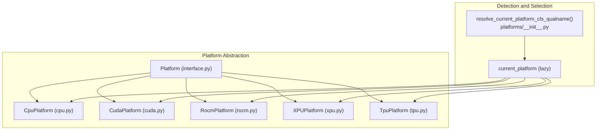
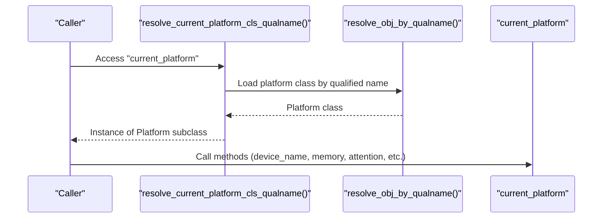
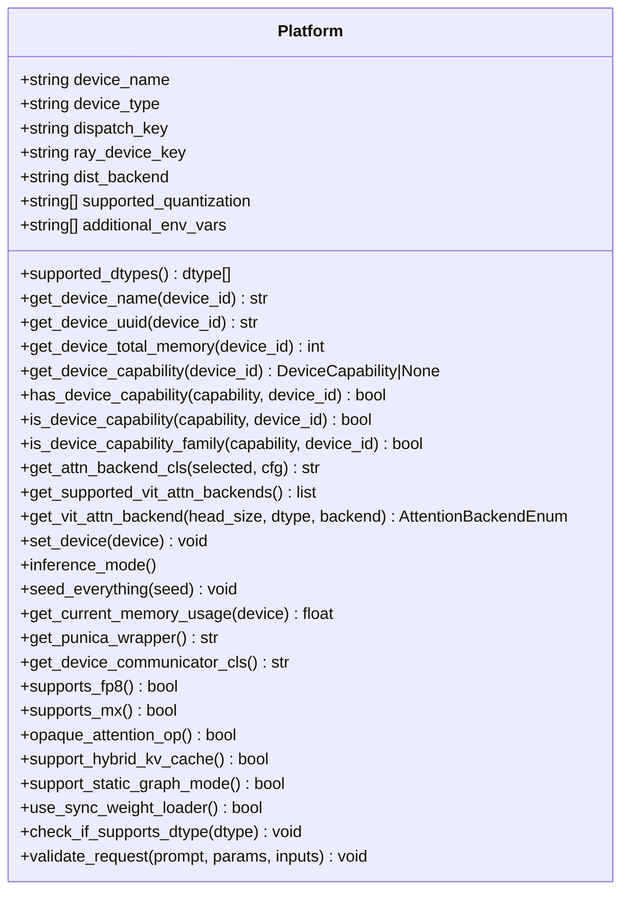
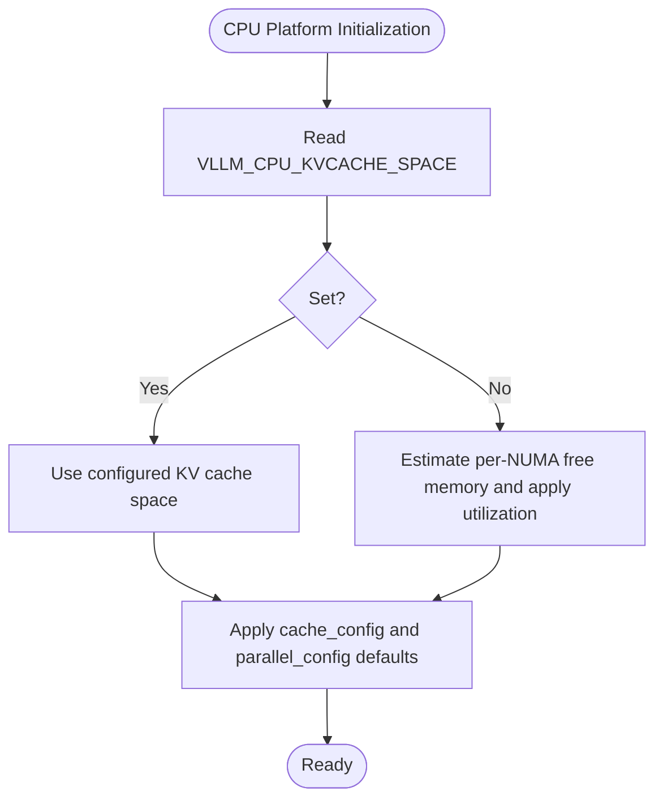
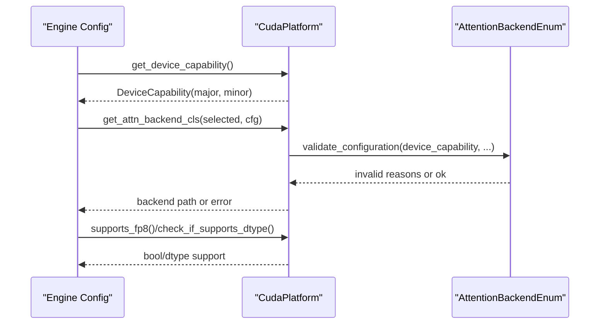
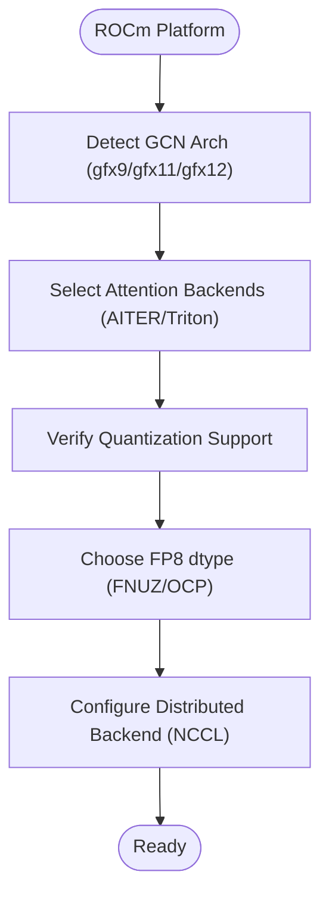
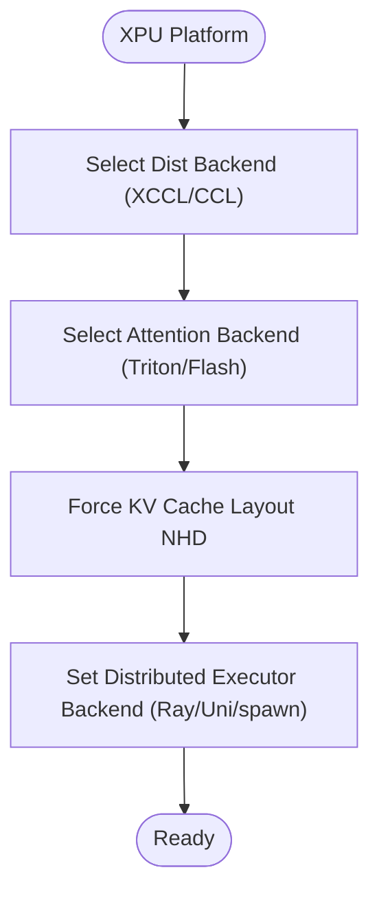
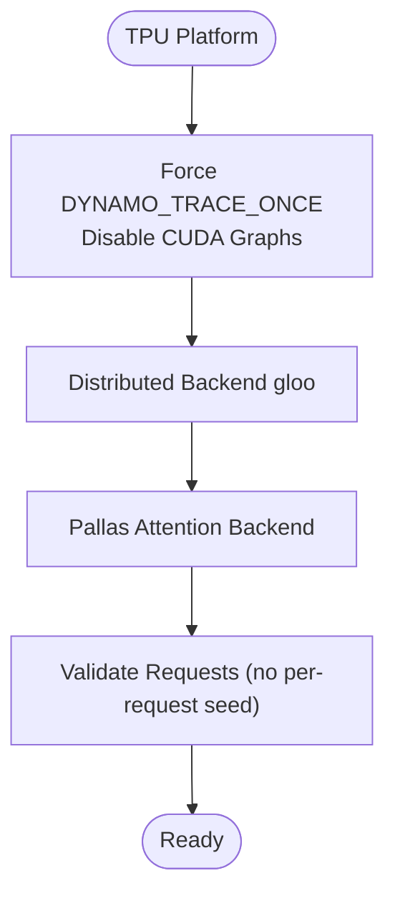
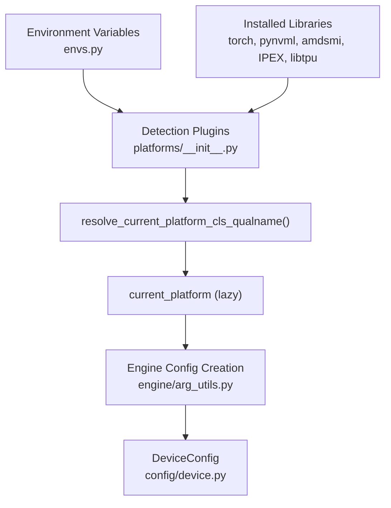

# Platform Support

<cite>
**Referenced Files in This Document**
- [vllm/platforms/interface.py](file://vllm/platforms/interface.py)
- [vllm/platforms/cpu.py](file://vllm/platforms/cpu.py)
- [vllm/platforms/cuda.py](file://vllm/platforms/cuda.py)
- [vllm/platforms/rocm.py](file://vllm/platforms/rocm.py)
- [vllm/platforms/xpu.py](file://vllm/platforms/xpu.py)
- [vllm/platforms/tpu.py](file://vllm/platforms/tpu.py)
- [vllm/platforms/__init__.py](file://vllm/platforms/__init__.py)
- [vllm/utils/platform_utils.py](file://vllm/utils/platform_utils.py)
- [vllm/envs.py](file://vllm/envs.py)
- [vllm/config/device.py](file://vllm/config/device.py)
- [vllm/engine/arg_utils.py](file://vllm/engine/arg_utils.py)
- [vllm/collect_env.py](file://vllm/collect_env.py)
- [setup.py](file://setup.py)
</cite>

## Table of Contents
1. [Introduction](#introduction)
2. [Project Structure](#project-structure)
3. [Core Components](#core-components)
4. [Architecture Overview](#architecture-overview)
5. [Detailed Component Analysis](#detailed-component-analysis)
6. [Dependency Analysis](#dependency-analysis)
7. [Performance Considerations](#performance-considerations)
8. [Troubleshooting Guide](#troubleshooting-guide)
9. [Conclusion](#conclusion)
10. [Appendices](#appendices)

## Introduction
This document explains vLLM’s multi-platform architecture and platform support. It covers the Platform interface and its implementations for CPU, CUDA, ROCm, XPU, and TPU platforms. It details platform detection mechanisms, capability queries, runtime selection logic, hardware-specific optimizations, memory management strategies, and performance characteristics. It also includes configuration examples, platform-specific build requirements, and troubleshooting guidance for common platform detection issues.

## Project Structure
The platform support is centered around a common Platform interface and platform-specific subclasses. Detection and selection are handled by a plugin resolver that activates exactly one platform at runtime.

**Diagram sources**
- [vllm/platforms/interface.py](file://vllm/platforms/interface.py#L100-L200)
- [vllm/platforms/cpu.py](file://vllm/platforms/cpu.py#L70-L120)
- [vllm/platforms/cuda.py](file://vllm/platforms/cuda.py#L96-L140)
- [vllm/platforms/rocm.py](file://vllm/platforms/rocm.py#L160-L210)
- [vllm/platforms/xpu.py](file://vllm/platforms/xpu.py#L25-L40)
- [vllm/platforms/tpu.py](file://vllm/platforms/tpu.py#L37-L60)
- [vllm/platforms/__init__.py](file://vllm/platforms/__init__.py#L191-L231)

**Section sources**
- [vllm/platforms/interface.py](file://vllm/platforms/interface.py#L100-L200)
- [vllm/platforms/__init__.py](file://vllm/platforms/__init__.py#L191-L231)

## Core Components
- Platform interface: Defines capabilities, device queries, attention backend selection, quantization support, memory management hooks, and distributed communication configuration.
- Platform implementations:
  - CPU: CPU-only execution, attention backends, memory configuration, and environment tuning.
  - CUDA: NVML-based device capability detection, attention backend prioritization, FP8 support, static graph mode, and distributed backends.
  - ROCm: AMD SMI-based topology and capability checks, attention backend selection, FP8 dtype handling, and custom allreduce support.
  - XPU: Intel extension for PyTorch (IPEX) integration, attention backend constraints, memory management, and distributed backends.
  - TPU: XLA-based execution, Pallas attention backend, request validation, and memory constraints.
- Detection and selection:
  - Plugin resolver activates exactly one platform based on environment and libraries.
  - Lazy resolution ensures platform plugins are loaded after imports and before use.

Key responsibilities:
- Capability queries: device name, total memory, compute capability, connectivity checks.
- Attention backend selection: platform-aware prioritization and validation.
- Quantization and dtype support: platform-specific constraints and defaults.
- Memory management: platform-specific allocation and peak tracking.
- Distributed communication: platform-specific communicators and backends.

**Section sources**
- [vllm/platforms/interface.py](file://vllm/platforms/interface.py#L100-L200)
- [vllm/platforms/cpu.py](file://vllm/platforms/cpu.py#L70-L120)
- [vllm/platforms/cuda.py](file://vllm/platforms/cuda.py#L96-L140)
- [vllm/platforms/rocm.py](file://vllm/platforms/rocm.py#L160-L210)
- [vllm/platforms/xpu.py](file://vllm/platforms/xpu.py#L25-L40)
- [vllm/platforms/tpu.py](file://vllm/platforms/tpu.py#L37-L60)
- [vllm/platforms/__init__.py](file://vllm/platforms/__init__.py#L191-L231)

## Architecture Overview
The platform architecture separates concerns between:
- Abstraction: Platform defines a uniform API for device capabilities, attention backends, and runtime behaviors.
- Implementations: Each platform subclass tailors behavior to its hardware and software stack.
- Detection: A plugin resolver inspects the environment and available libraries to choose a platform implementation.
- Engine integration: The engine uses the current platform to configure device selection, memory, and attention backends.

**Diagram sources**
- [vllm/platforms/__init__.py](file://vllm/platforms/__init__.py#L191-L231)
- [vllm/platforms/interface.py](file://vllm/platforms/interface.py#L100-L200)

**Section sources**
- [vllm/platforms/__init__.py](file://vllm/platforms/__init__.py#L191-L231)
- [vllm/engine/arg_utils.py](file://vllm/engine/arg_utils.py#L1324-L1330)
- [vllm/config/device.py](file://vllm/config/device.py#L51-L75)

## Detailed Component Analysis

### Platform Interface
The Platform interface defines:
- Device identification and capability queries (name, UUID, total memory).
- Compute capability and comparison helpers (>=, ==, family).
- Attention backend selection and validation.
- Quantization and dtype support.
- Memory management hooks and distributed communicator selection.
- Device-specific inference mode and device assignment.

**Diagram sources**
- [vllm/platforms/interface.py](file://vllm/platforms/interface.py#L100-L200)
- [vllm/platforms/interface.py](file://vllm/platforms/interface.py#L271-L396)

**Section sources**
- [vllm/platforms/interface.py](file://vllm/platforms/interface.py#L100-L200)
- [vllm/platforms/interface.py](file://vllm/platforms/interface.py#L271-L396)

### CPU Platform
Highlights:
- Device control via CPU_VISIBLE_MEMORY_NODES.
- Supported dtypes vary by CPU architecture (e.g., ARM macOS may restrict float16).
- Attention backend selection defaults to CPU-specific backends; MLA and sparse attention are not supported.
- Memory configuration uses VLLM_CPU_KVCACHE_SPACE or estimates per-NUMA memory.
- Distributed backend gloo; multiprocessing method defaults to spawn in CPU environments.
- Hybrid KV cache supported; opaque attention operation enabled.

**Diagram sources**
- [vllm/platforms/cpu.py](file://vllm/platforms/cpu.py#L140-L210)

**Section sources**
- [vllm/platforms/cpu.py](file://vllm/platforms/cpu.py#L70-L120)
- [vllm/platforms/cpu.py](file://vllm/platforms/cpu.py#L140-L210)
- [vllm/platforms/cpu.py](file://vllm/platforms/cpu.py#L396-L422)

### CUDA Platform
Highlights:
- NVML-based or PyTorch-based capability detection; autoselects NVML vs non-NVML path.
- Attention backend prioritization depends on compute capability and MLA usage.
- FP8 support requires compute capability ≥ 8.9; otherwise raises errors for bfloat16.
- Static graph mode supported; custom allreduce enabled.
- Distributed backend NCCL; NVLink connectivity check via NVML.

**Diagram sources**
- [vllm/platforms/cuda.py](file://vllm/platforms/cuda.py#L130-L210)
- [vllm/platforms/cuda.py](file://vllm/platforms/cuda.py#L289-L359)
- [vllm/platforms/cuda.py](file://vllm/platforms/cuda.py#L405-L477)

**Section sources**
- [vllm/platforms/cuda.py](file://vllm/platforms/cuda.py#L96-L140)
- [vllm/platforms/cuda.py](file://vllm/platforms/cuda.py#L130-L210)
- [vllm/platforms/cuda.py](file://vllm/platforms/cuda.py#L289-L359)
- [vllm/platforms/cuda.py](file://vllm/platforms/cuda.py#L405-L477)
- [vllm/platforms/cuda.py](file://vllm/platforms/cuda.py#L482-L619)

### ROCm Platform
Highlights:
- AMD SMI-based device enumeration and topology checks (XGMI 1-hop).
- Attention backend selection with AITER and Triton backends; sparse MLA constraints.
- FP8 dtype selection: FNUZ on gfx94 devices; otherwise OCP FP8.
- Custom allreduce enabled for MI300-series; hybrid KV cache supported.
- Quantization support includes several backends; AWQ forces Triton AWQ.

**Diagram sources**
- [vllm/platforms/rocm.py](file://vllm/platforms/rocm.py#L160-L210)
- [vllm/platforms/rocm.py](file://vllm/platforms/rocm.py#L299-L336)
- [vllm/platforms/rocm.py](file://vllm/platforms/rocm.py#L490-L510)

**Section sources**
- [vllm/platforms/rocm.py](file://vllm/platforms/rocm.py#L160-L210)
- [vllm/platforms/rocm.py](file://vllm/platforms/rocm.py#L299-L336)
- [vllm/platforms/rocm.py](file://vllm/platforms/rocm.py#L490-L510)
- [vllm/platforms/rocm.py](file://vllm/platforms/rocm.py#L512-L562)

### XPU Platform
Highlights:
- IPEX availability and XCCL/CCL backend selection.
- Attention backend constrained to Triton/Flash Attention; sparse attention not supported.
- KV cache layout forced to NHD; static graph mode disabled.
- Distributed executor backend defaults to Ray/Uni; spawn required for multiprocessing.
- FP8 dtype set to E5M2; device count via torch.xpu.

**Diagram sources**
- [vllm/platforms/xpu.py](file://vllm/platforms/xpu.py#L25-L40)
- [vllm/platforms/xpu.py](file://vllm/platforms/xpu.py#L43-L71)
- [vllm/platforms/xpu.py](file://vllm/platforms/xpu.py#L139-L205)

**Section sources**
- [vllm/platforms/xpu.py](file://vllm/platforms/xpu.py#L25-L40)
- [vllm/platforms/xpu.py](file://vllm/platforms/xpu.py#L139-L205)
- [vllm/platforms/xpu.py](file://vllm/platforms/xpu.py#L225-L241)

### TPU Platform
Highlights:
- XLA/OpenXLA backend; Pallas attention backend enforced.
- Request validation: per-request seed not supported.
- Compilation mode forced to DYNAMO_TRACE_ONCE; CUDA graphs disabled.
- Distributed backend gloo; device control via TPU_VISIBLE_CHIPS.
- Memory constraints and KV cache page size derived from Pallas backend.

**Diagram sources**
- [vllm/platforms/tpu.py](file://vllm/platforms/tpu.py#L37-L60)
- [vllm/platforms/tpu.py](file://vllm/platforms/tpu.py#L133-L214)

**Section sources**
- [vllm/platforms/tpu.py](file://vllm/platforms/tpu.py#L37-L60)
- [vllm/platforms/tpu.py](file://vllm/platforms/tpu.py#L133-L214)
- [vllm/platforms/tpu.py](file://vllm/platforms/tpu.py#L224-L241)

## Dependency Analysis
Platform detection and selection depend on:
- Environment variables and installed libraries.
- Lazy resolution of current_platform to avoid premature imports.
- Engine integration via DeviceConfig and VllmConfig creation.

**Diagram sources**
- [vllm/envs.py](file://vllm/envs.py#L452-L520)
- [vllm/platforms/__init__.py](file://vllm/platforms/__init__.py#L191-L231)
- [vllm/engine/arg_utils.py](file://vllm/engine/arg_utils.py#L1324-L1330)
- [vllm/config/device.py](file://vllm/config/device.py#L51-L75)

**Section sources**
- [vllm/envs.py](file://vllm/envs.py#L452-L520)
- [vllm/platforms/__init__.py](file://vllm/platforms/__init__.py#L191-L231)
- [vllm/engine/arg_utils.py](file://vllm/engine/arg_utils.py#L1324-L1330)
- [vllm/config/device.py](file://vllm/config/device.py#L51-L75)

## Performance Considerations
- CUDA:
  - FP8 support requires compute capability ≥ 8.9.
  - Static graph mode enabled; attention backend prioritization improves throughput.
  - NVLink connectivity check helps optimize multi-GPU setups.
- ROCm:
  - AITER backends and custom allreduce enabled on MI300-series improve performance.
  - FP8 FNUZ on gfx94 devices leverages native hardware support.
- XPU:
  - Static graph mode disabled; focus on attention backends and KV cache layout.
  - Distributed backends tuned for Intel ecosystems.
- TPU:
  - OpenXLA compilation and Pallas attention tuned for TPU performance.
  - Request validation prevents unsupported configurations.

[No sources needed since this section provides general guidance]

## Troubleshooting Guide
Common issues and resolutions:
- Unspecified platform detected:
  - Symptom: current_platform falls back to UnspecifiedPlatform.
  - Causes: missing platform libraries or mismatched wheel builds.
  - Resolution: ensure correct platform wheel/installation and environment variables.
- CUDA detection failures:
  - Symptom: CUDA platform not detected on Jetson or when NVML unavailable.
  - Resolution: Jetson path is supported; ensure torch.cuda availability and wheel compatibility.
- ROCm device visibility:
  - Symptom: HIP_VISIBLE_DEVICES conflicts with CUDA_VISIBLE_DEVICES.
  - Resolution: Keep them synchronized; platform enforces consistency.
- XPU distributed executor:
  - Symptom: multiprocessing backend not supported.
  - Resolution: use spawn or switch to Ray/Uni backends.
- TPU request validation:
  - Symptom: per-request seed raises errors.
  - Resolution: remove per-request seed; use global seeding instead.

**Section sources**
- [vllm/platforms/__init__.py](file://vllm/platforms/__init__.py#L191-L231)
- [vllm/platforms/rocm.py](file://vllm/platforms/rocm.py#L65-L72)
- [vllm/platforms/xpu.py](file://vllm/platforms/xpu.py#L169-L205)
- [vllm/platforms/tpu.py](file://vllm/platforms/tpu.py#L224-L241)

## Conclusion
vLLM’s platform support is built on a flexible Platform abstraction with concrete implementations tailored to CPU, CUDA, ROCm, XPU, and TPU. The detection mechanism ensures a single platform is activated at runtime, while the engine integrates platform-specific capabilities for attention backends, memory management, and distributed communication. Understanding platform-specific behaviors, capability queries, and configuration options is essential for optimal performance and reliability across diverse hardware.

[No sources needed since this section summarizes without analyzing specific files]

## Appendices

### Platform Detection Logic
- Detection plugins probe for platform libraries and environment conditions.
- Exactly one platform plugin is allowed to be active; out-of-tree plugins are supported.
- UnspecifiedPlatform is used when no plugin matches.

**Section sources**
- [vllm/platforms/__init__.py](file://vllm/platforms/__init__.py#L191-L231)

### Capability Queries and Validation
- Device capability comparisons and equality checks.
- Dtype and quantization support checks per platform.
- Attention backend validation and selection.

**Section sources**
- [vllm/platforms/interface.py](file://vllm/platforms/interface.py#L271-L396)
- [vllm/platforms/cuda.py](file://vllm/platforms/cuda.py#L405-L477)
- [vllm/platforms/rocm.py](file://vllm/platforms/rocm.py#L490-L510)
- [vllm/platforms/xpu.py](file://vllm/platforms/xpu.py#L225-L241)
- [vllm/platforms/tpu.py](file://vllm/platforms/tpu.py#L133-L214)

### Memory Management Strategies
- CUDA: reset peak memory stats and track allocated memory.
- ROCm: compute free memory from torch.cuda APIs.
- XPU: reset peak memory and track allocated memory.
- TPU: uses XLA buffers; special handling for block transfers.

**Section sources**
- [vllm/platforms/cuda.py](file://vllm/platforms/cuda.py#L251-L257)
- [vllm/platforms/rocm.py](file://vllm/platforms/rocm.py#L477-L482)
- [vllm/platforms/xpu.py](file://vllm/platforms/xpu.py#L219-L224)
- [vllm/platforms/tpu.py](file://vllm/platforms/tpu.py#L241-L264)

### Configuration Examples and Build Requirements
- Target device selection and platform-specific environment variables:
  - VLLM_TARGET_DEVICE controls installation-time target device.
  - Platform-specific environment variables include CUDA_VISIBLE_DEVICES, HIP_VISIBLE_DEVICES, ZE_AFFINITY_MASK, TPU_VISIBLE_CHIPS, and ROCm/XPU toggles.
- Build requirements:
  - Linux/macOS supported; macOS defaults VLLM_TARGET_DEVICE to CPU unless explicitly set.
  - CUDA wheel requires NVML; ROCm requires AMD SMI; XPU requires IPEX; TPU requires libtpu or tpu_inference.

**Section sources**
- [setup.py](file://setup.py#L40-L62)
- [vllm/envs.py](file://vllm/envs.py#L452-L520)
- [vllm/platforms/__init__.py](file://vllm/platforms/__init__.py#L101-L188)
- [vllm/collect_env.py](file://vllm/collect_env.py#L410-L430)

### Practical Examples
- Platform switching:
  - Ensure environment variables match target platform (e.g., CUDA_VISIBLE_DEVICES for CUDA).
  - Reinstall vLLM wheel appropriate for the target platform.
- Custom platform implementation:
  - Implement a subclass of Platform and register it as an out-of-tree plugin; only one platform plugin can be active.
- Hardware capability verification:
  - Use current_platform.get_device_capability() and current_platform.check_if_supports_dtype() to validate runtime configuration.

**Section sources**
- [vllm/platforms/__init__.py](file://vllm/platforms/__init__.py#L191-L231)
- [vllm/utils/platform_utils.py](file://vllm/utils/platform_utils.py#L47-L60)