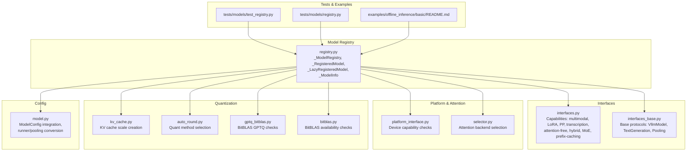
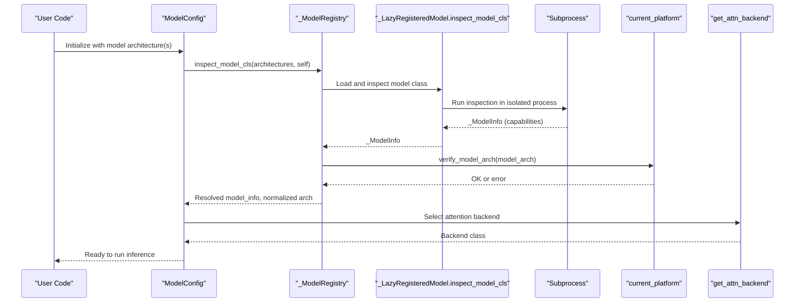
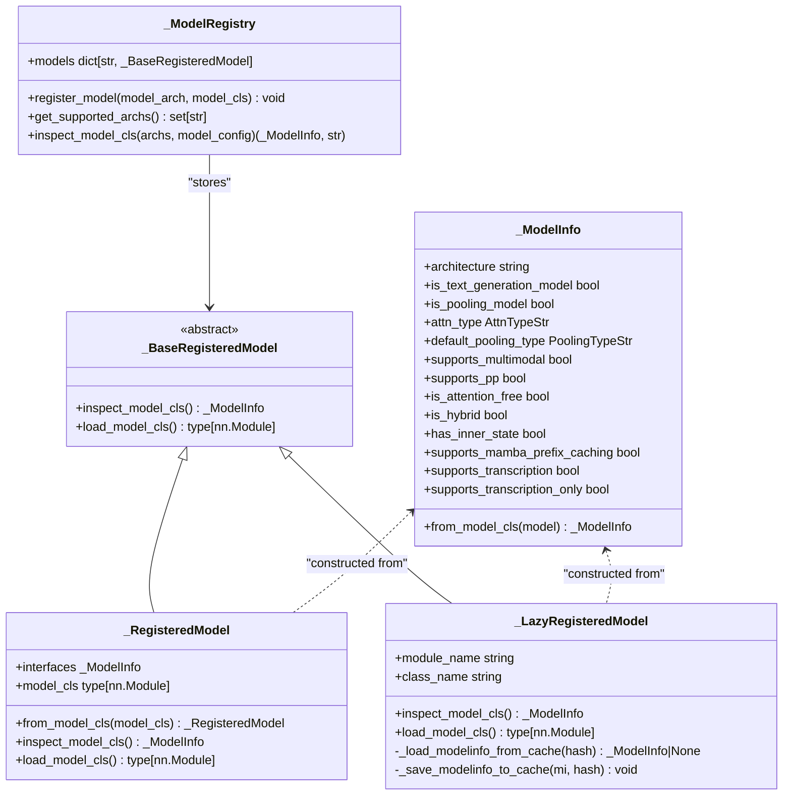
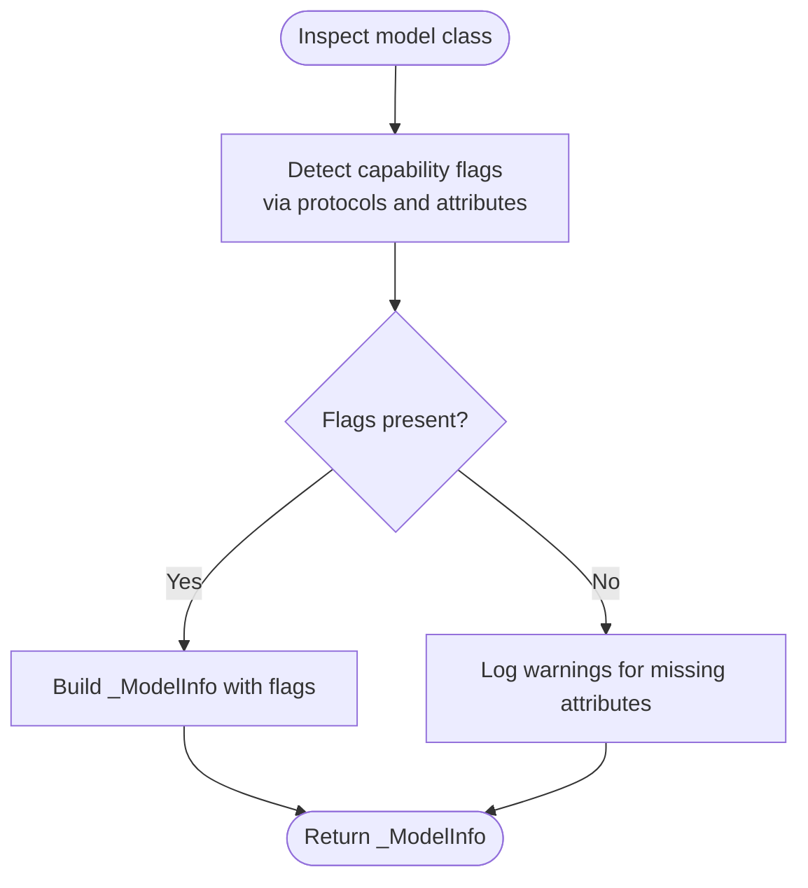
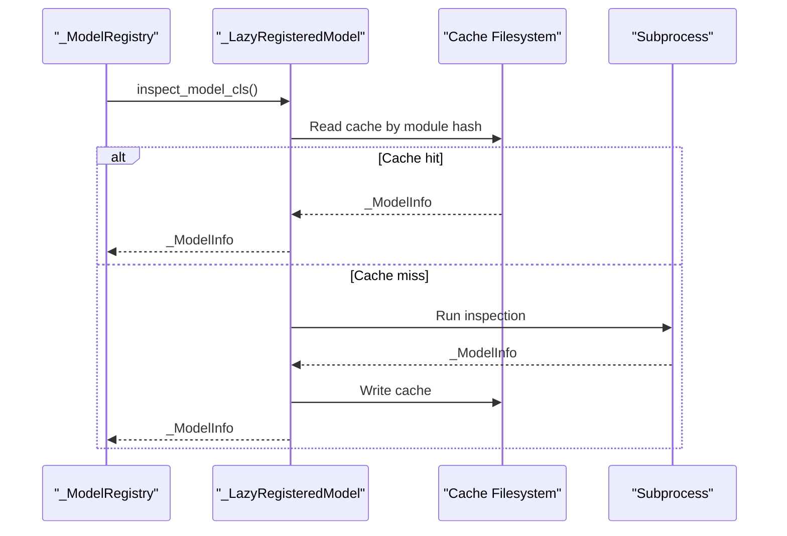
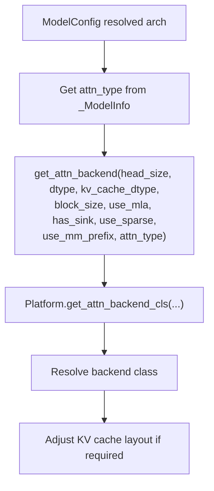
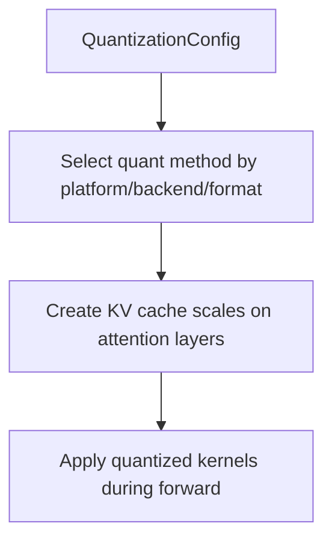
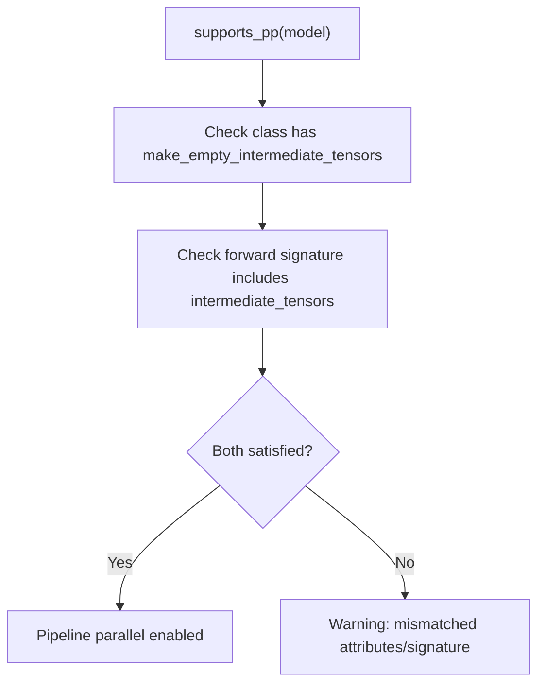
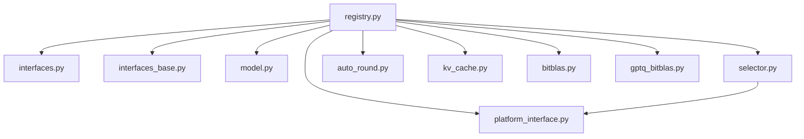

# Custom Model Registration

<cite>
**Referenced Files in This Document**
- [registry.py](file://vllm/model_executor/models/registry.py)
- [interfaces.py](file://vllm/model_executor/models/interfaces.py)
- [interfaces_base.py](file://vllm/model_executor/models/interfaces_base.py)
- [selector.py](file://vllm/attention/selector.py)
- [test_registry.py](file://tests/models/test_registry.py)
- [registry.py (tests)](file://tests/models/registry.py)
- [__init__.py](file://vllm/model_executor/models/__init__.py)
- [model.py](file://vllm/config/model.py)
- [platform_interface.py](file://vllm/platforms/interface.py)
- [kv_cache.py](file://vllm/model_executor/layers/quantization/kv_cache.py)
- [auto_round.py](file://vllm/model_executor/layers/quantization/auto_round.py)
- [gptq_bitblas.py](file://vllm/model_executor/layers/quantization/gptq_bitblas.py)
- [bitblas.py](file://vllm/model_executor/layers/quantization/bitblas.py)
- [README.md](file://examples/offline_inference/basic/README.md)
</cite>

## Table of Contents
1. [Introduction](#introduction)
2. [Project Structure](#project-structure)
3. [Core Components](#core-components)
4. [Architecture Overview](#architecture-overview)
5. [Detailed Component Analysis](#detailed-component-analysis)
6. [Dependency Analysis](#dependency-analysis)
7. [Performance Considerations](#performance-considerations)
8. [Troubleshooting Guide](#troubleshooting-guide)
9. [Conclusion](#conclusion)
10. [Appendices](#appendices)

## Introduction
This document explains how to register custom model architectures into the vLLM ecosystem. It covers the model registry system, model interface requirements, capability flags, feature detection, inspection and lazy-loading mechanisms, caching strategies for model metadata, and how registration affects attention backend selection, quantization compatibility, and distributed inference. Practical examples demonstrate integrating custom transformer models, multimodal architectures, and specialized inference models.

## Project Structure
The model registration and capability detection system spans several modules:
- Registry and capability inspection: vllm/model_executor/models/registry.py
- Capability flags and protocol interfaces: vllm/model_executor/models/interfaces.py and interfaces_base.py
- Attention backend selection: vllm/attention/selector.py
- Platform capability verification: vllm/platforms/interface.py
- Quantization integration points: vllm/model_executor/layers/quantization/*
- Model configuration integration: vllm/config/model.py
- Tests and examples: tests/models/* and examples/*

**Diagram sources**
- [registry.py](file://vllm/model_executor/models/registry.py#L527-L748)
- [interfaces.py](file://vllm/model_executor/models/interfaces.py#L72-L215)
- [interfaces_base.py](file://vllm/model_executor/models/interfaces_base.py#L44-L198)
- [selector.py](file://vllm/attention/selector.py#L46-L118)
- [platform_interface.py](file://vllm/platforms/interface.py#L279-L323)
- [kv_cache.py](file://vllm/model_executor/layers/quantization/kv_cache.py#L27-L53)
- [auto_round.py](file://vllm/model_executor/layers/quantization/auto_round.py#L438-L454)
- [gptq_bitblas.py](file://vllm/model_executor/layers/quantization/gptq_bitblas.py#L80-L107)
- [bitblas.py](file://vllm/model_executor/layers/quantization/bitblas.py#L45-L84)
- [model.py](file://vllm/config/model.py#L494-L519)
- [test_registry.py](file://tests/models/test_registry.py#L30-L121)
- [registry.py (tests)](file://tests/models/registry.py#L982-L1025)
- [README.md](file://examples/offline_inference/basic/README.md#L1-L81)

**Section sources**
- [registry.py](file://vllm/model_executor/models/registry.py#L527-L748)
- [interfaces.py](file://vllm/model_executor/models/interfaces.py#L72-L215)
- [interfaces_base.py](file://vllm/model_executor/models/interfaces_base.py#L44-L198)
- [selector.py](file://vllm/attention/selector.py#L46-L118)
- [platform_interface.py](file://vllm/platforms/interface.py#L279-L323)
- [kv_cache.py](file://vllm/model_executor/layers/quantization/kv_cache.py#L27-L53)
- [auto_round.py](file://vllm/model_executor/layers/quantization/auto_round.py#L438-L454)
- [gptq_bitblas.py](file://vllm/model_executor/layers/quantization/gptq_bitblas.py#L80-L107)
- [bitblas.py](file://vllm/model_executor/layers/quantization/bitblas.py#L45-L84)
- [model.py](file://vllm/config/model.py#L494-L519)
- [test_registry.py](file://tests/models/test_registry.py#L30-L121)
- [registry.py (tests)](file://tests/models/registry.py#L982-L1025)
- [README.md](file://examples/offline_inference/basic/README.md#L1-L81)

## Core Components
- Model registry and registration API:
  - _ModelRegistry: stores model architectures and their registered handlers (_RegisteredModel or _LazyRegisteredModel).
  - _RegisteredModel: wraps an already-imported model class and its _ModelInfo.
  - _LazyRegisteredModel: enables lazy import via module:class string, with inspection and caching.
  - _ModelInfo: encapsulates capability flags and metadata derived from a model class.
- Capability detection:
  - Interfaces in interfaces.py define capability flags (multimodal, LoRA, PP, transcription, attention-free, hybrid, MoE, prefix-caching, cross-encoding, no-ops).
  - Base interfaces in interfaces_base.py define minimal model contract and decorators for pooling/attention type defaults.
- Inspection and lazy loading:
  - LazyRegisteredModel inspects a model class in a subprocess to avoid CUDA initialization in the parent process.
  - Caching of _ModelInfo persists across runs keyed by module hash.
- Attention backend selection:
  - selector.get_attn_backend chooses the appropriate backend based on dtype, head size, KV cache dtype, and platform capabilities.
- Platform capability verification:
  - Platforms verify device capability compatibility before loading a model architecture.
- Quantization compatibility:
  - Quantization backends select appropriate methods based on platform and packing format.
- Model configuration integration:
  - ModelConfig resolves architecture and runner/pooling conversions, invoking registry inspection early.

**Section sources**
- [registry.py](file://vllm/model_executor/models/registry.py#L527-L748)
- [interfaces.py](file://vllm/model_executor/models/interfaces.py#L72-L215)
- [interfaces_base.py](file://vllm/model_executor/models/interfaces_base.py#L44-L198)
- [selector.py](file://vllm/attention/selector.py#L46-L118)
- [platform_interface.py](file://vllm/platforms/interface.py#L279-L323)
- [model.py](file://vllm/config/model.py#L494-L519)

## Architecture Overview
The registration and runtime flow integrates model discovery, capability inspection, backend selection, and platform validation.

**Diagram sources**
- [model.py](file://vllm/config/model.py#L494-L519)
- [registry.py](file://vllm/model_executor/models/registry.py#L745-L936)
- [registry.py](file://vllm/model_executor/models/registry.py#L676-L743)
- [platform_interface.py](file://vllm/platforms/interface.py#L279-L323)
- [selector.py](file://vllm/attention/selector.py#L46-L118)

## Detailed Component Analysis

### Model Registry and Registration API
- Registration accepts either:
  - A direct PyTorch module class (subclass of nn.Module).
  - A string "<module>:<class>" for lazy import.
- Overwrites are warned; supports normalization via architecture defaults.
- Provides inspection and loading helpers with LRU caching and subprocess isolation.

**Diagram sources**
- [registry.py](file://vllm/model_executor/models/registry.py#L527-L748)

**Section sources**
- [registry.py](file://vllm/model_executor/models/registry.py#L745-L936)
- [registry.py](file://vllm/model_executor/models/registry.py#L576-L748)

### Capability Flags and Feature Detection
- Capability flags are detected via protocol checks and class attributes:
  - Multimodal: supports_multimodal, supports_multimodal_raw_input_only, supports_encoder_tp_data
  - Pipeline parallel: supports_pp with forward signature acceptance of intermediate_tensors
  - LoRA: supports_lora with required mappings
  - Transcription: supports_transcription and supports_transcription_only
  - Attention characteristics: is_attention_free, is_hybrid, supports_mamba_prefix_caching
  - Others: has_inner_state, has_noops, supports_cross_encoding
- Decorators and helpers set defaults for pooling and attention types.

**Diagram sources**
- [interfaces.py](file://vllm/model_executor/models/interfaces.py#L72-L215)
- [interfaces_base.py](file://vllm/model_executor/models/interfaces_base.py#L111-L198)

**Section sources**
- [interfaces.py](file://vllm/model_executor/models/interfaces.py#L72-L215)
- [interfaces_base.py](file://vllm/model_executor/models/interfaces_base.py#L111-L198)

### Model Inspection, Lazy Loading, and Caching
- LazyRegisteredModel:
  - Uses module hash to locate cache file.
  - Loads cached _ModelInfo if hash matches; otherwise inspects in a subprocess.
  - Saves _ModelInfo to cache after successful inspection.
- LRU caching:
  - _try_inspect_model_cls and _try_load_model_cls cache results to avoid repeated inspection/loading.
- Subprocess isolation:
  - Prevents CUDA initialization in the parent process during inspection.

**Diagram sources**
- [registry.py](file://vllm/model_executor/models/registry.py#L622-L711)

**Section sources**
- [registry.py](file://vllm/model_executor/models/registry.py#L622-L711)
- [registry.py](file://vllm/model_executor/models/registry.py#L718-L743)

### Attention Backend Selection and Model Registration
- Attention backend selection depends on dtype, head size, KV cache dtype, block size, and attention type.
- Platform determines backend class and may adjust KV cache layout.
- Registration indirectly influences backend choice via model’s attn_type and attention-free/hybrid flags.

**Diagram sources**
- [selector.py](file://vllm/attention/selector.py#L46-L118)
- [registry.py](file://vllm/model_executor/models/registry.py#L527-L575)

**Section sources**
- [selector.py](file://vllm/attention/selector.py#L46-L118)
- [registry.py](file://vllm/model_executor/models/registry.py#L527-L575)

### Quantization Compatibility and Model Registration
- Quantization backends choose methods based on platform and packing format.
- KV cache scales are initialized for attention layers to support quantized KV caches.
- BitBLAS availability and minimum versions are validated before use.

**Diagram sources**
- [auto_round.py](file://vllm/model_executor/layers/quantization/auto_round.py#L438-L454)
- [kv_cache.py](file://vllm/model_executor/layers/quantization/kv_cache.py#L27-L53)
- [bitblas.py](file://vllm/model_executor/layers/quantization/bitblas.py#L45-L84)
- [gptq_bitblas.py](file://vllm/model_executor/layers/quantization/gptq_bitblas.py#L80-L107)

**Section sources**
- [auto_round.py](file://vllm/model_executor/layers/quantization/auto_round.py#L438-L454)
- [kv_cache.py](file://vllm/model_executor/layers/quantization/kv_cache.py#L27-L53)
- [bitblas.py](file://vllm/model_executor/layers/quantization/bitblas.py#L45-L84)
- [gptq_bitblas.py](file://vllm/model_executor/layers/quantization/gptq_bitblas.py#L80-L107)

### Distributed Inference Capabilities
- Pipeline parallel support is indicated by supports_pp and verified by checking forward signature for intermediate_tensors.
- Tests validate PP support for specific architectures and ensure CUDA is not initialized during inspection.

**Diagram sources**
- [interfaces.py](file://vllm/model_executor/models/interfaces.py#L440-L510)
- [test_registry.py](file://tests/models/test_registry.py#L83-L110)

**Section sources**
- [interfaces.py](file://vllm/model_executor/models/interfaces.py#L440-L510)
- [test_registry.py](file://tests/models/test_registry.py#L83-L110)

### Practical Examples

#### Example 1: Registering a Custom Transformer Model
Steps:
- Define a PyTorch nn.Module subclass implementing the vLLM model contract (init with vllm_config, embed_input_ids, forward with input_ids and positions).
- Optionally implement capability flags (e.g., supports_multimodal, supports_pp).
- Register the model via the registry API with a model_arch string and either the class or "<module>:<class>" string.

References:
- [__init__.py](file://vllm/model_executor/models/__init__.py#L1-L44)
- [registry.py](file://vllm/model_executor/models/registry.py#L753-L798)

#### Example 2: Integrating a Multimodal Architecture
Steps:
- Implement SupportsMultiModal and related flags.
- Provide get_language_model and embed_input_ids to merge text and multimodal embeddings.
- Register the model and rely on multimodal limits and processors.

References:
- [interfaces.py](file://vllm/model_executor/models/interfaces.py#L72-L215)
- [registry.py](file://vllm/model_executor/models/registry.py#L753-L798)

#### Example 3: Specialized Inference (Pooling/Sequence Classification)
Steps:
- Implement VllmModelForPooling and set default_pooling_type and attn_type.
- Register the model; ModelConfig will convert it appropriately for pooling runners.

References:
- [interfaces_base.py](file://vllm/model_executor/models/interfaces_base.py#L145-L198)
- [model.py](file://vllm/config/model.py#L494-L519)

#### Example 4: Using Quantized Models
Steps:
- Choose a quantization backend compatible with your platform.
- Ensure KV cache scales are initialized for attention layers if needed.
- Validate BitBLAS version if using BitBLAS-backed quantization.

References:
- [kv_cache.py](file://vllm/model_executor/layers/quantization/kv_cache.py#L27-L53)
- [auto_round.py](file://vllm/model_executor/layers/quantization/auto_round.py#L438-L454)
- [bitblas.py](file://vllm/model_executor/layers/quantization/bitblas.py#L45-L84)
- [gptq_bitblas.py](file://vllm/model_executor/layers/quantization/gptq_bitblas.py#L80-L107)
- [README.md](file://examples/offline_inference/basic/README.md#L53-L81)

## Dependency Analysis
- Coupling:
  - Registry depends on interfaces for capability detection and on platform for device capability checks.
  - Attention backend selection depends on platform-provided backend classes and configuration.
  - Quantization backends depend on platform and optional libraries (e.g., BitBLAS).
- Cohesion:
  - Capability flags are centralized in interfaces.py and interfaces_base.py.
  - Lazy loading and caching are encapsulated in _LazyRegisteredModel.
- External dependencies:
  - Subprocess-based inspection avoids CUDA initialization in the parent process.
  - Platform abstraction ensures backend selection adapts to device capabilities.

**Diagram sources**
- [registry.py](file://vllm/model_executor/models/registry.py#L527-L748)
- [interfaces.py](file://vllm/model_executor/models/interfaces.py#L72-L215)
- [interfaces_base.py](file://vllm/model_executor/models/interfaces_base.py#L44-L198)
- [platform_interface.py](file://vllm/platforms/interface.py#L279-L323)
- [selector.py](file://vllm/attention/selector.py#L46-L118)
- [auto_round.py](file://vllm/model_executor/layers/quantization/auto_round.py#L438-L454)
- [kv_cache.py](file://vllm/model_executor/layers/quantization/kv_cache.py#L27-L53)
- [bitblas.py](file://vllm/model_executor/layers/quantization/bitblas.py#L45-L84)
- [gptq_bitblas.py](file://vllm/model_executor/layers/quantization/gptq_bitblas.py#L80-L107)
- [model.py](file://vllm/config/model.py#L494-L519)

**Section sources**
- [registry.py](file://vllm/model_executor/models/registry.py#L527-L748)
- [interfaces.py](file://vllm/model_executor/models/interfaces.py#L72-L215)
- [interfaces_base.py](file://vllm/model_executor/models/interfaces_base.py#L44-L198)
- [platform_interface.py](file://vllm/platforms/interface.py#L279-L323)
- [selector.py](file://vllm/attention/selector.py#L46-L118)
- [auto_round.py](file://vllm/model_executor/layers/quantization/auto_round.py#L438-L454)
- [kv_cache.py](file://vllm/model_executor/layers/quantization/kv_cache.py#L27-L53)
- [bitblas.py](file://vllm/model_executor/layers/quantization/bitblas.py#L45-L84)
- [gptq_bitblas.py](file://vllm/model_executor/layers/quantization/gptq_bitblas.py#L80-L107)
- [model.py](file://vllm/config/model.py#L494-L519)

## Performance Considerations
- Lazy loading and caching reduce repeated inspection costs and prevent CUDA initialization overhead in the parent process.
- LRU caching of inspection and loading results minimizes redundant work.
- Attention backend selection is cached to avoid repeated resolution.

[No sources needed since this section provides general guidance]

## Troubleshooting Guide
Common issues and debugging techniques:
- Unsupported or previously supported architectures:
  - The registry raises explicit errors for unsupported or deprecated architectures, guiding users to older versions or updates.
- CUDA initialization during import:
  - LazyRegisteredModel inspects models in a subprocess to avoid CUDA initialization in the parent process.
- Pipeline parallel mismatches:
  - Tests validate supports_pp and forward signature; warnings are logged when attributes/signature mismatch.
- Quantization backend errors:
  - BitBLAS version checks and platform-specific backends surface clear errors when incompatible.

References:
- [registry.py](file://vllm/model_executor/models/registry.py#L799-L822)
- [registry.py](file://vllm/model_executor/models/registry.py#L676-L711)
- [test_registry.py](file://tests/models/test_registry.py#L83-L110)
- [bitblas.py](file://vllm/model_executor/layers/quantization/bitblas.py#L45-L84)
- [gptq_bitblas.py](file://vllm/model_executor/layers/quantization/gptq_bitblas.py#L80-L107)

**Section sources**
- [registry.py](file://vllm/model_executor/models/registry.py#L799-L822)
- [registry.py](file://vllm/model_executor/models/registry.py#L676-L711)
- [test_registry.py](file://tests/models/test_registry.py#L83-L110)
- [bitblas.py](file://vllm/model_executor/layers/quantization/bitblas.py#L45-L84)
- [gptq_bitblas.py](file://vllm/model_executor/layers/quantization/gptq_bitblas.py#L80-L107)

## Conclusion
vLLM’s model registration system provides a robust framework for integrating custom architectures. By adhering to capability flags and interfaces, leveraging lazy loading and caching, and aligning with platform and attention backend selection, developers can seamlessly add new models. Quantization compatibility and distributed inference features are naturally supported through the registry’s inspection and platform abstractions.

[No sources needed since this section summarizes without analyzing specific files]

## Appendices

### Best Practices for Model Integration
- Implement required model interfaces and capability flags explicitly.
- Use lazy registration (<module>:<class>) to avoid CUDA initialization during import.
- Keep model inspection lightweight; rely on cached _ModelInfo.
- Validate platform compatibility before loading.
- Ensure attention type and pooling defaults are set appropriately for your model.

[No sources needed since this section provides general guidance]