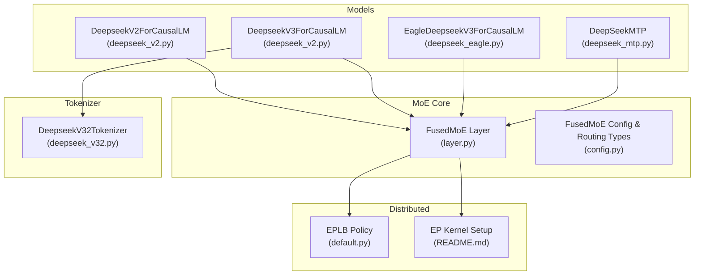
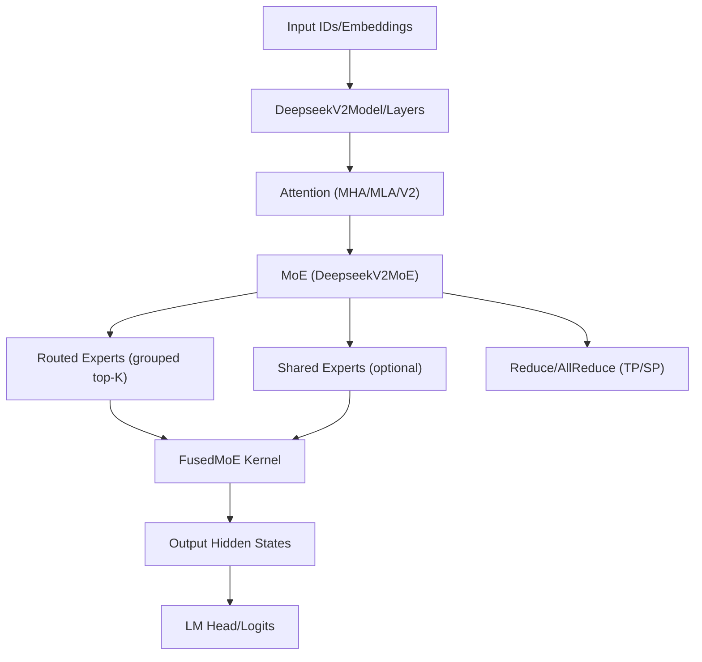
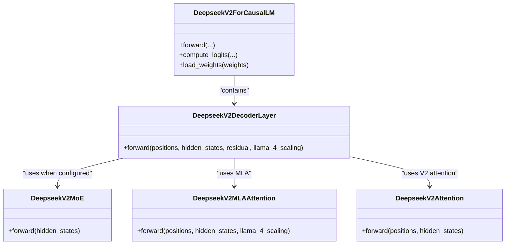
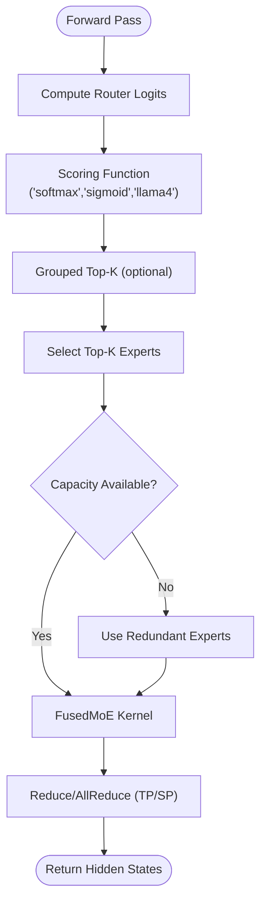
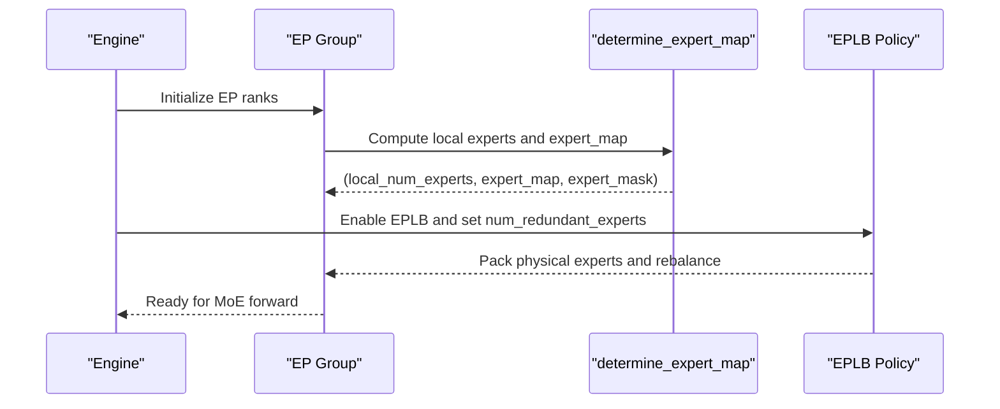
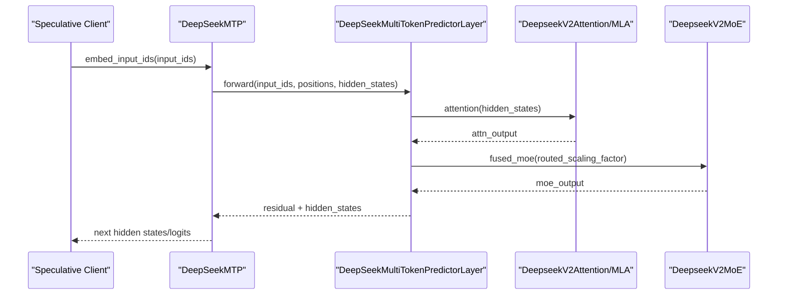
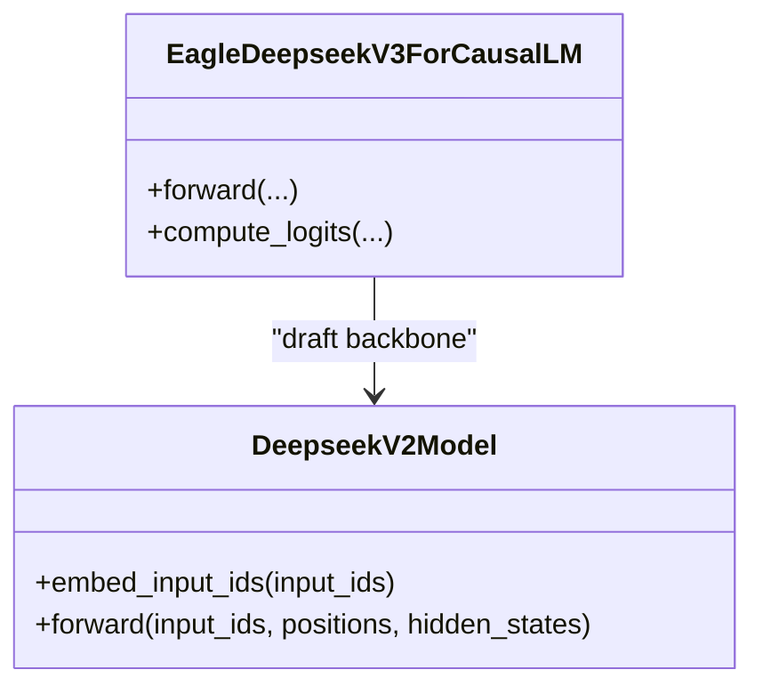
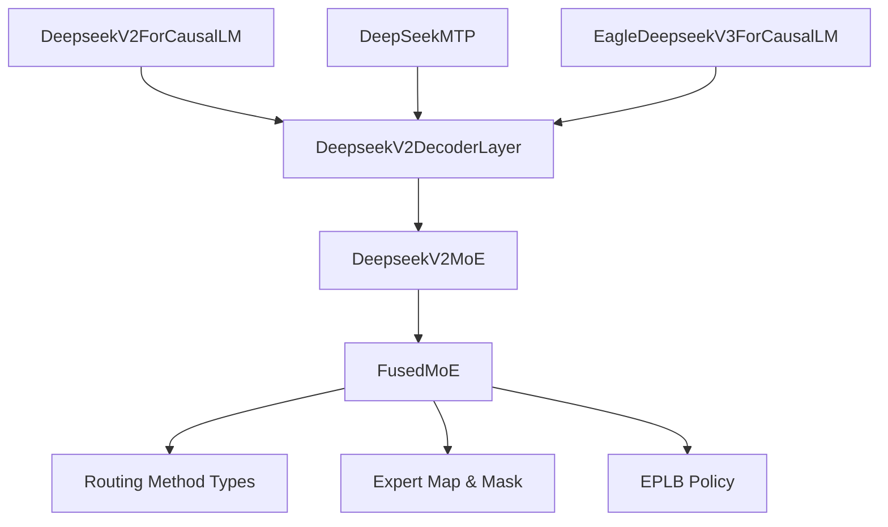

# DeepSeek Mixture-of-Experts

<cite>
**Referenced Files in This Document**
- [deepseek_v2.py](file://vllm/model_executor/models/deepseek_v2.py)
- [deepseek_mtp.py](file://vllm/model_executor/models/deepseek_mtp.py)
- [deepseek_eagle.py](file://vllm/model_executor/models/deepseek_eagle.py)
- [eagle.py](file://vllm/transformers_utils/configs/eagle.py)
- [layer.py](file://vllm/model_executor/layers/fused_moe/layer.py)
- [config.py](file://vllm/model_executor/layers/fused_moe/config.py)
- [default.py](file://vllm/distributed/eplb/policy/default.py)
- [test_expert_placement.py](file://tests/distributed/test_expert_placement.py)
- [deepseek_v32.py](file://vllm/tokenizers/deepseek_v32.py)
- [README.md](file://tools/ep_kernels/README.md)
- [expert_parallel_deployment.md](file://docs/serving/expert_parallel_deployment.md)
- [optimization.md](file://docs/configuration/optimization.md)
</cite>

## Table of Contents
1. [Introduction](#introduction)
2. [Project Structure](#project-structure)
3. [Core Components](#core-components)
4. [Architecture Overview](#architecture-overview)
5. [Detailed Component Analysis](#detailed-component-analysis)
6. [Dependency Analysis](#dependency-analysis)
7. [Performance Considerations](#performance-considerations)
8. [Troubleshooting Guide](#troubleshooting-guide)
9. [Conclusion](#conclusion)
10. [Appendices](#appendices)

## Introduction
This document explains DeepSeek Mixture-of-Experts (MoE) models in vLLM, focusing on DeepSeek V2, V3, and specialized variants such as Eagle and MTP. It covers the DeepSeek architecture variants, expert routing and capacity management, grouped expert parallelism, expert sharing strategies, and how these integrate with vLLM’s distributed inference capabilities. Practical guidance is included for configuration, expert utilization monitoring, and scaling considerations across DeepSeek variants.

## Project Structure
DeepSeek MoE support in vLLM spans model definitions, fused MoE layers, tokenizer adaptations, and distributed expert placement/load-balancing utilities:
- Model implementations: DeepSeek V2/V3 causal LM, Eagle draft model, and MTP predictor
- Fused MoE layer and configuration: routing, grouping, quantization, and EP placement
- Distributed expert load balancing policy
- Tokenizer for DeepSeek V3.2
- Deployment and optimization docs for EP and MoE scaling

**Diagram sources**
- [deepseek_v2.py](file://vllm/model_executor/models/deepseek_v2.py#L1377-L1715)
- [deepseek_mtp.py](file://vllm/model_executor/models/deepseek_mtp.py#L1-L200)
- [deepseek_eagle.py](file://vllm/model_executor/models/deepseek_eagle.py#L1-L120)
- [layer.py](file://vllm/model_executor/layers/fused_moe/layer.py#L100-L220)
- [config.py](file://vllm/model_executor/layers/fused_moe/config.py#L100-L140)
- [default.py](file://vllm/distributed/eplb/policy/default.py#L184-L230)
- [deepseek_v32.py](file://vllm/tokenizers/deepseek_v32.py#L1-L178)
- [README.md](file://tools/ep_kernels/README.md#L1-L29)

**Section sources**
- [deepseek_v2.py](file://vllm/model_executor/models/deepseek_v2.py#L1377-L1715)
- [deepseek_mtp.py](file://vllm/model_executor/models/deepseek_mtp.py#L1-L200)
- [deepseek_eagle.py](file://vllm/model_executor/models/deepseek_eagle.py#L1-L120)
- [layer.py](file://vllm/model_executor/layers/fused_moe/layer.py#L100-L220)
- [config.py](file://vllm/model_executor/layers/fused_moe/config.py#L100-L140)
- [default.py](file://vllm/distributed/eplb/policy/default.py#L184-L230)
- [deepseek_v32.py](file://vllm/tokenizers/deepseek_v32.py#L1-L178)
- [README.md](file://tools/ep_kernels/README.md#L1-L29)

## Core Components
- DeepseekV2ForCausalLM and DeepseekV3ForCausalLM: Inference-only architectures supporting MoE layers, grouped top-K routing, and optional MLA attention in V3.2.
- DeepseekV2MoE: Fused MoE module with support for shared experts, grouped top-K routing, and EP load balancing.
- DeepseekV2DecoderLayer: Applies attention (MHA/MLA/V2 attention) and MoE/MLP feed-forward depending on layer configuration.
- DeepSeekMTP: Multi-token prediction head built atop DeepSeek V2 decoder layers for speculative decoding.
- EagleDeepseekV3ForCausalLM: Draft model variant for speculative decoding with a lightweight DeepSeek backbone.
- FusedMoE: Routing, quantization, and EP placement logic; includes grouped top-K and routing method selection.
- EPLB Policy: Expert-parallel load balancing policy for distributing logical experts to physical ranks.
- Tokenizer: DeepSeek V3.2 tokenizer with special tokens and chat templates.

**Section sources**
- [deepseek_v2.py](file://vllm/model_executor/models/deepseek_v2.py#L233-L388)
- [deepseek_v2.py](file://vllm/model_executor/models/deepseek_v2.py#L1103-L1235)
- [deepseek_v2.py](file://vllm/model_executor/models/deepseek_v2.py#L1377-L1715)
- [deepseek_mtp.py](file://vllm/model_executor/models/deepseek_mtp.py#L1-L200)
- [deepseek_eagle.py](file://vllm/model_executor/models/deepseek_eagle.py#L1-L120)
- [layer.py](file://vllm/model_executor/layers/fused_moe/layer.py#L300-L760)
- [config.py](file://vllm/model_executor/layers/fused_moe/config.py#L100-L140)
- [default.py](file://vllm/distributed/eplb/policy/default.py#L184-L230)
- [deepseek_v32.py](file://vllm/tokenizers/deepseek_v32.py#L1-L178)

## Architecture Overview
DeepSeek MoE integrates attention variants with MoE layers. V2 uses standard attention or MLA; V3 introduces sparse indexing and top-K buffers for efficient decode. MoE routing uses grouped top-K with configurable scoring and normalization. EP distributes experts across ranks with optional redundant experts and load balancing.

**Diagram sources**
- [deepseek_v2.py](file://vllm/model_executor/models/deepseek_v2.py#L1103-L1235)
- [deepseek_v2.py](file://vllm/model_executor/models/deepseek_v2.py#L233-L388)
- [layer.py](file://vllm/model_executor/layers/fused_moe/layer.py#L300-L760)

**Section sources**
- [deepseek_v2.py](file://vllm/model_executor/models/deepseek_v2.py#L800-L1099)
- [deepseek_v2.py](file://vllm/model_executor/models/deepseek_v2.py#L1103-L1235)
- [layer.py](file://vllm/model_executor/layers/fused_moe/layer.py#L300-L760)

## Detailed Component Analysis

### DeepSeek V2/V3 Architecture and Attention Variants
- Attention paths:
  - MHA: Standard multi-head attention.
  - V2 attention: Latent attention with Q/K projections and RoPE handling.
  - MLA attention: Multi-Head Latent Attention with fused QKV and optional sparse indexing in V3.2.
- Decoder layer toggles MoE vs MLP based on layer index and configuration flags.
- V3.2 adds sparse indexing and top-K buffers for efficient decode.

**Diagram sources**
- [deepseek_v2.py](file://vllm/model_executor/models/deepseek_v2.py#L1103-L1235)
- [deepseek_v2.py](file://vllm/model_executor/models/deepseek_v2.py#L233-L388)
- [deepseek_v2.py](file://vllm/model_executor/models/deepseek_v2.py#L800-L1099)

**Section sources**
- [deepseek_v2.py](file://vllm/model_executor/models/deepseek_v2.py#L1103-L1235)
- [deepseek_v2.py](file://vllm/model_executor/models/deepseek_v2.py#L800-L1099)

### Expert Routing, Capacity, and Grouped Top-K
- Routing method selection:
  - Softmax -> TopK (renormalized or naive)
  - DeepSeekV3: Sigmoid -> bias add -> group top-K -> multi-group aggregation
  - Llama4: Top1 -> Sigmoid
- Grouped top-K: Enabled via configuration; splits experts into groups and selects top-K per group, then aggregates.
- Capacity management:
  - Redundant experts: Added to absorb spikes; tracked via num_redundant_experts.
  - EPLB (Expert Parallel Load Balancer): Dynamically maps logical experts to physical ranks and rebalances loads.

**Diagram sources**
- [config.py](file://vllm/model_executor/layers/fused_moe/config.py#L100-L140)
- [layer.py](file://vllm/model_executor/layers/fused_moe/layer.py#L300-L760)
- [default.py](file://vllm/distributed/eplb/policy/default.py#L184-L230)

**Section sources**
- [config.py](file://vllm/model_executor/layers/fused_moe/config.py#L100-L140)
- [layer.py](file://vllm/model_executor/layers/fused_moe/layer.py#L300-L760)
- [default.py](file://vllm/distributed/eplb/policy/default.py#L184-L230)

### Expert Placement and Distributed Inference
- Expert placement strategies:
  - Linear: Even distribution across EP ranks.
  - Round-robin: Alternates assignment; restricted to multi-group, no redundant experts, and specific all2all backend.
- Deterministic mapping:
  - determine_expert_map computes local expert counts and maps global indices to local indices.
- EP load balancing:
  - EPLB rebalancing packs physical experts to GPUs and maintains load views.

**Diagram sources**
- [layer.py](file://vllm/model_executor/layers/fused_moe/layer.py#L100-L187)
- [default.py](file://vllm/distributed/eplb/policy/default.py#L184-L230)

**Section sources**
- [layer.py](file://vllm/model_executor/layers/fused_moe/layer.py#L100-L187)
- [test_expert_placement.py](file://tests/distributed/test_expert_placement.py#L51-L244)
- [default.py](file://vllm/distributed/eplb/policy/default.py#L184-L230)

### DeepSeek MTP (Multi-Token Prediction)
- MTP predicts multiple tokens in speculative decoding using a lightweight DeepSeek V2 stack.
- Uses shared head and concatenates inputs to improve prediction quality.
- Integrates with speculative decoding pipeline and logits processing.

**Diagram sources**
- [deepseek_mtp.py](file://vllm/model_executor/models/deepseek_mtp.py#L1-L200)
- [deepseek_v2.py](file://vllm/model_executor/models/deepseek_v2.py#L1103-L1235)

**Section sources**
- [deepseek_mtp.py](file://vllm/model_executor/models/deepseek_mtp.py#L1-L200)
- [deepseek_v2.py](file://vllm/model_executor/models/deepseek_v2.py#L1103-L1235)

### DeepSeek Eagle Draft Model
- Lightweight DeepSeek backbone for speculative decoding.
- Concatenates input embeddings and previous hidden states, then forwards through stacked decoder layers.
- Provides logits via LM head and logits processor.

**Diagram sources**
- [deepseek_eagle.py](file://vllm/model_executor/models/deepseek_eagle.py#L1-L120)

**Section sources**
- [deepseek_eagle.py](file://vllm/model_executor/models/deepseek_eagle.py#L1-L120)

### Tokenizer and Specialized Features
- DeepSeek V3.2 tokenizer extends vocabulary and chat templates, including a special “thinking” token for reasoning workflows.
- Eagle config wrapper supports model composition and vocabulary truncation.

**Section sources**
- [deepseek_v32.py](file://vllm/tokenizers/deepseek_v32.py#L1-L178)
- [eagle.py](file://vllm/transformers_utils/configs/eagle.py#L1-L38)

## Dependency Analysis
Key dependencies and interactions:
- DeepseekV2ForCausalLM depends on DeepseekV2DecoderLayer, which conditionally instantiates DeepseekV2MoE or MLP.
- DeepseekV2MoE composes SharedFusedMoE with router/gate and optional shared experts.
- FusedMoE uses routing method types and quantization descriptors; EP placement and EPLB policy influence expert mapping and load balancing.
- MTP and Eagle integrate with the same underlying MoE infrastructure for speculative decoding.

**Diagram sources**
- [deepseek_v2.py](file://vllm/model_executor/models/deepseek_v2.py#L1377-L1715)
- [deepseek_mtp.py](file://vllm/model_executor/models/deepseek_mtp.py#L1-L200)
- [deepseek_eagle.py](file://vllm/model_executor/models/deepseek_eagle.py#L1-L120)
- [layer.py](file://vllm/model_executor/layers/fused_moe/layer.py#L300-L760)
- [config.py](file://vllm/model_executor/layers/fused_moe/config.py#L100-L140)
- [default.py](file://vllm/distributed/eplb/policy/default.py#L184-L230)

**Section sources**
- [deepseek_v2.py](file://vllm/model_executor/models/deepseek_v2.py#L1377-L1715)
- [deepseek_mtp.py](file://vllm/model_executor/models/deepseek_mtp.py#L1-L200)
- [deepseek_eagle.py](file://vllm/model_executor/models/deepseek_eagle.py#L1-L120)
- [layer.py](file://vllm/model_executor/layers/fused_moe/layer.py#L300-L760)
- [config.py](file://vllm/model_executor/layers/fused_moe/config.py#L100-L140)
- [default.py](file://vllm/distributed/eplb/policy/default.py#L184-L230)

## Performance Considerations
- Expert count and capacity:
  - Increasing routed experts improves model capacity but raises EP bandwidth and all-to-all traffic. Use num_redundant_experts judiciously for burst handling.
  - EPLB rebalancing helps maintain balanced loads across ranks.
- Grouped expert parallelism:
  - Grouped top-K reduces cross-partition communication by limiting per-token expert choices to groups; tune n_group and topk_group accordingly.
- Quantization and routing method:
  - RoutingMethodType influences kernel selection and memory movement; choose appropriate quantization descriptors for FP8/INT4/MXFp4/NVFP4.
- Sparse indexing (V3.2):
  - Top-K buffers and MLA sparse attention reduce KV cache reads and improve decode throughput; ensure topk_indices_buffer sizing aligns with scheduler configuration.
- EP kernel setup:
  - For cluster-level EP deployments, follow EP kernel installation and driver configuration steps.

**Section sources**
- [layer.py](file://vllm/model_executor/layers/fused_moe/layer.py#L100-L187)
- [default.py](file://vllm/distributed/eplb/policy/default.py#L184-L230)
- [config.py](file://vllm/model_executor/layers/fused_moe/config.py#L100-L140)
- [README.md](file://tools/ep_kernels/README.md#L1-L29)

## Troubleshooting Guide
- EP configuration and EP kernels:
  - Ensure EP kernel libraries are installed and drivers configured for multi-node deployments.
- Expert placement mismatches:
  - Verify EP size equals world size and that expert_placement_strategy is supported for the chosen backend.
- Weight loading for shared experts:
  - On ROCm with aiter fusion, shared experts may be fused; ensure checkpoint compatibility and correct splitting logic.
- Sparse indexing and top-K buffers:
  - Confirm topk_indices_buffer is allocated on the correct device and sized according to scheduler max_num_batched_tokens.

**Section sources**
- [README.md](file://tools/ep_kernels/README.md#L1-L29)
- [test_expert_placement.py](file://tests/distributed/test_expert_placement.py#L51-L244)
- [deepseek_mtp.py](file://vllm/model_executor/models/deepseek_mtp.py#L236-L416)
- [deepseek_v2.py](file://vllm/model_executor/models/deepseek_v2.py#L800-L864)

## Conclusion
DeepSeek MoE in vLLM combines flexible attention variants with robust fused MoE execution, grouped routing, and expert parallelism. V3.2 adds sparse indexing for improved decode efficiency, while MTP and Eagle enable scalable speculative decoding. Proper configuration of expert counts, capacity, and EP settings—combined with EPLB and quantization—yields strong scaling and performance across diverse deployment scenarios.

## Appendices

### Practical Configuration Examples
- Enable expert parallelism for MoE scaling:
  - Use the documented flag to switch from TP to EP for MoE layers.
- EP deployment example (multi-node):
  - Follow the example for deploying DeepSeek-V3 across nodes with EP low-latency backend and DP chunking.

**Section sources**
- [optimization.md](file://docs/configuration/optimization.md#L107-L117)
- [expert_parallel_deployment.md](file://docs/serving/expert_parallel_deployment.md#L92-L120)