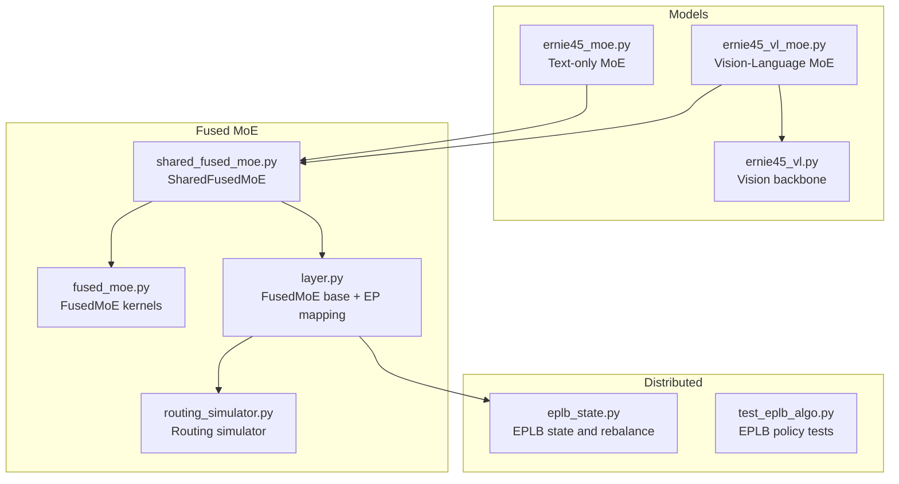
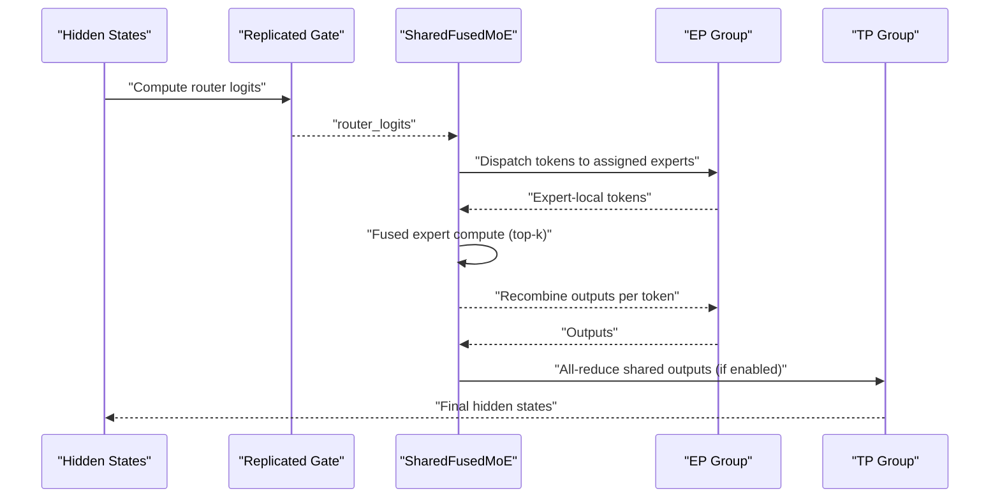
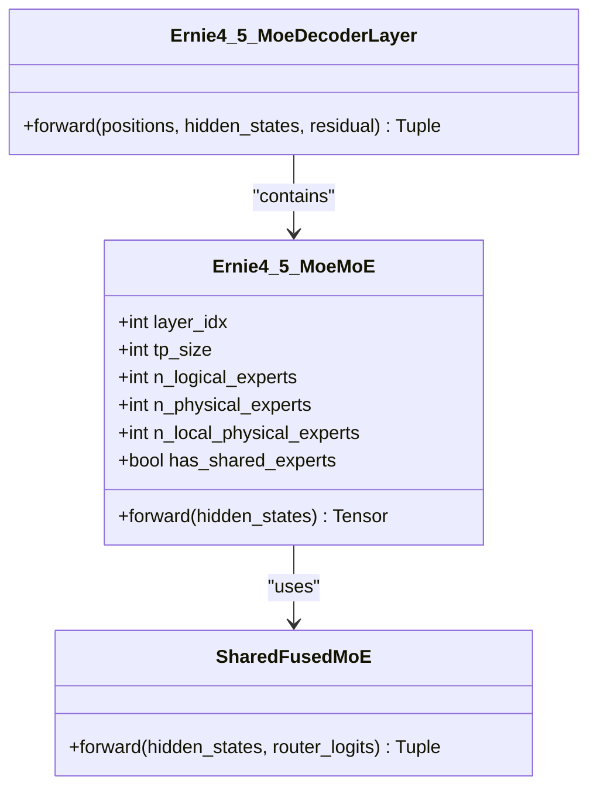
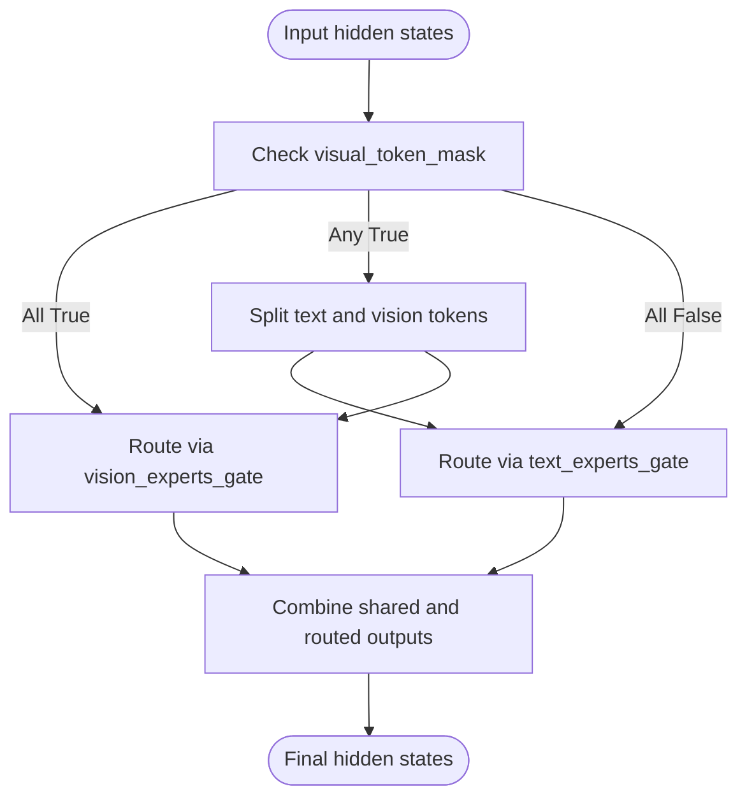
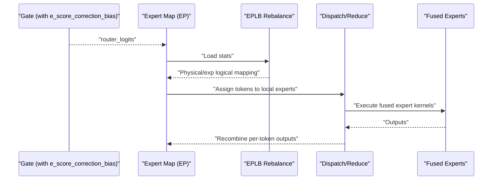
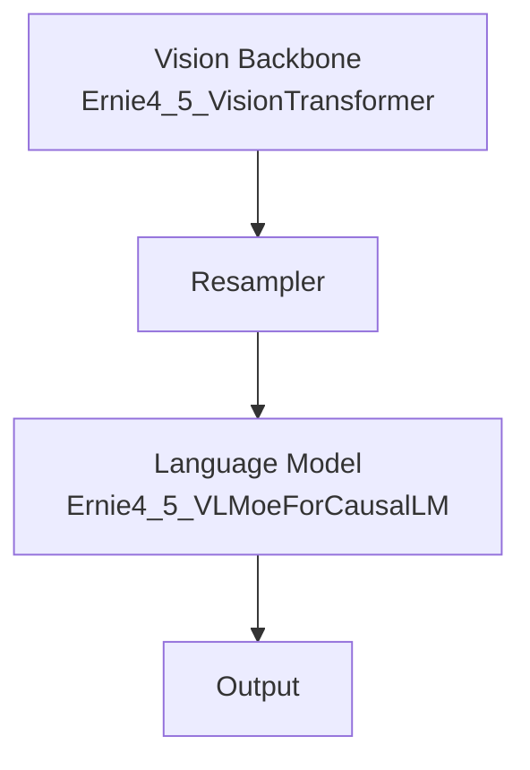
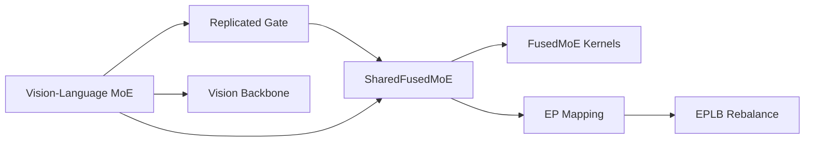

# ERNIE 4.5 Mixture-of-Experts

<cite>
**Referenced Files in This Document**
- [ernie45_moe.py](file://vllm/model_executor/models/ernie45_moe.py)
- [ernie45_vl_moe.py](file://vllm/model_executor/models/ernie45_vl_moe.py)
- [shared_fused_moe.py](file://vllm/model_executor/layers/fused_moe/shared_fused_moe.py)
- [fused_moe.py](file://vllm/model_executor/layers/fused_moe/fused_moe.py)
- [layer.py](file://vllm/model_executor/layers/fused_moe/layer.py)
- [routing_simulator.py](file://vllm/model_executor/layers/fused_moe/routing_simulator.py)
- [eplb_state.py](file://vllm/distributed/eplb/eplb_state.py)
- [test_eplb_algo.py](file://tests/distributed/test_eplb_algo.py)
- [ernie45_vl.py](file://vllm/model_executor/models/ernie45_vl.py)
</cite>

## Table of Contents
1. [Introduction](#introduction)
2. [Project Structure](#project-structure)
3. [Core Components](#core-components)
4. [Architecture Overview](#architecture-overview)
5. [Detailed Component Analysis](#detailed-component-analysis)
6. [Dependency Analysis](#dependency-analysis)
7. [Performance Considerations](#performance-considerations)
8. [Troubleshooting Guide](#troubleshooting-guide)
9. [Conclusion](#conclusion)
10. [Appendices](#appendices)

## Introduction
This document explains the ERNIE 4.5 Mixture-of-Experts (MoE) implementation in vLLM, focusing on:
- ERNIE 4.5 MoE architecture and how MoE layers are integrated into the decoder stack
- Expert routing mechanisms and capacity management via EPLB (Expert Parallelism Load Balancing)
- Expert sharding across tensor and expert parallel groups
- ERNIE-specific optimizations including expert utilization, load balancing, and performance tuning
- Practical configuration examples, routing analysis, and scaling considerations
- Memory management strategies and integration with ERNIE’s vision-language capabilities

## Project Structure
The ERNIE 4.5 MoE implementation spans model definitions, fused MoE layers, and distributed load balancing:
- Model-level modules define ERNIE 4.5 text-only and vision-language MoE architectures
- Fused MoE layers implement token-to-expert routing, dispatch/reduce, and optional shared expert computation
- Distributed modules coordinate expert placement, mapping, and load balancing across ranks

**Diagram sources**
- [ernie45_moe.py](file://vllm/model_executor/models/ernie45_moe.py#L121-L228)
- [ernie45_vl_moe.py](file://vllm/model_executor/models/ernie45_vl_moe.py#L190-L403)
- [shared_fused_moe.py](file://vllm/model_executor/layers/fused_moe/shared_fused_moe.py#L1-L97)
- [fused_moe.py](file://vllm/model_executor/layers/fused_moe/fused_moe.py#L1-L200)
- [layer.py](file://vllm/model_executor/layers/fused_moe/layer.py#L100-L187)
- [routing_simulator.py](file://vllm/model_executor/layers/fused_moe/routing_simulator.py#L229-L310)
- [eplb_state.py](file://vllm/distributed/eplb/eplb_state.py#L1052-L1090)
- [test_eplb_algo.py](file://tests/distributed/test_eplb_algo.py#L227-L272)
- [ernie45_vl.py](file://vllm/model_executor/models/ernie45_vl.py#L1214-L1245)

**Section sources**
- [ernie45_moe.py](file://vllm/model_executor/models/ernie45_moe.py#L121-L228)
- [ernie45_vl_moe.py](file://vllm/model_executor/models/ernie45_vl_moe.py#L190-L403)
- [shared_fused_moe.py](file://vllm/model_executor/layers/fused_moe/shared_fused_moe.py#L1-L97)
- [fused_moe.py](file://vllm/model_executor/layers/fused_moe/fused_moe.py#L1-L200)
- [layer.py](file://vllm/model_executor/layers/fused_moe/layer.py#L100-L187)
- [routing_simulator.py](file://vllm/model_executor/layers/fused_moe/routing_simulator.py#L229-L310)
- [eplb_state.py](file://vllm/distributed/eplb/eplb_state.py#L1052-L1090)
- [test_eplb_algo.py](file://tests/distributed/test_eplb_algo.py#L227-L272)
- [ernie45_vl.py](file://vllm/model_executor/models/ernie45_vl.py#L1214-L1245)

## Core Components
- ERNIE 4.5 Text MoE Layer
  - Implements a MoE MLP with a replicated gate and SharedFusedMoE experts
  - Supports shared experts and tensor-parallel reductions
  - Configurable MoE layer range and interval
  - References: [Ernie4_5_MoeMoE](file://vllm/model_executor/models/ernie45_moe.py#L121-L228), [Ernie4_5_MoeDecoderLayer](file://vllm/model_executor/models/ernie45_moe.py#L322-L412), [Ernie4_5_MoeForCausalLM](file://vllm/model_executor/models/ernie45_moe.py#L623-L755)

- ERNIE 4.5 Vision-Language MoE Layer
  - Dual-path MoE supporting separate text and vision experts gated independently
  - Integrates with ERNIE vision transformer and resampler
  - References: [Ernie4_5_VLMoeMoE](file://vllm/model_executor/models/ernie45_vl_moe.py#L190-L403), [Ernie4_5_VLMoeDecoderLayer](file://vllm/model_executor/models/ernie45_vl_moe.py#L405-L505), [Ernie4_5_VLMoeForCausalLM](file://vllm/model_executor/models/ernie45_vl_moe.py#L600-L800)

- SharedFusedMoE
  - FusedMoE wrapper that optionally computes shared experts and overlaps computation with all2all dispatch
  - Handles tensor-parallel reductions for shared outputs
  - References: [SharedFusedMoE](file://vllm/model_executor/layers/fused_moe/shared_fused_moe.py#L1-L97)

- FusedMoE Base and Expert Placement
  - Determines EP mapping, expert masks, and placement strategies
  - Supports linear and round-robin strategies; integrates with EPLB
  - References: [determine_expert_map](file://vllm/model_executor/layers/fused_moe/layer.py#L100-L187), [determine_expert_placement_strategy](file://vllm/model_executor/layers/fused_moe/layer.py#L189-L200)

- Routing Simulator
  - Provides routing strategy simulation (e.g., uniform random, normal) for testing
  - References: [RoutingSimulator](file://vllm/model_executor/layers/fused_moe/routing_simulator.py#L229-L310)

- EPLB State and Policy
  - Manages physical/exp logical expert mapping and rebalancing across ranks
  - Tests validate policy behavior across devices and scales
  - References: [EplbState.get_eep_state](file://vllm/distributed/eplb/eplb_state.py#L1052-L1090), [DefaultEplbPolicy tests](file://tests/distributed/test_eplb_algo.py#L227-L272)

**Section sources**
- [ernie45_moe.py](file://vllm/model_executor/models/ernie45_moe.py#L121-L228)
- [ernie45_vl_moe.py](file://vllm/model_executor/models/ernie45_vl_moe.py#L190-L403)
- [shared_fused_moe.py](file://vllm/model_executor/layers/fused_moe/shared_fused_moe.py#L1-L97)
- [layer.py](file://vllm/model_executor/layers/fused_moe/layer.py#L100-L187)
- [routing_simulator.py](file://vllm/model_executor/layers/fused_moe/routing_simulator.py#L229-L310)
- [eplb_state.py](file://vllm/distributed/eplb/eplb_state.py#L1052-L1090)
- [test_eplb_algo.py](file://tests/distributed/test_eplb_algo.py#L227-L272)

## Architecture Overview
The ERNIE 4.5 MoE architecture composes:
- Decoder layers with optional MoE blocks configured by layer indices and intervals
- A replicated gate per MoE block computing router logits
- SharedFusedMoE performing token-to-expert routing, dispatch, fused expert compute, and top-k recombination
- Optional shared experts computed in parallel with fused dispatch
- Expert parallelism with EP mapping and EPLB rebalancing
- Tensor parallel reductions for outputs when TP > 1

**Diagram sources**
- [ernie45_moe.py](file://vllm/model_executor/models/ernie45_moe.py#L121-L228)
- [shared_fused_moe.py](file://vllm/model_executor/layers/fused_moe/shared_fused_moe.py#L55-L97)
- [layer.py](file://vllm/model_executor/layers/fused_moe/layer.py#L100-L187)

## Detailed Component Analysis

### ERNIE 4.5 Text MoE Layer
- MoE block composition:
  - Replicated gate projecting to router logits
  - SharedFusedMoE with optional shared experts
  - Tensor-parallel reductions for outputs
- Layer selection:
  - MoE applied based on layer index ranges and interval
- References: [Ernie4_5_MoeMoE](file://vllm/model_executor/models/ernie45_moe.py#L121-L228), [Ernie4_5_MoeDecoderLayer](file://vllm/model_executor/models/ernie45_moe.py#L322-L412)

**Diagram sources**
- [ernie45_moe.py](file://vllm/model_executor/models/ernie45_moe.py#L121-L228)
- [shared_fused_moe.py](file://vllm/model_executor/layers/fused_moe/shared_fused_moe.py#L1-L97)

**Section sources**
- [ernie45_moe.py](file://vllm/model_executor/models/ernie45_moe.py#L121-L228)
- [shared_fused_moe.py](file://vllm/model_executor/layers/fused_moe/shared_fused_moe.py#L1-L97)

### ERNIE 4.5 Vision-Language MoE Layer
- Dual-path routing:
  - Separate gates for text and vision experts
  - Mask-based routing to either text-only, vision-only, or mixed tokens
- Shared experts:
  - Optional shared experts computed alongside fused experts
- References: [Ernie4_5_VLMoeMoE](file://vllm/model_executor/models/ernie45_vl_moe.py#L190-L403), [Ernie4_5_VLMoeDecoderLayer](file://vllm/model_executor/models/ernie45_vl_moe.py#L405-L505)

**Diagram sources**
- [ernie45_vl_moe.py](file://vllm/model_executor/models/ernie45_vl_moe.py#L321-L403)

**Section sources**
- [ernie45_vl_moe.py](file://vllm/model_executor/models/ernie45_vl_moe.py#L190-L403)

### Expert Routing Mechanisms and Capacity Management
- Router logits:
  - Computed by a replicated gate per MoE block
  - ERNIE 4.5 MoE sets an expert score correction bias parameter for improved routing stability
- SharedFusedMoE:
  - Performs token-to-expert dispatch and fused expert compute
  - Optionally computes shared experts and overlaps computation with dispatch
- Expert placement and mapping:
  - EP mapping computed per rank; supports linear and round-robin strategies
  - Expert masks used for fused dispatch when enabled
- EPLB (Expert Parallelism Load Balancing):
  - Dynamically rebalances logical to physical expert mapping across ranks
  - Computes redundant experts to absorb load imbalance
  - Updates metadata and expert maps when EP topology changes

**Diagram sources**
- [ernie45_moe.py](file://vllm/model_executor/models/ernie45_moe.py#L163-L205)
- [shared_fused_moe.py](file://vllm/model_executor/layers/fused_moe/shared_fused_moe.py#L55-L97)
- [layer.py](file://vllm/model_executor/layers/fused_moe/layer.py#L100-L187)
- [eplb_state.py](file://vllm/distributed/eplb/eplb_state.py#L1052-L1090)

**Section sources**
- [ernie45_moe.py](file://vllm/model_executor/models/ernie45_moe.py#L163-L205)
- [shared_fused_moe.py](file://vllm/model_executor/layers/fused_moe/shared_fused_moe.py#L55-L97)
- [layer.py](file://vllm/model_executor/layers/fused_moe/layer.py#L100-L187)
- [eplb_state.py](file://vllm/distributed/eplb/eplb_state.py#L1052-L1090)

### ERNIE Integration with Multimodal Capabilities
- Vision backbone:
  - ERNIE vision transformer and resampler integrate with the language model
- Vision-language MoE:
  - Dual MoE gates for text and vision tokens
  - Mask-based routing enables seamless integration with vision preprocessing
- References: [Ernie4_5_VLMoeForCausalLM](file://vllm/model_executor/models/ernie45_vl_moe.py#L600-L800), [Ernie4_5_VisionTransformer](file://vllm/model_executor/models/ernie45_vl.py#L353-L383), [Ernie4_5_VLMoeModel](file://vllm/model_executor/models/ernie45_vl_moe.py#L517-L597)

**Diagram sources**
- [ernie45_vl.py](file://vllm/model_executor/models/ernie45_vl.py#L1214-L1245)
- [ernie45_vl_moe.py](file://vllm/model_executor/models/ernie45_vl_moe.py#L600-L800)

**Section sources**
- [ernie45_vl.py](file://vllm/model_executor/models/ernie45_vl.py#L353-L383)
- [ernie45_vl_moe.py](file://vllm/model_executor/models/ernie45_vl_moe.py#L517-L597)

### ERNIE-Specific Optimizations
- Expert utilization and load balancing:
  - EPLB computes redundant experts and rebalances mappings to improve utilization
  - Tests confirm policy behavior across scales and devices
- Expert score correction bias:
  - Bias term in the gate improves routing stability and reduces token spillage
- Shared expert overlap:
  - Overlapping shared expert computation with fused dispatch reduces latency
- References: [eplb_state.py](file://vllm/distributed/eplb/eplb_state.py#L1052-L1090), [test_eplb_algo.py](file://tests/distributed/test_eplb_algo.py#L227-L272), [ernie45_moe.py](file://vllm/model_executor/models/ernie45_moe.py#L163-L205), [shared_fused_moe.py](file://vllm/model_executor/layers/fused_moe/shared_fused_moe.py#L55-L97)

**Section sources**
- [eplb_state.py](file://vllm/distributed/eplb/eplb_state.py#L1052-L1090)
- [test_eplb_algo.py](file://tests/distributed/test_eplb_algo.py#L227-L272)
- [ernie45_moe.py](file://vllm/model_executor/models/ernie45_moe.py#L163-L205)
- [shared_fused_moe.py](file://vllm/model_executor/layers/fused_moe/shared_fused_moe.py#L55-L97)

## Dependency Analysis
Key dependencies and relationships:
- ERNIE 4.5 MoE layers depend on SharedFusedMoE for fused dispatch/compute
- SharedFusedMoE depends on FusedMoE kernels and EP/Tensor-parallel utilities
- Expert placement and mapping rely on EP group state and EPLB policies
- Vision-language MoE depends on ERNIE vision components and dual gating

**Diagram sources**
- [ernie45_moe.py](file://vllm/model_executor/models/ernie45_moe.py#L121-L228)
- [shared_fused_moe.py](file://vllm/model_executor/layers/fused_moe/shared_fused_moe.py#L1-L97)
- [fused_moe.py](file://vllm/model_executor/layers/fused_moe/fused_moe.py#L1-L200)
- [layer.py](file://vllm/model_executor/layers/fused_moe/layer.py#L100-L187)
- [eplb_state.py](file://vllm/distributed/eplb/eplb_state.py#L1052-L1090)
- [ernie45_vl_moe.py](file://vllm/model_executor/models/ernie45_vl_moe.py#L190-L403)

**Section sources**
- [ernie45_moe.py](file://vllm/model_executor/models/ernie45_moe.py#L121-L228)
- [ernie45_vl_moe.py](file://vllm/model_executor/models/ernie45_vl_moe.py#L190-L403)
- [shared_fused_moe.py](file://vllm/model_executor/layers/fused_moe/shared_fused_moe.py#L1-L97)
- [fused_moe.py](file://vllm/model_executor/layers/fused_moe/fused_moe.py#L1-L200)
- [layer.py](file://vllm/model_executor/layers/fused_moe/layer.py#L100-L187)
- [eplb_state.py](file://vllm/distributed/eplb/eplb_state.py#L1052-L1090)

## Performance Considerations
- Expert utilization and load balancing:
  - Use EPLB to compute redundant experts and rebalance mappings for higher utilization
  - Validate policy behavior with tests across devices and scales
- Shared expert overlap:
  - Enable overlapped shared expert computation with fused dispatch to reduce latency
- Tensor parallel reductions:
  - Ensure shared expert outputs are reduced when TP > 1 and reduce_results is enabled
- Kernel and backend selection:
  - FusedMoE kernels and backends are selected based on platform and configuration; ensure appropriate backends for target hardware
- References: [test_eplb_algo.py](file://tests/distributed/test_eplb_algo.py#L227-L272), [shared_fused_moe.py](file://vllm/model_executor/layers/fused_moe/shared_fused_moe.py#L55-L97), [layer.py](file://vllm/model_executor/layers/fused_moe/layer.py#L100-L187)

**Section sources**
- [test_eplb_algo.py](file://tests/distributed/test_eplb_algo.py#L227-L272)
- [shared_fused_moe.py](file://vllm/model_executor/layers/fused_moe/shared_fused_moe.py#L55-L97)
- [layer.py](file://vllm/model_executor/layers/fused_moe/layer.py#L100-L187)

## Troubleshooting Guide
- Expert placement and mapping:
  - Verify EP size vs. number of experts; ensure TP world size does not exceed expert count
  - Confirm expert map and mask generation for EP groups
- EPLB rebalancing:
  - Check that global expert loads and indices are received and mapped correctly
  - Validate redundant expert counts after rebalance
- Weight loading:
  - For ERNIE 4.5 Vision-Language MoE, ensure text and vision experts are mapped to correct submodules and gates
- Routing simulation:
  - Use the routing simulator to test strategies and diagnose routing patterns during development
- References: [ernie45_moe.py](file://vllm/model_executor/models/ernie45_moe.py#L157-L161), [layer.py](file://vllm/model_executor/layers/fused_moe/layer.py#L100-L187), [eplb_state.py](file://vllm/distributed/eplb/eplb_state.py#L1052-L1090), [ernie45_vl_moe.py](file://vllm/model_executor/models/ernie45_vl_moe.py#L665-L800), [routing_simulator.py](file://vllm/model_executor/layers/fused_moe/routing_simulator.py#L229-L310)

**Section sources**
- [ernie45_moe.py](file://vllm/model_executor/models/ernie45_moe.py#L157-L161)
- [layer.py](file://vllm/model_executor/layers/fused_moe/layer.py#L100-L187)
- [eplb_state.py](file://vllm/distributed/eplb/eplb_state.py#L1052-L1090)
- [ernie45_vl_moe.py](file://vllm/model_executor/models/ernie45_vl_moe.py#L665-L800)
- [routing_simulator.py](file://vllm/model_executor/layers/fused_moe/routing_simulator.py#L229-L310)

## Conclusion
ERNIE 4.5 MoE in vLLM combines efficient fused expert computation with ERNIE-specific enhancements:
- Dual-path routing for text and vision in the vision-language variant
- Shared expert computation overlapped with dispatch for lower latency
- EPLB-driven load balancing and expert mapping for high utilization
- Robust configuration via layer indices, intervals, and expert counts
These components enable scalable, high-performance inference for ERNIE 4.5 models with strong multimodal capabilities.

## Appendices

### Practical Configuration Examples
- Enabling MoE in ERNIE 4.5 text-only:
  - Configure MoE layer start/end indices and interval
  - Set number of experts, top-k, and intermediate sizes
  - References: [Ernie4_5_MoeDecoderLayer](file://vllm/model_executor/models/ernie45_moe.py#L352-L381)

- Enabling MoE in ERNIE 4.5 vision-language:
  - Configure separate text and vision expert counts and ranges
  - Ensure visual_token_mask routing is provided
  - References: [Ernie4_5_VLMoeDecoderLayer](file://vllm/model_executor/models/ernie45_vl_moe.py#L437-L470)

- Expert routing analysis:
  - Use the routing simulator to evaluate uniform or normal routing strategies
  - References: [RoutingSimulator](file://vllm/model_executor/layers/fused_moe/routing_simulator.py#L229-L310)

- Scaling considerations:
  - Adjust EP size and redundant experts for load balancing
  - Validate with EPLB policy tests
  - References: [test_eplb_algo.py](file://tests/distributed/test_eplb_algo.py#L227-L272)

**Section sources**
- [ernie45_moe.py](file://vllm/model_executor/models/ernie45_moe.py#L352-L381)
- [ernie45_vl_moe.py](file://vllm/model_executor/models/ernie45_vl_moe.py#L437-L470)
- [routing_simulator.py](file://vllm/model_executor/layers/fused_moe/routing_simulator.py#L229-L310)
- [test_eplb_algo.py](file://tests/distributed/test_eplb_algo.py#L227-L272)