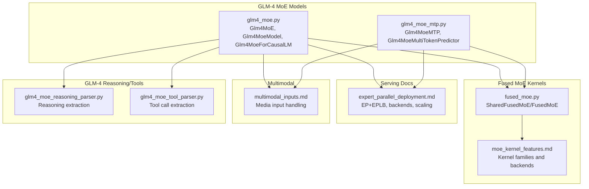
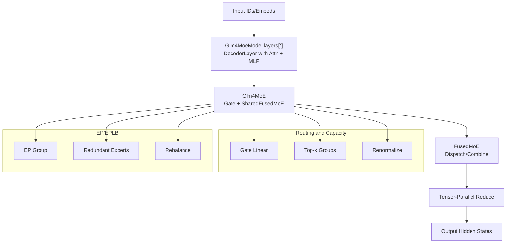
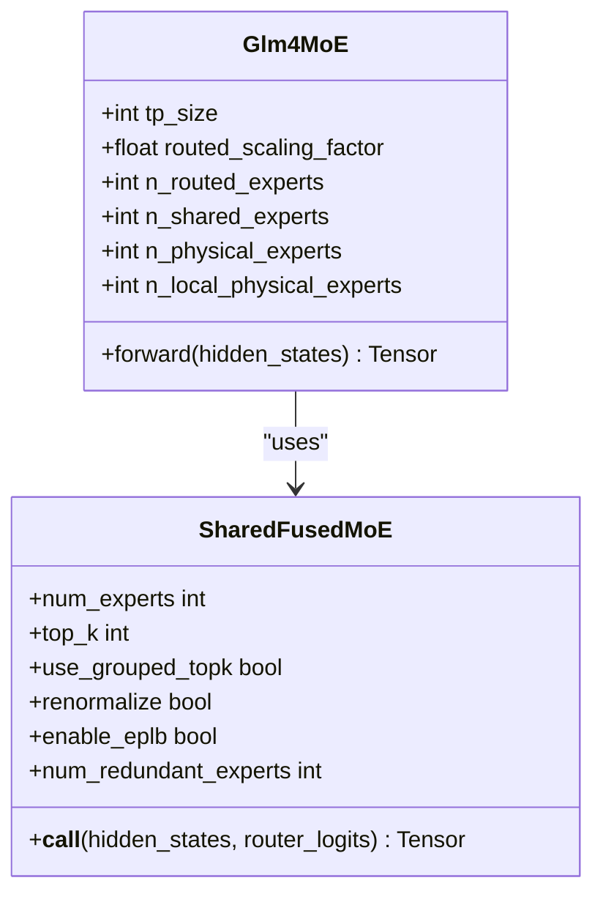
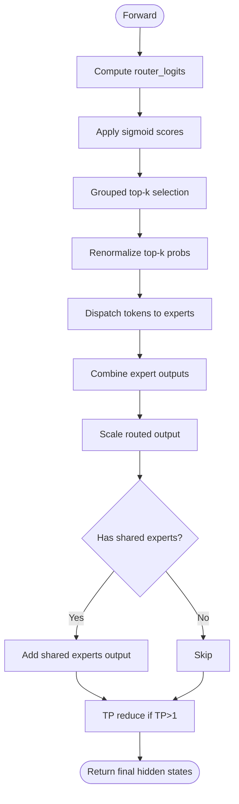
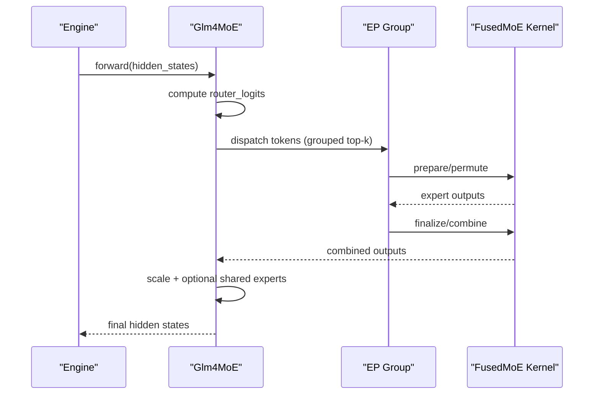
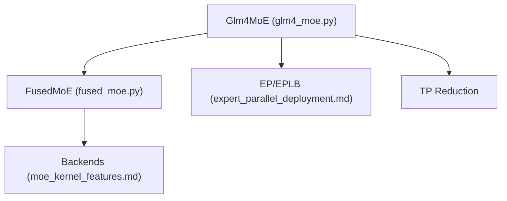

# GLM-4 Mixture-of-Experts

<cite>
**Referenced Files in This Document**
- [glm4_moe.py](file://vllm/model_executor/models/glm4_moe.py)
- [glm4_moe_mtp.py](file://vllm/model_executor/models/glm4_moe_mtp.py)
- [moe_kernel_features.md](file://docs/design/moe_kernel_features.md)
- [expert_parallel_deployment.md](file://docs/serving/expert_parallel_deployment.md)
- [multimodal_inputs.md](file://docs/features/multimodal_inputs.md)
- [fused_moe.py](file://vllm/model_executor/layers/fused_moe/fused_moe.py)
- [glm4_moe_reasoning_parser.py](file://vllm/reasoning/glm4_moe_reasoning_parser.py)
- [glm4_moe_tool_parser.py](file://vllm/tool_parsers/glm4_moe_tool_parser.py)
- [test_glm4_moe_reasoning_parser.py](file://tests/reasoning/test_glm4_moe_reasoning_parser.py)
- [test_glm4_moe_tool_parser.py](file://tests/tool_parsers/test_glm4_moe_tool_parser.py)
</cite>

## Table of Contents
1. [Introduction](#introduction)
2. [Project Structure](#project-structure)
3. [Core Components](#core-components)
4. [Architecture Overview](#architecture-overview)
5. [Detailed Component Analysis](#detailed-component-analysis)
6. [Dependency Analysis](#dependency-analysis)
7. [Performance Considerations](#performance-considerations)
8. [Troubleshooting Guide](#troubleshooting-guide)
9. [Conclusion](#conclusion)
10. [Appendices](#appendices)

## Introduction
This document explains the GLM-4 Mixture-of-Experts (MoE) implementation in vLLM, focusing on the GLM-4 MoE architecture, expert routing and capacity management, expert sharding and load balancing across tensor parallel groups, and GLM-4-specific features such as expert sharing, capacity scaling, and performance optimizations. It also covers practical configuration, expert utilization monitoring, scaling considerations, memory management, and integration with GLM-4’s multimodal capabilities.

## Project Structure
The GLM-4 MoE implementation spans model definition, fused MoE kernels, and auxiliary components for reasoning and tool parsing. The following diagram shows how the key files relate to each other and to broader vLLM subsystems.

**Diagram sources**
- [glm4_moe.py](file://vllm/model_executor/models/glm4_moe.py#L116-L226)
- [glm4_moe_mtp.py](file://vllm/model_executor/models/glm4_moe_mtp.py#L187-L212)
- [fused_moe.py](file://vllm/model_executor/layers/fused_moe/fused_moe.py#L1-L120)
- [moe_kernel_features.md](file://docs/design/moe_kernel_features.md#L1-L118)
- [expert_parallel_deployment.md](file://docs/serving/expert_parallel_deployment.md#L1-L200)
- [multimodal_inputs.md](file://docs/features/multimodal_inputs.md#L1-L120)
- [glm4_moe_reasoning_parser.py](file://vllm/reasoning/glm4_moe_reasoning_parser.py#L1-L172)
- [glm4_moe_tool_parser.py](file://vllm/tool_parsers/glm4_moe_tool_parser.py#L1-L202)

**Section sources**
- [glm4_moe.py](file://vllm/model_executor/models/glm4_moe.py#L116-L226)
- [glm4_moe_mtp.py](file://vllm/model_executor/models/glm4_moe_mtp.py#L187-L212)
- [fused_moe.py](file://vllm/model_executor/layers/fused_moe/fused_moe.py#L1-L120)
- [moe_kernel_features.md](file://docs/design/moe_kernel_features.md#L1-L118)
- [expert_parallel_deployment.md](file://docs/serving/expert_parallel_deployment.md#L1-L200)
- [multimodal_inputs.md](file://docs/features/multimodal_inputs.md#L1-L120)
- [glm4_moe_reasoning_parser.py](file://vllm/reasoning/glm4_moe_reasoning_parser.py#L1-L172)
- [glm4_moe_tool_parser.py](file://vllm/tool_parsers/glm4_moe_tool_parser.py#L1-L202)

## Core Components
- Glm4MoE: Implements GLM-4 MoE routing, shared experts, fused experts, and tensor-parallel reduction.
- Glm4MoeModel: Stacks decoder layers with optional MoE MLPs and handles PP boundaries.
- Glm4MoeForCausalLM: Top-level model exposing embedding, LM head, and MoE metadata extraction.
- Glm4MoeMTP: Multi-token prediction variant with shared heads and special layer mapping.
- SharedFusedMoE/FusedMoE: Backed by modular and non-modular fused MoE kernels; integrates with EP/EPLB.
- Reasoning/Tool parsers: GLM-4-specific parsers for reasoning output and tool calls.

Key implementation references:
- [Glm4MoE.forward](file://vllm/model_executor/models/glm4_moe.py#L201-L225)
- [Glm4MoeModel.get_expert_mapping/load_weights](file://vllm/model_executor/models/glm4_moe.py#L493-L606)
- [Glm4MoeForCausalLM.extract_moe_parameters](file://vllm/model_executor/models/glm4_moe.py#L608-L635)
- [Glm4MoeMTP.extract_moe_parameters](file://vllm/model_executor/models/glm4_moe_mtp.py#L187-L212)
- [SharedFusedMoE/FusedMoE](file://vllm/model_executor/layers/fused_moe/fused_moe.py#L1-L120)

**Section sources**
- [glm4_moe.py](file://vllm/model_executor/models/glm4_moe.py#L116-L226)
- [glm4_moe.py](file://vllm/model_executor/models/glm4_moe.py#L493-L606)
- [glm4_moe.py](file://vllm/model_executor/models/glm4_moe.py#L608-L635)
- [glm4_moe_mtp.py](file://vllm/model_executor/models/glm4_moe_mtp.py#L187-L212)
- [fused_moe.py](file://vllm/model_executor/layers/fused_moe/fused_moe.py#L1-L120)

## Architecture Overview
The GLM-4 MoE stack composes attention, GLM-4 MoE MLPs, and fused experts with optional shared experts. Routing is performed by a learned gate; fused experts implement grouped top-k selection and dispatch. EP+EPLB distributes experts across devices and rebalances load dynamically.

**Diagram sources**
- [glm4_moe.py](file://vllm/model_executor/models/glm4_moe.py#L116-L226)
- [fused_moe.py](file://vllm/model_executor/layers/fused_moe/fused_moe.py#L1-L120)
- [expert_parallel_deployment.md](file://docs/serving/expert_parallel_deployment.md#L136-L206)

**Section sources**
- [glm4_moe.py](file://vllm/model_executor/models/glm4_moe.py#L116-L226)
- [fused_moe.py](file://vllm/model_executor/layers/fused_moe/fused_moe.py#L1-L120)
- [expert_parallel_deployment.md](file://docs/serving/expert_parallel_deployment.md#L136-L206)

## Detailed Component Analysis

### GLM-4 MoE Layer Implementation
- Gate and routing: A linear gate produces per-token logits over routed experts; sigmoid scoring is used with optional e-score correction bias.
- Shared experts: Optional dense MLP shared across tokens; outputs are combined with routed experts using a scaling factor.
- Fused experts: Grouped top-k with renormalization; supports redundant experts and EPLB integration.
- Tensor parallel reduction: Final hidden states are optionally reduced across TP ranks.

**Diagram sources**
- [glm4_moe.py](file://vllm/model_executor/models/glm4_moe.py#L116-L226)
- [fused_moe.py](file://vllm/model_executor/layers/fused_moe/fused_moe.py#L1-L120)

**Section sources**
- [glm4_moe.py](file://vllm/model_executor/models/glm4_moe.py#L116-L226)

### Expert Routing and Capacity Management
- Routing: Learned gate with sigmoid scoring; grouped top-k selection; renormalization of top-k probabilities.
- Capacity: Managed implicitly by top-k selection and renormalization; redundant experts (EPLB) increase capacity for hot experts.
- Scaling: The routed output is scaled by a configurable factor; shared experts contribute additional output.

**Diagram sources**
- [glm4_moe.py](file://vllm/model_executor/models/glm4_moe.py#L116-L226)

**Section sources**
- [glm4_moe.py](file://vllm/model_executor/models/glm4_moe.py#L116-L226)

### Expert Sharding and Load Balancing Across TP Groups
- EP group: Experts are sharded across EP ranks; each rank maintains a contiguous slice of physical experts.
- Redundancy: EPLB adds redundant experts per EP rank to improve balancedness; memory overhead proportional to number of layers and experts.
- Backends: Modular fused MoE backends support EP+EPLB; backend selection impacts quantization and async overlap.

**Diagram sources**
- [glm4_moe.py](file://vllm/model_executor/models/glm4_moe.py#L201-L225)
- [fused_moe.py](file://vllm/model_executor/layers/fused_moe/fused_moe.py#L1-L120)
- [expert_parallel_deployment.md](file://docs/serving/expert_parallel_deployment.md#L136-L206)

**Section sources**
- [glm4_moe.py](file://vllm/model_executor/models/glm4_moe.py#L201-L225)
- [expert_parallel_deployment.md](file://docs/serving/expert_parallel_deployment.md#L136-L206)

### GLM-4 Specific Features
- Expert sharing: Optional shared MLP contributes to final hidden states alongside routed experts.
- Capacity scaling: Redundant experts (EPLB) increase effective capacity for hot experts.
- Performance optimizations: Grouped top-k, renormalization, and backend-specific quantization/format support.

References:
- [Glm4MoE.shared_experts](file://vllm/model_executor/models/glm4_moe.py#L167-L179)
- [Glm4MoE.experts (SharedFusedMoE)](file://vllm/model_executor/models/glm4_moe.py#L180-L199)
- [EPLB configuration](file://docs/serving/expert_parallel_deployment.md#L140-L190)

**Section sources**
- [glm4_moe.py](file://vllm/model_executor/models/glm4_moe.py#L167-L199)
- [expert_parallel_deployment.md](file://docs/serving/expert_parallel_deployment.md#L140-L190)

### Practical Configuration Examples
- Enabling EP and selecting a backend:
  - Use the expert parallel deployment guide to configure EP size and backend selection.
  - References: [EP deployment](file://docs/serving/expert_parallel_deployment.md#L1-L120), [Backend table](file://docs/design/moe_kernel_features.md#L1-L118)
- Enabling EPLB with redundant experts:
  - Configure window size, step interval, and num_redundant_experts.
  - Reference: [EPLB config](file://docs/serving/expert_parallel_deployment.md#L140-L190)
- GLM-4 MoE model configuration:
  - Set MoE hyperparameters (n_routed_experts, n_shared_experts, n_group, topk_group, norm_topk_prob).
  - Reference: [Glm4MoE constructor](file://vllm/model_executor/models/glm4_moe.py#L116-L199)

**Section sources**
- [expert_parallel_deployment.md](file://docs/serving/expert_parallel_deployment.md#L1-L120)
- [moe_kernel_features.md](file://docs/design/moe_kernel_features.md#L1-L118)
- [glm4_moe.py](file://vllm/model_executor/models/glm4_moe.py#L116-L199)

### Expert Utilization Monitoring and Scaling
- EPLB metrics: Track balancedness (average tokens per expert divided by max tokens per expert) and adjust num_redundant_experts accordingly.
- Scaling: Increase EP size (TP×DP) to shard experts; monitor memory footprint due to redundant experts.
- References: [EPLB metrics and overhead](file://docs/serving/expert_parallel_deployment.md#L140-L190)

**Section sources**
- [expert_parallel_deployment.md](file://docs/serving/expert_parallel_deployment.md#L140-L190)

### Memory Management Strategies
- Redundant experts: Add memory overhead proportional to number of layers and experts; tune num_redundant_experts based on memory budget.
- Quantization/backends: Choose backends supporting FP8/NVFP4 to reduce activation/weight memory where applicable.
- References: [EPLB memory overhead](file://docs/serving/expert_parallel_deployment.md#L183-L190), [Kernel features](file://docs/design/moe_kernel_features.md#L68-L118)

**Section sources**
- [expert_parallel_deployment.md](file://docs/serving/expert_parallel_deployment.md#L183-L190)
- [moe_kernel_features.md](file://docs/design/moe_kernel_features.md#L68-L118)

### Integration with GLM-4 Multimodal Capabilities
- GLM-4 multimodal models can incorporate MoE layers; multimodal inputs are handled by the engine’s multimodal pipeline.
- References: [Multimodal inputs](file://docs/features/multimodal_inputs.md#L1-L120)

**Section sources**
- [multimodal_inputs.md](file://docs/features/multimodal_inputs.md#L1-L120)

### GLM-4 Reasoning and Tool Parsing
- Reasoning parser: Extracts reasoning content delimited by <think>...</think> tokens.
- Tool parser: Parses tool call specifications emitted by GLM-4 MoE models.
- References: [Reasoning parser](file://vllm/reasoning/glm4_moe_reasoning_parser.py#L1-L172), [Tool parser](file://vllm/tool_parsers/glm4_moe_tool_parser.py#L1-L202)

**Section sources**
- [glm4_moe_reasoning_parser.py](file://vllm/reasoning/glm4_moe_reasoning_parser.py#L1-L172)
- [glm4_moe_tool_parser.py](file://vllm/tool_parsers/glm4_moe_tool_parser.py#L1-L202)

## Dependency Analysis
The GLM-4 MoE model depends on fused MoE kernels and EP/EPLB infrastructure. The following diagram shows key dependencies.

**Diagram sources**
- [glm4_moe.py](file://vllm/model_executor/models/glm4_moe.py#L116-L226)
- [fused_moe.py](file://vllm/model_executor/layers/fused_moe/fused_moe.py#L1-L120)
- [expert_parallel_deployment.md](file://docs/serving/expert_parallel_deployment.md#L136-L206)
- [moe_kernel_features.md](file://docs/design/moe_kernel_features.md#L1-L118)

**Section sources**
- [glm4_moe.py](file://vllm/model_executor/models/glm4_moe.py#L116-L226)
- [fused_moe.py](file://vllm/model_executor/layers/fused_moe/fused_moe.py#L1-L120)
- [expert_parallel_deployment.md](file://docs/serving/expert_parallel_deployment.md#L136-L206)
- [moe_kernel_features.md](file://docs/design/moe_kernel_features.md#L1-L118)

## Performance Considerations
- Backend selection: Choose backends aligned with workload (prefill vs decode) and quantization needs.
- Dual batch overlap (DBO) and async scheduling can reduce latency overhead with EP+EPLB.
- Grouped top-k and renormalization reduce communication and improve throughput.
- References: [Backend table](file://docs/design/moe_kernel_features.md#L1-L118), [Advanced EP tuning](file://docs/serving/expert_parallel_deployment.md#L208-L230)

**Section sources**
- [moe_kernel_features.md](file://docs/design/moe_kernel_features.md#L1-L118)
- [expert_parallel_deployment.md](file://docs/serving/expert_parallel_deployment.md#L208-L230)

## Troubleshooting Guide
- EPLB rebalancing anomalies: Validate num_redundant_experts and step_interval; ensure EP size divides total experts.
- Backend compatibility: Confirm backend supports required quantization formats and activation functions.
- Reasoning/Tool parsing failures: Verify tokenizer vocab contains required tokens (<think>, </think>, tool delimiters).
- References: [EPLB tests](file://tests/distributed/test_eplb_algo.py#L139-L272), [Reasoning parser tests](file://tests/reasoning/test_glm4_moe_reasoning_parser.py#L1-L172), [Tool parser tests](file://tests/tool_parsers/test_glm4_moe_tool_parser.py#L1-L202)

**Section sources**
- [test_glm4_moe_reasoning_parser.py](file://tests/reasoning/test_glm4_moe_reasoning_parser.py#L1-L172)
- [test_glm4_moe_tool_parser.py](file://tests/tool_parsers/test_glm4_moe_tool_parser.py#L1-L202)

## Conclusion
GLM-4 MoE in vLLM combines learned gating, grouped top-k routing, and fused experts with optional shared experts and EPLB redundancy. The implementation integrates seamlessly with EP+EPLB backends and supports performance optimizations through backend selection and quantization. Practical configuration involves enabling EP, selecting a backend, and tuning EPLB parameters. Memory management should account for redundant experts, and multimodal pipelines remain compatible with GLM-4 MoE stacks. GLM-4-specific reasoning and tool parsers further tailor the model for reasoning and tool-use scenarios.

## Appendices
- Example commands and flags:
  - EP enablement and backend selection: [EP deployment](file://docs/serving/expert_parallel_deployment.md#L1-L120)
  - EPLB configuration: [EPLB config](file://docs/serving/expert_parallel_deployment.md#L140-L190)
- Kernel feature matrix: [MoE kernel features](file://docs/design/moe_kernel_features.md#L1-L118)