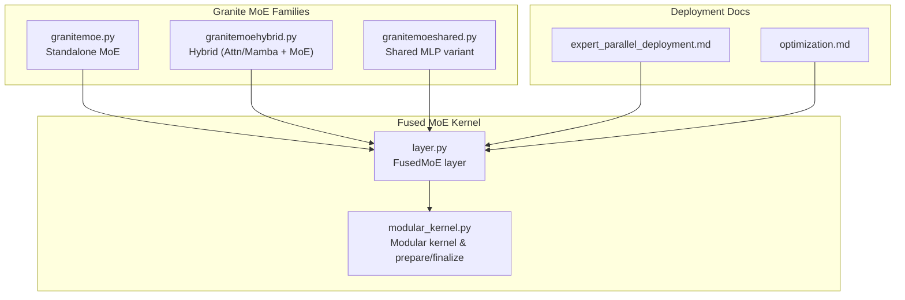
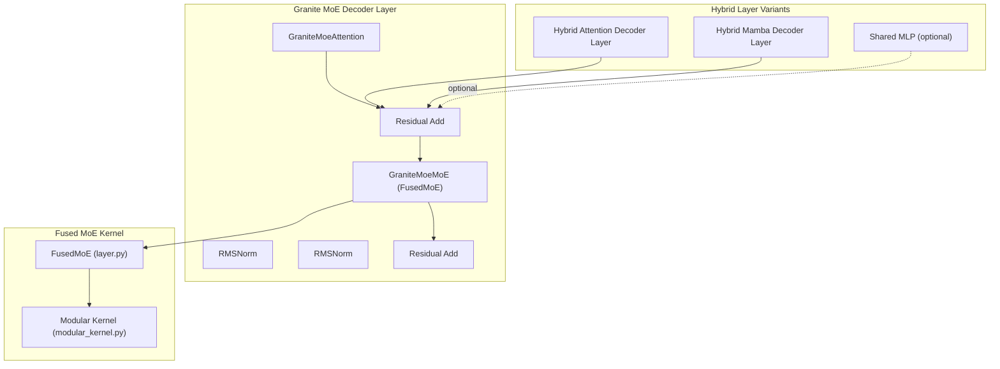
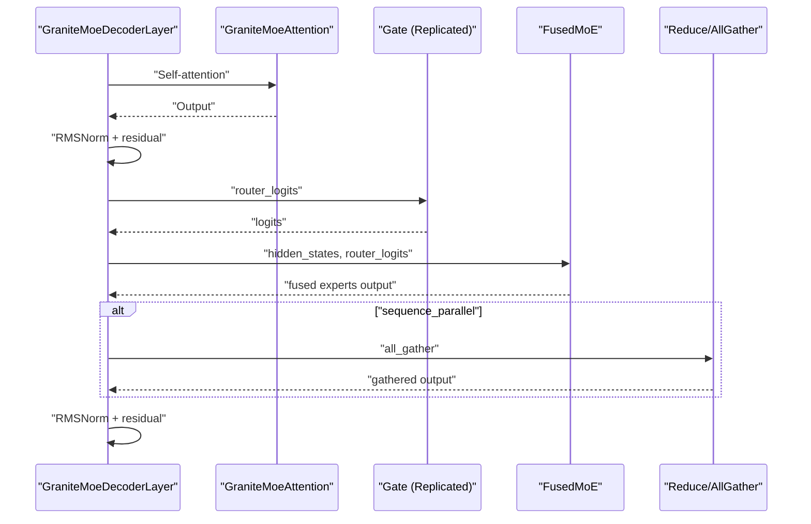
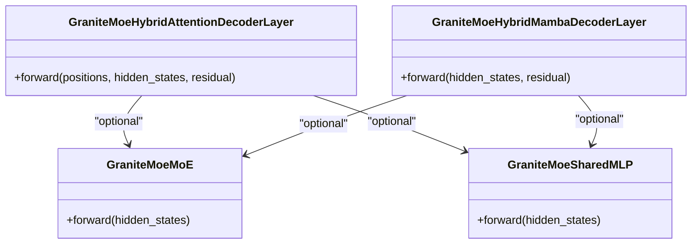
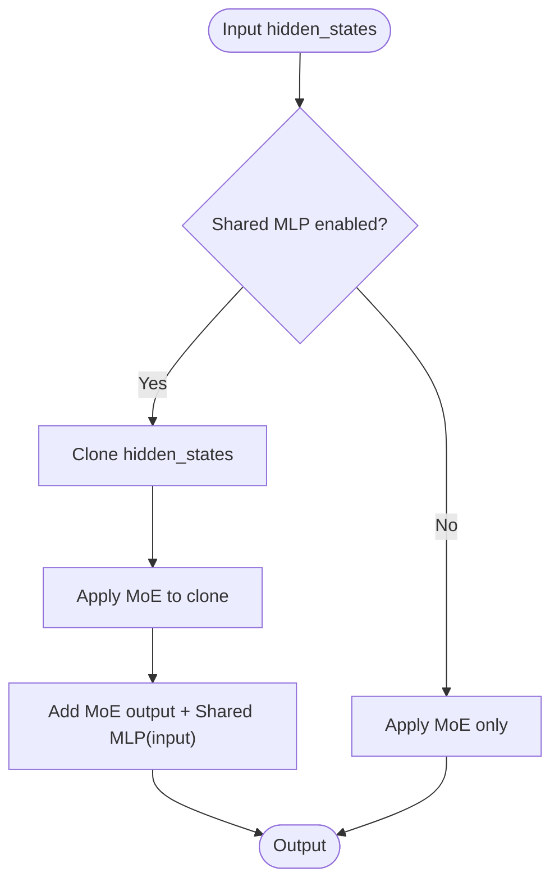
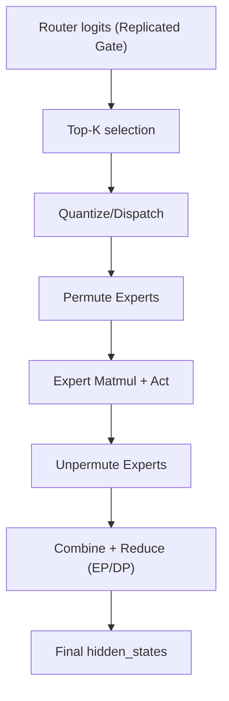
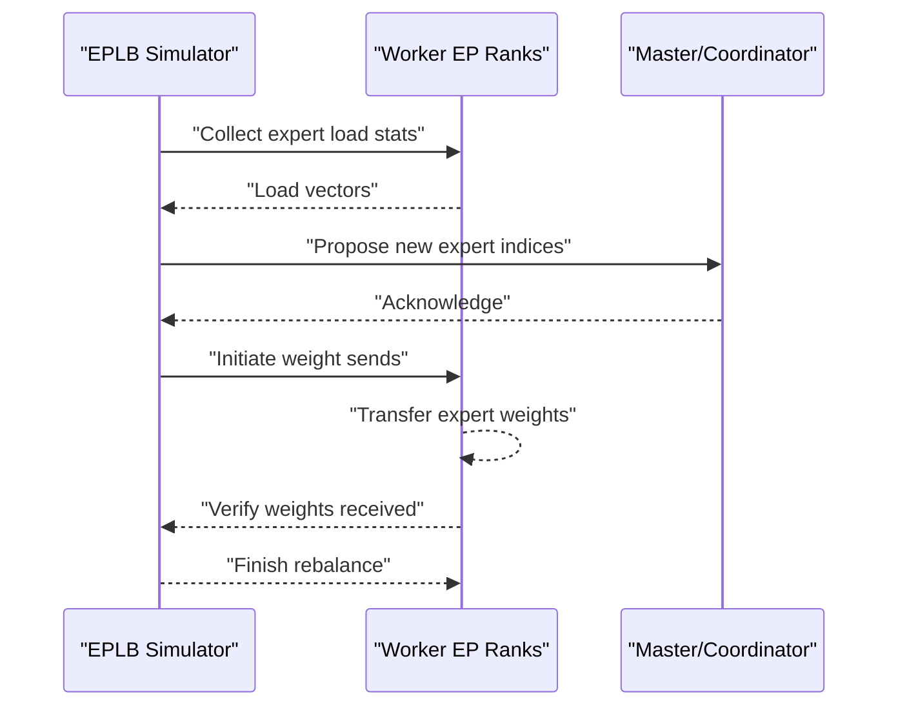
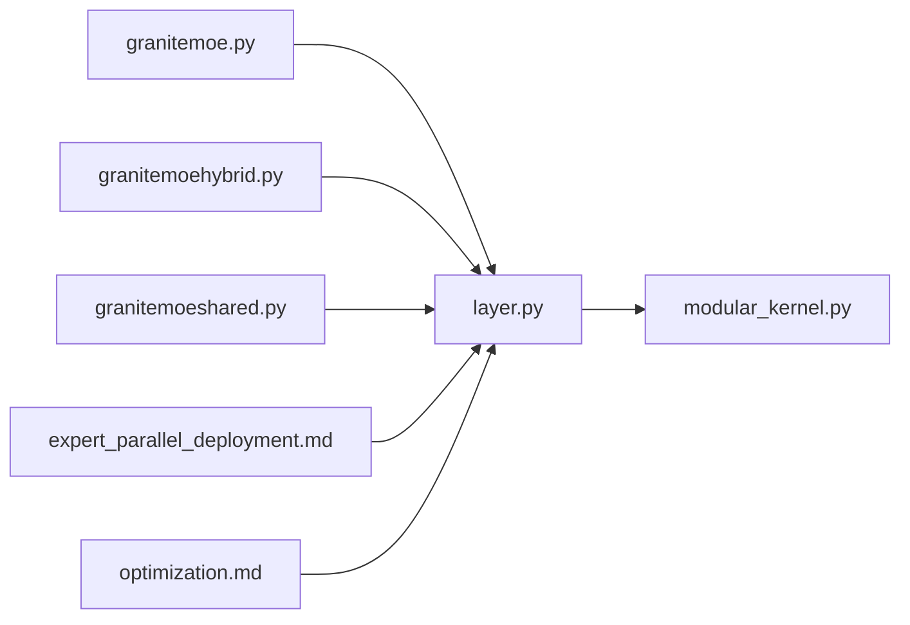

# Granite Mixture-of-Experts

<cite>
**Referenced Files in This Document**
- [granitemoe.py](file://vllm/model_executor/models/granitemoe.py)
- [granitemoehybrid.py](file://vllm/model_executor/models/granitemoehybrid.py)
- [granitemoeshared.py](file://vllm/model_executor/models/granitemoeshared.py)
- [layer.py](file://vllm/model_executor/layers/fused_moe/layer.py)
- [modular_kernel.py](file://vllm/model_executor/layers/fused_moe/modular_kernel.py)
- [expert_parallel_deployment.md](file://docs/serving/expert_parallel_deployment.md)
- [optimization.md](file://docs/configuration/optimization.md)
- [test_eplb_execute.py](file://tests/distributed/test_eplb_execute.py)
- [rebalance_execute.py](file://vllm/distributed/eplb/rebalance_execute.py)
- [eplb_state.py](file://vllm/distributed/eplb/eplb_state.py)
</cite>

## Table of Contents
1. [Introduction](#introduction)
2. [Project Structure](#project-structure)
3. [Core Components](#core-components)
4. [Architecture Overview](#architecture-overview)
5. [Detailed Component Analysis](#detailed-component-analysis)
6. [Dependency Analysis](#dependency-analysis)
7. [Performance Considerations](#performance-considerations)
8. [Troubleshooting Guide](#troubleshooting-guide)
9. [Conclusion](#conclusion)
10. [Appendices](#appendices)

## Introduction
This document explains the Granite Mixture-of-Experts (MoE) family in vLLM, covering standalone MoE, hybrid (attention/Mamba + MoE), and shared expert variants. It details expert routing, capacity management, and how Granite MoE achieves performance scaling through fused MoE kernels, expert parallelism (EP), and optional Expert Parallel Load Balancer (EPLB). Practical configuration guidance, expert utilization analysis, and enterprise-scale deployment strategies are included.

## Project Structure
The Granite MoE implementation spans three model families:
- Standalone MoE: [granitemoe.py](file://vllm/model_executor/models/granitemoe.py)
- Hybrid (attention + MoE) and (Mamba + MoE) variants: [granitemoehybrid.py](file://vllm/model_executor/models/granitemoehybrid.py)
- Shared expert variant: [granitemoeshared.py](file://vllm/model_executor/models/granitemoeshared.py)

These models compose a fused MoE layer ([layer.py](file://vllm/model_executor/layers/fused_moe/layer.py)) and a modular kernel framework ([modular_kernel.py](file://vllm/model_executor/layers/fused_moe/modular_kernel.py)). Deployment and scaling guidance is documented in:
- [expert_parallel_deployment.md](file://docs/serving/expert_parallel_deployment.md)
- [optimization.md](file://docs/configuration/optimization.md)

**Diagram sources**
- [granitemoe.py](file://vllm/model_executor/models/granitemoe.py#L1-L140)
- [granitemoehybrid.py](file://vllm/model_executor/models/granitemoehybrid.py#L1-L140)
- [granitemoeshared.py](file://vllm/model_executor/models/granitemoeshared.py#L1-L120)
- [layer.py](file://vllm/model_executor/layers/fused_moe/layer.py#L300-L520)
- [modular_kernel.py](file://vllm/model_executor/layers/fused_moe/modular_kernel.py#L660-L760)
- [expert_parallel_deployment.md](file://docs/serving/expert_parallel_deployment.md#L1-L120)
- [optimization.md](file://docs/configuration/optimization.md#L59-L127)

**Section sources**
- [granitemoe.py](file://vllm/model_executor/models/granitemoe.py#L1-L140)
- [granitemoehybrid.py](file://vllm/model_executor/models/granitemoehybrid.py#L1-L140)
- [granitemoeshared.py](file://vllm/model_executor/models/granitemoeshared.py#L1-L120)
- [layer.py](file://vllm/model_executor/layers/fused_moe/layer.py#L300-L520)
- [modular_kernel.py](file://vllm/model_executor/layers/fused_moe/modular_kernel.py#L660-L760)
- [expert_parallel_deployment.md](file://docs/serving/expert_parallel_deployment.md#L1-L120)
- [optimization.md](file://docs/configuration/optimization.md#L59-L127)

## Core Components
- GraniteMoeMoE: A tensor-parallel MoE implementation that shards each expert across all ranks and uses a fused MoE kernel for forward passes, followed by reductions across ranks when needed.
- GraniteMoeAttention: Multi-head attention with tensor-parallel head partitioning and rotary embeddings.
- GraniteMoeDecoderLayer: Applies attention followed by MoE with residual connections and RMSNorm.
- GraniteMoeModel: Stacks decoder layers, embedding, and normalization for standalone MoE.
- Hybrid variants: Combine attention or Mamba with MoE and optional shared MLP.
- Shared MLP: Adds a shared feed-forward branch alongside MoE for complementary capacity.
- FusedMoE layer: Provides configurable expert selection (top-k), quantization-aware dispatch, and EP/DP integration.
- Modular kernel: Separates preparation/finalization from expert permutation/unpermutation for flexible backends.

**Section sources**
- [granitemoe.py](file://vllm/model_executor/models/granitemoe.py#L67-L135)
- [granitemoe.py](file://vllm/model_executor/models/granitemoe.py#L137-L218)
- [granitemoe.py](file://vllm/model_executor/models/granitemoe.py#L220-L318)
- [granitemoehybrid.py](file://vllm/model_executor/models/granitemoehybrid.py#L53-L139)
- [granitemoehybrid.py](file://vllm/model_executor/models/granitemoehybrid.py#L141-L219)
- [granitemoeshared.py](file://vllm/model_executor/models/granitemoeshared.py#L38-L75)
- [granitemoeshared.py](file://vllm/model_executor/models/granitemoeshared.py#L77-L147)
- [layer.py](file://vllm/model_executor/layers/fused_moe/layer.py#L300-L520)
- [modular_kernel.py](file://vllm/model_executor/layers/fused_moe/modular_kernel.py#L660-L760)

## Architecture Overview
The Granite MoE stack composes attention/Mamba with MoE and optional shared MLP, all orchestrated by fused MoE kernels with EP/DP awareness.

**Diagram sources**
- [granitemoe.py](file://vllm/model_executor/models/granitemoe.py#L220-L318)
- [granitemoehybrid.py](file://vllm/model_executor/models/granitemoehybrid.py#L141-L219)
- [granitemoehybrid.py](file://vllm/model_executor/models/granitemoehybrid.py#L53-L139)
- [granitemoeshared.py](file://vllm/model_executor/models/granitemoeshared.py#L77-L147)
- [layer.py](file://vllm/model_executor/layers/fused_moe/layer.py#L300-L520)
- [modular_kernel.py](file://vllm/model_executor/layers/fused_moe/modular_kernel.py#L660-L760)

## Detailed Component Analysis

### Granite Standalone MoE
- Decoder layer applies attention then MoE with RMSNorm and residual connections.
- MoE uses a fused kernel with top-k expert selection and optional sequence-parallel reduction.
- Weight loading adapts checkpoint layouts to internal fused MoE structure.

**Diagram sources**
- [granitemoe.py](file://vllm/model_executor/models/granitemoe.py#L220-L318)
- [granitemoe.py](file://vllm/model_executor/models/granitemoe.py#L67-L135)
- [layer.py](file://vllm/model_executor/layers/fused_moe/layer.py#L300-L520)

**Section sources**
- [granitemoe.py](file://vllm/model_executor/models/granitemoe.py#L67-L135)
- [granitemoe.py](file://vllm/model_executor/models/granitemoe.py#L220-L318)

### Hybrid Architectures (Attention + MoE, Mamba + MoE)
- Hybrid attention layer: attention → residual → optional MoE + optional shared MLP.
- Hybrid Mamba layer: Mamba mixer → residual → optional MoE + optional shared MLP.
- Shared MLP is optional and can be fused with MoE output when present.

**Diagram sources**
- [granitemoehybrid.py](file://vllm/model_executor/models/granitemoehybrid.py#L141-L219)
- [granitemoehybrid.py](file://vllm/model_executor/models/granitemoehybrid.py#L53-L139)
- [granitemoeshared.py](file://vllm/model_executor/models/granitemoeshared.py#L38-L75)

**Section sources**
- [granitemoehybrid.py](file://vllm/model_executor/models/granitemoehybrid.py#L53-L139)
- [granitemoehybrid.py](file://vllm/model_executor/models/granitemoehybrid.py#L141-L219)
- [granitemoeshared.py](file://vllm/model_executor/models/granitemoeshared.py#L38-L75)

### Shared Expert Branch
- Shared MLP augments MoE output when present, enabling complementary capacity without increasing EP load.
- Activation is SiLU-and-multiply; forward combines MoE and shared MLP outputs.

**Diagram sources**
- [granitemoeshared.py](file://vllm/model_executor/models/granitemoeshared.py#L121-L147)
- [granitemoeshared.py](file://vllm/model_executor/models/granitemoeshared.py#L38-L75)

**Section sources**
- [granitemoeshared.py](file://vllm/model_executor/models/granitemoeshared.py#L77-L147)
- [granitemoeshared.py](file://vllm/model_executor/models/granitemoeshared.py#L149-L210)

### Fused MoE Routing and Capacity Management
- Router logits are computed by a replicated gate; top-k experts are selected per token.
- Dispatch/permute/unpermute and weight application are modularized; quantization and reductions are integrated.
- EP determines local expert count and mapping; optional round-robin or linear placement strategies.
- Optional EPLB redistributes expert assignments to balance load; redundant experts increase memory footprint.

**Diagram sources**
- [layer.py](file://vllm/model_executor/layers/fused_moe/layer.py#L300-L520)
- [layer.py](file://vllm/model_executor/layers/fused_moe/layer.py#L100-L187)
- [modular_kernel.py](file://vllm/model_executor/layers/fused_moe/modular_kernel.py#L660-L760)

**Section sources**
- [layer.py](file://vllm/model_executor/layers/fused_moe/layer.py#L100-L187)
- [layer.py](file://vllm/model_executor/layers/fused_moe/layer.py#L300-L520)
- [modular_kernel.py](file://vllm/model_executor/layers/fused_moe/modular_kernel.py#L660-L760)

### Expert Parallel Load Balancer (EPLB)
- Collects per-expert token loads and periodically rebalances expert-to-rank mapping.
- Supports redundant experts to guarantee availability of popular experts.
- Rebalancing involves point-to-point weight transfers and buffer moves across EP ranks.

**Diagram sources**
- [test_eplb_execute.py](file://tests/distributed/test_eplb_execute.py#L290-L330)
- [rebalance_execute.py](file://vllm/distributed/eplb/rebalance_execute.py#L165-L199)
- [eplb_state.py](file://vllm/distributed/eplb/eplb_state.py#L1052-L1090)

**Section sources**
- [test_eplb_execute.py](file://tests/distributed/test_eplb_execute.py#L290-L330)
- [rebalance_execute.py](file://vllm/distributed/eplb/rebalance_execute.py#L165-L199)
- [eplb_state.py](file://vllm/distributed/eplb/eplb_state.py#L1052-L1090)

## Dependency Analysis
- Granite models depend on FusedMoE for expert computation and on attention/Mamba modules for context modeling.
- FusedMoE integrates EP/DP groups, quantization, and modular prepare/finalize stages.
- Deployment docs describe EP sizing, backend selection, and EPLB configuration.

**Diagram sources**
- [granitemoe.py](file://vllm/model_executor/models/granitemoe.py#L1-L140)
- [granitemoehybrid.py](file://vllm/model_executor/models/granitemoehybrid.py#L1-L140)
- [granitemoeshared.py](file://vllm/model_executor/models/granitemoeshared.py#L1-L120)
- [layer.py](file://vllm/model_executor/layers/fused_moe/layer.py#L300-L520)
- [modular_kernel.py](file://vllm/model_executor/layers/fused_moe/modular_kernel.py#L660-L760)
- [expert_parallel_deployment.md](file://docs/serving/expert_parallel_deployment.md#L1-L120)
- [optimization.md](file://docs/configuration/optimization.md#L59-L127)

**Section sources**
- [granitemoe.py](file://vllm/model_executor/models/granitemoe.py#L1-L140)
- [granitemoehybrid.py](file://vllm/model_executor/models/granitemoehybrid.py#L1-L140)
- [granitemoeshared.py](file://vllm/model_executor/models/granitemoeshared.py#L1-L120)
- [layer.py](file://vllm/model_executor/layers/fused_moe/layer.py#L300-L520)
- [modular_kernel.py](file://vllm/model_executor/layers/fused_moe/modular_kernel.py#L660-L760)
- [expert_parallel_deployment.md](file://docs/serving/expert_parallel_deployment.md#L1-L120)
- [optimization.md](file://docs/configuration/optimization.md#L59-L127)

## Performance Considerations
- Expert Parallelism (EP) increases expert locality and throughput; EP size equals TP × DP for MoE layers.
- Backends: allgather_reducescatter (general), pplx (single-node), deepep_high_throughput (prefill), deepep_low_latency (decode), flashinfer_all2allv (NVLink), naive (debug).
- EPLB: enables redundant experts to balance load; overhead equals per-layer bytes-per-expert × (total experts + redundant) ÷ EP size.
- Chunked prefill and scheduling policies improve latency/throughput trade-offs.
- Shared experts stream overlap can reduce latency for small-batch workloads.

**Section sources**
- [expert_parallel_deployment.md](file://docs/serving/expert_parallel_deployment.md#L1-L120)
- [expert_parallel_deployment.md](file://docs/serving/expert_parallel_deployment.md#L136-L206)
- [optimization.md](file://docs/configuration/optimization.md#L30-L58)
- [modular_kernel.py](file://vllm/model_executor/layers/fused_moe/modular_kernel.py#L902-L933)

## Troubleshooting Guide
- Preemption warnings indicate insufficient KV cache; adjust gpu_memory_utilization, max_num_seqs, or tensor_parallel_size.
- EP backend issues: ensure DeepEP and pplx-kernels installed; verify InfiniBand/UCX/GDRCOPY setup; set GLOO_SOCKET_IFNAME on IB clusters.
- EPLB rebalancing failures: confirm environment variable thresholds and backend support; ensure adequate memory for redundant experts.

**Section sources**
- [optimization.md](file://docs/configuration/optimization.md#L1-L28)
- [expert_parallel_deployment.md](file://docs/serving/expert_parallel_deployment.md#L215-L226)

## Conclusion
Granite MoE in vLLM provides flexible architectures—standalone MoE, hybrid attention/Mamba with MoE, and shared MLP—to balance capacity and efficiency. Fused MoE kernels with EP/DP integration and optional EPLB deliver strong scaling and robustness. Deployment docs and optimization guides help tune performance and manage memory in enterprise environments.

## Appendices

### Practical Configuration Examples
- Enable EP and select backend:
  - Flags: --enable-expert-parallel, --all2all-backend <pplx|deepep_low_latency|deepep_high_throughput|flashinfer_all2allv|allgather_reducescatter>
  - EP size = TP × DP for MoE layers.
- Enable EPLB with redundant experts and logging:
  - Flags: --enable-eplb, --eplb-config '{"window_size":..., "step_interval":..., "num_redundant_experts":..., "log_balancedness":true}'
- Tune chunked prefill and scheduling:
  - max_num_batched_tokens tuning for ITL vs TTFT vs throughput.

**Section sources**
- [expert_parallel_deployment.md](file://docs/serving/expert_parallel_deployment.md#L1-L120)
- [expert_parallel_deployment.md](file://docs/serving/expert_parallel_deployment.md#L136-L206)
- [optimization.md](file://docs/configuration/optimization.md#L30-L58)

### Expert Utilization Analysis
- Monitor per-expert token counts and rebalancing metrics via EPLB logs.
- Observe EP rank utilization and imbalance indicators; adjust num_redundant_experts accordingly.

**Section sources**
- [eplb_state.py](file://vllm/distributed/eplb/eplb_state.py#L1052-L1090)
- [expert_parallel_deployment.md](file://docs/serving/expert_parallel_deployment.md#L136-L206)

### Scaling Considerations Across Variants
- Standalone MoE: focus on EP and fused kernel throughput.
- Hybrid variants: attention/Mamba compute plus MoE; shared MLP can offload common patterns.
- Shared MLP variant: reduces EP load by sharing capacity; suitable for balanced workloads.

**Section sources**
- [granitemoehybrid.py](file://vllm/model_executor/models/granitemoehybrid.py#L53-L139)
- [granitemoeshared.py](file://vllm/model_executor/models/granitemoeshared.py#L77-L147)

### Memory Management Strategies
- Prefer EP over TP for MoE layers to reduce per-GPU weight and KV cache pressure.
- Use chunked prefill to smooth compute/memory profiles.
- Reduce max_num_batched_tokens for lower latency; increase for higher throughput.
- Consider shared experts stream overlap for small-batch latency.

**Section sources**
- [optimization.md](file://docs/configuration/optimization.md#L1-L28)
- [optimization.md](file://docs/configuration/optimization.md#L30-L58)
- [modular_kernel.py](file://vllm/model_executor/layers/fused_moe/modular_kernel.py#L902-L933)