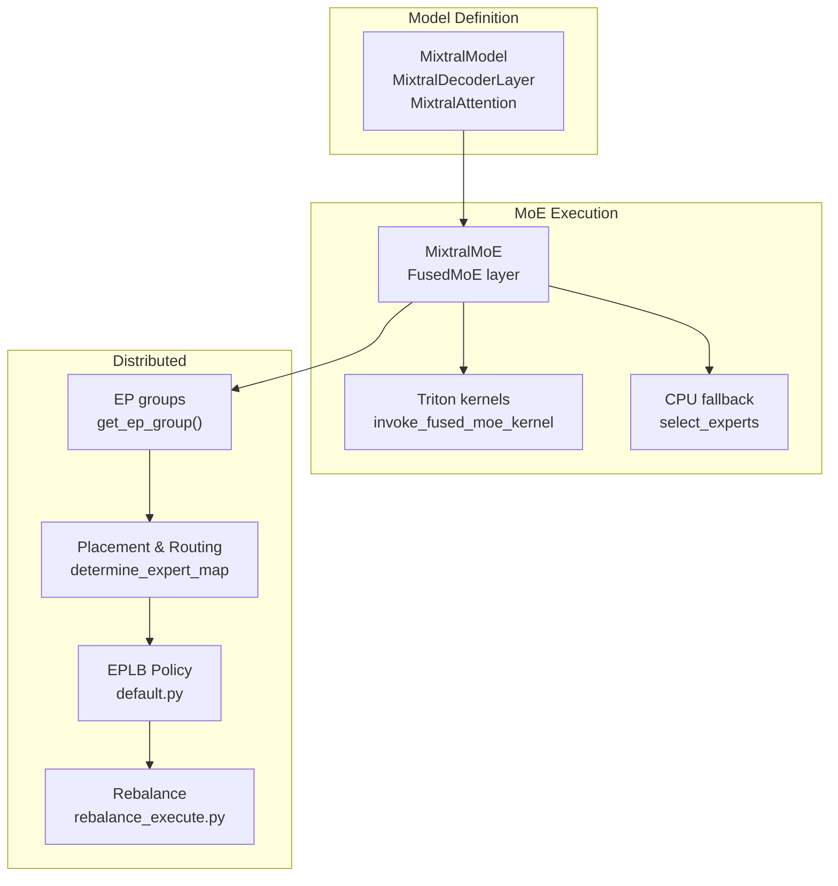
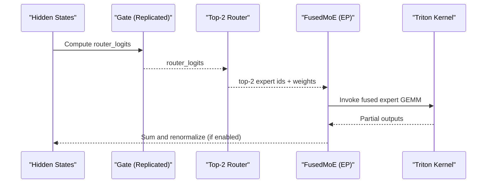
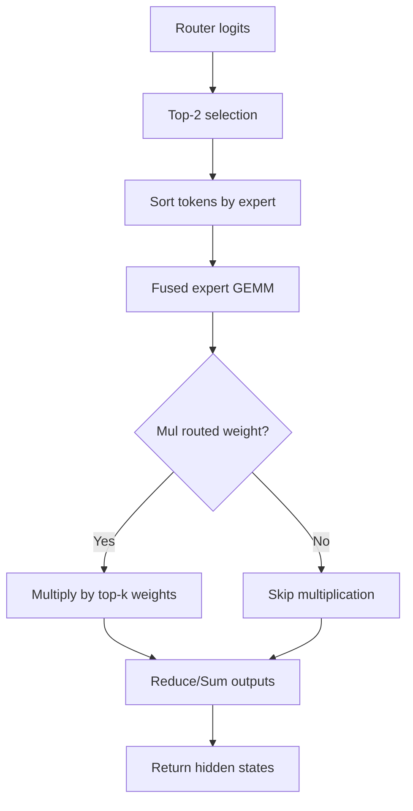
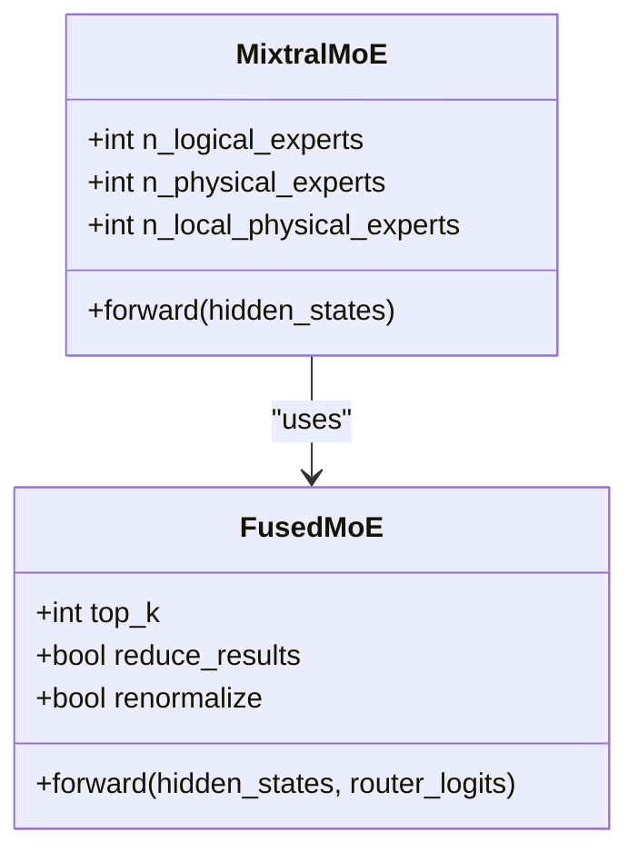
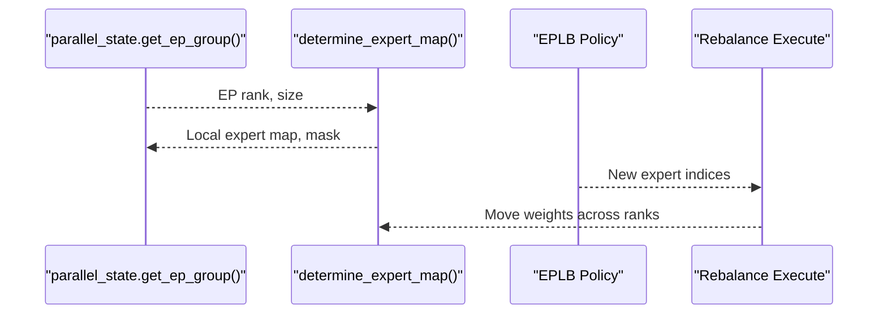
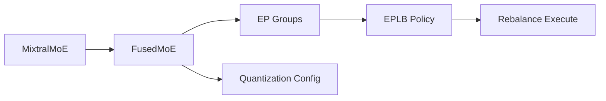

# Mixtral Mixture-of-Experts

<cite>
**Referenced Files in This Document**
- [mixtral.py](file://vllm/model_executor/models/mixtral.py)
- [fused_moe.py](file://vllm/model_executor/layers/fused_moe/fused_moe.py)
- [layer.py](file://vllm/model_executor/layers/fused_moe/layer.py)
- [config.py](file://vllm/model_executor/layers/fused_moe/config.py)
- [parallel_state.py](file://vllm/distributed/parallel_state.py)
- [expert_parallel_deployment.md](file://docs/serving/expert_parallel_deployment.md)
- [test_mixtral.py](file://tests/lora/test_mixtral.py)
- [test_routing_simulator.py](file://tests/test_routing_simulator.py)
- [test_cutedsl_moe.py](file://tests/kernels/moe/test_cutedsl_moe.py)
- [cpu_fused_moe.py](file://vllm/model_executor/layers/fused_moe/cpu_fused_moe.py)
- [default.py](file://vllm/distributed/eplb/policy/default.py)
- [rebalance_execute.py](file://vllm/distributed/eplb/rebalance_execute.py)
</cite>

## Table of Contents
1. [Introduction](#introduction)
2. [Project Structure](#project-structure)
3. [Core Components](#core-components)
4. [Architecture Overview](#architecture-overview)
5. [Detailed Component Analysis](#detailed-component-analysis)
6. [Dependency Analysis](#dependency-analysis)
7. [Performance Considerations](#performance-considerations)
8. [Troubleshooting Guide](#troubleshooting-guide)
9. [Conclusion](#conclusion)
10. [Appendices](#appendices)

## Introduction
This document explains Mixtral Mixture-of-Experts (MoE) in vLLM, covering the architecture, routing, expert sharding, load balancing, and performance tuning. It focuses on:
- Mixtral’s 16 experts per layer with top-2 routing
- Expert parallelism (EP) and fused MoE kernels
- EPLB (Expert Parallel Load Balancer) for expert utilization and load balancing
- Mixtral-specific configuration options and practical usage
- Memory management and expert activation sparsity handling

## Project Structure
The Mixtral implementation spans model definition, MoE layers, routing, and distributed execution:
- Model definition and layers: Mixtral decoder layer, attention, and MoE wrapper
- Fused MoE execution: Triton kernels, CPU fallback, and quantization-aware paths
- Distributed orchestration: EP groups, placement, and EPLB policies
- Documentation and tests: EP deployment guide, routing simulation, and LoRA compatibility

**Diagram sources**
- [mixtral.py](file://vllm/model_executor/models/mixtral.py#L74-L153)
- [fused_moe.py](file://vllm/model_executor/layers/fused_moe/fused_moe.py#L545-L736)
- [layer.py](file://vllm/model_executor/layers/fused_moe/layer.py#L324-L519)
- [parallel_state.py](file://vllm/distributed/parallel_state.py#L1117-L1120)
- [default.py](file://vllm/distributed/eplb/policy/default.py#L184-L220)
- [rebalance_execute.py](file://vllm/distributed/eplb/rebalance_execute.py#L165-L289)

**Section sources**
- [mixtral.py](file://vllm/model_executor/models/mixtral.py#L74-L153)
- [fused_moe.py](file://vllm/model_executor/layers/fused_moe/fused_moe.py#L545-L736)
- [layer.py](file://vllm/model_executor/layers/fused_moe/layer.py#L324-L519)
- [parallel_state.py](file://vllm/distributed/parallel_state.py#L1117-L1120)
- [expert_parallel_deployment.md](file://docs/serving/expert_parallel_deployment.md#L1-L120)

## Core Components
- MixtralMoE: Wraps a gate and a fused MoE module; computes router logits and applies top-2 selection per token.
- FusedMoE: Manages expert sharding, routing, and fused compute across EP ranks with Triton kernels.
- MixtralDecoderLayer: Integrates attention and MoE in transformer blocks.
- Expert Parallelism: EP groups and placement strategies distribute experts across GPUs.
- EPLB: Redistributes experts dynamically to balance load using redundant experts and rebalancing routines.

**Section sources**
- [mixtral.py](file://vllm/model_executor/models/mixtral.py#L74-L153)
- [layer.py](file://vllm/model_executor/layers/fused_moe/layer.py#L324-L519)
- [parallel_state.py](file://vllm/distributed/parallel_state.py#L1117-L1120)
- [expert_parallel_deployment.md](file://docs/serving/expert_parallel_deployment.md#L136-L206)

## Architecture Overview
Mixtral in vLLM follows a layered design:
- Each decoder layer contains self-attention and a block-sparse MoE sublayer.
- The MoE sublayer uses a replicated gate to produce router logits, then selects top-2 experts per token.
- FusedMoE executes the expert computations with sharded weights across EP ranks, optionally with renormalization and reduction across ranks.

**Diagram sources**
- [mixtral.py](file://vllm/model_executor/models/mixtral.py#L145-L153)
- [fused_moe.py](file://vllm/model_executor/layers/fused_moe/fused_moe.py#L545-L736)
- [layer.py](file://vllm/model_executor/layers/fused_moe/layer.py#L324-L519)

## Detailed Component Analysis

### Mixtral Architecture and Routing
- Each layer uses top-2 routing with softmax scoring and renormalization by default.
- The gate is replicated across ranks; experts are fused and executed per token assignment.
- The fused kernel writes zeros for inactive experts and multiplies by routed weights when enabled.

**Diagram sources**
- [fused_moe.py](file://vllm/model_executor/layers/fused_moe/fused_moe.py#L545-L736)
- [fused_moe.py](file://vllm/model_executor/layers/fused_moe/fused_moe.py#L1236-L1257)

**Section sources**
- [mixtral.py](file://vllm/model_executor/models/mixtral.py#L145-L153)
- [fused_moe.py](file://vllm/model_executor/layers/fused_moe/fused_moe.py#L545-L736)
- [fused_moe.py](file://vllm/model_executor/layers/fused_moe/fused_moe.py#L1236-L1257)

### FusedMoE Layer and Expert Sharding
- FusedMoE supports tensor parallel world size, data parallel, and expert parallel sizes.
- With EP enabled, experts are mapped locally per rank; routing tables are prepared to minimize cross-rank movement.
- Quantization-aware paths support FP8/W8A8, INT8/W8A8, INT8/W8A16, INT4/W4A16, and MXFP variants.

**Diagram sources**
- [mixtral.py](file://vllm/model_executor/models/mixtral.py#L74-L153)
- [layer.py](file://vllm/model_executor/layers/fused_moe/layer.py#L324-L519)

**Section sources**
- [layer.py](file://vllm/model_executor/layers/fused_moe/layer.py#L324-L519)
- [config.py](file://vllm/model_executor/layers/fused_moe/config.py#L1-L120)

### Expert Parallelism and Placement
- EP groups are built from TP and DP sizes; EP size equals TP × DP.
- Expert maps and masks are computed per rank; routing tables are initialized for fused execution.
- EP load balancing uses redundant experts and periodic rebalancing.

**Diagram sources**
- [parallel_state.py](file://vllm/distributed/parallel_state.py#L1401-L1416)
- [layer.py](file://vllm/model_executor/layers/fused_moe/layer.py#L482-L519)
- [default.py](file://vllm/distributed/eplb/policy/default.py#L184-L220)
- [rebalance_execute.py](file://vllm/distributed/eplb/rebalance_execute.py#L165-L289)

**Section sources**
- [expert_parallel_deployment.md](file://docs/serving/expert_parallel_deployment.md#L1-L120)
- [parallel_state.py](file://vllm/distributed/parallel_state.py#L1401-L1416)
- [layer.py](file://vllm/model_executor/layers/fused_moe/layer.py#L482-L519)
- [default.py](file://vllm/distributed/eplb/policy/default.py#L184-L220)
- [rebalance_execute.py](file://vllm/distributed/eplb/rebalance_execute.py#L165-L289)

### Mixtral-Specific Configuration Options
- num_experts: Derived from model config as local experts per layer.
- parallel_expert_groups: Determined by TP × DP; EP group is managed internally.
- expert_weights: Exposed via model metadata for downstream tools and monitoring.

Practical usage examples:
- Loading Mixtral with LoRA and tensor parallelism is demonstrated in tests.
- EP and EPLB flags are documented in the expert parallel deployment guide.

**Section sources**
- [mixtral.py](file://vllm/model_executor/models/mixtral.py#L525-L599)
- [test_mixtral.py](file://tests/lora/test_mixtral.py#L33-L78)
- [expert_parallel_deployment.md](file://docs/serving/expert_parallel_deployment.md#L1-L120)

### Practical Examples

#### Mixtral Model Loading and LoRA
- The test demonstrates initializing an LLM with LoRA enabled, tensor parallel size, and generating outputs with different LoRA adapters.

**Section sources**
- [test_mixtral.py](file://tests/lora/test_mixtral.py#L33-L78)

#### Expert Routing Visualization
- Tests provide utilities to simulate routing strategies and generate balanced routing for benchmarking.

**Section sources**
- [test_routing_simulator.py](file://tests/test_routing_simulator.py#L163-L199)
- [test_cutedsl_moe.py](file://tests/kernels/moe/test_cutedsl_moe.py#L87-L123)

### Performance Tuning for Different Expert Counts
- EP backend selection impacts throughput/latency; choose backends suited to prefill vs decode.
- EPLB with redundant experts improves balancedness at the cost of GPU memory.
- Quantization schemes influence kernel selection and memory bandwidth.

**Section sources**
- [expert_parallel_deployment.md](file://docs/serving/expert_parallel_deployment.md#L1-L120)
- [config.py](file://vllm/model_executor/layers/fused_moe/config.py#L1-L120)

## Dependency Analysis
- MixtralMoE depends on FusedMoE and EP groups; FusedMoE depends on routing and quantization configs; EP placement integrates with EPLB policy and rebalancing.

**Diagram sources**
- [mixtral.py](file://vllm/model_executor/models/mixtral.py#L74-L153)
- [layer.py](file://vllm/model_executor/layers/fused_moe/layer.py#L324-L519)
- [parallel_state.py](file://vllm/distributed/parallel_state.py#L1117-L1120)
- [default.py](file://vllm/distributed/eplb/policy/default.py#L184-L220)
- [rebalance_execute.py](file://vllm/distributed/eplb/rebalance_execute.py#L165-L289)

**Section sources**
- [mixtral.py](file://vllm/model_executor/models/mixtral.py#L74-L153)
- [layer.py](file://vllm/model_executor/layers/fused_moe/layer.py#L324-L519)
- [parallel_state.py](file://vllm/distributed/parallel_state.py#L1117-L1120)
- [default.py](file://vllm/distributed/eplb/policy/default.py#L184-L220)
- [rebalance_execute.py](file://vllm/distributed/eplb/rebalance_execute.py#L165-L289)

## Performance Considerations
- Use EP with appropriate backends for prefill/decode characteristics.
- Enable EPLB with tuned window and interval parameters; adjust redundant experts for memory budget.
- Prefer quantization schemes aligned with hardware capabilities to maximize fused kernel throughput.
- Route selection and renormalization impact numerical stability and throughput; keep renormalize enabled for Mixtral’s top-2 routing.

[No sources needed since this section provides general guidance]

## Troubleshooting Guide
- EP backend issues: Verify all2all backend selection and environment prerequisites for multi-node deployments.
- EPLB rebalancing: Monitor logs for balancedness metrics and adjust window/interval/redundant experts.
- Routing imbalance: Use routing simulator flags to force balanced routing during testing.

**Section sources**
- [expert_parallel_deployment.md](file://docs/serving/expert_parallel_deployment.md#L215-L226)
- [default.py](file://vllm/distributed/eplb/policy/default.py#L184-L220)
- [test_routing_simulator.py](file://tests/test_routing_simulator.py#L163-L199)

## Conclusion
vLLM’s Mixtral implementation combines a top-2 router with fused expert kernels and expert parallelism. EP distributes experts across GPUs, while EPLB mitigates skew via redundant experts and rebalancing. Quantization-aware kernels and configurable routing enable high throughput and memory efficiency. Proper backend selection and EPLB tuning are essential for production-grade performance.

[No sources needed since this section summarizes without analyzing specific files]

## Appendices

### Memory Management Strategies for Mixtral
- Expert activation sparsity: Fused kernels write zeros for inactive experts, reducing unnecessary compute.
- Quantization: FP8/W8A8 and INT4/W4A16 reduce bandwidth and improve kernel throughput.
- EPLB overhead: Redundant experts increase memory footprint; tune num_redundant_experts per GPU capacity.

**Section sources**
- [fused_moe.py](file://vllm/model_executor/layers/fused_moe/fused_moe.py#L545-L736)
- [config.py](file://vllm/model_executor/layers/fused_moe/config.py#L492-L773)
- [expert_parallel_deployment.md](file://docs/serving/expert_parallel_deployment.md#L183-L206)