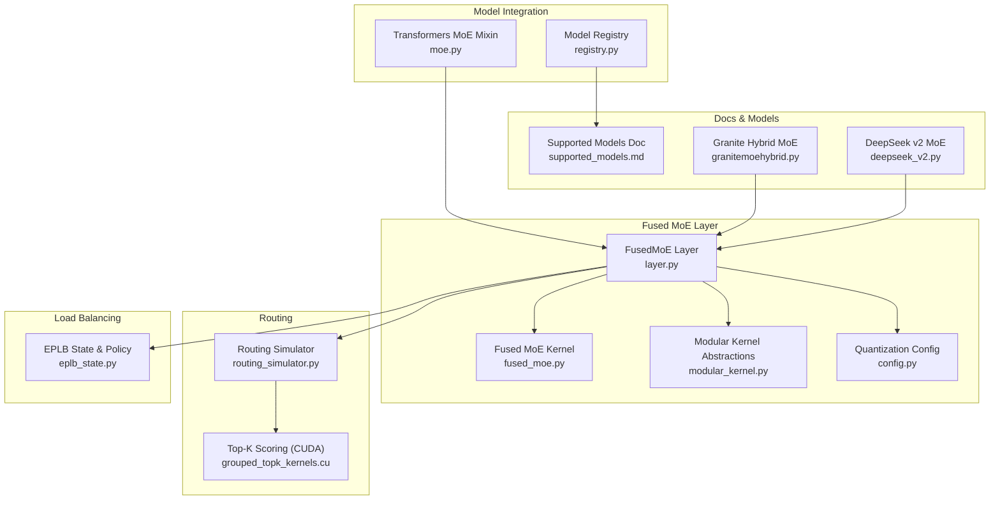
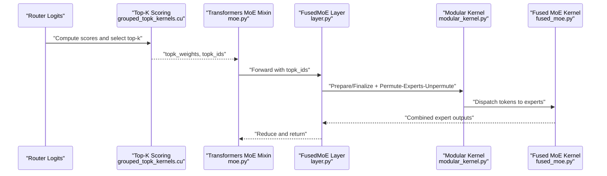
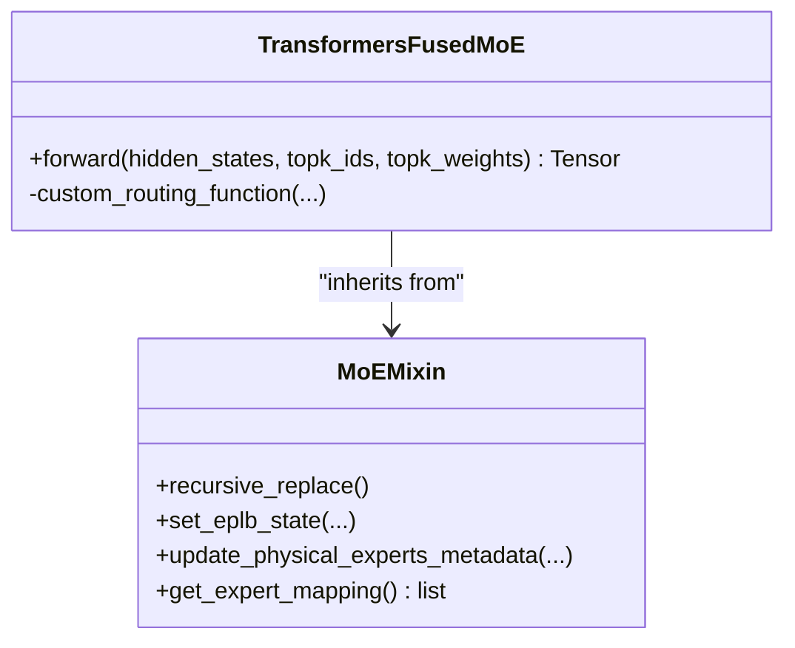
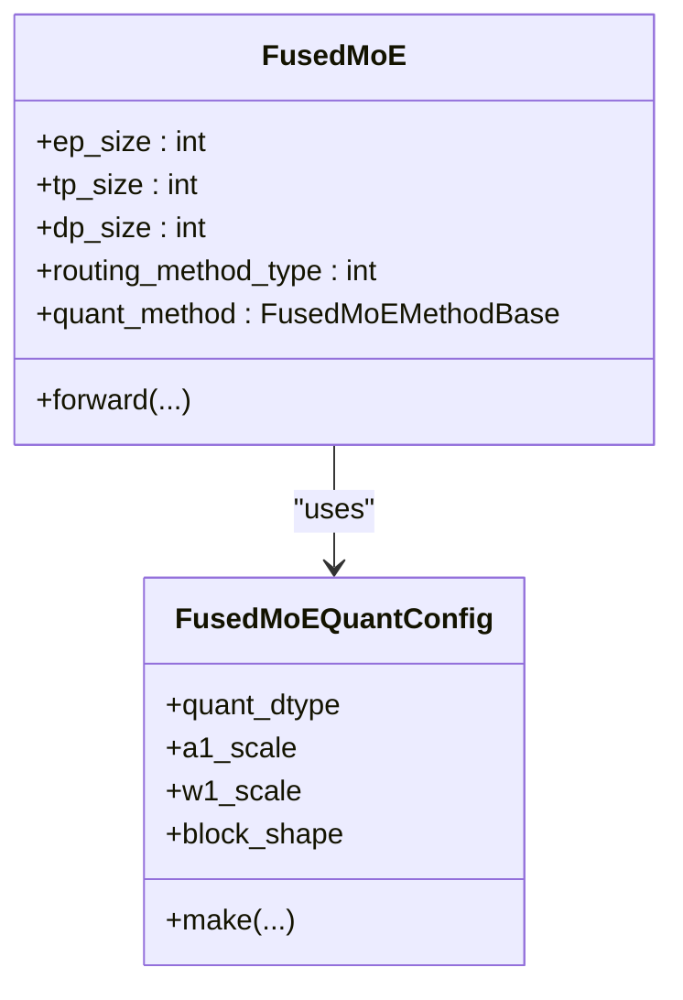
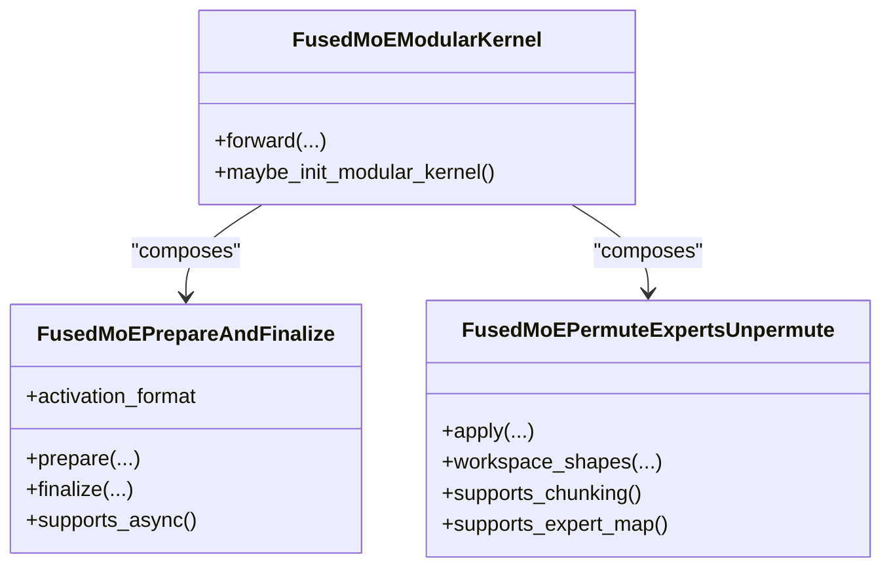
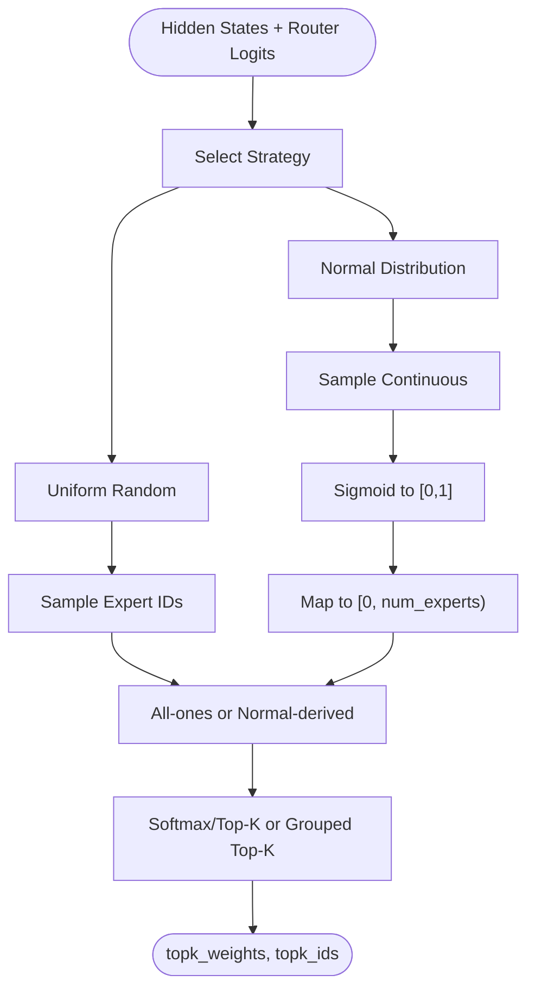
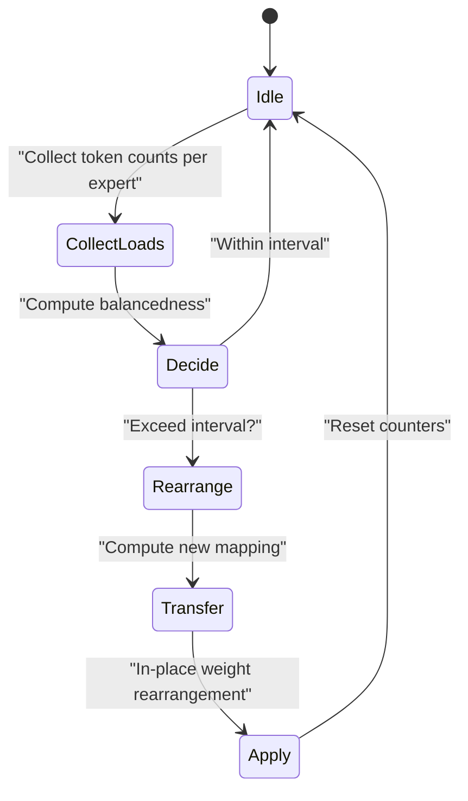
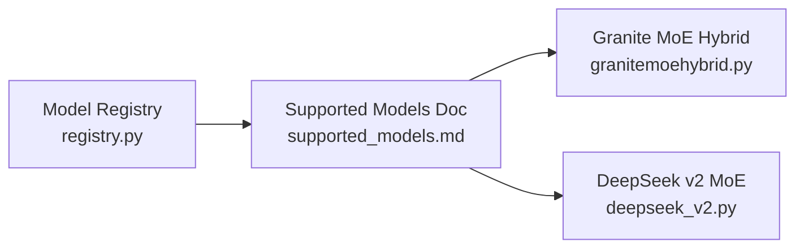
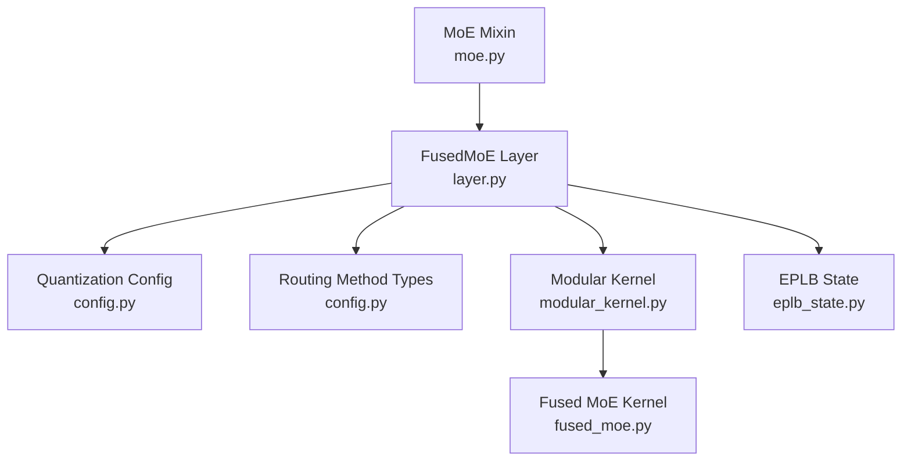

# Mixture-of-Experts Models

<cite>
**Referenced Files in This Document**
- [moe.py](file://vllm/model_executor/models/transformers/moe.py)
- [layer.py](file://vllm/model_executor/layers/fused_moe/layer.py)
- [fused_moe.py](file://vllm/model_executor/layers/fused_moe/fused_moe.py)
- [modular_kernel.py](file://vllm/model_executor/layers/fused_moe/modular_kernel.py)
- [config.py](file://vllm/model_executor/layers/fused_moe/config.py)
- [routing_simulator.py](file://vllm/model_executor/layers/fused_moe/routing_simulator.py)
- [eplb_state.py](file://vllm/distributed/eplb/eplb_state.py)
- [supported_models.md](file://docs/models/supported_models.md)
- [registry.py](file://vllm/model_executor/models/registry.py)
- [granitemoehybrid.py](file://vllm/model_executor/models/granitemoehybrid.py)
- [deepseek_v2.py](file://vllm/model_executor/models/deepseek_v2.py)
- [test_cutedsl_moe.py](file://tests/kernels/moe/test_cutedsl_moe.py)
- [test_routing_simulator.py](file://tests/test_routing_simulator.py)
- [grouped_topk_kernels.cu](file://csrc/moe/grouped_topk_kernels.cu)
</cite>

## Table of Contents
1. [Introduction](#introduction)
2. [Project Structure](#project-structure)
3. [Core Components](#core-components)
4. [Architecture Overview](#architecture-overview)
5. [Detailed Component Analysis](#detailed-component-analysis)
6. [Dependency Analysis](#dependency-analysis)
7. [Performance Considerations](#performance-considerations)
8. [Troubleshooting Guide](#troubleshooting-guide)
9. [Conclusion](#conclusion)
10. [Appendices](#appendices)

## Introduction
This document explains how vLLM implements Mixture-of-Experts (MoE) models, focusing on expert routing, load balancing, and parallel execution. It covers supported architectures, expert parallelism, top-1 and top-2 routing, distributed inference integration, memory management, and practical configuration tips. The goal is to make MoE internals understandable for both developers and operators who want to deploy and tune MoE models efficiently.

## Project Structure
MoE functionality spans several modules:
- Model integration mixins and replacements for Transformers-style MoE backends
- Fused MoE layers and quantization-aware kernels
- Routing simulator and top-k scoring logic
- Expert parallelism load balancer (EPLB) for dynamic expert placement
- Model registry and documentation of supported MoE families

**Diagram sources**
- [moe.py](file://vllm/model_executor/models/transformers/moe.py#L1-L326)
- [layer.py](file://vllm/model_executor/layers/fused_moe/layer.py#L300-L800)
- [fused_moe.py](file://vllm/model_executor/layers/fused_moe/fused_moe.py#L1-L220)
- [modular_kernel.py](file://vllm/model_executor/layers/fused_moe/modular_kernel.py#L1-L200)
- [config.py](file://vllm/model_executor/layers/fused_moe/config.py#L1-L120)
- [routing_simulator.py](file://vllm/model_executor/layers/fused_moe/routing_simulator.py#L1-L120)
- [grouped_topk_kernels.cu](file://csrc/moe/grouped_topk_kernels.cu#L652-L699)
- [eplb_state.py](file://vllm/distributed/eplb/eplb_state.py#L1-L120)
- [supported_models.md](file://docs/models/supported_models.md#L660-L725)
- [registry.py](file://vllm/model_executor/models/registry.py#L110-L131)
- [granitemoehybrid.py](file://vllm/model_executor/models/granitemoehybrid.py#L68-L103)
- [deepseek_v2.py](file://vllm/model_executor/models/deepseek_v2.py#L261-L287)

**Section sources**
- [moe.py](file://vllm/model_executor/models/transformers/moe.py#L1-L326)
- [layer.py](file://vllm/model_executor/layers/fused_moe/layer.py#L300-L800)
- [fused_moe.py](file://vllm/model_executor/layers/fused_moe/fused_moe.py#L1-L220)
- [modular_kernel.py](file://vllm/model_executor/layers/fused_moe/modular_kernel.py#L1-L200)
- [config.py](file://vllm/model_executor/layers/fused_moe/config.py#L1-L120)
- [routing_simulator.py](file://vllm/model_executor/layers/fused_moe/routing_simulator.py#L1-L120)
- [grouped_topk_kernels.cu](file://csrc/moe/grouped_topk_kernels.cu#L652-L699)
- [eplb_state.py](file://vllm/distributed/eplb/eplb_state.py#L1-L120)
- [supported_models.md](file://docs/models/supported_models.md#L660-L725)
- [registry.py](file://vllm/model_executor/models/registry.py#L110-L131)
- [granitemoehybrid.py](file://vllm/model_executor/models/granitemoehybrid.py#L68-L103)
- [deepseek_v2.py](file://vllm/model_executor/models/deepseek_v2.py#L261-L287)

## Core Components
- Transformers MoE Mixin and fused experts wrapper: integrates router outputs with fused MoE execution and handles expert parallel all-gather for routing indices.
- FusedMoE layer: orchestrates expert parallelism, quantization, activation formats, and distributed reductions; exposes routing method types and expert placement strategies.
- Modular kernel framework: separates “prepare/finalize” quantization and dispatch from “permute-unpermute” expert matmul, enabling DP+EP-friendly designs.
- Routing simulator: provides uniform and normal routing strategies for testing and profiling.
- EPLB: maintains logical-to-physical expert maps, sliding load windows, and policies to rebalance experts dynamically.

**Section sources**
- [moe.py](file://vllm/model_executor/models/transformers/moe.py#L40-L114)
- [layer.py](file://vllm/model_executor/layers/fused_moe/layer.py#L324-L420)
- [modular_kernel.py](file://vllm/model_executor/layers/fused_moe/modular_kernel.py#L150-L360)
- [routing_simulator.py](file://vllm/model_executor/layers/fused_moe/routing_simulator.py#L22-L120)
- [eplb_state.py](file://vllm/distributed/eplb/eplb_state.py#L207-L320)

## Architecture Overview
The vLLM MoE pipeline connects model routers to fused expert execution with optional quantization and expert parallelism. Routing can be top-1 or top-2 (grouped), and the modular kernel abstraction cleanly separates dispatch and compute.

**Diagram sources**
- [moe.py](file://vllm/model_executor/models/transformers/moe.py#L40-L114)
- [layer.py](file://vllm/model_executor/layers/fused_moe/layer.py#L324-L420)
- [modular_kernel.py](file://vllm/model_executor/layers/fused_moe/modular_kernel.py#L666-L760)
- [fused_moe.py](file://vllm/model_executor/layers/fused_moe/fused_moe.py#L545-L736)
- [grouped_topk_kernels.cu](file://csrc/moe/grouped_topk_kernels.cu#L652-L699)

## Detailed Component Analysis

### Transformers MoE Mixin and Router Integration
- The mixin wraps fused MoE for Transformers backends and injects a custom routing function that aligns top-k indices across DP/EP boundaries using all-gather when needed.
- It preserves router outputs and delegates fused MoE forward to a custom op that clones inputs to avoid in-place mutation conflicts.

**Diagram sources**
- [moe.py](file://vllm/model_executor/models/transformers/moe.py#L40-L114)
- [moe.py](file://vllm/model_executor/models/transformers/moe.py#L116-L326)

**Section sources**
- [moe.py](file://vllm/model_executor/models/transformers/moe.py#L40-L114)
- [moe.py](file://vllm/model_executor/models/transformers/moe.py#L116-L326)

### FusedMoE Layer: Expert Parallelism, Routing Methods, and Quantization
- Expert parallelism: determines local vs. global experts, builds expert maps, and logs placement strategy.
- Routing method types: softmax-based top-k, renormalized top-k, grouped top-k (DeepSeekV3-style), and top-1 sigmoid (Llama4-style).
- Quantization: supports FP8, INT8/INT4, MXFP4/MXFPMXFP8, NVFP4, and block/group-wise scales; exposes quant config builders.
- Distributed reductions: optional all-reduce at MLP output when TP/EP is enabled.

**Diagram sources**
- [layer.py](file://vllm/model_executor/layers/fused_moe/layer.py#L324-L420)
- [config.py](file://vllm/model_executor/layers/fused_moe/config.py#L100-L180)
- [config.py](file://vllm/model_executor/layers/fused_moe/config.py#L492-L712)

**Section sources**
- [layer.py](file://vllm/model_executor/layers/fused_moe/layer.py#L324-L420)
- [config.py](file://vllm/model_executor/layers/fused_moe/config.py#L100-L180)
- [config.py](file://vllm/model_executor/layers/fused_moe/config.py#L492-L712)

### Modular Kernel Framework: Prepare/Finalize and Permute-Experts-Unpermute
- Separates quantization and dispatch from expert matmul and combination, enabling flexible combinations of DP+EP and quantization strategies.
- Supports activation chunking, workspace sizing, and async prepare/finalize hooks for overlapping communication/computation.

**Diagram sources**
- [modular_kernel.py](file://vllm/model_executor/layers/fused_moe/modular_kernel.py#L150-L360)
- [modular_kernel.py](file://vllm/model_executor/layers/fused_moe/modular_kernel.py#L666-L800)

**Section sources**
- [modular_kernel.py](file://vllm/model_executor/layers/fused_moe/modular_kernel.py#L150-L360)
- [modular_kernel.py](file://vllm/model_executor/layers/fused_moe/modular_kernel.py#L666-L800)

### Routing Simulator and Top-K Scoring
- Provides uniform and normal distribution-based routing for simulation and profiling.
- Top-K scoring in CUDA implements renormalization and scaling factors for grouped top-k.

**Diagram sources**
- [routing_simulator.py](file://vllm/model_executor/layers/fused_moe/routing_simulator.py#L22-L120)
- [grouped_topk_kernels.cu](file://csrc/moe/grouped_topk_kernels.cu#L652-L699)

**Section sources**
- [routing_simulator.py](file://vllm/model_executor/layers/fused_moe/routing_simulator.py#L22-L120)
- [grouped_topk_kernels.cu](file://csrc/moe/grouped_topk_kernels.cu#L652-L699)

### Expert Parallelism Load Balancer (EPLB)
- Maintains logical-to-physical expert maps, sliding load windows, and triggers periodic rearrangements to balance token loads.
- Supports async transfer and hierarchical policies; integrates with model mixins to update expert metadata.

**Diagram sources**
- [eplb_state.py](file://vllm/distributed/eplb/eplb_state.py#L521-L660)
- [eplb_state.py](file://vllm/distributed/eplb/eplb_state.py#L660-L800)

**Section sources**
- [eplb_state.py](file://vllm/distributed/eplb/eplb_state.py#L521-L660)
- [eplb_state.py](file://vllm/distributed/eplb/eplb_state.py#L660-L800)

### Supported MoE Architectures and Model Integrations
- Registry lists multiple MoE-capable architectures, including Granite MoE variants, GLM-4 MoE, ERNIE 4.5 MoE, and others.
- Documentation enumerates supported models and their MoE features.
- Example model integrations:
  - Granite hybrid MoE with shared MLP and block-sparse MoE
  - DeepSeek v2 with redundant experts and EP-aware placement

**Diagram sources**
- [registry.py](file://vllm/model_executor/models/registry.py#L110-L131)
- [supported_models.md](file://docs/models/supported_models.md#L660-L725)
- [granitemoehybrid.py](file://vllm/model_executor/models/granitemoehybrid.py#L68-L103)
- [deepseek_v2.py](file://vllm/model_executor/models/deepseek_v2.py#L261-L287)

**Section sources**
- [registry.py](file://vllm/model_executor/models/registry.py#L110-L131)
- [supported_models.md](file://docs/models/supported_models.md#L660-L725)
- [granitemoehybrid.py](file://vllm/model_executor/models/granitemoehybrid.py#L68-L103)
- [deepseek_v2.py](file://vllm/model_executor/models/deepseek_v2.py#L261-L287)

## Dependency Analysis
- FusedMoE depends on quantization configs and routing method types to select appropriate kernels and dispatch strategies.
- Modular kernel composes prepare/finalize and permute-unpermute implementations, enabling clean separation of concerns.
- EPLB interacts with model mixins to update expert maps and metadata, and coordinates with distributed groups for load aggregation.

**Diagram sources**
- [layer.py](file://vllm/model_executor/layers/fused_moe/layer.py#L324-L420)
- [config.py](file://vllm/model_executor/layers/fused_moe/config.py#L100-L180)
- [modular_kernel.py](file://vllm/model_executor/layers/fused_moe/modular_kernel.py#L666-L800)
- [fused_moe.py](file://vllm/model_executor/layers/fused_moe/fused_moe.py#L545-L736)
- [eplb_state.py](file://vllm/distributed/eplb/eplb_state.py#L521-L660)
- [moe.py](file://vllm/model_executor/models/transformers/moe.py#L116-L200)

**Section sources**
- [layer.py](file://vllm/model_executor/layers/fused_moe/layer.py#L324-L420)
- [config.py](file://vllm/model_executor/layers/fused_moe/config.py#L100-L180)
- [modular_kernel.py](file://vllm/model_executor/layers/fused_moe/modular_kernel.py#L666-L800)
- [fused_moe.py](file://vllm/model_executor/layers/fused_moe/fused_moe.py#L545-L736)
- [eplb_state.py](file://vllm/distributed/eplb/eplb_state.py#L521-L660)
- [moe.py](file://vllm/model_executor/models/transformers/moe.py#L116-L200)

## Performance Considerations
- Expert count and capacity: Increasing logical experts improves diversity; adding redundant experts (EPLB) improves utilization and reduces hot-spot spikes.
- Top-k routing: top-2 grouped routing can improve accuracy and load balancing compared to top-1; renormalization reduces token probability skew.
- Quantization: FP8/INT8/INT4/MXFP4 pathways reduce bandwidth and improve throughput; block/group-wise scales can improve accuracy.
- Activation chunking: Enabling chunking reduces peak memory by processing tokens in smaller batches.
- Distributed chunking: DP chunking with EP-enabled kernels can improve throughput on large EP worlds.
- Shared experts: Separate CUDA stream for shared experts can overlap compute and communication.

[No sources needed since this section provides general guidance]

## Troubleshooting Guide
Common MoE issues and remedies:
- Imbalanced routing: Use EPLB with redundant experts and monitor balancedness metrics.
- Incorrect expert maps: Verify EP world size divides global experts and that placement strategy is supported for the backend.
- Quantization mismatches: Ensure quant dtype and group shapes match the selected kernel path.
- Routing simulator misuse: Only for profiling; outputs are not valid for inference.

Validation references:
- Balanced routing generation for tests
- Routing simulator usage in tests

**Section sources**
- [test_cutedsl_moe.py](file://tests/kernels/moe/test_cutedsl_moe.py#L91-L123)
- [test_routing_simulator.py](file://tests/test_routing_simulator.py#L163-L199)

## Conclusion
vLLM’s MoE stack combines a flexible fused execution layer, modular kernel abstractions, robust routing, and dynamic expert load balancing to deliver high-throughput, scalable MoE inference. By tuning expert counts, routing strategies, and quantization, operators can achieve strong scaling and performance across diverse architectures and workloads.

[No sources needed since this section summarizes without analyzing specific files]

## Appendices

### Practical Configuration Examples
- Enable EPLB with redundant experts for load balancing
- Select top-2 grouped routing for improved balance
- Choose FP8 or INT4 kernels for throughput; adjust block/group scales for accuracy
- Use activation chunking for memory-constrained environments

[No sources needed since this section provides general guidance]