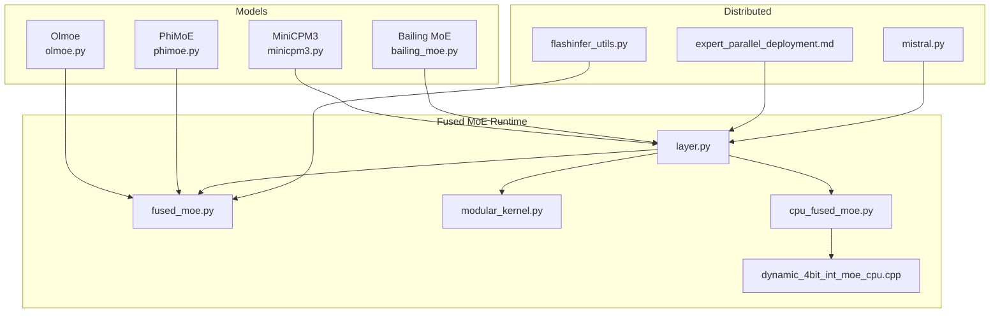
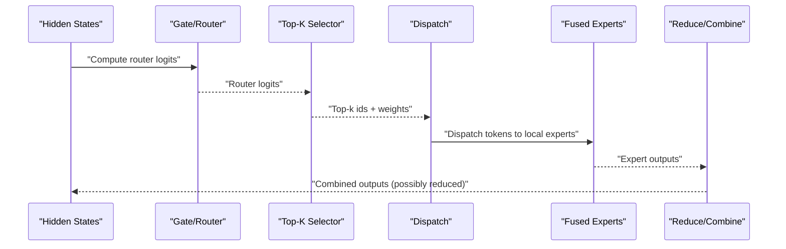
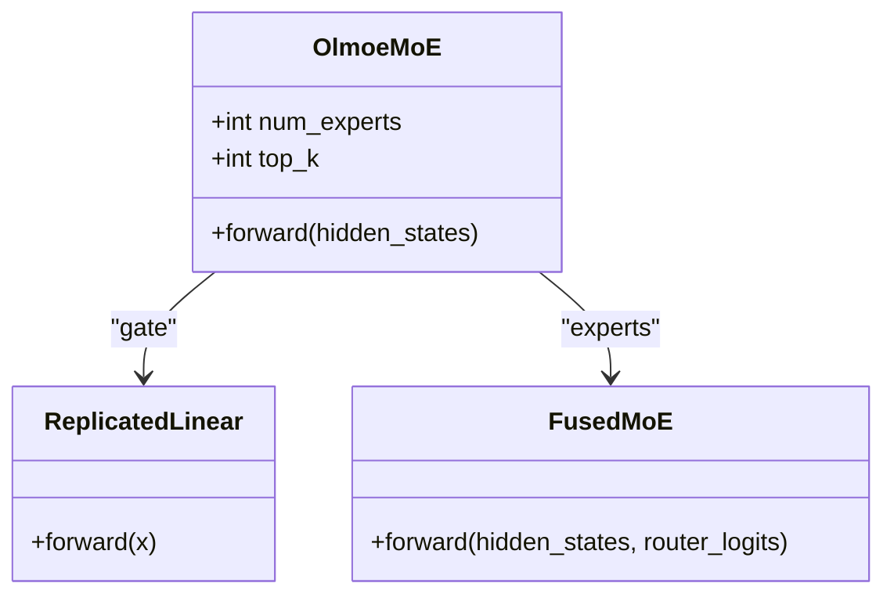
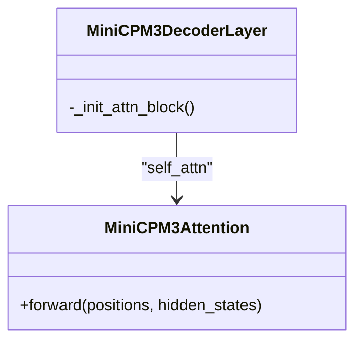
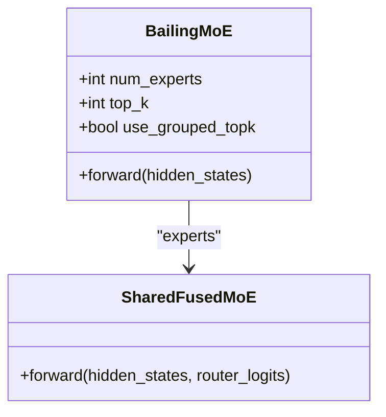
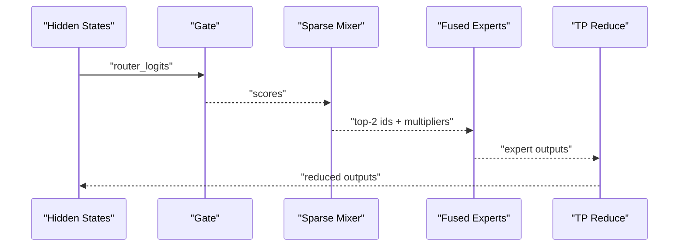
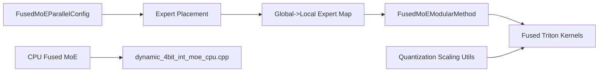

# Other Mixture-of-Experts Models

<cite>
**Referenced Files in This Document**
- [olmoe.py](file://vllm/model_executor/models/olmoe.py)
- [minicpm3.py](file://vllm/model_executor/models/minicpm3.py)
- [bailing_moe.py](file://vllm/model_executor/models/bailing_moe.py)
- [phimoe.py](file://vllm/model_executor/models/phimoe.py)
- [fused_moe.py](file://vllm/model_executor/layers/fused_moe/fused_moe.py)
- [layer.py](file://vllm/model_executor/layers/fused_moe/layer.py)
- [modular_kernel.py](file://vllm/model_executor/layers/fused_moe/modular_kernel.py)
- [cpu_fused_moe.py](file://vllm/model_executor/layers/fused_moe/cpu_fused_moe.py)
- [dynamic_4bit_int_moe_cpu.cpp](file://csrc/moe/dynamic_4bit_int_moe_cpu.cpp)
- [test_phimoe.py](file://tests/models/language/generation/test_phimoe.py)
- [expert_parallel_deployment.md](file://docs/serving/expert_parallel_deployment.md)
- [mistral.py](file://vllm/transformers_utils/configs/mistral.py)
- [flashinfer_utils.py](file://vllm/model_executor/layers/quantization/utils/flashinfer_utils.py)
</cite>

## Table of Contents
1. [Introduction](#introduction)
2. [Project Structure](#project-structure)
3. [Core Components](#core-components)
4. [Architecture Overview](#architecture-overview)
5. [Detailed Component Analysis](#detailed-component-analysis)
6. [Dependency Analysis](#dependency-analysis)
7. [Performance Considerations](#performance-considerations)
8. [Troubleshooting Guide](#troubleshooting-guide)
9. [Conclusion](#conclusion)
10. [Appendices](#appendices)

## Introduction
This document explains specialized Mixture-of-Experts (MoE) models supported in vLLM beyond mainstream Mixtral-style implementations. It focuses on:
- Olmoe: an inference-only model compatible with HuggingFace weights, with tensor-parallel MoE routing and fused experts.
- MiniCPM3 MoE: integrates advanced attention variants with MoE routing and grouped top-k selection.
- Bailing MoE: supports grouped top-k routing, optional shared experts, and configurable normalization and scaling.
- Phi MoE variants: introduces a custom routing function (“sparse mixer”) for top-2 selection with non-renormalized probabilities.

We describe each model’s architectural features, expert routing mechanisms, and optimization strategies. We also explain how these models integrate with vLLM’s distributed inference capabilities (TP/EP/DP/PCP) and memory management, and provide practical configuration, performance tuning, and scaling guidance.

## Project Structure
The MoE implementations are located under model executors and fused MoE layers:
- Model families: olmoe.py, minicpm3.py, bailing_moe.py, phimoe.py
- Fused MoE runtime: fused_moe.py, layer.py, modular_kernel.py, cpu_fused_moe.py
- CPU expert dispatch: dynamic_4bit_int_moe_cpu.cpp
- Distributed EP backends and deployment guide: docs/serving/expert_parallel_deployment.md
- Config mapping for grouped top-k: vllm/transformers_utils/configs/mistral.py
- Quantization scaling helpers: vllm/model_executor/layers/quantization/utils/flashinfer_utils.py

**Diagram sources**
- [olmoe.py](file://vllm/model_executor/models/olmoe.py#L64-L115)
- [minicpm3.py](file://vllm/model_executor/models/minicpm3.py#L186-L234)
- [bailing_moe.py](file://vllm/model_executor/models/bailing_moe.py#L209-L332)
- [phimoe.py](file://vllm/model_executor/models/phimoe.py#L245-L300)
- [fused_moe.py](file://vllm/model_executor/layers/fused_moe/fused_moe.py#L1-L200)
- [layer.py](file://vllm/model_executor/layers/fused_moe/layer.py#L1-L200)
- [modular_kernel.py](file://vllm/model_executor/layers/fused_moe/modular_kernel.py#L1231-L1262)
- [cpu_fused_moe.py](file://vllm/model_executor/layers/fused_moe/cpu_fused_moe.py#L80-L116)
- [dynamic_4bit_int_moe_cpu.cpp](file://csrc/moe/dynamic_4bit_int_moe_cpu.cpp#L48-L88)
- [expert_parallel_deployment.md](file://docs/serving/expert_parallel_deployment.md#L19-L38)
- [mistral.py](file://vllm/transformers_utils/configs/mistral.py#L213-L235)
- [flashinfer_utils.py](file://vllm/model_executor/layers/quantization/utils/flashinfer_utils.py#L158-L191)

**Section sources**
- [olmoe.py](file://vllm/model_executor/models/olmoe.py#L64-L115)
- [bailing_moe.py](file://vllm/model_executor/models/bailing_moe.py#L209-L332)
- [phimoe.py](file://vllm/model_executor/models/phimoe.py#L245-L300)
- [minicpm3.py](file://vllm/model_executor/models/minicpm3.py#L186-L234)
- [fused_moe.py](file://vllm/model_executor/layers/fused_moe/fused_moe.py#L1-L200)
- [layer.py](file://vllm/model_executor/layers/fused_moe/layer.py#L1-L200)
- [expert_parallel_deployment.md](file://docs/serving/expert_parallel_deployment.md#L19-L38)

## Core Components
- OlmoeMoE: tensor-parallel MoE with a replicated gate and fused experts; outputs reduced across TP ranks.
- BailingMoE: configurable grouped top-k routing, optional shared experts, optional normalization of expert probabilities, and optional all-reduce after expert fusion.
- PhiMoE: uses a custom “sparse mixer” routing function for top-2 selection with non-renormalized probabilities and fused experts.
- MiniCPM3Attention: integrates structured head projections and rotary embeddings; paired with MoE routing in downstream layers.

Key runtime components:
- FusedMoE: dispatch, grouped top-k selection, expert compute, and reduction/back-combine.
- FusedMoEModularMethod: quantization-aware modular kernel composition and EP routing tables.
- CPU fused MoE: CPU-side grouped top-k and expert selection.
- Dynamic 4-bit int MoE CPU: token-to-expert bucketing and dispatch for CPU kernels.

**Section sources**
- [olmoe.py](file://vllm/model_executor/models/olmoe.py#L64-L115)
- [bailing_moe.py](file://vllm/model_executor/models/bailing_moe.py#L209-L332)
- [phimoe.py](file://vllm/model_executor/models/phimoe.py#L231-L243)
- [minicpm3.py](file://vllm/model_executor/models/minicpm3.py#L186-L234)
- [fused_moe.py](file://vllm/model_executor/layers/fused_moe/fused_moe.py#L873-L909)
- [layer.py](file://vllm/model_executor/layers/fused_moe/layer.py#L658-L700)
- [cpu_fused_moe.py](file://vllm/model_executor/layers/fused_moe/cpu_fused_moe.py#L80-L116)
- [dynamic_4bit_int_moe_cpu.cpp](file://csrc/moe/dynamic_4bit_int_moe_cpu.cpp#L48-L88)

## Architecture Overview
Each model composes attention, routing, and MoE layers. The fused MoE layer orchestrates:
- Router logits computation
- Top-k selection (with optional grouped top-k)
- Dispatch to local experts
- Quantized or unquantized expert compute
- Reduction/back-combine across TP/EP

**Diagram sources**
- [fused_moe.py](file://vllm/model_executor/layers/fused_moe/fused_moe.py#L1-L200)
- [layer.py](file://vllm/model_executor/layers/fused_moe/layer.py#L1869-L1904)
- [modular_kernel.py](file://vllm/model_executor/layers/fused_moe/modular_kernel.py#L1231-L1262)

## Detailed Component Analysis

### Olmoe
- Architecture: Decoder layer with attention and a tensor-parallel MoE block. The gate is replicated; experts are fused and reduced across TP ranks.
- Routing: Standard softmax top-k selection via fused MoE.
- Optimizations: Uses fused kernels for dispatch/combine; leverages quantization config; supports torch.compile.

**Diagram sources**
- [olmoe.py](file://vllm/model_executor/models/olmoe.py#L64-L115)
- [fused_moe.py](file://vllm/model_executor/layers/fused_moe/fused_moe.py#L1-L200)

Practical notes:
- Distributed: TP reduces outputs across ranks; EP can be combined with TP/DP/PCP via fused MoE parallel config.
- Memory: Fused kernels minimize intermediate buffers; quantization reduces bandwidth.

**Section sources**
- [olmoe.py](file://vllm/model_executor/models/olmoe.py#L64-L115)
- [layer.py](file://vllm/model_executor/layers/fused_moe/layer.py#L100-L187)

### MiniCPM3 MoE
- Architecture: Extends MiniCPM with a specialized attention variant (MiniCPM3Attention) featuring separate “nope” and “pe” projections and rotary embeddings; MoE routing is integrated into the decoder stack.
- Routing: Uses fused MoE with grouped top-k when configured; supports shared experts and routed scaling factors.
- Optimizations: Efficient head projections and attention layout; fused MoE dispatch/combine.

**Diagram sources**
- [minicpm3.py](file://vllm/model_executor/models/minicpm3.py#L186-L234)

Practical notes:
- Grouped top-k and shared experts are controlled via model config; mapped to fused MoE parameters.
- Scaling and normalization are configurable to balance load and stability.

**Section sources**
- [minicpm3.py](file://vllm/model_executor/models/minicpm3.py#L186-L234)
- [mistral.py](file://vllm/transformers_utils/configs/mistral.py#L213-L235)

### Bailing MoE
- Architecture: Implements a configurable MoE with optional shared experts, grouped top-k routing, and optional normalization of expert probabilities. Supports tensor parallel reduction.
- Routing: Standard top-k with optional grouped top-k; supports sigmoid or softmax scoring; optional expert bias correction.
- Optimizations: Shared experts reduce compute for dense-like layers; routed scaling factor adjusts output magnitude.

**Diagram sources**
- [bailing_moe.py](file://vllm/model_executor/models/bailing_moe.py#L209-L332)
- [fused_moe.py](file://vllm/model_executor/layers/fused_moe/fused_moe.py#L1-L200)

Practical notes:
- Grouped top-k is enabled by specifying group sizes; fused kernel handles dispatch efficiently.
- Optional all-reduce after expert fusion aligns with TP semantics.

**Section sources**
- [bailing_moe.py](file://vllm/model_executor/models/bailing_moe.py#L209-L332)
- [layer.py](file://vllm/model_executor/layers/fused_moe/layer.py#L1869-L1904)

### Phi MoE Variants
- Architecture: Tensor-parallel MoE with a custom routing function (“sparse mixer”) that selects two experts per token without renormalization; fused experts compute outputs and reduce across TP ranks.
- Routing: Custom function computes masks and multipliers for gradient correctness; top-2 selection enforced.
- Optimizations: Autograd function ensures correct gradients through masking; fused kernel handles dispatch/combine.

**Diagram sources**
- [phimoe.py](file://vllm/model_executor/models/phimoe.py#L141-L243)
- [phimoe.py](file://vllm/model_executor/models/phimoe.py#L245-L300)
- [fused_moe.py](file://vllm/model_executor/layers/fused_moe/fused_moe.py#L1-L200)

Practical notes:
- Only top-2 routing is supported by the custom function.
- Renormalization is disabled by design for this routing scheme.

**Section sources**
- [phimoe.py](file://vllm/model_executor/models/phimoe.py#L141-L243)
- [phimoe.py](file://vllm/model_executor/models/phimoe.py#L245-L300)
- [test_phimoe.py](file://tests/models/language/generation/test_phimoe.py#L1-L40)

## Dependency Analysis
- Expert placement and EP mapping: Determined by fused MoE parallel config and expert placement strategy (linear/round-robin). EP size affects how experts are distributed across ranks.
- Quantization scaling: Helpers compute output scales for FP8 pathways to maintain numerical stability.
- CPU dispatch fallback: Token-to-expert bucketing and offsets computed on CPU for 4-bit kernels.

**Diagram sources**
- [layer.py](file://vllm/model_executor/layers/fused_moe/layer.py#L100-L187)
- [flashinfer_utils.py](file://vllm/model_executor/layers/quantization/utils/flashinfer_utils.py#L158-L191)
- [dynamic_4bit_int_moe_cpu.cpp](file://csrc/moe/dynamic_4bit_int_moe_cpu.cpp#L48-L88)

**Section sources**
- [layer.py](file://vllm/model_executor/layers/fused_moe/layer.py#L100-L187)
- [flashinfer_utils.py](file://vllm/model_executor/layers/quantization/utils/flashinfer_utils.py#L158-L191)
- [dynamic_4bit_int_moe_cpu.cpp](file://csrc/moe/dynamic_4bit_int_moe_cpu.cpp#L48-L88)

## Performance Considerations
- Expert parallel backends: Choose EP backends based on workload characteristics (prefill vs decode) and hardware (NVLink).
- Grouped top-k: Improves load balancing and reduces imbalance; enable via model config mapping.
- Quantization: FP8 pathways and scaling factors help reduce memory bandwidth; ensure correct scale registration.
- CPU dispatch: For CPU MoE kernels, token bucketing and offsets minimize overhead.

[No sources needed since this section provides general guidance]

## Troubleshooting Guide
Common issues and checks:
- EP backend selection: Verify EP backend matches hardware and workload (prefill vs decode).
- Grouped top-k configuration: Ensure group sizes are set consistently with model config.
- Quantization scales: Confirm output scales are registered for FP8 pathways.
- Custom routing: For Phi MoE, confirm top-2 routing is enforced and renormalization is disabled as intended.

**Section sources**
- [expert_parallel_deployment.md](file://docs/serving/expert_parallel_deployment.md#L19-L38)
- [mistral.py](file://vllm/transformers_utils/configs/mistral.py#L213-L235)
- [flashinfer_utils.py](file://vllm/model_executor/layers/quantization/utils/flashinfer_utils.py#L158-L191)
- [phimoe.py](file://vllm/model_executor/models/phimoe.py#L231-L243)

## Conclusion
These specialized MoE models showcase diverse routing strategies and optimizations:
- Olmoe emphasizes tensor-parallel fused experts with a replicated gate.
- MiniCPM3 integrates structured attention with grouped top-k and shared experts.
- Bailing MoE offers flexible routing (grouped top-k, normalization, scoring) and optional shared experts.
- Phi MoE variants introduce a custom “sparse mixer” routing function tailored for top-2 selection.

They leverage vLLM’s fused MoE runtime, quantization helpers, and distributed EP backends to achieve strong performance and scalability.

[No sources needed since this section summarizes without analyzing specific files]

## Appendices

### Practical Configuration and Scaling Tips
- Enable expert parallel: Use the documented EP flag and note that EP size equals TP × DP in typical configurations.
- Configure grouped top-k: Set group sizes and top-k per group according to model config mapping.
- Quantization: For FP8, ensure output scales are registered and used by the fused kernels.
- CPU fallback: For CPU MoE kernels, ensure token bucketing and offsets are computed correctly.

**Section sources**
- [expert_parallel_deployment.md](file://docs/serving/expert_parallel_deployment.md#L19-L38)
- [mistral.py](file://vllm/transformers_utils/configs/mistral.py#L213-L235)
- [flashinfer_utils.py](file://vllm/model_executor/layers/quantization/utils/flashinfer_utils.py#L158-L191)