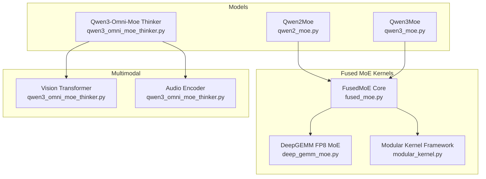
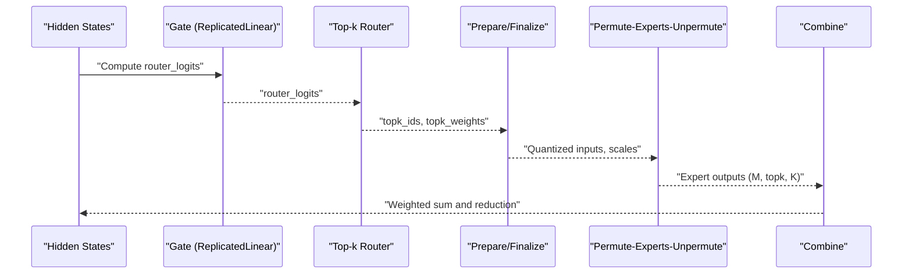
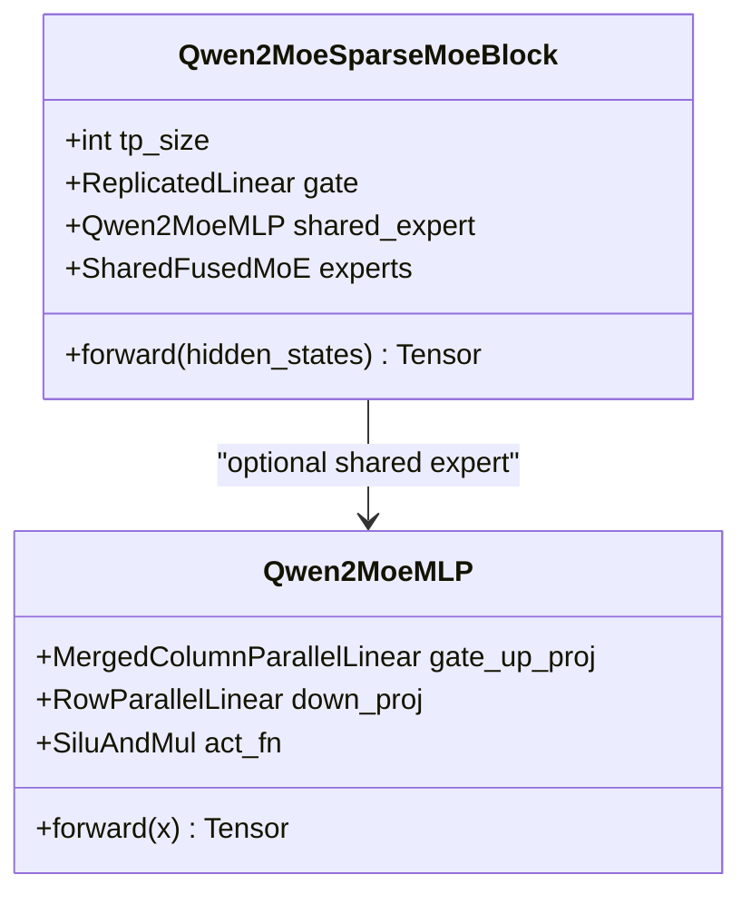
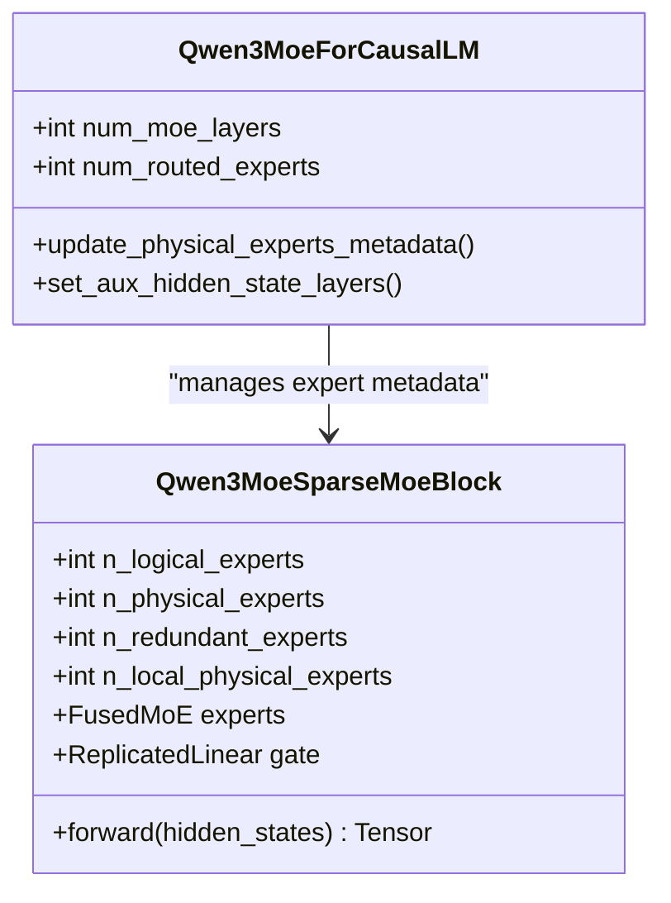
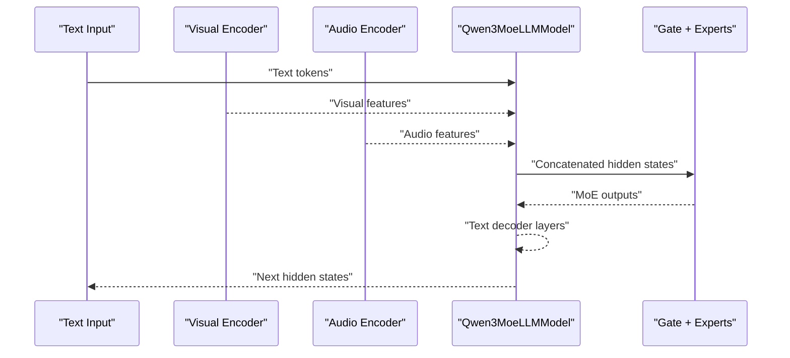
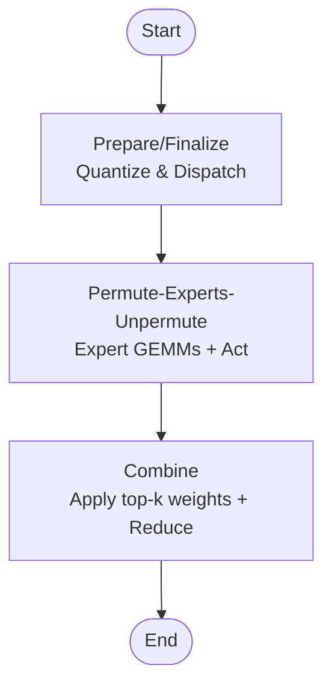
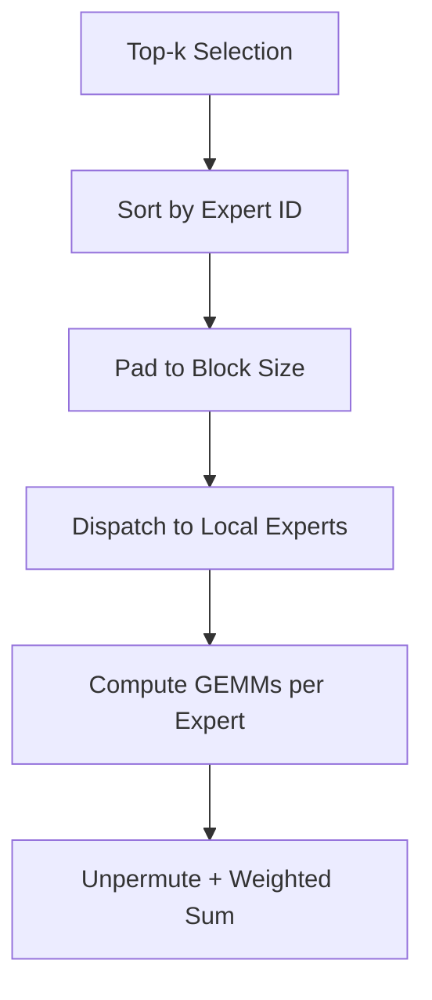
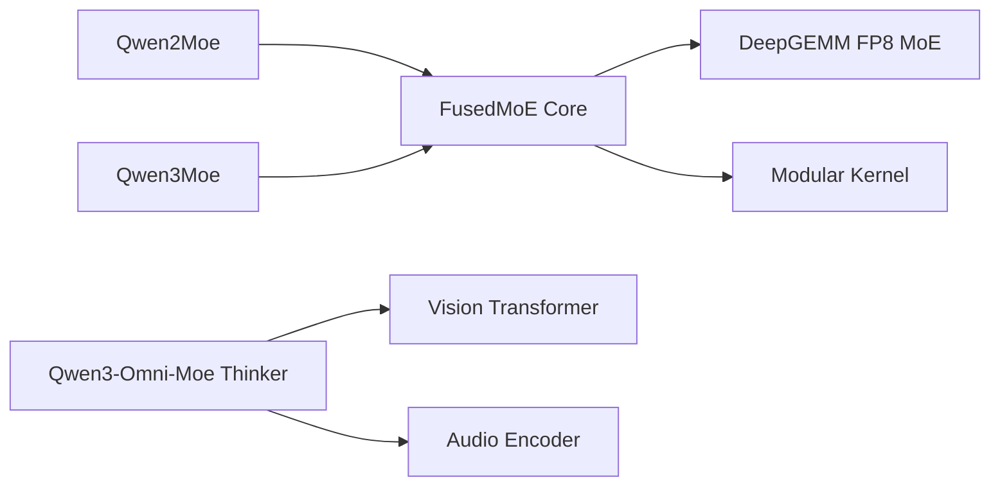

# Qwen Mixture-of-Experts

<cite>
**Referenced Files in This Document**
- [qwen2_moe.py](file://vllm/model_executor/models/qwen2_moe.py)
- [qwen3_moe.py](file://vllm/model_executor/models/qwen3_moe.py)
- [qwen3_omni_moe_thinker.py](file://vllm/model_executor/models/qwen3_omni_moe_thinker.py)
- [fused_moe.py](file://vllm/model_executor/layers/fused_moe/fused_moe.py)
- [deep_gemm_moe.py](file://vllm/model_executor/layers/fused_moe/deep_gemm_moe.py)
- [modular_kernel.py](file://vllm/model_executor/layers/fused_moe/modular_kernel.py)
- [test_count_expert_num_tokens.py](file://tests/kernels/moe/test_count_expert_num_tokens.py)
- [test_moe_align_block_size.py](file://tests/kernels/moe/test_moe_align_block_size.py)
- [vision_language.py](file://examples/offline_inference/vision_language.py)
- [qwen3_vl_moe.py](file://vllm/model_executor/models/qwen3_vl_moe.py)
- [qwen3_next.py](file://vllm/model_executor/models/qwen3_next.py)
- [expert_parallel_deployment.md](file://docs/serving/expert_parallel_deployment.md)
</cite>

## Table of Contents
1. [Introduction](#introduction)
2. [Project Structure](#project-structure)
3. [Core Components](#core-components)
4. [Architecture Overview](#architecture-overview)
5. [Detailed Component Analysis](#detailed-component-analysis)
6. [Dependency Analysis](#dependency-analysis)
7. [Performance Considerations](#performance-considerations)
8. [Troubleshooting Guide](#troubleshooting-guide)
9. [Conclusion](#conclusion)
10. [Appendices](#appendices)

## Introduction
This document explains the Qwen Mixture-of-Experts (MoE) implementations in vLLM, focusing on the evolution from Qwen2 MoE to Qwen3 MoE and Omni MoE variants. It covers expert routing strategies, capacity management, expert parallelism, activation sparsity handling, and memory efficiency techniques. Practical guidance is included for loading Qwen MoE models, analyzing expert utilization, and tuning performance across different Qwen MoE configurations. Integration with Qwen’s multimodal capabilities and expert routing across modalities is also documented.

## Project Structure
Qwen MoE support spans model definitions, fused MoE kernels, and multimodal integration:
- Model definitions: Qwen2 MoE, Qwen3 MoE, and Qwen3-Omni-Moe Thinker (text + audio/visual).
- Fused MoE kernels: Triton-based kernels, DeepGEMM-based FP8 MoE, and a modular kernel framework enabling flexible composition of prepare/finalize, permutation, and combination stages.
- Multimodal integration: Vision transformer and audio encoders integrated into the Qwen3-Omni-Moe Thinker pipeline.

**Diagram sources**
- [qwen2_moe.py](file://vllm/model_executor/models/qwen2_moe.py#L1-L598)
- [qwen3_moe.py](file://vllm/model_executor/models/qwen3_moe.py#L1-L752)
- [qwen3_omni_moe_thinker.py](file://vllm/model_executor/models/qwen3_omni_moe_thinker.py#L1-L800)
- [fused_moe.py](file://vllm/model_executor/layers/fused_moe/fused_moe.py#L1-L800)
- [deep_gemm_moe.py](file://vllm/model_executor/layers/fused_moe/deep_gemm_moe.py#L1-L359)
- [modular_kernel.py](file://vllm/model_executor/layers/fused_moe/modular_kernel.py#L1-L800)

**Section sources**
- [qwen2_moe.py](file://vllm/model_executor/models/qwen2_moe.py#L1-L598)
- [qwen3_moe.py](file://vllm/model_executor/models/qwen3_moe.py#L1-L752)
- [qwen3_omni_moe_thinker.py](file://vllm/model_executor/models/qwen3_omni_moe_thinker.py#L1-L800)
- [fused_moe.py](file://vllm/model_executor/layers/fused_moe/fused_moe.py#L1-L800)
- [deep_gemm_moe.py](file://vllm/model_executor/layers/fused_moe/deep_gemm_moe.py#L1-L359)
- [modular_kernel.py](file://vllm/model_executor/layers/fused_moe/modular_kernel.py#L1-L800)

## Core Components
- Qwen2 MoE: Sparse MoE block with a router gate and fused experts, supporting shared experts and tensor parallel world size checks.
- Qwen3 MoE: Enhanced MoE block with expert parallelism, optional sequence parallelism, redundant experts for load balancing, and renormalized top-k probabilities.
- Qwen3-Omni-Moe Thinker: Integrates text MoE with audio and visual encoders; supports multimodal routing and expert utilization across modalities.
- Fused MoE kernels: Triton kernels, DeepGEMM FP8 path, and a modular kernel framework enabling quantization-aware dispatch, permutation, and reduction.
- Capacity management: Token-level routing, expert-token counting, and block-aligned dispatch to manage capacity and reduce fragmentation.

**Section sources**
- [qwen2_moe.py](file://vllm/model_executor/models/qwen2_moe.py#L71-L189)
- [qwen3_moe.py](file://vllm/model_executor/models/qwen3_moe.py#L121-L211)
- [qwen3_omni_moe_thinker.py](file://vllm/model_executor/models/qwen3_omni_moe_thinker.py#L600-L760)
- [fused_moe.py](file://vllm/model_executor/layers/fused_moe/fused_moe.py#L545-L800)
- [modular_kernel.py](file://vllm/model_executor/layers/fused_moe/modular_kernel.py#L150-L324)

## Architecture Overview
The Qwen MoE stack composes router logits, expert selection, and fused computation with optional quantization and all-to-all dispatch.

**Diagram sources**
- [qwen2_moe.py](file://vllm/model_executor/models/qwen2_moe.py#L170-L189)
- [qwen3_moe.py](file://vllm/model_executor/models/qwen3_moe.py#L194-L210)
- [fused_moe.py](file://vllm/model_executor/layers/fused_moe/fused_moe.py#L545-L800)
- [modular_kernel.py](file://vllm/model_executor/layers/fused_moe/modular_kernel.py#L666-L800)

## Detailed Component Analysis

### Qwen2 MoE Architecture
- Router gate uses a replicated linear layer to produce per-expert logits.
- Fused experts compute two GEMMs with activation and combine outputs.
- Optional shared expert MLP gated by a scalar gate.
- Tensor parallel world size must not exceed number of experts.

**Diagram sources**
- [qwen2_moe.py](file://vllm/model_executor/models/qwen2_moe.py#L71-L189)

**Section sources**
- [qwen2_moe.py](file://vllm/model_executor/models/qwen2_moe.py#L71-L189)

### Qwen3 MoE Architecture and Expert Parallelism
- Router gate produces logits; fused experts configured with top-k, renormalization, and optional sequence parallelism.
- Redundant experts and load balancing configuration define physical vs logical experts.
- Expert parallel groups control mapping from global to local experts; optional all-gather after sequence parallel chunking.

**Diagram sources**
- [qwen3_moe.py](file://vllm/model_executor/models/qwen3_moe.py#L121-L211)
- [qwen3_moe.py](file://vllm/model_executor/models/qwen3_moe.py#L690-L752)

**Section sources**
- [qwen3_moe.py](file://vllm/model_executor/models/qwen3_moe.py#L121-L211)
- [qwen3_moe.py](file://vllm/model_executor/models/qwen3_moe.py#L690-L752)

### Qwen3-Omni-Moe Thinker: Multimodal Routing
- Text MoE integrates with audio and visual encoders; multimodal processing info merges audio and vision processing contexts.
- Visual pathway uses a 3D patch embedding, rotary position embeddings, stacked blocks, and a merger to produce context features.
- Audio pathway uses an audio encoder and feature extraction pipeline.

**Diagram sources**
- [qwen3_omni_moe_thinker.py](file://vllm/model_executor/models/qwen3_omni_moe_thinker.py#L1-L200)
- [qwen3_omni_moe_thinker.py](file://vllm/model_executor/models/qwen3_omni_moe_thinker.py#L600-L760)

**Section sources**
- [qwen3_omni_moe_thinker.py](file://vllm/model_executor/models/qwen3_omni_moe_thinker.py#L1-L200)
- [qwen3_omni_moe_thinker.py](file://vllm/model_executor/models/qwen3_omni_moe_thinker.py#L600-L760)

### Fused MoE Kernels and Modular Framework
- Triton kernels implement token-to-expert dispatch, block alignment, and reduction with optional per-token/channel/group-wise quantization.
- DeepGEMM path enables FP8 grouped GEMM with packed activation quantization and UE8M0 scale formats.
- Modular kernel framework separates preparation (quantization/dispatch), permutation (experts), and combination (weighting/reduction), enabling flexible composition and EP support.

**Diagram sources**
- [fused_moe.py](file://vllm/model_executor/layers/fused_moe/fused_moe.py#L545-L800)
- [deep_gemm_moe.py](file://vllm/model_executor/layers/fused_moe/deep_gemm_moe.py#L1-L359)
- [modular_kernel.py](file://vllm/model_executor/layers/fused_moe/modular_kernel.py#L150-L324)

**Section sources**
- [fused_moe.py](file://vllm/model_executor/layers/fused_moe/fused_moe.py#L545-L800)
- [deep_gemm_moe.py](file://vllm/model_executor/layers/fused_moe/deep_gemm_moe.py#L1-L359)
- [modular_kernel.py](file://vllm/model_executor/layers/fused_moe/modular_kernel.py#L150-L324)

### Expert Routing Strategies and Capacity Management
- Token-level routing: top-k selection with optional renormalization.
- Expert-token counting and block-aligned sorting ensure efficient dispatch and reduce workspace overhead.
- Tests demonstrate expert-level sorting and counting logic for EP scenarios.

**Diagram sources**
- [test_moe_align_block_size.py](file://tests/kernels/moe/test_moe_align_block_size.py#L49-L145)
- [test_count_expert_num_tokens.py](file://tests/kernels/moe/test_count_expert_num_tokens.py#L40-L79)

**Section sources**
- [test_moe_align_block_size.py](file://tests/kernels/moe/test_moe_align_block_size.py#L49-L145)
- [test_count_expert_num_tokens.py](file://tests/kernels/moe/test_count_expert_num_tokens.py#L40-L79)

### Practical Examples

- Loading Qwen MoE models:
  - Use model loaders that map expert parameters and handle stacked parameters for non-expert layers.
  - Example paths for weight loading and expert mapping:
    - [Qwen2 MoE weight loader](file://vllm/model_executor/models/qwen2_moe.py#L426-L529)
    - [Qwen3 MoE weight loader](file://vllm/model_executor/models/qwen3_moe.py#L480-L634)
    - [Qwen3-Omni-Moe Thinker weight loader](file://vllm/model_executor/models/qwen3_omni_moe_thinker.py#L572-L598)

- Expert utilization analysis:
  - Count tokens routed to each expert using expert-token counting utilities.
  - Example reference:
    - [Expert num tokens test](file://tests/kernels/moe/test_count_expert_num_tokens.py#L40-L79)

- Performance tuning:
  - Enable DeepGEMM FP8 MoE when shapes and dtypes are supported.
  - Configure activation chunking and workspace sizing for large M.
  - References:
    - [DeepGEMM FP8 MoE](file://vllm/model_executor/layers/fused_moe/deep_gemm_moe.py#L282-L359)
    - [Activation chunking and workspace sizing](file://vllm/model_executor/layers/fused_moe/fused_moe.py#L1951-L1982)

- Multimodal integration:
  - Example scripts for multimodal inference:
    - [Vision-language example](file://examples/offline_inference/vision_language.py#L1521-L1623)

**Section sources**
- [qwen2_moe.py](file://vllm/model_executor/models/qwen2_moe.py#L426-L529)
- [qwen3_moe.py](file://vllm/model_executor/models/qwen3_moe.py#L480-L634)
- [qwen3_omni_moe_thinker.py](file://vllm/model_executor/models/qwen3_omni_moe_thinker.py#L572-L598)
- [test_count_expert_num_tokens.py](file://tests/kernels/moe/test_count_expert_num_tokens.py#L40-L79)
- [deep_gemm_moe.py](file://vllm/model_executor/layers/fused_moe/deep_gemm_moe.py#L282-L359)
- [fused_moe.py](file://vllm/model_executor/layers/fused_moe/fused_moe.py#L1951-L1982)
- [vision_language.py](file://examples/offline_inference/vision_language.py#L1521-L1623)

## Dependency Analysis
- Qwen2 MoE depends on fused experts and shared MLP modules; tensor parallel constraints enforced at initialization.
- Qwen3 MoE introduces expert parallel groups, optional sequence parallelism, and redundant experts for load balancing.
- Qwen3-Omni-Moe Thinker composes text MoE with audio and visual encoders; multimodal processing info orchestrates HF configs and processors.
- Fused MoE kernels depend on Triton and optional DeepGEMM; modular kernel framework decouples quantization, dispatch, permutation, and combination.

**Diagram sources**
- [qwen2_moe.py](file://vllm/model_executor/models/qwen2_moe.py#L1-L598)
- [qwen3_moe.py](file://vllm/model_executor/models/qwen3_moe.py#L1-L752)
- [qwen3_omni_moe_thinker.py](file://vllm/model_executor/models/qwen3_omni_moe_thinker.py#L1-L800)
- [fused_moe.py](file://vllm/model_executor/layers/fused_moe/fused_moe.py#L1-L800)
- [deep_gemm_moe.py](file://vllm/model_executor/layers/fused_moe/deep_gemm_moe.py#L1-L359)
- [modular_kernel.py](file://vllm/model_executor/layers/fused_moe/modular_kernel.py#L1-L800)

**Section sources**
- [qwen2_moe.py](file://vllm/model_executor/models/qwen2_moe.py#L1-L598)
- [qwen3_moe.py](file://vllm/model_executor/models/qwen3_moe.py#L1-L752)
- [qwen3_omni_moe_thinker.py](file://vllm/model_executor/models/qwen3_omni_moe_thinker.py#L1-L800)
- [fused_moe.py](file://vllm/model_executor/layers/fused_moe/fused_moe.py#L1-L800)
- [deep_gemm_moe.py](file://vllm/model_executor/layers/fused_moe/deep_gemm_moe.py#L1-L359)
- [modular_kernel.py](file://vllm/model_executor/layers/fused_moe/modular_kernel.py#L1-L800)

## Performance Considerations
- Expert parallelism scaling: Ensure local expert count divides global expert space; redundant experts improve load balancing.
- Sequence parallelism: Chunk inputs and gather outputs to maintain correctness under EP.
- Quantization-aware kernels: FP8 with DeepGEMM can accelerate MoE when shapes and dtypes are supported; otherwise fallback to Triton kernels.
- Activation chunking: Reduce peak memory by processing tokens in chunks while maintaining throughput.
- Memory efficiency: Workspace sizing and block-alignment minimize fragmentation; expert-token metadata helps allocate minimal buffers.

[No sources needed since this section provides general guidance]

## Troubleshooting Guide
- Tensor parallel size exceeds number of experts in Qwen2 MoE: Initialization raises an error; adjust TP size or number of experts.
- DeepGEMM disabled warnings: Occur when shapes, dtypes, or contiguity constraints are not met; switch to Triton kernels or adjust inputs.
- EP expert mapping issues: Verify expert_map construction and that tokens routed to non-local experts are masked out.
- Multimodal routing mismatches: Confirm placeholders and processors match the model’s expected tokens for images, videos, and audio.

**Section sources**
- [qwen2_moe.py](file://vllm/model_executor/models/qwen2_moe.py#L120-L156)
- [deep_gemm_moe.py](file://vllm/model_executor/layers/fused_moe/deep_gemm_moe.py#L39-L109)
- [test_count_expert_num_tokens.py](file://tests/kernels/moe/test_count_expert_num_tokens.py#L40-L79)
- [vision_language.py](file://examples/offline_inference/vision_language.py#L1521-L1623)

## Conclusion
Qwen MoE in vLLM evolves from Qwen2 MoE to Qwen3 MoE and Omni MoE variants with robust expert routing, expert parallelism, and multimodal integration. The modular fused MoE framework enables efficient, quantization-aware computation, while tests and examples provide practical guidance for loading, analyzing, and tuning Qwen MoE models across diverse configurations.

[No sources needed since this section summarizes without analyzing specific files]

## Appendices

### Appendix A: Expert Parallel Deployment Notes
- Expert parallel deployment guidelines and scaling considerations are documented separately for operational setups.

**Section sources**
- [expert_parallel_deployment.md](file://docs/serving/expert_parallel_deployment.md)