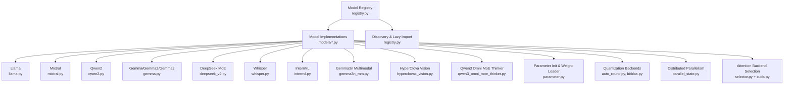
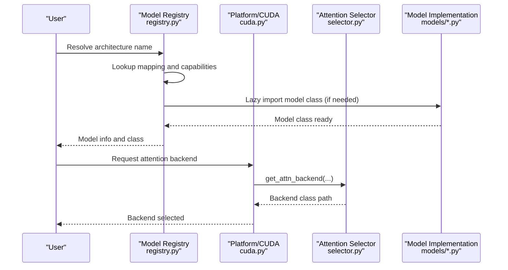
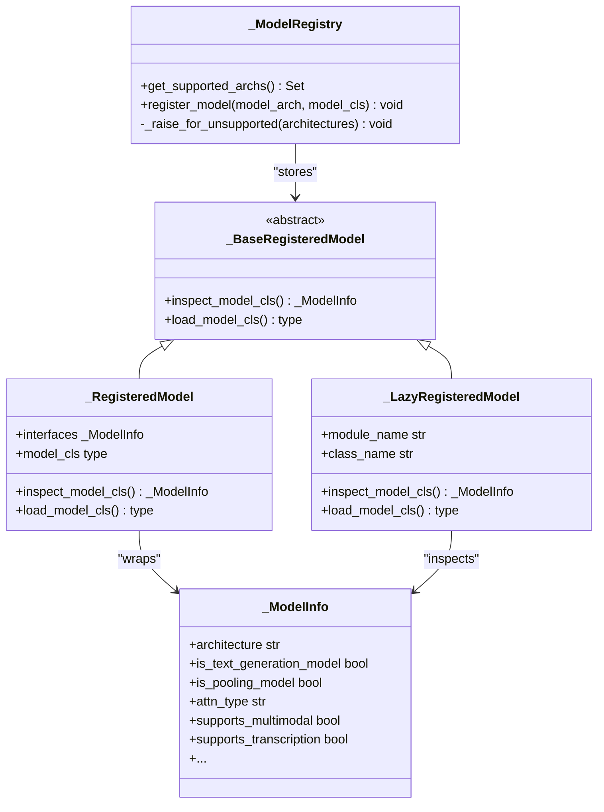
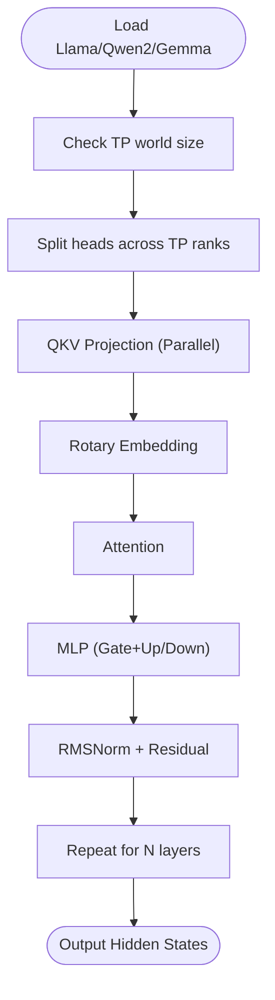
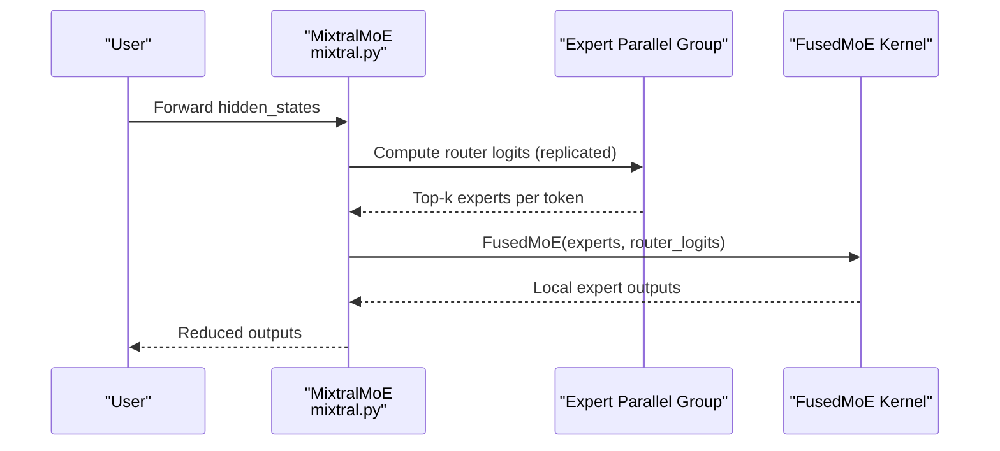
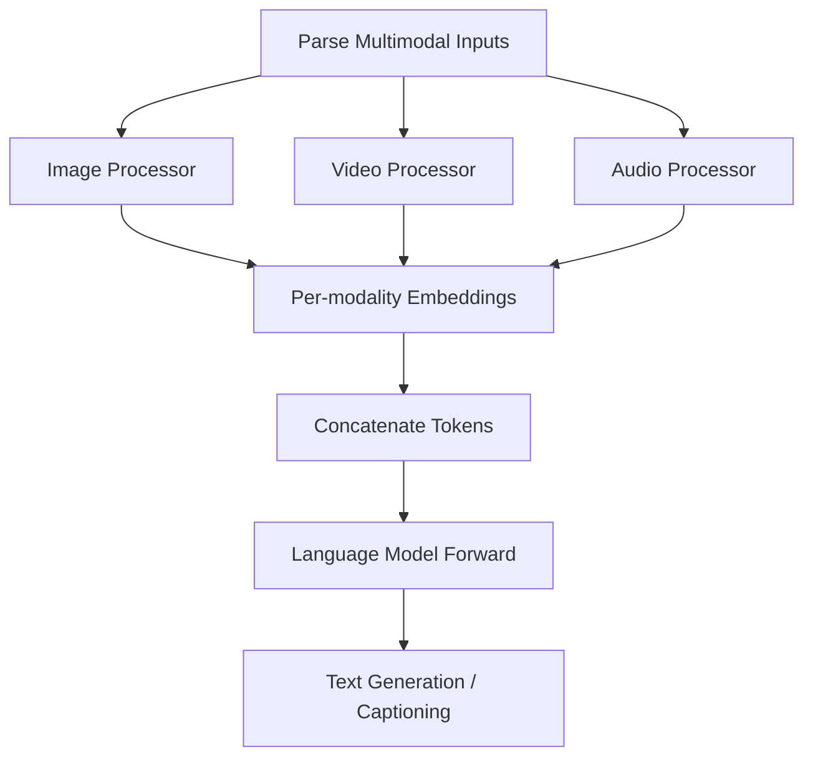
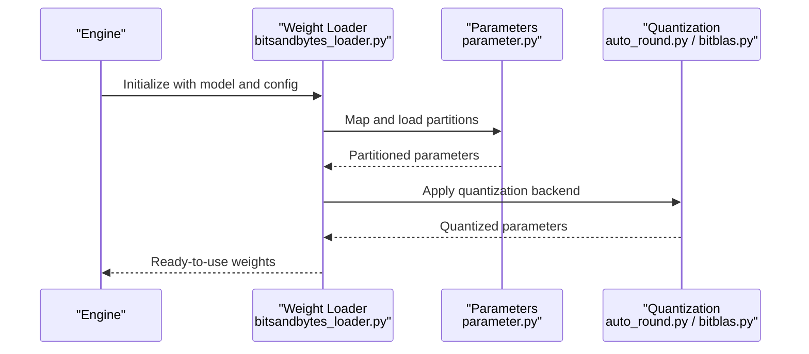
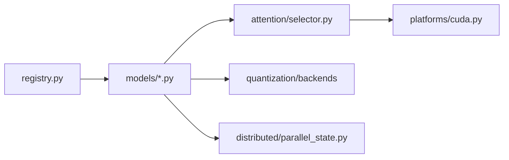

# Model Architectures

<cite>
**Referenced Files in This Document**
- [registry.py](file://vllm/model_executor/models/registry.py)
- [llama.py](file://vllm/model_executor/models/llama.py)
- [mixtral.py](file://vllm/model_executor/models/mixtral.py)
- [qwen2.py](file://vllm/model_executor/models/qwen2.py)
- [gemma.py](file://vllm/model_executor/models/gemma.py)
- [deepseek_v2.py](file://vllm/model_executor/models/deepseek_v2.py)
- [deepseek_mtp.py](file://vllm/model_executor/models/deepseek_mtp.py)
- [whisper.py](file://vllm/model_executor/models/whisper.py)
- [internvl.py](file://vllm/model_executor/models/internvl.py)
- [gemma3n_mm.py](file://vllm/model_executor/models/gemma3n_mm.py)
- [hyperclovax_vision.py](file://vllm/model_executor/models/hyperclovax_vision.py)
- [qwen3_omni_moe_thinker.py](file://vllm/model_executor/models/qwen3_omni_moe_thinker.py)
- [parameter.py](file://vllm/model_executor/parameter.py)
- [bitsandbytes_loader.py](file://vllm/model_executor/model_loader/bitsandbytes_loader.py)
- [auto_round.py](file://vllm/model_executor/layers/quantization/auto_round.py)
- [bitblas.py](file://vllm/model_executor/layers/quantization/bitblas.py)
- [modular_kernel.py](file://vllm/model_executor/layers/fused_moe/modular_kernel.py)
- [selector.py](file://vllm/attention/selector.py)
- [cuda.py](file://vllm/platforms/cuda.py)
- [parallel.py](file://vllm/config/parallel.py)
- [parallel_state.py](file://vllm/distributed/parallel_state.py)
- [benchmark_moe.py](file://benchmarks/kernels/benchmark_moe.py)
- [only_thinker.py](file://examples/offline_inference/qwen2_5_omni/only_thinker.py)
</cite>

## Table of Contents
1. [Introduction](#introduction)
2. [Project Structure](#project-structure)
3. [Core Components](#core-components)
4. [Architecture Overview](#architecture-overview)
5. [Detailed Component Analysis](#detailed-component-analysis)
6. [Dependency Analysis](#dependency-analysis)
7. [Performance Considerations](#performance-considerations)
8. [Troubleshooting Guide](#troubleshooting-guide)
9. [Conclusion](#conclusion)
10. [Appendices](#appendices)

## Introduction
This document explains vLLM’s model architectures ecosystem with a focus on how models are registered, discovered, and executed. It covers:
- The model registry and discovery mechanism
- Supported transformer-based LLM families (e.g., Llama, Mistral, Gemma, Qwen)
- Mixture-of-Experts (MoE) models (e.g., Mixtral, DeepSeek MoE, Qwen MoE)
- Multimodal models (vision-language, audio, and video)
- Model loading, parameter initialization, and memory management
- Practical guidance for registering custom models and leveraging architecture-specific optimizations
- How attention backends, quantization, and distributed strategies relate to model architectures

## Project Structure
At a high level, vLLM organizes model implementations under a dedicated models package and integrates them via a registry. The registry maps Hugging Face-style architectures to vLLM’s internal model classes and capabilities. Supporting modules handle attention backend selection, quantization, distributed parallelism, and multimodal processing.

**Diagram sources**
- [registry.py](file://vllm/model_executor/models/registry.py#L450-L503)
- [llama.py](file://vllm/model_executor/models/llama.py#L1-L200)
- [mixtral.py](file://vllm/model_executor/models/mixtral.py#L1-L200)
- [qwen2.py](file://vllm/model_executor/models/qwen2.py#L1-L200)
- [gemma.py](file://vllm/model_executor/models/gemma.py#L204-L399)
- [deepseek_v2.py](file://vllm/model_executor/models/deepseek_v2.py#L226-L1359)
- [deepseek_mtp.py](file://vllm/model_executor/models/deepseek_mtp.py#L183-L213)
- [whisper.py](file://vllm/model_executor/models/whisper.py#L1-L200)
- [internvl.py](file://vllm/model_executor/models/internvl.py#L1331-L1364)
- [gemma3n_mm.py](file://vllm/model_executor/models/gemma3n_mm.py#L644-L664)
- [hyperclovax_vision.py](file://vllm/model_executor/models/hyperclovax_vision.py#L745-L780)
- [qwen3_omni_moe_thinker.py](file://vllm/model_executor/models/qwen3_omni_moe_thinker.py#L1539-L1563)
- [parameter.py](file://vllm/model_executor/parameter.py#L433-L555)
- [auto_round.py](file://vllm/model_executor/layers/quantization/auto_round.py#L438-L454)
- [bitblas.py](file://vllm/model_executor/layers/quantization/bitblas.py#L45-L84)
- [selector.py](file://vllm/attention/selector.py#L1-L146)
- [cuda.py](file://vllm/platforms/cuda.py#L287-L380)
- [parallel_state.py](file://vllm/distributed/parallel_state.py#L1254-L1577)

**Section sources**
- [registry.py](file://vllm/model_executor/models/registry.py#L450-L503)

## Core Components
- Model Registry and Discovery
  - Central registry maps Hugging Face architecture names to vLLM model implementations and capabilities. It supports both eager and lazy model class resolution, with caching to avoid repeated inspection.
  - External models can be registered via a module:class string or a direct class reference.

- Attention Backend Selection
  - vLLM selects attention backends based on device capability, dtype, KV cache dtype, block size, and model characteristics. This ensures optimal performance per architecture and hardware.

- Quantization Backends
  - Multiple quantization backends are integrated (e.g., AutoRound, BitBLAS). Backend selection considers platform, CPU/XPU vs GPU, and packing formats.

- Distributed Parallelism
  - vLLM supports tensor parallelism (TP), pipeline parallelism (PP), expert parallelism (EP), and data parallelism (DP). Parallel groups are initialized and managed centrally.

- Multimodal Support
  - Models integrate multimodal inputs (images, videos, audio) with specialized embedding and attention layers. Registry entries enumerate supported multimodal architectures.

**Section sources**
- [registry.py](file://vllm/model_executor/models/registry.py#L527-L743)
- [selector.py](file://vllm/attention/selector.py#L1-L146)
- [cuda.py](file://vllm/platforms/cuda.py#L287-L380)
- [auto_round.py](file://vllm/model_executor/layers/quantization/auto_round.py#L438-L454)
- [bitblas.py](file://vllm/model_executor/layers/quantization/bitblas.py#L45-L84)
- [parallel_state.py](file://vllm/distributed/parallel_state.py#L1254-L1577)

## Architecture Overview
The model architecture ecosystem is driven by the registry and layered around:
- Architecture-to-implementation mapping
- Capability introspection (text generation, pooling, multimodal, transcription, etc.)
- Lazy model class loading and caching
- Attention backend selection tailored to head size, dtype, and cache configuration
- Quantization backends chosen per platform and model needs
- Distributed parallelism orchestration

**Diagram sources**
- [registry.py](file://vllm/model_executor/models/registry.py#L527-L743)
- [selector.py](file://vllm/attention/selector.py#L1-L146)
- [cuda.py](file://vllm/platforms/cuda.py#L287-L380)

## Detailed Component Analysis

### Model Registry and Registration
- Registry maps Hugging Face architecture names to vLLM implementations and capability flags (text generation, pooling, multimodal, transcription, etc.).
- Supports external registration via:
  - A string in module:class form for lazy import (avoiding CUDA initialization in subprocess)
  - A direct PyTorch Module subclass
- Inspects model classes in a subprocess to avoid CUDA initialization and caches results for reuse.

**Diagram sources**
- [registry.py](file://vllm/model_executor/models/registry.py#L527-L743)

**Section sources**
- [registry.py](file://vllm/model_executor/models/registry.py#L527-L743)

### Transformer-Based LLMs
- Llama family
  - Implements attention with QKV projection, rotary embeddings, and RMSNorm. Supports tensor parallelism and pipeline parallelism.
  - Example references:
    - [LlamaAttention](file://vllm/model_executor/models/llama.py#L115-L200)
    - [LlamaMLP](file://vllm/model_executor/models/llama.py#L72-L113)

- Qwen2 family
  - Similar decoder-only structure with fused SiLU-Multiply and RMSNorm. Supports QK normalization and dual-chunk attention configurations.
  - Example references:
    - [Qwen2Attention](file://vllm/model_executor/models/qwen2.py#L112-L200)
    - [Qwen2MLP](file://vllm/model_executor/models/qwen2.py#L75-L110)

- Gemma family
  - Decoder-only with RMSNorm and fused SiLU-Multiply. Integrates with quantization and LoRA support.
  - Example references:
    - [GemmaDecoderLayer](file://vllm/model_executor/models/gemma.py#L204-L236)
    - [GemmaForCausalLM](file://vllm/model_executor/models/gemma.py#L367-L399)

**Diagram sources**
- [llama.py](file://vllm/model_executor/models/llama.py#L115-L200)
- [qwen2.py](file://vllm/model_executor/models/qwen2.py#L112-L200)
- [gemma.py](file://vllm/model_executor/models/gemma.py#L204-L236)

**Section sources**
- [llama.py](file://vllm/model_executor/models/llama.py#L72-L200)
- [qwen2.py](file://vllm/model_executor/models/qwen2.py#L75-L200)
- [gemma.py](file://vllm/model_executor/models/gemma.py#L204-L399)

### Mixture-of-Experts (MoE) Models
- Mixtral
  - Uses a fused MoE kernel with expert parallelism and optional redundant experts for load balancing. Gate and experts are configured per vLLM’s parallel settings.
  - Example references:
    - [MixtralMoE](file://vllm/model_executor/models/mixtral.py#L74-L153)

- DeepSeek MoE
  - DeepseekV2/DeepseekV3 MoE with routed scaling factor and expert groups. Supports expert parallelism and sequence-parallel MoE.
  - Example references:
    - [DeepseekV2MoE](file://vllm/model_executor/models/deepseek_v2.py#L233-L250)
    - [DeepseekV2MixtureOfExperts](file://vllm/model_executor/models/deepseek_v2.py#L1336-L1359)
    - [DeepSeekMTP](file://vllm/model_executor/models/deepseek_mtp.py#L183-L213)

- Qwen MoE
  - Qwen2Moe, Qwen3Moe, Qwen3Next, and Qwen3Omni MoE variants. Benchmark utilities enumerate expert counts and top-K routing parameters.
  - Example references:
    - [benchmark_moe.py](file://benchmarks/kernels/benchmark_moe.py#L578-L612)

**Diagram sources**
- [mixtral.py](file://vllm/model_executor/models/mixtral.py#L74-L153)

**Section sources**
- [mixtral.py](file://vllm/model_executor/models/mixtral.py#L74-L153)
- [deepseek_v2.py](file://vllm/model_executor/models/deepseek_v2.py#L233-L250)
- [deepseek_mtp.py](file://vllm/model_executor/models/deepseek_mtp.py#L183-L213)
- [benchmark_moe.py](file://benchmarks/kernels/benchmark_moe.py#L578-L612)

### Multimodal Models
- Vision-Language Models
  - LLaVA, Qwen-VL, InternVL, and others integrate visual encoders and language decoders. They embed images/videos and feed tokens into the language model.
  - Example references:
    - [InternVL multimodal embedding](file://vllm/model_executor/models/internvl.py#L1331-L1364)
    - [Gemma3n multimodal embedding](file://vllm/model_executor/models/gemma3n_mm.py#L644-L664)
    - [HyperClova multimodal forward](file://vllm/model_executor/models/hyperclovax_vision.py#L745-L780)

- Audio Models
  - Whisper encoder-decoder architecture with cross-attention and positional embeddings for speech-to-text.
  - Example references:
    - [Whisper encoder attention](file://vllm/model_executor/models/whisper.py#L144-L170)
    - [Whisper positional embedding](file://vllm/model_executor/models/whisper.py#L172-L178)

- Video Understanding
  - Qwen2_5 Omni and Qwen3 Omni MoE Thinker support mixed modalities including images, audio, and videos, with position ID handling across modalities.
  - Example references:
    - [Qwen2_5 Omni multimodal inputs](file://examples/offline_inference/qwen2_5_omni/only_thinker.py#L34-L73)
    - [Qwen3 Omni MoE Thinker position IDs](file://vllm/model_executor/models/qwen3_omni_moe_thinker.py#L1539-L1563)

**Diagram sources**
- [internvl.py](file://vllm/model_executor/models/internvl.py#L1331-L1364)
- [gemma3n_mm.py](file://vllm/model_executor/models/gemma3n_mm.py#L644-L664)
- [whisper.py](file://vllm/model_executor/models/whisper.py#L144-L178)
- [only_thinker.py](file://examples/offline_inference/qwen2_5_omni/only_thinker.py#L34-L73)
- [qwen3_omni_moe_thinker.py](file://vllm/model_executor/models/qwen3_omni_moe_thinker.py#L1539-L1563)

**Section sources**
- [internvl.py](file://vllm/model_executor/models/internvl.py#L1331-L1364)
- [gemma3n_mm.py](file://vllm/model_executor/models/gemma3n_mm.py#L644-L664)
- [whisper.py](file://vllm/model_executor/models/whisper.py#L144-L178)
- [only_thinker.py](file://examples/offline_inference/qwen2_5_omni/only_thinker.py#L34-L73)
- [qwen3_omni_moe_thinker.py](file://vllm/model_executor/models/qwen3_omni_moe_thinker.py#L1539-L1563)

### Model Loading Pipeline, Parameter Initialization, and Memory Management
- Parameter Initialization
  - vLLM uses a parameter abstraction to manage weight partitions and loading. Partitioned parameters ensure correctness when weights are split across ranks or devices.
  - Example references:
    - [PartitionedModelWeightParameter](file://vllm/model_executor/parameter.py#L433-L555)

- Weight Loading and Quantization
  - BitsAndBytes loader enforces constraints for pre-quantized models under tensor parallelism. Quantization backends (AutoRound, BitBLAS) adapt to platform and packing formats.
  - Example references:
    - [BitsAndBytes loader constraints](file://vllm/model_executor/model_loader/bitsandbytes_loader.py#L554-L572)
    - [AutoRound backend selection](file://vllm/model_executor/layers/quantization/auto_round.py#L438-L454)
    - [BitBLAS version checks](file://vllm/model_executor/layers/quantization/bitblas.py#L45-L84)

- Memory Management
  - Attention backends and KV cache layouts are selected to match hardware capabilities and model characteristics. This affects memory footprint and throughput.

**Diagram sources**
- [bitsandbytes_loader.py](file://vllm/model_executor/model_loader/bitsandbytes_loader.py#L554-L572)
- [parameter.py](file://vllm/model_executor/parameter.py#L433-L555)
- [auto_round.py](file://vllm/model_executor/layers/quantization/auto_round.py#L438-L454)
- [bitblas.py](file://vllm/model_executor/layers/quantization/bitblas.py#L45-L84)

**Section sources**
- [parameter.py](file://vllm/model_executor/parameter.py#L433-L555)
- [bitsandbytes_loader.py](file://vllm/model_executor/model_loader/bitsandbytes_loader.py#L554-L572)
- [auto_round.py](file://vllm/model_executor/layers/quantization/auto_round.py#L438-L454)
- [bitblas.py](file://vllm/model_executor/layers/quantization/bitblas.py#L45-L84)

### Practical Examples
- Registering a Custom Model
  - Use the registry’s register_model API with either a module:class string (lazy) or a direct class. This enables discovery and capability introspection.
  - Reference: [register_model](file://vllm/model_executor/models/registry.py#L753-L799)

- Implementing a Custom Model
  - Follow the pattern of existing models: define attention, MLP, norms, and embedding layers; expose packed module mappings if applicable; integrate with quantization and parallelism helpers.
  - References:
    - [LlamaAttention](file://vllm/model_executor/models/llama.py#L115-L200)
    - [Qwen2Attention](file://vllm/model_executor/models/qwen2.py#L112-L200)
    - [MixtralMoE](file://vllm/model_executor/models/mixtral.py#L74-L153)

- Architecture-Specific Optimizations
  - Enable fused kernels for MoE (e.g., FusedMoE) and select attention backends appropriate for head size and dtype.
  - References:
    - [FusedMoE modular kernel interface](file://vllm/model_executor/layers/fused_moe/modular_kernel.py#L192-L208)
    - [Attention backend selection](file://vllm/attention/selector.py#L1-L146)

**Section sources**
- [registry.py](file://vllm/model_executor/models/registry.py#L753-L799)
- [llama.py](file://vllm/model_executor/models/llama.py#L115-L200)
- [qwen2.py](file://vllm/model_executor/models/qwen2.py#L112-L200)
- [mixtral.py](file://vllm/model_executor/models/mixtral.py#L74-L153)
- [modular_kernel.py](file://vllm/model_executor/layers/fused_moe/modular_kernel.py#L192-L208)
- [selector.py](file://vllm/attention/selector.py#L1-L146)

## Dependency Analysis
- Registry to Implementations
  - The registry aggregates architecture mappings and exposes capability flags. Implementations depend on attention, linear layers, and quantization abstractions.
- Attention Backends
  - Platform-specific selection depends on device capability and configuration. Backends may require specific KV cache layouts.
- Quantization Backends
  - Selection varies by platform (CPU/XPU vs GPU) and packing format. Some backends impose constraints (e.g., BitsAndBytes with TP).
- Distributed Strategies
  - Parallel groups (TP, PP, EP, DP) are initialized centrally and influence model layer behavior (e.g., head partitioning, expert distribution).

**Diagram sources**
- [registry.py](file://vllm/model_executor/models/registry.py#L450-L503)
- [selector.py](file://vllm/attention/selector.py#L1-L146)
- [cuda.py](file://vllm/platforms/cuda.py#L287-L380)
- [parallel_state.py](file://vllm/distributed/parallel_state.py#L1254-L1577)

**Section sources**
- [registry.py](file://vllm/model_executor/models/registry.py#L450-L503)
- [selector.py](file://vllm/attention/selector.py#L1-L146)
- [cuda.py](file://vllm/platforms/cuda.py#L287-L380)
- [parallel_state.py](file://vllm/distributed/parallel_state.py#L1254-L1577)

## Performance Considerations
- Attention Backend Selection
  - Choose backends aligned with head size, dtype, and KV cache configuration. Some backends require specific KV cache layouts.
  - Reference: [get_attn_backend](file://vllm/attention/selector.py#L46-L118)

- Quantization Compatibility
  - On CPU/XPU or with specific packing formats, AutoRound and BitBLAS backends apply different optimizations. Pre-quantized BitsAndBytes with TP is not supported; consider pipeline parallelism instead.
  - References:
    - [AutoRound backend selection](file://vllm/model_executor/layers/quantization/auto_round.py#L438-L454)
    - [BitBLAS version checks](file://vllm/model_executor/layers/quantization/bitblas.py#L45-L84)
    - [BitsAndBytes TP constraint](file://vllm/model_executor/model_loader/bitsandbytes_loader.py#L554-L572)

- Distributed Inference Strategies
  - Scale across nodes using tensor and pipeline parallelism. Ensure sufficient GPU memory and verify backend logs indicating KV cache sizing and concurrency.
  - Reference: [parallelism scaling guide](file://docs/serving/parallelism_scaling.md#L1-L19)

[No sources needed since this section provides general guidance]

## Troubleshooting Guide
- Unsupported Attention Backend
  - If the selected backend is invalid for the configuration, platform selection raises an error. Verify head size, dtype, and KV cache dtype.
  - Reference: [platform backend validation](file://vllm/platforms/cuda.py#L287-L358)

- BitsAndBytes Prequantization with TP
  - Prequantized BitsAndBytes models do not support tensor parallelism. Switch to pipeline parallelism or disable prequantization.
  - Reference: [loader constraint](file://vllm/model_executor/model_loader/bitsandbytes_loader.py#L554-L572)

- Model Not Found in Registry
  - Ensure the architecture name matches the registry mapping. For custom models, register via module:class string or direct class.
  - Reference: [register_model](file://vllm/model_executor/models/registry.py#L753-L799)

**Section sources**
- [cuda.py](file://vllm/platforms/cuda.py#L287-L358)
- [bitsandbytes_loader.py](file://vllm/model_executor/model_loader/bitsandbytes_loader.py#L554-L572)
- [registry.py](file://vllm/model_executor/models/registry.py#L753-L799)

## Conclusion
vLLM’s model architectures ecosystem combines a robust registry, architecture-specific implementations, and flexible attention, quantization, and distributed strategies. By leveraging the registry for discovery, selecting appropriate attention backends, applying compatible quantization, and orchestrating distributed parallelism, users can efficiently deploy a wide range of transformer-based LLMs, MoE models, and multimodal systems.

[No sources needed since this section summarizes without analyzing specific files]

## Appendices
- Appendix A: Supported Architectures Overview
  - The registry consolidates supported architectures across text generation, embedding, cross-encoder, multimodal, and speculative decoding domains. Refer to the registry constants for the authoritative list.
  - Reference: [VLLM_MODELS aggregation](file://vllm/model_executor/models/registry.py#L495-L503)

**Section sources**
- [registry.py](file://vllm/model_executor/models/registry.py#L495-L503)