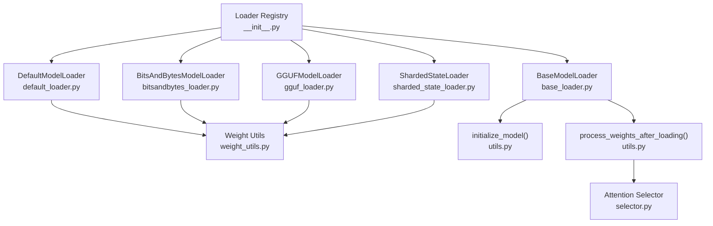
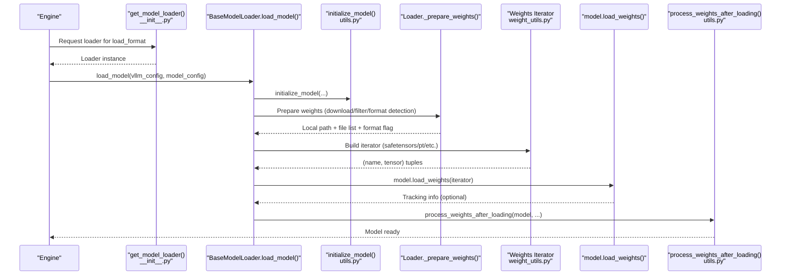
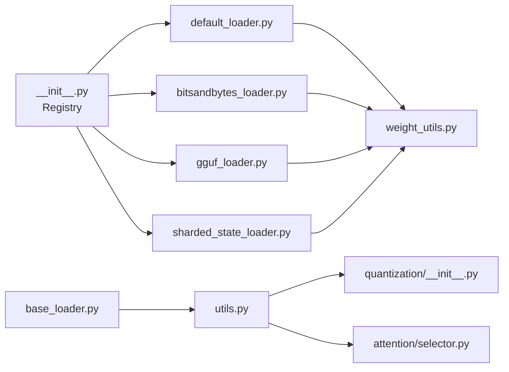

# Model Loading Pipeline

<cite>
**Referenced Files in This Document**
- [__init__.py](file://vllm/model_executor/model_loader/__init__.py)
- [base_loader.py](file://vllm/model_executor/model_loader/base_loader.py)
- [default_loader.py](file://vllm/model_executor/model_loader/default_loader.py)
- [bitsandbytes_loader.py](file://vllm/model_executor/model_loader/bitsandbytes_loader.py)
- [gguf_loader.py](file://vllm/model_executor/model_loader/gguf_loader.py)
- [sharded_state_loader.py](file://vllm/model_executor/model_loader/sharded_state_loader.py)
- [weight_utils.py](file://vllm/model_executor/model_loader/weight_utils.py)
- [utils.py](file://vllm/model_executor/model_loader/utils.py)
- [__init__.py](file://vllm/model_executor/layers/quantization/__init__.py)
- [selector.py](file://vllm/attention/selector.py)
</cite>

## Table of Contents
1. [Introduction](#introduction)
2. [Project Structure](#project-structure)
3. [Core Components](#core-components)
4. [Architecture Overview](#architecture-overview)
5. [Detailed Component Analysis](#detailed-component-analysis)
6. [Dependency Analysis](#dependency-analysis)
7. [Performance Considerations](#performance-considerations)
8. [Troubleshooting Guide](#troubleshooting-guide)
9. [Conclusion](#conclusion)
10. [Appendices](#appendices)

## Introduction
This document explains the model loading pipeline in vLLM, covering how models are discovered, downloaded, validated, and loaded into memory across multiple formats and backends. It focuses on:
- Loader architecture and selection by load format
- Weight initialization and placement strategies
- Memory-efficient loading techniques (multithreading, streaming, and sharded state)
- Model state reconstruction and parameter mapping across formats (PyTorch, safetensors, bitsandbytes, GGUF)
- Compatibility handling for diverse model architectures
- Integration with quantization backends and attention backend selection
- Distributed loading for large models and caching mechanisms

## Project Structure
The model loading system is organized around a central loader registry and format-specific loaders. Each loader encapsulates the logic to prepare weights, iterate over tensors, and bind them into a freshly initialized model. Utilities provide shared capabilities such as quantization config resolution, weight iterators, and caching.

**Diagram sources**
- [__init__.py](file://vllm/model_executor/model_loader/__init__.py#L1-L151)
- [base_loader.py](file://vllm/model_executor/model_loader/base_loader.py#L1-L58)
- [default_loader.py](file://vllm/model_executor/model_loader/default_loader.py#L1-L322)
- [bitsandbytes_loader.py](file://vllm/model_executor/model_loader/bitsandbytes_loader.py#L1-L200)
- [gguf_loader.py](file://vllm/model_executor/model_loader/gguf_loader.py#L1-L200)
- [sharded_state_loader.py](file://vllm/model_executor/model_loader/sharded_state_loader.py#L1-L215)
- [weight_utils.py](file://vllm/model_executor/model_loader/weight_utils.py#L1-L800)
- [utils.py](file://vllm/model_executor/model_loader/utils.py#L1-L293)
- [selector.py](file://vllm/attention/selector.py#L1-L146)

**Section sources**
- [__init__.py](file://vllm/model_executor/model_loader/__init__.py#L1-L151)

## Core Components
- Loader registry and selection: Maps load_format to a concrete loader class and constructs the loader used by the engine.
- BaseModelLoader: Defines the contract for all loaders: download_model, load_weights, and load_model (initialization + weight binding + post-processing).
- Format-specific loaders:
  - DefaultModelLoader: Handles standard PyTorch weights (.bin/.pt), safetensors, fastsafetensors, and mistral consolidated formats.
  - BitsAndBytesModelLoader: Loads quantized weights from bitsandbytes-compatible checkpoints, including 4-bit/8-bit variants and fused modules.
  - GGUFModelLoader: Loads GGUF quantized models, mapping GGUF tensor names to HF naming conventions and handling multimodal models.
  - ShardedStateLoader: Loads pre-partitioned state dicts per tensor-parallel rank, avoiding full checkpoint reads.
- Utilities:
  - initialize_model: Resolves model class and initializes with vllm_config/prefix, sets up quantization config.
  - process_weights_after_loading: Applies quantization post-processing and attention-specific weight processing.
  - weight_utils: Provides iterators, quantization config resolution, GGUF helpers, and caching/download utilities.

**Section sources**
- [base_loader.py](file://vllm/model_executor/model_loader/base_loader.py#L1-L58)
- [default_loader.py](file://vllm/model_executor/model_loader/default_loader.py#L1-L322)
- [bitsandbytes_loader.py](file://vllm/model_executor/model_loader/bitsandbytes_loader.py#L1-L200)
- [gguf_loader.py](file://vllm/model_executor/model_loader/gguf_loader.py#L1-L200)
- [sharded_state_loader.py](file://vllm/model_executor/model_loader/sharded_state_loader.py#L1-L215)
- [utils.py](file://vllm/model_executor/model_loader/utils.py#L1-L293)
- [weight_utils.py](file://vllm/model_executor/model_loader/weight_utils.py#L1-L800)

## Architecture Overview
The pipeline proceeds in stages:
1. Selection: get_model_loader selects the loader based on LoadConfig.load_format.
2. Initialization: BaseModelLoader.load_model initializes the model on the target device and dtype.
3. Weight preparation: Each loader prepares weights (downloads, filters, resolves format).
4. Iteration: A generator yields (name, tensor) pairs from the chosen format.
5. Binding: model.load_weights applies the tensors to parameters.
6. Post-processing: process_weights_after_loading runs quantization and attention-specific adjustments.

**Diagram sources**
- [__init__.py](file://vllm/model_executor/model_loader/__init__.py#L118-L151)
- [base_loader.py](file://vllm/model_executor/model_loader/base_loader.py#L37-L58)
- [utils.py](file://vllm/model_executor/model_loader/utils.py#L27-L120)
- [weight_utils.py](file://vllm/model_executor/model_loader/weight_utils.py#L611-L800)
- [default_loader.py](file://vllm/model_executor/model_loader/default_loader.py#L185-L322)
- [bitsandbytes_loader.py](file://vllm/model_executor/model_loader/bitsandbytes_loader.py#L197-L239)
- [gguf_loader.py](file://vllm/model_executor/model_loader/gguf_loader.py#L337-L371)
- [sharded_state_loader.py](file://vllm/model_executor/model_loader/sharded_state_loader.py#L109-L163)

## Detailed Component Analysis

### Loader Registry and Selection
- The registry maps load_format to a loader class and exposes get_model_loader to construct the loader.
- Supported formats include auto, hf, bitsandbytes, gguf, mistral, safetensors, fastsafetensors, pt, sharded_state, runai_streamer, runai_streamer_sharded, tensorizer, and dummy.

Key responsibilities:
- Validation of load_format
- Registration of custom loaders via register_model_loader

**Section sources**
- [__init__.py](file://vllm/model_executor/model_loader/__init__.py#L1-L151)

### BaseModelLoader Contract
- download_model: Ensures weights are available locally or cached.
- load_weights: Binds tensors to model parameters.
- load_model: Orchestrates initialization, weight loading, and post-processing.

Design notes:
- Uses set_default_torch_dtype and target device context for deterministic precision and placement.
- Delegates post-loading steps to process_weights_after_loading.

**Section sources**
- [base_loader.py](file://vllm/model_executor/model_loader/base_loader.py#L1-L58)

### DefaultModelLoader (Standard PyTorch/Safetensors)
Responsibilities:
- Detects format (auto, hf, mistral, safetensors, fastsafetensors, pt, npcache).
- Downloads weights from Hugging Face or local path, respecting ignore patterns and revision.
- Filters duplicate safetensors files using index maps and excludes non-inference files.
- Provides iterators:
  - safetensors_weights_iterator (supports eager, lazy, and torchao strategies)
  - multi_thread_safetensors_weights_iterator
  - pt_weights_iterator and multi_thread_pt_weights_iterator
  - np_cache_weights_iterator
  - runai_safetensors_weights_iterator (streaming)
- Binds weights via model.load_weights and logs timing.
- Optional strictness checks for non-quantized models with loaded-weights tracking.

Memory and performance:
- Multithreaded safetensors loading reduces I/O contention.
- fastsafetensors leverages optimized streaming for distributed environments.
- np_cache converts .bin/.pt to numpy cache for repeated loads.

**Section sources**
- [default_loader.py](file://vllm/model_executor/model_loader/default_loader.py#L1-L322)
- [weight_utils.py](file://vllm/model_executor/model_loader/weight_utils.py#L611-L800)

### BitsAndBytesModelLoader (Quantized)
Capabilities:
- Supports 4-bit and 8-bit quantized checkpoints and fused modules.
- Determines quantized/unquantized modules to skip during weight loading.
- Iterates over safetensors or .bin/.pt files, mapping names from transformers to vLLM conventions.
- Classifies modules by sharding requirements (column-wise, replicated, fused).
- Binds quantization states to parameters and performs expert/MoE state fusion and stacking.

Integration:
- Uses quantization config resolution and applies quantization post-processing after loading.

**Section sources**
- [bitsandbytes_loader.py](file://vllm/model_executor/model_loader/bitsandbytes_loader.py#L1-L200)
- [bitsandbytes_loader.py](file://vllm/model_executor/model_loader/bitsandbytes_loader.py#L225-L822)
- [bitsandbytes_loader.py](file://vllm/model_executor/model_loader/bitsandbytes_loader.py#L497-L525)

### GGUFModelLoader (Quantized GGUF)
Capabilities:
- Accepts local files, raw URLs, repo_id/filename.gguf, or repo_id:quant_type.
- Builds GGUF weight type map and identifies unquantized modules to exclude from quantization.
- Maps GGUF tensor names to HF/HF-compatible names, handling multimodal models and special architectures (e.g., qwen2_moe/qwen3_moe, deepseek_v2/v3).
- Initializes model with meta device to enumerate parameter names, then reconstructs weights and binds them.

Compatibility:
- Detects tie-word-embeddings via GGUF extra tensors.
- Supports multimodal models by constructing appropriate AutoModel classes.

**Section sources**
- [gguf_loader.py](file://vllm/model_executor/model_loader/gguf_loader.py#L1-L200)
- [gguf_loader.py](file://vllm/model_executor/model_loader/gguf_loader.py#L337-L371)

### ShardedStateLoader (Distributed Pre-Sharded)
Capabilities:
- Loads only the local rank’s shard files, avoiding full checkpoint reads.
- Supports S3 and local paths; filters subtensors to avoid redundant copies.
- Iterates over safetensors files and copies tensors into narrowed views of parameters.
- Provides save_model to split and persist sharded state files.

Use cases:
- Large tensor-parallel models where each worker only needs its shard.
- Reduced peak memory and faster cold-start.

**Section sources**
- [sharded_state_loader.py](file://vllm/model_executor/model_loader/sharded_state_loader.py#L1-L215)

### Utilities: Initialization and Post-Processing
- initialize_model:
  - Resolves model class from registry and architecture.
  - Configures quantization config and passes packed module mappings.
  - Supports both new-style (vllm_config/prefix) and legacy constructor signatures.
- process_weights_after_loading:
  - Saves metadata for weight reloading.
  - Invokes quant_method.process_weights_after_loading on modules with quantization.
  - Calls attention-specific process_weights_after_loading for Attention and MLAAttention.
  - Uses device_loading_context to temporarily move parameters to target device for processing.

**Section sources**
- [utils.py](file://vllm/model_executor/model_loader/utils.py#L1-L293)

### Quantization Backends and Methods
- Quantization methods are enumerated and resolved dynamically.
- get_quantization_config returns the appropriate QuantizationConfig class for a method.
- Methods include gguf, bitsandbytes, gptq, awq, gptq_marlin, gptq_bitblas, bitblas, torchao, auto-round, compressed-tensors, inc, and more.

Integration:
- Quantization configs are applied during model initialization and used by loaders to guide weight processing and binding.

**Section sources**
- [__init__.py](file://vllm/model_executor/layers/quantization/__init__.py#L1-L180)

### Attention Backend Selection and Model Loading
- Attention backend selection depends on dtype, head size, KV cache dtype, block size, and other flags.
- The selector caches backend choices and can adjust KV cache layout required by the backend.
- While attention selection is separate from model loading, post-loading processing may require parameters to be on the target device for attention-specific decompression or repacking.

**Section sources**
- [selector.py](file://vllm/attention/selector.py#L1-L146)
- [utils.py](file://vllm/model_executor/model_loader/utils.py#L81-L120)

## Dependency Analysis
The loader system exhibits low coupling and high cohesion:
- Registry decouples selection from implementation.
- BaseModelLoader enforces a consistent lifecycle across loaders.
- Shared utilities minimize duplication and centralize cross-cutting concerns (quantization, iterators, caching).

Potential circular dependencies:
- process_weights_after_loading imports attention modules conditionally to avoid circular imports.
- Quantization config resolution is deferred to prevent premature torch.compile triggers.

**Diagram sources**
- [__init__.py](file://vllm/model_executor/model_loader/__init__.py#L1-L151)
- [default_loader.py](file://vllm/model_executor/model_loader/default_loader.py#L1-L322)
- [bitsandbytes_loader.py](file://vllm/model_executor/model_loader/bitsandbytes_loader.py#L1-L200)
- [gguf_loader.py](file://vllm/model_executor/model_loader/gguf_loader.py#L1-L200)
- [sharded_state_loader.py](file://vllm/model_executor/model_loader/sharded_state_loader.py#L1-L215)
- [weight_utils.py](file://vllm/model_executor/model_loader/weight_utils.py#L1-L800)
- [utils.py](file://vllm/model_executor/model_loader/utils.py#L1-L293)
- [__init__.py](file://vllm/model_executor/layers/quantization/__init__.py#L1-L180)
- [selector.py](file://vllm/attention/selector.py#L1-L146)

**Section sources**
- [__init__.py](file://vllm/model_executor/model_loader/__init__.py#L1-L151)
- [utils.py](file://vllm/model_executor/model_loader/utils.py#L1-L293)

## Performance Considerations
- Multithreaded safetensors loading reduces I/O bottlenecks for large checkpoints.
- fastsafetensors and Runai streamer accelerate distributed loading by streaming tensors directly to devices.
- np_cache converts .bin/.pt to numpy cache for repeated loads, trading disk space for speed.
- ShardedStateLoader minimizes memory footprint and load time for tensor-parallel setups.
- process_weights_after_loading moves parameters to the target device only when necessary, restoring original devices afterward.

[No sources needed since this section provides general guidance]

## Troubleshooting Guide
Common issues and resolutions:
- Unknown load_format: Ensure load_format is registered or supported by the registry.
- No weights found: Verify allow_patterns and ignore_patterns; confirm local path or remote availability.
- Duplicate safetensors files: The loader filters by index maps; ensure index file is present or remove conflicting consolidated files.
- Missing keys in sharded loading: ShardedStateLoader raises if any parameter remains unmatched; verify shard naming and ranks.
- Quantization mismatch: Confirm quantization method matches the checkpoint; BitsAndBytesModelLoader determines unquantized modules and skips them.
- Attention backend errors: Ensure dtype/head size/KV cache dtype combinations are valid for the selected backend.

**Section sources**
- [default_loader.py](file://vllm/model_executor/model_loader/default_loader.py#L185-L220)
- [sharded_state_loader.py](file://vllm/model_executor/model_loader/sharded_state_loader.py#L129-L163)
- [bitsandbytes_loader.py](file://vllm/model_executor/model_loader/bitsandbytes_loader.py#L225-L239)
- [selector.py](file://vllm/attention/selector.py#L46-L118)

## Conclusion
vLLM’s model loading pipeline is modular, extensible, and efficient. By centralizing selection, initialization, and post-processing, it supports diverse formats and quantization backends while minimizing memory pressure and maximizing throughput. The design cleanly separates concerns across loaders, utilities, and attention/quantization subsystems, enabling straightforward customization and robust operation across heterogeneous deployments.

[No sources needed since this section summarizes without analyzing specific files]

## Appendices

### Practical Examples and Workflows
- Custom model loader registration:
  - Register a new load_format with register_model_loader and implement download_model and load_weights.
  - Reference: [register_model_loader](file://vllm/model_executor/model_loader/__init__.py#L65-L116)
- Format conversion:
  - Convert .bin/.pt to safetensors using convert_bin_to_safetensor_file for faster subsequent loads.
  - Reference: [convert_bin_to_safetensor_file](file://vllm/model_executor/model_loader/weight_utils.py#L192-L228)
- Distributed sharded loading:
  - Use ShardedStateLoader to load per-rank shards; optionally save sharded state for reuse.
  - Reference: [ShardedStateLoader.save_model](file://vllm/model_executor/model_loader/sharded_state_loader.py#L179-L215)
- GGUF loading:
  - Provide local file, raw URL, repo_id/filename.gguf, or repo_id:quant_type; GGUFModelLoader resolves and maps names.
  - Reference: [GGUFModelLoader._prepare_weights](file://vllm/model_executor/model_loader/gguf_loader.py#L48-L77)

**Section sources**
- [__init__.py](file://vllm/model_executor/model_loader/__init__.py#L65-L116)
- [weight_utils.py](file://vllm/model_executor/model_loader/weight_utils.py#L192-L228)
- [sharded_state_loader.py](file://vllm/model_executor/model_loader/sharded_state_loader.py#L179-L215)
- [gguf_loader.py](file://vllm/model_executor/model_loader/gguf_loader.py#L48-L77)