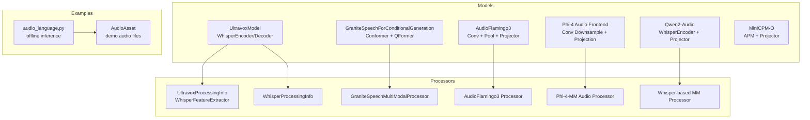
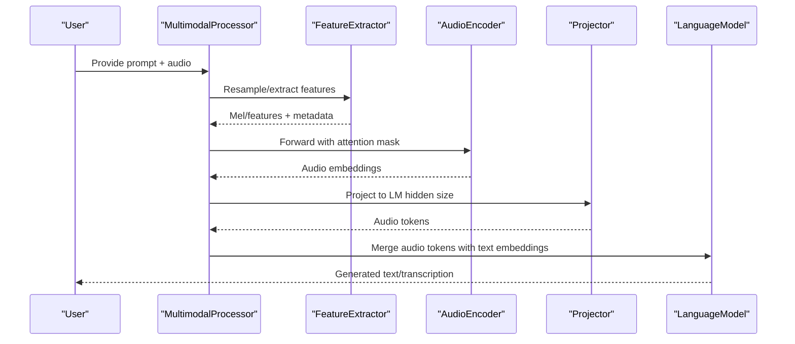
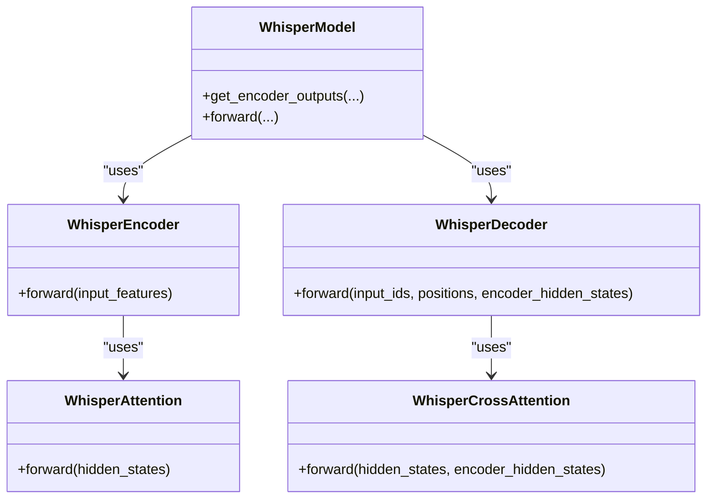
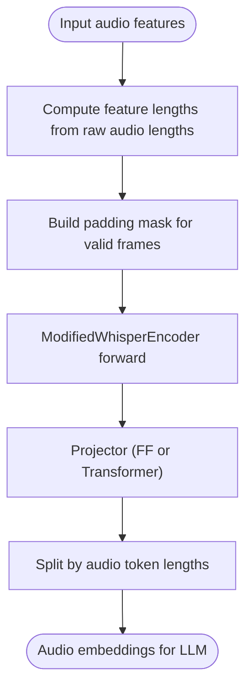
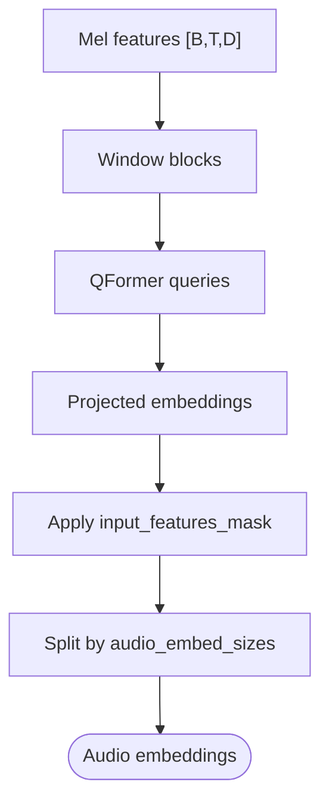
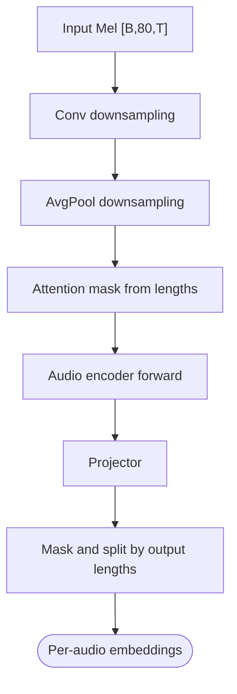
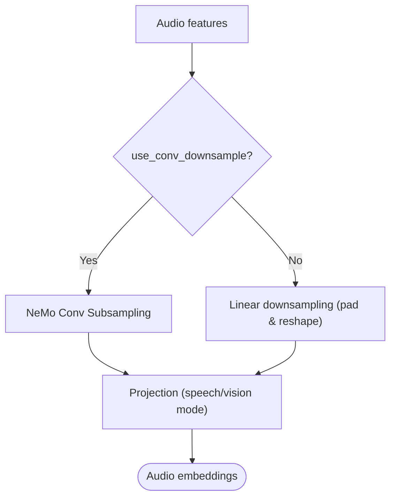
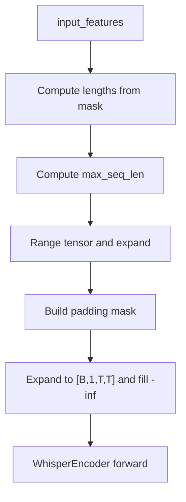
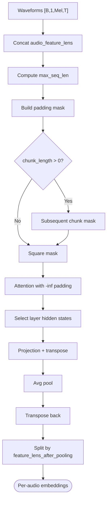
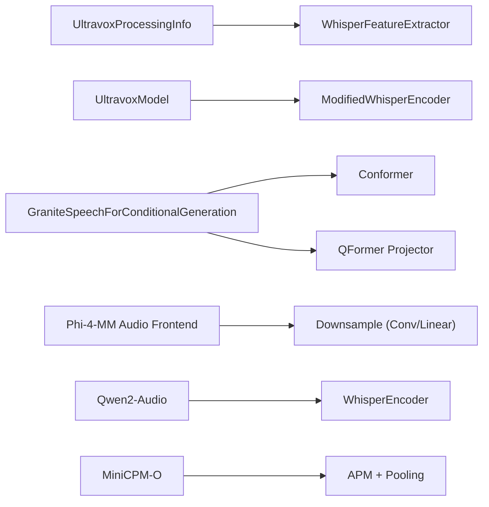

# Audio Processing Models

<cite>
**Referenced Files in This Document**
- [ultravox.py](file://vllm/model_executor/models/ultravox.py)
- [whisper.py](file://vllm/model_executor/models/whisper.py)
- [granite_speech.py](file://vllm/model_executor/models/granite_speech.py)
- [audioflamingo3.py](file://vllm/model_executor/models/audioflamingo3.py)
- [phi4mm_audio.py](file://vllm/model_executor/models/phi4mm_audio.py)
- [midashenglm.py](file://vllm/transformers_utils/configs/midashenglm.py)
- [ultravox.py](file://vllm/transformers_utils/configs/ultravox.py)
- [audio.py](file://vllm/assets/audio.py)
- [audio_language.py](file://examples/offline_inference/audio_language.py)
- [qwen2_audio.py](file://vllm/model_executor/models/qwen2_audio.py)
- [minicpmo.py](file://vllm/model_executor/models/minicpmo.py)
- [phi4mm.py](file://vllm/model_executor/models/phi4mm.py)
- [qwen3_omni_moe_thinker.py](file://vllm/model_executor/models/qwen3_omni_moe_thinker.py)
</cite>

## Table of Contents
1. [Introduction](#introduction)
2. [Project Structure](#project-structure)
3. [Core Components](#core-components)
4. [Architecture Overview](#architecture-overview)
5. [Detailed Component Analysis](#detailed-component-analysis)
6. [Dependency Analysis](#dependency-analysis)
7. [Performance Considerations](#performance-considerations)
8. [Troubleshooting Guide](#troubleshooting-guide)
9. [Conclusion](#conclusion)
10. [Appendices](#appendices)

## Introduction
This document explains audio processing models in vLLM with a focus on speech-to-text and audio understanding. It covers Whisper-based speech transcription, Ultravox audio encoders, and Granite Speech’s audio-language pipeline. It also documents audio preprocessing (spectrogram generation, feature extraction, temporal downsampling), audio-visual integration patterns, cross-modal attention, memory management for audio inputs, and practical configuration examples for real-time audio processing.

## Project Structure
The audio-related functionality spans model implementations, multimodal processors, and example scripts:
- Model implementations: Whisper encoder/decoder, Ultravox audio encoder and projector, Granite Speech conformer encoder and projector, AudioFlamingo3 audio encoder, Phi-4-multimodal audio front-end, and Qwen2-Audio.
- Multimodal processors: Feature extractors and tokenization helpers for each model family.
- Examples: End-to-end offline inference examples for multiple audio models.
- Assets: Example audio files used in demos.

**Diagram sources**
- [ultravox.py](file://vllm/model_executor/models/ultravox.py#L508-L780)
- [whisper.py](file://vllm/model_executor/models/whisper.py#L665-L780)
- [granite_speech.py](file://vllm/model_executor/models/granite_speech.py#L555-L800)
- [audioflamingo3.py](file://vllm/model_executor/models/audioflamingo3.py#L523-L592)
- [phi4mm_audio.py](file://vllm/model_executor/models/phi4mm_audio.py#L1155-L1296)
- [audio_language.py](file://examples/offline_inference/audio_language.py#L1-L120)
- [audio.py](file://vllm/assets/audio.py#L1-L44)

**Section sources**
- [ultravox.py](file://vllm/model_executor/models/ultravox.py#L508-L780)
- [whisper.py](file://vllm/model_executor/models/whisper.py#L665-L780)
- [granite_speech.py](file://vllm/model_executor/models/granite_speech.py#L555-L800)
- [audio_language.py](file://examples/offline_inference/audio_language.py#L1-L120)
- [audio.py](file://vllm/assets/audio.py#L1-L44)

## Core Components
- Whisper-based speech-to-text:
  - Encoder: Mel-spectrogram to sequence of embeddings with 2D convolutions and positional embeddings.
  - Decoder: Autoregressive generation conditioned on encoder outputs.
  - Cross-attention: Decoder attends to encoder outputs during generation.
- Ultravox audio understanding:
  - Audio encoder: Modified WhisperEncoder with attention masking by audio length.
  - Projector: Feed-forward or Transformer-based projector mapping audio features to language model hidden size.
  - Token insertion: Audio tokens are inserted into prompts via a dedicated placeholder.
- Granite Speech audio-language:
  - Conformer encoder with relative positional attention and depthwise convolutions.
  - QFormer projector producing per-chunk audio embeddings.
  - Variable-length audio features handled with masks and per-sample token counts.
- AudioFlamingo3:
  - Audio encoder with convolution and pooling, followed by a projector and optional chunk masking.
- Phi-4-multimodal audio:
  - Audio front-end with optional convolutional downsampling and linear downsampling, plus projection modes.
- Qwen2-Audio:
  - Uses WhisperEncoder with attention masking derived from feature masks.
- MiniCPM-O:
  - Audio projection module (APM) with attention masking and pooling, producing per-audio embeddings.

**Section sources**
- [whisper.py](file://vllm/model_executor/models/whisper.py#L488-L592)
- [ultravox.py](file://vllm/model_executor/models/ultravox.py#L403-L460)
- [granite_speech.py](file://vllm/model_executor/models/granite_speech.py#L492-L553)
- [audioflamingo3.py](file://vllm/model_executor/models/audioflamingo3.py#L523-L592)
- [phi4mm_audio.py](file://vllm/model_executor/models/phi4mm_audio.py#L1155-L1296)
- [qwen2_audio.py](file://vllm/model_executor/models/qwen2_audio.py#L380-L415)
- [minicpmo.py](file://vllm/model_executor/models/minicpmo.py#L640-L707)

## Architecture Overview
The audio pipelines share a common pattern:
- Feature extraction: Convert raw waveforms to Mel spectrograms or equivalent acoustic features.
- Audio encoder: Encode features into sequence embeddings with attention masking.
- Projector: Map audio embeddings to language model hidden size.
- Prompt integration: Insert audio tokens/placeholders into prompts and merge embeddings with text.

**Diagram sources**
- [ultravox.py](file://vllm/model_executor/models/ultravox.py#L111-L145)
- [whisper.py](file://vllm/model_executor/models/whisper.py#L665-L780)
- [granite_speech.py](file://vllm/model_executor/models/granite_speech.py#L555-L800)
- [audioflamingo3.py](file://vllm/model_executor/models/audioflamingo3.py#L523-L592)
- [phi4mm_audio.py](file://vllm/model_executor/models/phi4mm_audio.py#L1155-L1296)
- [qwen2_audio.py](file://vllm/model_executor/models/qwen2_audio.py#L380-L415)
- [minicpmo.py](file://vllm/model_executor/models/minicpmo.py#L640-L707)

## Detailed Component Analysis

### Whisper Speech-to-Text
- Encoder:
  - Two 1D convolutions with gelu activations, transposed to sequence-first format, and combined with positional embeddings.
  - Accepts either a list of per-audio tensors or a batched tensor.
- Decoder:
  - Embeddings and positional embeddings, followed by stacked decoder layers with self-attention and cross-attention to encoder outputs.
- Attention:
  - WhisperEncoderAttention supports 2D tensors for single-sequence inference.
  - Cross-attention caches encoder states for efficient decoding.

**Diagram sources**
- [whisper.py](file://vllm/model_executor/models/whisper.py#L488-L592)
- [whisper.py](file://vllm/model_executor/models/whisper.py#L597-L781)

**Section sources**
- [whisper.py](file://vllm/model_executor/models/whisper.py#L144-L171)
- [whisper.py](file://vllm/model_executor/models/whisper.py#L287-L351)
- [whisper.py](file://vllm/model_executor/models/whisper.py#L385-L486)
- [whisper.py](file://vllm/model_executor/models/whisper.py#L488-L592)
- [whisper.py](file://vllm/model_executor/models/whisper.py#L597-L781)

### Ultravox Audio Understanding
- Audio encoder:
  - Modified WhisperEncoder with relaxed input length checks and attention masking by audio length.
- Projector:
  - Two variants: feed-forward projector with frame stacking and RMSNorm, or a small Transformer stack using WhisperEncoderLayer.
- Prompt integration:
  - Dedicated placeholder token is replaced by audio tokens based on estimated token lengths per chunk.

**Diagram sources**
- [ultravox.py](file://vllm/model_executor/models/ultravox.py#L434-L460)
- [ultravox.py](file://vllm/model_executor/models/ultravox.py#L271-L331)
- [ultravox.py](file://vllm/model_executor/models/ultravox.py#L333-L401)
- [ultravox.py](file://vllm/model_executor/models/ultravox.py#L584-L676)

**Section sources**
- [ultravox.py](file://vllm/model_executor/models/ultravox.py#L403-L460)
- [ultravox.py](file://vllm/model_executor/models/ultravox.py#L271-L331)
- [ultravox.py](file://vllm/model_executor/models/ultravox.py#L333-L401)
- [ultravox.py](file://vllm/model_executor/models/ultravox.py#L584-L676)

### Granite Speech Audio-Language
- Conformer encoder:
  - Feed-forward, relative positional attention with distance lookup, depthwise convolutions, and residual connections.
- QFormer projector:
  - Sliding window decomposition, query-based transformer, and linear projection to language model hidden size.
- Variable-length handling:
  - Masks and per-sample token counts ensure correct embedding lengths.

**Diagram sources**
- [granite_speech.py](file://vllm/model_executor/models/granite_speech.py#L492-L553)
- [granite_speech.py](file://vllm/model_executor/models/granite_speech.py#L555-L624)
- [granite_speech.py](file://vllm/model_executor/models/granite_speech.py#L744-L765)

**Section sources**
- [granite_speech.py](file://vllm/model_executor/models/granite_speech.py#L492-L553)
- [granite_speech.py](file://vllm/model_executor/models/granite_speech.py#L555-L624)
- [granite_speech.py](file://vllm/model_executor/models/granite_speech.py#L744-L765)

### AudioFlamingo3
- Audio encoder:
  - Convolution and average pooling reduce sequence length; attention mask derived from feature lengths.
- Projector:
  - Projects pooled features; optional chunk masking and splitting by per-audio lengths.

**Diagram sources**
- [audioflamingo3.py](file://vllm/model_executor/models/audioflamingo3.py#L523-L559)
- [audioflamingo3.py](file://vllm/model_executor/models/audioflamingo3.py#L561-L592)

**Section sources**
- [audioflamingo3.py](file://vllm/model_executor/models/audioflamingo3.py#L523-L559)
- [audioflamingo3.py](file://vllm/model_executor/models/audioflamingo3.py#L561-L592)

### Phi-4-multimodal Audio Front-End
- Optional convolutional downsampling and linear downsampling with padding alignment.
- Projection mode selection for speech or vision contexts.

**Diagram sources**
- [phi4mm_audio.py](file://vllm/model_executor/models/phi4mm_audio.py#L1155-L1296)

**Section sources**
- [phi4mm_audio.py](file://vllm/model_executor/models/phi4mm_audio.py#L1155-L1296)

### Qwen2-Audio Attention Masking
- Derives audio feature lengths from a feature attention mask and builds a square attention mask for the encoder.

**Diagram sources**
- [qwen2_audio.py](file://vllm/model_executor/models/qwen2_audio.py#L380-L415)

**Section sources**
- [qwen2_audio.py](file://vllm/model_executor/models/qwen2_audio.py#L380-L415)

### MiniCPM-O Attention and Pooling
- Builds attention mask from per-audio feature lengths, applies chunk mask for sequential processing, and pools to token sequences.

**Diagram sources**
- [minicpmo.py](file://vllm/model_executor/models/minicpmo.py#L640-L707)

**Section sources**
- [minicpmo.py](file://vllm/model_executor/models/minicpmo.py#L640-L707)

### MiDashengLM Configuration
- Provides Mel-spectrogram configuration parameters (sample rate, hop length, n_mels, etc.) used by processors.

**Section sources**
- [midashenglm.py](file://vllm/transformers_utils/configs/midashenglm.py#L34-L80)

### Audio-Visual Integration Patterns
- Qwen3 Omni Thinker demonstrates audio token placement alongside video tokens and managing multimodal positions for audio-visual scenarios.

**Section sources**
- [qwen3_omni_moe_thinker.py](file://vllm/model_executor/models/qwen3_omni_moe_thinker.py#L1374-L1389)

## Dependency Analysis
- Ultravox:
  - Uses WhisperFeatureExtractor via UltravoxProcessingInfo.
  - ModifiedWhisperEncoder extends WhisperEncoder with attention masking by audio length.
- Granite Speech:
  - Uses a custom audio processor and QFormer projector.
- Phi-4-multimodal:
  - Audio front-end integrates with vision components; supports convolutional downsampling and linear downsampling.
- Qwen2-Audio and MiniCPM-O:
  - Both rely on attention masking derived from feature lengths to prevent padding influence.

**Diagram sources**
- [ultravox.py](file://vllm/model_executor/models/ultravox.py#L111-L145)
- [ultravox.py](file://vllm/model_executor/models/ultravox.py#L403-L460)
- [granite_speech.py](file://vllm/model_executor/models/granite_speech.py#L555-L624)
- [phi4mm_audio.py](file://vllm/model_executor/models/phi4mm_audio.py#L1155-L1296)
- [qwen2_audio.py](file://vllm/model_executor/models/qwen2_audio.py#L380-L415)
- [minicpmo.py](file://vllm/model_executor/models/minicpmo.py#L640-L707)

**Section sources**
- [ultravox.py](file://vllm/model_executor/models/ultravox.py#L111-L145)
- [ultravox.py](file://vllm/model_executor/models/ultravox.py#L403-L460)
- [granite_speech.py](file://vllm/model_executor/models/granite_speech.py#L555-L624)
- [phi4mm_audio.py](file://vllm/model_executor/models/phi4mm_audio.py#L1155-L1296)
- [qwen2_audio.py](file://vllm/model_executor/models/qwen2_audio.py#L380-L415)
- [minicpmo.py](file://vllm/model_executor/models/minicpmo.py#L640-L707)

## Performance Considerations
- Sequence length handling:
  - Attention masks are derived from feature lengths to avoid padding overhead and ensure consistent behavior between training and inference.
- Temporal downsampling:
  - Convolutional and pooling layers reduce sequence length; linear downsampling pads and reshapes for stride-like effects.
- Memory management:
  - Batched processing with chunked audio features and attention masking prevents excessive memory spikes.
  - Projectors stack frames to reduce sequence length further (e.g., Ultravox stack factor).
- Real-time optimization:
  - Use chunked prefill and KV caching for decoder-based models.
  - Limit multimodal counts per prompt to reduce memory pressure.
  - Prefer models with encoder-decoder caching (Whisper) for streaming scenarios.

[No sources needed since this section provides general guidance]

## Troubleshooting Guide
- Unsupported sampling rate:
  - Some processors resample to 16000 or 8000; inputs below 8000 are rejected.
- Too-short audio:
  - Certain models raise errors if audio is too short for configured spectrogram parameters.
- Excessive sequence length:
  - Whisper encoder enforces a maximum context length; inputs exceeding this raise explicit errors.
- LoRA requirements:
  - Granite Speech example requires enabling a model-provided LoRA for audio inputs.

**Section sources**
- [phi4mm.py](file://vllm/model_executor/models/phi4mm.py#L745-L781)
- [ultravox.py](file://vllm/model_executor/models/ultravox.py#L462-L505)
- [audio_language.py](file://examples/offline_inference/audio_language.py#L92-L120)

## Conclusion
vLLM provides robust audio processing pipelines spanning speech-to-text (Whisper), audio understanding (Ultravox), and audio-language (Granite Speech). The implementations emphasize attention masking, temporal downsampling, and multimodal integration. Practical examples demonstrate configuration and runtime optimization for real-time audio processing.

## Appendices

### Practical Configuration Examples
- Offline inference examples for multiple models, including prompt construction and LoRA usage for Granite Speech.

**Section sources**
- [audio_language.py](file://examples/offline_inference/audio_language.py#L92-L120)
- [audio_language.py](file://examples/offline_inference/audio_language.py#L289-L308)
- [audio_language.py](file://examples/offline_inference/audio_language.py#L311-L332)

### Audio Formats and Sampling Rates
- Example audio assets are provided for testing; processors resample to target sampling rates.

**Section sources**
- [audio.py](file://vllm/assets/audio.py#L1-L44)