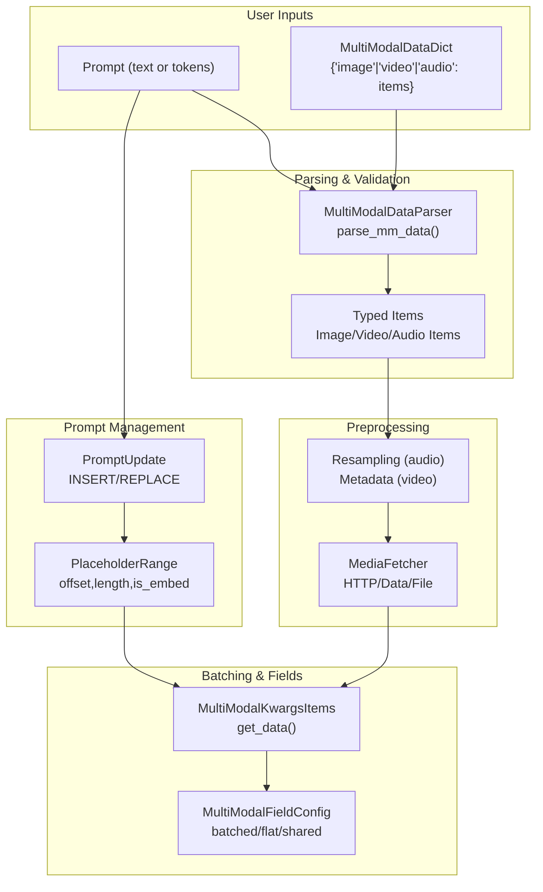
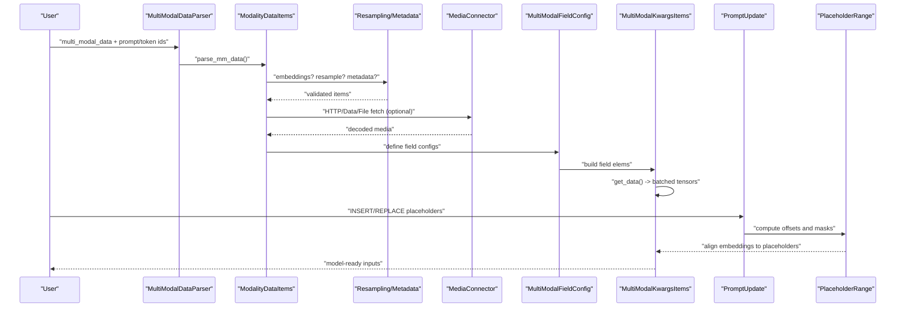
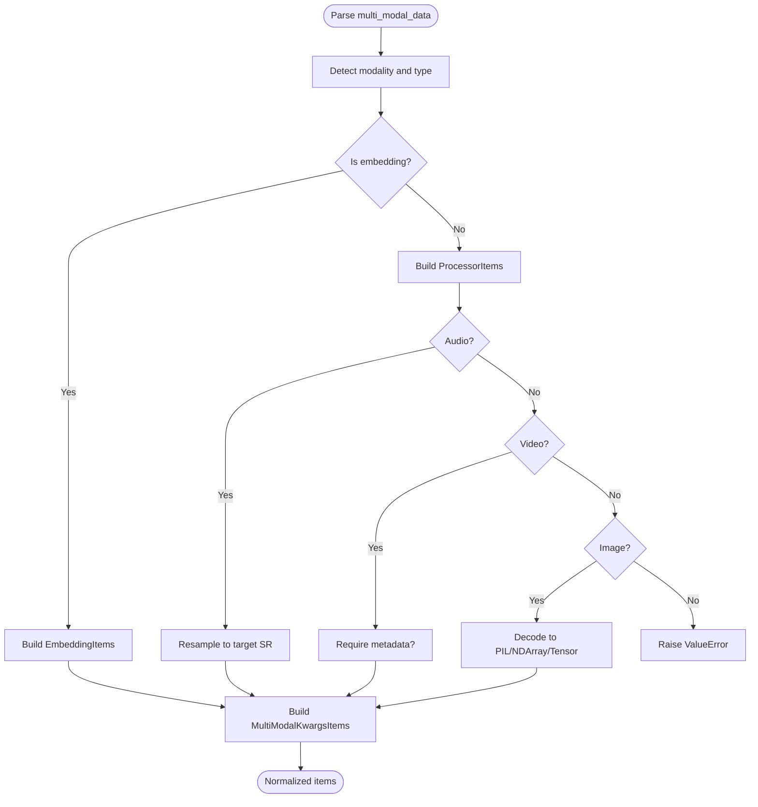
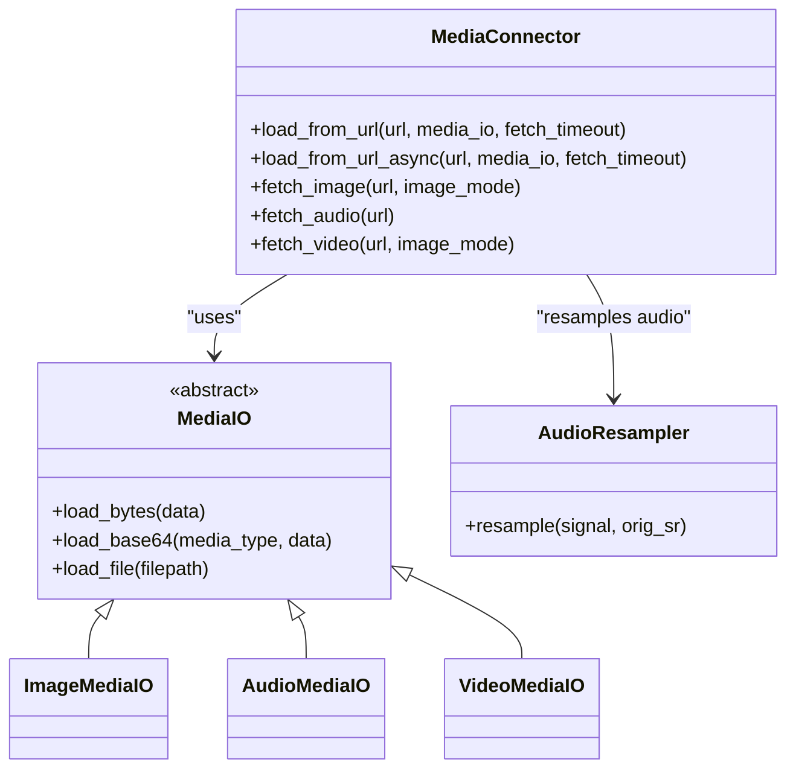
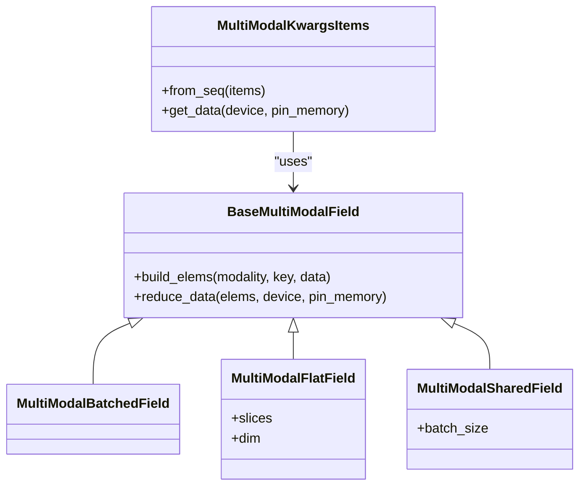
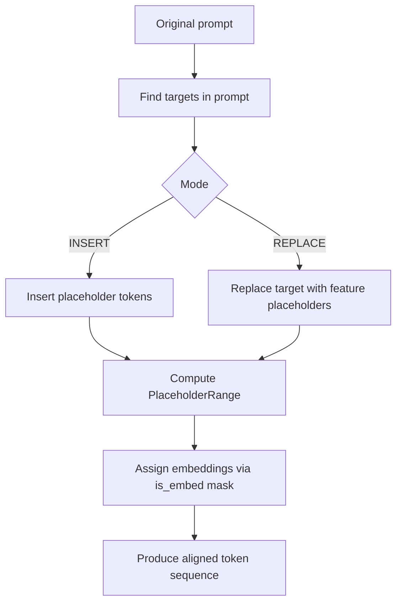
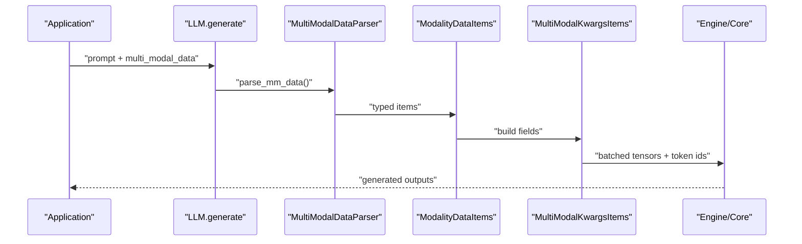
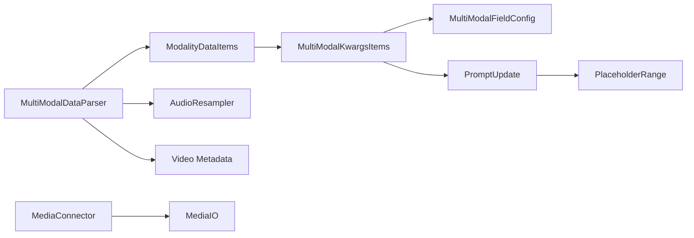

# Multimodal Input Processing

<cite>
**Referenced Files in This Document**
- [multimodal_inputs.md](file://docs/features/multimodal_inputs.md)
- [mm_processing_design.md](file://docs/design/mm_processing.md)
- [multimodal_inputs.py](file://vllm/multimodal/inputs.py)
- [multimodal_parse.py](file://vllm/multimodal/parse.py)
- [multimodal_processing.py](file://vllm/multimodal/processing.py)
- [multimodal_utils.py](file://vllm/multimodal/utils.py)
- [multimodal_base.py](file://vllm/multimodal/base.py)
- [vision_language_example.py](file://examples/offline_inference/vision_language.py)
- [audio_language_example.py](file://examples/offline_inference/audio_language.py)
- [assets_image.py](file://vllm/assets/image.py)
- [assets_audio.py](file://vllm/assets/audio.py)
- [assets_video.py](file://vllm/assets/video.py)
</cite>

## Table of Contents
1. [Introduction](#introduction)
2. [Project Structure](#project-structure)
3. [Core Components](#core-components)
4. [Architecture Overview](#architecture-overview)
5. [Detailed Component Analysis](#detailed-component-analysis)
6. [Dependency Analysis](#dependency-analysis)
7. [Performance Considerations](#performance-considerations)
8. [Troubleshooting Guide](#troubleshooting-guide)
9. [Conclusion](#conclusion)
10. [Appendices](#appendices)

## Introduction
This document explains the unified multimodal input pipeline in vLLM that supports text, images, audio, and video within a single request-processing framework. It covers input parsing and validation, preprocessing workflows per modality, memory management strategies for mixed modalities, and the relationship between input processing and attention backends for heterogeneous sequence lengths and cross-modal attention.

## Project Structure
The multimodal subsystem is organized around a few core modules:
- Parsing and normalization of user inputs into typed, validated items
- Unified batching and field configuration for model-ready tensors
- Prompt update and placeholder token management for cross-modal alignment
- Utilities for safe media fetching, threading, and grouping for efficient batching
- Examples demonstrating practical multimodal request construction and optimization

**Diagram sources**
- [multimodal_parse.py](file://vllm/multimodal/parse.py#L358-L566)
- [multimodal_inputs.py](file://vllm/multimodal/inputs.py#L621-L800)
- [multimodal_processing.py](file://vllm/multimodal/processing.py#L290-L490)
- [multimodal_utils.py](file://vllm/multimodal/utils.py#L42-L120)

**Section sources**
- [multimodal_parse.py](file://vllm/multimodal/parse.py#L358-L566)
- [multimodal_inputs.py](file://vllm/multimodal/inputs.py#L621-L800)
- [multimodal_processing.py](file://vllm/multimodal/processing.py#L290-L490)
- [multimodal_utils.py](file://vllm/multimodal/utils.py#L42-L120)

## Core Components
- MultiModalDataParser: Converts raw user inputs into typed, validated items per modality, handling embeddings, resampling, and metadata.
- MultiModalFieldConfig and MultiModalKwargsItems: Define how tensors are split, stacked, or shared across batch items for model execution.
- PromptUpdate and PlaceholderRange: Manage placeholder token insertion/replacement and embedding assignment masks to align multi-modal features with token sequences.
- MediaConnector and MediaIO: Fetch and decode media from HTTP, data URLs, and files with safety controls and threading.
- Examples: Practical demonstrations for images, audio, and video with model-specific prompt formats and batching.

**Section sources**
- [multimodal_parse.py](file://vllm/multimodal/parse.py#L358-L566)
- [multimodal_inputs.py](file://vllm/multimodal/inputs.py#L621-L800)
- [multimodal_processing.py](file://vllm/multimodal/processing.py#L290-L490)
- [multimodal_utils.py](file://vllm/multimodal/utils.py#L42-L120)
- [vision_language_example.py](file://examples/offline_inference/vision_language.py#L1-L200)
- [audio_language_example.py](file://examples/offline_inference/audio_language.py#L1-L120)

## Architecture Overview
The unified pipeline integrates text and multi-modal inputs, validates and normalizes them, prepares tensors for the model, and manages prompt placeholders and embedding assignments.

**Diagram sources**
- [multimodal_parse.py](file://vllm/multimodal/parse.py#L358-L566)
- [multimodal_inputs.py](file://vllm/multimodal/inputs.py#L621-L800)
- [multimodal_processing.py](file://vllm/multimodal/processing.py#L290-L490)
- [multimodal_utils.py](file://vllm/multimodal/utils.py#L42-L120)

## Detailed Component Analysis

### Input Parsing and Validation
- MultiModalDataParser enforces per-modality typing and detects embeddings vs raw media. It supports:
  - Audio: resampling to target sampling rate, accepting tuples of (signal, sr) or arrays
  - Image: PIL, numpy, torch tensors; embeddings accepted as 3D tensors
  - Video: lists of frames, numpy/torch arrays, or tuples of (frames, metadata); metadata requirement configurable
- Embedding-only inputs are validated by shape and passed directly to the model without HF processing.
- Empty or None entries are handled gracefully; embedding-only inputs are supported.

**Diagram sources**
- [multimodal_parse.py](file://vllm/multimodal/parse.py#L358-L566)

**Section sources**
- [multimodal_parse.py](file://vllm/multimodal/parse.py#L358-L566)

### Preprocessing Workflows Per Modality
- Images:
  - Decoding from HTTP/data/file URLs with MediaConnector and MediaIO
  - Optional RGBA background color handling for transparency
  - Mode conversion to RGB for downstream compatibility
- Audio:
  - Fetching and decoding; resampling to model’s expected sampling rate
  - Accepting (signal, sr) tuples or arrays
- Videos:
  - Frame extraction and metadata computation (frame count, fps, duration)
  - Optional metadata forwarding to HF processors

**Diagram sources**
- [multimodal_utils.py](file://vllm/multimodal/utils.py#L42-L120)
- [multimodal_base.py](file://vllm/multimodal/base.py#L41-L57)
- [multimodal_parse.py](file://vllm/multimodal/parse.py#L358-L566)

**Section sources**
- [multimodal_utils.py](file://vllm/multimodal/utils.py#L42-L120)
- [multimodal_base.py](file://vllm/multimodal/base.py#L41-L57)
- [multimodal_parse.py](file://vllm/multimodal/parse.py#L358-L566)

### Batching and Field Configuration
- MultiModalFieldConfig defines how tensors are batched:
  - batched: index into first dimension per item
  - flat/flat_from_sizes: slice along a dimension and concatenate
  - shared: same data repeated across batch items
- MultiModalKwargsItems aggregates per-item fields into batched tensors, moving to device and pinning memory when requested.
- Grouping by modality and field configuration enables efficient attention batching and heterogeneous sequence handling.

**Diagram sources**
- [multimodal_inputs.py](file://vllm/multimodal/inputs.py#L621-L800)

**Section sources**
- [multimodal_inputs.py](file://vllm/multimodal/inputs.py#L621-L800)

### Prompt Updates and Placeholder Alignment
- PromptUpdate supports INSERT and REPLACE modes to manage placeholder tokens for multi-modal features.
- PlaceholderRange tracks placeholder offsets and embedding assignment masks to align encoder outputs to placeholder regions.
- Automatic prompt updating avoids re-tokenizing text when only multi-modal inputs change.

**Diagram sources**
- [multimodal_processing.py](file://vllm/multimodal/processing.py#L290-L490)
- [multimodal_inputs.py](file://vllm/multimodal/inputs.py#L143-L220)

**Section sources**
- [multimodal_processing.py](file://vllm/multimodal/processing.py#L290-L490)
- [multimodal_inputs.py](file://vllm/multimodal/inputs.py#L143-L220)

### Memory Management Strategies for Mixed Modalities
- Device placement and pinned memory:
  - MultiModalFieldConfig supports keep_on_cpu to keep certain fields on CPU
  - get_data(device, pin_memory) moves tensors efficiently and pins memory for fast transfers
- Threading:
  - Global thread pool for media decoding to overlap I/O and CPU-bound work
- Garbage collection:
  - Embedding-only inputs bypass heavy HF processing, reducing peak memory
  - Efficient batching minimizes fragmentation and redundant copies

**Section sources**
- [multimodal_inputs.py](file://vllm/multimodal/inputs.py#L621-L800)
- [multimodal_utils.py](file://vllm/multimodal/utils.py#L42-L120)

### Relationship Between Input Processing and Attention Backends
- Heterogeneous sequence lengths:
  - PlaceholderRange and embedding masks enable precise alignment of variable-length multi-modal features with text tokens
  - Flat/concat strategies in field configs support concatenation along sequence dimension
- Cross-modal attention:
  - Embedding assignment masks indicate which token positions receive embeddings, enabling attention over heterogeneous sequences
  - Prompt updates ensure placeholder tokens are inserted/replaced consistently across requests

**Section sources**
- [multimodal_inputs.py](file://vllm/multimodal/inputs.py#L143-L220)
- [multimodal_processing.py](file://vllm/multimodal/processing.py#L290-L490)

### Practical Examples and Throughput Optimization
- Images:
  - Examples demonstrate constructing prompts with model-specific placeholders and batching multiple images
  - Limiting items per prompt reduces memory footprint
- Audio:
  - Supports token prompts and raw audio inputs; batching multiple audio items per prompt
  - Resampling and embedding inputs are supported
- Videos:
  - Frame extraction and metadata computation; embedding inputs supported for certain models

**Diagram sources**
- [vision_language_example.py](file://examples/offline_inference/vision_language.py#L1-L200)
- [audio_language_example.py](file://examples/offline_inference/audio_language.py#L1-L120)
- [multimodal_parse.py](file://vllm/multimodal/parse.py#L358-L566)
- [multimodal_inputs.py](file://vllm/multimodal/inputs.py#L621-L800)

**Section sources**
- [vision_language_example.py](file://examples/offline_inference/vision_language.py#L1-L200)
- [audio_language_example.py](file://examples/offline_inference/audio_language.py#L1-L120)

## Dependency Analysis
The multimodal subsystem composes parsing, preprocessing, batching, and prompt management. Key dependencies:
- MultiModalDataParser depends on typed item builders and embedding detection
- MultiModalKwargsItems depends on field configurations to assemble batched tensors
- PromptUpdate and PlaceholderRange depend on tokenizer-like interfaces to manage placeholder tokens
- MediaConnector depends on MediaIO implementations and threading utilities

**Diagram sources**
- [multimodal_parse.py](file://vllm/multimodal/parse.py#L358-L566)
- [multimodal_inputs.py](file://vllm/multimodal/inputs.py#L621-L800)
- [multimodal_processing.py](file://vllm/multimodal/processing.py#L290-L490)
- [multimodal_utils.py](file://vllm/multimodal/utils.py#L42-L120)

**Section sources**
- [multimodal_parse.py](file://vllm/multimodal/parse.py#L358-L566)
- [multimodal_inputs.py](file://vllm/multimodal/inputs.py#L621-L800)
- [multimodal_processing.py](file://vllm/multimodal/processing.py#L290-L490)
- [multimodal_utils.py](file://vllm/multimodal/utils.py#L42-L120)

## Performance Considerations
- Chunked prefill and prefix caching rely on stable multi-modal hashing and deterministic prompt updates to avoid recomputation.
- Embedding inputs bypass expensive HF processing, improving throughput for repeated multi-modal data.
- Efficient batching via flat/concat strategies and pinned memory accelerates host-to-device transfers.
- Limiting items per prompt reduces peak memory and speeds up attention computations.

[No sources needed since this section provides general guidance]

## Troubleshooting Guide
- Unsupported modality or missing keys in embedding inputs raise explicit errors during parsing.
- Unidentified image errors are converted to ValueErrors for robust upstream handling.
- Allowed media domains and local path restrictions protect against SSRF risks.
- For tokenized prompts, ensure placeholder counts match multi-modal inputs or use dummy text to avoid HF processor errors.

**Section sources**
- [multimodal_parse.py](file://vllm/multimodal/parse.py#L358-L566)
- [multimodal_utils.py](file://vllm/multimodal/utils.py#L42-L120)
- [mm_processing_design.md](file://docs/design/mm_processing.md#L1-L64)

## Conclusion
vLLM’s multimodal input pipeline unifies text and multi-modal inputs through typed parsing, flexible batching, and precise prompt placeholder management. It supports embeddings, resampling, metadata, and safe media fetching, while enabling efficient memory usage and throughput optimization. The design cleanly separates concerns across parsing, preprocessing, batching, and prompt alignment, ensuring robust handling of heterogeneous sequences and cross-modal attention.

[No sources needed since this section summarizes without analyzing specific files]

## Appendices
- Practical examples for images and audio demonstrate prompt construction, batching, and model-specific placeholders.
- Assets modules provide convenient access to public test assets for images, audio, and video.

**Section sources**
- [vision_language_example.py](file://examples/offline_inference/vision_language.py#L1-L200)
- [audio_language_example.py](file://examples/offline_inference/audio_language.py#L1-L120)
- [assets_image.py](file://vllm/assets/image.py#L1-L60)
- [assets_audio.py](file://vllm/assets/audio.py#L1-L44)
- [assets_video.py](file://vllm/assets/video.py#L1-L150)