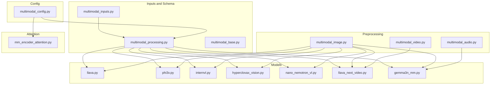
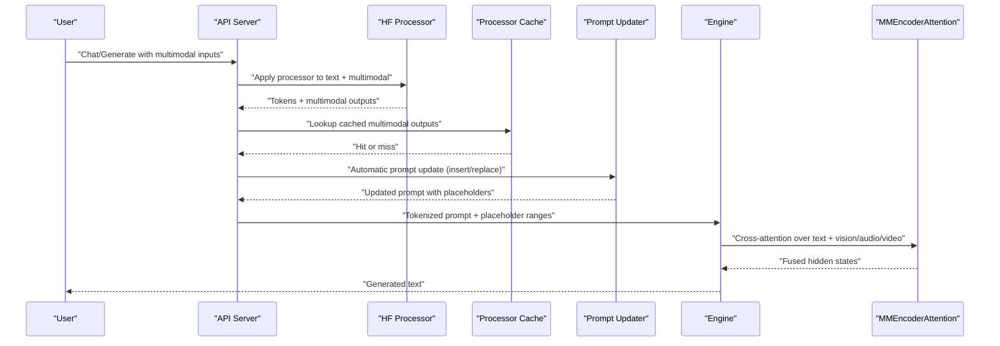
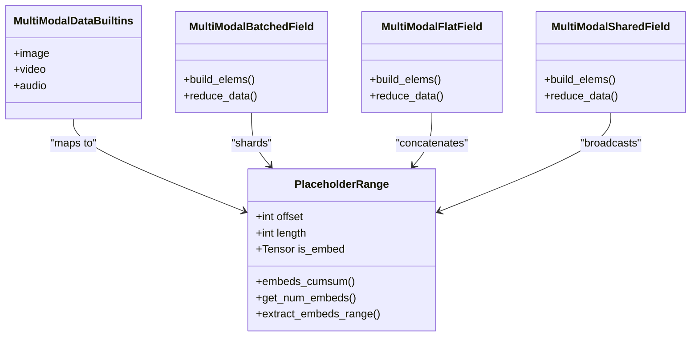
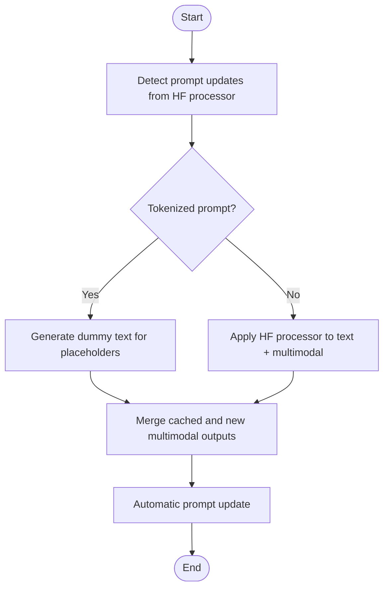
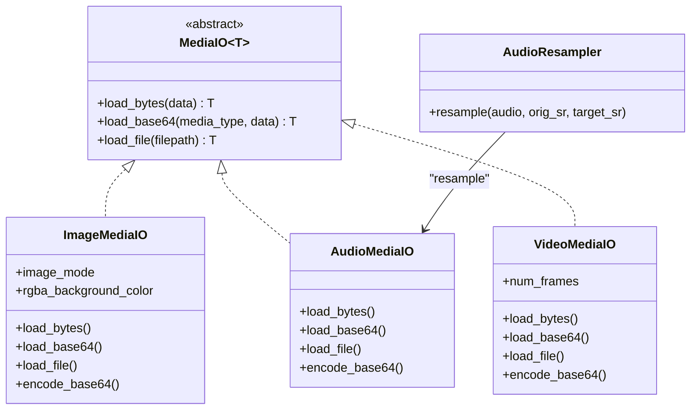
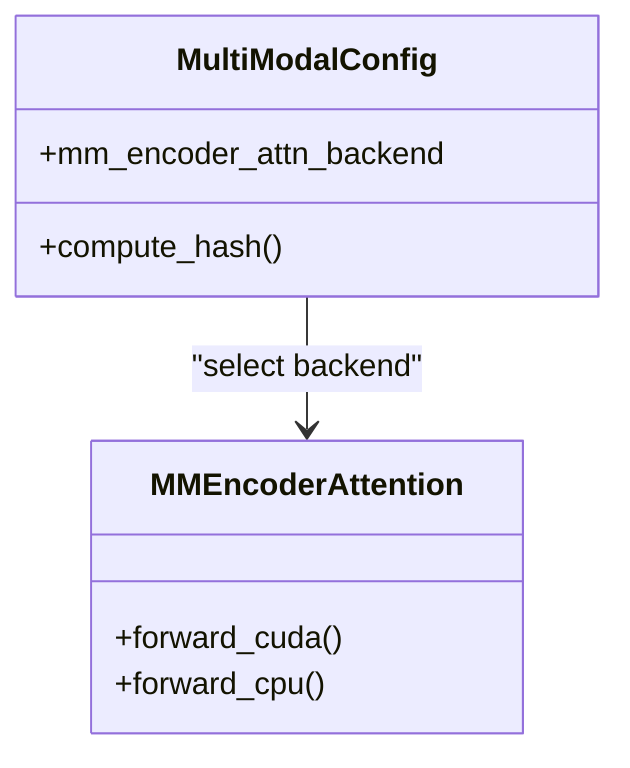
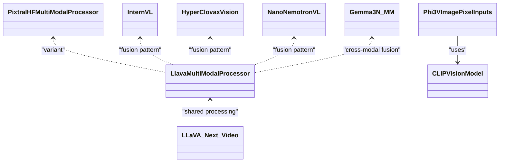
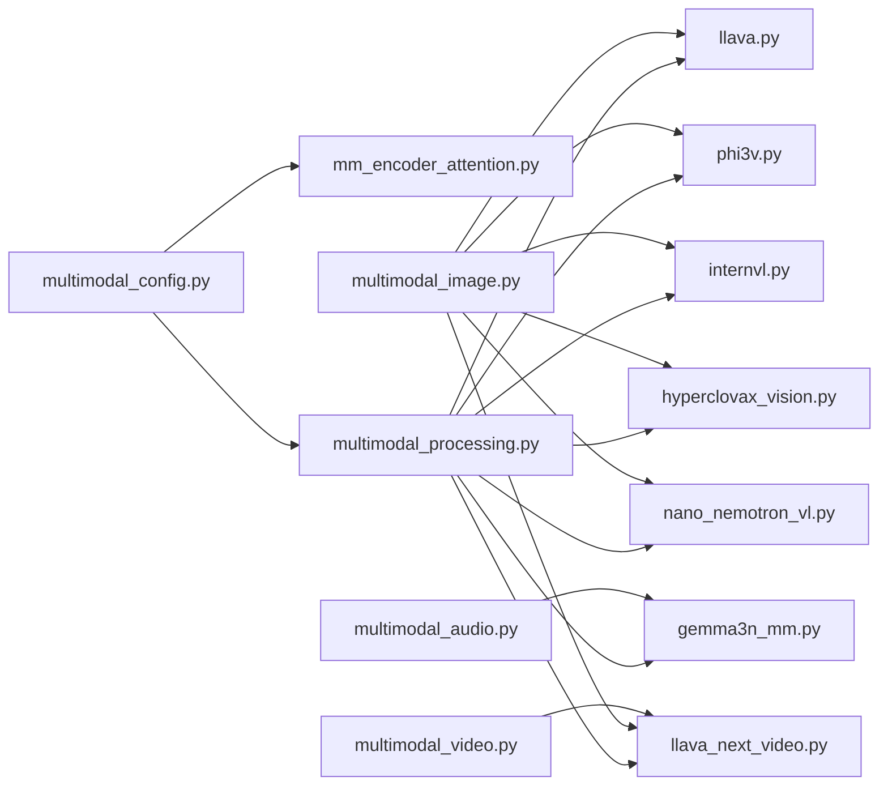

# Multimodal Models

<cite>
**Referenced Files in This Document**
- [multimodal_inputs.md](file://docs/features/multimodal_inputs.md)
- [mm_processing.md](file://docs/design/mm_processing.md)
- [multimodal_inputs.py](file://vllm/multimodal/inputs.py)
- [multimodal_processing.py](file://vllm/multimodal/processing.py)
- [multimodal_base.py](file://vllm/multimodal/base.py)
- [multimodal_image.py](file://vllm/multimodal/image.py)
- [multimodal_audio.py](file://vllm/multimodal/audio.py)
- [multimodal_video.py](file://vllm/multimodal/video.py)
- [multimodal_config.py](file://vllm/config/multimodal.py)
- [mm_encoder_attention.py](file://vllm/attention/layers/mm_encoder_attention.py)
- [llava.py](file://vllm/model_executor/models/llava.py)
- [phi3v.py](file://vllm/model_executor/models/phi3v.py)
- [internvl.py](file://vllm/model_executor/models/internvl.py)
- [hyperclovax_vision.py](file://vllm/model_executor/models/hyperclovax_vision.py)
- [nano_nemotron_vl.py](file://vllm/model_executor/models/nano_nemotron_vl.py)
- [llava_next_video.py](file://vllm/model_executor/models/llava_next_video.py)
- [gemma3n_mm.py](file://vllm/model_executor/models/gemma3n_mm.py)
- [test_multimodal_config.py](file://tests/config/test_multimodal_config.py)
</cite>

## Table of Contents
1. [Introduction](#introduction)
2. [Project Structure](#project-structure)
3. [Core Components](#core-components)
4. [Architecture Overview](#architecture-overview)
5. [Detailed Component Analysis](#detailed-component-analysis)
6. [Dependency Analysis](#dependency-analysis)
7. [Performance Considerations](#performance-considerations)
8. [Troubleshooting Guide](#troubleshooting-guide)
9. [Conclusion](#conclusion)
10. [Appendices](#appendices)

## Introduction
This document explains multimodal models in vLLM, focusing on how text, vision, audio, and video are integrated into unified model architectures. It covers supported multimodal models (vision-language models such as LLaVA, Qwen-VL, Phi-3V, Pixtral; audio models such as Whisper and Ultravox; vision encoders such as CLIP and BLIP-2), multimodal input processing pipelines, modality-specific preprocessing, cross-modal attention mechanisms, memory management for heterogeneous inputs, and the relationship between multimodal architectures and attention backends. Practical configuration examples and performance optimization tips are included for different input combinations.

## Project Structure
The multimodal subsystem is organized around:
- Input parsing and schema: multimodal inputs, placeholder ranges, and field batching semantics
- Processing pipeline: prompt updates, HF processor integration, caching, and interleaving
- IO and preprocessing: image, audio, and video loaders and resamplers
- Model integration: multimodal-aware model backbones and embedding fusion
- Attention backends: specialized encoder attention layers for heterogeneous sequences
- Configuration: limits, caches, encoder attention backend overrides, and pruning

**Diagram sources**
- [multimodal_inputs.py](file://vllm/multimodal/inputs.py#L1-L200)
- [multimodal_processing.py](file://vllm/multimodal/processing.py#L1-L200)
- [multimodal_base.py](file://vllm/multimodal/base.py#L1-L57)
- [multimodal_image.py](file://vllm/multimodal/image.py#L1-L143)
- [multimodal_audio.py](file://vllm/multimodal/audio.py#L1-L148)
- [multimodal_video.py](file://vllm/multimodal/video.py#L1-L200)
- [llava.py](file://vllm/model_executor/models/llava.py#L394-L430)
- [phi3v.py](file://vllm/model_executor/models/phi3v.py#L77-L120)
- [internvl.py](file://vllm/model_executor/models/internvl.py#L1331-L1364)
- [hyperclovax_vision.py](file://vllm/model_executor/models/hyperclovax_vision.py#L745-L780)
- [nano_nemotron_vl.py](file://vllm/model_executor/models/nano_nemotron_vl.py#L1468-L1505)
- [llava_next_video.py](file://vllm/model_executor/models/llava_next_video.py#L408-L428)
- [gemma3n_mm.py](file://vllm/model_executor/models/gemma3n_mm.py#L644-L664)
- [mm_encoder_attention.py](file://vllm/attention/layers/mm_encoder_attention.py#L190-L216)
- [multimodal_config.py](file://vllm/config/multimodal.py#L1-L120)

**Section sources**
- [multimodal_inputs.py](file://vllm/multimodal/inputs.py#L1-L200)
- [multimodal_processing.py](file://vllm/multimodal/processing.py#L1-L200)
- [multimodal_config.py](file://vllm/config/multimodal.py#L1-L120)

## Core Components
- Multimodal inputs and schema
  - MultiModalDataBuiltins defines built-in modalities and accepted item types
  - PlaceholderRange tracks placeholder token offsets and embedding assignment masks
  - MultiModalFieldConfig and related classes define how to batch and shard tensors across modalities
- Processing pipeline
  - PromptUpdate and PromptInsertion/PromptReplacement define how placeholder tokens are inserted or replaced in prompts
  - Automatic prompt updating and dummy text generation enable tokenized prompts with multimodal data
  - Processor output caching accelerates repeated multimodal processing
- IO and preprocessing
  - ImageMediaIO handles RGBA-to-RGB conversion and base64/bytes/file loading
  - AudioMediaIO loads/resamples audio and supports base64/bytes/file
  - VideoMediaIO selects loader backends (e.g., OpenCV) and samples frames/fps dynamically
- Model integration
  - Models implement multimodal embedding fusion and input parsing/validation
  - Examples include LLaVA/Pixtral family, Phi-3V (CLIP-based vision), InternVL, HyperClova Vision, Nano Nemotron VL, LLaVA Next Video, and Gemma3N-MM
- Attention backends
  - MMEncoderAttention supports Flash Attention and SDPA backends for heterogeneous sequences
- Configuration
  - MultiModalConfig controls limits, embedding passthrough, processor caching, encoder attention backend, and video pruning

**Section sources**
- [multimodal_inputs.py](file://vllm/multimodal/inputs.py#L110-L220)
- [multimodal_processing.py](file://vllm/multimodal/processing.py#L290-L490)
- [multimodal_image.py](file://vllm/multimodal/image.py#L46-L118)
- [multimodal_audio.py](file://vllm/multimodal/audio.py#L90-L148)
- [multimodal_video.py](file://vllm/multimodal/video.py#L270-L341)
- [multimodal_config.py](file://vllm/config/multimodal.py#L53-L128)
- [mm_encoder_attention.py](file://vllm/attention/layers/mm_encoder_attention.py#L190-L216)

## Architecture Overview
The end-to-end flow integrates user prompts and multimodal data, applies HF processor updates and caching, and produces tokenized prompts with placeholder ranges. Model backbones embed and fuse cross-modal features, and attention backends handle heterogeneous sequences efficiently.

**Diagram sources**
- [mm_processing.md](file://docs/design/mm_processing.md#L1-L64)
- [multimodal_processing.py](file://vllm/multimodal/processing.py#L748-L800)
- [mm_encoder_attention.py](file://vllm/attention/layers/mm_encoder_attention.py#L190-L216)

## Detailed Component Analysis

### Multimodal Inputs and Schema
- Built-in modalities and item types
  - image: PIL-like, numpy/tensor, or precomputed embeddings
  - video: list of frames, numpy/tensor, or metadata+frames
  - audio: waveform+sr tuples, numpy/tensor, or precomputed embeddings
- PlaceholderRange
  - Tracks placeholder offsets and optional embedding masks for selective assignment
- Field batching
  - MultiModalBatchedField, MultiModalFlatField, MultiModalSharedField define how to shard and concatenate tensors across items

**Diagram sources**
- [multimodal_inputs.py](file://vllm/multimodal/inputs.py#L110-L220)
- [multimodal_inputs.py](file://vllm/multimodal/inputs.py#L492-L790)

**Section sources**
- [multimodal_inputs.py](file://vllm/multimodal/inputs.py#L110-L220)
- [multimodal_inputs.py](file://vllm/multimodal/inputs.py#L492-L790)

### Prompt Processing and Automatic Updates
- PromptInsertion and PromptReplacement define how placeholder tokens are inserted or replaced
- Dummy text generation avoids HF processor errors for tokenized prompts
- Automatic prompt updating keeps tokenization consistent when cache merges missing items

**Diagram sources**
- [mm_processing.md](file://docs/design/mm_processing.md#L1-L64)
- [multimodal_processing.py](file://vllm/multimodal/processing.py#L748-L800)

**Section sources**
- [mm_processing.md](file://docs/design/mm_processing.md#L1-L64)
- [multimodal_processing.py](file://vllm/multimodal/processing.py#L290-L490)

### IO and Modality-Specific Preprocessing
- Image
  - RGBA-to-RGB conversion with customizable background color
  - Base64/bytes/file loading and optional encoding
- Audio
  - Resampling via librosa or scipy
  - Base64/bytes/file loading and encoding
- Video
  - Backend selection (OpenCV/OpenCV dynamic)
  - Frame sampling and resizing
  - Metadata for downstream processors

**Diagram sources**
- [multimodal_base.py](file://vllm/multimodal/base.py#L41-L57)
- [multimodal_image.py](file://vllm/multimodal/image.py#L46-L118)
- [multimodal_audio.py](file://vllm/multimodal/audio.py#L90-L148)
- [multimodal_audio.py](file://vllm/multimodal/audio.py#L54-L88)
- [multimodal_video.py](file://vllm/multimodal/video.py#L270-L341)

**Section sources**
- [multimodal_image.py](file://vllm/multimodal/image.py#L1-L143)
- [multimodal_audio.py](file://vllm/multimodal/audio.py#L1-L148)
- [multimodal_video.py](file://vllm/multimodal/video.py#L1-L200)

### Cross-Modal Attention Mechanisms
- MMEncoderAttention supports Flash Attention and SDPA backends
- Attention backends are configurable via MultiModalConfig and influence compute graph hashing

**Diagram sources**
- [mm_encoder_attention.py](file://vllm/attention/layers/mm_encoder_attention.py#L190-L216)
- [multimodal_config.py](file://vllm/config/multimodal.py#L120-L140)
- [test_multimodal_config.py](file://tests/config/test_multimodal_config.py#L1-L25)

**Section sources**
- [mm_encoder_attention.py](file://vllm/attention/layers/mm_encoder_attention.py#L190-L216)
- [multimodal_config.py](file://vllm/config/multimodal.py#L120-L140)
- [test_multimodal_config.py](file://tests/config/test_multimodal_config.py#L1-L25)

### Supported Multimodal Models and Integrations
- Vision-Language Models
  - LLaVA/Pixtral: multimodal processing info and processors
  - Phi-3V: CLIP vision encoder integration and image input parsing
  - InternVL/HyperClova/Nano Nemotron VL: multimodal embedding fusion across images/videos
  - LLaVA Next Video: video pixel-to-feature processing and embedding splitting
- Audio Models
  - Gemma3N-MM: audio embedding processing and cross-modal fusion
- Vision Encoders
  - CLIP (Phi-3V): configurable layer indexing and projection
  - BLIP-2: supported via HF processors and encoders (see HF ecosystem)

**Diagram sources**
- [llava.py](file://vllm/model_executor/models/llava.py#L394-L430)
- [phi3v.py](file://vllm/model_executor/models/phi3v.py#L77-L120)
- [internvl.py](file://vllm/model_executor/models/internvl.py#L1331-L1364)
- [hyperclovax_vision.py](file://vllm/model_executor/models/hyperclovax_vision.py#L745-L780)
- [nano_nemotron_vl.py](file://vllm/model_executor/models/nano_nemotron_vl.py#L1468-L1505)
- [llava_next_video.py](file://vllm/model_executor/models/llava_next_video.py#L408-L428)
- [gemma3n_mm.py](file://vllm/model_executor/models/gemma3n_mm.py#L644-L664)

**Section sources**
- [llava.py](file://vllm/model_executor/models/llava.py#L394-L430)
- [phi3v.py](file://vllm/model_executor/models/phi3v.py#L77-L120)
- [internvl.py](file://vllm/model_executor/models/internvl.py#L1331-L1364)
- [hyperclovax_vision.py](file://vllm/model_executor/models/hyperclovax_vision.py#L745-L780)
- [nano_nemotron_vl.py](file://vllm/model_executor/models/nano_nemotron_vl.py#L1468-L1505)
- [llava_next_video.py](file://vllm/model_executor/models/llava_next_video.py#L408-L428)
- [gemma3n_mm.py](file://vllm/model_executor/models/gemma3n_mm.py#L644-L664)

### Practical Configuration Examples
- Enabling embedding passthrough
  - Use enable_mm_embeds to accept precomputed embeddings for image/audio/video
- Limiting inputs per prompt
  - Configure limit_per_prompt for each modality to cap memory and throughput
- Media IO kwargs
  - Set rgba_background_color for images; set video backend and frame counts
- Processor caching and tuning
  - Control mm_processor_cache_gb and cache type (LRU/SHM)
- Encoder attention backend
  - Override mm_encoder_attn_backend to select FLASH_ATTN or TORCH_SDPA
- Video pruning
  - Set video_pruning_rate to reduce tokens via Efficient Video Sampling

**Section sources**
- [multimodal_inputs.md](file://docs/features/multimodal_inputs.md#L350-L477)
- [multimodal_config.py](file://vllm/config/multimodal.py#L53-L128)
- [multimodal_config.py](file://vllm/config/multimodal.py#L138-L148)

### Memory Management for Multimodal Inputs
- Image patch embedding
  - CLIP-based encoders compute per-patch features; PlaceholderRange maps placeholder tokens to embeddings
- Audio spectrogram processing
  - AudioMediaIO supports resampling; downstream models transform to spectrograms or embeddings
- Video frame handling
  - VideoMediaIO samples frames and resizes; metadata informs processor behavior
- Caching strategies
  - Processor output caching reduces recomputation; SHM/LRU cache types supported
- Embedding passthrough
  - enable_mm_embeds allows direct embedding inputs to reduce preprocessing overhead

**Section sources**
- [phi3v.py](file://vllm/model_executor/models/phi3v.py#L77-L120)
- [multimodal_audio.py](file://vllm/multimodal/audio.py#L90-L148)
- [multimodal_video.py](file://vllm/multimodal/video.py#L270-L341)
- [multimodal_config.py](file://vllm/config/multimodal.py#L95-L111)
- [multimodal_inputs.md](file://docs/features/multimodal_inputs.md#L350-L477)

### Relationship Between Multimodal Architectures and Attention Backends
- MMEncoderAttention routes to Flash Attention or SDPA depending on configuration
- MultiModalConfig.compute_hash ensures attention backend changes affect compute graph hashing
- Backends are selectable per model and influence performance for heterogeneous sequences

**Section sources**
- [mm_encoder_attention.py](file://vllm/attention/layers/mm_encoder_attention.py#L190-L216)
- [multimodal_config.py](file://vllm/config/multimodal.py#L195-L214)
- [test_multimodal_config.py](file://tests/config/test_multimodal_config.py#L1-L25)

## Dependency Analysis

**Diagram sources**
- [multimodal_config.py](file://vllm/config/multimodal.py#L120-L140)
- [mm_encoder_attention.py](file://vllm/attention/layers/mm_encoder_attention.py#L190-L216)
- [multimodal_processing.py](file://vllm/multimodal/processing.py#L748-L800)
- [llava.py](file://vllm/model_executor/models/llava.py#L394-L430)
- [phi3v.py](file://vllm/model_executor/models/phi3v.py#L77-L120)
- [internvl.py](file://vllm/model_executor/models/internvl.py#L1331-L1364)
- [hyperclovax_vision.py](file://vllm/model_executor/models/hyperclovax_vision.py#L745-L780)
- [nano_nemotron_vl.py](file://vllm/model_executor/models/nano_nemotron_vl.py#L1468-L1505)
- [llava_next_video.py](file://vllm/model_executor/models/llava_next_video.py#L408-L428)
- [gemma3n_mm.py](file://vllm/model_executor/models/gemma3n_mm.py#L644-L664)
- [multimodal_image.py](file://vllm/multimodal/image.py#L46-L118)
- [multimodal_audio.py](file://vllm/multimodal/audio.py#L90-L148)
- [multimodal_video.py](file://vllm/multimodal/video.py#L270-L341)

**Section sources**
- [multimodal_config.py](file://vllm/config/multimodal.py#L120-L140)
- [mm_encoder_attention.py](file://vllm/attention/layers/mm_encoder_attention.py#L190-L216)
- [multimodal_processing.py](file://vllm/multimodal/processing.py#L748-L800)

## Performance Considerations
- Use processor output caching to avoid repeated HF processing
- Prefer embedding passthrough (enable_mm_embeds) when upstream systems already compute features
- Tune limit_per_prompt to balance throughput and memory footprint
- Select mm_encoder_attn_backend to match hardware capabilities (Flash Attention vs SDPA)
- Enable video pruning (video_pruning_rate) to reduce token counts for long videos
- Interleave multimodal strings when using string-based chat templates for richer interleaving

[No sources needed since this section provides general guidance]

## Troubleshooting Guide
- Incorrect embedding shapes when enable_mm_embeds is enabled
  - Ensure tensor shapes match model hidden size and feature dimensions
- Prompt update mismatches
  - Verify placeholder counts align with actual multimodal inputs; use automatic prompt updates
- Video loading failures
  - Confirm backend availability and frame indices; check logs for unreadable frames
- Audio resampling errors
  - Ensure target sample rate is set appropriately for the model

**Section sources**
- [multimodal_inputs.md](file://docs/features/multimodal_inputs.md#L350-L477)
- [multimodal_video.py](file://vllm/multimodal/video.py#L118-L196)
- [multimodal_audio.py](file://vllm/multimodal/audio.py#L54-L88)

## Conclusion
vLLM’s multimodal stack unifies text, vision, audio, and video through a robust pipeline: schema-driven inputs, automatic prompt updates, efficient preprocessing, and configurable attention backends. Models integrate cross-modal embeddings seamlessly, while configuration knobs enable memory-conscious operation across heterogeneous inputs. The documented components and flows provide a blueprint for deploying and optimizing multimodal workloads.

[No sources needed since this section summarizes without analyzing specific files]

## Appendices
- Example references
  - Multimodal inputs usage and examples: [multimodal_inputs.md](file://docs/features/multimodal_inputs.md#L1-L200)
  - Processor caching and prompt updates: [mm_processing.md](file://docs/design/mm_processing.md#L1-L64)

[No sources needed since this section provides general guidance]