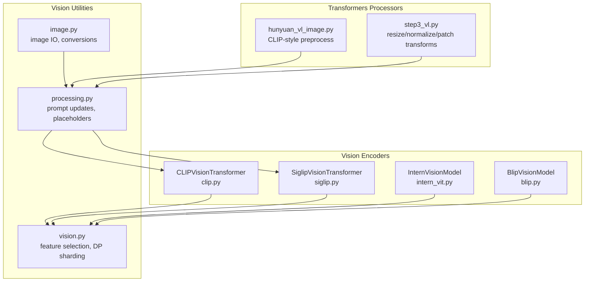
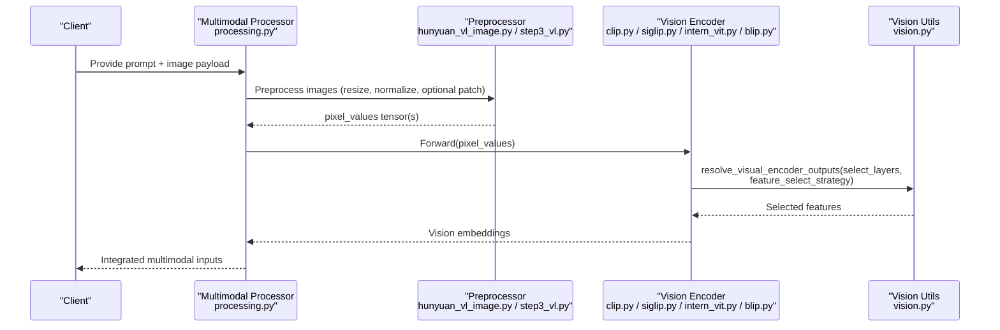
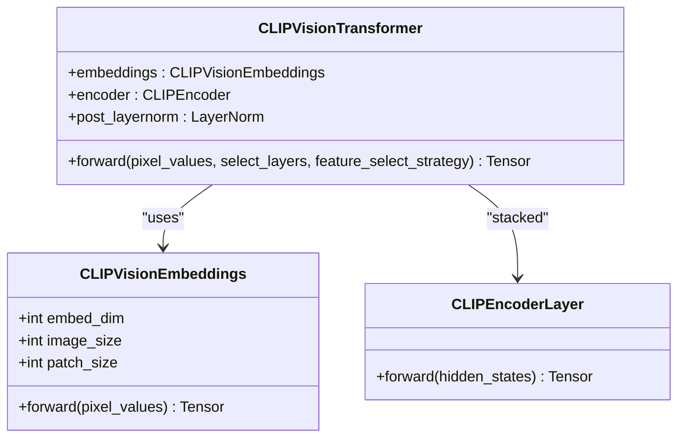
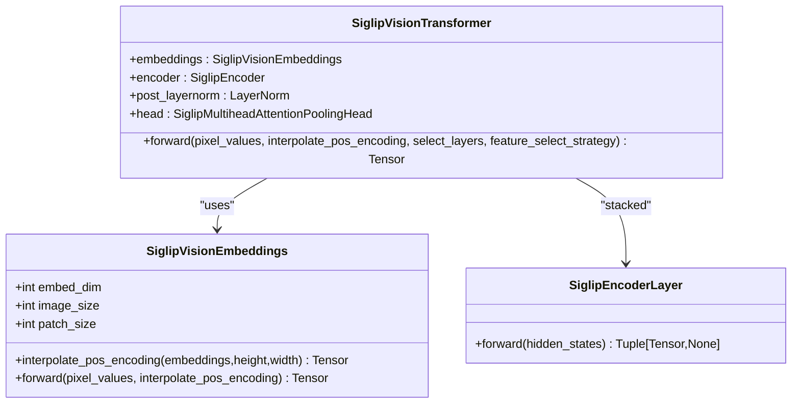
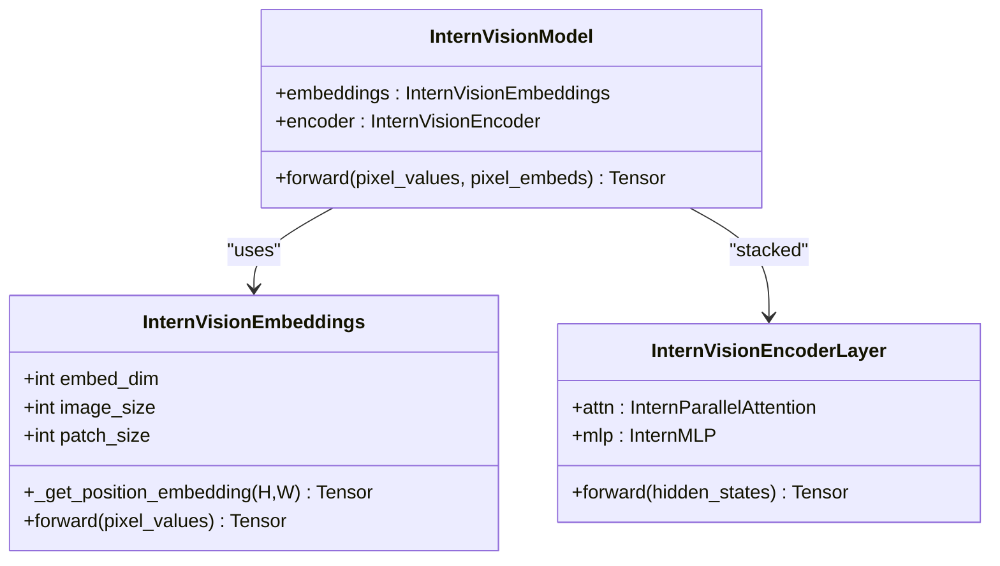
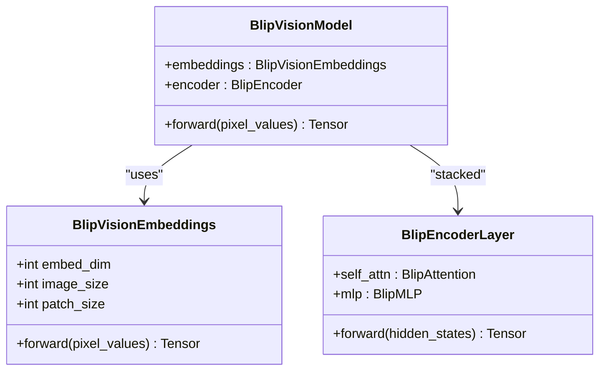
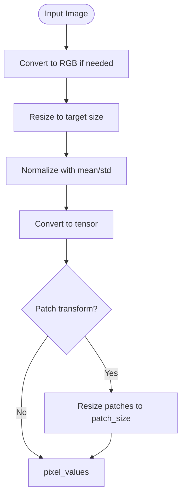
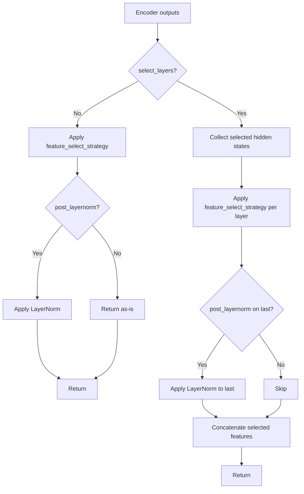
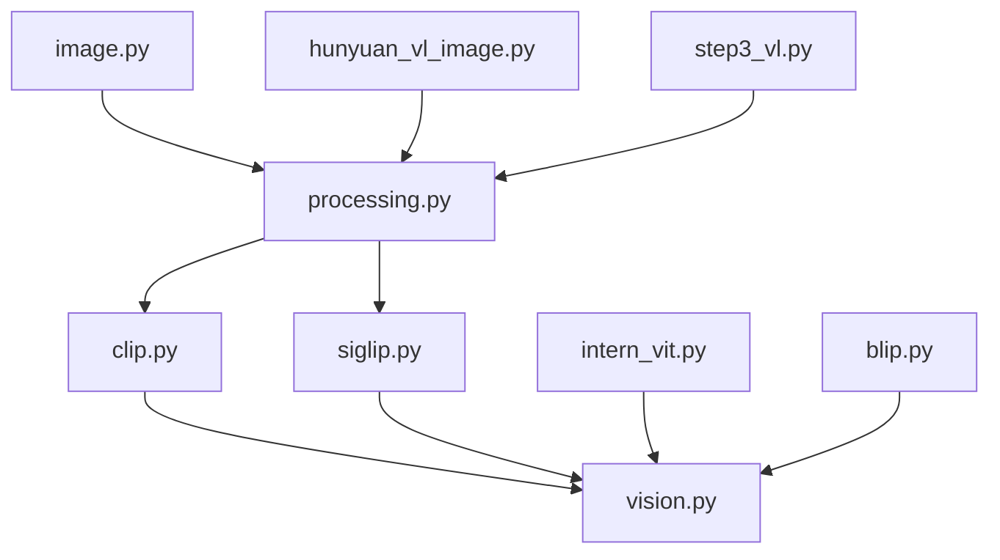

# Vision Encoders

<cite>
**Referenced Files in This Document**
- [clip.py](file://vllm/model_executor/models/clip.py)
- [siglip.py](file://vllm/model_executor/models/siglip.py)
- [intern_vit.py](file://vllm/model_executor/models/intern_vit.py)
- [blip.py](file://vllm/model_executor/models/blip.py)
- [vision.py](file://vllm/model_executor/models/vision.py)
- [processing.py](file://vllm/multimodal/processing.py)
- [image.py](file://vllm/multimodal/image.py)
- [hunyuan_vl_image.py](file://vllm/transformers_utils/processors/hunyuan_vl_image.py)
- [step3_vl.py](file://vllm/model_executor/models/step3_vl.py)
- [bagel.py](file://vllm/model_executor/models/bagel.py)
- [internvl.py](file://vllm/model_executor/models/internvl.py)
- [vision_language.py](file://examples/offline_inference/vision_language.py)
</cite>

## Table of Contents
1. [Introduction](#introduction)
2. [Project Structure](#project-structure)
3. [Core Components](#core-components)
4. [Architecture Overview](#architecture-overview)
5. [Detailed Component Analysis](#detailed-component-analysis)
6. [Dependency Analysis](#dependency-analysis)
7. [Performance Considerations](#performance-considerations)
8. [Troubleshooting Guide](#troubleshooting-guide)
9. [Conclusion](#conclusion)
10. [Appendices](#appendices)

## Introduction
This document explains standalone vision encoders in vLLM, focusing on CLIP, BLIP-2, InternViT, and SigLIP. It covers image preprocessing pipelines (resize, normalize, patch embeddings), encoder architectures optimized for classification, retrieval, and contrastive learning, memory management for batched feature extraction, and practical configuration examples for embedding generation, zero-shot classification, and image-text matching. It also describes the relationship between vision encoders and downstream tasks such as retrieval and vision-language alignment.

## Project Structure
The vision encoder implementations are primarily located under the model executor’s models directory, with shared utilities for vision feature selection and distributed sharding. Multimodal processing utilities define how images are parsed, tokenized, and integrated into prompts. Transformers processors provide standardized preprocessing for CLIP-like models.

**Diagram sources**
- [clip.py](file://vllm/model_executor/models/clip.py#L616-L775)
- [siglip.py](file://vllm/model_executor/models/siglip.py#L681-L775)
- [intern_vit.py](file://vllm/model_executor/models/intern_vit.py#L390-L455)
- [blip.py](file://vllm/model_executor/models/blip.py#L263-L351)
- [vision.py](file://vllm/model_executor/models/vision.py#L1-L250)
- [processing.py](file://vllm/multimodal/processing.py#L1-L200)
- [image.py](file://vllm/multimodal/image.py#L1-L143)
- [hunyuan_vl_image.py](file://vllm/transformers_utils/processors/hunyuan_vl_image.py#L114-L401)
- [step3_vl.py](file://vllm/model_executor/models/step3_vl.py#L105-L141)

**Section sources**
- [clip.py](file://vllm/model_executor/models/clip.py#L616-L775)
- [siglip.py](file://vllm/model_executor/models/siglip.py#L681-L775)
- [intern_vit.py](file://vllm/model_executor/models/intern_vit.py#L390-L455)
- [blip.py](file://vllm/model_executor/models/blip.py#L263-L351)
- [vision.py](file://vllm/model_executor/models/vision.py#L1-L250)
- [processing.py](file://vllm/multimodal/processing.py#L1-L200)
- [image.py](file://vllm/multimodal/image.py#L1-L143)
- [hunyuan_vl_image.py](file://vllm/transformers_utils/processors/hunyuan_vl_image.py#L114-L401)
- [step3_vl.py](file://vllm/model_executor/models/step3_vl.py#L105-L141)

## Core Components
- CLIPVisionTransformer: Implements patch embedding, class token, positional encoding, and a transformer encoder with optional post-norm and feature selection. Supports selecting layers and applying pooling strategies.
- SiglipVisionTransformer: Implements patch embedding with optional position interpolation, encoder stack, optional post-norm, and an optional multihead attention pooling head. Designed for retrieval and contrastive learning.
- InternVisionModel: Patch embedding with class token and learned position embeddings; configurable attention normalization; encoder stack with optional data-parallel sharding.
- BlipVisionModel: Patch embedding with class token and fixed-position embeddings; encoder stack with standard LN and MLP blocks.
- Vision utilities: Feature selection strategies (“class”, “default”, “full”), layer selection, and distributed sharding helpers for DP/Tensor Parallel.
- Multimodal processing: Prompt replacement with image placeholders, tokenizer integration, and tokenization options.
- Image IO and preprocessing: Image conversion, RGBA-to-RGB handling, and CLIP-style transforms (resize, normalize, patch transforms).

**Section sources**
- [clip.py](file://vllm/model_executor/models/clip.py#L616-L775)
- [siglip.py](file://vllm/model_executor/models/siglip.py#L681-L775)
- [intern_vit.py](file://vllm/model_executor/models/intern_vit.py#L390-L455)
- [blip.py](file://vllm/model_executor/models/blip.py#L263-L351)
- [vision.py](file://vllm/model_executor/models/vision.py#L100-L250)
- [processing.py](file://vllm/multimodal/processing.py#L200-L400)
- [image.py](file://vllm/multimodal/image.py#L1-L143)

## Architecture Overview
The encoders follow a common pipeline:
- Preprocessing: Resize to target square, normalize with dataset-specific mean/std, convert to tensor, and optionally resize patches independently.
- Patch embedding: Convolutional projection with kernel size equals patch size and stride equals patch size.
- Positional encoding: Learned or interpolated embeddings; CLIP/SigLIP include a class token; others use fixed or interpolated grids.
- Transformer encoder: Stacked self-attention with MLP; optional post-layer normalization; optional pooling head (SigLIP).
- Feature selection: Choose class token, default tokens (excluding class), or full token sequence; supports selecting multiple layers.

**Diagram sources**
- [processing.py](file://vllm/multimodal/processing.py#L190-L320)
- [hunyuan_vl_image.py](file://vllm/transformers_utils/processors/hunyuan_vl_image.py#L114-L401)
- [step3_vl.py](file://vllm/model_executor/models/step3_vl.py#L105-L141)
- [clip.py](file://vllm/model_executor/models/clip.py#L616-L775)
- [siglip.py](file://vllm/model_executor/models/siglip.py#L681-L775)
- [intern_vit.py](file://vllm/model_executor/models/intern_vit.py#L390-L455)
- [blip.py](file://vllm/model_executor/models/blip.py#L263-L351)
- [vision.py](file://vllm/model_executor/models/vision.py#L150-L220)

## Detailed Component Analysis

### CLIP Vision Encoder
- Embeddings: Conv2d patch embedding with class token and learned position embeddings; concatenates class token with patch tokens.
- Encoder: Stacked layers with attention and MLP; optional post-norm; supports selecting layers and feature selection strategy.
- Pooling: Default pooling type is “LAST” (CLS token), suitable for contrastive learning and retrieval.

**Diagram sources**
- [clip.py](file://vllm/model_executor/models/clip.py#L308-L480)
- [clip.py](file://vllm/model_executor/models/clip.py#L481-L696)

**Section sources**
- [clip.py](file://vllm/model_executor/models/clip.py#L308-L480)
- [clip.py](file://vllm/model_executor/models/clip.py#L616-L775)

### SigLIP Vision Encoder
- Embeddings: Conv2d patch embedding without class token; optional bicubic interpolation of position embeddings for higher resolutions.
- Encoder: Stacked layers with attention and MLP; optional post-norm; optional multihead attention pooling head.
- Pooling: Designed for retrieval; supports “CLS” and “ALL” pooling strategies via feature selection.

**Diagram sources**
- [siglip.py](file://vllm/model_executor/models/siglip.py#L280-L420)
- [siglip.py](file://vllm/model_executor/models/siglip.py#L477-L775)

**Section sources**
- [siglip.py](file://vllm/model_executor/models/siglip.py#L280-L420)
- [siglip.py](file://vllm/model_executor/models/siglip.py#L681-L775)

### InternViT Vision Encoder
- Embeddings: Conv2d patch embedding with class token and learned 2D position embeddings; supports positional interpolation for different resolutions.
- Encoder: Stacked layers with attention and MLP; optional QK normalization; supports data-parallel sharding wrapper.

**Diagram sources**
- [intern_vit.py](file://vllm/model_executor/models/intern_vit.py#L45-L140)
- [intern_vit.py](file://vllm/model_executor/models/intern_vit.py#L276-L388)
- [intern_vit.py](file://vllm/model_executor/models/intern_vit.py#L390-L455)

**Section sources**
- [intern_vit.py](file://vllm/model_executor/models/intern_vit.py#L45-L140)
- [intern_vit.py](file://vllm/model_executor/models/intern_vit.py#L276-L388)
- [intern_vit.py](file://vllm/model_executor/models/intern_vit.py#L390-L455)

### BLIP-2 Vision Encoder
- Embeddings: Conv2d patch embedding with class token and fixed-position embeddings.
- Encoder: Stacked layers with attention and MLP; standard layer norms.

**Diagram sources**
- [blip.py](file://vllm/model_executor/models/blip.py#L40-L82)
- [blip.py](file://vllm/model_executor/models/blip.py#L185-L261)
- [blip.py](file://vllm/model_executor/models/blip.py#L263-L351)

**Section sources**
- [blip.py](file://vllm/model_executor/models/blip.py#L40-L82)
- [blip.py](file://vllm/model_executor/models/blip.py#L185-L261)
- [blip.py](file://vllm/model_executor/models/blip.py#L263-L351)

### Preprocessing Pipelines
- CLIP-style normalization and resizing: Standard transforms include ToTensor, Normalize, and Resize with bicubic or bilinear interpolation.
- Patch transforms: Optional separate transform pipeline for patch-level processing.
- CLIP-compatible preprocessing: Smart resizing to multiples of patch size and merge size, normalization with dataset defaults, optional RGB conversion.

**Diagram sources**
- [step3_vl.py](file://vllm/model_executor/models/step3_vl.py#L105-L141)
- [hunyuan_vl_image.py](file://vllm/transformers_utils/processors/hunyuan_vl_image.py#L114-L401)

**Section sources**
- [step3_vl.py](file://vllm/model_executor/models/step3_vl.py#L105-L141)
- [hunyuan_vl_image.py](file://vllm/transformers_utils/processors/hunyuan_vl_image.py#L114-L401)

### Feature Selection and Pooling Strategies
- Strategies: “class” (first token), “default” (tokens after class), “full” (all tokens).
- Layer selection: Optionally return all hidden states and concatenate selected layers.
- Post-norm: Optional post-layer normalization applied to selected outputs.

**Diagram sources**
- [vision.py](file://vllm/model_executor/models/vision.py#L150-L220)

**Section sources**
- [vision.py](file://vllm/model_executor/models/vision.py#L100-L220)

### Downstream Task Alignment
- Retrieval: SigLIP and CLIP are commonly used for image-text matching and retrieval; pooling strategies and feature selection impact similarity computation.
- Contrastive Learning: CLIP’s “LAST” pooling aligns with contrastive objectives; SigLIP’s pooling head can improve retrieval performance.
- Zero-shot Classification: Feature selection (“full” or “default”) combined with a classifier head yields zero-shot accuracy; CLIP’s textual counterpart is often paired with the vision encoder.

[No sources needed since this section provides conceptual guidance]

## Dependency Analysis
The encoders share common utilities for feature selection and distributed execution. Multimodal processing integrates image placeholders into prompts and coordinates tokenization.

**Diagram sources**
- [clip.py](file://vllm/model_executor/models/clip.py#L616-L775)
- [siglip.py](file://vllm/model_executor/models/siglip.py#L681-L775)
- [intern_vit.py](file://vllm/model_executor/models/intern_vit.py#L390-L455)
- [blip.py](file://vllm/model_executor/models/blip.py#L263-L351)
- [vision.py](file://vllm/model_executor/models/vision.py#L1-L120)
- [processing.py](file://vllm/multimodal/processing.py#L190-L320)
- [image.py](file://vllm/multimodal/image.py#L1-L143)
- [hunyuan_vl_image.py](file://vllm/transformers_utils/processors/hunyuan_vl_image.py#L114-L401)
- [step3_vl.py](file://vllm/model_executor/models/step3_vl.py#L105-L141)

**Section sources**
- [clip.py](file://vllm/model_executor/models/clip.py#L616-L775)
- [siglip.py](file://vllm/model_executor/models/siglip.py#L681-L775)
- [intern_vit.py](file://vllm/model_executor/models/intern_vit.py#L390-L455)
- [blip.py](file://vllm/model_executor/models/blip.py#L263-L351)
- [vision.py](file://vllm/model_executor/models/vision.py#L1-L120)
- [processing.py](file://vllm/multimodal/processing.py#L190-L320)
- [image.py](file://vllm/multimodal/image.py#L1-L143)
- [hunyuan_vl_image.py](file://vllm/transformers_utils/processors/hunyuan_vl_image.py#L114-L401)
- [step3_vl.py](file://vllm/model_executor/models/step3_vl.py#L105-L141)

## Performance Considerations
- Memory Management:
  - Data-parallel sharding for large batches: The DP sharding helper splits inputs across tensor-parallel ranks and gathers outputs to reconstruct the full batch.
  - MRoPE vision sharding: Balances load by patch counts across ranks and reconstructs per-image embeddings in original order.
- Attention Backends: Platform-specific backend selection for ViT attention can improve throughput.
- Feature Selection: Selecting fewer tokens (e.g., “class”) reduces memory footprint; “full” increases compute and memory.
- Post-Norm: Skipping post-norm conserves memory when encoder depth is small.

**Section sources**
- [vision.py](file://vllm/model_executor/models/vision.py#L220-L547)

## Troubleshooting Guide
- Image Mode Issues: Ensure RGBA images are converted to RGB before preprocessing; use the provided conversion utilities.
- Prompt/Image Mismatch: When using multimodal processors, confirm that placeholders are correctly inserted or replaced; tokenization should exclude special tokens when needed.
- OOM on Large Images: Reduce max_model_len, limit images per prompt, or use smaller patch sizes; leverage DP sharding for multi-GPU setups.
- Position Interpolation: For SigLIP, enable position interpolation when resizing beyond training resolution to maintain spatial alignment.

**Section sources**
- [image.py](file://vllm/multimodal/image.py#L1-L143)
- [processing.py](file://vllm/multimodal/processing.py#L190-L320)
- [siglip.py](file://vllm/model_executor/models/siglip.py#L307-L373)
- [vision.py](file://vllm/model_executor/models/vision.py#L220-L547)

## Conclusion
vLLM provides robust, modular vision encoders tailored for retrieval and contrastive learning. CLIP and SigLIP offer strong baselines for image-text alignment, while InternViT and BLIP-2 provide complementary architectures. The preprocessing pipeline ensures consistent normalization and resizing, and the vision utilities enable efficient memory management and flexible feature selection. Together, these components support practical applications in embedding generation, zero-shot classification, and retrieval.

## Appendices

### Practical Configuration Examples
- Embedding Generation:
  - Use CLIP or SigLIP with “ALL” or “FULL” feature selection to produce dense image embeddings for similarity search.
  - Reference: [clip.py](file://vllm/model_executor/models/clip.py#L616-L775), [siglip.py](file://vllm/model_executor/models/siglip.py#L681-L775)
- Zero-Shot Classification:
  - Select “FULL” features and combine with a learnable classifier head; align with CLIP text encoder for zero-shot prompts.
  - Reference: [clip.py](file://vllm/model_executor/models/clip.py#L538-L615)
- Image-Text Matching:
  - Use CLIP’s “LAST” pooling or SigLIP’s pooling head; normalize embeddings and compute cosine similarity.
  - References: [clip.py](file://vllm/model_executor/models/clip.py#L778-L784), [siglip.py](file://vllm/model_executor/models/siglip.py#L643-L740)
- Downstream Integration:
  - Configure multimodal placeholders and tokenization; ensure mm_processor_kwargs align with model expectations.
  - References: [processing.py](file://vllm/multimodal/processing.py#L190-L320), [vision_language.py](file://examples/offline_inference/vision_language.py#L1-L200)

**Section sources**
- [clip.py](file://vllm/model_executor/models/clip.py#L538-L775)
- [siglip.py](file://vllm/model_executor/models/siglip.py#L643-L775)
- [processing.py](file://vllm/multimodal/processing.py#L190-L320)
- [vision_language.py](file://examples/offline_inference/vision_language.py#L1-L200)