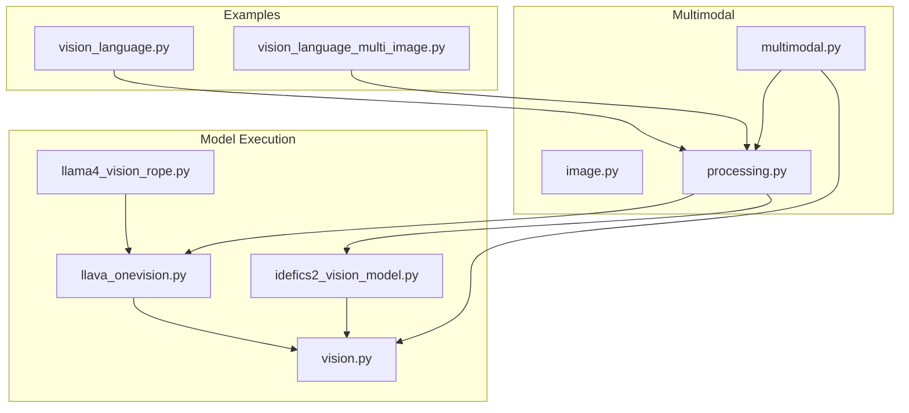
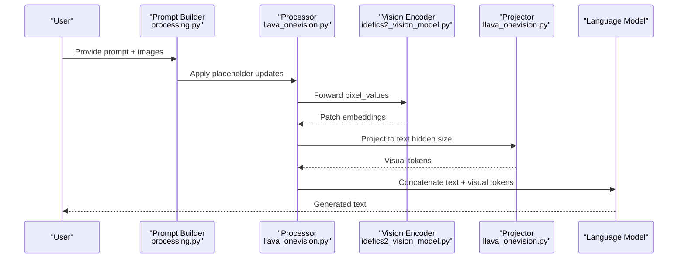
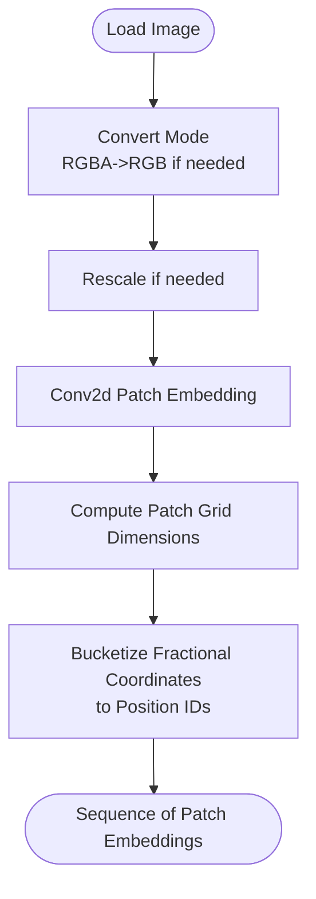
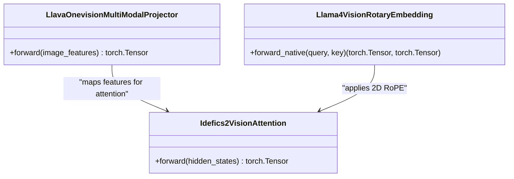
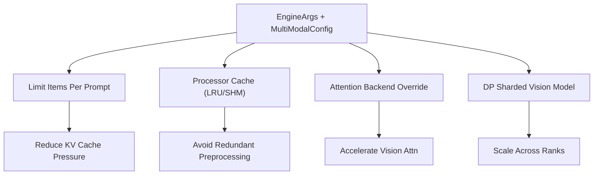
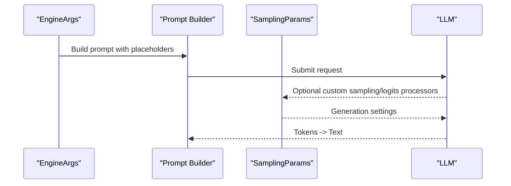
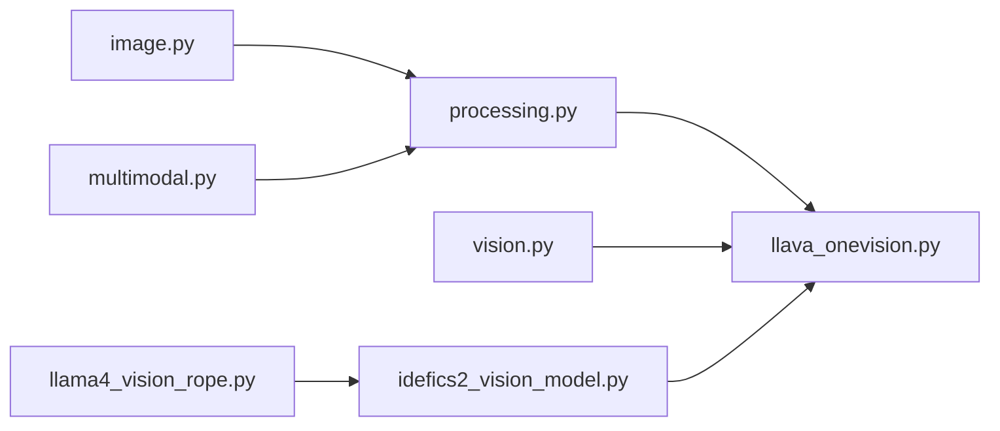

# Vision-Language Models

<cite>
**Referenced Files in This Document**
- [vision_language.py](file://examples/offline_inference/vision_language.py)
- [vision_language_multi_image.py](file://examples/offline_inference/vision_language_multi_image.py)
- [image.py](file://vllm/multimodal/image.py)
- [processing.py](file://vllm/multimodal/processing.py)
- [multimodal.py](file://vllm/config/multimodal.py)
- [vision.py](file://vllm/model_executor/models/vision.py)
- [llava_onevision.py](file://vllm/model_executor/models/llava_onevision.py)
- [idefics2_vision_model.py](file://vllm/model_executor/models/idefics2_vision_model.py)
- [llama4_vision_rope.py](file://vllm/model_executor/layers/rotary_embedding/llama4_vision_rope.py)
</cite>

## Table of Contents
1. [Introduction](#introduction)
2. [Project Structure](#project-structure)
3. [Core Components](#core-components)
4. [Architecture Overview](#architecture-overview)
5. [Detailed Component Analysis](#detailed-component-analysis)
6. [Dependency Analysis](#dependency-analysis)
7. [Performance Considerations](#performance-considerations)
8. [Troubleshooting Guide](#troubleshooting-guide)
9. [Conclusion](#conclusion)
10. [Appendices](#appendices)

## Introduction
This document explains how vLLM integrates vision-language models (VLMs) with a focus on unified architectures such as LLaVA, Qwen-VL, Phi-3V, and Pixtral. It covers the end-to-end pipeline from image preprocessing (normalization, patch embedding, positional encoding) to cross-modal attention fusion and memory management for heterogeneous inputs. Practical guidance is provided for configuring VLMs, handling multiple image resolutions, and optimizing performance for mixed modalities.

## Project Structure
The VLM capabilities in vLLM span several subsystems:
- Examples for offline inference demonstrate prompt formatting and multi-image scenarios.
- Multimodal utilities handle image I/O, preprocessing, and prompt updates.
- Model-level components implement vision encoders, positional encodings, and projector layers.
- Configuration controls memory limits, processor caching, and attention backends.

**Diagram sources**
- [vision_language.py](file://examples/offline_inference/vision_language.py#L1-L200)
- [vision_language_multi_image.py](file://examples/offline_inference/vision_language_multi_image.py#L1-L200)
- [image.py](file://vllm/multimodal/image.py#L1-L143)
- [processing.py](file://vllm/multimodal/processing.py#L1-L200)
- [multimodal.py](file://vllm/config/multimodal.py#L1-L120)
- [vision.py](file://vllm/model_executor/models/vision.py#L1-L120)
- [llava_onevision.py](file://vllm/model_executor/models/llava_onevision.py#L1-L120)
- [idefics2_vision_model.py](file://vllm/model_executor/models/idefics2_vision_model.py#L1-L120)
- [llama4_vision_rope.py](file://vllm/model_executor/layers/rotary_embedding/llama4_vision_rope.py#L1-L81)

**Section sources**
- [vision_language.py](file://examples/offline_inference/vision_language.py#L1-L200)
- [vision_language_multi_image.py](file://examples/offline_inference/vision_language_multi_image.py#L1-L200)
- [image.py](file://vllm/multimodal/image.py#L1-L143)
- [processing.py](file://vllm/multimodal/processing.py#L1-L200)
- [multimodal.py](file://vllm/config/multimodal.py#L1-L120)
- [vision.py](file://vllm/model_executor/models/vision.py#L1-L120)
- [llava_onevision.py](file://vllm/model_executor/models/llava_onevision.py#L1-L120)
- [idefics2_vision_model.py](file://vllm/model_executor/models/idefics2_vision_model.py#L1-L120)
- [llama4_vision_rope.py](file://vllm/model_executor/layers/rotary_embedding/llama4_vision_rope.py#L1-L81)

## Core Components
- Image I/O and preprocessing:
  - ImageMediaIO supports loading images from bytes/base64/files, with optional RGBA-to-RGB conversion and background color control.
  - Utility functions rescale images and convert modes safely.
- Prompt processing and placeholder insertion/replacement:
  - PromptInsertion and PromptReplacement define how placeholders for image tokens are inserted or replaced in prompts.
  - Utilities locate matches and replace/insert token sequences efficiently.
- Vision-language configuration:
  - MultiModalConfig controls per-prompt limits, processor kwargs, processor cache, encoder attention backend, and encoder tensor-parallel sharding mode.
- Vision encoder abstractions and utilities:
  - VisionEncoderInfo and related helpers compute token grids, patch sizes, and feature selection strategies.
  - Data-parallel sharding utilities distribute image processing across tensor-parallel ranks.
- Model-specific implementations:
  - LLaVA OneVision demonstrates patch merging, newline token insertion, and projector-based fusion.
  - Idefics2 adapts SigLIP-style embeddings for variable resolutions and uses unified multi-modal attention.
  - Llama4 Vision RoPE computes 2D frequency grids for patch positions.

**Section sources**
- [image.py](file://vllm/multimodal/image.py#L1-L143)
- [processing.py](file://vllm/multimodal/processing.py#L285-L760)
- [multimodal.py](file://vllm/config/multimodal.py#L53-L144)
- [vision.py](file://vllm/model_executor/models/vision.py#L28-L120)
- [llava_onevision.py](file://vllm/model_executor/models/llava_onevision.py#L453-L800)
- [idefics2_vision_model.py](file://vllm/model_executor/models/idefics2_vision_model.py#L45-L120)
- [llama4_vision_rope.py](file://vllm/model_executor/layers/rotary_embedding/llama4_vision_rope.py#L1-L81)

## Architecture Overview
The unified VLM architecture in vLLM comprises:
- Prompt preprocessing: Placeholders for images are inserted or replaced according to model-specific templates.
- Vision encoder: Converts pixel patches into feature embeddings with patch embedding and positional encoding.
- Cross-modal fusion: Projector maps visual features to language model hidden size; newline tokens separate images when needed.
- Language decoder: Generates text conditioned on both textual and visual tokens.

**Diagram sources**
- [processing.py](file://vllm/multimodal/processing.py#L346-L520)
- [llava_onevision.py](file://vllm/model_executor/models/llava_onevision.py#L453-L800)
- [idefics2_vision_model.py](file://vllm/model_executor/models/idefics2_vision_model.py#L325-L428)

## Detailed Component Analysis

### Image Preprocessing Pipeline
- Pixel normalization and mode conversion:
  - Images are loaded from bytes/base64/files and converted to desired mode (e.g., RGB), with optional RGBA background fill.
- Patch embedding:
  - Idefics2-style embeddings flatten convolved patches into a sequence of tokens aligned with patch grids.
- Positional encoding:
  - Variable-resolution positional IDs are computed from fractional coordinates and bucketized to patch grid positions.

**Diagram sources**
- [image.py](file://vllm/multimodal/image.py#L1-L118)
- [idefics2_vision_model.py](file://vllm/model_executor/models/idefics2_vision_model.py#L45-L118)

**Section sources**
- [image.py](file://vllm/multimodal/image.py#L1-L118)
- [idefics2_vision_model.py](file://vllm/model_executor/models/idefics2_vision_model.py#L45-L118)

### Cross-Modal Attention and Fusion
- Projector-based fusion:
  - LLaVA OneVision uses a two-layer MLP projector to map vision features to language model hidden size.
- Attention in vision encoders:
  - Unified MMEncoderAttention is used for multi-modal encoder attention with Flash Attention support.
- Positional encoding for patches:
  - Llama4 Vision RoPE constructs 2D frequency grids from patch indices to support spatial RoPE in vision transformers.

**Diagram sources**
- [llava_onevision.py](file://vllm/model_executor/models/llava_onevision.py#L453-L474)
- [idefics2_vision_model.py](file://vllm/model_executor/models/idefics2_vision_model.py#L121-L182)
- [llama4_vision_rope.py](file://vllm/model_executor/layers/rotary_embedding/llama4_vision_rope.py#L1-L81)

**Section sources**
- [llava_onevision.py](file://vllm/model_executor/models/llava_onevision.py#L453-L474)
- [idefics2_vision_model.py](file://vllm/model_executor/models/idefics2_vision_model.py#L121-L182)
- [llama4_vision_rope.py](file://vllm/model_executor/layers/rotary_embedding/llama4_vision_rope.py#L1-L81)

### Memory Management for Image Inputs
- Per-prompt limits:
  - MultiModalConfig enforces maximum numbers of images/videos per prompt to avoid OOM.
- Processor cache:
  - Processor cache avoids reprocessing identical multimodal inputs; cache type and size are configurable.
- Attention backend override:
  - Optional override for vision transformer attention backends to improve performance.
- Data-parallel sharding:
  - Vision encoder outputs can be sharded across tensor-parallel ranks to balance load and reduce memory pressure.

**Diagram sources**
- [multimodal.py](file://vllm/config/multimodal.py#L53-L144)
- [vision.py](file://vllm/model_executor/models/vision.py#L220-L320)

**Section sources**
- [multimodal.py](file://vllm/config/multimodal.py#L53-L144)
- [vision.py](file://vllm/model_executor/models/vision.py#L220-L320)

### Practical Configuration and Usage
- Single-image generation:
  - Examples show how to construct prompts with model-specific placeholders and configure engine arguments (e.g., max_model_len, dtype, mm_processor_kwargs).
- Multi-image generation:
  - Examples demonstrate building chat-like prompts with multiple images and applying model-specific processors.
- Feature selection strategies:
  - Vision feature selection strategies (class, default, full) are supported to tailor how many tokens are retained per image.

**Diagram sources**
- [vision_language.py](file://examples/offline_inference/vision_language.py#L1-L200)
- [vision_language_multi_image.py](file://examples/offline_inference/vision_language_multi_image.py#L1-L200)
- [vision.py](file://vllm/model_executor/models/vision.py#L110-L149)

**Section sources**
- [vision_language.py](file://examples/offline_inference/vision_language.py#L1-L200)
- [vision_language_multi_image.py](file://examples/offline_inference/vision_language_multi_image.py#L1-L200)
- [vision.py](file://vllm/model_executor/models/vision.py#L110-L149)

## Dependency Analysis
- Prompt processing depends on tokenizer and model-specific placeholders.
- LLaVA OneVision links:
  - Prompt updates -> vision encoder -> projector -> language model.
- Idefics2 vision model:
  - Embeddings -> encoder layers -> post-norm -> attention layers.
- RoPE integration:
  - Llama4 Vision RoPE feeds 2D frequencies into attention for spatial alignment.

**Diagram sources**
- [processing.py](file://vllm/multimodal/processing.py#L1-L120)
- [llava_onevision.py](file://vllm/model_executor/models/llava_onevision.py#L1-L120)
- [image.py](file://vllm/multimodal/image.py#L1-L60)
- [multimodal.py](file://vllm/config/multimodal.py#L1-L80)
- [vision.py](file://vllm/model_executor/models/vision.py#L1-L80)
- [idefics2_vision_model.py](file://vllm/model_executor/models/idefics2_vision_model.py#L1-L80)
- [llama4_vision_rope.py](file://vllm/model_executor/layers/rotary_embedding/llama4_vision_rope.py#L1-L40)

**Section sources**
- [processing.py](file://vllm/multimodal/processing.py#L1-L120)
- [llava_onevision.py](file://vllm/model_executor/models/llava_onevision.py#L1-L120)
- [image.py](file://vllm/multimodal/image.py#L1-L60)
- [multimodal.py](file://vllm/config/multimodal.py#L1-L80)
- [vision.py](file://vllm/model_executor/models/vision.py#L1-L80)
- [idefics2_vision_model.py](file://vllm/model_executor/models/idefics2_vision_model.py#L1-L80)
- [llama4_vision_rope.py](file://vllm/model_executor/layers/rotary_embedding/llama4_vision_rope.py#L1-L40)

## Performance Considerations
- Prefer efficient attention backends for vision transformers when supported.
- Use processor cache to avoid repeated preprocessing of identical inputs.
- Limit per-prompt multimodal counts to manage KV cache growth.
- For variable-resolution inputs, leverage embeddings with adaptive positional encoding (e.g., bucketized patch positions).
- Consider data-parallel sharding for large batches to balance memory and throughput.

[No sources needed since this section provides general guidance]

## Troubleshooting Guide
- Incorrect image mode or missing background:
  - Ensure RGBA images are converted to RGB with a proper background color; otherwise artifacts may occur.
- Placeholder mismatch:
  - Verify that placeholder counts align with computed image token counts; mismatches cause tokenization errors.
- OOM with many images:
  - Reduce max_model_len, enable processor cache, or lower per-prompt multimodal limits.
- RoPE misalignment:
  - Confirm that patch grid dimensions and RoPE frequencies match the vision encoder’s expectations.

**Section sources**
- [image.py](file://vllm/multimodal/image.py#L1-L118)
- [processing.py](file://vllm/multimodal/processing.py#L520-L800)
- [multimodal.py](file://vllm/config/multimodal.py#L53-L120)
- [llama4_vision_rope.py](file://vllm/model_executor/layers/rotary_embedding/llama4_vision_rope.py#L1-L81)

## Conclusion
vLLM’s VLM stack integrates vision and language modalities through robust preprocessing, flexible prompt templating, and efficient vision encoders with cross-modal projection. By tuning configuration knobs—such as per-prompt limits, processor caching, attention backends, and data-parallel sharding—users can achieve scalable, high-performance mixed-modal inference across diverse architectures and input resolutions.

[No sources needed since this section summarizes without analyzing specific files]

## Appendices
- Example prompts and configurations for popular VLMs are demonstrated in the offline inference examples.

**Section sources**
- [vision_language.py](file://examples/offline_inference/vision_language.py#L1-L200)
- [vision_language_multi_image.py](file://examples/offline_inference/vision_language_multi_image.py#L1-L200)