# Decoder-Only Transformers

<cite>
**Referenced Files in This Document**
- [falcon.py](file://vllm/model_executor/models/falcon.py)
- [bloom.py](file://vllm/model_executor/models/bloom.py)
- [opt.py](file://vllm/model_executor/models/opt.py)
- [gpt2.py](file://vllm/model_executor/models/gpt2.py)
- [gpt_neox.py](file://vllm/model_executor/models/gpt_neox.py)
- [gpt_j.py](file://vllm/model_executor/models/gpt_j.py)
- [layernorm.py](file://vllm/model_executor/layers/layernorm.py)
- [base.py](file://vllm/model_executor/layers/rotary_embedding/base.py)
- [linear_scaling_rope.py](file://vllm/model_executor/layers/rotary_embedding/linear_scaling_rope.py)
- [torch_bindings.cpp](file://csrc/torch_bindings.cpp)
- [paged_attention_v2.cu](file://csrc/attention/paged_attention_v2.cu)
- [cpu_attn.py](file://vllm/v1/attention/backends/cpu_attn.py)
- [rocm_attn.py](file://vllm/v1/attention/backends/rocm_attn.py)
- [test_attention.py](file://tests/kernels/attention/test_attention.py)
- [test_prefix_prefill.py](file://tests/kernels/attention/test_prefix_prefill.py)
- [supported_models.md](file://docs/models/supported_models.md)
- [registry.py](file://vllm/transformers_utils/chat_templates/registry.py)
- [template_falcon_180b.jinja](file://examples/template_falcon_180b.jinja)
- [parameter.py](file://vllm/model_executor/parameter.py)
- [model_executor/utils.py](file://vllm/model_executor/utils.py)
</cite>

## Table of Contents
1. [Introduction](#introduction)
2. [Project Structure](#project-structure)
3. [Core Components](#core-components)
4. [Architecture Overview](#architecture-overview)
5. [Detailed Component Analysis](#detailed-component-analysis)
6. [Dependency Analysis](#dependency-analysis)
7. [Performance Considerations](#performance-considerations)
8. [Troubleshooting Guide](#troubleshooting-guide)
9. [Conclusion](#conclusion)
10. [Appendices](#appendices)

## Introduction
This document explains decoder-only transformer models in vLLM with a focus on autoregressive architectures such as Falcon, BLOOM, GPT-2, OPT, GPT-NeoX, GPT-J, and GPT-Neo. It covers attention mechanism variants (ALiBi vs causal masking), activation functions (ReLU vs GELU), normalization techniques (LayerNorm vs RMSNorm), and positional encodings (absolute vs rotary). It also documents model-specific optimizations (attention bias in OPT, parallel attention layers in BLOOM, multi-query attention in Falcon), parameter sharing strategies, and performance characteristics. Finally, it details how vLLM implements PagedAttention, KV cache management, and memory optimization, along with hardware-specific considerations and tuning tips.

## Project Structure
The decoder-only stack in vLLM is organized around:
- Model implementations for each architecture family
- Attention layers and backends
- Positional encodings and normalization layers
- KV cache and PagedAttention kernels
- Utilities for parameter sharing and weight loading

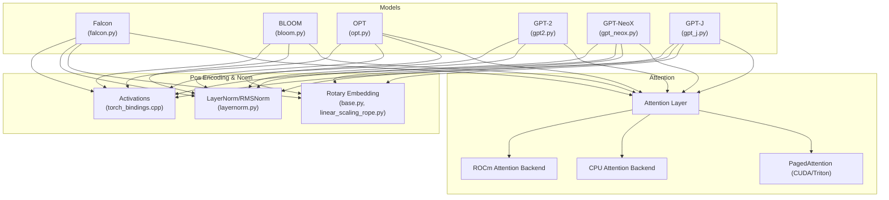

**Diagram sources**
- [falcon.py](file://vllm/model_executor/models/falcon.py#L94-L200)
- [bloom.py](file://vllm/model_executor/models/bloom.py#L87-L150)
- [opt.py](file://vllm/model_executor/models/opt.py#L73-L125)
- [gpt2.py](file://vllm/model_executor/models/gpt2.py#L63-L113)
- [gpt_neox.py](file://vllm/model_executor/models/gpt_neox.py#L59-L119)
- [gpt_j.py](file://vllm/model_executor/models/gpt_j.py#L62-L127)
- [layernorm.py](file://vllm/model_executor/layers/layernorm.py#L379-L442)
- [base.py](file://vllm/model_executor/layers/rotary_embedding/base.py#L113-L154)
- [linear_scaling_rope.py](file://vllm/model_executor/layers/rotary_embedding/linear_scaling_rope.py#L28-L58)
- [torch_bindings.cpp](file://csrc/torch_bindings.cpp#L126-L163)
- [paged_attention_v2.cu](file://csrc/attention/paged_attention_v2.cu#L43-L67)
- [cpu_attn.py](file://vllm/v1/attention/backends/cpu_attn.py#L429-L457)
- [rocm_attn.py](file://vllm/v1/attention/backends/rocm_attn.py#L307-L338)

**Section sources**
- [falcon.py](file://vllm/model_executor/models/falcon.py#L94-L200)
- [bloom.py](file://vllm/model_executor/models/bloom.py#L87-L150)
- [opt.py](file://vllm/model_executor/models/opt.py#L73-L125)
- [gpt2.py](file://vllm/model_executor/models/gpt2.py#L63-L113)
- [gpt_neox.py](file://vllm/model_executor/models/gpt_neox.py#L59-L119)
- [gpt_j.py](file://vllm/model_executor/models/gpt_j.py#L62-L127)
- [layernorm.py](file://vllm/model_executor/layers/layernorm.py#L379-L442)
- [base.py](file://vllm/model_executor/layers/rotary_embedding/base.py#L113-L154)
- [linear_scaling_rope.py](file://vllm/model_executor/layers/rotary_embedding/linear_scaling_rope.py#L28-L58)
- [torch_bindings.cpp](file://csrc/torch_bindings.cpp#L126-L163)
- [paged_attention_v2.cu](file://csrc/attention/paged_attention_v2.cu#L43-L67)
- [cpu_attn.py](file://vllm/v1/attention/backends/cpu_attn.py#L429-L457)
- [rocm_attn.py](file://vllm/v1/attention/backends/rocm_attn.py#L307-L338)

## Core Components
- Attention backends and ALiBi/rotary support:
  - ALiBi slopes computed per-head and sliced by tensor-parallel rank
  - Rotary embeddings with configurable styles and partial rotary factors
- Normalization:
  - LayerNorm and RMSNorm with fused CUDA kernels
- Activations:
  - GELU variants and SwiGLU-like ops exposed via custom bindings
- KV caching and PagedAttention:
  - CUDA/Triton kernels with optional ALiBi and FP8 KV cache dtypes
- Model families:
  - Falcon (ALiBi or rotary), BLOOM (ALiBi), OPT (causal masking with bias), GPT-2 (LayerNorm), GPT-NeoX/GPT-J (rotary), GPT-Neo (family-specific MLP/activation)

**Section sources**
- [falcon.py](file://vllm/model_executor/models/falcon.py#L71-L92)
- [bloom.py](file://vllm/model_executor/models/bloom.py#L63-L85)
- [base.py](file://vllm/model_executor/layers/rotary_embedding/base.py#L113-L154)
- [linear_scaling_rope.py](file://vllm/model_executor/layers/rotary_embedding/linear_scaling_rope.py#L28-L58)
- [layernorm.py](file://vllm/model_executor/layers/layernorm.py#L379-L442)
- [torch_bindings.cpp](file://csrc/torch_bindings.cpp#L126-L163)
- [paged_attention_v2.cu](file://csrc/attention/paged_attention_v2.cu#L43-L67)

## Architecture Overview
The decoder-only pipeline composes model-specific attention and MLP blocks with shared normalization and activation layers. Attention backends support ALiBi slopes and rotary embeddings, while KV caching is managed via PagedAttention with hardware-specific kernels.

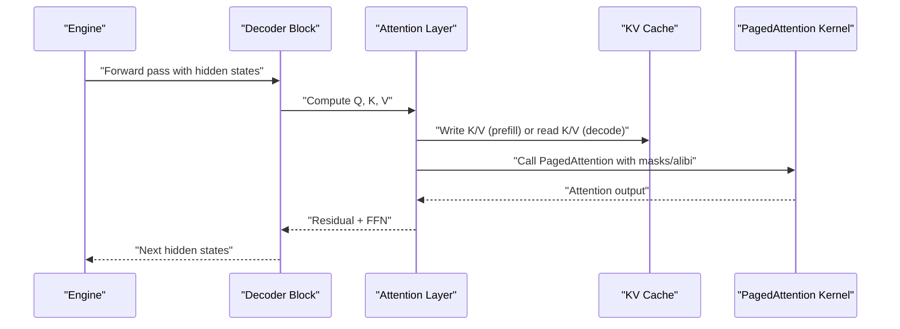

**Diagram sources**
- [falcon.py](file://vllm/model_executor/models/falcon.py#L160-L200)
- [bloom.py](file://vllm/model_executor/models/bloom.py#L121-L138)
- [gpt_neox.py](file://vllm/model_executor/models/gpt_neox.py#L92-L119)
- [gpt_j.py](file://vllm/model_executor/models/gpt_j.py#L91-L127)
- [opt.py](file://vllm/model_executor/models/opt.py#L116-L125)
- [gpt2.py](file://vllm/model_executor/models/gpt2.py#L160-L182)
- [paged_attention_v2.cu](file://csrc/attention/paged_attention_v2.cu#L43-L67)

## Detailed Component Analysis

### Falcon
- Attention mechanism:
  - Supports ALiBi or rotary embeddings; ALiBi slopes are computed and sliced per TP rank
  - Multi-query attention via config flags; QKV fused projection with optional bias
- Optimizations:
  - Parallel attention path controlled by architecture flags
  - Optional row reduction behavior for dense projection
- Positional encoding:
  - Rotary embedding support with configurable parameters

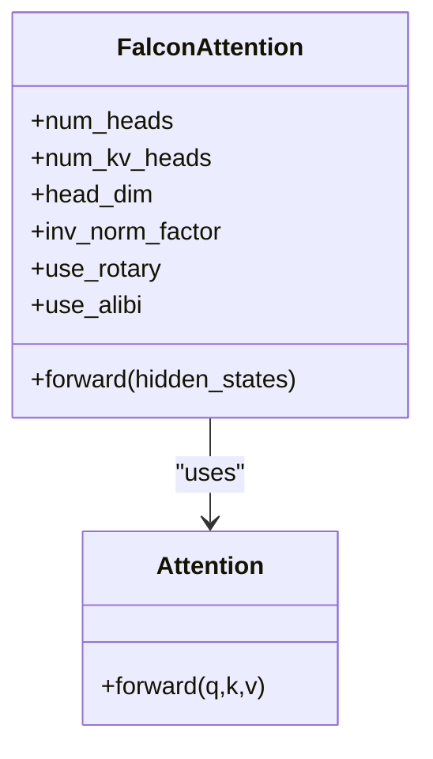

**Diagram sources**
- [falcon.py](file://vllm/model_executor/models/falcon.py#L94-L200)

**Section sources**
- [falcon.py](file://vllm/model_executor/models/falcon.py#L71-L92)
- [falcon.py](file://vllm/model_executor/models/falcon.py#L160-L200)

### BLOOM
- Attention mechanism:
  - ALiBi slopes computed centrally and sliced per TP rank
  - QKV fused projection and dense projection with bias
- Optimizations:
  - Parallel attention across layers via fused projections
- Normalization:
  - LayerNorm with epsilon configured by model config

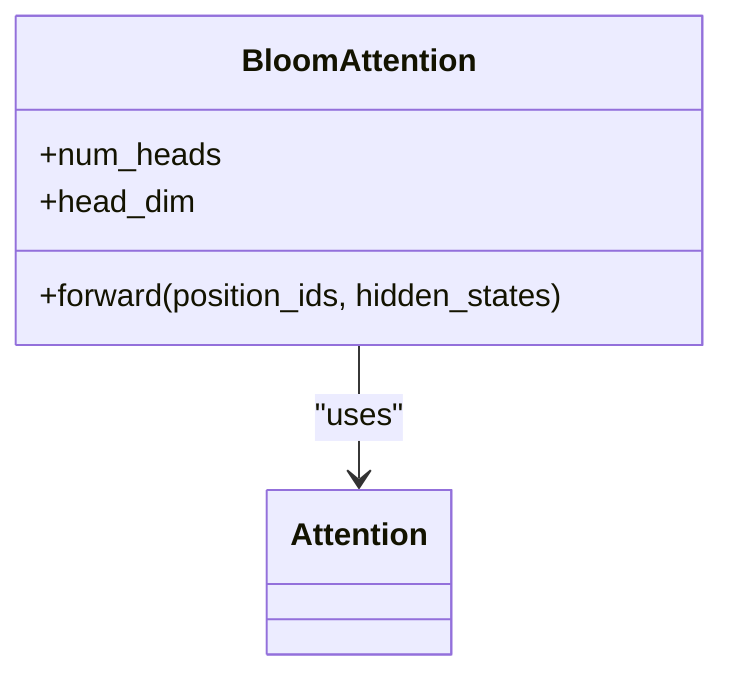

**Diagram sources**
- [bloom.py](file://vllm/model_executor/models/bloom.py#L87-L150)

**Section sources**
- [bloom.py](file://vllm/model_executor/models/bloom.py#L63-L85)
- [bloom.py](file://vllm/model_executor/models/bloom.py#L121-L138)

### OPT
- Attention mechanism:
  - QKV fused projection with optional bias; causal masking via Attention backend
- Normalization:
  - LayerNorm with optional elementwise affine parameters
- MLP:
  - Column and row parallel linear layers with configurable activation function

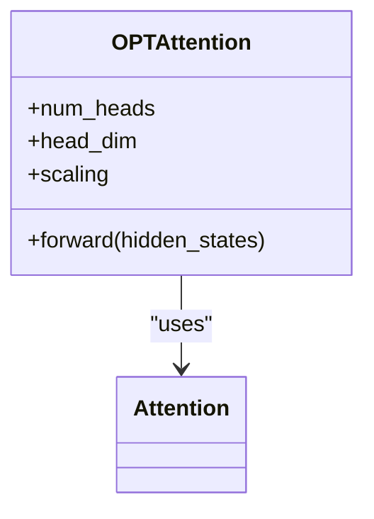

**Diagram sources**
- [opt.py](file://vllm/model_executor/models/opt.py#L73-L125)

**Section sources**
- [opt.py](file://vllm/model_executor/models/opt.py#L127-L198)

### GPT-2
- Normalization:
  - LayerNorm applied before attention and feed-forward
- MLP:
  - Column and row parallel linear layers with activation selection
- Attention:
  - QKV fused projection and dense projection

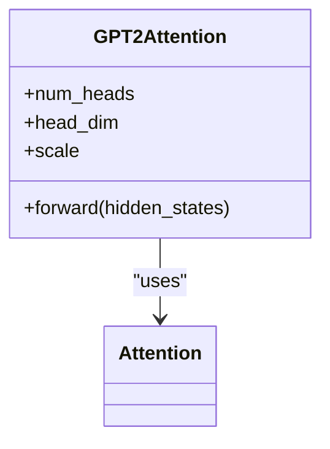

**Diagram sources**
- [gpt2.py](file://vllm/model_executor/models/gpt2.py#L63-L113)

**Section sources**
- [gpt2.py](file://vllm/model_executor/models/gpt2.py#L148-L183)

### GPT-NeoX
- Positional encoding:
  - Rotary embeddings with configurable partial rotary factor and Neox-style rotation
- Attention:
  - QKV fused projection with optional bias and dense projection
- MLP:
  - Intermediate and output linear layers with activation selection

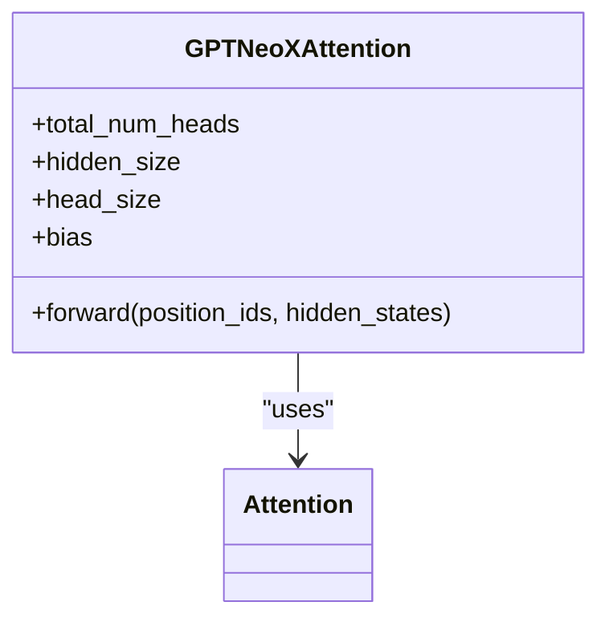

**Diagram sources**
- [gpt_neox.py](file://vllm/model_executor/models/gpt_neox.py#L59-L119)

**Section sources**
- [gpt_neox.py](file://vllm/model_executor/models/gpt_neox.py#L150-L197)

### GPT-J
- Positional encoding:
  - Rotary embeddings with non-Neox style and partial rotary factor
- Attention:
  - QKV fused projection and output projection (no bias)
- MLP:
  - Intermediate and output linear layers with activation selection

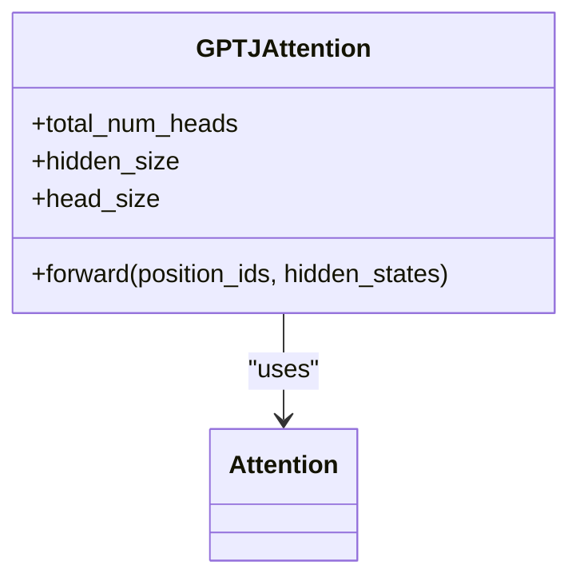

**Diagram sources**
- [gpt_j.py](file://vllm/model_executor/models/gpt_j.py#L62-L127)

**Section sources**
- [gpt_j.py](file://vllm/model_executor/models/gpt_j.py#L160-L190)

### Attention Mechanisms: ALiBi vs Causal Masking
- ALiBi:
  - Slopes computed per total heads and sliced per TP rank
  - Used in Falcon (when enabled) and BLOOM
- Causal masking:
  - Used in OPT and GPT-2 via Attention backend

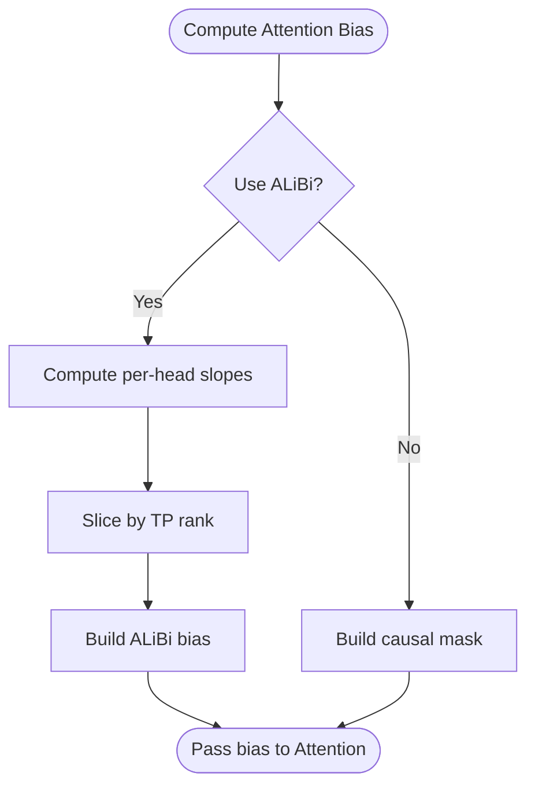

**Diagram sources**
- [falcon.py](file://vllm/model_executor/models/falcon.py#L71-L92)
- [bloom.py](file://vllm/model_executor/models/bloom.py#L63-L85)
- [cpu_attn.py](file://vllm/v1/attention/backends/cpu_attn.py#L429-L457)

**Section sources**
- [falcon.py](file://vllm/model_executor/models/falcon.py#L181-L198)
- [bloom.py](file://vllm/model_executor/models/bloom.py#L121-L138)
- [cpu_attn.py](file://vllm/v1/attention/backends/cpu_attn.py#L429-L457)

### Positional Encodings: Absolute vs Rotary
- Absolute:
  - Not used in the examined decoder-only families in this repository snapshot
- Rotary:
  - Implemented via base rotary embedding with configurable Neox-style flag
  - Linear scaling variant supports multiple scaling factors for LoRA batching

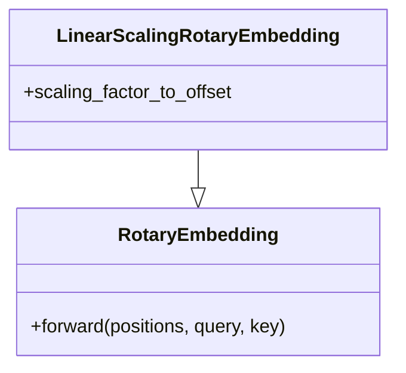

**Diagram sources**
- [base.py](file://vllm/model_executor/layers/rotary_embedding/base.py#L113-L154)
- [linear_scaling_rope.py](file://vllm/model_executor/layers/rotary_embedding/linear_scaling_rope.py#L28-L58)

**Section sources**
- [gpt_neox.py](file://vllm/model_executor/models/gpt_neox.py#L92-L106)
- [gpt_j.py](file://vllm/model_executor/models/gpt_j.py#L91-L106)
- [base.py](file://vllm/model_executor/layers/rotary_embedding/base.py#L113-L154)
- [linear_scaling_rope.py](file://vllm/model_executor/layers/rotary_embedding/linear_scaling_rope.py#L28-L58)

### Normalization: LayerNorm vs RMSNorm
- LayerNorm:
  - Standard normalization with learnable weight/bias
- RMSNorm:
  - Root mean square normalization with optional gating and fused CUDA kernels

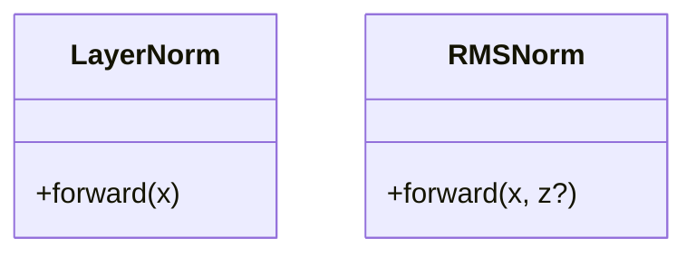

**Diagram sources**
- [layernorm.py](file://vllm/model_executor/layers/layernorm.py#L427-L442)
- [layernorm.py](file://vllm/model_executor/layers/layernorm.py#L379-L410)

**Section sources**
- [layernorm.py](file://vllm/model_executor/layers/layernorm.py#L379-L442)

### Activations: ReLU vs GELU
- GELU:
  - Multiple implementations exposed via custom bindings (e.g., gelu_new, gelu_fast, gelu_quick)
- SwiGLU/SwiGLU variants:
  - SwigluOAI fused op available
- ReLU:
  - Not used in the examined decoder-only families in this repository snapshot

**Section sources**
- [torch_bindings.cpp](file://csrc/torch_bindings.cpp#L126-L163)
- [gpt2.py](file://vllm/model_executor/models/gpt2.py#L139-L145)
- [gpt_neox.py](file://vllm/model_executor/models/gpt_neox.py#L139-L147)
- [gpt_j.py](file://vllm/model_executor/models/gpt_j.py#L145-L157)

### Model-Specific Optimizations
- OPT:
  - Attention bias controlled by model config; enables bias in QKV projections
- BLOOM:
  - Parallel attention via fused QKV projection and dense projection
- Falcon:
  - Multi-query attention via config flags; ALiBi or rotary support; parallel attention flag affects row reduction behavior

**Section sources**
- [opt.py](file://vllm/model_executor/models/opt.py#L138-L145)
- [bloom.py](file://vllm/model_executor/models/bloom.py#L105-L119)
- [falcon.py](file://vllm/model_executor/models/falcon.py#L114-L159)

### Practical Examples: Model Loading and Parameter Sharing
- Model loading:
  - Supported model families are documented in the supported models guide
- Parameter sharing:
  - Weight replacement and partitioning utilities enable parameter sharing and partitioned weight loading

**Section sources**
- [supported_models.md](file://docs/models/supported_models.md#L354-L458)
- [parameter.py](file://vllm/model_executor/parameter.py#L467-L555)
- [model_executor/utils.py](file://vllm/model_executor/utils.py#L58-L89)

## Dependency Analysis
The decoder-only stack exhibits low coupling between model families and high cohesion within attention, normalization, and activation layers. Attention backends depend on KV cache and PagedAttention kernels, while models depend on shared layers.

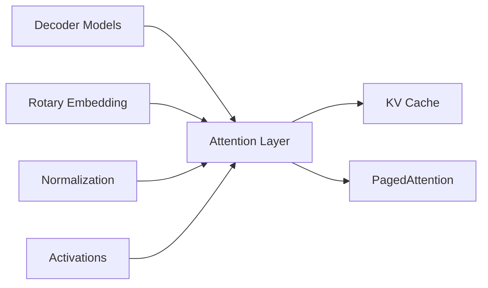

**Diagram sources**
- [falcon.py](file://vllm/model_executor/models/falcon.py#L160-L200)
- [bloom.py](file://vllm/model_executor/models/bloom.py#L121-L138)
- [gpt_neox.py](file://vllm/model_executor/models/gpt_neox.py#L92-L119)
- [gpt_j.py](file://vllm/model_executor/models/gpt_j.py#L91-L127)
- [opt.py](file://vllm/model_executor/models/opt.py#L116-L125)
- [gpt2.py](file://vllm/model_executor/models/gpt2.py#L160-L182)
- [paged_attention_v2.cu](file://csrc/attention/paged_attention_v2.cu#L43-L67)

**Section sources**
- [falcon.py](file://vllm/model_executor/models/falcon.py#L94-L200)
- [bloom.py](file://vllm/model_executor/models/bloom.py#L87-L150)
- [gpt_neox.py](file://vllm/model_executor/models/gpt_neox.py#L59-L119)
- [gpt_j.py](file://vllm/model_executor/models/gpt_j.py#L62-L127)
- [opt.py](file://vllm/model_executor/models/opt.py#L73-L125)
- [gpt2.py](file://vllm/model_executor/models/gpt2.py#L63-L113)
- [paged_attention_v2.cu](file://csrc/attention/paged_attention_v2.cu#L43-L67)

## Performance Considerations
- PagedAttention:
  - CUDA/Triton kernels support optional ALiBi and FP8 KV cache dtypes
  - ROCm backend integrates split KV cache and dtype reshaping
- KV cache management:
  - Prefill writes to cache; decode reads from cache with block tables and slot mappings
- Prefix caching and ALiBi:
  - Tests demonstrate ALiBi bias construction and prefix prefill masking logic
- Hardware-specific:
  - ROCm attention backend includes specialized handling for FP8 KV cache and scaling

**Section sources**
- [paged_attention_v2.cu](file://csrc/attention/paged_attention_v2.cu#L43-L67)
- [rocm_attn.py](file://vllm/v1/attention/backends/rocm_attn.py#L307-L338)
- [test_attention.py](file://tests/kernels/attention/test_attention.py#L87-L109)
- [test_prefix_prefill.py](file://tests/kernels/attention/test_prefix_prefill.py#L44-L85)

## Troubleshooting Guide
- Chat templates:
  - Some model types rely on fallback chat templates; ensure correct model type registration
- Template customization:
  - Example templates show role-based prefixes for specific models

**Section sources**
- [registry.py](file://vllm/transformers_utils/chat_templates/registry.py#L28-L73)
- [template_falcon_180b.jinja](file://examples/template_falcon_180b.jinja#L1-L17)

## Conclusion
vLLM’s decoder-only stack provides a flexible, high-performance foundation for autoregressive models. By composing shared attention, normalization, and activation layers with model-specific attention variants (ALiBi, rotary), it supports a wide range of architectures efficiently. PagedAttention and KV cache management enable scalable decoding, while hardware backends (CUDA, Triton, ROCm) deliver optimized performance. Parameter sharing utilities and model registries streamline deployment and experimentation across diverse decoder-only families.

## Appendices

### Appendix A: Model Families and Features
- Supported decoder-only families include Falcon, BLOOM, GPT-2, OPT, GPT-NeoX, GPT-J, and GPT-Neo, among many others.

**Section sources**
- [supported_models.md](file://docs/models/supported_models.md#L354-L458)