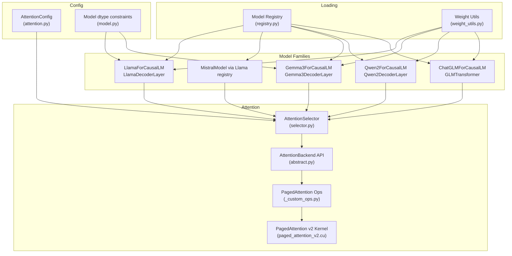
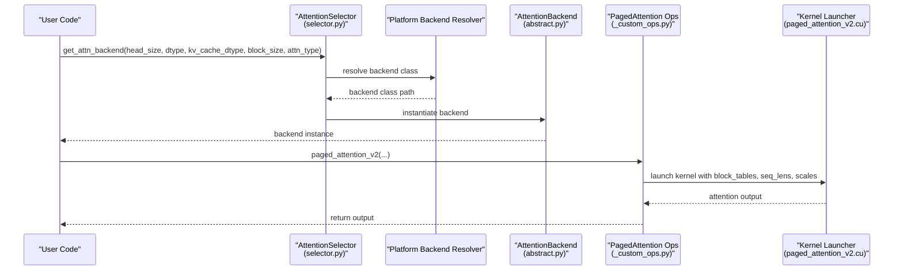
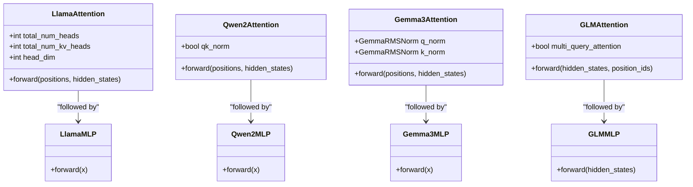
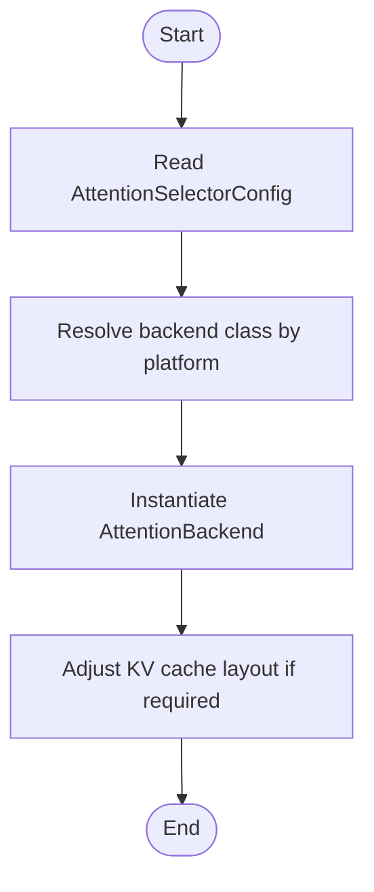
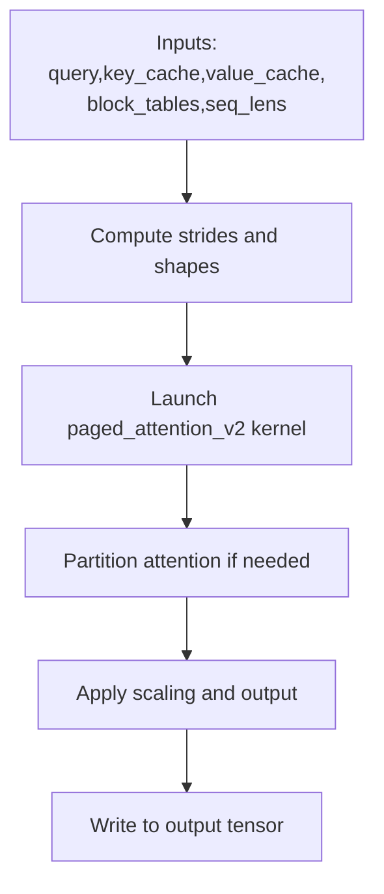
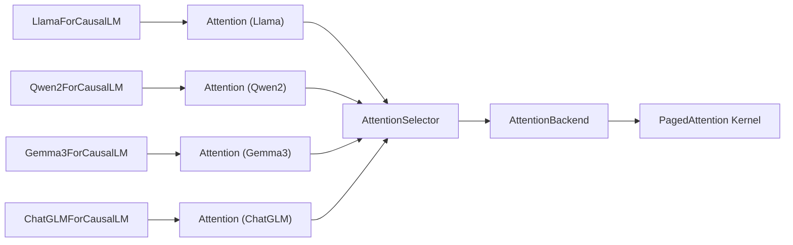

# Llama Family Models

<cite>
**Referenced Files in This Document**
- [llama.py](file://vllm/model_executor/models/llama.py)
- [gemma3.py](file://vllm/model_executor/models/gemma3.py)
- [qwen2.py](file://vllm/model_executor/models/qwen2.py)
- [chatglm.py](file://vllm/model_executor/models/chatglm.py)
- [registry.py](file://vllm/model_executor/models/registry.py)
- [selector.py](file://vllm/attention/selector.py)
- [abstract.py](file://vllm/attention/backends/abstract.py)
- [_custom_ops.py](file://vllm/_custom_ops.py)
- [paged_attention_v2.cu](file://csrc/attention/paged_attention_v2.cu)
- [attention.py](file://vllm/config/attention.py)
- [model.py](file://vllm/config/model.py)
- [weight_utils.py](file://vllm/model_executor/model_loader/weight_utils.py)
- [supported_models.md](file://docs/models/supported_models.md)
</cite>

## Table of Contents
1. [Introduction](#introduction)
2. [Project Structure](#project-structure)
3. [Core Components](#core-components)
4. [Architecture Overview](#architecture-overview)
5. [Detailed Component Analysis](#detailed-component-analysis)
6. [Dependency Analysis](#dependency-analysis)
7. [Performance Considerations](#performance-considerations)
8. [Troubleshooting Guide](#troubleshooting-guide)
9. [Conclusion](#conclusion)
10. [Appendices](#appendices)

## Introduction
This document explains the Llama family of transformer models in vLLM, covering the extensive ecosystem including Llama, Llama2, Llama3, Mistral variants, Gemma, Qwen, and ChatGLM. It focuses on architectural differences—attention mechanisms, rotary embeddings, RMSNorm, and feed-forward layer configurations—and highlights model-specific optimizations such as sliding window attention in Mistral, Grouped Query Attention (GQA) in Llama3 variants, and unique architectural choices in Gemma and Qwen. Practical guidance is provided for model loading, parameter initialization, performance tuning, attention backend selection, PagedAttention usage, memory optimization, KV cache management, and hardware-specific optimizations.

## Project Structure
The Llama family models are implemented as modular components under the model executor, with attention backends and KV cache management integrated into the broader vLLM runtime. Key areas:
- Model families: Llama, Mistral-family (via Llama architecture), Gemma, Qwen, ChatGLM
- Attention backends and selection logic
- PagedAttention kernels and KV cache management
- Weight loading and initialization utilities
- Configuration for attention backends and model dtype constraints

**Diagram sources**
- [llama.py](file://vllm/model_executor/models/llama.py#L293-L328)
- [gemma3.py](file://vllm/model_executor/models/gemma3.py#L104-L209)
- [qwen2.py](file://vllm/model_executor/models/qwen2.py#L112-L229)
- [chatglm.py](file://vllm/model_executor/models/chatglm.py#L48-L137)
- [registry.py](file://vllm/model_executor/models/registry.py#L191-L217)
- [selector.py](file://vllm/attention/selector.py#L46-L119)
- [abstract.py](file://vllm/attention/backends/abstract.py#L40-L110)
- [_custom_ops.py](file://vllm/_custom_ops.py#L73-L120)
- [paged_attention_v2.cu](file://csrc/attention/paged_attention_v2.cu#L43-L67)
- [attention.py](file://vllm/config/attention.py#L16-L115)
- [model.py](file://vllm/config/model.py#L1820-L1859)
- [weight_utils.py](file://vllm/model_executor/model_loader/weight_utils.py#L1040-L1054)

**Section sources**
- [llama.py](file://vllm/model_executor/models/llama.py#L293-L328)
- [gemma3.py](file://vllm/model_executor/models/gemma3.py#L104-L209)
- [qwen2.py](file://vllm/model_executor/models/qwen2.py#L112-L229)
- [chatglm.py](file://vllm/model_executor/models/chatglm.py#L48-L137)
- [registry.py](file://vllm/model_executor/models/registry.py#L191-L217)
- [selector.py](file://vllm/attention/selector.py#L46-L119)
- [abstract.py](file://vllm/attention/backends/abstract.py#L40-L110)
- [_custom_ops.py](file://vllm/_custom_ops.py#L73-L120)
- [paged_attention_v2.cu](file://csrc/attention/paged_attention_v2.cu#L43-L67)
- [attention.py](file://vllm/config/attention.py#L16-L115)
- [model.py](file://vllm/config/model.py#L1820-L1859)
- [weight_utils.py](file://vllm/model_executor/model_loader/weight_utils.py#L1040-L1054)

## Core Components
- Llama family decoder layers and attention:
  - LlamaAttention implements QKV projection, rotary embeddings, optional Llama4 scaling, and grouped query heads.
  - LlamaMLP uses fused gate/up projections with SiLU+MUL activation.
- Gemma3-specific attention:
  - Separate Q/K normalization with GemmaRMSNorm, sliding window support via layer types, and logits soft cap option.
- Qwen2-specific attention:
  - Optional QK normalization (RMSNorm) before RoPE, dual-chunk attention configuration support, and configurable rope parameters.
- ChatGLM-specific attention:
  - Multi-query attention variant with partial rotary and custom RoPE parameters.
- Attention backend selection:
  - Centralized selector chooses backend based on head size, dtype, KV cache dtype, block size, attention type, and platform capabilities.
- PagedAttention:
  - vLLM exposes paged attention ops and CUDA kernels for efficient KV cache paging and block-based attention.
- Weight loading and initialization:
  - Utilities for initializing dummy weights and model-specific weight stacking/remapping.

**Section sources**
- [llama.py](file://vllm/model_executor/models/llama.py#L115-L249)
- [llama.py](file://vllm/model_executor/models/llama.py#L268-L348)
- [gemma3.py](file://vllm/model_executor/models/gemma3.py#L104-L209)
- [gemma3.py](file://vllm/model_executor/models/gemma3.py#L232-L298)
- [qwen2.py](file://vllm/model_executor/models/qwen2.py#L112-L229)
- [qwen2.py](file://vllm/model_executor/models/qwen2.py#L231-L305)
- [chatglm.py](file://vllm/model_executor/models/chatglm.py#L48-L137)
- [selector.py](file://vllm/attention/selector.py#L46-L119)
- [_custom_ops.py](file://vllm/_custom_ops.py#L73-L120)
- [paged_attention_v2.cu](file://csrc/attention/paged_attention_v2.cu#L43-L67)
- [weight_utils.py](file://vllm/model_executor/model_loader/weight_utils.py#L1040-L1054)

## Architecture Overview
The vLLM runtime composes model families from shared attention and KV cache infrastructure. Attention backends are selected dynamically based on configuration and platform capabilities, and PagedAttention is used to manage KV caches efficiently.

**Diagram sources**
- [selector.py](file://vllm/attention/selector.py#L46-L119)
- [abstract.py](file://vllm/attention/backends/abstract.py#L40-L110)
- [_custom_ops.py](file://vllm/_custom_ops.py#L73-L120)
- [paged_attention_v2.cu](file://csrc/attention/paged_attention_v2.cu#L43-L67)

## Detailed Component Analysis

### Llama Family Foundations
- Attention mechanisms:
  - LlamaAttention uses QKVParallelLinear and RowParallelLinear for Q/K/V and output projections, with rotary embeddings and optional Llama4 scaling factor applied to queries.
  - Sliding window support is derived from layer types in the config for both Llama and Gemma3.
- Rotary embeddings:
  - Llama uses get_rope with configurable parameters; Mistral/Llama <=2 weight formats may require remapping and special handling for Neox-style vs non-Neox RoPE.
- Norms and activations:
  - RMSNorm is used for input/post-attention and pre/post MLP norms in Llama and Qwen2.
  - Llama MLP uses SiLU+MUL activation; Qwen2 MLP mirrors this; Gemma3 uses gelu_pytorch_tanh activation.
- Feed-forward layers:
  - Llama and Qwen2 use fused gate/up projections; ChatGLM MLP uses dense_h_to_4h and dense_4h_to_h with SiLU+MUL.

**Diagram sources**
- [llama.py](file://vllm/model_executor/models/llama.py#L115-L249)
- [llama.py](file://vllm/model_executor/models/llama.py#L317-L328)
- [qwen2.py](file://vllm/model_executor/models/qwen2.py#L112-L229)
- [qwen2.py](file://vllm/model_executor/models/qwen2.py#L231-L305)
- [gemma3.py](file://vllm/model_executor/models/gemma3.py#L104-L209)
- [gemma3.py](file://vllm/model_executor/models/gemma3.py#L232-L298)
- [chatglm.py](file://vllm/model_executor/models/chatglm.py#L48-L137)
- [chatglm.py](file://vllm/model_executor/models/chatglm.py#L139-L184)

**Section sources**
- [llama.py](file://vllm/model_executor/models/llama.py#L115-L249)
- [llama.py](file://vllm/model_executor/models/llama.py#L268-L348)
- [qwen2.py](file://vllm/model_executor/models/qwen2.py#L112-L229)
- [qwen2.py](file://vllm/model_executor/models/qwen2.py#L231-L305)
- [gemma3.py](file://vllm/model_executor/models/gemma3.py#L104-L209)
- [gemma3.py](file://vllm/model_executor/models/gemma3.py#L232-L298)
- [chatglm.py](file://vllm/model_executor/models/chatglm.py#L48-L137)
- [chatglm.py](file://vllm/model_executor/models/chatglm.py#L139-L184)

### Attention Backend Selection Logic
- The selector evaluates head size, dtype, KV cache dtype, block size, attention type, and platform capabilities to choose an appropriate backend.
- The backend’s metadata builder and implementation are resolved, and the KV cache layout may be adjusted to match backend requirements.

**Diagram sources**
- [selector.py](file://vllm/attention/selector.py#L46-L119)
- [abstract.py](file://vllm/attention/backends/abstract.py#L109-L110)

**Section sources**
- [selector.py](file://vllm/attention/selector.py#L46-L119)
- [abstract.py](file://vllm/attention/backends/abstract.py#L40-L110)

### PagedAttention and KV Cache Management
- vLLM exposes paged_attention_v2 op and a CUDA kernel that:
  - Accepts query/key/value tensors and KV cache buffers
  - Uses block_tables and seq_lens to map pages
  - Supports optional alibi slopes, KV cache dtype, and per-tensor scales
- The kernel computes attention over blocks and supports partitioning for long sequences.

**Diagram sources**
- [_custom_ops.py](file://vllm/_custom_ops.py#L73-L120)
- [paged_attention_v2.cu](file://csrc/attention/paged_attention_v2.cu#L43-L67)

**Section sources**
- [_custom_ops.py](file://vllm/_custom_ops.py#L73-L120)
- [paged_attention_v2.cu](file://csrc/attention/paged_attention_v2.cu#L43-L67)

### Model-Specific Optimizations and Architectural Choices
- Sliding window attention:
  - Llama and Gemma3 support per-layer sliding windows via layer_types and config.sliding_window.
- Grouped Query Attention (GQA):
  - LlamaAttention and Qwen2Attention support num_kv_heads < num_heads, enabling GQA; ChatGLM supports multi-query attention.
- QK normalization:
  - Qwen2Attention optionally applies RMSNorm to Q and K before RoPE.
- Gemma normalization and activation:
  - Gemma3Attention applies per-head Q/K normalization and uses gelu_pytorch_tanh activation.
- Rotary embedding scaling:
  - Llama4 scaling factor is applied to query embeddings in LlamaAttention.
- Weight loading and remapping:
  - LlamaForCausalLM includes a remapping routine for Mistral/Llama<=2 weight formats and handles special cases for gguf quantization.

**Section sources**
- [llama.py](file://vllm/model_executor/models/llama.py#L185-L205)
- [gemma3.py](file://vllm/model_executor/models/gemma3.py#L160-L164)
- [qwen2.py](file://vllm/model_executor/models/qwen2.py#L168-L179)
- [qwen2.py](file://vllm/model_executor/models/qwen2.py#L209-L225)
- [gemma3.py](file://vllm/model_executor/models/gemma3.py#L157-L159)
- [gemma3.py](file://vllm/model_executor/models/gemma3.py#L90-L95)
- [llama.py](file://vllm/model_executor/models/llama.py#L224-L234)
- [llama.py](file://vllm/model_executor/models/llama.py#L645-L701)
- [chatglm.py](file://vllm/model_executor/models/chatglm.py#L63-L76)

### Practical Examples: Loading, Initialization, and Tuning
- Model loading:
  - Use the registry to map architectures to their implementations; Llama and Mistral share the same LlamaForCausalLM implementation.
  - Weight loading utilities support stacked parameter mapping and KV cache scale remapping.
- Parameter initialization:
  - Dummy weight initializer is available for performance measurement and avoiding NaNs.
- Performance tuning:
  - AttentionConfig allows selecting backends, controlling FlashAttention versions, and toggling prefill/decode kernels.
  - Dtype constraints: certain Gemma and GLM models require bfloat16 or float32 for numerical stability.

**Section sources**
- [registry.py](file://vllm/model_executor/models/registry.py#L191-L217)
- [weight_utils.py](file://vllm/model_executor/model_loader/weight_utils.py#L1040-L1054)
- [attention.py](file://vllm/config/attention.py#L16-L115)
- [model.py](file://vllm/config/model.py#L1820-L1859)

## Dependency Analysis
- Model-to-backend coupling:
  - Each model constructs Attention or EncoderOnlyAttention with backend-specific parameters (e.g., sliding window, logits soft cap).
- Backend validation:
  - AttentionBackend.validate_configuration enforces compatibility across head sizes, dtypes, KV cache dtypes, block sizes, and attention types.
- Platform-specific backends:
  - The selector resolves platform-specific backend classes and may adjust KV cache layout.

**Diagram sources**
- [llama.py](file://vllm/model_executor/models/llama.py#L293-L328)
- [qwen2.py](file://vllm/model_executor/models/qwen2.py#L231-L270)
- [gemma3.py](file://vllm/model_executor/models/gemma3.py#L232-L253)
- [chatglm.py](file://vllm/model_executor/models/chatglm.py#L116-L136)
- [selector.py](file://vllm/attention/selector.py#L46-L119)
- [abstract.py](file://vllm/attention/backends/abstract.py#L205-L259)

**Section sources**
- [llama.py](file://vllm/model_executor/models/llama.py#L293-L328)
- [qwen2.py](file://vllm/model_executor/models/qwen2.py#L231-L270)
- [gemma3.py](file://vllm/model_executor/models/gemma3.py#L232-L253)
- [chatglm.py](file://vllm/model_executor/models/chatglm.py#L116-L136)
- [selector.py](file://vllm/attention/selector.py#L46-L119)
- [abstract.py](file://vllm/attention/backends/abstract.py#L205-L259)

## Performance Considerations
- Attention backend selection:
  - Choose backends aligned with head sizes, dtypes, and KV cache dtypes; platform capabilities influence availability.
- PagedAttention:
  - Use appropriate block sizes and ensure partitioning aligns with sequence lengths to minimize recomputation.
- Dtype stability:
  - Avoid float16 for Gemma3 and GLM families; prefer bfloat16 or float32.
- Activation and normalization:
  - gemma_pytorch_tanh activation in Gemma3 and QK normalization in Qwen2 can improve training stability and throughput.
- Weight loading:
  - Use stacked parameter mapping and KV cache scale remapping to avoid redundant copies and mismatches.

[No sources needed since this section provides general guidance]

## Troubleshooting Guide
- Numerical instability:
  - Certain Gemma and GLM models require bfloat16 or float32; float16 is explicitly disallowed for these families.
- Weight format mismatches:
  - LlamaForCausalLM includes remapping logic for Mistral/Llama<=2 weight formats; ensure correct mapping of q_proj/wq permutations and scale names.
- Backend mismatch:
  - If AttentionBackend.validate_configuration reports unsupported combinations, adjust head size, dtype, KV cache dtype, block size, or attention type.

**Section sources**
- [model.py](file://vllm/config/model.py#L1820-L1859)
- [llama.py](file://vllm/model_executor/models/llama.py#L645-L701)
- [abstract.py](file://vllm/attention/backends/abstract.py#L205-L259)

## Conclusion
The Llama family in vLLM leverages a shared attention and KV cache infrastructure with model-specific adaptations. LlamaAttention and Qwen2Attention support GQA and optional QK normalization, while Gemma3 introduces per-head Q/K normalization and sliding window support. Attention backends are selected dynamically based on configuration and platform capabilities, and PagedAttention provides efficient KV cache management. Proper dtype selection, weight loading, and backend configuration are essential for performance and numerical stability across the Llama ecosystem.

[No sources needed since this section summarizes without analyzing specific files]

## Appendices
- Supported models and architectures:
  - The supported models documentation enumerates Llama, Mistral, Gemma, Qwen, and ChatGLM families and their variants.

**Section sources**
- [supported_models.md](file://docs/models/supported_models.md#L340-L460)