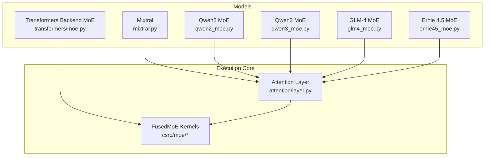
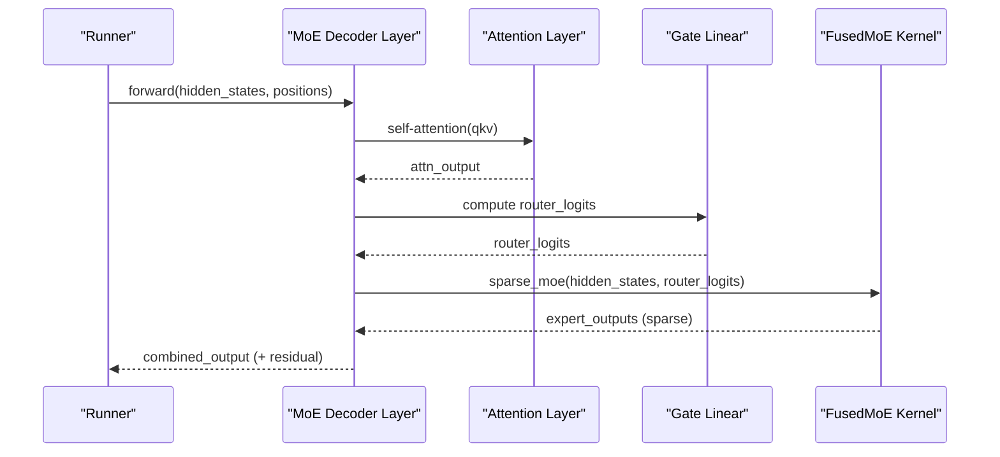
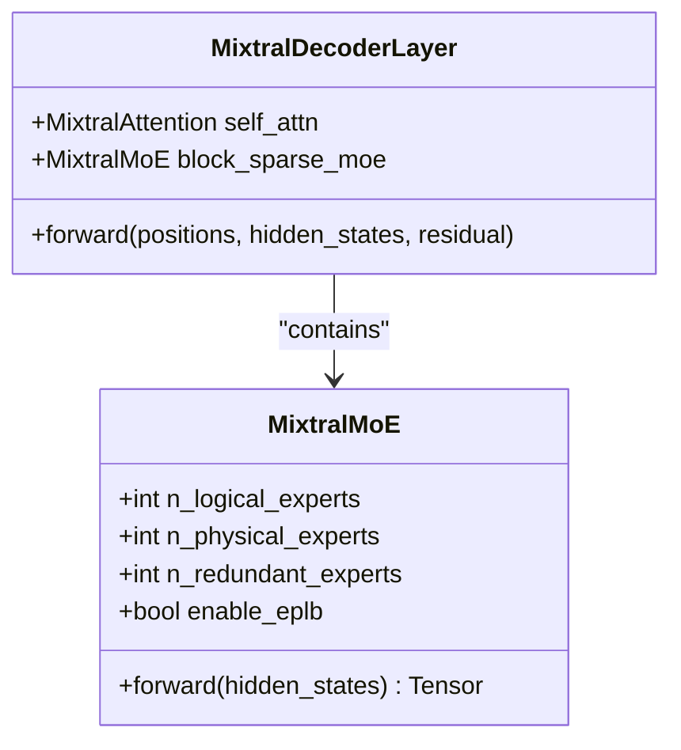
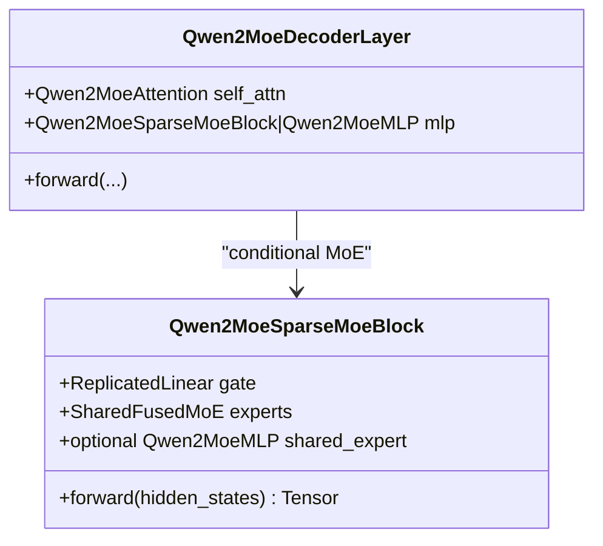
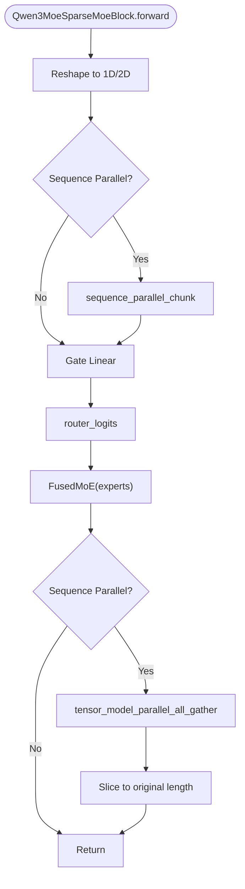
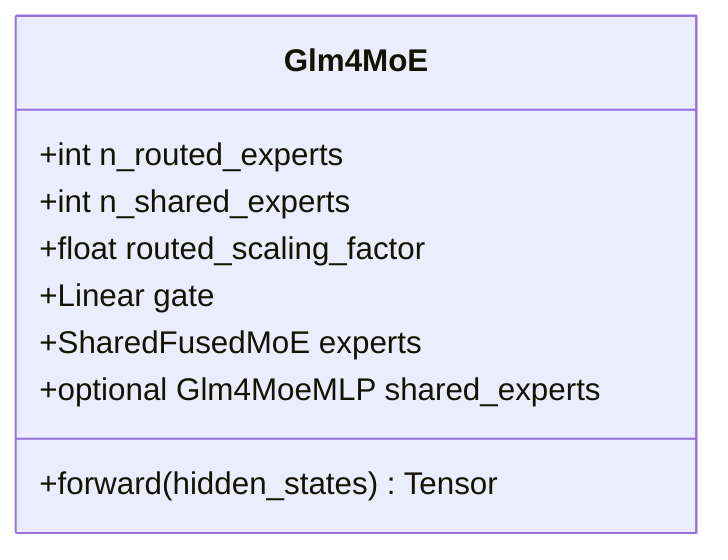
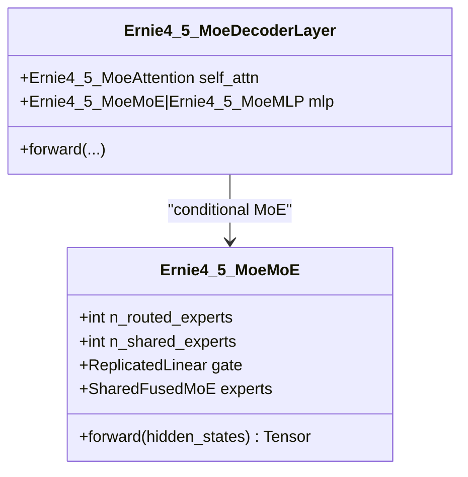
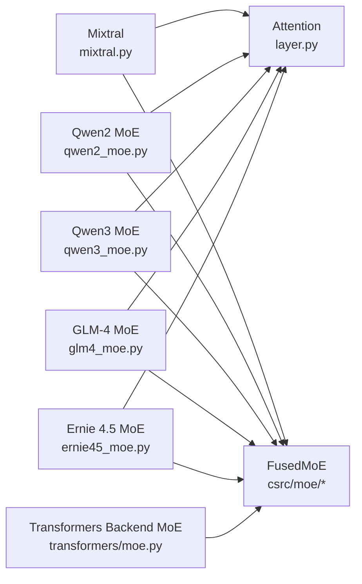

# Mixture-of-Experts Models

<cite>
**Referenced Files in This Document**
- [mixtral.py](file://vllm/model_executor/models/mixtral.py)
- [qwen2_moe.py](file://vllm/model_executor/models/qwen2_moe.py)
- [qwen3_moe.py](file://vllm/model_executor/models/qwen3_moe.py)
- [glm4_moe.py](file://vllm/model_executor/models/glm4_moe.py)
- [ernie45_moe.py](file://vllm/model_executor/models/ernie45_moe.py)
- [moe.py](file://vllm/model_executor/models/transformers/moe.py)
- [layer.py](file://vllm/attention/layer.py)
- [benchmark_moe.py](file://benchmarks/kernels/benchmark_moe.py)
- [benchmark_cutlass_moe_fp8.py](file://benchmarks/kernels/benchmark_cutlass_moe_fp8.py)
- [benchmark_cutlass_fp4_moe.py](file://benchmarks/kernels/benchmark_cutlass_fp4_moe.py)
- [test_moe.py](file://tests/kernels/moe/test_moe.py)
- [test_cutlass_moe.py](file://tests/kernels/moe/test_cutlass_moe.py)
- [test_cpu_fused_moe.py](file://tests/kernels/moe/test_cpu_fused_moe.py)
- [test_moe_align_block_size.py](file://tests/kernels/moe/test_moe_align_block_size.py)
- [test_moe_permute_unpermute.py](file://tests/kernels/moe/test_moe_permute_unpermute.py)
- [test_deepep_moe.py](file://tests/distributed/test_deepep_moe.py)
- [test_torchrun_example_moe.py](file://tests/distributed/test_torchrun_example_moe.py)
- [test_routing_simulator.py](file://tests/test_routing_simulator.py)
- [test_expert_parallel.py](file://tests/distributed/test_expert_parallel.py)
- [test_expert_placement.py](file://tests/distributed/test_expert_placement.py)
- [test_eplb_fused_moe_layer.py](file://tests/distributed/test_eplb_fused_moe_layer.py)
- [test_eplb_fused_moe_layer_dep_nvfp4.py](file://tests/distributed/test_eplb_fused_moe_layer_dep_nvfp4.py)
- [test_fused_moe_lora_kernel.py](file://tests/lora/test_fused_moe_lora_kernel.py)
- [test_qwen3moe_tp.py](file://tests/lora/test_qwen3moe_tp.py)
- [test_moe_lora_align_sum.py](file://tests/lora/test_moe_lora_align_sum.py)
- [test_qwen3_omni.py](file://tests/model_executor/test_qwen3_omni.py)
- [test_qwen3_omni_moe_thinker.py](file://tests/examples/offline_inference/qwen3_omni_moe_thinker.py)
- [test_qwen3_omni_thinker.py](file://tests/examples/offline_inference/qwen3_omni_thinker.py)
- [test_qwen2_5_omni_thinker.py](file://tests/examples/offline_inference/qwen2_5_omni_thinker.py)
- [test_qwen2_5_vl.py](file://tests/examples/offline_inference/qwen2_5_vl.py)
- [test_qwen3_vl_moe.py](file://tests/examples/offline_inference/qwen3_vl_moe.py)
- [test_qwen3_vl.py](file://tests/examples/offline_inference/qwen3_vl.py)
- [test_qwen3_omni_moe_thinker.py](file://tests/examples/offline_inference/qwen3_omni_moe_thinker.py)
- [test_qwen3_omni_thinker.py](file://tests/examples/offline_inference/qwen3_omni_thinker.py)
- [test_qwen2_5_omni_thinker.py](file://tests/examples/offline_inference/qwen2_5_omni_thinker.py)
- [test_qwen2_5_vl.py](file://tests/examples/offline_inference/qwen2_5_vl.py)
- [test_qwen3_vl_moe.py](file://tests/examples/offline_inference/qwen3_vl_moe.py)
- [test_qwen3_vl.py](file://tests/examples/offline_inference/qwen3_vl.py)
- [test_qwen3_omni_moe_thinker.py](file://tests/examples/offline_inference/qwen3_omni_moe_thinker.py)
- [test_qwen3_omni_thinker.py](file://tests/examples/offline_inference/qwen3_omni_thinker.py)
- [test_qwen2_5_omni_thinker.py](file://tests/examples/offline_inference/qwen2_5_omni_thinker.py)
- [test_qwen2_5_vl.py](file://tests/examples/offline_inference/qwen2_5_vl.py)
- [test_qwen3_vl_moe.py](file://tests/examples/offline_inference/qwen3_vl_moe.py)
- [test_qwen3_vl.py](file://tests/examples/offline_inference/qwen3_vl.py)
- [test_qwen3_omni_moe_thinker.py](file://tests/examples/offline_inference/qwen3_omni_moe_thinker.py)
- [test_qwen3_omni_thinker.py](file://tests/examples/offline_inference/qwen3_omni_thinker.py)
- [test_qwen2_5_omni_thinker.py](file://tests/examples/offline_inference/qwen2_5_omni_thinker.py)
- [test_qwen2_5_vl.py](file://tests/examples/offline_inference/qwen2_5_vl.py)
- [test_qwen3_vl_moe.py](file://tests/examples/offline_inference/qwen3_vl_moe.py)
- [test_qwen3_vl.py](file://tests/examples/offline_inference/qwen3_vl.py)
- [test_qwen3_omni_moe_thinker.py](file://tests/examples/offline_inference/qwen3_omni_moe_thinker.py)
- [test_qwen3_omni_thinker.py](file://tests/examples/offline_inference/qwen3_omni_thinker.py)
- [test_qwen2_5_omni_thinker.py](file://tests/examples/offline_inference/qwen2_5_omni_thinker.py)
- [test_qwen2_5_vl.py](file://tests/examples/offline_inference/qwen2_5_vl.py)
- [test_qwen3_vl_moe.py](file://tests/examples/offline_inference/qwen3_vl_moe.py)
- [test_qwen3_vl.py](file://tests/examples/offline_inference/qwen3_vl.py)
- [test_qwen3_omni_moe_thinker.py](file://tests/examples/offline_inference/qwen3_omni_moe_thinker.py)
- [test_qwen3_omni_thinker.py](file://tests/examples/offline_inference/qwen3_omni_thinker.py)
- [test_qwen2_5_omni_thinker.py](file://tests/examples/offline_inference/qwen2_5_omni_thinker.py)
- [test_qwen2_5_vl.py](file://tests/examples/offline_inference/qwen2_5_vl.py)
- [test_qwen3_vl_moe.py](file://tests/examples/offline_inference/qwen3_vl_moe.py)
- [test_qwen3_vl.py](file://tests/examples/offline_inference/qwen3_vl.py)
- [test_qwen3_omni_moe_thinker.py](file://tests/examples/offline_inference/qwen3_omni_moe......)
</cite>

## Table of Contents
1. [Introduction](#introduction)
2. [Project Structure](#project-structure)
3. [Core Components](#core-components)
4. [Architecture Overview](#architecture-overview)
5. [Detailed Component Analysis](#detailed-component-analysis)
6. [Dependency Analysis](#dependency-analysis)
7. [Performance Considerations](#performance-considerations)
8. [Troubleshooting Guide](#troubleshooting-guide)
9. [Conclusion](#conclusion)
10. [Appendices](#appendices)

## Introduction
This document explains Mixture-of-Experts (MoE) transformer models in vLLM, focusing on Mixtral, Qwen2 MoE, Qwen3 MoE, GLM-4 MoE, and Ernie 4.5 MoE. It covers expert routing (top-1 and top-2 gating), load balancing, expert parallelism, sparse activation patterns, expert capacity management, and routing probability calculations. It also documents model loading, expert initialization, attention backend selection, specialized kernels, and memory management for large expert arrays. Practical guidance is included for performance, scaling, and hardware-specific optimizations, along with trade-offs among expert count, capacity factor, and accuracy.

## Project Structure
MoE implementations are organized by model family under the model executor, with shared infrastructure for fused MoE kernels, attention backends, and distributed execution. The following diagram shows how MoE model families integrate with the attention layer and fused MoE kernels.

**Diagram sources**
- [mixtral.py](file://vllm/model_executor/models/mixtral.py#L1-L200)
- [qwen2_moe.py](file://vllm/model_executor/models/qwen2_moe.py#L1-L200)
- [qwen3_moe.py](file://vllm/model_executor/models/qwen3_moe.py#L1-L220)
- [glm4_moe.py](file://vllm/model_executor/models/glm4_moe.py#L1-L220)
- [ernie45_moe.py](file://vllm/model_executor/models/ernie45_moe.py#L1-L220)
- [moe.py](file://vllm/model_executor/models/transformers/moe.py#L1-L120)
- [layer.py](file://vllm/attention/layer.py#L1-L200)

**Section sources**
- [mixtral.py](file://vllm/model_executor/models/mixtral.py#L1-L200)
- [qwen2_moe.py](file://vllm/model_executor/models/qwen2_moe.py#L1-L200)
- [qwen3_moe.py](file://vllm/model_executor/models/qwen3_moe.py#L1-L220)
- [glm4_moe.py](file://vllm/model_executor/models/glm4_moe.py#L1-L220)
- [ernie45_moe.py](file://vllm/model_executor/models/ernie45_moe.py#L1-L220)
- [moe.py](file://vllm/model_executor/models/transformers/moe.py#L1-L120)
- [layer.py](file://vllm/attention/layer.py#L1-L200)

## Core Components
- Model families:
  - Mixtral: Implements a tensor-parallel MoE with fused experts and optional expert-parallel load balancing.
  - Qwen2 MoE: Uses SharedFusedMoE with optional shared experts and renormalized top-k probabilities.
  - Qwen3 MoE: Uses FusedMoE with expert parallelism, optional sequence parallelism, and renormalization.
  - GLM-4 MoE: Uses SharedFusedMoE with grouped top-k routing, optional shared experts, and scaling adjustments.
  - Ernie 4.5 MoE: Uses SharedFusedMoE with optional shared experts and correction bias for router scores.
- FusedMoE kernels: Specialized CUDA/Triton kernels for sparse MoE activation, permutation, alignment, and reduction.
- Attention backends: Unified attention layer selects optimal backend (e.g., FlashInfer, Triton) and integrates KV cache quantization.
- Distributed execution: Expert parallel groups, pipeline parallel groups, and optional sequence parallelism.

Key implementation references:
- MixtralMoE and decoder layer: [mixtral.py](file://vllm/model_executor/models/mixtral.py#L74-L153)
- Qwen2 SparseMoeBlock: [qwen2_moe.py](file://vllm/model_executor/models/qwen2_moe.py#L119-L189)
- Qwen3 SparseMoeBlock: [qwen3_moe.py](file://vllm/model_executor/models/qwen3_moe.py#L121-L211)
- GLM-4 MoE: [glm4_moe.py](file://vllm/model_executor/models/glm4_moe.py#L116-L226)
- Ernie 4.5 MoE: [ernie45_moe.py](file://vllm/model_executor/models/ernie45_moe.py#L121-L228)
- Transformers backend fused MoE: [moe.py](file://vllm/model_executor/models/transformers/moe.py#L40-L114)
- Attention layer and backend selection: [layer.py](file://vllm/attention/layer.py#L140-L240)

**Section sources**
- [mixtral.py](file://vllm/model_executor/models/mixtral.py#L74-L153)
- [qwen2_moe.py](file://vllm/model_executor/models/qwen2_moe.py#L119-L189)
- [qwen3_moe.py](file://vllm/model_executor/models/qwen3_moe.py#L121-L211)
- [glm4_moe.py](file://vllm/model_executor/models/glm4_moe.py#L116-L226)
- [ernie45_moe.py](file://vllm/model_executor/models/ernie45_moe.py#L121-L228)
- [moe.py](file://vllm/model_executor/models/transformers/moe.py#L40-L114)
- [layer.py](file://vllm/attention/layer.py#L140-L240)

## Architecture Overview
The MoE architecture integrates attention with sparse expert computation. Each MoE-enabled decoder layer computes router logits, selects experts (top-1 or top-k), applies fused expert kernels, and aggregates outputs with optional all-reduce across tensor/expert parallel ranks.

**Diagram sources**
- [mixtral.py](file://vllm/model_executor/models/mixtral.py#L236-L292)
- [qwen2_moe.py](file://vllm/model_executor/models/qwen2_moe.py#L280-L352)
- [qwen3_moe.py](file://vllm/model_executor/models/qwen3_moe.py#L316-L389)
- [glm4_moe.py](file://vllm/model_executor/models/glm4_moe.py#L326-L398)
- [ernie45_moe.py](file://vllm/model_executor/models/ernie45_moe.py#L322-L412)
- [layer.py](file://vllm/attention/layer.py#L285-L359)

## Detailed Component Analysis

### Mixtral MoE
- Top-1 routing with fused experts and optional expert-parallel load balancing.
- Expert parallel groups manage physical/logical experts and redundant experts for load balancing.
- Gate uses ReplicatedLinear; experts use FusedMoE with renormalization.

**Diagram sources**
- [mixtral.py](file://vllm/model_executor/models/mixtral.py#L74-L153)
- [mixtral.py](file://vllm/model_executor/models/mixtral.py#L236-L292)

**Section sources**
- [mixtral.py](file://vllm/model_executor/models/mixtral.py#L74-L153)
- [mixtral.py](file://vllm/model_executor/models/mixtral.py#L236-L292)

### Qwen2 MoE
- Optional shared experts and renormalized top-k probabilities.
- Uses SharedFusedMoE; optional tensor-parallel all-reduce after expert fusion.

**Diagram sources**
- [qwen2_moe.py](file://vllm/model_executor/models/qwen2_moe.py#L119-L189)
- [qwen2_moe.py](file://vllm/model_executor/models/qwen2_moe.py#L280-L352)

**Section sources**
- [qwen2_moe.py](file://vllm/model_executor/models/qwen2_moe.py#L119-L189)
- [qwen2_moe.py](file://vllm/model_executor/models/qwen2_moe.py#L280-L352)

### Qwen3 MoE
- FusedMoE with optional sequence parallelism; renormalization and grouped routing.
- Supports auxiliary hidden states for EAGLE3.

**Diagram sources**
- [qwen3_moe.py](file://vllm/model_executor/models/qwen3_moe.py#L121-L211)

**Section sources**
- [qwen3_moe.py](file://vllm/model_executor/models/qwen3_moe.py#L121-L211)

### GLM-4 MoE
- Grouped top-k routing, optional shared experts, sigmoid scoring, and routed scaling factor.
- Uses SharedFusedMoE with correction bias for router scores.

**Diagram sources**
- [glm4_moe.py](file://vllm/model_executor/models/glm4_moe.py#L116-L226)

**Section sources**
- [glm4_moe.py](file://vllm/model_executor/models/glm4_moe.py#L116-L226)

### Ernie 4.5 MoE
- SharedFusedMoE with optional shared experts and correction bias; configurable MoE layer intervals.

**Diagram sources**
- [ernie45_moe.py](file://vllm/model_executor/models/ernie45_moe.py#L121-L228)
- [ernie45_moe.py](file://vllm/model_executor/models/ernie45_moe.py#L322-L412)

**Section sources**
- [ernie45_moe.py](file://vllm/model_executor/models/ernie45_moe.py#L121-L228)
- [ernie45_moe.py](file://vllm/model_executor/models/ernie45_moe.py#L322-L412)

### Expert Routing and Load Balancing
- Top-1 vs top-2 gating:
  - Top-1: router_logits shape (tokens, experts); select highest-scoring expert.
  - Top-2: select two experts; combine outputs with weights.
- Renormalization: normalize top-k probabilities to sum to 1 for stable aggregation.
- Load balancing:
  - Redundant experts increase physical expert count to balance load across ranks.
  - Expert-parallel load balancing (EPLB) tracks expert load views and maps logical to physical experts.

References:
- MixtralMoE gating and renormalization: [mixtral.py](file://vllm/model_executor/models/mixtral.py#L118-L153)
- Qwen2 renormalization and shared experts: [qwen2_moe.py](file://vllm/model_executor/models/qwen2_moe.py#L143-L189)
- Qwen3 renormalization and sequence parallelism: [qwen3_moe.py](file://vllm/model_executor/models/qwen3_moe.py#L163-L211)
- GLM-4 grouped top-k and scaling: [glm4_moe.py](file://vllm/model_executor/models/glm4_moe.py#L116-L226)
- Ernie 4.5 correction bias: [ernie45_moe.py](file://vllm/model_executor/models/ernie45_moe.py#L163-L228)
- EPLB state updates: [moe.py](file://vllm/model_executor/models/transformers/moe.py#L122-L150)

**Section sources**
- [mixtral.py](file://vllm/model_executor/models/mixtral.py#L118-L153)
- [qwen2_moe.py](file://vllm/model_executor/models/qwen2_moe.py#L143-L189)
- [qwen3_moe.py](file://vllm/model_executor/models/qwen3_moe.py#L163-L211)
- [glm4_moe.py](file://vllm/model_executor/models/glm4_moe.py#L116-L226)
- [ernie45_moe.py](file://vllm/model_executor/models/ernie45_moe.py#L163-L228)
- [moe.py](file://vllm/model_executor/models/transformers/moe.py#L122-L150)

### Sparse Activation Patterns and Capacity Management
- Sparsity:
  - Only selected experts activate per token; fused kernels permute inputs to expert-local blocks.
- Capacity:
  - Capacity factor controls how many tokens can be routed to a single expert replica.
  - Sequence parallelism splits tokens across ranks to reduce per-rank capacity pressure.
- Alignment and permutation:
  - Kernels align tokens to block sizes and permute for efficient expert execution.

References:
- Token permutation and alignment tests: [test_moe_permute_unpermute.py](file://tests/kernels/moe/test_moe_permute_unpermute.py#L1-L200)
- Block-size alignment tests: [test_moe_align_block_size.py](file://tests/kernels/moe/test_moe_align_block_size.py#L1-L200)

**Section sources**
- [test_moe_permute_unpermute.py](file://tests/kernels/moe/test_moe_permute_unpermute.py#L1-L200)
- [test_moe_align_block_size.py](file://tests/kernels/moe/test_moe_align_block_size.py#L1-L200)

### Attention Backend Selection for MoE
- The attention layer selects an optimized backend (e.g., FlashInfer, Triton) and manages KV cache quantization.
- For MoE models, attention backends must interoperate with fused MoE kernels and distributed groups.

References:
- Backend selection and KV cache quantization: [layer.py](file://vllm/attention/layer.py#L140-L240)
- Unified attention ops: [layer.py](file://vllm/attention/layer.py#L285-L359)

**Section sources**
- [layer.py](file://vllm/attention/layer.py#L140-L240)
- [layer.py](file://vllm/attention/layer.py#L285-L359)

### Specialized Kernels and Memory Management
- FusedMoE kernels:
  - Grouped top-k, top-k softmax, permute/unpermute, and sum kernels.
  - CUTLASS and Triton-backed implementations for performance.
- Memory:
  - Large expert weight arrays are sharded across tensor/expert parallel ranks.
  - Redundant experts increase memory footprint but improve load balancing.

References:
- Benchmarking fused MoE kernels: [benchmark_moe.py](file://benchmarks/kernels/benchmark_moe.py#L1-L200)
- CUTLASS FP8 MoE benchmark: [benchmark_cutlass_moe_fp8.py](file://benchmarks/kernels/benchmark_cutlass_moe_fp8.py#L1-L200)
- CUTLASS FP4 MoE benchmark: [benchmark_cutlass_fp4_moe.py](file://benchmarks/kernels/benchmark_cutlass_fp4_moe.py#L1-L200)
- CPU fused MoE tests: [test_cpu_fused_moe.py](file://tests/kernels/moe/test_cpu_fused_moe.py#L1-L200)

**Section sources**
- [benchmark_moe.py](file://benchmarks/kernels/benchmark_moe.py#L1-L200)
- [benchmark_cutlass_moe_fp8.py](file://benchmarks/kernels/benchmark_cutlass_moe_fp8.py#L1-L200)
- [benchmark_cutlass_fp4_moe.py](file://benchmarks/kernels/benchmark_cutlass_fp4_moe.py#L1-L200)
- [test_cpu_fused_moe.py](file://tests/kernels/moe/test_cpu_fused_moe.py#L1-L200)

### Practical Examples: Loading, Initialization, and Optimization
- Model loading:
  - AutoWeightsLoader maps checkpoint parameters to MoE experts; handles shared experts and redundant experts.
- Expert initialization:
  - Gate linear layers and expert parameter mappings are constructed per model family.
- Routing optimization:
  - Use renormalization, grouped top-k, and optional shared experts to improve routing quality and throughput.

References:
- Mixtral weight loading and expert mapping: [mixtral.py](file://vllm/model_executor/models/mixtral.py#L365-L480)
- Qwen2 weight loading and expert mapping: [qwen2_moe.py](file://vllm/model_executor/models/qwen2_moe.py#L416-L529)
- Qwen3 weight loading and expert mapping: [qwen3_moe.py](file://vllm/model_executor/models/qwen3_moe.py#L469-L634)
- GLM-4 weight loading and expert mapping: [glm4_moe.py](file://vllm/model_executor/models/glm4_moe.py#L493-L606)
- Ernie 4.5 weight loading and expert mapping: [ernie45_moe.py](file://vllm/model_executor/models/ernie45_moe.py#L496-L621)
- Transformers backend expert mapping: [moe.py](file://vllm/model_executor/models/transformers/moe.py#L151-L176)

**Section sources**
- [mixtral.py](file://vllm/model_executor/models/mixtral.py#L365-L480)
- [qwen2_moe.py](file://vllm/model_executor/models/qwen2_moe.py#L416-L529)
- [qwen3_moe.py](file://vllm/model_executor/models/qwen3_moe.py#L469-L634)
- [glm4_moe.py](file://vllm/model_executor/models/glm4_moe.py#L493-L606)
- [ernie45_moe.py](file://vllm/model_executor/models/ernie45_moe.py#L496-L621)
- [moe.py](file://vllm/model_executor/models/transformers/moe.py#L151-L176)

## Dependency Analysis
The MoE models depend on:
- Attention layer for self-attention within decoder layers.
- FusedMoE kernels for sparse expert computation.
- Distributed groups for tensor and expert parallelism.
- Weight loading utilities for expert parameter mapping.

**Diagram sources**
- [mixtral.py](file://vllm/model_executor/models/mixtral.py#L1-L200)
- [qwen2_moe.py](file://vllm/model_executor/models/qwen2_moe.py#L1-L200)
- [qwen3_moe.py](file://vllm/model_executor/models/qwen3_moe.py#L1-L220)
- [glm4_moe.py](file://vllm/model_executor/models/glm4_moe.py#L1-L220)
- [ernie45_moe.py](file://vllm/model_executor/models/ernie45_moe.py#L1-L220)
- [moe.py](file://vllm/model_executor/models/transformers/moe.py#L1-L120)
- [layer.py](file://vllm/attention/layer.py#L1-L200)

**Section sources**
- [mixtral.py](file://vllm/model_executor/models/mixtral.py#L1-L200)
- [qwen2_moe.py](file://vllm/model_executor/models/qwen2_moe.py#L1-L200)
- [qwen3_moe.py](file://vllm/model_executor/models/qwen3_moe.py#L1-L220)
- [glm4_moe.py](file://vllm/model_executor/models/glm4_moe.py#L1-L220)
- [ernie45_moe.py](file://vllm/model_executor/models/ernie45_moe.py#L1-L220)
- [moe.py](file://vllm/model_executor/models/transformers/moe.py#L1-L120)
- [layer.py](file://vllm/attention/layer.py#L1-L200)

## Performance Considerations
- Expert count vs. capacity:
  - Larger expert counts improve model capacity but increase memory and routing overhead.
  - Capacity factor determines per-expert buffer; sequence parallelism helps scale capacity across ranks.
- Top-k vs. top-1:
  - Top-2 improves accuracy but increases compute and communication; top-1 reduces cost.
- Renormalization:
  - Helps stabilize routing probabilities and aggregation.
- Backend selection:
  - Choose attention backends optimized for KV cache dtype and workload characteristics.
- Quantization:
  - FP8/INT4 fused kernels accelerate MoE execution; ensure scales are properly initialized.
- Distributed strategies:
  - Tensor parallelism reduces per-device expert size.
  - Expert parallelism increases redundancy and load balancing.
  - Sequence parallelism reduces per-rank token volume.

[No sources needed since this section provides general guidance]

## Troubleshooting Guide
Common issues and diagnostics:
- Incorrect expert mapping during loading:
  - Verify expert parameter mapping and shard indices for each model family.
- Shared expert mismatch:
  - Ensure shared expert parameters are present and correctly sized.
- Redundant experts and EPLB:
  - Confirm physical expert counts and load-view updates when changing redundancy.
- Distributed mismatches:
  - Validate tensor/expert/sequence parallel world sizes and mappings.
- Kernel mismatches:
  - Ensure fused MoE kernels are compiled and available for the target platform.

References:
- Expert mapping and loading tests: [test_moe.py](file://tests/kernels/moe/test_moe.py#L1-L200)
- CUTLASS MoE tests: [test_cutlass_moe.py](file://tests/kernels/moe/test_cutlass_moe.py#L1-L200)
- CPU fused MoE tests: [test_cpu_fused_moe.py](file://tests/kernels/moe/test_cpu_fused_moe.py#L1-L200)
- Distributed MoE tests: [test_expert_parallel.py](file://tests/distributed/test_expert_parallel.py#L1-L200)
- EPLB fused MoE layer tests: [test_eplb_fused_moe_layer.py](file://tests/distributed/test_eplb_fused_moe_layer.py#L1-L200)
- Routing simulator: [test_routing_simulator.py](file://tests/test_routing_simulator.py#L1-L200)

**Section sources**
- [test_moe.py](file://tests/kernels/moe/test_moe.py#L1-L200)
- [test_cutlass_moe.py](file://tests/kernels/moe/test_cutlass_moe.py#L1-L200)
- [test_cpu_fused_moe.py](file://tests/kernels/moe/test_cpu_fused_moe.py#L1-L200)
- [test_expert_parallel.py](file://tests/distributed/test_expert_parallel.py#L1-L200)
- [test_eplb_fused_moe_layer.py](file://tests/distributed/test_eplb_fused_moe_layer.py#L1-L200)
- [test_routing_simulator.py](file://tests/test_routing_simulator.py#L1-L200)

## Conclusion
vLLM’s MoE implementations provide flexible, high-performance routing and expert computation across multiple model families. By combining top-1/top-2 gating, renormalization, grouped routing, and fused kernels, vLLM achieves scalable inference with expert parallelism and optional sequence parallelism. Proper attention backend selection, memory-aware expert capacity management, and careful load balancing yield strong accuracy-efficiency trade-offs.

[No sources needed since this section summarizes without analyzing specific files]

## Appendices
- Example configurations and usage patterns for MoE models are available in the examples and tests directories for offline inference and serving scenarios.

[No sources needed since this section provides general guidance]