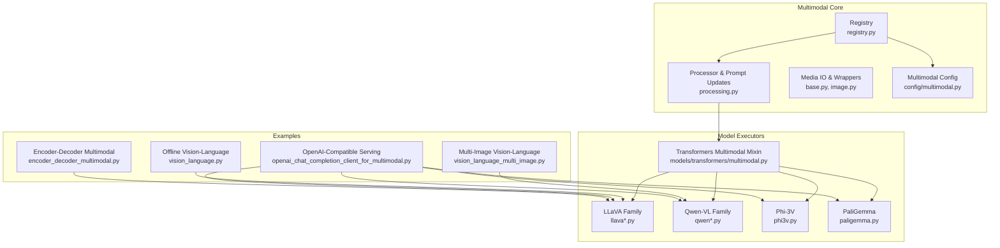
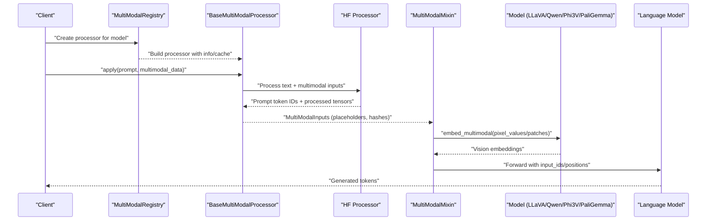
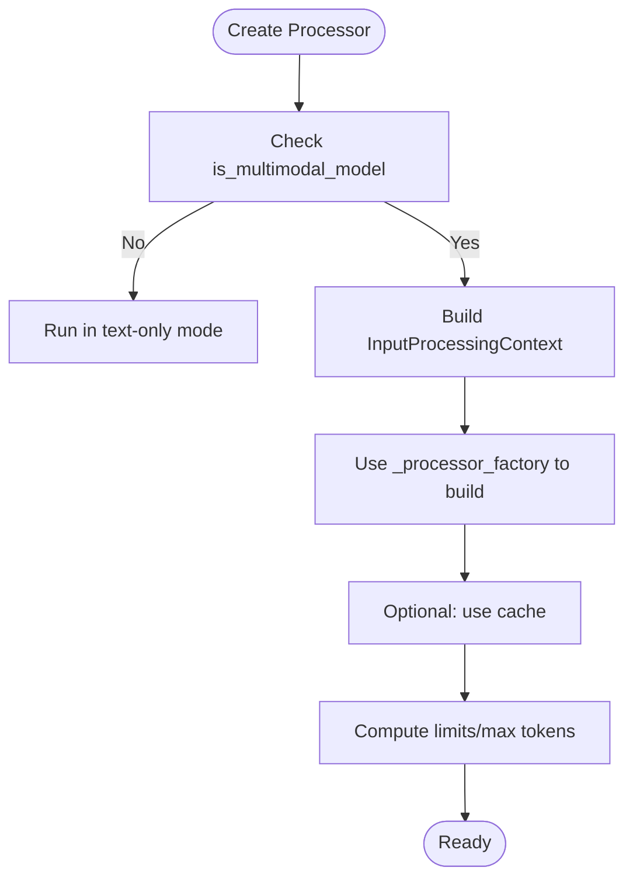
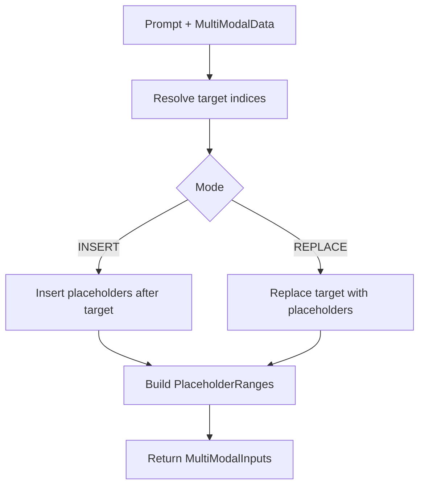
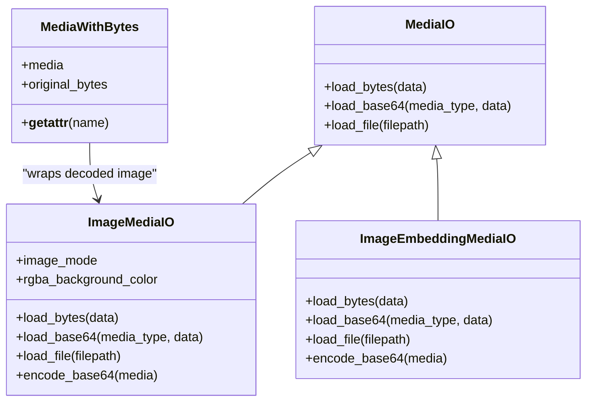
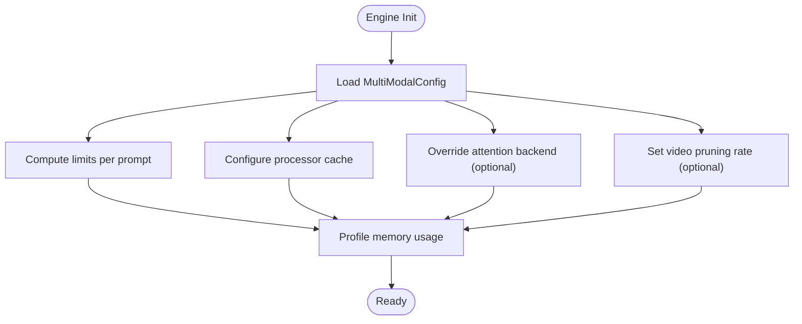
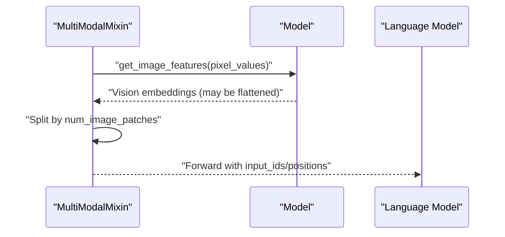
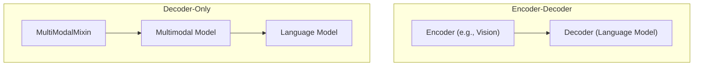
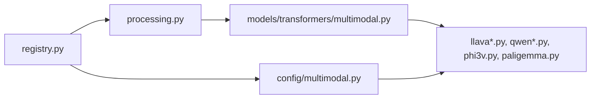

# Multimodal Transformer Models

<cite>
**Referenced Files in This Document**
- [__init__.py](file://vllm/multimodal/__init__.py)
- [base.py](file://vllm/multimodal/base.py)
- [image.py](file://vllm/multimodal/image.py)
- [processing.py](file://vllm/multimodal/processing.py)
- [registry.py](file://vllm/multimodal/registry.py)
- [multimodal.py](file://vllm/model_executor/models/transformers/multimodal.py)
- [multimodal.py](file://vllm/config/multimodal.py)
- [llava.py](file://vllm/model_executor/models/llava.py)
- [llava_next.py](file://vllm/model_executor/models/llava_next.py)
- [llava_onevision.py](file://vllm/model_executor/models/llava_onevision.py)
- [llava_next_video.py](file://vllm/model_executor/models/llava_next_video.py)
- [qwen.py](file://vllm/model_executor/models/qwen.py)
- [qwen2_5_vl.py](file://vllm/model_executor/models/qwen2_5_vl.py)
- [phi3v.py](file://vllm/model_executor/models/phi3v.py)
- [paligemma.py](file://vllm/model_executor/models/paligemma.py)
- [vision_language.py](file://examples/offline_inference/vision_language.py)
- [vision_language_multi_image.py](file://examples/offline_inference/vision_language_multi_image.py)
- [openai_chat_completion_client_for_multimodal.py](file://examples/online_serving/openai_chat_completion_client_for_multimodal.py)
- [encoder_decoder_multimodal.py](file://examples/offline_inference/encoder_decoder_multimodal.py)
- [mm_processing.md](file://docs/design/mm_processing.md)
- [multimodal_inputs.md](file://docs/features/multimodal_inputs.md)
- [generative_models.md](file://docs/models/generative_models.md)
- [supported_models.md](file://docs/models/supported_models.md)
- [bagel.py](file://vllm/model_executor/models/bagel.py)
- [step3_vl.py](file://vllm/model_executor/models/step3_vl.py)
</cite>

## Table of Contents
1. [Introduction](#introduction)
2. [Project Structure](#project-structure)
3. [Core Components](#core-components)
4. [Architecture Overview](#architecture-overview)
5. [Detailed Component Analysis](#detailed-component-analysis)
6. [Dependency Analysis](#dependency-analysis)
7. [Performance Considerations](#performance-considerations)
8. [Troubleshooting Guide](#troubleshooting-guide)
9. [Conclusion](#conclusion)
10. [Appendices](#appendices)

## Introduction
This document explains how vLLM implements multimodal transformer models, focusing on vision-language architectures such as LLaVA, LLaVA-NeXT, Qwen-VL, Phi-3V, and PaliGemma, as well as text-only models like BERT. It covers the integration of visual encoders (ViTs, CLIP backbones) with language models, cross-attention mechanisms, and modality-specific preprocessing. It documents image processing pipelines, tokenization strategies for multimodal inputs, memory management for combined visual and textual data, and attention backends optimized for multimodal workloads. Practical examples illustrate model loading, visual feature extraction, and joint generation workflows. Finally, it addresses hardware considerations for GPU memory usage, mixed precision strategies, and scaling multimodal inference, and explains architectural differences between encoder-decoder and decoder-only multimodal designs.

## Project Structure
The multimodal stack in vLLM is organized around:
- A registry-driven processor pipeline that converts raw inputs into tokenized prompts and model-ready tensors.
- A configuration subsystem controlling multimodal limits, processor caching, and attention backends.
- Model executors implementing multimodal mixins and embedding interfaces for vision-language models.
- Examples demonstrating end-to-end multimodal inference for various architectures.

**Diagram sources**
- [registry.py](file://vllm/multimodal/registry.py#L91-L171)
- [processing.py](file://vllm/multimodal/processing.py#L290-L360)
- [multimodal.py](file://vllm/model_executor/models/transformers/multimodal.py#L265-L412)
- [multimodal.py](file://vllm/config/multimodal.py#L53-L143)
- [llava.py](file://vllm/model_executor/models/llava.py)
- [llava_next.py](file://vllm/model_executor/models/llava_next.py)
- [llava_onevision.py](file://vllm/model_executor/models/llava_onevision.py)
- [llava_next_video.py](file://vllm/model_executor/models/llava_next_video.py)
- [qwen.py](file://vllm/model_executor/models/qwen.py)
- [qwen2_5_vl.py](file://vllm/model_executor/models/qwen2_5_vl.py)
- [phi3v.py](file://vllm/model_executor/models/phi3v.py)
- [paligemma.py](file://vllm/model_executor/models/paligemma.py)
- [vision_language.py](file://examples/offline_inference/vision_language.py#L912-L980)
- [vision_language_multi_image.py](file://examples/offline_inference/vision_language_multi_image.py#L969-L985)
- [openai_chat_completion_client_for_multimodal.py](file://examples/online_serving/openai_chat_completion_client_for_multimodal.py)
- [encoder_decoder_multimodal.py](file://examples/offline_inference/encoder_decoder_multimodal.py)

**Section sources**
- [__init__.py](file://vllm/multimodal/__init__.py#L1-L41)
- [registry.py](file://vllm/multimodal/registry.py#L91-L171)
- [processing.py](file://vllm/multimodal/processing.py#L290-L360)
- [multimodal.py](file://vllm/model_executor/models/transformers/multimodal.py#L265-L412)
- [multimodal.py](file://vllm/config/multimodal.py#L53-L143)

## Core Components
- Registry and Processor Pipeline: The registry creates processors tailored to each model class, enabling prompt updates, placeholder detection, and multimodal field configuration. It also computes memory limits and supports encoder-decoder specifics.
- Prompt Updates and Placeholders: The processing module defines insertion and replacement strategies for multimodal placeholders, with tokenization-aware matching and content selection.
- Media IO and Wrappers: Utilities handle image decoding, mode conversion, and embedding tensors, ensuring robust preprocessing and safety checks.
- Multimodal Configuration: Controls limits per prompt, processor caching, attention backend overrides, and pruning options for video.
- Multimodal Mixin: Provides embedding interfaces, MRoPE position computation, and language model wrapping for transformer-based multimodal models.

**Section sources**
- [registry.py](file://vllm/multimodal/registry.py#L91-L171)
- [processing.py](file://vllm/multimodal/processing.py#L290-L360)
- [processing.py](file://vllm/multimodal/processing.py#L415-L490)
- [processing.py](file://vllm/multimodal/processing.py#L518-L606)
- [processing.py](file://vllm/multimodal/processing.py#L693-L800)
- [image.py](file://vllm/multimodal/image.py#L1-L143)
- [multimodal.py](file://vllm/model_executor/models/transformers/multimodal.py#L265-L412)
- [multimodal.py](file://vllm/config/multimodal.py#L53-L143)

## Architecture Overview
The end-to-end flow integrates raw inputs (images, text) with model-specific processors, tokenization, and embedding projection into the language model backbone.

**Diagram sources**
- [registry.py](file://vllm/multimodal/registry.py#L252-L271)
- [processing.py](file://vllm/multimodal/processing.py#L167-L263)
- [multimodal.py](file://vllm/model_executor/models/transformers/multimodal.py#L333-L367)
- [multimodal.py](file://vllm/model_executor/models/transformers/multimodal.py#L296-L311)

## Detailed Component Analysis

### Registry and Processor Lifecycle
- Processor creation and caching: The registry constructs processors from model classes, caches them, and exposes helpers to compute multimodal limits and dummy data for profiling.
- Encoder-decoder support: Dedicated helpers compute maximum encoder input lengths for encoder-decoder multimodal models.
- Dummy data builders: Provide representative inputs for memory profiling, including multimodal tokens derived from processor metadata.

**Diagram sources**
- [registry.py](file://vllm/multimodal/registry.py#L117-L171)
- [registry.py](file://vllm/multimodal/registry.py#L252-L271)
- [registry.py](file://vllm/multimodal/registry.py#L305-L358)

**Section sources**
- [registry.py](file://vllm/multimodal/registry.py#L91-L171)
- [registry.py](file://vllm/multimodal/registry.py#L252-L271)
- [registry.py](file://vllm/multimodal/registry.py#L305-L358)

### Prompt Updates and Placeholder Management
- PromptInsertion and PromptReplacement define how multimodal placeholders are inserted or replaced in tokenized prompts.
- Matching and replacement logic supports both token IDs and text targets, with prioritization and conflict avoidance.
- PlaceholderRanges capture the offsets and embedding masks for each multimodal item.

**Diagram sources**
- [processing.py](file://vllm/multimodal/processing.py#L346-L490)
- [processing.py](file://vllm/multimodal/processing.py#L518-L606)
- [processing.py](file://vllm/multimodal/processing.py#L693-L800)

**Section sources**
- [processing.py](file://vllm/multimodal/processing.py#L290-L360)
- [processing.py](file://vllm/multimodal/processing.py#L415-L490)
- [processing.py](file://vllm/multimodal/processing.py#L518-L606)
- [processing.py](file://vllm/multimodal/processing.py#L693-L800)

### Image Preprocessing and Media IO
- ImageMediaIO handles decoding from bytes/base64/file, mode conversion (including RGBA to RGB), and optional background color control.
- ImageEmbeddingMediaIO loads dense embeddings from binary or base64, with integrity checks for sparse tensors.
- MediaWithBytes ensures raw bytes synchronization with decoded media to prevent cache corruption.

**Diagram sources**
- [image.py](file://vllm/multimodal/image.py#L46-L143)
- [base.py](file://vllm/multimodal/base.py#L14-L40)

**Section sources**
- [image.py](file://vllm/multimodal/image.py#L1-L143)
- [base.py](file://vllm/multimodal/base.py#L14-L40)

### Multimodal Configuration and Memory Management
- Limit per prompt: Controls maximum number of inputs per modality, supporting both legacy counts and advanced options (e.g., image width/height).
- Processor cache: Configurable cache size/type (LRU or shared memory) to avoid reprocessing past multimodal inputs.
- Attention backend override: Optional override for vision transformer attention backends.
- Pruning for video: Optional pruning rate for Efficient Video Sampling.

**Diagram sources**
- [multimodal.py](file://vllm/config/multimodal.py#L53-L143)
- [multimodal.py](file://vllm/config/multimodal.py#L195-L214)

**Section sources**
- [multimodal.py](file://vllm/config/multimodal.py#L53-L143)
- [multimodal.py](file://vllm/config/multimodal.py#L195-L214)

### Multimodal Mixin and Embedding Interface
- Embedding interface: Converts pixel values or precomputed embeddings into model-ready vision embeddings, splitting concatenated outputs by patch counts.
- MRoPE integration: Computes multi-resolution RoPE indices for images and videos using model-specific rope index functions.
- Language model wrapping: Exposes a language model interface for transformer-based multimodal models.

**Diagram sources**
- [multimodal.py](file://vllm/model_executor/models/transformers/multimodal.py#L333-L367)
- [multimodal.py](file://vllm/model_executor/models/transformers/multimodal.py#L368-L412)

**Section sources**
- [multimodal.py](file://vllm/model_executor/models/transformers/multimodal.py#L265-L412)

### Vision-Language Models in vLLM

#### LLaVA and LLaVA-NeXT
- Model families supported via multimodal executors and examples.
- Examples demonstrate loading and inference for LLaVA-1.5, LLaVA-1.6/NeXT, and LLaVA-OneVision.

**Section sources**
- [vision_language.py](file://examples/offline_inference/vision_language.py#L912-L980)
- [llava.py](file://vllm/model_executor/models/llava.py)
- [llava_next.py](file://vllm/model_executor/models/llava_next.py)
- [llava_onevision.py](file://vllm/model_executor/models/llava_onevision.py)
- [llava_next_video.py](file://vllm/model_executor/models/llava_next_video.py)

#### Qwen-VL
- Examples show loading Qwen-VL and Qwen-VL-Chat, including multi-image scenarios and special prompt formats.

**Section sources**
- [vision_language.py](file://examples/offline_inference/vision_language.py#L1483-L1490)
- [vision_language_multi_image.py](file://examples/offline_inference/vision_language_multi_image.py#L969-L985)
- [qwen.py](file://vllm/model_executor/models/qwen.py)
- [qwen2_5_vl.py](file://vllm/model_executor/models/qwen2_5_vl.py)

#### Phi-3V
- Examples demonstrate Phi-3V usage in OpenAI-compatible serving.

**Section sources**
- [openai_chat_completion_client_for_multimodal.py](file://examples/online_serving/openai_chat_completion_client_for_multimodal.py)
- [phi3v.py](file://vllm/model_executor/models/phi3v.py)

#### PaliGemma
- Examples include PaliGemma and PaliGemma 2 with special prompt formats for VQA.

**Section sources**
- [vision_language.py](file://examples/offline_inference/vision_language.py#L1321-L1342)
- [paligemma.py](file://vllm/model_executor/models/paligemma.py)

#### BERT (Text-only)
- Text-only models like BERT are supported alongside multimodal models; examples exist for text-only tasks.

**Section sources**
- [generative_models.md](file://docs/models/generative_models.md)
- [supported_models.md](file://docs/models/supported_models.md)

### Encoder-Decoder vs Decoder-Only Multimodal Designs
- Encoder-decoder multimodal models: The registry exposes helpers to compute maximum encoder input length for encoder-decoder multimodal models, constraining the number of tokens from the encoder’s modality.
- Decoder-only multimodal models: Integrated into the language model backbone via multimodal mixins and embedding interfaces.

**Diagram sources**
- [registry.py](file://vllm/multimodal/registry.py#L339-L358)
- [multimodal.py](file://vllm/model_executor/models/transformers/multimodal.py#L265-L311)

**Section sources**
- [registry.py](file://vllm/multimodal/registry.py#L339-L358)
- [multimodal.py](file://vllm/model_executor/models/transformers/multimodal.py#L265-L311)

### Specialized Architectures and Positional Encoding
- BAGEL-style positional encoding: Demonstrates grid-based positional IDs computed from patch grids and added to vision embeddings.
- Step3 Vision Transformer: Conditional instantiation of vision backbones and downsamplers, projecting to language model hidden size.

**Section sources**
- [bagel.py](file://vllm/model_executor/models/bagel.py#L468-L499)
- [step3_vl.py](file://vllm/model_executor/models/step3_vl.py#L945-L980)

## Dependency Analysis
The multimodal stack exhibits clear separation of concerns:
- Registry depends on model architecture discovery and tokenizer caching.
- Processor depends on HF processor utilities and tokenizer-like interfaces.
- Mixin depends on model internals for embedding and MRoPE computations.
- Configuration influences attention backends and caching behavior.

**Diagram sources**
- [registry.py](file://vllm/multimodal/registry.py#L223-L271)
- [processing.py](file://vllm/multimodal/processing.py#L167-L263)
- [multimodal.py](file://vllm/model_executor/models/transformers/multimodal.py#L265-L311)
- [multimodal.py](file://vllm/config/multimodal.py#L124-L128)

**Section sources**
- [registry.py](file://vllm/multimodal/registry.py#L223-L271)
- [processing.py](file://vllm/multimodal/processing.py#L167-L263)
- [multimodal.py](file://vllm/model_executor/models/transformers/multimodal.py#L265-L311)
- [multimodal.py](file://vllm/config/multimodal.py#L124-L128)

## Performance Considerations
- Attention backends: Optional override for vision transformer attention backends allows selecting optimal kernels for the hardware.
- Processor caching: Shared memory or LRU caches reduce repeated preprocessing costs.
- Pruning for video: Efficient Video Sampling reduces token counts by pruning a fraction of frames/tokens.
- Mixed precision: While not explicitly documented here, vLLM’s broader attention and kernel subsystems support FP16/BF16 pathways; consult attention backends and kernels for hardware-specific acceleration.
- Scaling: Tensor-parallel encoder modes (“weights” vs “data”) enable parallelizing encoder inference across ranks.

**Section sources**
- [multimodal.py](file://vllm/config/multimodal.py#L124-L128)
- [multimodal.py](file://vllm/config/multimodal.py#L95-L111)
- [multimodal.py](file://vllm/config/multimodal.py#L138-L143)
- [multimodal.py](file://vllm/config/multimodal.py#L111-L124)

## Troubleshooting Guide
- Multimodal disabled: If all supported modalities have zero limits, the system runs in text-only mode; verify multimodal configuration.
- Incorrect embedding shapes: Enabling multimodal embeddings requires correct tensor shapes; incorrect shapes may cause crashes.
- Attention backend removal: XFORMERS backend is unsupported; choose a supported backend.
- Processor cache misconfiguration: SHM cache parameters are only effective when using shared memory cache type.

**Section sources**
- [registry.py](file://vllm/multimodal/registry.py#L117-L144)
- [multimodal.py](file://vllm/config/multimodal.py#L74-L82)
- [multimodal.py](file://vllm/config/multimodal.py#L164-L182)
- [multimodal.py](file://vllm/config/multimodal.py#L183-L194)

## Conclusion
vLLM’s multimodal stack provides a robust, extensible framework for integrating visual encoders with language models. The registry-driven processor pipeline, prompt update mechanisms, and embedding interfaces enable seamless handling of diverse architectures such as LLaVA, LLaVA-NeXT, Qwen-VL, Phi-3V, and PaliGemma. With configurable caching, attention backend overrides, and pruning strategies, vLLM supports efficient and scalable multimodal inference across varied hardware configurations.

## Appendices

### Practical Examples Index
- Offline vision-language examples: Loading and running LLaVA, Qwen-VL, and Phi-3V.
- Online serving example: OpenAI-compatible client for multimodal models.
- Encoder-decoder multimodal example: Demonstrates encoder-decoder workflows.

**Section sources**
- [vision_language.py](file://examples/offline_inference/vision_language.py#L912-L980)
- [vision_language.py](file://examples/offline_inference/vision_language.py#L1321-L1342)
- [vision_language.py](file://examples/offline_inference/vision_language.py#L1483-L1490)
- [vision_language_multi_image.py](file://examples/offline_inference/vision_language_multi_image.py#L969-L985)
- [openai_chat_completion_client_for_multimodal.py](file://examples/online_serving/openai_chat_completion_client_for_multimodal.py)
- [encoder_decoder_multimodal.py](file://examples/offline_inference/encoder_decoder_multimodal.py)

### Design Documents
- Multimodal processing design: Concepts and workflows for multimodal input processing.
- Multimodal inputs feature: API and usage guidance for multimodal inputs.

**Section sources**
- [mm_processing.md](file://docs/design/mm_processing.md)
- [multimodal_inputs.md](file://docs/features/multimodal_inputs.md)