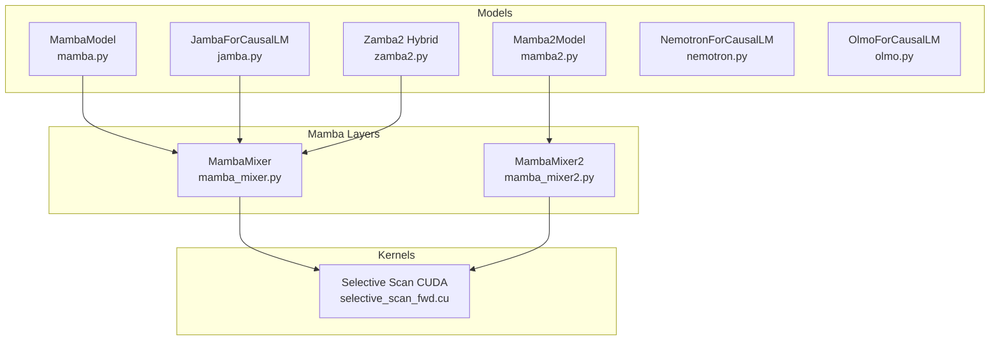
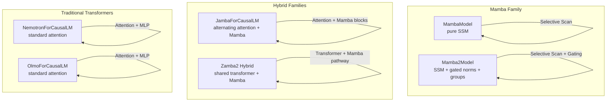
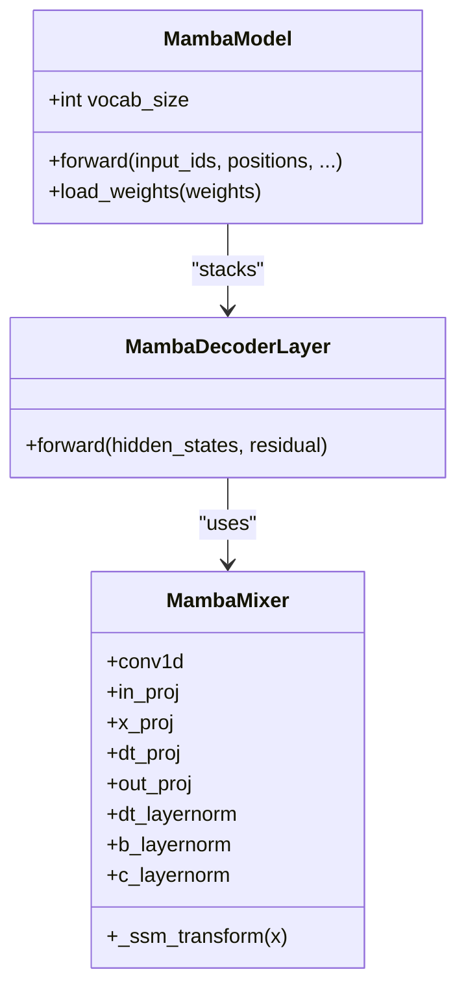
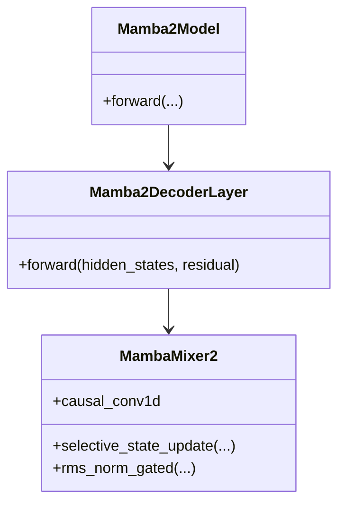
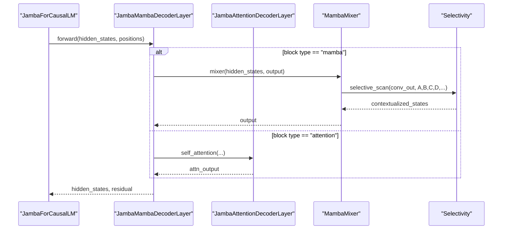
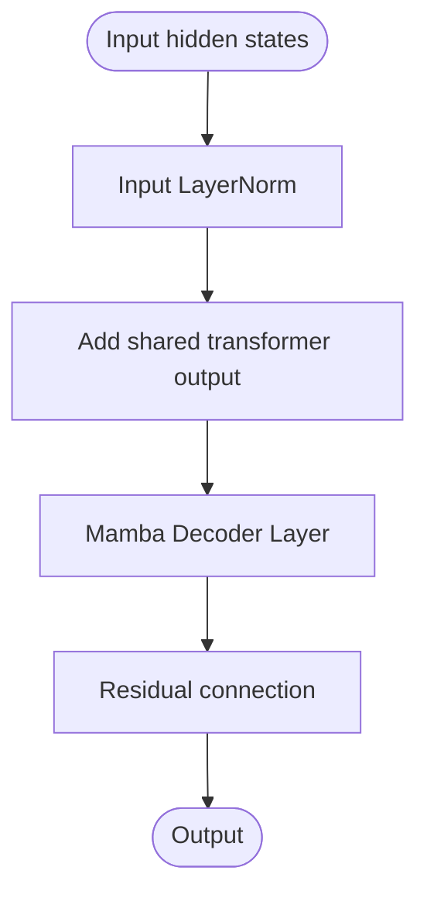
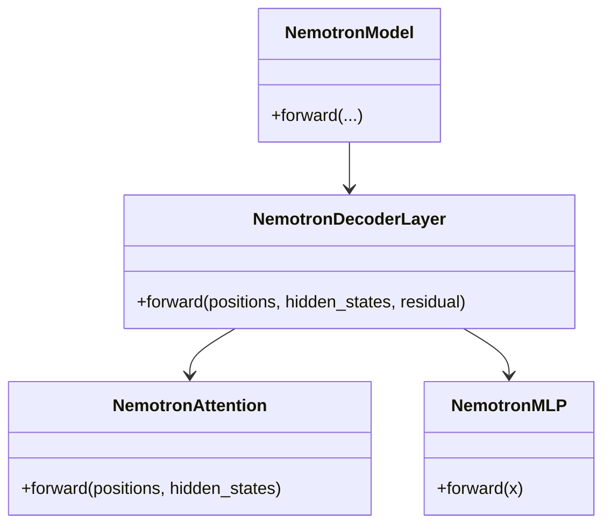
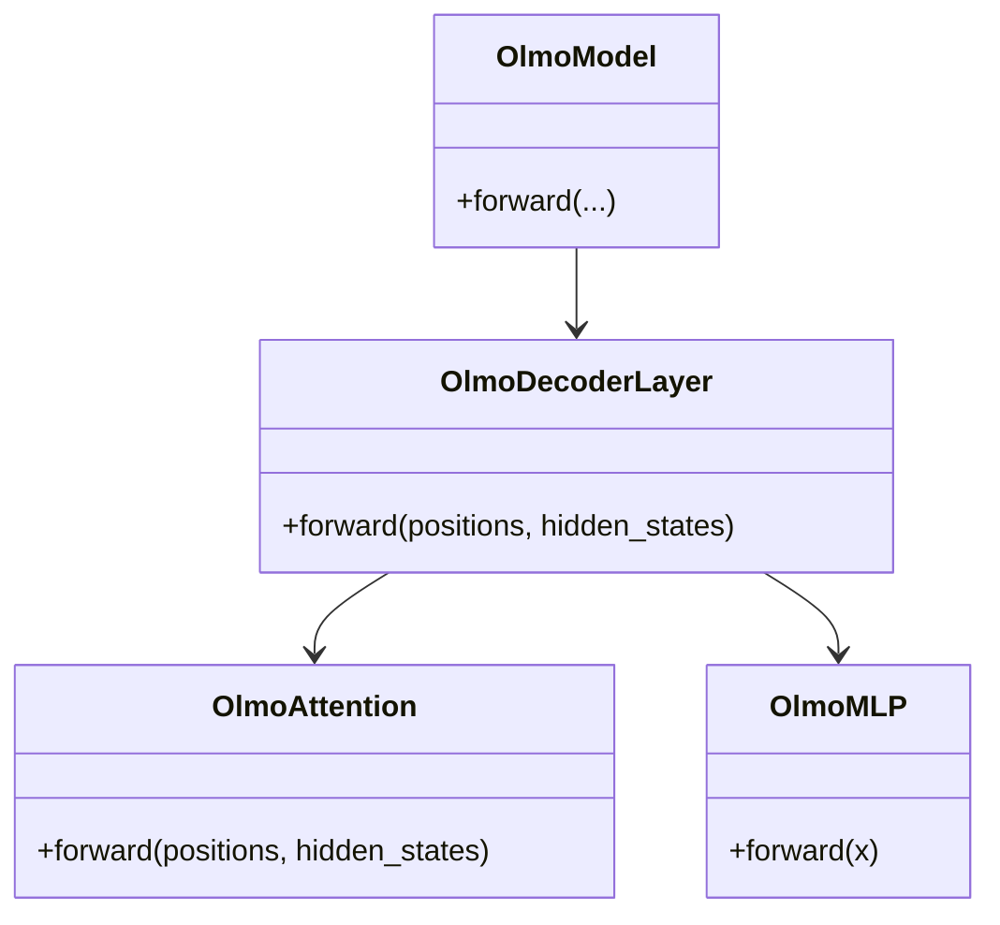
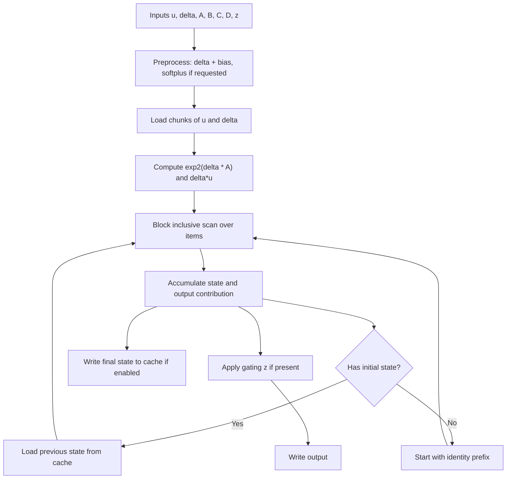
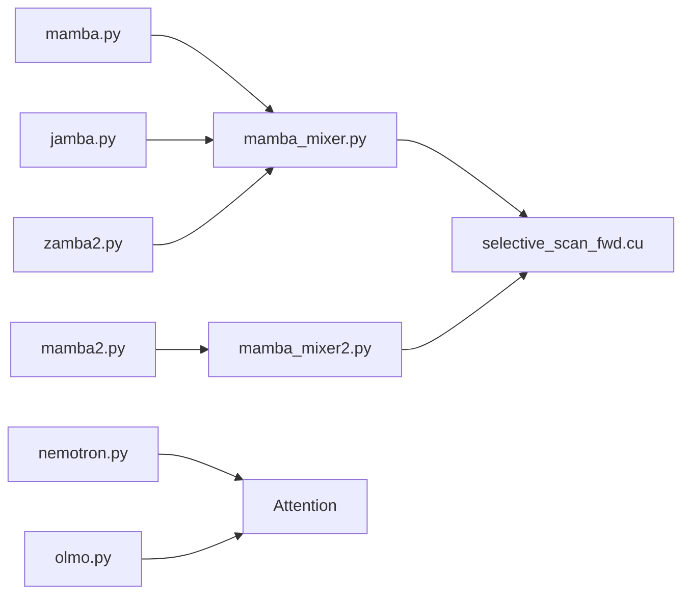

# Specialized Transformer Architectures

<cite>
**Referenced Files in This Document**
- [mamba.py](file://vllm/model_executor/models/mamba.py)
- [mamba2.py](file://vllm/model_executor/models/mamba2.py)
- [jamba.py](file://vllm/model_executor/models/jamba.py)
- [zamba2.py](file://vllm/model_executor/models/zamba2.py)
- [nemotron.py](file://vllm/model_executor/models/nemotron.py)
- [olmo.py](file://vllm/model_executor/models/olmo.py)
- [mamba_mixer.py](file://vllm/model_executor/layers/mamba/mamba_mixer.py)
- [mamba_mixer2.py](file://vllm/model_executor/layers/mamba/mamba_mixer2.py)
- [selective_scan_fwd.cu](file://csrc/mamba/mamba_ssm/selective_scan_fwd.cu)
- [test_mamba_ssm.py](file://tests/kernels/mamba/test_mamba_ssm.py)
- [jamba_tool_parser.py](file://tests/tool_parsers/test_jamba_tool_parser.py)
</cite>

## Table of Contents
1. [Introduction](#introduction)
2. [Project Structure](#project-structure)
3. [Core Components](#core-components)
4. [Architecture Overview](#architecture-overview)
5. [Detailed Component Analysis](#detailed-component-analysis)
6. [Dependency Analysis](#dependency-analysis)
7. [Performance Considerations](#performance-considerations)
8. [Troubleshooting Guide](#trrobleshooting-guide)
9. [Conclusion](#conclusion)
10. [Appendices](#appendices)

## Introduction
This document explains specialized transformer architectures implemented in vLLM, focusing on Mamba (State Space Models), Mamba2, hybrid Jamba (Mamba-Transformer), Nemotron, OLMo, and Phi-series models. It details how these models depart from traditional attention mechanisms, how State Space Model computations and selective scan operations are implemented, and how hybrid Mamba-Transformer layers are structured. Practical guidance is included for loading specialized models, leveraging unique attention/backends, and optimizing memory and compute performance.

## Project Structure
The specialized architectures are implemented across model definitions, layer mixins, and CUDA kernels:
- Model backbones: Mamba, Mamba2, Jamba, Zamba2, Nemotron, OLMo, Phi-series
- Mamba-specific layers and operators: Mamba mixer, selective scan, convolution
- CUDA kernels for selective scan and related primitives
- Tests validating selective scan correctness and hybrid behavior

**Diagram sources**
- [mamba.py](file://vllm/model_executor/models/mamba.py#L1-L277)
- [mamba2.py](file://vllm/model_executor/models/mamba2.py#L1-L289)
- [jamba.py](file://vllm/model_executor/models/jamba.py#L1-L610)
- [zamba2.py](file://vllm/model_executor/models/zamba2.py#L541-L649)
- [mamba_mixer.py](file://vllm/model_executor/layers/mamba/mamba_mixer.py#L1-L200)
- [mamba_mixer2.py](file://vllm/model_executor/layers/mamba/mamba_mixer2.py#L1-L200)
- [selective_scan_fwd.cu](file://csrc/mamba/mamba_ssm/selective_scan_fwd.cu#L1-L791)

**Section sources**
- [mamba.py](file://vllm/model_executor/models/mamba.py#L1-L277)
- [mamba2.py](file://vllm/model_executor/models/mamba2.py#L1-L289)
- [jamba.py](file://vllm/model_executor/models/jamba.py#L1-L610)
- [zamba2.py](file://vllm/model_executor/models/zamba2.py#L541-L649)
- [mamba_mixer.py](file://vllm/model_executor/layers/mamba/mamba_mixer.py#L1-L200)
- [mamba_mixer2.py](file://vllm/model_executor/layers/mamba/mamba_mixer2.py#L1-L200)
- [selective_scan_fwd.cu](file://csrc/mamba/mamba_ssm/selective_scan_fwd.cu#L1-L791)

## Core Components
- Mamba backbone: Implements a pure Mamba stack with selective scan and convolution, supporting prefix caching and state shape/dtype calculation helpers.
- Mamba2 backbone: Extends Mamba with gated RMS norm and grouped attention-like structures, enabling hybrid MoE/attention pathways.
- Jamba hybrid: Alternates attention and Mamba blocks, with shared transformer and Mamba pathways and MoE routing.
- Zamba2 hybrid: Combines a shared transformer pathway with a Mamba pathway, adding transformer output to Mamba input.
- Nemotron: Standard transformer with LayerNorm variant, squared ReLU activation, and SwiGLU replacement.
- OLMo: Transformer with attention and SiLU-Mul MLP, using fused projections and rotary embeddings.
- Mamba mixers: Provide selective scan and convolution operations, parameter initialization, and KV-cache state management.
- Selective scan CUDA: Optimized kernel implementing the core SSM recurrence with variable-length and state caching.

Key implementation highlights:
- State Space Model (SSM) computation via selective scan with A, B, C, D parameters and optional gating.
- Convolutional preprocessing using causal convolution prior to selective scan.
- Hybrid designs combine linear-time Mamba with attention/MoE blocks.

**Section sources**
- [mamba.py](file://vllm/model_executor/models/mamba.py#L1-L277)
- [mamba2.py](file://vllm/model_executor/models/mamba2.py#L1-L289)
- [jamba.py](file://vllm/model_executor/models/jamba.py#L1-L610)
- [zamba2.py](file://vllm/model_executor/models/zamba2.py#L541-L649)
- [nemotron.py](file://vllm/model_executor/models/nemotron.py#L1-L500)
- [olmo.py](file://vllm/model_executor/models/olmo.py#L1-L413)
- [mamba_mixer.py](file://vllm/model_executor/layers/mamba/mamba_mixer.py#L1-L200)
- [mamba_mixer2.py](file://vllm/model_executor/layers/mamba/mamba_mixer2.py#L1-L200)
- [selective_scan_fwd.cu](file://csrc/mamba/mamba_ssm/selective_scan_fwd.cu#L1-L791)

## Architecture Overview
The specialized architectures replace or complement attention with linear-time selective scan and convolution. Mamba and Mamba2 operate on sequences via a recurrent SSM that depends on the current token and internal state. Jamba and Zamba2 integrate attention/MoE alongside Mamba for richer representation learning.

**Diagram sources**
- [mamba.py](file://vllm/model_executor/models/mamba.py#L1-L277)
- [mamba2.py](file://vllm/model_executor/models/mamba2.py#L1-L289)
- [jamba.py](file://vllm/model_executor/models/jamba.py#L1-L610)
- [zamba2.py](file://vllm/model_executor/models/zamba2.py#L541-L649)
- [nemotron.py](file://vllm/model_executor/models/nemotron.py#L1-L500)
- [olmo.py](file://vllm/model_executor/models/olmo.py#L1-L413)

## Detailed Component Analysis

### Mamba (State Space Models)
Mamba replaces attention with a selective scan over tokens. The model applies a convolution to input features, then runs an SSM recurrence to produce contextualized states, optionally gated and projected.

- Convolution: causal convolution applied to intermediate activations before selective scan.
- Selective scan: computes recurrence y_t = f(y_{t-1}, x_t, parameters) using A, B, C, D and optional z-gating.
- State handling: per-head/group state maintained across tokens; supports initial states and caching.

Practical notes:
- State dtype/shape helpers exposed for efficient cache allocation.
- Weight loading handles special names (e.g., A_log to A) and pipeline parallel missing parameters.

**Diagram sources**
- [mamba.py](file://vllm/model_executor/models/mamba.py#L1-L277)
- [mamba_mixer.py](file://vllm/model_executor/layers/mamba/mamba_mixer.py#L1-L200)

**Section sources**
- [mamba.py](file://vllm/model_executor/models/mamba.py#L1-L277)
- [mamba_mixer.py](file://vllm/model_executor/layers/mamba/mamba_mixer.py#L1-L200)

### Mamba2
Mamba2 extends Mamba with gated RMS norm and grouped structures. It integrates selective state updates with attention-like grouping and MoE routing in hybrid layers.

- Gated RMS norm: applies silu(gate) before normalization; supports group-wise reductions and tensor-parallel variants.
- Selective state update: optimized update kernel for incremental SSM computation.
- Hybrid integration: Jamba-style MoE and attention can be combined with Mamba2 blocks.

**Diagram sources**
- [mamba2.py](file://vllm/model_executor/models/mamba2.py#L1-L289)
- [mamba_mixer2.py](file://vllm/model_executor/layers/mamba/mamba_mixer2.py#L1-L200)

**Section sources**
- [mamba2.py](file://vllm/model_executor/models/mamba2.py#L1-L289)
- [mamba_mixer2.py](file://vllm/model_executor/layers/mamba/mamba_mixer2.py#L1-L200)

### Hybrid Jamba (Mamba-Transformer)
Jamba alternates attention and Mamba blocks, with MoE routing and optional attention-only layers.

- Layer selection: configured per-layer type (attention vs mamba).
- MoE routing: optional mixture-of-experts in attention or Mamba feed-forward.
- Hybrid residual: attention output can be routed through Mamba path in downstream layers.

**Diagram sources**
- [jamba.py](file://vllm/model_executor/models/jamba.py#L1-L610)
- [mamba_mixer.py](file://vllm/model_executor/layers/mamba/mamba_mixer.py#L1-L200)

**Section sources**
- [jamba.py](file://vllm/model_executor/models/jamba.py#L1-L610)

### Zamba2 Hybrid
Zamba2 combines a shared transformer pathway with a Mamba pathway, adding transformer output to Mamba input.

- Shared transformer: processes input independently and projects to hidden size.
- Addition: adds transformer output to Mamba input before selective scan.
- Final residual: residual connection after Mamba.

**Diagram sources**
- [zamba2.py](file://vllm/model_executor/models/zamba2.py#L541-L649)

**Section sources**
- [zamba2.py](file://vllm/model_executor/models/zamba2.py#L541-L649)

### Nemotron
Nemotron follows a standard transformer stack with a LayerNorm variant and squared ReLU activation.

- Norm variant: LayerNorm with a constant added to weights.
- MLP: single up-projection with squared ReLU activation and down-projection.
- Attention: QKV projection, rotary embeddings, scaled attention.

**Diagram sources**
- [nemotron.py](file://vllm/model_executor/models/nemotron.py#L1-L500)

**Section sources**
- [nemotron.py](file://vllm/model_executor/models/nemotron.py#L1-L500)

### OLMo
OLMo implements a standard transformer with attention and SiLU-Mul MLP.

- Attention: QKV fused projection, rotary embeddings, scaled attention.
- MLP: gate+up fused projection, SiLU-Mul activation, down-projection.

**Diagram sources**
- [olmo.py](file://vllm/model_executor/models/olmo.py#L1-L413)

**Section sources**
- [olmo.py](file://vllm/model_executor/models/olmo.py#L1-L413)

### Selective Scan Implementation and Kernels
The core SSM operation is implemented in CUDA with careful memory access patterns and shared memory usage.

- Variable-length support: query_start_loc enables ragged sequences.
- State caching: APC mode writes/reads cached states per slot.
- Launch configuration: kernel chooses thread/block/stride parameters based on sequence length.

**Diagram sources**
- [selective_scan_fwd.cu](file://csrc/mamba/mamba_ssm/selective_scan_fwd.cu#L1-L791)

**Section sources**
- [selective_scan_fwd.cu](file://csrc/mamba/mamba_ssm/selective_scan_fwd.cu#L1-L791)
- [test_mamba_ssm.py](file://tests/kernels/mamba/test_mamba_ssm.py#L91-L678)

### Practical Model Loading Examples
- Mamba: The model loads weights with special handling for A_log to A and pipeline-parallel missing parameters.
- Jamba: Uses a mapper to normalize Hugging Face weight keys and stacks QKV gates appropriately.
- Nemotron/OLMo: Standard attention stacks with packed module mappings for QKV and gate/up projections.

Loading guidance:
- Use the model’s built-in load_weights method to handle sharding, missing layers, and packed projections.
- For hybrid models, ensure attention and MoE weights are mapped correctly.

**Section sources**
- [mamba.py](file://vllm/model_executor/models/mamba.py#L171-L188)
- [jamba.py](file://vllm/model_executor/models/jamba.py#L457-L569)
- [nemotron.py](file://vllm/model_executor/models/nemotron.py#L368-L423)
- [olmo.py](file://vllm/model_executor/models/olmo.py#L303-L339)

### Memory Optimization Strategies
- Prefix caching: Mamba backbones expose state dtype/shape calculators to allocate minimal cache sizes.
- Tensor parallel sharding: Linear projections and RMS norms are partitioned across TP ranks.
- Mixed-precision: Selective scan supports half/bfloat16 inputs with float32 accumulation for stability.
- Grouped attention in Mamba2: Reduces cross-head communication and can improve throughput.

**Section sources**
- [mamba.py](file://vllm/model_executor/models/mamba.py#L238-L277)
- [mamba2.py](file://vllm/model_executor/models/mamba2.py#L188-L289)
- [mamba_mixer2.py](file://vllm/model_executor/layers/mamba/mamba_mixer2.py#L1-L200)

## Dependency Analysis
The specialized models depend on:
- Mamba mixers for selective scan and convolution
- Attention layers for hybrid architectures
- CUDA kernels for efficient SSM computation
- Utility modules for state shape/dtype calculation and weight loading

**Diagram sources**
- [mamba.py](file://vllm/model_executor/models/mamba.py#L1-L277)
- [mamba2.py](file://vllm/model_executor/models/mamba2.py#L1-L289)
- [jamba.py](file://vllm/model_executor/models/jamba.py#L1-L610)
- [zamba2.py](file://vllm/model_executor/models/zamba2.py#L541-L649)
- [mamba_mixer.py](file://vllm/model_executor/layers/mamba/mamba_mixer.py#L1-L200)
- [mamba_mixer2.py](file://vllm/model_executor/layers/mamba/mamba_mixer2.py#L1-L200)
- [selective_scan_fwd.cu](file://csrc/mamba/mamba_ssm/selective_scan_fwd.cu#L1-L791)
- [nemotron.py](file://vllm/model_executor/models/nemotron.py#L1-L500)
- [olmo.py](file://vllm/model_executor/models/olmo.py#L1-L413)

**Section sources**
- [mamba.py](file://vllm/model_executor/models/mamba.py#L1-L277)
- [mamba2.py](file://vllm/model_executor/models/mamba2.py#L1-L289)
- [jamba.py](file://vllm/model_executor/models/jamba.py#L1-L610)
- [zamba2.py](file://vllm/model_executor/models/zamba2.py#L541-L649)
- [mamba_mixer.py](file://vllm/model_executor/layers/mamba/mamba_mixer.py#L1-L200)
- [mamba_mixer2.py](file://vllm/model_executor/layers/mamba/mamba_mixer2.py#L1-L200)
- [selective_scan_fwd.cu](file://csrc/mamba/mamba_ssm/selective_scan_fwd.cu#L1-L791)
- [nemotron.py](file://vllm/model_executor/models/nemotron.py#L1-L500)
- [olmo.py](file://vllm/model_executor/models/olmo.py#L1-L413)

## Performance Considerations
- Memory footprint:
  - Mamba: state size grows linearly with sequence length; caching reduces recomputation.
  - Attention: quadratic in sequence length; Mamba offers linear-time alternatives.
- Compute efficiency:
  - Selective scan kernel is optimized for shared memory and block scans; launch configs adapt to sequence length.
  - Mamba2 gated norms enable fused computation patterns.
- Scalability:
  - Tensor parallel sharding of projections and RMS norms scales across devices.
  - Hybrid Jamba layers can route tokens through MoE to balance compute.

[No sources needed since this section provides general guidance]

## Troubleshooting Guide
Common issues and resolutions:
- Incorrect state dtype/shape: Verify state dtype/shape calculations for Mamba backbones; ensure cache_config matches model dtype.
- Weight loading mismatches: Use model-specific load_weights and mapper for Jamba; ensure packed module mappings for attention/MLP.
- Selective scan errors:
  - Validate input layouts and strides (contiguous last dimension).
  - Confirm dstate limits and variable-B/C shapes for ragged sequences.
  - Check pad_slot_id and cache indices for APC mode.

Validation resources:
- Reference selective scan behavior against test implementations that split sequences and compare outputs.

**Section sources**
- [mamba.py](file://vllm/model_executor/models/mamba.py#L238-L277)
- [jamba.py](file://vllm/model_executor/models/jamba.py#L457-L569)
- [selective_scan_fwd.cu](file://csrc/mamba/mamba_ssm/selective_scan_fwd.cu#L619-L791)
- [test_mamba_ssm.py](file://tests/kernels/mamba/test_mamba_ssm.py#L91-L678)

## Conclusion
vLLM implements specialized transformer architectures that move beyond attention to linear-time selective scan (Mamba, Mamba2), while also supporting hybrid designs (Jamba, Zamba2) and traditional transformer baselines (Nemotron, OLMo). The CUDA selective scan kernel and hybrid layer designs enable scalable, memory-efficient inference. Proper model loading, state caching, and mixed-precision configurations are essential for optimal performance.

[No sources needed since this section summarizes without analyzing specific files]

## Appendices
- Tool parser tests for Jamba demonstrate hybrid tool-use parsing patterns in hybrid architectures.

**Section sources**
- [jamba_tool_parser.py](file://tests/tool_parsers/test_jamba_tool_parser.py)