# Transformer-Based LLMs

<cite>
**Referenced Files in This Document**
- [README.md](file://README.md)
- [vllm/model_executor/models/__init__.py](file://vllm/model_executor/models/__init__.py)
- [vllm/model_executor/models/llama.py](file://vllm/model_executor/models/llama.py)
- [vllm/model_executor/models/qwen.py](file://vllm/model_executor/models/qwen.py)
- [vllm/model_executor/models/chatglm.py](file://vllm/model_executor/models/chatglm.py)
- [vllm/model_executor/models/gemma.py](file://vllm/model_executor/models/gemma.py)
- [vllm/model_executor/models/falcon.py](file://vllm/model_executor/models/falcon.py)
- [vllm/model_executor/models/opt.py](file://vllm/model_executor/models/opt.py)
- [vllm/attention/selector.py](file://vllm/attention/selector.py)
- [vllm/config/cache.py](file://vllm/config/cache.py)
- [vllm/model_executor/model_loader/__init__.py](file://vllm/model_executor/model_loader/__init__.py)
- [vllm/model_executor/utils.py](file://vllm/model_executor/utils.py)
</cite>

## Table of Contents
1. [Introduction](#introduction)
2. [Project Structure](#project-structure)
3. [Core Components](#core-components)
4. [Architecture Overview](#architecture-overview)
5. [Detailed Component Analysis](#detailed-component-analysis)
6. [Dependency Analysis](#dependency-analysis)
7. [Performance Considerations](#performance-considerations)
8. [Troubleshooting Guide](#troubleshooting-guide)
9. [Conclusion](#conclusion)
10. [Appendices](#appendices)

## Introduction
This document explains the transformer-based large language models in vLLM, focusing on the foundational architecture of decoder-only transformers and how vLLM implements them efficiently. It covers model loading mechanisms, parameter initialization strategies, memory optimization techniques, attention backend selection logic, and KV cache management. Practical examples demonstrate model registration, custom transformer model implementation, and architecture-specific optimizations. Finally, it connects transformer configurations to performance characteristics such as attention head optimization, feed-forward efficiency, and activation function choices.

## Project Structure
At a high level, vLLM organizes transformer-related code into:
- Model executors and model families: decoder-only transformer implementations for Llama, Qwen, Gemma, ChatGLM, Falcon, OPT, and many others.
- Attention subsystem: backend selection, KV cache configuration, and PagedAttention integration.
- Model loader: unified entry points for loading weights from various sources and formats.
- Utilities: packing module mappings, expert routing, and platform-aware weight loading.

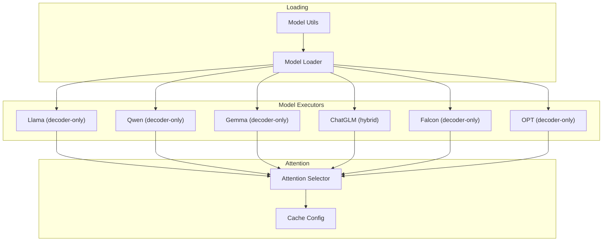

**Diagram sources**
- [vllm/model_executor/models/llama.py](file://vllm/model_executor/models/llama.py#L1-L120)
- [vllm/model_executor/models/qwen.py](file://vllm/model_executor/models/qwen.py#L1-L120)
- [vllm/model_executor/models/gemma.py](file://vllm/model_executor/models/gemma.py#L1-L120)
- [vllm/model_executor/models/chatglm.py](file://vllm/model_executor/models/chatglm.py#L1-L120)
- [vllm/model_executor/models/falcon.py](file://vllm/model_executor/models/falcon.py#L1-L120)
- [vllm/model_executor/models/opt.py](file://vllm/model_executor/models/opt.py#L1-L120)
- [vllm/attention/selector.py](file://vllm/attention/selector.py#L1-L120)
- [vllm/config/cache.py](file://vllm/config/cache.py#L1-L120)
- [vllm/model_executor/model_loader/__init__.py](file://vllm/model_executor/model_loader/__init__.py#L1-L120)
- [vllm/model_executor/utils.py](file://vllm/model_executor/utils.py#L1-L120)

**Section sources**
- [README.md](file://README.md#L70-L110)
- [vllm/model_executor/models/__init__.py](file://vllm/model_executor/models/__init__.py#L1-L45)

## Core Components
- Decoder-only transformer families: Llama, Qwen, Gemma, Falcon, OPT, and others are implemented as decoder-only models with attention and feed-forward sublayers.
- Attention backend selection: vLLM selects an attention backend based on head size, dtype, KV cache dtype, block size, and architecture-specific flags.
- KV cache configuration: block size, data type, sliding window, prefix caching, and offloading are configured centrally.
- Model loading: a unified loader abstraction supports multiple formats (HF, GGUF, bitsandbytes, sharded state, etc.) and architecture-specific weight mapping.

Key implementation references:
- Attention selector and backend resolution: [vllm/attention/selector.py](file://vllm/attention/selector.py#L1-L146)
- KV cache configuration: [vllm/config/cache.py](file://vllm/config/cache.py#L1-L233)
- Model loader registry and factory: [vllm/model_executor/model_loader/__init__.py](file://vllm/model_executor/model_loader/__init__.py#L1-L151)
- Packing module mappings and weight utilities: [vllm/model_executor/utils.py](file://vllm/model_executor/utils.py#L1-L120)

**Section sources**
- [vllm/attention/selector.py](file://vllm/attention/selector.py#L1-L146)
- [vllm/config/cache.py](file://vllm/config/cache.py#L1-L233)
- [vllm/model_executor/model_loader/__init__.py](file://vllm/model_executor/model_loader/__init__.py#L1-L151)
- [vllm/model_executor/utils.py](file://vllm/model_executor/utils.py#L1-L120)

## Architecture Overview
The vLLM transformer stack follows a consistent pattern:
- Embedding lookup (or multimodal projection)
- Stacked decoder layers with pre/post normalization
- Self-attention with rotary embeddings and KV cache
- Feed-forward network (often Gated MLP with fused activation)
- Output head (often tied to embeddings)

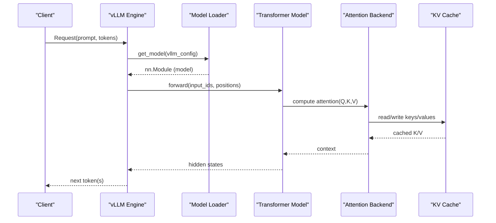

**Diagram sources**
- [vllm/model_executor/model_loader/__init__.py](file://vllm/model_executor/model_loader/__init__.py#L118-L151)
- [vllm/model_executor/models/llama.py](file://vllm/model_executor/models/llama.py#L360-L450)
- [vllm/attention/selector.py](file://vllm/attention/selector.py#L46-L119)
- [vllm/config/cache.py](file://vllm/config/cache.py#L1-L120)

## Detailed Component Analysis

### Attention Backend Selection and PagedAttention
vLLM’s attention backend selection considers:
- Head size and dtype
- KV cache dtype and block size
- Whether ML-Attention (MLA), sink cache, sparse attention, or multimodal prefix features are enabled
- The current platform’s backend availability

Selection flow:
- Build an AttentionSelectorConfig from runtime parameters
- Resolve backend enum from current vLLM configuration
- Lazily import and validate the backend class
- Optionally enforce a specific KV cache layout for the chosen backend

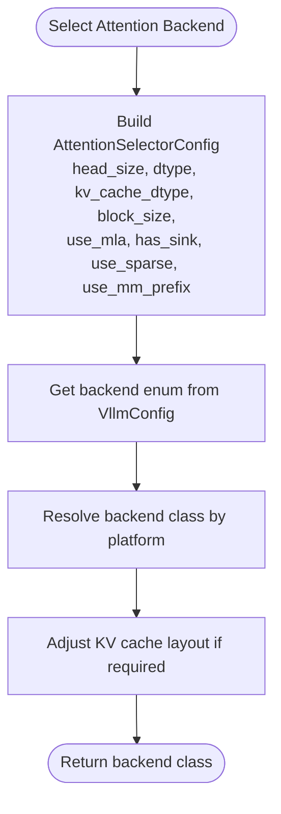

**Diagram sources**
- [vllm/attention/selector.py](file://vllm/attention/selector.py#L21-L119)

**Section sources**
- [vllm/attention/selector.py](file://vllm/attention/selector.py#L1-L146)

### KV Cache Management
KV cache configuration controls:
- Block size and dtype
- Sliding window and prefix caching
- CPU offload and swap space
- Validation and derived counters

Key behaviors:
- Automatic sizing based on GPU memory utilization or explicit override
- Hashing algorithms for prefix caching
- Offloading buffer size and backend selection

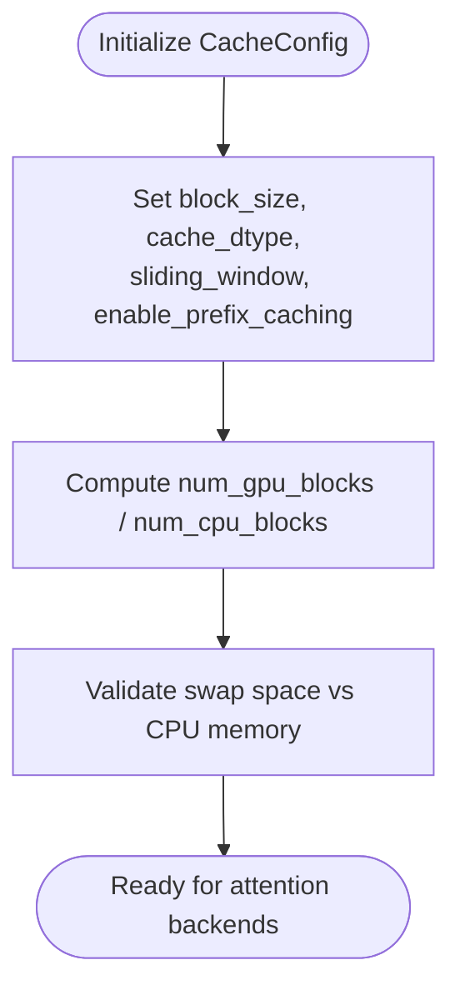

**Diagram sources**
- [vllm/config/cache.py](file://vllm/config/cache.py#L1-L233)

**Section sources**
- [vllm/config/cache.py](file://vllm/config/cache.py#L1-L233)

### Model Loading Mechanisms and Weight Initialization
vLLM provides a unified model loader abstraction:
- Registry maps load formats to loader classes
- Factory resolves the appropriate loader from configuration
- get_model orchestrates loading via the selected loader

Supported formats include HF, GGUF, bitsandbytes, safetensors, sharded state, and more. Architecture-specific loaders handle weight remapping and format nuances.

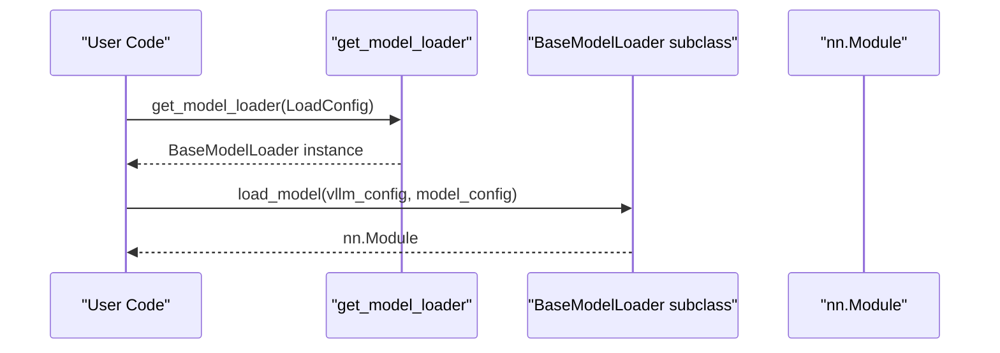

**Diagram sources**
- [vllm/model_executor/model_loader/__init__.py](file://vllm/model_executor/model_loader/__init__.py#L118-L151)

**Section sources**
- [vllm/model_executor/model_loader/__init__.py](file://vllm/model_executor/model_loader/__init__.py#L1-L151)

### Decoder-Only Transformers: Llama Family
Llama implements:
- RMSNorm before attention and feed-forward
- Rotary embeddings with configurable parameters
- QKV fused projection with tensor-parallel partitioning
- Silu-and-mul gated MLP
- Optional Llama-4 scaling for position embeddings

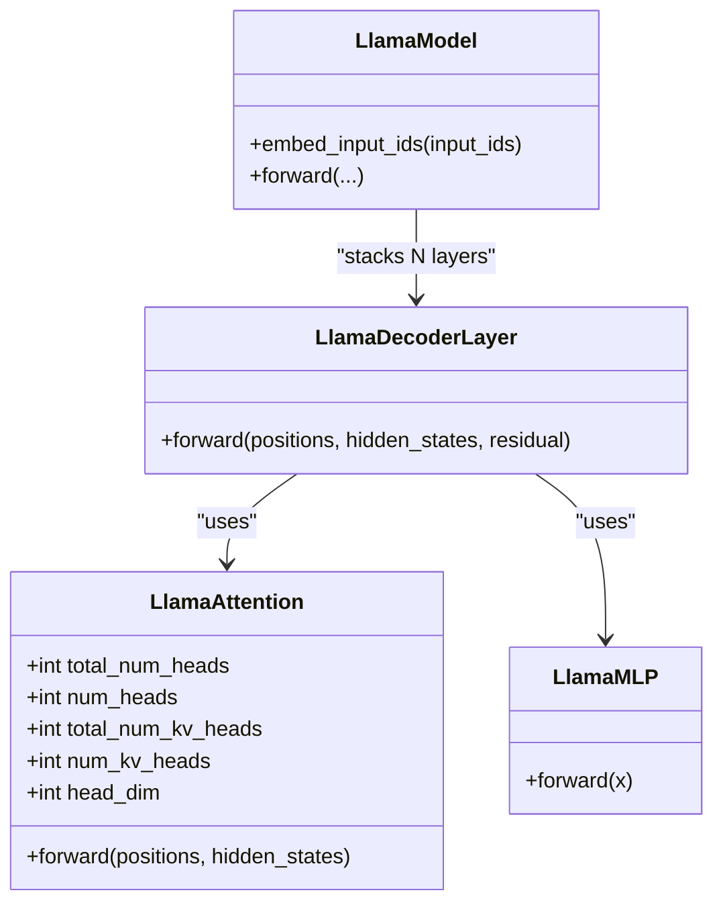

**Diagram sources**
- [vllm/model_executor/models/llama.py](file://vllm/model_executor/models/llama.py#L115-L249)
- [vllm/model_executor/models/llama.py](file://vllm/model_executor/models/llama.py#L268-L353)
- [vllm/model_executor/models/llama.py](file://vllm/model_executor/models/llama.py#L354-L450)

**Section sources**
- [vllm/model_executor/models/llama.py](file://vllm/model_executor/models/llama.py#L1-L701)

### Decoder-Only Transformers: Qwen Family
Qwen implements:
- RMSNorm, fused QKV projection, rotary embeddings
- Gate-Up fused MLP with SiluAndMul activation
- Standard decoder-only stack

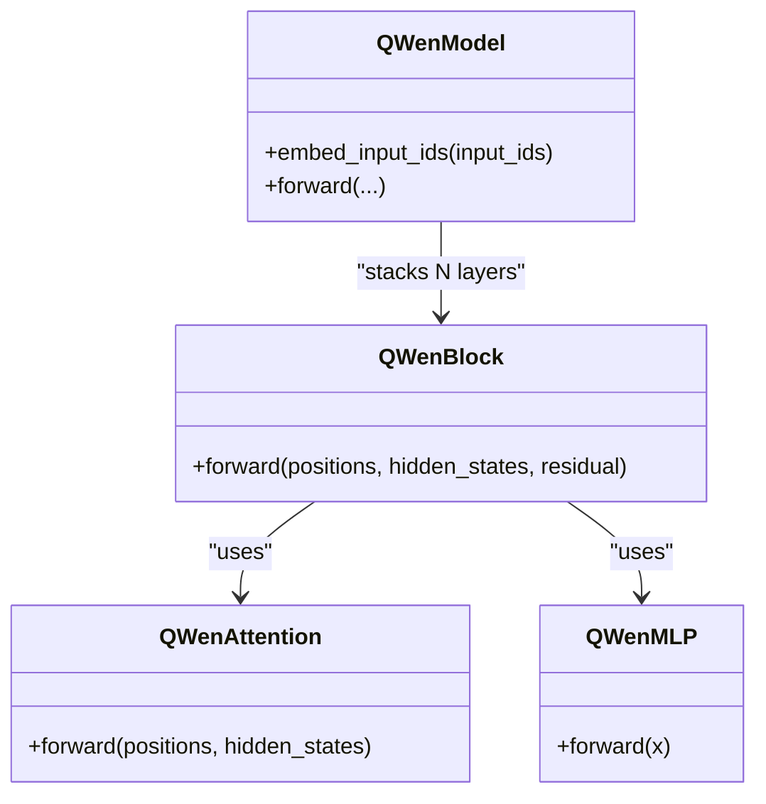

**Diagram sources**
- [vllm/model_executor/models/qwen.py](file://vllm/model_executor/models/qwen.py#L80-L141)
- [vllm/model_executor/models/qwen.py](file://vllm/model_executor/models/qwen.py#L142-L191)
- [vllm/model_executor/models/qwen.py](file://vllm/model_executor/models/qwen.py#L192-L251)

**Section sources**
- [vllm/model_executor/models/qwen.py](file://vllm/model_executor/models/qwen.py#L1-L366)

### Decoder-Only Transformers: Gemma Family
Gemma implements:
- GemmaRMSNorm, fused QKV projection, rotary embeddings (Neox-style)
- Gate-Up fused MLP with GeluAndMul activation
- Normalization scaling for embedding projection

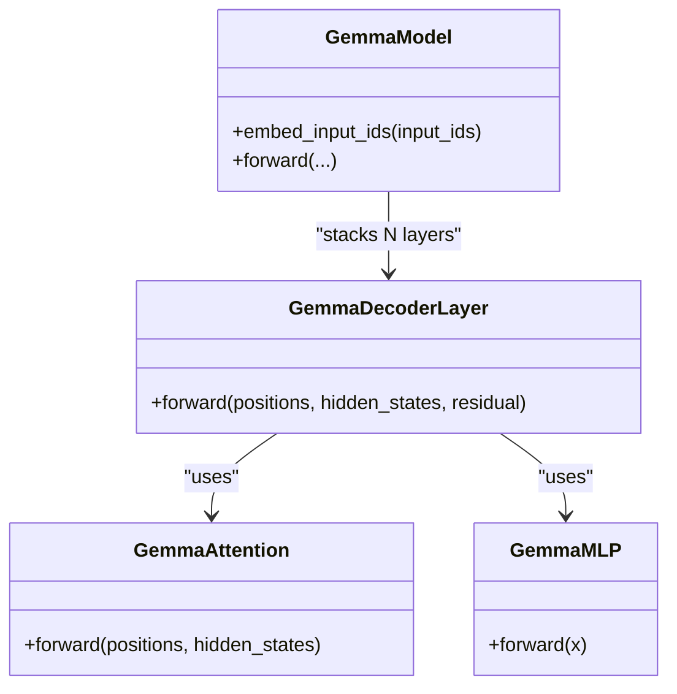

**Diagram sources**
- [vllm/model_executor/models/gemma.py](file://vllm/model_executor/models/gemma.py#L124-L203)
- [vllm/model_executor/models/gemma.py](file://vllm/model_executor/models/gemma.py#L204-L259)
- [vllm/model_executor/models/gemma.py](file://vllm/model_executor/models/gemma.py#L261-L327)

**Section sources**
- [vllm/model_executor/models/gemma.py](file://vllm/model_executor/models/gemma.py#L1-L426)

### Decoder-Only Transformers: Falcon
Falcon implements:
- Multi-query or grouped-query attention with ALiBi or rotary
- Fused QKV projection and dense output
- Optional parallel attention and layer norm variants

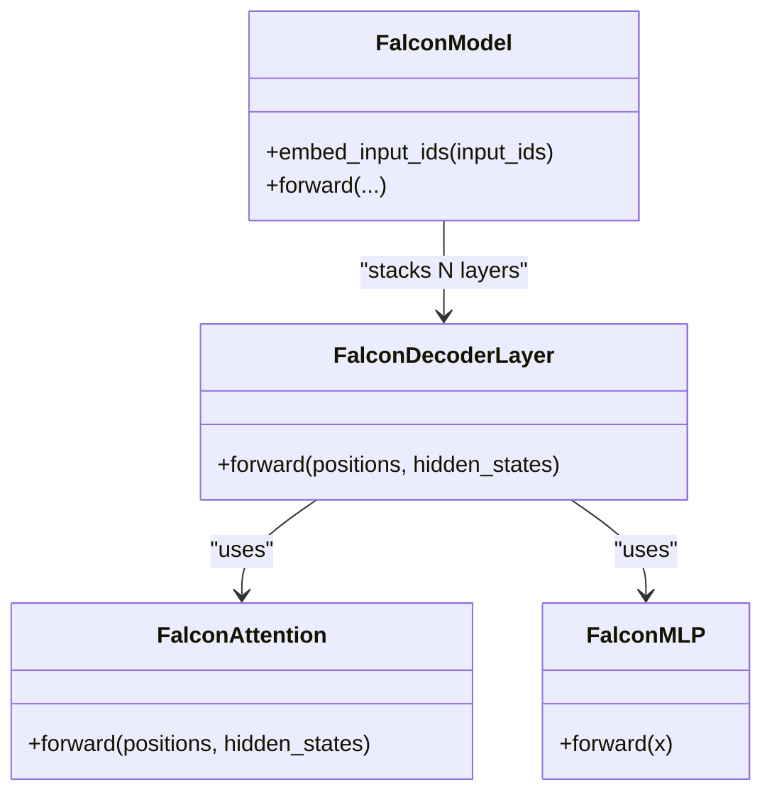

**Diagram sources**
- [vllm/model_executor/models/falcon.py](file://vllm/model_executor/models/falcon.py#L94-L209)
- [vllm/model_executor/models/falcon.py](file://vllm/model_executor/models/falcon.py#L225-L363)
- [vllm/model_executor/models/falcon.py](file://vllm/model_executor/models/falcon.py#L365-L423)

**Section sources**
- [vllm/model_executor/models/falcon.py](file://vllm/model_executor/models/falcon.py#L1-L544)

### Decoder-Only Transformers: OPT
OPT implements:
- Learned positional embeddings with offset
- QKV fused attention and gated MLP
- Optional pre/post layer norm ordering

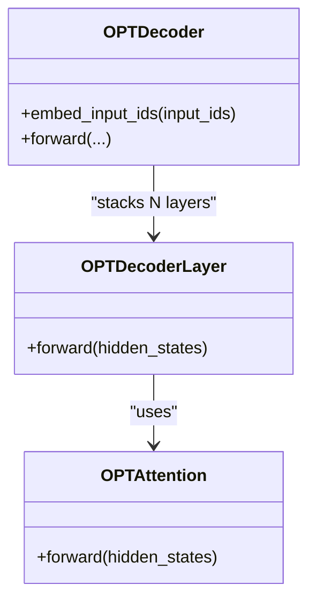

**Diagram sources**
- [vllm/model_executor/models/opt.py](file://vllm/model_executor/models/opt.py#L73-L125)
- [vllm/model_executor/models/opt.py](file://vllm/model_executor/models/opt.py#L127-L198)
- [vllm/model_executor/models/opt.py](file://vllm/model_executor/models/opt.py#L200-L296)

**Section sources**
- [vllm/model_executor/models/opt.py](file://vllm/model_executor/models/opt.py#L1-L427)

### Hybrid Transformer: ChatGLM
ChatGLM implements:
- Multi-query attention with rotary embeddings and partial rotary factor
- Merged dense projections for gate and up-projections
- RMSNorm or LayerNorm variants

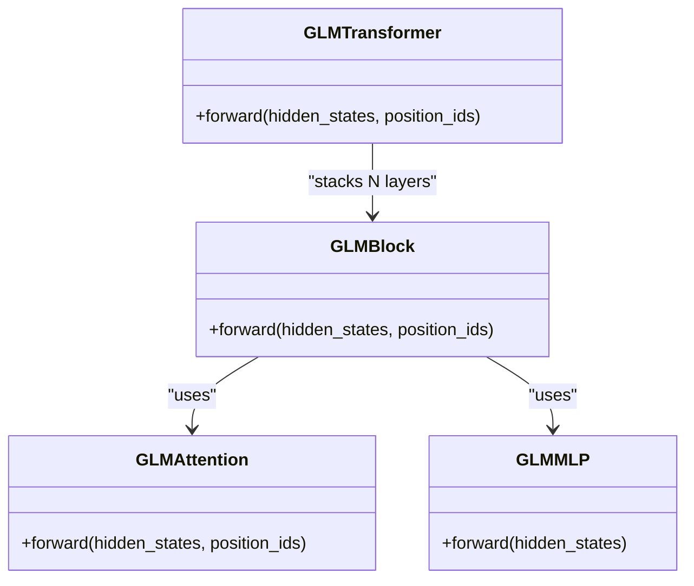

**Diagram sources**
- [vllm/model_executor/models/chatglm.py](file://vllm/model_executor/models/chatglm.py#L48-L138)
- [vllm/model_executor/models/chatglm.py](file://vllm/model_executor/models/chatglm.py#L139-L185)
- [vllm/model_executor/models/chatglm.py](file://vllm/model_executor/models/chatglm.py#L186-L262)
- [vllm/model_executor/models/chatglm.py](file://vllm/model_executor/models/chatglm.py#L263-L316)

**Section sources**
- [vllm/model_executor/models/chatglm.py](file://vllm/model_executor/models/chatglm.py#L1-L503)

### Practical Examples

#### Model Registration and Custom Transformer Implementation
- Register a custom model loader for a new format using the registration decorator and factory.
- Implement a minimal decoder-only transformer with attention, MLP, and KV cache integration.
- Use packed module mappings to optimize weight loading for fused projections.

References:
- [vllm/model_executor/model_loader/__init__.py](file://vllm/model_executor/model_loader/__init__.py#L65-L117)
- [vllm/model_executor/utils.py](file://vllm/model_executor/utils.py#L78-L99)

**Section sources**
- [vllm/model_executor/model_loader/__init__.py](file://vllm/model_executor/model_loader/__init__.py#L65-L117)
- [vllm/model_executor/utils.py](file://vllm/model_executor/utils.py#L78-L99)

#### Architecture-Specific Optimizations
- Llama: fused QKV and gate-up projections, SiluAndMul activation, rotary embeddings with Neox-style or GGUF-specific handling.
- Qwen: fused gate/up projections with SiluAndMul, RMSNorm before attention/FFN.
- Gemma: fused gate/up projections with GeluAndMul, GemmaRMSNorm, and embedding normalization scaling.
- Falcon: ALiBi or rotary attention, fused QKV, optional parallel attention and layer norms.
- OPT: learned positional embeddings with offset, QKV fused attention, and activation selection.

References:
- [vllm/model_executor/models/llama.py](file://vllm/model_executor/models/llama.py#L72-L114)
- [vllm/model_executor/models/qwen.py](file://vllm/model_executor/models/qwen.py#L49-L78)
- [vllm/model_executor/models/gemma.py](file://vllm/model_executor/models/gemma.py#L90-L123)
- [vllm/model_executor/models/falcon.py](file://vllm/model_executor/models/falcon.py#L94-L209)
- [vllm/model_executor/models/opt.py](file://vllm/model_executor/models/opt.py#L127-L198)

**Section sources**
- [vllm/model_executor/models/llama.py](file://vllm/model_executor/models/llama.py#L1-L701)
- [vllm/model_executor/models/qwen.py](file://vllm/model_executor/models/qwen.py#L1-L366)
- [vllm/model_executor/models/gemma.py](file://vllm/model_executor/models/gemma.py#L1-L426)
- [vllm/model_executor/models/falcon.py](file://vllm/model_executor/models/falcon.py#L1-L544)
- [vllm/model_executor/models/opt.py](file://vllm/model_executor/models/opt.py#L1-L427)

## Dependency Analysis
The following diagram shows key dependencies among attention selection, cache configuration, and model families.

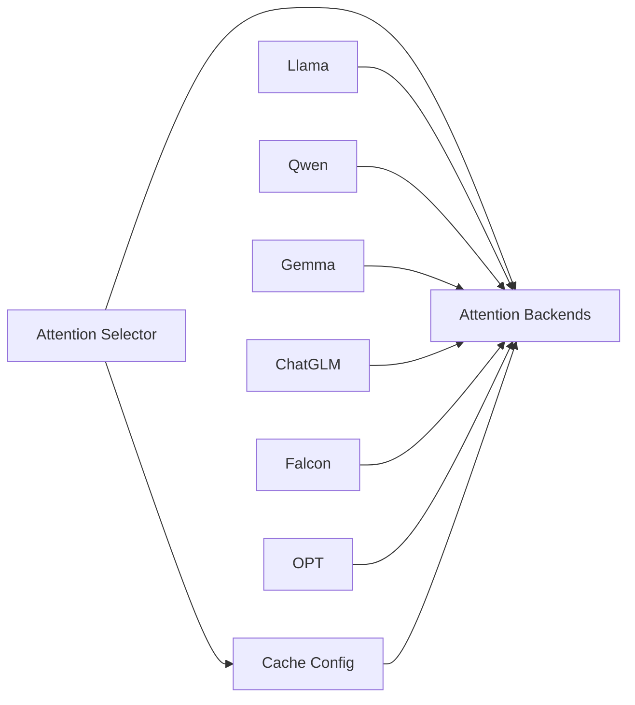

**Diagram sources**
- [vllm/attention/selector.py](file://vllm/attention/selector.py#L1-L146)
- [vllm/config/cache.py](file://vllm/config/cache.py#L1-L233)
- [vllm/model_executor/models/llama.py](file://vllm/model_executor/models/llama.py#L1-L120)
- [vllm/model_executor/models/qwen.py](file://vllm/model_executor/models/qwen.py#L1-L120)
- [vllm/model_executor/models/gemma.py](file://vllm/model_executor/models/gemma.py#L1-L120)
- [vllm/model_executor/models/chatglm.py](file://vllm/model_executor/models/chatglm.py#L1-L120)
- [vllm/model_executor/models/falcon.py](file://vllm/model_executor/models/falcon.py#L1-L120)
- [vllm/model_executor/models/opt.py](file://vllm/model_executor/models/opt.py#L1-L120)

**Section sources**
- [vllm/attention/selector.py](file://vllm/attention/selector.py#L1-L146)
- [vllm/config/cache.py](file://vllm/config/cache.py#L1-L233)
- [vllm/model_executor/models/llama.py](file://vllm/model_executor/models/llama.py#L1-L120)
- [vllm/model_executor/models/qwen.py](file://vllm/model_executor/models/qwen.py#L1-L120)
- [vllm/model_executor/models/gemma.py](file://vllm/model_executor/models/gemma.py#L1-L120)
- [vllm/model_executor/models/chatglm.py](file://vllm/model_executor/models/chatglm.py#L1-L120)
- [vllm/model_executor/models/falcon.py](file://vllm/model_executor/models/falcon.py#L1-L120)
- [vllm/model_executor/models/opt.py](file://vllm/model_executor/models/opt.py#L1-L120)

## Performance Considerations
- Attention head optimization:
  - Tensor-parallel partitioning of heads and KV heads ensures balanced workload.
  - MQA/GQA variants (Falcon, ChatGLM) reduce KV memory and improve throughput.
- Feed-forward efficiency:
  - Fused MLPs (SiluAndMul, GeluAndMul) reduce kernel launches and memory bandwidth.
  - Column/Row parallel linear layers minimize communication overhead.
- Activation function choices:
  - SiluAndMul and GeluAndMul are efficient and widely used in modern LLMs.
- KV cache optimizations:
  - PagedAttention with configurable block sizes improves memory locality and reduces fragmentation.
  - FP8 KV cache dtypes reduce memory footprint with optional dynamic scaling.
  - Prefix caching accelerates repeated prompts by reusing cached states.
- Platform-aware weight loading:
  - Platform-specific synchronization and weight loader wrappers prevent redundant copies and OOM during loading.

[No sources needed since this section provides general guidance]

## Troubleshooting Guide
Common issues and mitigations:
- Incorrect attention backend for device/platform:
  - Ensure the backend enum and platform mapping are valid; the selector raises explicit errors if unsupported.
- KV cache dtype mismatches:
  - Verify cache dtype compatibility with the current device and model; warnings or errors may be raised during validation.
- Weight loading failures:
  - Confirm packed module mappings match the model’s fused projections.
  - Use AutoWeightsLoader and architecture-specific mappers to handle format differences.
- Excessive swap space:
  - Validate swap space vs total CPU memory to avoid over-allocation warnings or errors.

**Section sources**
- [vllm/attention/selector.py](file://vllm/attention/selector.py#L90-L119)
- [vllm/config/cache.py](file://vllm/config/cache.py#L201-L233)
- [vllm/model_executor/model_loader/__init__.py](file://vllm/model_executor/model_loader/__init__.py#L118-L151)
- [vllm/model_executor/utils.py](file://vllm/model_executor/utils.py#L1-L77)

## Conclusion
vLLM’s transformer stack is modular and efficient, with a unified attention backend selection, robust KV cache management, and flexible model loading. Decoder-only families (Llama, Qwen, Gemma, Falcon, OPT) and hybrid designs (ChatGLM) share consistent patterns for attention and feed-forward layers, enabling broad architecture coverage. Configuration-driven optimizations—such as fused activations, MQA/GQA, PagedAttention, and FP8 KV caches—deliver strong performance across diverse hardware and model families.

[No sources needed since this section summarizes without analyzing specific files]

## Appendices
- Supported model families overview:
  - Decoder-only: Llama, Qwen, Gemma, Falcon, OPT, and many others.
  - Hybrid: ChatGLM and related architectures.
- Practical tips:
  - Prefer fused projections and activations for throughput.
  - Tune block size and KV cache dtype for memory and speed trade-offs.
  - Enable prefix caching for repetitive prompts.

[No sources needed since this section provides general guidance]