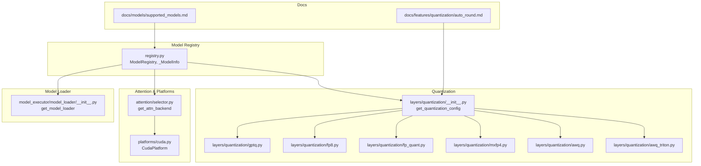
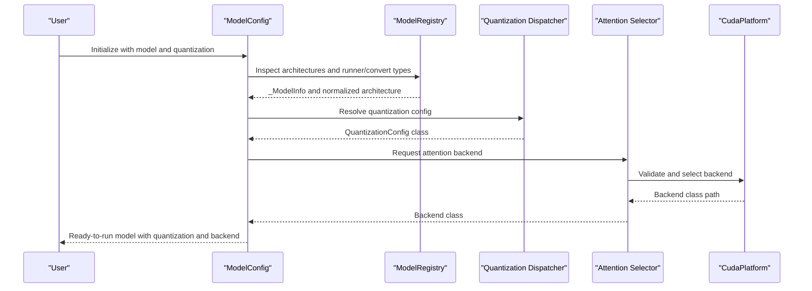
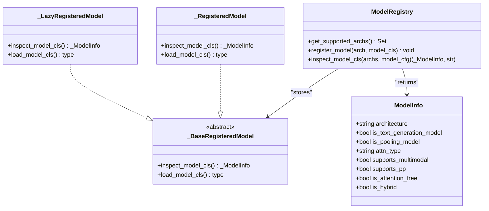
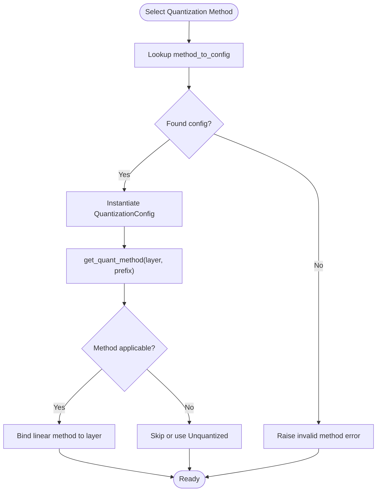
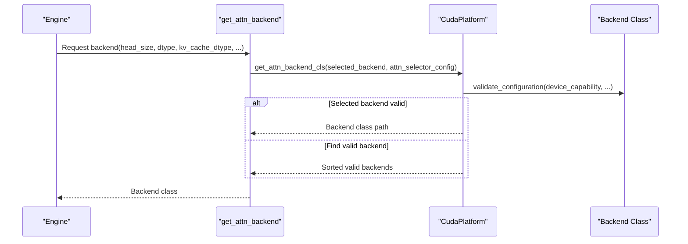
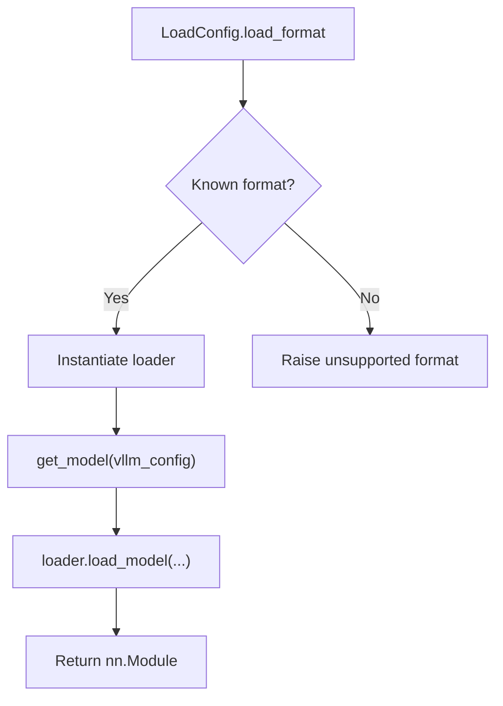
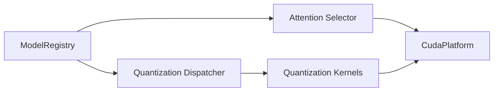

# Model Support

<cite>
**Referenced Files in This Document**
- [registry.py](file://vllm/model_executor/models/registry.py)
- [__init__.py](file://vllm/model_executor/layers/quantization/__init__.py)
- [selector.py](file://vllm/attention/selector.py)
- [model.py](file://vllm/config/model.py)
- [cuda.py](file://vllm/platforms/cuda.py)
- [__init__.py](file://vllm/model_executor/model_loader/__init__.py)
- [supported_models.md](file://docs/models/supported_models.md)
- [gptq.py](file://vllm/model_executor/layers/quantization/gptq.py)
- [arg_utils.py](file://vllm/engine/arg_utils.py)
- [fp8.py](file://vllm/model_executor/layers/quantization/fp8.py)
- [fp_quant.py](file://vllm/model_executor/layers/quantization/fp_quant.py)
- [mxfp4.py](file://vllm/model_executor/layers/quantization/mxfp4.py)
- [awq_triton.py](file://vllm/model_executor/layers/quantization/awq_triton.py)
- [awq.py](file://vllm/model_executor/layers/quantization/awq.py)
- [moe.py](file://vllm/model_executor/models/transformers/moe.py)
- [auto_round.md](file://docs/features/quantization/auto_round.md)
</cite>

## Table of Contents
1. [Introduction](#introduction)
2. [Project Structure](#project-structure)
3. [Core Components](#core-components)
4. [Architecture Overview](#architecture-overview)
5. [Detailed Component Analysis](#detailed-component-analysis)
6. [Dependency Analysis](#dependency-analysis)
7. [Performance Considerations](#performance-considerations)
8. [Troubleshooting Guide](#troubleshooting-guide)
9. [Conclusion](#conclusion)

## Introduction
This document explains vLLM’s model support ecosystem with a focus on:
- Model registry and supported architectures (transformer-based LLMs, MoE, multimodal)
- Quantization methods (FP8, INT4/8, GPTQ/AWQ, compressed tensors, AutoRound, etc.)
- Model loading strategies and parameter management
- Hardware-specific optimizations and attention/backend selection
- Practical guidance for custom model registration, conversion, and performance tuning

It synthesizes the repository’s model registry, quantization framework, attention backend selection, and platform-specific optimizations into a coherent guide for both technical and non-technical users.

## Project Structure
At a high level, model support spans:
- Model registry and architecture resolution
- Quantization configuration and method dispatch
- Attention backend selection and hardware adaptation
- Model loader abstraction and format-specific loaders
- Documentation of supported models and usage guidance

**Diagram sources**
- [registry.py](file://vllm/model_executor/models/registry.py#L547-L936)
- [__init__.py](file://vllm/model_executor/layers/quantization/__init__.py#L135-L179)
- [gptq.py](file://vllm/model_executor/layers/quantization/gptq.py#L147-L176)
- [fp8.py](file://vllm/model_executor/layers/quantization/fp8.py#L222-L257)
- [fp_quant.py](file://vllm/model_executor/layers/quantization/fp_quant.py#L68-L109)
- [mxfp4.py](file://vllm/model_executor/layers/quantization/mxfp4.py#L181-L199)
- [awq.py](file://vllm/model_executor/layers/quantization/awq.py#L254-L277)
- [awq_triton.py](file://vllm/model_executor/layers/quantization/awq_triton.py#L1-L337)
- [selector.py](file://vllm/attention/selector.py#L1-L146)
- [cuda.py](file://vllm/platforms/cuda.py#L250-L341)
- [__init__.py](file://vllm/model_executor/model_loader/__init__.py#L1-L151)
- [supported_models.md](file://docs/models/supported_models.md#L1-L800)
- [auto_round.md](file://docs/features/quantization/auto_round.md#L1-L53)

**Section sources**
- [registry.py](file://vllm/model_executor/models/registry.py#L547-L936)
- [__init__.py](file://vllm/model_executor/layers/quantization/__init__.py#L135-L179)
- [selector.py](file://vllm/attention/selector.py#L1-L146)
- [cuda.py](file://vllm/platforms/cuda.py#L250-L341)
- [__init__.py](file://vllm/model_executor/model_loader/__init__.py#L1-L151)
- [supported_models.md](file://docs/models/supported_models.md#L1-L800)
- [auto_round.md](file://docs/features/quantization/auto_round.md#L1-L53)

## Core Components
- Model Registry and Architecture Resolution
  - Central registry maps model architectures to metadata and inspection routines. It supports native vLLM models, Transformers fallback, and multimodal variants. It also exposes helpers to normalize architectures and detect runner/convert types.
  - Key APIs: registry inspection, architecture normalization, and deprecation handling for previously supported architectures.

- Quantization Framework
  - Quantization methods are mapped to configuration classes. The dispatcher resolves a method to a concrete config, enabling modular extension via registration hooks.
  - Supports FP8, INT4/8 (GPTQ/AWQ), compressed tensors, AutoRound, and more.

- Attention Backend Selection and Hardware Optimizations
  - Attention backends are selected based on device capability, dtype, head size, and optional features (MLA, sparse). CUDA platform enforces block-size constraints and validates backend feasibility.

- Model Loader Abstraction
  - A loader factory selects a loader based on load format (e.g., safetensors, GGUF, BitsAndBytes, tensorizer). This enables flexible weight loading strategies.

- Documentation and Compatibility
  - Official supported models list and guidance for custom models using Transformers backend.

**Section sources**
- [registry.py](file://vllm/model_executor/models/registry.py#L547-L936)
- [__init__.py](file://vllm/model_executor/layers/quantization/__init__.py#L135-L179)
- [selector.py](file://vllm/attention/selector.py#L1-L146)
- [cuda.py](file://vllm/platforms/cuda.py#L250-L341)
- [__init__.py](file://vllm/model_executor/model_loader/__init__.py#L1-L151)
- [supported_models.md](file://docs/models/supported_models.md#L1-L800)

## Architecture Overview
The model support architecture connects model discovery, quantization, and runtime acceleration:

**Diagram sources**
- [model.py](file://vllm/config/model.py#L494-L823)
- [registry.py](file://vllm/model_executor/models/registry.py#L900-L936)
- [__init__.py](file://vllm/model_executor/layers/quantization/__init__.py#L135-L179)
- [selector.py](file://vllm/attention/selector.py#L1-L146)
- [cuda.py](file://vllm/platforms/cuda.py#L250-L341)

## Detailed Component Analysis

### Model Registry and Supported Architectures
- Responsibilities
  - Maintain a registry of supported architectures and metadata (text generation, pooling, multimodal, MoE, attention type, etc.).
  - Normalize architectures and resolve runner/convert types based on defaults and user overrides.
  - Provide inspection and lazy-loading mechanisms for external models.

- Key behaviors
  - Architecture normalization and fallback to base model when needed.
  - Deprecation handling for previously supported architectures.
  - Support for multimodal and speculative decoding models.

**Diagram sources**
- [registry.py](file://vllm/model_executor/models/registry.py#L547-L936)

**Section sources**
- [registry.py](file://vllm/model_executor/models/registry.py#L547-L936)
- [supported_models.md](file://docs/models/supported_models.md#L1-L800)

### Quantization Methods and Configuration
- Quantization dispatcher
  - Maps quantization method names to configuration classes. Supports FP8, GPTQ/AWQ variants, compressed tensors, AutoRound, and more.
  - Provides registration hook for custom quantization methods.

- Method-specific notes
  - FP8: Activation schemes, block-wise quantization, and minimum device capability checks.
  - FPQuant: Forward dtype/method and module exclusion lists.
  - MXFP4: Minimum capability and supported dtypes.
  - AWQ: Triton and CUDA kernels for dequantization and matmul; heuristic selection between dequantize+matmul vs packed GEMM.
  - GPTQ: MoE fallback path and block/module configuration options.

**Diagram sources**
- [__init__.py](file://vllm/model_executor/layers/quantization/__init__.py#L135-L179)
- [fp8.py](file://vllm/model_executor/layers/quantization/fp8.py#L222-L257)
- [fp_quant.py](file://vllm/model_executor/layers/quantization/fp_quant.py#L68-L109)
- [mxfp4.py](file://vllm/model_executor/layers/quantization/mxfp4.py#L181-L199)
- [awq.py](file://vllm/model_executor/layers/quantization/awq.py#L254-L277)
- [awq_triton.py](file://vllm/model_executor/layers/quantization/awq_triton.py#L1-L337)
- [gptq.py](file://vllm/model_executor/layers/quantization/gptq.py#L147-L176)

**Section sources**
- [__init__.py](file://vllm/model_executor/layers/quantization/__init__.py#L135-L179)
- [fp8.py](file://vllm/model_executor/layers/quantization/fp8.py#L222-L257)
- [fp_quant.py](file://vllm/model_executor/layers/quantization/fp_quant.py#L68-L109)
- [mxfp4.py](file://vllm/model_executor/layers/quantization/mxfp4.py#L181-L199)
- [awq_triton.py](file://vllm/model_executor/layers/quantization/awq_triton.py#L1-L337)
- [awq.py](file://vllm/model_executor/layers/quantization/awq.py#L254-L277)
- [gptq.py](file://vllm/model_executor/layers/quantization/gptq.py#L147-L176)
- [auto_round.md](file://docs/features/quantization/auto_round.md#L1-L53)

### Attention/Backends and Hardware-Specific Optimizations
- Attention backend selection
  - Uses device capability and attention selector config to validate and choose a backend (e.g., Flash-ATTN, Triton, FlashMLA, etc.).
  - Supports overrides and mamba attention backends.

- CUDA platform optimizations
  - Enforces block sizes for specific backends (e.g., FlashMLA/CutlassMLA), validates dtype support, and logs warnings for mixed device configurations.

**Diagram sources**
- [selector.py](file://vllm/attention/selector.py#L1-L146)
- [cuda.py](file://vllm/platforms/cuda.py#L250-L341)

**Section sources**
- [selector.py](file://vllm/attention/selector.py#L1-L146)
- [cuda.py](file://vllm/platforms/cuda.py#L250-L341)

### Model Loading Strategies and Parameter Management
- Loader abstraction
  - Factory chooses a loader based on load format (e.g., safetensors, GGUF, BitsAndBytes, tensorizer).
  - Supports sharded state and runai streamer loaders.

- Parameter management
  - Quantization-aware dtype selection and device placement for online quantization.
  - Model loader extra config and download strategies.

**Diagram sources**
- [__init__.py](file://vllm/model_executor/model_loader/__init__.py#L1-L151)
- [arg_utils.py](file://vllm/engine/arg_utils.py#L1276-L1301)

**Section sources**
- [__init__.py](file://vllm/model_executor/model_loader/__init__.py#L1-L151)
- [arg_utils.py](file://vllm/engine/arg_utils.py#L1276-L1301)

### Custom Model Registration and Conversion
- Custom model registration
  - External models can be registered via the registry with either a direct class or a lazy-import string.
  - Inspection caches model metadata to speed up subsequent loads.

- Transformers modeling backend
  - Models can be adapted to vLLM via the Transformers backend, enabling compatibility with vLLM features (parallelism, etc.) when following backend compatibility guidelines.

- Model conversion
  - Pooling models can be converted from generative models using runner/convert options.

**Section sources**
- [registry.py](file://vllm/model_executor/models/registry.py#L753-L799)
- [supported_models.md](file://docs/models/supported_models.md#L1-L800)
- [model.py](file://vllm/config/model.py#L494-L823)

### Relationship Between Architectures and Attention/Backends
- Architecture metadata
  - The registry records attention types and multimodal capabilities, which influence backend selection and KV cache layout choices.

- Backend selection logic
  - Attention selector considers head size, dtype, KV cache dtype, and flags like MLA and sparse attention to pick the best backend for a given device.

**Section sources**
- [registry.py](file://vllm/model_executor/models/registry.py#L547-L620)
- [selector.py](file://vllm/attention/selector.py#L1-L146)
- [cuda.py](file://vllm/platforms/cuda.py#L250-L341)

## Dependency Analysis
- Coupling and cohesion
  - Model registry is cohesive around architecture metadata and inspection; loosely coupled to quantization and attention systems.
  - Quantization dispatcher is a central mapper with low coupling to individual methods.
  - Attention selection is tightly integrated with platform capabilities.

- External dependencies
  - CUDA platform relies on device capability detection and backend availability.
  - Quantization backends leverage Triton and CUDA kernels for performance.

**Diagram sources**
- [registry.py](file://vllm/model_executor/models/registry.py#L547-L936)
- [__init__.py](file://vllm/model_executor/layers/quantization/__init__.py#L135-L179)
- [selector.py](file://vllm/attention/selector.py#L1-L146)
- [cuda.py](file://vllm/platforms/cuda.py#L250-L341)

**Section sources**
- [registry.py](file://vllm/model_executor/models/registry.py#L547-L936)
- [__init__.py](file://vllm/model_executor/layers/quantization/__init__.py#L135-L179)
- [selector.py](file://vllm/attention/selector.py#L1-L146)
- [cuda.py](file://vllm/platforms/cuda.py#L250-L341)

## Performance Considerations
- Quantization
  - FP8 requires sufficient device capability and supports dynamic activation schemes and block-wise quantization for checkpoints.
  - AWQ can switch between dequantize+matmul and packed GEMM based on heuristics for throughput.
  - MXFP4 targets BF16 and requires modern GPUs.

- Attention backends
  - Backend selection validates device capability and may enforce block sizes (e.g., FlashMLA/CutlassMLA).
  - Sparse and MLA modes influence backend choice and block sizing.

- Model loading
  - Choose appropriate load formats (e.g., safetensors, GGUF) for faster and more reliable weight loading.
  - For online quantization, ensure device placement aligns with quantization method requirements.

[No sources needed since this section provides general guidance]

## Troubleshooting Guide
- Unsupported or previously supported architectures
  - If a model architecture is not supported or was supported in older versions, the registry raises explicit errors with guidance.

- Quantization method errors
  - Invalid method names or unsupported configurations (e.g., block-wise FP8 with non-dynamic activation) will surface errors during config resolution.

- Attention backend selection failures
  - If no valid backend is found for the current device and configuration, a descriptive error is raised with reasons.

- Model loading issues
  - Unsupported load formats or incompatible loader subclasses will raise errors during loader instantiation.

**Section sources**
- [registry.py](file://vllm/model_executor/models/registry.py#L799-L822)
- [__init__.py](file://vllm/model_executor/layers/quantization/__init__.py#L135-L179)
- [fp8.py](file://vllm/model_executor/layers/quantization/fp8.py#L222-L257)
- [selector.py](file://vllm/attention/selector.py#L1-L146)
- [cuda.py](file://vllm/platforms/cuda.py#L337-L341)
- [__init__.py](file://vllm/model_executor/model_loader/__init__.py#L1-L151)

## Conclusion
vLLM’s model support system combines a robust model registry, a flexible quantization framework, and hardware-aware attention backend selection. Together, they enable broad coverage of transformer-based LLMs, MoE, and multimodal models, while offering practical pathways for custom model integration, quantization configuration, and performance optimization across diverse hardware.

[No sources needed since this section summarizes without analyzing specific files]