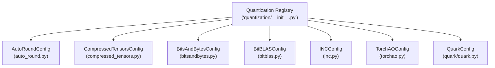
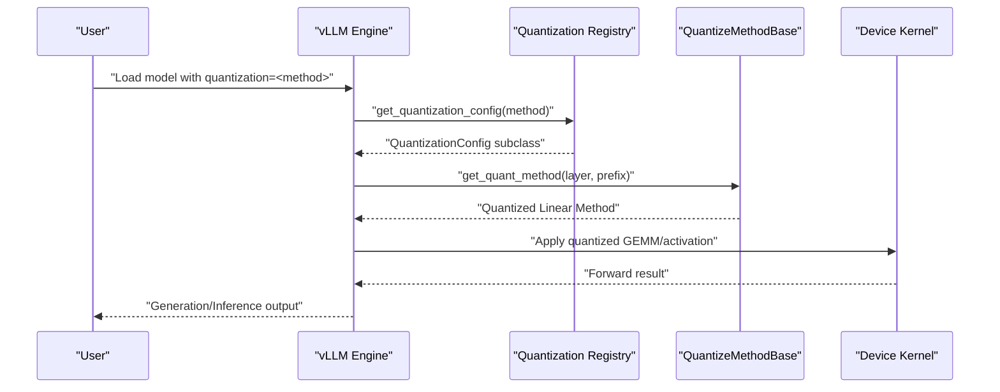
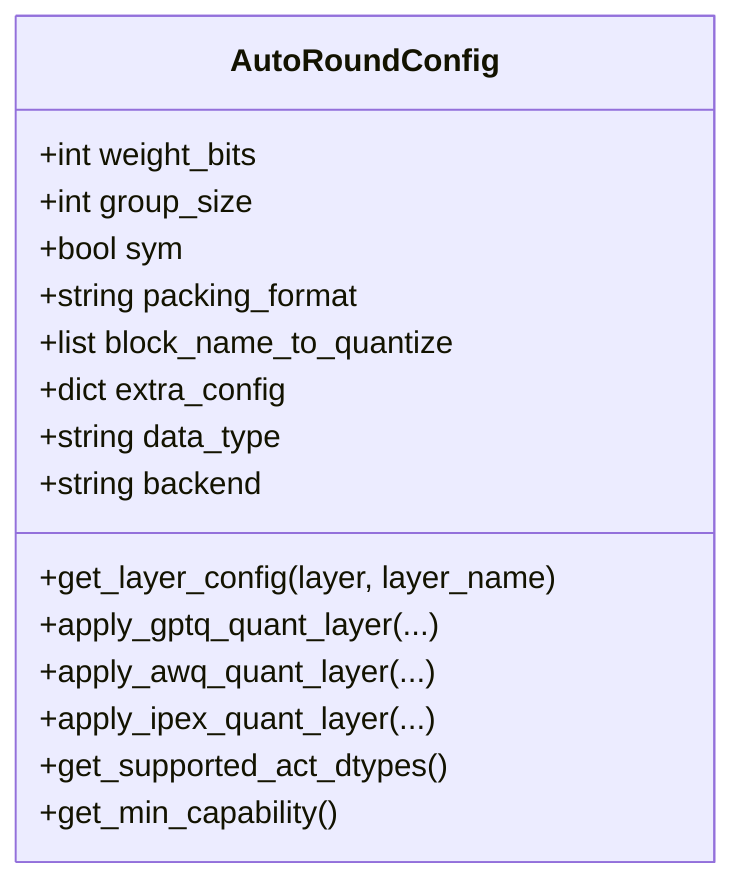
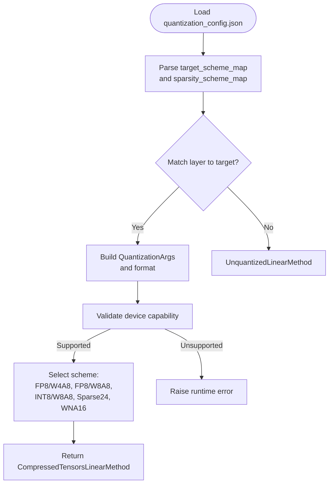
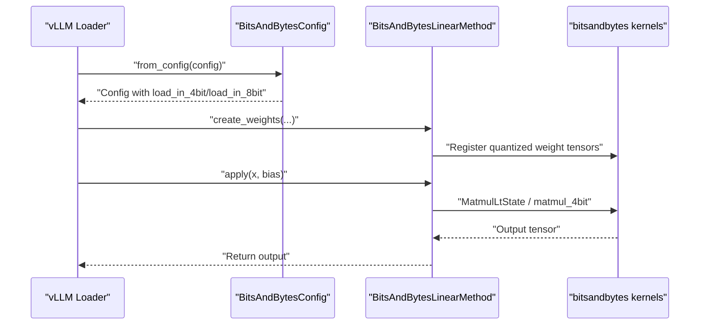
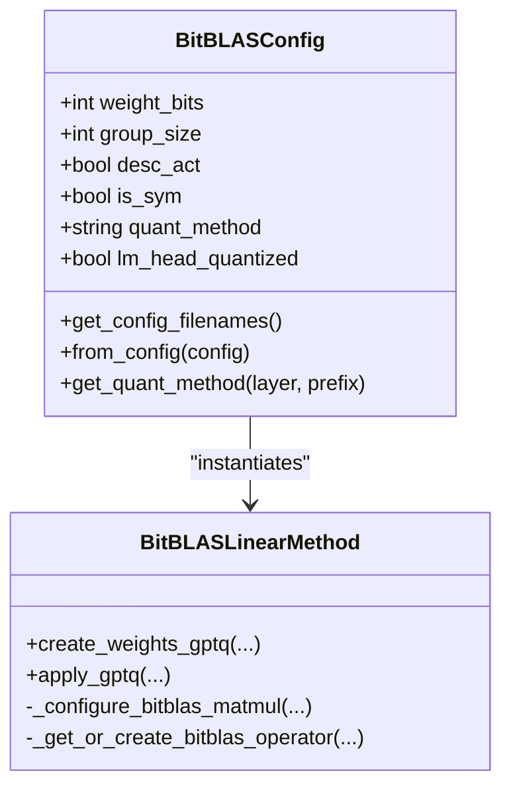
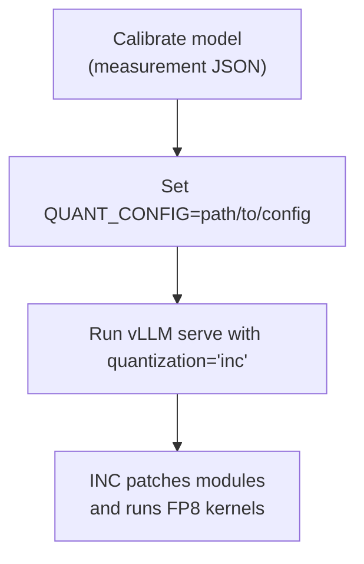
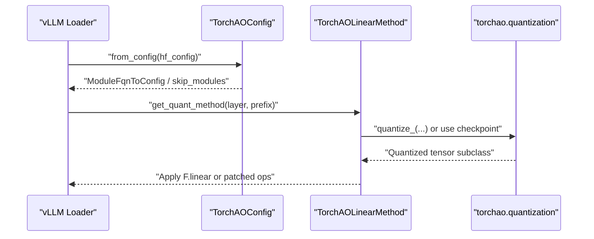
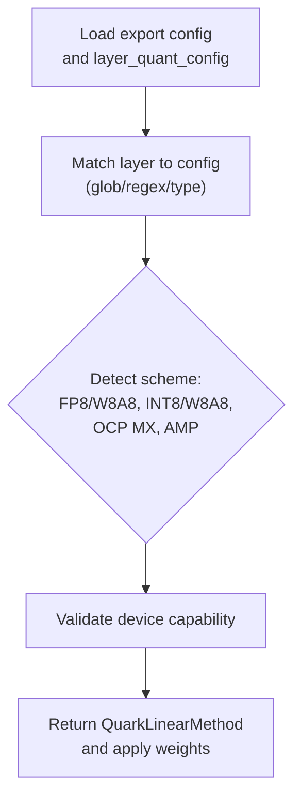
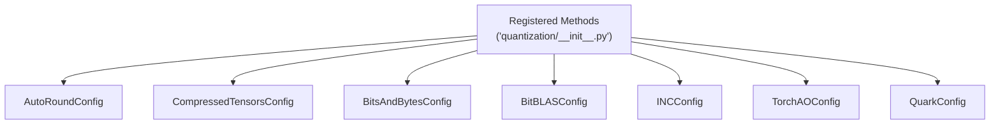

# Advanced Quantization Techniques

<cite>
**Referenced Files in This Document**
- [quantization/__init__.py](file://vllm/model_executor/layers/quantization/__init__.py)
- [auto_round.py](file://vllm/model_executor/layers/quantization/auto_round.py)
- [compressed_tensors.py](file://vllm/model_executor/layers/quantization/compressed_tensors/compressed_tensors.py)
- [bitsandbytes.py](file://vllm/model_executor/layers/quantization/bitsandbytes.py)
- [bitblas.py](file://vllm/model_executor/layers/quantization/bitblas.py)
- [inc.py](file://vllm/model_executor/layers/quantization/inc.py)
- [torchao.py](file://vllm/model_executor/layers/quantization/torchao.py)
- [quark.py](file://vllm/model_executor/layers/quantization/quark/quark.py)
- [auto_round.md](file://docs/features/quantization/auto_round.md)
- [bnb.md](file://docs/features/quantization/bnb.md)
- [bitblas.md](file://docs/features/quantization/bitblas.md)
- [inc.md](file://docs/features/quantization/inc.md)
- [torchao.md](file://docs/features/quantization/torchao.md)
- [quark.md](file://docs/features/quantization/quark.md)
</cite>

## Table of Contents
1. [Introduction](#introduction)
2. [Project Structure](#project-structure)
3. [Core Components](#core-components)
4. [Architecture Overview](#architecture-overview)
5. [Detailed Component Analysis](#detailed-component-analysis)
6. [Dependency Analysis](#dependency-analysis)
7. [Performance Considerations](#performance-considerations)
8. [Troubleshooting Guide](#troubleshooting-guide)
9. [Conclusion](#conclusion)
10. [Appendices](#appendices)

## Introduction
This document provides comprehensive coverage of advanced quantization techniques integrated into vLLM, focusing on AutoRound, CompressedTensors, BitsAndBytes, BitBLAS, Intel Neural Compressor (INC), NVIDIA Model Optimizer, AMD Quark, and TorchAO. It explains how each technique is configured and selected within vLLM, highlights performance and accuracy trade-offs, and outlines hardware-specific deployment considerations. It also covers mixed-precision training integration, quantization-aware training workflows, and production deployment strategies for enterprise-scale inference.

## Project Structure
vLLM centralizes quantization configuration and selection in a single registry that maps quantization method names to their respective configuration classes. Each quantization method encapsulates its own logic for selecting appropriate kernels, validating device compatibility, and applying quantized linear methods during inference.

**Diagram sources**
- [quantization/__init__.py](file://vllm/model_executor/layers/quantization/__init__.py#L96-L180)
- [auto_round.py](file://vllm/model_executor/layers/quantization/auto_round.py#L26-L111)
- [compressed_tensors.py](file://vllm/model_executor/layers/quantization/compressed_tensors/compressed_tensors.py#L78-L117)
- [bitsandbytes.py](file://vllm/model_executor/layers/quantization/bitsandbytes.py#L28-L73)
- [bitblas.py](file://vllm/model_executor/layers/quantization/bitblas.py#L32-L120)
- [inc.py](file://vllm/model_executor/layers/quantization/inc.py#L35-L66)
- [torchao.py](file://vllm/model_executor/layers/quantization/torchao.py#L102-L151)
- [quark.py](file://vllm/model_executor/layers/quantization/quark/quark.py#L47-L74)

**Section sources**
- [quantization/__init__.py](file://vllm/model_executor/layers/quantization/__init__.py#L1-L180)

## Core Components
- AutoRound: Weight-only quantization supporting INT2/INT3/INT4/INT8 with per-layer mixed-bit control and multiple backends (GPTQ/AWQ/Marlin/IPEx). It selects optimal kernels based on device capability and layer types.
- CompressedTensors: Flexible scheme-driven quantization supporting FP8/W4A8, FP8/W8A8, INT8/W8A8, and sparse formats. It validates device capability and supports activation quantization and KV cache schemes.
- BitsAndBytes: Efficient 4-bit and 8-bit inference with pre-quantized checkpoints and in-flight quantization. It integrates with bitsandbytes kernels and supports MoE.
- BitBLAS: Low-precision GEMM acceleration for GPTQ-style quantization with hardware-aware operator caching and tuning.
- INC: Intel Gaudi FP8 inference with calibration via QUANT_CONFIG and patched modules.
- TorchAO: PyTorch-native quantization with tensor subclasses and module-level configuration; supports online or checkpoint-based quantization.
- Quark: AMD-specific quantization with FP8, MXFP4/MXFP6, and AMP schemes; supports KV cache quantization and OCP MX compliance.

**Section sources**
- [auto_round.py](file://vllm/model_executor/layers/quantization/auto_round.py#L26-L111)
- [compressed_tensors.py](file://vllm/model_executor/layers/quantization/compressed_tensors/compressed_tensors.py#L78-L117)
- [bitsandbytes.py](file://vllm/model_executor/layers/quantization/bitsandbytes.py#L28-L73)
- [bitblas.py](file://vllm/model_executor/layers/quantization/bitblas.py#L32-L120)
- [inc.py](file://vllm/model_executor/layers/quantization/inc.py#L35-L66)
- [torchao.py](file://vllm/model_executor/layers/quantization/torchao.py#L102-L151)
- [quark.py](file://vllm/model_executor/layers/quantization/quark/quark.py#L47-L74)

## Architecture Overview
The quantization subsystem operates by:
- Selecting a quantization method via the registry.
- Validating device capability and supported dtypes.
- Determining per-layer quantization schemes and applying optimized linear methods.
- Integrating with attention, KV cache, and MoE modules when applicable.

**Diagram sources**
- [quantization/__init__.py](file://vllm/model_executor/layers/quantization/__init__.py#L96-L180)
- [auto_round.py](file://vllm/model_executor/layers/quantization/auto_round.py#L438-L455)
- [compressed_tensors.py](file://vllm/model_executor/layers/quantization/compressed_tensors/compressed_tensors.py#L151-L184)
- [bitsandbytes.py](file://vllm/model_executor/layers/quantization/bitsandbytes.py#L139-L148)
- [bitblas.py](file://vllm/model_executor/layers/quantization/bitblas.py#L183-L190)
- [inc.py](file://vllm/model_executor/layers/quantization/inc.py#L50-L57)
- [torchao.py](file://vllm/model_executor/layers/quantization/torchao.py#L224-L267)
- [quark.py](file://vllm/model_executor/layers/quantization/quark/quark.py#L103-L121)

## Detailed Component Analysis

### AutoRound
AutoRoundConfig supports INT2/INT3/INT4/INT8 weight-only quantization with configurable group size, symmetry, and backend selection. It chooses among GPTQ/AWQ/Marlin/IPEx backends depending on device capability and layer type, and allows per-layer overrides.

**Diagram sources**
- [auto_round.py](file://vllm/model_executor/layers/quantization/auto_round.py#L26-L111)
- [auto_round.py](file://vllm/model_executor/layers/quantization/auto_round.py#L130-L215)
- [auto_round.py](file://vllm/model_executor/layers/quantization/auto_round.py#L227-L455)

Key capabilities:
- Per-layer mixed-bit quantization via extra_config and regex-based matching.
- Backend selection logic: prefers Marlin/AWQ/GPTQ kernels when supported; falls back to IPEx on CPU/XPU.
- Supports LM head quantization toggles and fused MoE consistency checks.

**Section sources**
- [auto_round.py](file://vllm/model_executor/layers/quantization/auto_round.py#L26-L111)
- [auto_round.py](file://vllm/model_executor/layers/quantization/auto_round.py#L130-L215)
- [auto_round.py](file://vllm/model_executor/layers/quantization/auto_round.py#L227-L455)
- [auto_round.md](file://docs/features/quantization/auto_round.md#L1-L104)

### CompressedTensors
CompressedTensorsConfig parses per-target quantization schemes and activation quantization, validates device capability, and selects appropriate schemes such as FP8/W4A8, FP8/W8A8, INT8/W8A8, and sparse formats. It supports KV cache schemes and MoE methods.

**Diagram sources**
- [compressed_tensors.py](file://vllm/model_executor/layers/quantization/compressed_tensors/compressed_tensors.py#L200-L299)
- [compressed_tensors.py](file://vllm/model_executor/layers/quantization/compressed_tensors/compressed_tensors.py#L680-L763)

Highlights:
- Supports activation quantization and KV cache scaling.
- Validates minimum compute capability per scheme.
- Handles fused modules and ignores lists for sparsity.

**Section sources**
- [compressed_tensors.py](file://vllm/model_executor/layers/quantization/compressed_tensors/compressed_tensors.py#L78-L117)
- [compressed_tensors.py](file://vllm/model_executor/layers/quantization/compressed_tensors/compressed_tensors.py#L200-L299)
- [compressed_tensors.py](file://vllm/model_executor/layers/quantization/compressed_tensors/compressed_tensors.py#L680-L763)

### BitsAndBytes
BitsAndBytesConfig enables 4-bit and 8-bit inference with pre-quantized checkpoints or in-flight quantization. It integrates with bitsandbytes kernels and supports MoE experts.

**Diagram sources**
- [bitsandbytes.py](file://vllm/model_executor/layers/quantization/bitsandbytes.py#L90-L138)
- [bitsandbytes.py](file://vllm/model_executor/layers/quantization/bitsandbytes.py#L175-L391)
- [bitsandbytes.py](file://vllm/model_executor/layers/quantization/bitsandbytes.py#L393-L627)

Operational notes:
- Enforces bitsandbytes version constraints.
- Supports 4-bit dequantization for MoE and 8-bit weight handling.
- Skips modules via substring matching.

**Section sources**
- [bitsandbytes.py](file://vllm/model_executor/layers/quantization/bitsandbytes.py#L28-L73)
- [bitsandbytes.py](file://vllm/model_executor/layers/quantization/bitsandbytes.py#L139-L148)
- [bitsandbytes.py](file://vllm/model_executor/layers/quantization/bitsandbytes.py#L175-L391)
- [bnb.md](file://docs/features/quantization/bnb.md#L1-L57)

### BitBLAS
BitBLASConfig integrates Microsoft BitBLAS for GEMM acceleration with GPTQ-style quantization. It validates supported bits and symmetry, constructs quantized weights and scales, and caches tuned operators.

**Diagram sources**
- [bitblas.py](file://vllm/model_executor/layers/quantization/bitblas.py#L32-L120)
- [bitblas.py](file://vllm/model_executor/layers/quantization/bitblas.py#L193-L503)

Key points:
- Requires minimum compute capability and validates supported bits/symmetry.
- Uses hardware-aware operator caching and optional tuning.
- Supports symmetric/asymmetric zero modes and packed storage.

**Section sources**
- [bitblas.py](file://vllm/model_executor/layers/quantization/bitblas.py#L32-L120)
- [bitblas.py](file://vllm/model_executor/layers/quantization/bitblas.py#L193-L503)
- [bitblas.md](file://docs/features/quantization/bitblas.md#L1-L59)

### Intel Neural Compressor (INC)
INCConfig integrates FP8 inference on Intel Gaudi accelerators. It relies on a calibration phase and a QUANT_CONFIG environment variable for measurement/quantization JSON files.

**Diagram sources**
- [inc.py](file://vllm/model_executor/layers/quantization/inc.py#L35-L66)
- [inc.md](file://docs/features/quantization/inc.md#L1-L51)

Deployment tips:
- Use FP8 KV cache dtype and adjust timeouts for compilation-heavy FP8 ops.
- Weights are loaded on CPU, quantized, then moved to HPU.

**Section sources**
- [inc.py](file://vllm/model_executor/layers/quantization/inc.py#L35-L66)
- [inc.md](file://docs/features/quantization/inc.md#L1-L51)

### TorchAO
TorchAOConfig integrates PyTorch-native quantization via torchao tensor subclasses and module-level configuration. It supports online or checkpoint-based quantization and handles module skipping.

**Diagram sources**
- [torchao.py](file://vllm/model_executor/layers/quantization/torchao.py#L102-L151)
- [torchao.py](file://vllm/model_executor/layers/quantization/torchao.py#L195-L223)
- [torchao.py](file://vllm/model_executor/layers/quantization/torchao.py#L224-L267)
- [torchao.py](file://vllm/model_executor/layers/quantization/torchao.py#L303-L381)

Notes:
- Validates torchao version and sets environment flags for caching/compilation.
- Supports regex-based module FQN matching and skip lists.

**Section sources**
- [torchao.py](file://vllm/model_executor/layers/quantization/torchao.py#L102-L151)
- [torchao.py](file://vllm/model_executor/layers/quantization/torchao.py#L224-L267)
- [torchao.py](file://vllm/model_executor/layers/quantization/torchao.py#L303-L381)
- [torchao.md](file://docs/features/quantization/torchao.md#L1-L44)

### AMD Quark
QuarkConfig supports FP8, MXFP4/MXFP6, and AMP schemes with KV cache quantization and OCP MX compliance. It validates device capability and maps layer-wise configurations.

**Diagram sources**
- [quark.py](file://vllm/model_executor/layers/quantization/quark/quark.py#L103-L121)
- [quark.py](file://vllm/model_executor/layers/quantization/quark/quark.py#L422-L463)

Highlights:
- Supports dynamic activation quantization for MXFP4/MXFP6.
- Validates KV cache dtype and qscheme.
- Provides AMP models with mixed precision across layers.

**Section sources**
- [quark.py](file://vllm/model_executor/layers/quantization/quark/quark.py#L47-L74)
- [quark.py](file://vllm/model_executor/layers/quantization/quark/quark.py#L103-L121)
- [quark.py](file://vllm/model_executor/layers/quantization/quark/quark.py#L422-L463)
- [quark.md](file://docs/features/quantization/quark.md#L1-L317)

## Dependency Analysis
The quantization registry maps method names to configuration classes, enabling dynamic selection at runtime. Each config class depends on:
- Platform/device capability checks.
- External libraries (e.g., bitsandbytes, bitblas, torchao).
- Internal parameter packing and scaling utilities.

**Diagram sources**
- [quantization/__init__.py](file://vllm/model_executor/layers/quantization/__init__.py#L96-L180)

**Section sources**
- [quantization/__init__.py](file://vllm/model_executor/layers/quantization/__init__.py#L96-L180)

## Performance Considerations
- AutoRound: Per-layer mixed-bit reduces memory footprint; backend selection (Marlin/AWQ/GPTQ/IPEx) balances accuracy and throughput.
- CompressedTensors: FP8/W4A8 and FP8/W8A8 reduce activation memory; sparse formats (Cutlass 2:4) accelerate sparse kernels.
- BitsAndBytes: 4-bit/8-bit reduces weight size; 8-bit uses less memory but may incur overhead for dequantization.
- BitBLAS: Hardware-aware operator caching and tuning improves GEMM performance; symmetric zero mode reduces storage.
- INC: FP8 inference on Gaudi accelerators; calibration JSON required; tune timeouts for compilation.
- TorchAO: Tensor subclasses integrate with torch.compile; supports online or checkpoint-based quantization.
- Quark: FP8/MXFP4/MXFP6 offer substantial memory savings; AMP balances accuracy and throughput.

[No sources needed since this section provides general guidance]

## Troubleshooting Guide
Common issues and resolutions:
- BitsAndBytes version mismatch: Ensure bitsandbytes>=0.46.1; otherwise, vLLM raises import errors.
- BitBLAS version mismatch: Requires bitblas>=0.1.0; otherwise, vLLM raises a ValueError with installation guidance.
- INC calibration missing: QUANT_CONFIG must point to a valid JSON; otherwise, INC inference fails.
- TorchAO version mismatch: Requires torchao>=0.10.0; otherwise, vLLM raises import errors.
- Device capability unsupported: Schemes validate minimum compute capability; adjust quantization or upgrade hardware.
- Quark KV cache dtype mismatch: Only fp8_e4m3 supported for KV cache; invalid dtype leads to NotImplementedError.

**Section sources**
- [bitsandbytes.py](file://vllm/model_executor/layers/quantization/bitsandbytes.py#L183-L196)
- [bitblas.py](file://vllm/model_executor/layers/quantization/bitblas.py#L55-L71)
- [inc.py](file://vllm/model_executor/layers/quantization/inc.py#L35-L66)
- [torchao.py](file://vllm/model_executor/layers/quantization/torchao.py#L153-L163)
- [quark.py](file://vllm/model_executor/layers/quantization/quark/quark.py#L538-L571)

## Conclusion
vLLM’s quantization framework provides a unified registry and method-specific configurations to enable high-performance, hardware-adapted inference across diverse backends. AutoRound, CompressedTensors, BitsAndBytes, BitBLAS, INC, TorchAO, and Quark each address distinct accuracy, memory, and performance goals. By leveraging per-layer scheme selection, device capability validation, and optimized kernels, vLLM supports enterprise-scale deployments with mixed-precision strategies and robust production readiness.

[No sources needed since this section summarizes without analyzing specific files]

## Appendices
- Configuration examples and usage references:
  - AutoRound: [auto_round.md](file://docs/features/quantization/auto_round.md#L1-L104)
  - BitsAndBytes: [bnb.md](file://docs/features/quantization/bnb.md#L1-L57)
  - BitBLAS: [bitblas.md](file://docs/features/quantization/bitblas.md#L1-L59)
  - INC: [inc.md](file://docs/features/quantization/inc.md#L1-L51)
  - TorchAO: [torchao.md](file://docs/features/quantization/torchao.md#L1-L44)
  - Quark: [quark.md](file://docs/features/quantization/quark.md#L1-L317)

[No sources needed since this section aggregates references without analyzing specific files]