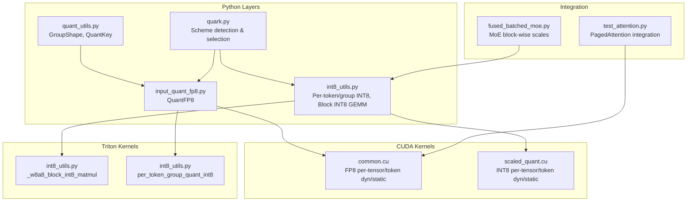
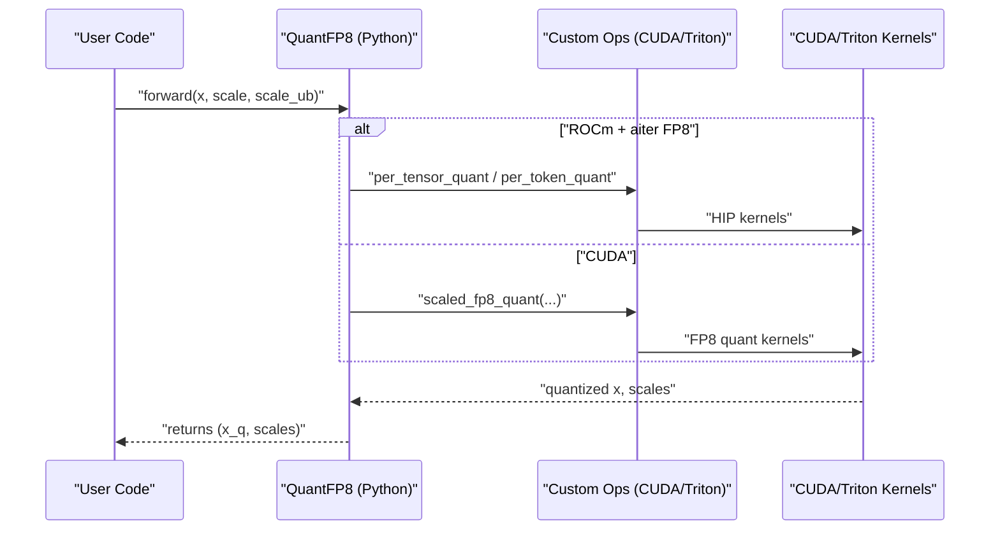
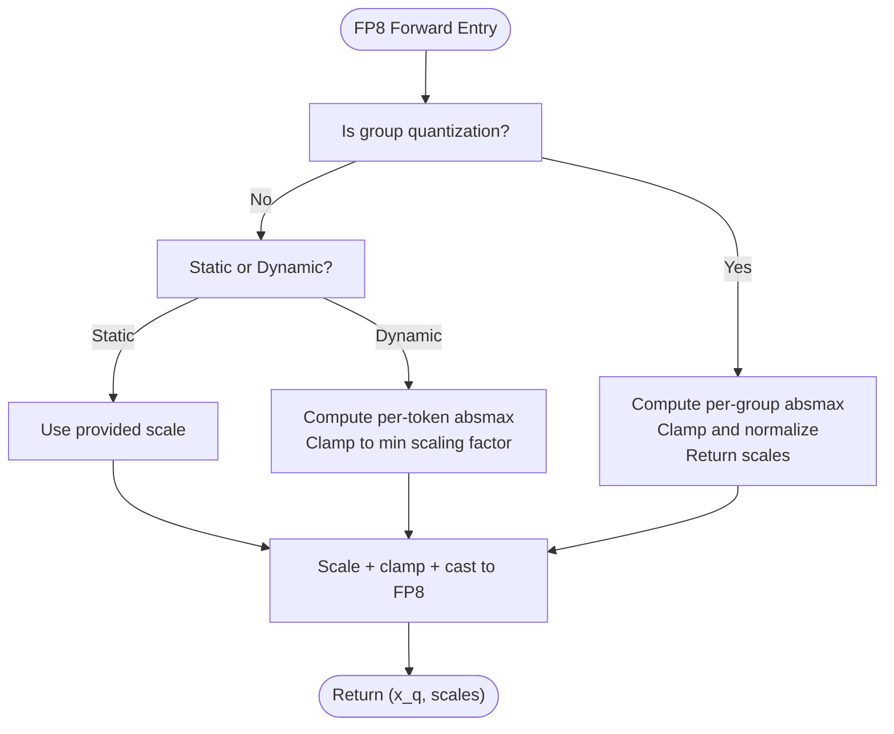
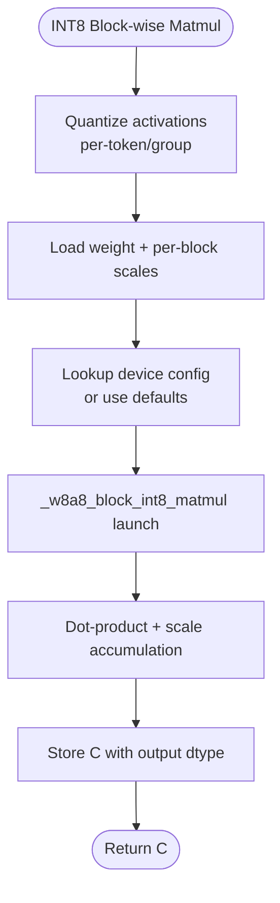
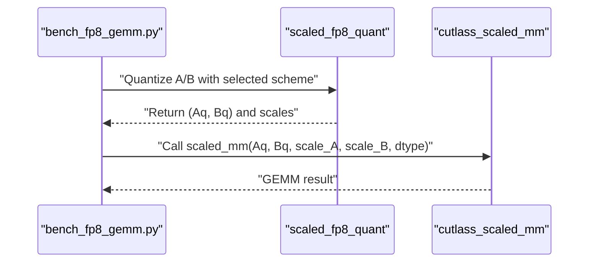
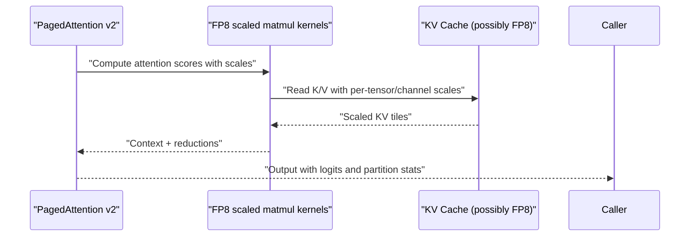
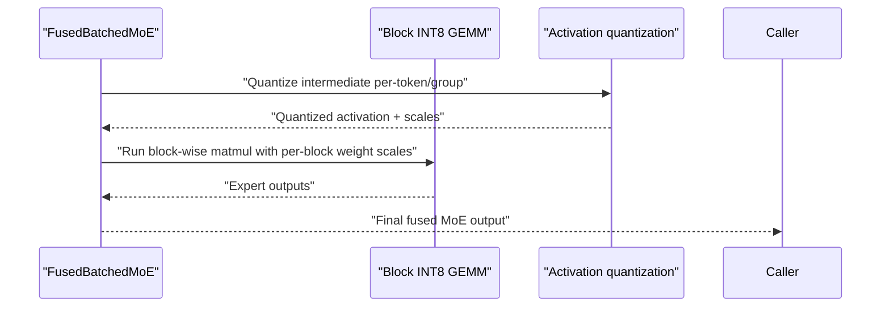
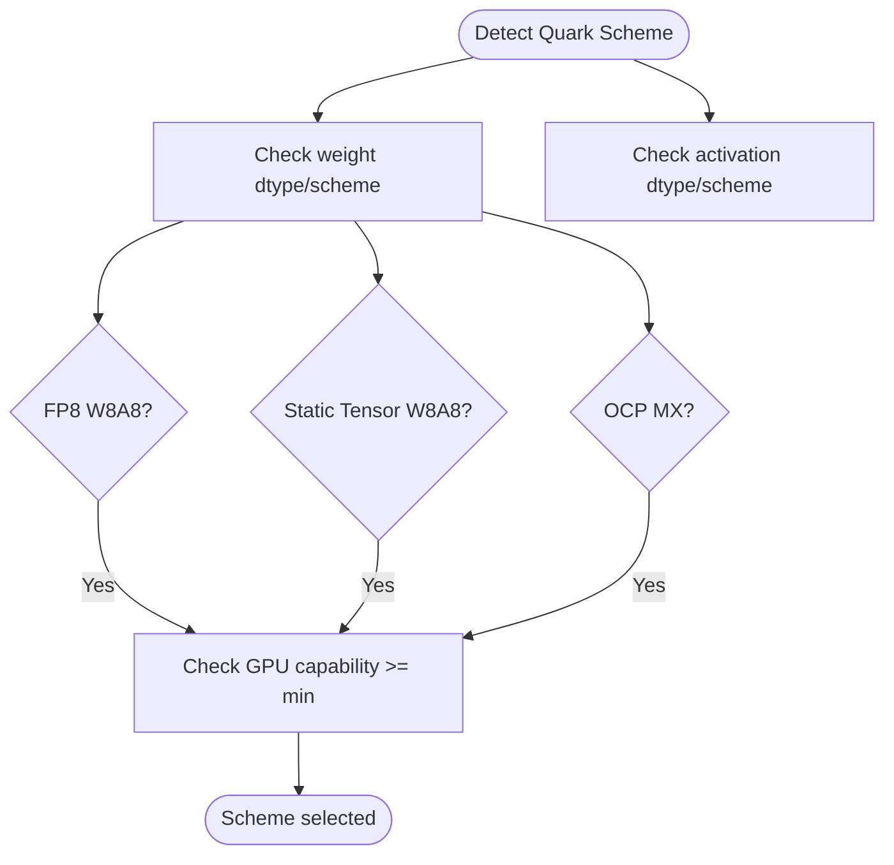
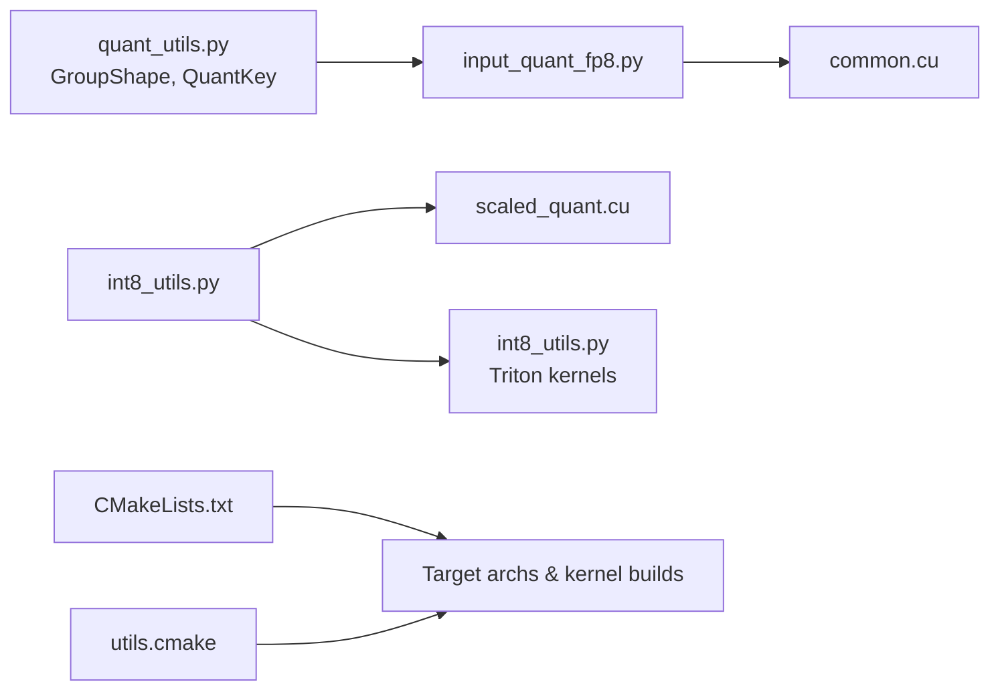

# FP8 and INT8 Quantization

<cite>
**Referenced Files in This Document**
- [input_quant_fp8.py](file://vllm/model_executor/layers/quantization/input_quant_fp8.py)
- [common.cu](file://csrc/quantization/w8a8/fp8/common.cu)
- [quant_utils.py](file://vllm/model_executor/layers/quantization/utils/quant_utils.py)
- [int8_utils.py](file://vllm/model_executor/layers/quantization/utils/int8_utils.py)
- [scaled_quant.cu](file://csrc/quantization/w8a8/int8/scaled_quant.cu)
- [bench_fp8_gemm.py](file://benchmarks/kernels/bench_fp8_gemm.py)
- [quark.py](file://vllm/model_executor/layers/quantization/quark/quark.py)
- [fused_batched_moe.py](file://vllm/model_executor/layers/fused_moe/fused_batched_moe.py)
- [test_attention.py](file://tests/kernels/attention/test_attention.py)
- [quant_utils.py](file://tests/kernels/quant_utils.py)
- [CMakeLists.txt](file://CMakeLists.txt)
- [utils.cmake](file://cmake/utils.cmake)
</cite>

## Table of Contents
1. [Introduction](#introduction)
2. [Project Structure](#project-structure)
3. [Core Components](#core-components)
4. [Architecture Overview](#architecture-overview)
5. [Detailed Component Analysis](#detailed-component-analysis)
6. [Dependency Analysis](#dependency-analysis)
7. [Performance Considerations](#performance-considerations)
8. [Troubleshooting Guide](#troubleshooting-guide)
9. [Conclusion](#conclusion)
10. [Appendices](#appendices)

## Introduction
This document explains FP8 and INT8 quantization in vLLM, focusing on:
- FP8 quantization: dynamic and static per-tensor and per-token schemes, W8A8 support, and hardware-specific optimizations for Ada/Hopper architectures.
- INT8 quantization: W8A8 block-wise compression, per-channel scaling, and performance benefits.
- Implementation of quantized GEMM operations, attention kernels, and mixture-of-expert (MoE) layers.
- Configuration examples, performance benchmarks, accuracy trade-offs, hardware compatibility, memory bandwidth improvements, and integration with PagedAttention.

## Project Structure
The quantization implementation spans Python layers and CUDA/Triton kernels:
- Python input quantization and utilities for FP8/INT8 group shapes and scales.
- CUDA kernels for FP8 and INT8 quantization and scaled matmul.
- Triton kernels for block-wise INT8 GEMM and per-token group quantization.
- Benchmarks comparing FP8 vs full-precision GEMM.
- Quark quantization scheme selection and capability checks.
- MoE and attention integration points.

**Diagram sources**
- [input_quant_fp8.py](file://vllm/model_executor/layers/quantization/input_quant_fp8.py#L1-L203)
- [common.cu](file://csrc/quantization/w8a8/fp8/common.cu#L1-L248)
- [quant_utils.py](file://vllm/model_executor/layers/quantization/utils/quant_utils.py#L1-L132)
- [int8_utils.py](file://vllm/model_executor/layers/quantization/utils/int8_utils.py#L1-L475)
- [scaled_quant.cu](file://csrc/quantization/w8a8/int8/scaled_quant.cu#L1-L328)
- [fused_batched_moe.py](file://vllm/model_executor/layers/fused_moe/fused_batched_moe.py#L192-L233)
- [test_attention.py](file://tests/kernels/attention/test_attention.py#L245-L280)

**Section sources**
- [input_quant_fp8.py](file://vllm/model_executor/layers/quantization/input_quant_fp8.py#L1-L203)
- [common.cu](file://csrc/quantization/w8a8/fp8/common.cu#L1-L248)
- [quant_utils.py](file://vllm/model_executor/layers/quantization/utils/quant_utils.py#L1-L132)
- [int8_utils.py](file://vllm/model_executor/layers/quantization/utils/int8_utils.py#L1-L475)
- [scaled_quant.cu](file://csrc/quantization/w8a8/int8/scaled_quant.cu#L1-L328)
- [fused_batched_moe.py](file://vllm/model_executor/layers/fused_moe/fused_batched_moe.py#L192-L233)
- [test_attention.py](file://tests/kernels/attention/test_attention.py#L245-L280)

## Core Components
- FP8 input quantization:
  - Supports static/dynamic, per-tensor/per-token/group quantization.
  - Uses native PyTorch fallback and CUDA kernels via a custom op.
  - Includes ROCm aiter FP8 quantization path.
- INT8 utilities:
  - Per-token/group quantization for activations.
  - Block-wise INT8 GEMM with configurable block shapes and device-specific tuning.
  - Scaled INT8 quantization kernels for per-tensor and dynamic per-token modes.
- Quantization keys and group shapes:
  - GroupShape.PER_TENSOR, GroupShape.PER_TOKEN, and arbitrary block shapes.
  - QuantKey captures dtype, scale descriptors, and symmetry.
- Quark scheme detection:
  - Validates and selects FP8 W8A8, static tensor W8A8, and OCP MX formats.
  - Enforces GPU capability thresholds for FP8 support.

**Section sources**
- [input_quant_fp8.py](file://vllm/model_executor/layers/quantization/input_quant_fp8.py#L1-L203)
- [quant_utils.py](file://vllm/model_executor/layers/quantization/utils/quant_utils.py#L1-L132)
- [int8_utils.py](file://vllm/model_executor/layers/quantization/utils/int8_utils.py#L1-L475)
- [scaled_quant.cu](file://csrc/quantization/w8a8/int8/scaled_quant.cu#L1-L328)
- [quark.py](file://vllm/model_executor/layers/quantization/quark/quark.py#L221-L322)

## Architecture Overview
FP8 and INT8 quantization integrates through:
- Python quantization layers invoking CUDA/Triton kernels.
- Custom ops for scaled FP8 quantization and per-token/group INT8 quantization.
- MoE and attention modules consuming quantized inputs and scales.
- Device capability checks and architecture-specific kernel builds.

**Diagram sources**
- [input_quant_fp8.py](file://vllm/model_executor/layers/quantization/input_quant_fp8.py#L67-L125)
- [common.cu](file://csrc/quantization/w8a8/fp8/common.cu#L136-L248)

## Detailed Component Analysis

### FP8 Quantization: Dynamic and Static Schemes
- Per-tensor static:
  - Uses a single scale tensor; invoked via a custom op with a constant scale.
- Per-token dynamic:
  - Computes token-wise absmax and clamps to a minimum scaling factor; returns per-token scales.
- Group quantization:
  - Divides the hidden dimension into groups and computes per-group scales; supports column-major scale layouts.
- ROCm aiter path:
  - Uses ROCm aiter ops for per-tensor and per-token FP8 quant when conditions are met.

**Diagram sources**
- [input_quant_fp8.py](file://vllm/model_executor/layers/quantization/input_quant_fp8.py#L67-L167)
- [common.cu](file://csrc/quantization/w8a8/fp8/common.cu#L90-L132)

**Section sources**
- [input_quant_fp8.py](file://vllm/model_executor/layers/quantization/input_quant_fp8.py#L1-L203)
- [common.cu](file://csrc/quantization/w8a8/fp8/common.cu#L1-L248)
- [quant_utils.py](file://vllm/model_executor/layers/quantization/utils/quant_utils.py#L1-L132)

### INT8 Quantization: W8A8 Block-wise Compression
- Per-token/group quantization:
  - Per-token absmax-based scaling; optional epsilon to avoid division by zero.
  - CUDA path uses a custom op; Triton path provides portable kernel.
- Block-wise INT8 GEMM:
  - Supports arbitrary block shapes [N, K] with per-block weight scales and per-token activation scales.
  - Kernel grid selection uses device-specific configurations; falls back to defaults if missing.
- Scaled INT8 quantization:
  - Per-tensor static and dynamic per-token modes with saturation and rounding tailored to device.

**Diagram sources**
- [int8_utils.py](file://vllm/model_executor/layers/quantization/utils/int8_utils.py#L386-L475)
- [scaled_quant.cu](file://csrc/quantization/w8a8/int8/scaled_quant.cu#L1-L328)

**Section sources**
- [int8_utils.py](file://vllm/model_executor/layers/quantization/utils/int8_utils.py#L1-L475)
- [scaled_quant.cu](file://csrc/quantization/w8a8/int8/scaled_quant.cu#L1-L328)

### Quantized GEMM Operations
- FP8 GEMM:
  - Benchmarks compare BF16 baseline against FP8 variants with tensor/channel weight schemes and token/tensor activation schemes.
  - Demonstrates enabling per-token activation quantization and static activation scales.
- INT8 GEMM:
  - Block-wise GEMM with configurable block sizes and device-specific tuning.

**Diagram sources**
- [bench_fp8_gemm.py](file://benchmarks/kernels/bench_fp8_gemm.py#L1-L160)

**Section sources**
- [bench_fp8_gemm.py](file://benchmarks/kernels/bench_fp8_gemm.py#L1-L160)

### Attention Kernels and PagedAttention Integration
- PagedAttention v2:
  - Accepts KV cache scales and supports partitioned computation for long sequences.
  - Integrates with FP8 activation/weight quantization via the underlying scaled matmul path.
- FP8 attention:
  - FP8 quantization kernels compute per-token scales and clamp to safe ranges.

**Diagram sources**
- [test_attention.py](file://tests/kernels/attention/test_attention.py#L245-L280)
- [common.cu](file://csrc/quantization/w8a8/fp8/common.cu#L136-L248)

**Section sources**
- [test_attention.py](file://tests/kernels/attention/test_attention.py#L245-L280)
- [common.cu](file://csrc/quantization/w8a8/fp8/common.cu#L1-L248)

### MoE Layers with Block-wise Quantization
- Fused batched MoE:
  - Consumes per-activation token quantization and per-weight block scales.
  - Uses block sizes for group-wise matmul and stores results masked by expert selection.

**Diagram sources**
- [fused_batched_moe.py](file://vllm/model_executor/layers/fused_moe/fused_batched_moe.py#L192-L233)
- [int8_utils.py](file://vllm/model_executor/layers/quantization/utils/int8_utils.py#L386-L475)

**Section sources**
- [fused_batched_moe.py](file://vllm/model_executor/layers/fused_moe/fused_batched_moe.py#L192-L233)
- [int8_utils.py](file://vllm/model_executor/layers/quantization/utils/int8_utils.py#L386-L475)

### Quark Scheme Detection and Hardware Compatibility
- FP8 W8A8:
  - Requires static weights with per-tensor or per-channel schemes and per-tensor activation for dynamic input.
- Static tensor W8A8:
  - Requires static int8 weights (per-tensor or per-channel) and per-tensor int8 activation; symmetric weight quantization.
- OCP MX:
  - Per-group quantization with group size 32 and e8m0 scale format for FP4/F6 dtypes.
- Capability checks:
  - Minimum GPU compute capability enforced for FP8 support.

**Diagram sources**
- [quark.py](file://vllm/model_executor/layers/quantization/quark/quark.py#L221-L322)

**Section sources**
- [quark.py](file://vllm/model_executor/layers/quantization/quark/quark.py#L221-L322)

## Dependency Analysis
- GroupShape and QuantKey define quantization metadata used across Python and tests.
- CUDA kernels depend on device capability and build flags; CMake sets target architectures and optional kernel builds.
- Triton configs are discovered per device and shape; missing configs fall back to defaults.

**Diagram sources**
- [quant_utils.py](file://vllm/model_executor/layers/quantization/utils/quant_utils.py#L1-L132)
- [input_quant_fp8.py](file://vllm/model_executor/layers/quantization/input_quant_fp8.py#L1-L203)
- [common.cu](file://csrc/quantization/w8a8/fp8/common.cu#L1-L248)
- [int8_utils.py](file://vllm/model_executor/layers/quantization/utils/int8_utils.py#L1-L475)
- [scaled_quant.cu](file://csrc/quantization/w8a8/int8/scaled_quant.cu#L1-L328)
- [CMakeLists.txt](file://CMakeLists.txt#L900-L940)
- [utils.cmake](file://cmake/utils.cmake#L399-L425)

**Section sources**
- [quant_utils.py](file://vllm/model_executor/layers/quantization/utils/quant_utils.py#L1-L132)
- [CMakeLists.txt](file://CMakeLists.txt#L900-L940)
- [utils.cmake](file://cmake/utils.cmake#L399-L425)

## Performance Considerations
- FP8 GEMM benchmarks:
  - Compare BF16 baseline with FP8 variants using per-tensor and per-channel weight schemes and per-token or per-tensor activation schemes.
  - Demonstrates enabling per-token activation quantization and static activation scales.
- INT8 block-wise GEMM:
  - Device-specific configuration lookup improves occupancy and reduces overhead.
  - Block sizes must align with kernel constraints; defaults ensure fallback behavior.
- Memory bandwidth:
  - FP8 reduces activation bandwidth; INT8 reduces weight storage and increases arithmetic intensity.
- Attention and MoE:
  - PagedAttention partitions computation; FP8 activation quantization reduces KV cache bandwidth.
  - Block-wise INT8 GEMM accelerates expert projections in MoE layers.

[No sources needed since this section provides general guidance]

## Troubleshooting Guide
- FP8 dynamic per-token quantization:
  - Ensure contiguous tensors and optional upper-bound scale is provided when needed.
  - On ROCm, verify aiter FP8 enablement and contiguity constraints.
- INT8 per-token/group quantization:
  - Group size must divide the hidden dimension; ensure tensors are contiguous.
  - For Triton kernels, confirm device capability and that rounding modes match expectations.
- Block-wise INT8 GEMM:
  - Verify block shapes and stride assumptions; ensure per-token and per-block scale layouts match kernel expectations.
- Quark scheme selection:
  - If FP8 W8A8 is unsupported, check GPU compute capability; ensure symmetric weight quantization and correct activation schemes.

**Section sources**
- [input_quant_fp8.py](file://vllm/model_executor/layers/quantization/input_quant_fp8.py#L67-L125)
- [int8_utils.py](file://vllm/model_executor/layers/quantization/utils/int8_utils.py#L191-L256)
- [scaled_quant.cu](file://csrc/quantization/w8a8/int8/scaled_quant.cu#L1-L328)
- [quark.py](file://vllm/model_executor/layers/quantization/quark/quark.py#L221-L322)

## Conclusion
vLLM’s FP8 and INT8 quantization stack provides flexible, high-performance inference:
- FP8 supports dynamic/static per-tensor/per-token and group quantization with ROCm aiter acceleration.
- INT8 enables W8A8 block-wise GEMM with per-token activation and per-block weight scaling.
- Integration points include attention (PagedAttention) and MoE layers, with device-aware kernel builds and configuration tuning.
- Benchmarks and scheme detection help users select optimal configurations for accuracy and throughput.

[No sources needed since this section summarizes without analyzing specific files]

## Appendices

### Configuration Examples
- FP8 W8A8 (dynamic activation):
  - Weight: static per-tensor or per-channel FP8.
  - Activation: per-tensor FP8 dynamic.
- FP8 W8A8 (static activation):
  - Weight: static per-tensor or per-channel FP8.
  - Activation: static per-tensor FP8.
- INT8 W8A8 (static):
  - Weight: static int8 per-tensor or per-channel (symmetric).
  - Activation: static int8 per-tensor (symmetric/asymmetric supported).
- INT8 W8A8 block-wise:
  - Weight: int8 per 128x128 blocks (example).
  - Activation: per-token/group quantization.

[No sources needed since this section provides general guidance]

### Accuracy and Benchmarks
- Reference FP8 dynamic per-tensor quantization:
  - Reproduces kernel-level operations to match CUDA kernel outputs precisely.
- FP8 GEMM benchmark:
  - Compares BF16 vs FP8 across model shapes and TP sizes; toggles per-token activation quantization and static activation scales.

**Section sources**
- [quant_utils.py](file://tests/kernels/quant_utils.py#L66-L101)
- [bench_fp8_gemm.py](file://benchmarks/kernels/bench_fp8_gemm.py#L1-L160)

### Hardware Compatibility and Architecture Builds
- Minimum GPU capability checks for FP8 schemes.
- CMake sets target architectures and conditionally builds kernels for specific architectures (e.g., Hopper).
- utils.cmake filters supported architectures and applies flags.

**Section sources**
- [quark.py](file://vllm/model_executor/layers/quantization/quark/quark.py#L205-L220)
- [CMakeLists.txt](file://CMakeLists.txt#L900-L940)
- [utils.cmake](file://cmake/utils.cmake#L399-L425)