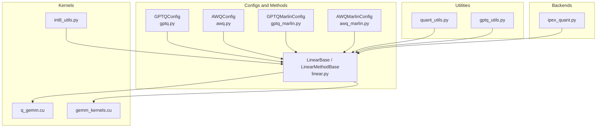
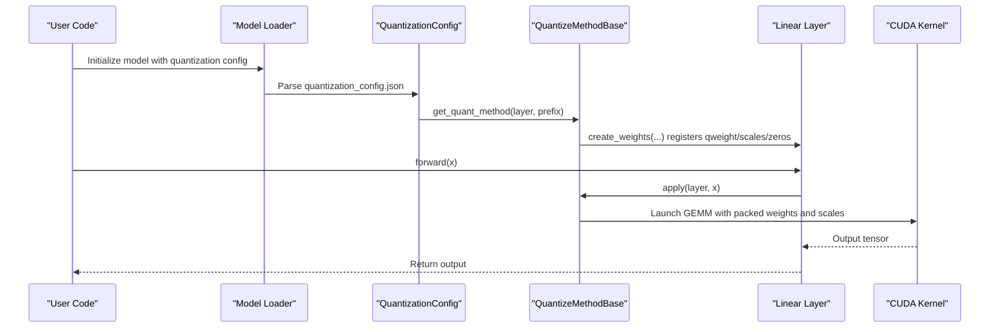
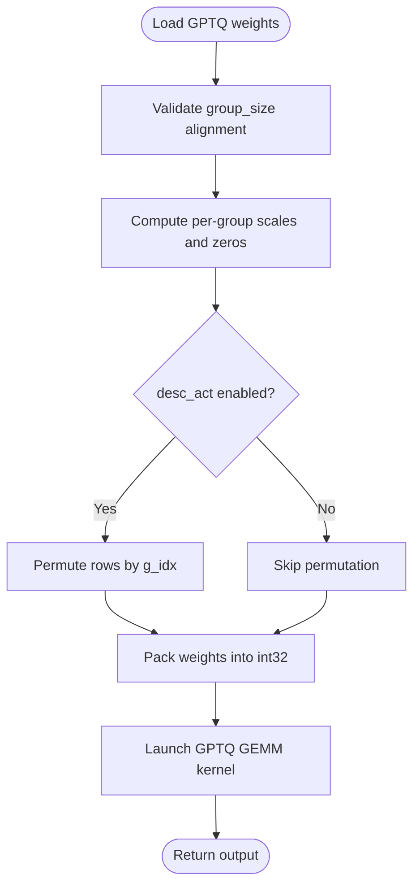
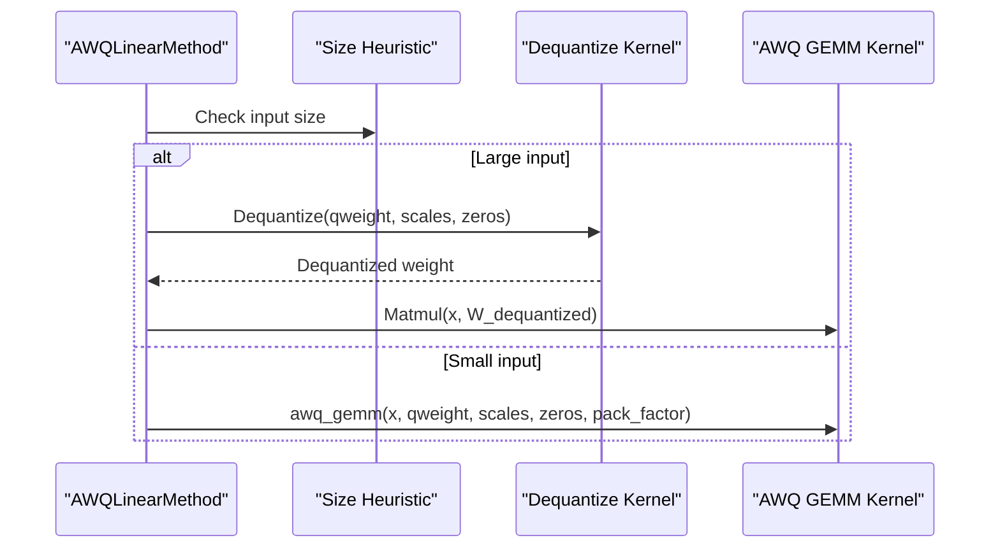
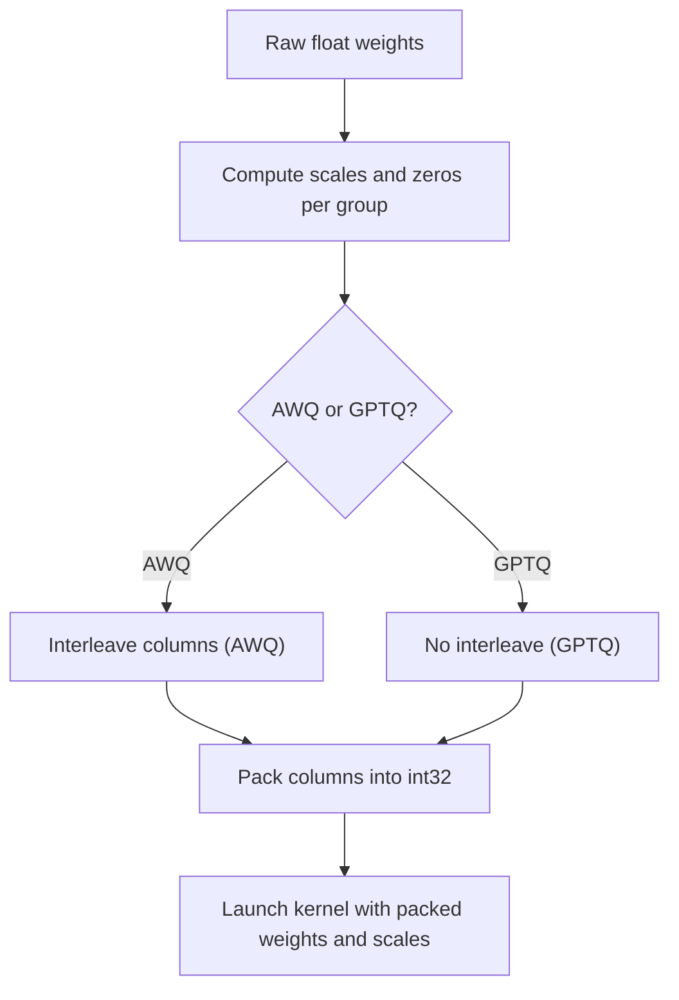
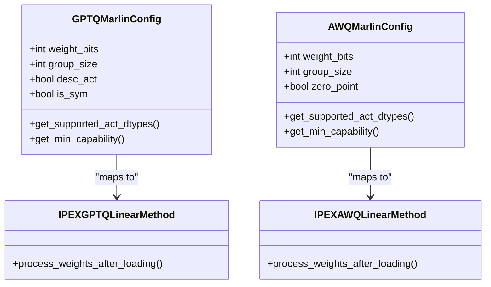
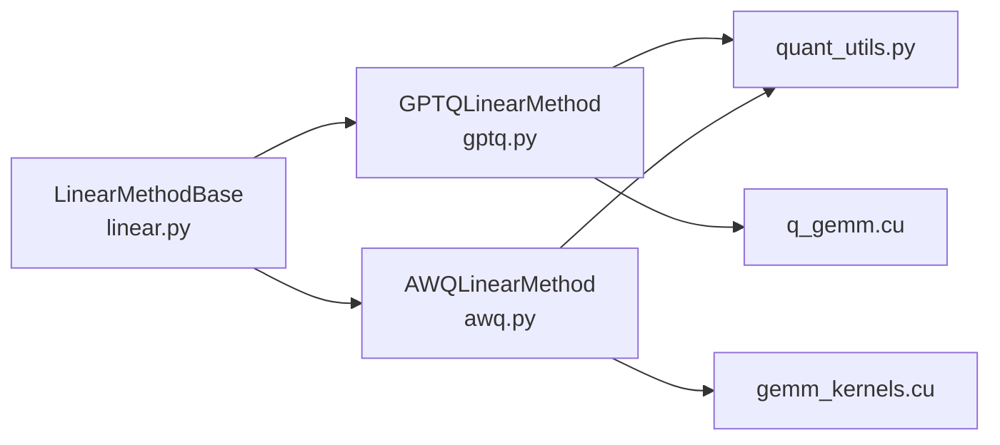

# GPTQ and AWQ Quantization

<cite>
**Referenced Files in This Document**
- [gptq.py](file://vllm/model_executor/layers/quantization/gptq.py)
- [awq.py](file://vllm/model_executor/layers/quantization/awq.py)
- [gptq_marlin.py](file://vllm/model_executor/layers/quantization/gptq_marlin.py)
- [awq_marlin.py](file://vllm/model_executor/layers/quantization/awq_marlin.py)
- [quant_utils.py](file://vllm/model_executor/layers/quantization/utils/quant_utils.py)
- [gptq_utils.py](file://vllm/model_executor/layers/quantization/utils/gptq_utils.py)
- [linear.py](file://vllm/model_executor/layers/linear.py)
- [q_gemm.cu](file://csrc/quantization/gptq/q_gemm.cu)
- [gemm_kernels.cu](file://csrc/quantization/awq/gemm_kernels.cu)
- [int8_utils.py](file://vllm/model_executor/layers/quantization/utils/int8_utils.py)
- [ipex_quant.py](file://vllm/model_executor/layers/quantization/ipex_quant.py)
- [model.py](file://vllm/config/model.py)
- [int4.md](file://docs/features/quantization/int4.md)
- [int8.md](file://docs/features/quantization/int8.md)
</cite>

## Table of Contents
1. [Introduction](#introduction)
2. [Project Structure](#project-structure)
3. [Core Components](#core-components)
4. [Architecture Overview](#architecture-overview)
5. [Detailed Component Analysis](#detailed-component-analysis)
6. [Dependency Analysis](#dependency-analysis)
7. [Performance Considerations](#performance-considerations)
8. [Troubleshooting Guide](#troubleshooting-guide)
9. [Conclusion](#conclusion)
10. [Appendices](#appendices)

## Introduction
This document explains GPTQ (Group-wise Post-Training Quantization) and AWQ (Activation-aware Weight Quantization) in vLLM. It covers GPTQ’s structured pruning approach, channel-wise quantization with group sizes, and calibration dataset requirements. It also documents AWQ’s activation-aware optimization, outlier detection, and iterative refinement algorithms. The guide details model conversion workflows from full-precision to quantized formats, including weight repacking and kernel generation. Hardware-specific optimizations for GPTQ/AWQ kernels are described, alongside performance comparisons with other quantization methods and accuracy preservation techniques. Practical examples for preparing calibration datasets, converting HuggingFace models, and deploying quantized models in production are included, along with mixed-precision inference support and distributed serving integration.

## Project Structure
The quantization subsystem in vLLM is organized around:
- Quantization configs and linear method factories for GPTQ and AWQ
- Utilities for packing/unpacking, permutation, and group-wise quantization
- CUDA kernels for GEMM and dequantization
- Optional Marlin and IPEX backends for hardware acceleration
- Documentation for calibration recipes

**Diagram sources**
- [gptq.py](file://vllm/model_executor/layers/quantization/gptq.py#L43-L124)
- [awq.py](file://vllm/model_executor/layers/quantization/awq.py#L32-L94)
- [gptq_marlin.py](file://vllm/model_executor/layers/quantization/gptq_marlin.py#L93-L173)
- [awq_marlin.py](file://vllm/model_executor/layers/quantization/awq_marlin.py#L67-L112)
- [linear.py](file://vllm/model_executor/layers/linear.py#L155-L241)
- [quant_utils.py](file://vllm/model_executor/layers/quantization/utils/quant_utils.py#L247-L351)
- [gptq_utils.py](file://vllm/model_executor/layers/quantization/utils/gptq_utils.py#L128-L159)
- [q_gemm.cu](file://csrc/quantization/gptq/q_gemm.cu#L190-L200)
- [gemm_kernels.cu](file://csrc/quantization/awq/gemm_kernels.cu#L20-L40)
- [int8_utils.py](file://vllm/model_executor/layers/quantization/utils/int8_utils.py#L218-L256)
- [ipex_quant.py](file://vllm/model_executor/layers/quantization/ipex_quant.py#L265-L295)

**Section sources**
- [gptq.py](file://vllm/model_executor/layers/quantization/gptq.py#L43-L124)
- [awq.py](file://vllm/model_executor/layers/quantization/awq.py#L32-L94)
- [gptq_marlin.py](file://vllm/model_executor/layers/quantization/gptq_marlin.py#L93-L173)
- [awq_marlin.py](file://vllm/model_executor/layers/quantization/awq_marlin.py#L67-L112)
- [linear.py](file://vllm/model_executor/layers/linear.py#L155-L241)

## Core Components
- GPTQConfig and GPTQLinearMethod
  - Defines GPTQ quantization parameters (bits, group_size, desc_act, checkpoint_format), validates supported configurations, and constructs quantized parameters (packed weights, scales, zeros, and optional permutation indices). It selects appropriate kernels and handles post-loading permutations for activation ordering.
- AWQConfig and AWQLinearMethod
  - Defines AWQ quantization parameters (bits=4, group_size, zero_point), validates hardware capability, and constructs packed weights, scales, and zeros. It chooses between a dequantize-then-GEMM path and a specialized GEMM kernel depending on input size heuristics.
- Utilities for quantization and packing
  - Provides group-wise quantization, packing/unpacking routines, permutation helpers, and scale broadcasting utilities used by both GPTQ and AWQ.
- CUDA kernels
  - GPTQ kernel performs group-wise GEMM with per-group scales and optional zero points and activation ordering permutations.
  - AWQ kernel performs dequantization with per-group scales and zeros, followed by FP16 matmul or uses a specialized 4-bit GEMM path.
- Backends and acceleration
  - GPTQMarlinConfig/AWQMarlinConfig integrate with Marlin kernels for higher throughput on supported architectures.
  - IPEXAWQLinearMethod/IPEXGPTQLinearMethod integrate Intel Extension for PyTorch for optimized inference on compatible devices.

**Section sources**
- [gptq.py](file://vllm/model_executor/layers/quantization/gptq.py#L125-L189)
- [gptq.py](file://vllm/model_executor/layers/quantization/gptq.py#L225-L394)
- [awq.py](file://vllm/model_executor/layers/quantization/awq.py#L95-L141)
- [awq.py](file://vllm/model_executor/layers/quantization/awq.py#L164-L278)
- [quant_utils.py](file://vllm/model_executor/layers/quantization/utils/quant_utils.py#L382-L475)
- [quant_utils.py](file://vllm/model_executor/layers/quantization/utils/quant_utils.py#L530-L640)
- [q_gemm.cu](file://csrc/quantization/gptq/q_gemm.cu#L190-L200)
- [gemm_kernels.cu](file://csrc/quantization/awq/gemm_kernels.cu#L20-L40)
- [gptq_marlin.py](file://vllm/model_executor/layers/quantization/gptq_marlin.py#L93-L173)
- [awq_marlin.py](file://vllm/model_executor/layers/quantization/awq_marlin.py#L67-L112)
- [ipex_quant.py](file://vllm/model_executor/layers/quantization/ipex_quant.py#L265-L295)

## Architecture Overview
The quantization pipeline integrates configs, parameter creation, and kernel execution:

**Diagram sources**
- [gptq.py](file://vllm/model_executor/layers/quantization/gptq.py#L171-L189)
- [awq.py](file://vllm/model_executor/layers/quantization/awq.py#L164-L204)
- [linear.py](file://vllm/model_executor/layers/linear.py#L343-L405)
- [q_gemm.cu](file://csrc/quantization/gptq/q_gemm.cu#L190-L200)
- [gemm_kernels.cu](file://csrc/quantization/awq/gemm_kernels.cu#L20-L40)

## Detailed Component Analysis

### GPTQ Quantization Analysis
- Structured pruning and activation ordering
  - GPTQ supports activation ordering via permutation indices and group-wise quantization. The permutation is applied to rows based on group size and stored as g_idx. During loading, the permutation is sorted or shuffled to align with the kernel’s expectations.
- Channel-wise quantization with group sizes
  - Scales and optional zero points are computed per group. Supported group sizes include -1 (channel-wise), 32, 64, 128, and full-K sizes. The implementation validates alignment with tensor parallel partitions.
- Calibration dataset requirements
  - Calibration data should reflect deployment distributions. The documentation recommends datasets like ultrachat and suggests tuning sequence length and sample count for accuracy.
- Kernel execution
  - The GPTQ GEMM kernel reads packed weights, applies per-group scales and zero points, and optionally uses activation ordering permutations. It supports both v1 and v2 checkpoint formats.

**Diagram sources**
- [gptq.py](file://vllm/model_executor/layers/quantization/gptq.py#L238-L350)
- [quant_utils.py](file://vllm/model_executor/layers/quantization/utils/quant_utils.py#L382-L475)
- [quant_utils.py](file://vllm/model_executor/layers/quantization/utils/quant_utils.py#L530-L640)
- [q_gemm.cu](file://csrc/quantization/gptq/q_gemm.cu#L190-L200)

**Section sources**
- [gptq.py](file://vllm/model_executor/layers/quantization/gptq.py#L238-L350)
- [gptq.py](file://vllm/model_executor/layers/quantization/gptq.py#L351-L394)
- [quant_utils.py](file://vllm/model_executor/layers/quantization/utils/quant_utils.py#L382-L475)
- [quant_utils.py](file://vllm/model_executor/layers/quantization/utils/quant_utils.py#L530-L640)
- [int4.md](file://docs/features/quantization/int4.md#L49-L142)

### AWQ Quantization Analysis
- Activation-aware optimization
  - AWQ computes per-group scales and zero points and packs weights for efficient dequantization. The method chooses between a dequantize-then-GEMM path and a specialized 4-bit GEMM kernel based on input size heuristics.
- Outlier detection and iterative refinement
  - Outlier handling is integrated into the per-group scale computation and zero-point logic. Iterative refinement is not explicitly implemented in the referenced files; however, the per-group quantization and zero-point mechanics underpin the activation-aware behavior.
- Kernel execution
  - AWQ kernels support dequantization with per-group scales and zeros, then matrix multiplication. The kernel enforces minimum GPU compute capability requirements.

**Diagram sources**
- [awq.py](file://vllm/model_executor/layers/quantization/awq.py#L254-L278)
- [gemm_kernels.cu](file://csrc/quantization/awq/gemm_kernels.cu#L20-L40)

**Section sources**
- [awq.py](file://vllm/model_executor/layers/quantization/awq.py#L164-L278)
- [gemm_kernels.cu](file://csrc/quantization/awq/gemm_kernels.cu#L20-L40)

### Weight Repacking and Kernel Generation
- Packing and unpacking
  - Both GPTQ and AWQ rely on packing weights into int32 arrays along specific dimensions. The utilities provide packing/unpacking routines for rows and columns, and AWQ includes a column-interleave step prior to packing.
- Kernel selection and format
  - GPTQ supports v1 and v2 checkpoint formats, selecting different kernel paths accordingly. AWQ relies on per-group scales and zeros and uses either a dequantize-then-GEMM path or a specialized kernel.

**Diagram sources**
- [quant_utils.py](file://vllm/model_executor/layers/quantization/utils/quant_utils.py#L530-L640)
- [quant_utils.py](file://vllm/model_executor/layers/quantization/utils/quant_utils.py#L247-L351)
- [q_gemm.cu](file://csrc/quantization/gptq/q_gemm.cu#L190-L200)
- [gemm_kernels.cu](file://csrc/quantization/awq/gemm_kernels.cu#L20-L40)

**Section sources**
- [quant_utils.py](file://vllm/model_executor/layers/quantization/utils/quant_utils.py#L247-L351)
- [quant_utils.py](file://vllm/model_executor/layers/quantization/utils/quant_utils.py#L530-L640)
- [gptq.py](file://vllm/model_executor/layers/quantization/gptq.py#L238-L350)
- [awq.py](file://vllm/model_executor/layers/quantization/awq.py#L164-L204)

### Hardware-Specific Optimizations
- Marlin backends
  - GPTQMarlinConfig and AWQMarlinConfig integrate with Marlin kernels for improved throughput on supported architectures. They validate compatibility and select appropriate quant types and layouts.
- IPEX integration
  - IPEXAWQLinearMethod and IPEXGPTQLinearMethod wrap quantized layers for Intel devices, configuring weight-only quantization modes and enabling optimized execution paths.

**Diagram sources**
- [gptq_marlin.py](file://vllm/model_executor/layers/quantization/gptq_marlin.py#L93-L173)
- [awq_marlin.py](file://vllm/model_executor/layers/quantization/awq_marlin.py#L67-L112)
- [ipex_quant.py](file://vllm/model_executor/layers/quantization/ipex_quant.py#L265-L295)

**Section sources**
- [gptq_marlin.py](file://vllm/model_executor/layers/quantization/gptq_marlin.py#L93-L173)
- [awq_marlin.py](file://vllm/model_executor/layers/quantization/awq_marlin.py#L67-L112)
- [ipex_quant.py](file://vllm/model_executor/layers/quantization/ipex_quant.py#L265-L295)

## Dependency Analysis
- Linear layer abstraction
  - LinearMethodBase orchestrates parameter creation and kernel invocation. It supports tensor parallelism and fused modules, ensuring quantized parameters are properly sharded and loaded.
- Quantization utilities
  - quant_utils.py centralizes packing/unpacking, permutation, and group-wise quantization logic used by both GPTQ and AWQ.
- Kernel dependencies
  - GPTQ and AWQ kernels depend on packed weight layouts, group sizes, and scale/zero formats. The CUDA kernels implement the compute loops for efficient inference.

**Diagram sources**
- [linear.py](file://vllm/model_executor/layers/linear.py#L155-L241)
- [gptq.py](file://vllm/model_executor/layers/quantization/gptq.py#L225-L394)
- [awq.py](file://vllm/model_executor/layers/quantization/awq.py#L164-L278)
- [quant_utils.py](file://vllm/model_executor/layers/quantization/utils/quant_utils.py#L247-L351)
- [q_gemm.cu](file://csrc/quantization/gptq/q_gemm.cu#L190-L200)
- [gemm_kernels.cu](file://csrc/quantization/awq/gemm_kernels.cu#L20-L40)

**Section sources**
- [linear.py](file://vllm/model_executor/layers/linear.py#L155-L241)
- [gptq.py](file://vllm/model_executor/layers/quantization/gptq.py#L225-L394)
- [awq.py](file://vllm/model_executor/layers/quantization/awq.py#L164-L278)
- [quant_utils.py](file://vllm/model_executor/layers/quantization/utils/quant_utils.py#L247-L351)

## Performance Considerations
- Kernel selection
  - GPTQ uses a dedicated GEMM kernel supporting multiple bit widths and activation ordering permutations. AWQ switches between a dequantize-then-GEMM path and a specialized kernel based on input size heuristics.
- Hardware backends
  - Marlin backends and IPEX integration accelerate inference on supported GPUs and Intel devices, respectively. Minimum compute capabilities are enforced for AWQ kernels.
- Mixed-precision inference
  - Some backends support half-precision activation dtypes and symmetric/asymmetric quantization modes. Scale handling and broadcasting are implemented to minimize overhead.

[No sources needed since this section provides general guidance]

## Troubleshooting Guide
- Alignment errors
  - If tensor parallel size causes misalignment with group_size or pack_factor, quantization initialization raises explicit errors. Reduce TP size or adjust group_size accordingly.
- Unsupported configurations
  - GPTQ currently warns against using 4-bit GEMM kernels and recommends Marlin or BitBLAS alternatives. AWQ restricts bits to 4.
- Calibration quality
  - Accuracy drops often indicate insufficient or mismatched calibration data. Increase sample count and ensure sequence length and templates match deployment conditions.

**Section sources**
- [gptq.py](file://vllm/model_executor/layers/quantization/gptq.py#L86-L103)
- [gptq.py](file://vllm/model_executor/layers/quantization/gptq.py#L250-L262)
- [awq.py](file://vllm/model_executor/layers/quantization/awq.py#L48-L63)
- [int4.md](file://docs/features/quantization/int4.md#L131-L142)

## Conclusion
vLLM’s GPTQ and AWQ implementations provide robust, hardware-accelerated quantization with careful attention to group-wise quantization, activation ordering, and weight repacking. The modular design enables seamless integration with Marlin and IPEX backends, while utilities and kernels ensure efficient inference. Proper calibration and configuration yield strong accuracy and performance across diverse deployment scenarios.

[No sources needed since this section summarizes without analyzing specific files]

## Appendices

### Practical Examples and Recipes
- Preparing calibration datasets
  - Use datasets like ultrachat and apply the model’s chat/instruction template. Tokenize with appropriate sequence length and sample count. See the calibration recipe for GPTQ/INT4 and INT8 activation quantization.
- Converting HuggingFace models
  - The model loader parses quantization_config.json and resolves quantization methods automatically. For GPTQ/AWQ, ensure the checkpoint format and group sizes match the intended inference backend.
- Deploying quantized models
  - Choose backends (Marlin, IPEX) for acceleration. Verify hardware capability and minimum compute requirements. Integrate with distributed serving by ensuring quantized parameters are correctly sharded and loaded.

**Section sources**
- [int4.md](file://docs/features/quantization/int4.md#L49-L142)
- [int8.md](file://docs/features/quantization/int8.md#L54-L85)
- [model.py](file://vllm/config/model.py#L820-L853)