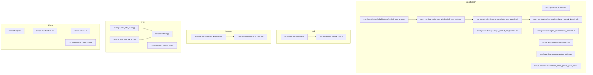
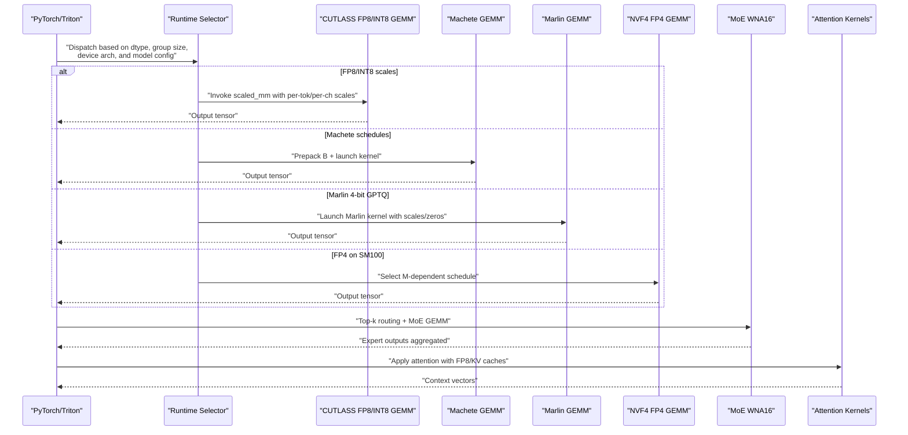
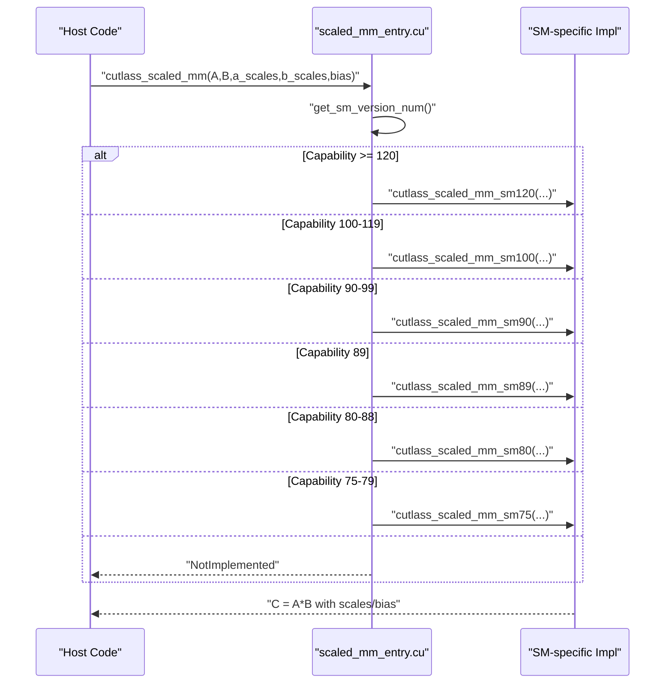
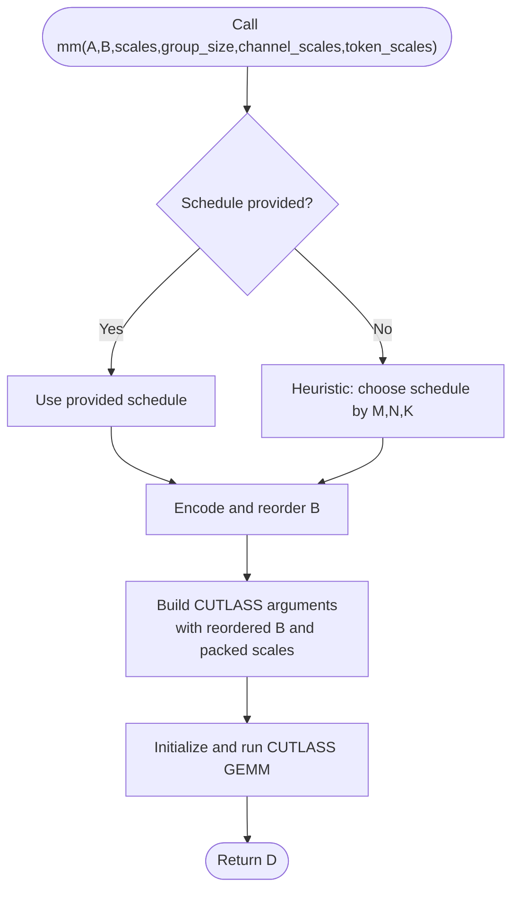
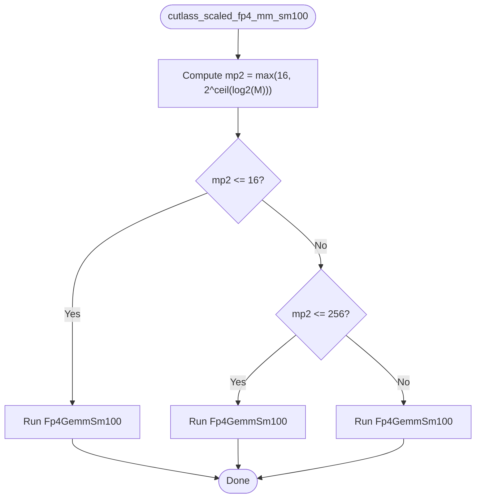
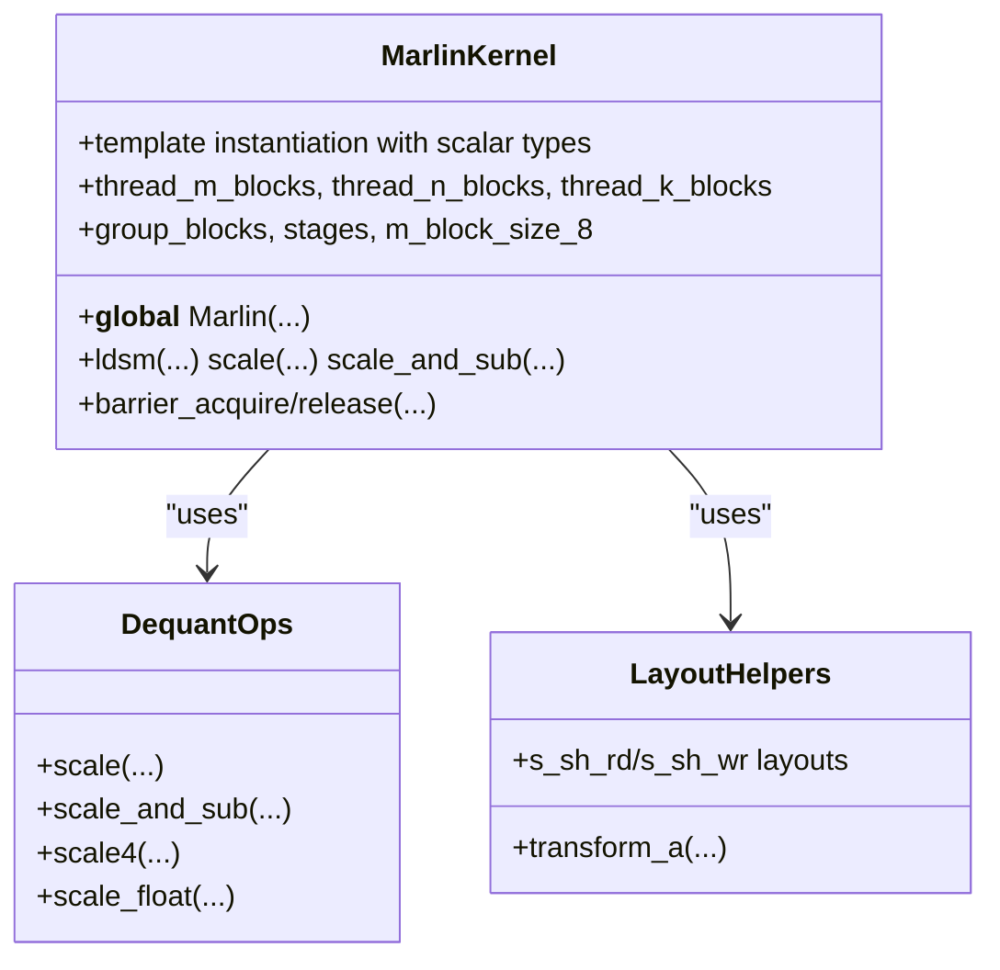
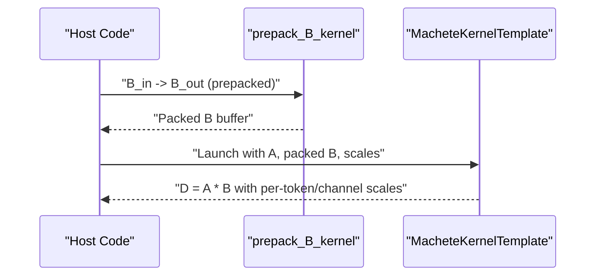
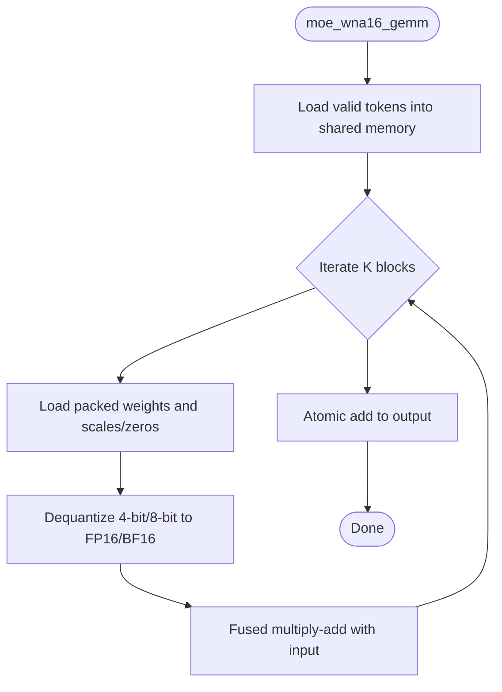
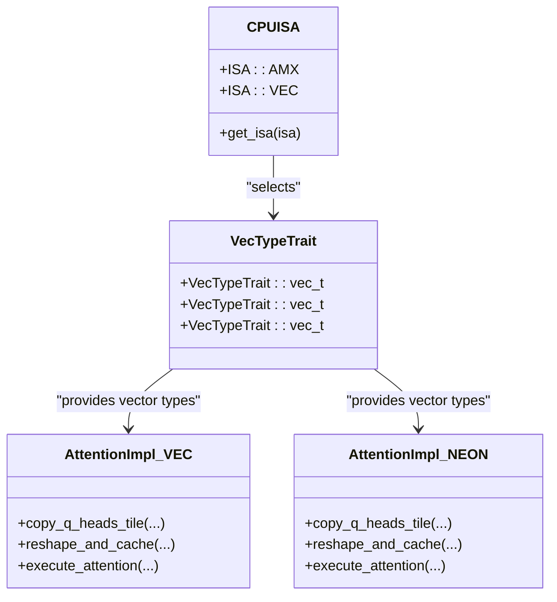
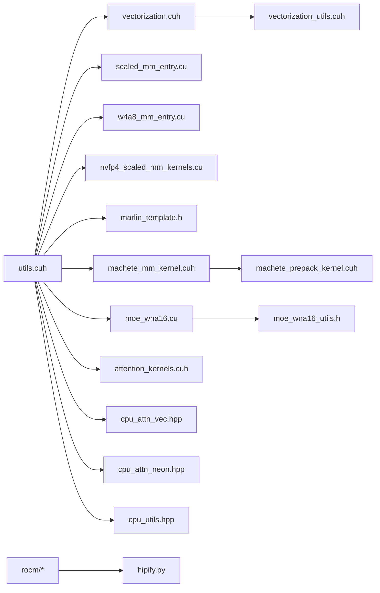

# Quantization Kernels and Performance

<cite>
**Referenced Files in This Document**
- [utils.cuh](file://csrc/quantization/utils.cuh)
- [vectorization.cuh](file://csrc/quantization/vectorization.cuh)
- [vectorization_utils.cuh](file://csrc/quantization/vectorization_utils.cuh)
- [per_token_group_quant_8bit.h](file://csrc/quantization/w8a8/per_token_group_quant_8bit.h)
- [scaled_mm_entry.cu](file://csrc/quantization/w8a8/cutlass/scaled_mm_entry.cu)
- [w4a8_mm_entry.cu](file://csrc/quantization/cutlass_w4a8/w4a8_mm_entry.cu)
- [nvfp4_scaled_mm_kernels.cu](file://csrc/quantization/fp4/nvfp4_scaled_mm_kernels.cu)
- [marlin_template.h](file://csrc/quantization/gptq_marlin/marlin_template.h)
- [machete_mm_kernel.cuh](file://csrc/quantization/machete/machete_mm_kernel.cuh)
- [machete_prepack_kernel.cuh](file://csrc/quantization/machete/machete_prepack_kernel.cuh)
- [moe_wna16.cu](file://csrc/moe/moe_wna16.cu)
- [moe_wna16_utils.h](file://csrc/moe/moe_wna16_utils.h)
- [attention_kernels.cuh](file://csrc/attention/attention_kernels.cuh)
- [attention_utils.cuh](file://csrc/attention/attention_utils.cuh)
- [layernorm_quant_kernels.cu](file://csrc/layernorm_quant_kernels.cu)
- [activation_kernels.cu](file://csrc/activation_kernels.cu)
- [cpu_attn_vec.hpp](file://csrc/cpu/cpu_attn_vec.hpp)
- [cpu_attn_neon.hpp](file://csrc/cpu/cpu_attn_neon.hpp)
- [cpu_utils.hpp](file://csrc/cpu/utils.hpp)
- [torch_bindings.cpp](file://csrc/cpu/torch_bindings.cpp)
- [rocm/ops.h](file://csrc/rocm/ops.h)
- [rocm/attention.cu](file://csrc/rocm/attention.cu)
- [rocm/torch_bindings.cpp](file://csrc/rocm/torch_bindings.cpp)
- [hipify.py](file://cmake/hipify.py)
- [README.md](file://README.md)
</cite>

## Table of Contents
1. [Introduction](#introduction)
2. [Project Structure](#project-structure)
3. [Core Components](#core-components)
4. [Architecture Overview](#architecture-overview)
5. [Detailed Component Analysis](#detailed-component-analysis)
6. [Dependency Analysis](#dependency-analysis)
7. [Performance Considerations](#performance-considerations)
8. [Troubleshooting Guide](#troubleshooting-guide)
9. [Conclusion](#conclusion)
10. [Appendices](#appendices)

## Introduction
This document explains the native C++/CUDA quantization kernels and performance optimizations in vLLM. It covers quantized GEMM kernels, attention kernels, and mixture-of-expert (MoE) layer implementations. It documents hardware-specific optimizations for NVIDIA (Marlin, FP4, CUTLASS), AMD ROCm, and Intel/ARM CPU vectorization. It also details kernel selection algorithms, performance tuning parameters, memory layout optimizations, and quantization-specific operations such as per-token/group quantization, vectorized operations, and SIMD optimizations. Benchmarking methodologies, profiling tools, and integration with PyTorch’s compilation pipeline are included, along with guidance for custom kernel development and performance debugging.

## Project Structure
The quantization and performance-critical components are primarily located under:
- csrc/quantization: quantization kernels, vectorization utilities, and hardware-specific adapters
- csrc/moe: MoE kernels and utilities
- csrc/attention: attention kernels and utilities
- csrc/cpu: CPU-side vectorization and attention implementations
- csrc/rocm: ROCm-specific adaptations
- cmake: build-time configuration and HIP conversion utilities

**Diagram sources**
- [utils.cuh](file://csrc/quantization/utils.cuh#L1-L59)
- [vectorization.cuh](file://csrc/quantization/vectorization.cuh#L1-L32)
- [vectorization_utils.cuh](file://csrc/quantization/vectorization_utils.cuh#L1-L178)
- [scaled_mm_entry.cu](file://csrc/quantization/w8a8/cutlass/scaled_mm_entry.cu#L1-L423)
- [w4a8_mm_entry.cu](file://csrc/quantization/cutlass_w4a8/w4a8_mm_entry.cu#L1-L430)
- [nvfp4_scaled_mm_kernels.cu](file://csrc/quantization/fp4/nvfp4_scaled_mm_kernels.cu#L1-L318)
- [marlin_template.h](file://csrc/quantization/gptq_marlin/marlin_template.h#L1-L800)
- [machete_mm_kernel.cuh](file://csrc/quantization/machete/machete_mm_kernel.cuh#L1-L310)
- [machete_prepack_kernel.cuh](file://csrc/quantization/machete/machete_prepack_kernel.cuh#L1-L76)
- [per_token_group_quant_8bit.h](file://csrc/quantization/w8a8/per_token_group_quant_8bit.h#L1-L9)
- [moe_wna16.cu](file://csrc/moe/moe_wna16.cu#L1-L343)
- [moe_wna16_utils.h](file://csrc/moe/moe_wna16_utils.h#L1-L201)
- [attention_kernels.cuh](file://csrc/attention/attention_kernels.cuh)
- [attention_utils.cuh](file://csrc/attention/attention_utils.cuh)
- [cpu_attn_vec.hpp](file://csrc/cpu/cpu_attn_vec.hpp#L1-L249)
- [cpu_attn_neon.hpp](file://csrc/cpu/cpu_attn_neon.hpp#L1-L387)
- [cpu_utils.hpp](file://csrc/cpu/utils.hpp#L1-L119)
- [torch_bindings.cpp](file://csrc/cpu/torch_bindings.cpp)
- [ops.h](file://csrc/rocm/ops.h)
- [attention.cu](file://csrc/rocm/attention.cu)
- [torch_bindings.cpp](file://csrc/rocm/torch_bindings.cpp)
- [hipify.py](file://cmake/hipify.py)

**Section sources**
- [README.md](file://README.md)

## Core Components
- Quantization utilities and vectorization:
  - Type bounds and minimum scaling constants for quantized types
  - Vectorized containers and vectorized read/write utilities for aligned SIMD processing
- Hardware-specific GEMM:
  - CUTLASS-based scaled MM for FP8/INT8 and grouped/channel/token scales
  - W4A8 mixed-precision GEMM with group-wise scales and optional channel/token scales
  - FP4 NVF4 scaled MM with M-dependent scheduling on SM100
  - Marlin kernels for GPTQ-style 4-bit weights with grouped scales and optional zero points
  - Machete collective GEMM with prepacking and per-token/channel scale epilogue
- MoE kernels:
  - WNA16 MoE GEMM with configurable block sizes, group sizes, and optional zero points
- Attention kernels:
  - FP8-aware attention kernels and utilities
- CPU vectorization:
  - NEON and AVX-like vectorized attention implementations
- ROCm adaptations:
  - ROCm header and attention kernel stubs, with HIP conversion utilities

**Section sources**
- [utils.cuh](file://csrc/quantization/utils.cuh#L1-L59)
- [vectorization.cuh](file://csrc/quantization/vectorization.cuh#L1-L32)
- [vectorization_utils.cuh](file://csrc/quantization/vectorization_utils.cuh#L1-L178)
- [scaled_mm_entry.cu](file://csrc/quantization/w8a8/cutlass/scaled_mm_entry.cu#L1-L423)
- [w4a8_mm_entry.cu](file://csrc/quantization/cutlass_w4a8/w4a8_mm_entry.cu#L1-L430)
- [nvfp4_scaled_mm_kernels.cu](file://csrc/quantization/fp4/nvfp4_scaled_mm_kernels.cu#L1-L318)
- [marlin_template.h](file://csrc/quantization/gptq_marlin/marlin_template.h#L1-L800)
- [machete_mm_kernel.cuh](file://csrc/quantization/machete/machete_mm_kernel.cuh#L1-L310)
- [machete_prepack_kernel.cuh](file://csrc/quantization/machete/machete_prepack_kernel.cuh#L1-L76)
- [moe_wna16.cu](file://csrc/moe/moe_wna16.cu#L1-L343)
- [moe_wna16_utils.h](file://csrc/moe/moe_wna16_utils.h#L1-L201)
- [attention_kernels.cuh](file://csrc/attention/attention_kernels.cuh)
- [attention_utils.cuh](file://csrc/attention/attention_utils.cuh)
- [cpu_attn_vec.hpp](file://csrc/cpu/cpu_attn_vec.hpp#L1-L249)
- [cpu_attn_neon.hpp](file://csrc/cpu/cpu_attn_neon.hpp#L1-L387)
- [cpu_utils.hpp](file://csrc/cpu/utils.hpp#L1-L119)
- [rocm/ops.h](file://csrc/rocm/ops.h)
- [rocm/attention.cu](file://csrc/rocm/attention.cu)
- [rocm/torch_bindings.cpp](file://csrc/rocm/torch_bindings.cpp)
- [hipify.py](file://cmake/hipify.py)

## Architecture Overview
The quantization stack integrates PyTorch tensors with hardware-accelerated kernels. High-level flow:
- Runtime selection routes to architecture-specific kernels based on device capability and model characteristics
- Quantized tensors are prepared (packing, reordering, scaling) and passed to CUTLASS/Marlin/Machete/FP4 kernels
- Attention and MoE layers reuse quantized GEMM primitives and specialized kernels
- CPU path provides vectorized attention implementations for non-GPU deployments

**Diagram sources**
- [scaled_mm_entry.cu](file://csrc/quantization/w8a8/cutlass/scaled_mm_entry.cu#L160-L247)
- [w4a8_mm_entry.cu](file://csrc/quantization/cutlass_w4a8/w4a8_mm_entry.cu#L257-L376)
- [nvfp4_scaled_mm_kernels.cu](file://csrc/quantization/fp4/nvfp4_scaled_mm_kernels.cu#L198-L221)
- [marlin_template.h](file://csrc/quantization/gptq_marlin/marlin_template.h#L243-L310)
- [machete_mm_kernel.cuh](file://csrc/quantization/machete/machete_mm_kernel.cuh#L169-L307)
- [moe_wna16.cu](file://csrc/moe/moe_wna16.cu#L225-L342)
- [attention_kernels.cuh](file://csrc/attention/attention_kernels.cuh)

## Detailed Component Analysis

### Quantized GEMM: CUTLASS FP8/INT8 (w8a8)
- Purpose: Efficient FP8/INT8 GEMM with per-token and per-channel scales, optional bias
- Features:
  - Device capability gating and runtime dispatch
  - Support for grouped scales and zero-point adjustments
  - Optional bias addition and alpha scaling
- Selection logic:
  - Runtime checks for CUDA version and compute capability
  - Dispatch to SM75/80/89/90/100/120 variants
- Memory layout:
  - Row-major A, column-major B, row-major C
  - Alignment constraints enforced for performance

**Diagram sources**
- [scaled_mm_entry.cu](file://csrc/quantization/w8a8/cutlass/scaled_mm_entry.cu#L160-L247)

**Section sources**
- [scaled_mm_entry.cu](file://csrc/quantization/w8a8/cutlass/scaled_mm_entry.cu#L1-L423)

### Quantized GEMM: W4A8 Mixed Precision
- Purpose: Int4 GEMM with FP8-like accumulator and group-wise scales
- Features:
  - Reordering and packing of quantized B
  - Per-token/per-channel scale epilogue
  - Heuristic schedule selection based on M,N,K sizes
- Memory layout:
  - Quantized B is reordered to improve memory coalescing
  - Scales packed for efficient access

**Diagram sources**
- [w4a8_mm_entry.cu](file://csrc/quantization/cutlass_w4a8/w4a8_mm_entry.cu#L257-L376)

**Section sources**
- [w4a8_mm_entry.cu](file://csrc/quantization/cutlass_w4a8/w4a8_mm_entry.cu#L1-L430)

### Quantized GEMM: FP4 NVF4 on SM100
- Purpose: FP4 scaled matrix multiplication on NVIDIA Blackwell (SM100)
- Features:
  - M-dependent kernel schedules (small, medium, large M)
  - Alpha scaling and per-tensor/grouped scales
- Selection logic:
  - Dispatch based on next power of two of M

**Diagram sources**
- [nvfp4_scaled_mm_kernels.cu](file://csrc/quantization/fp4/nvfp4_scaled_mm_kernels.cu#L198-L221)

**Section sources**
- [nvfp4_scaled_mm_kernels.cu](file://csrc/quantization/fp4/nvfp4_scaled_mm_kernels.cu#L1-L318)

### Quantized GEMM: Marlin (GPTQ 4-bit)
- Purpose: High-throughput GEMM for GPTQ-style 4-bit weights with grouped scales and optional zero points
- Features:
  - Tensor core-friendly tiling and shared memory layout
  - Act-order and grouped-scales support
  - Multiple kernel schedules and stage counts
  - Barrier synchronization and atomic reductions for large problems
- Architecture highlights:
  - Uses ldsm and mma instructions for efficient fragment loading
  - Scale application and zero-point handling fused with dequantization
  - Partitioning across SMs with stripe-based slicing

**Diagram sources**
- [marlin_template.h](file://csrc/quantization/gptq_marlin/marlin_template.h#L79-L310)

**Section sources**
- [marlin_template.h](file://csrc/quantization/gptq_marlin/marlin_template.h#L1-L800)

### Quantized GEMM: Machete (Collective GEMM)
- Purpose: Collective GEMM with prepacking and per-token/channel scale epilogue
- Features:
  - Prepacking of B into a specialized layout
  - Token/channel scale fusion in epilogue
  - Flexible tile and cluster shapes
- Workflow:
  - Prepack B kernel converts layout and writes to packed buffer
  - Main kernel performs GEMM with scales and optional zero points

**Diagram sources**
- [machete_prepack_kernel.cuh](file://csrc/quantization/machete/machete_prepack_kernel.cuh#L1-L76)
- [machete_mm_kernel.cuh](file://csrc/quantization/machete/machete_mm_kernel.cuh#L169-L307)

**Section sources**
- [machete_prepack_kernel.cuh](file://csrc/quantization/machete/machete_prepack_kernel.cuh#L1-L76)
- [machete_mm_kernel.cuh](file://csrc/quantization/machete/machete_mm_kernel.cuh#L1-L310)

### MoE Layer: WNA16
- Purpose: Weight-only 4-bit/8-bit GEMM for MoE experts with top-k routing
- Features:
  - Configurable BLOCK_SIZE_M/N/K and group sizes
  - Optional zero points and top-k weight multiplication
  - Shared memory layout optimized for dequantization order
- Dequantization:
  - Specialized dequantization routines for 4-bit and 8-bit weights
  - Vectorized operations for half/bfloat16

**Diagram sources**
- [moe_wna16.cu](file://csrc/moe/moe_wna16.cu#L1-L223)
- [moe_wna16_utils.h](file://csrc/moe/moe_wna16_utils.h#L99-L201)

**Section sources**
- [moe_wna16.cu](file://csrc/moe/moe_wna16.cu#L1-L343)
- [moe_wna16_utils.h](file://csrc/moe/moe_wna16_utils.h#L1-L201)

### Attention Kernels and Utilities
- FP8-aware attention kernels and utilities
- Paged attention variants and merge utilities
- Attention utilities for dtypes and layout conversions

**Section sources**
- [attention_kernels.cuh](file://csrc/attention/attention_kernels.cuh)
- [attention_utils.cuh](file://csrc/attention/attention_utils.cuh)

### CPU Vectorization and Optimizations
- NEON and AVX-like vectorized attention implementations
- Vectorized utilities for CPU-side quantized activations and normalization
- ISA detection and vector type traits

**Diagram sources**
- [cpu_attn_vec.hpp](file://csrc/cpu/cpu_attn_vec.hpp#L1-L249)
- [cpu_attn_neon.hpp](file://csrc/cpu/cpu_attn_neon.hpp#L1-L387)
- [cpu_utils.hpp](file://csrc/cpu/utils.hpp#L1-L119)

**Section sources**
- [cpu_attn_vec.hpp](file://csrc/cpu/cpu_attn_vec.hpp#L1-L249)
- [cpu_attn_neon.hpp](file://csrc/cpu/cpu_attn_neon.hpp#L1-L387)
- [cpu_utils.hpp](file://csrc/cpu/utils.hpp#L1-L119)

### ROCm Adaptations
- ROCm header and attention kernel stubs
- HIP conversion utilities for portability

**Section sources**
- [rocm/ops.h](file://csrc/rocm/ops.h)
- [rocm/attention.cu](file://csrc/rocm/attention.cu)
- [rocm/torch_bindings.cpp](file://csrc/rocm/torch_bindings.cpp)
- [hipify.py](file://cmake/hipify.py)

## Dependency Analysis
- Quantization utilities depend on PyTorch types and host/device qualifiers
- Vectorization utilities depend on vectorized containers and alignment checks
- CUTLASS-based kernels depend on CUTLASS headers and vLLM extensions
- Marlin and FP4 kernels depend on CUDA intrinsics and tensor core instructions
- MoE kernels depend on routing metadata and shared memory layouts
- CPU kernels depend on vector instruction sets and alignment utilities
- ROCm builds rely on HIP conversion scripts

**Diagram sources**
- [utils.cuh](file://csrc/quantization/utils.cuh#L1-L59)
- [vectorization.cuh](file://csrc/quantization/vectorization.cuh#L1-L32)
- [vectorization_utils.cuh](file://csrc/quantization/vectorization_utils.cuh#L1-L178)
- [scaled_mm_entry.cu](file://csrc/quantization/w8a8/cutlass/scaled_mm_entry.cu#L1-L423)
- [w4a8_mm_entry.cu](file://csrc/quantization/cutlass_w4a8/w4a8_mm_entry.cu#L1-L430)
- [nvfp4_scaled_mm_kernels.cu](file://csrc/quantization/fp4/nvfp4_scaled_mm_kernels.cu#L1-L318)
- [marlin_template.h](file://csrc/quantization/gptq_marlin/marlin_template.h#L1-L800)
- [machete_mm_kernel.cuh](file://csrc/quantization/machete/machete_mm_kernel.cuh#L1-L310)
- [machete_prepack_kernel.cuh](file://csrc/quantization/machete/machete_prepack_kernel.cuh#L1-L76)
- [moe_wna16.cu](file://csrc/moe/moe_wna16.cu#L1-L343)
- [moe_wna16_utils.h](file://csrc/moe/moe_wna16_utils.h#L1-L201)
- [attention_kernels.cuh](file://csrc/attention/attention_kernels.cuh)
- [cpu_attn_vec.hpp](file://csrc/cpu/cpu_attn_vec.hpp#L1-L249)
- [cpu_attn_neon.hpp](file://csrc/cpu/cpu_attn_neon.hpp#L1-L387)
- [cpu_utils.hpp](file://csrc/cpu/utils.hpp#L1-L119)
- [rocm/attention.cu](file://csrc/rocm/attention.cu)
- [hipify.py](file://cmake/hipify.py)

**Section sources**
- [utils.cuh](file://csrc/quantization/utils.cuh#L1-L59)
- [vectorization_utils.cuh](file://csrc/quantization/vectorization_utils.cuh#L1-L178)
- [scaled_mm_entry.cu](file://csrc/quantization/w8a8/cutlass/scaled_mm_entry.cu#L1-L423)
- [w4a8_mm_entry.cu](file://csrc/quantization/cutlass_w4a8/w4a8_mm_entry.cu#L1-L430)
- [nvfp4_scaled_mm_kernels.cu](file://csrc/quantization/fp4/nvfp4_scaled_mm_kernels.cu#L1-L318)
- [marlin_template.h](file://csrc/quantization/gptq_marlin/marlin_template.h#L1-L800)
- [machete_mm_kernel.cuh](file://csrc/quantization/machete/machete_mm_kernel.cuh#L1-L310)
- [machete_prepack_kernel.cuh](file://csrc/quantization/machete/machete_prepack_kernel.cuh#L1-L76)
- [moe_wna16.cu](file://csrc/moe/moe_wna16.cu#L1-L343)
- [moe_wna16_utils.h](file://csrc/moe/moe_wna16_utils.h#L1-L201)
- [cpu_attn_vec.hpp](file://csrc/cpu/cpu_attn_vec.hpp#L1-L249)
- [cpu_attn_neon.hpp](file://csrc/cpu/cpu_attn_neon.hpp#L1-L387)
- [cpu_utils.hpp](file://csrc/cpu/utils.hpp#L1-L119)
- [rocm/attention.cu](file://csrc/rocm/attention.cu)
- [hipify.py](file://cmake/hipify.py)

## Performance Considerations
- Kernel selection:
  - CUTLASS FP8/INT8: runtime capability checks and CUDA version gating
  - W4A8: heuristic schedule selection by problem size
  - FP4 SM100: M-dependent schedule selection
  - Marlin: architecture checks and tensor core constraints
- Memory layout and alignment:
  - CUTLASS kernels require specific alignments and layouts
  - Machete prepacks B into a specialized layout for coalesced access
  - Marlin uses ldsm and shared memory tiling to avoid bank conflicts
- Vectorization and SIMD:
  - Vectorized containers and vectorized read/write utilities for aligned SIMD
  - CPU NEON/AVX-like implementations for attention micro-kernels
- Scaling and zero points:
  - Per-token and per-channel scales integrated in epilogue
  - Group-wise scales for grouped quantization
- Compilation and runtime:
  - CUTLASS requires compatible CUDA toolkit versions per architecture
  - ROCm builds use HIP conversion utilities

[No sources needed since this section provides general guidance]

## Troubleshooting Guide
- CUTLASS FP8/INT8:
  - Verify device capability and CUDA version compatibility
  - Ensure proper tensor alignments and contiguity
- W4A8:
  - Confirm B is properly encoded and reordered
  - Validate group size and schedule selection
- FP4 SM100:
  - Check alpha and scale shapes and padding requirements
- Marlin:
  - Validate scales/zeros layouts and group blocks
  - Ensure shared memory limits and stage counts are appropriate
- CPU attention:
  - Verify vectorization assumptions and head_dim/block_size alignments
- ROCm:
  - Confirm HIP conversion and kernel stubs are built correctly

**Section sources**
- [scaled_mm_entry.cu](file://csrc/quantization/w8a8/cutlass/scaled_mm_entry.cu#L130-L175)
- [w4a8_mm_entry.cu](file://csrc/quantization/cutlass_w4a8/w4a8_mm_entry.cu#L381-L423)
- [nvfp4_scaled_mm_kernels.cu](file://csrc/quantization/fp4/nvfp4_scaled_mm_kernels.cu#L237-L318)
- [marlin_template.h](file://csrc/quantization/gptq_marlin/marlin_template.h#L283-L310)
- [cpu_attn_vec.hpp](file://csrc/cpu/cpu_attn_vec.hpp#L1-L249)
- [cpu_attn_neon.hpp](file://csrc/cpu/cpu_attn_neon.hpp#L1-L387)

## Conclusion
vLLM’s quantization stack combines architecture-specific kernels with portable utilities to achieve high throughput on NVIDIA GPUs (CUTLASS, Marlin, FP4, Machete), while providing CPU vectorization paths and ROCm adaptations. Runtime selection ensures optimal kernel choice based on device capability and model characteristics. Memory layout optimizations, vectorization, and per-token/channel scaling are central to performance. The modular design enables easy extension and customization for new quantization schemes and hardware targets.

[No sources needed since this section summarizes without analyzing specific files]

## Appendices

### Kernel Compilation and Integration with PyTorch
- CUTLASS-based kernels integrate via PyTorch C++ extensions and CUTLASS builders
- Machete kernels leverage CUTLASS collective builders and custom prepacking
- ROCm builds use HIP conversion scripts to adapt CUDA sources

**Section sources**
- [w4a8_mm_entry.cu](file://csrc/quantization/cutlass_w4a8/w4a8_mm_entry.cu#L424-L430)
- [machete_mm_kernel.cuh](file://csrc/quantization/machete/machete_mm_kernel.cuh#L169-L307)
- [hipify.py](file://cmake/hipify.py)

### Benchmarking Methodologies and Profiling Tools
- Benchmarks are organized under benchmarks/kernels and benchmarks/auto_tune
- Tools include CUDA events, Nsight Systems/Compute, and custom profiling utilities
- Sweep scripts and dataset-based benchmarks are available for throughput and latency studies

**Section sources**
- [README.md](file://README.md)