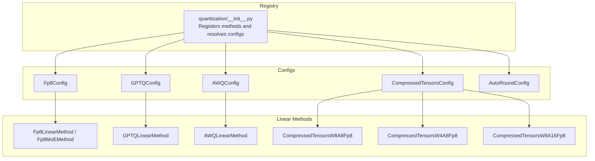
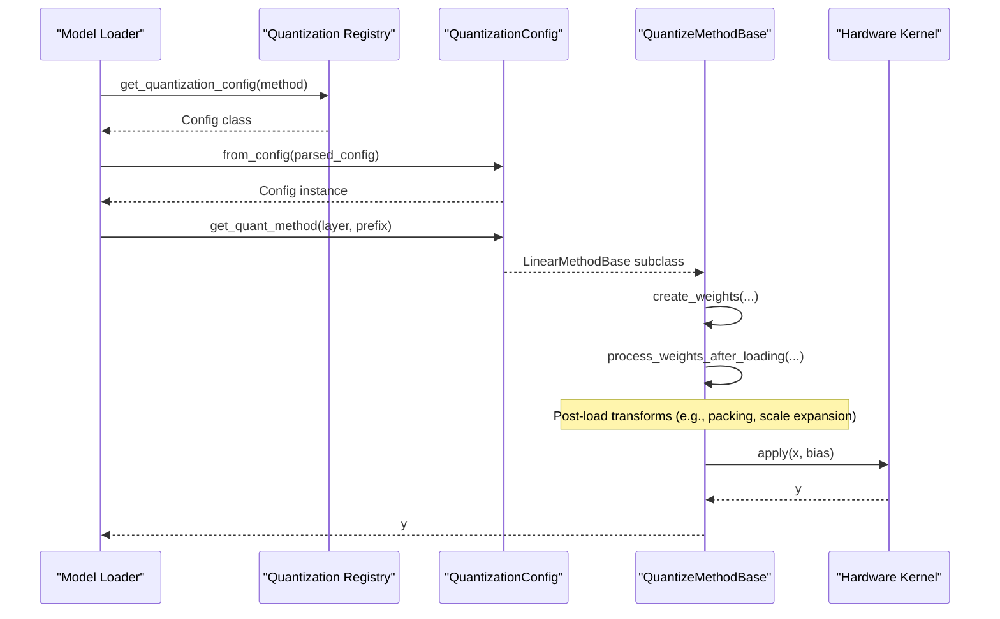
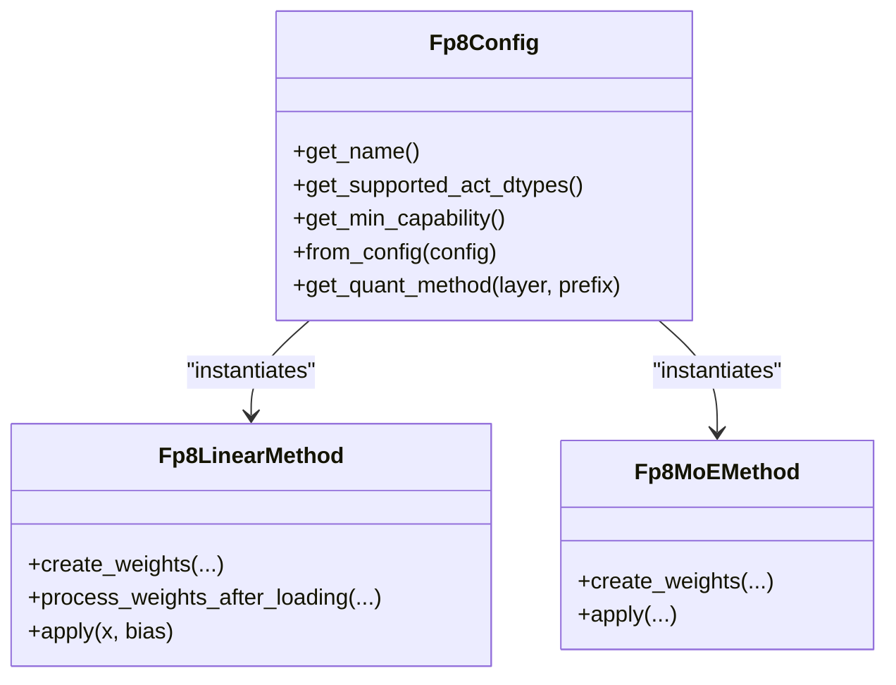
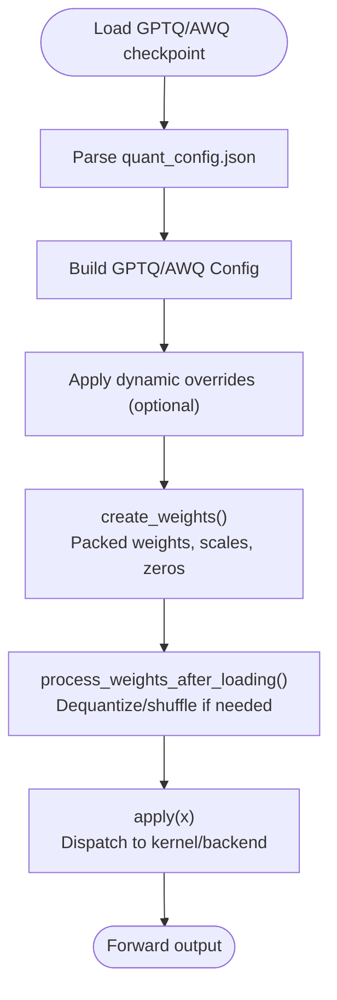
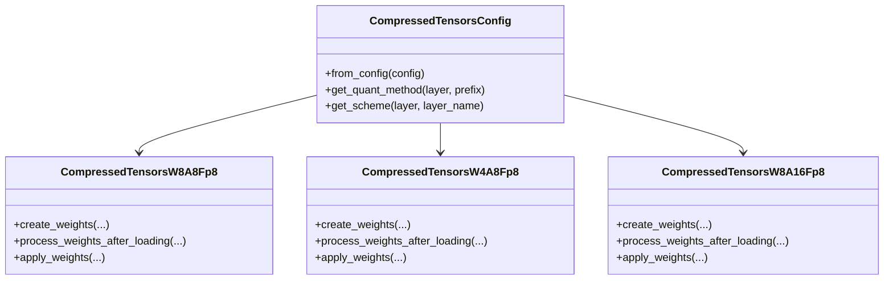
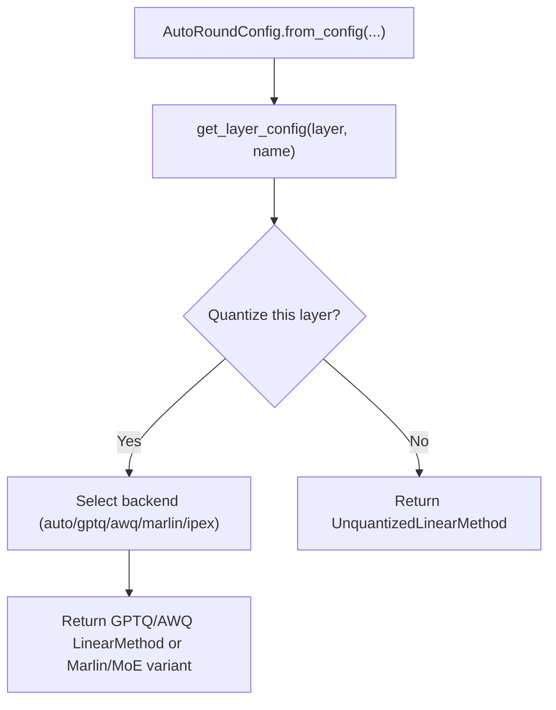
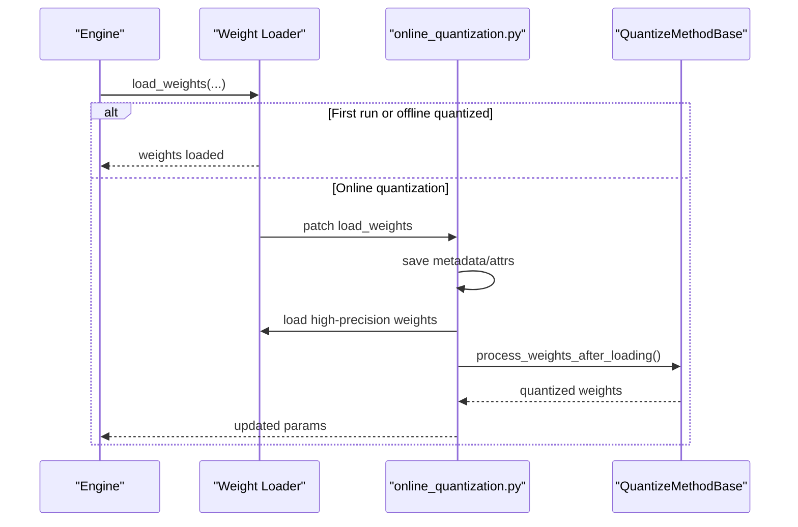
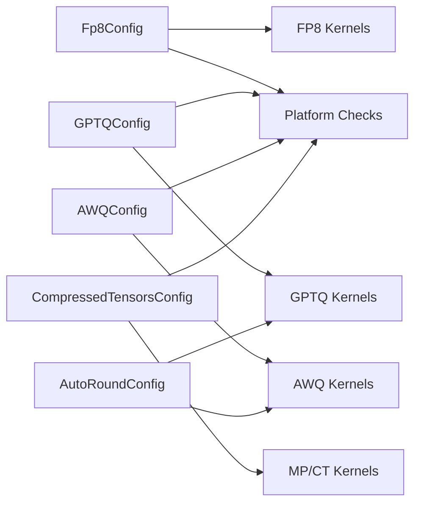

# Quantization Methods

<cite>
**Referenced Files in This Document**
- [quantization/__init__.py](file://vllm/model_executor/layers/quantization/__init__.py)
- [online_quantization.py](file://vllm/model_executor/model_loader/online_quantization.py)
- [fp8.py](file://vllm/model_executor/layers/quantization/fp8.py)
- [gptq.py](file://vllm/model_executor/layers/quantization/gptq.py)
- [gptq_utils.py](file://vllm/model_executor/layers/quantization/utils/gptq_utils.py)
- [awq.py](file://vllm/model_executor/layers/quantization/awq.py)
- [compressed_tensors.py](file://vllm/model_executor/layers/quantization/compressed_tensors/compressed_tensors.py)
- [compressed_tensors_w4a8_fp8.py](file://vllm/model_executor/layers/quantization/compressed_tensors/schemes/compressed_tensors_w4a8_fp8.py)
- [compressed_tensors_w8a8_fp8.py](file://vllm/model_executor/layers/quantization/compressed_tensors/schemes/compressed_tensors_w8a8_fp8.py)
- [compressed_tensors_w8a16_fp8.py](file://vllm/model_executor/layers/quantization/compressed_tensors/schemes/compressed_tensors_w8a16_fp8.py)
- [auto_round.py](file://vllm/model_executor/layers/quantization/auto_round.py)
</cite>

## Table of Contents
1. [Introduction](#introduction)
2. [Project Structure](#project-structure)
3. [Core Components](#core-components)
4. [Architecture Overview](#architecture-overview)
5. [Detailed Component Analysis](#detailed-component-analysis)
6. [Dependency Analysis](#dependency-analysis)
7. [Performance Considerations](#performance-considerations)
8. [Troubleshooting Guide](#troubleshooting-guide)
9. [Conclusion](#conclusion)
10. [Appendices](#appendices)

## Introduction
This document explains vLLM’s comprehensive quantization capabilities across FP8, INT4/INT8, GPTQ/AWQ, compressed tensors, AutoRound, and related mixed-precision and hardware-specific optimizations. It covers supported schemes (dynamic/static per-tensor/per-group), block-wise compression, calibration workflows, model conversion, and performance/accuracy trade-offs. Practical configuration and conversion guidance is included, along with compatibility notes for different model architectures, attention backends, and distributed inference.

## Project Structure
Quantization in vLLM is organized around a central registry and per-method configuration classes. Each quantization method defines:
- A configuration class inheriting from a base quantization config
- A “linear method” that constructs quantized parameters and applies them during forward
- Optional MoE, embedding, and KV-cache specializations
- Utilities for dynamic overrides, kernel selection, and platform checks

**Diagram sources**
- [quantization/__init__.py](file://vllm/model_executor/layers/quantization/__init__.py#L1-L180)
- [fp8.py](file://vllm/model_executor/layers/quantization/fp8.py#L210-L345)
- [gptq.py](file://vllm/model_executor/layers/quantization/gptq.py#L43-L124)
- [awq.py](file://vllm/model_executor/layers/quantization/awq.py#L32-L94)
- [compressed_tensors.py](file://vllm/model_executor/layers/quantization/compressed_tensors/compressed_tensors.py#L78-L185)
- [compressed_tensors_w8a8_fp8.py](file://vllm/model_executor/layers/quantization/compressed_tensors/schemes/compressed_tensors_w8a8_fp8.py#L46-L80)
- [compressed_tensors_w4a8_fp8.py](file://vllm/model_executor/layers/quantization/compressed_tensors/schemes/compressed_tensors_w4a8_fp8.py#L37-L71)
- [compressed_tensors_w8a16_fp8.py](file://vllm/model_executor/layers/quantization/compressed_tensors/schemes/compressed_tensors_w8a16_fp8.py#L30-L64)

**Section sources**
- [quantization/__init__.py](file://vllm/model_executor/layers/quantization/__init__.py#L1-L180)

## Core Components
- Quantization registry and resolution: Centralized mapping of quantization method names to their config classes and defaults.
- Config classes: Encapsulate method-specific parameters (bits, group size, symmetry, activation scheme, etc.) and provide helpers for dynamic overrides and mapper application.
- Linear methods: Construct quantized parameters (packed weights, scales, optional zeros), handle post-loading transformations, and implement apply logic for inference.

Key responsibilities:
- Method selection and instantiation via registry
- Dynamic per-module overrides for GPTQ/AutoRound
- Backend/kernel selection based on device capability and scheme
- Support for block-wise FP8 and mixed-precision schemes

**Section sources**
- [quantization/__init__.py](file://vllm/model_executor/layers/quantization/__init__.py#L97-L180)
- [gptq_utils.py](file://vllm/model_executor/layers/quantization/utils/gptq_utils.py#L26-L159)
- [auto_round.py](file://vllm/model_executor/layers/quantization/auto_round.py#L130-L215)

## Architecture Overview
The quantization pipeline integrates with model loading and forward execution:
- During model loader initialization, quantization configs are parsed and registered.
- For online quantization, weights are initially loaded in high precision and then quantized post-load.
- At forward time, the appropriate linear method is selected per layer and executes the quantized compute using optimized kernels/backends.

**Diagram sources**
- [quantization/__init__.py](file://vllm/model_executor/layers/quantization/__init__.py#L97-L180)
- [online_quantization.py](file://vllm/model_executor/model_loader/online_quantization.py#L139-L276)
- [fp8.py](file://vllm/model_executor/layers/quantization/fp8.py#L387-L711)
- [gptq.py](file://vllm/model_executor/layers/quantization/gptq.py#L225-L394)
- [awq.py](file://vllm/model_executor/layers/quantization/awq.py#L164-L278)

## Detailed Component Analysis

### FP8 Quantization
FP8 supports:
- Weight-only and weight+activation schemes
- Static and dynamic activation quantization
- Per-tensor, per-channel, and block-wise (grouped) weight quantization
- Mixed-precision schemes (e.g., W8A8 FP8, W4A8 FP8) with hardware-specific kernels

Implementation highlights:
- Config validates activation scheme and block-size constraints
- Linear method selects among:
  - Native FP8 kernels (when supported)
  - Marlin weight-only kernels for older devices
  - Block-scaled FP8 grouped GEMM for Hopper and newer
  - Triton fallbacks
- MoE backends are selected based on device capability and configuration
- Post-loading transformations align scales and transpose weights for kernels

**Diagram sources**
- [fp8.py](file://vllm/model_executor/layers/quantization/fp8.py#L210-L345)
- [fp8.py](file://vllm/model_executor/layers/quantization/fp8.py#L387-L711)

Performance and accuracy considerations:
- Dynamic activation reduces calibration overhead but may reduce accuracy on some tasks
- Block-wise FP8 improves throughput on supported architectures
- Mixed-precision schemes (e.g., W8A8 FP8) can reduce memory bandwidth while maintaining accuracy

Compatibility:
- Minimum compute capability varies by scheme (e.g., FP8 W8A8 requires Ada Lovelace; W4A8 FP8 requires Hopper)
- Backends are chosen automatically based on device capability and environment flags

**Section sources**
- [fp8.py](file://vllm/model_executor/layers/quantization/fp8.py#L210-L345)
- [fp8.py](file://vllm/model_executor/layers/quantization/fp8.py#L387-L711)

### INT4/INT8 Quantization (GPTQ/AWQ)
GPTQ and AWQ provide:
- 4-bit and 8-bit weight quantization with per-group scaling
- Optional activation ordering (act-order) and zero points
- Fallbacks to Marlin-compatible kernels and MoE WNA16 for unsupported layers

Key behaviors:
- GPTQ supports 2/3/4/8-bit weights; 4-bit GEMM is routed to Marlin/bitblas/backends
- AWQ supports 4-bit weights with group-wise scaling; MoE fallbacks handled
- Dynamic overrides allow per-module configuration for both methods
- Weight packing and scale/zeros are constructed per method

**Diagram sources**
- [gptq.py](file://vllm/model_executor/layers/quantization/gptq.py#L43-L124)
- [gptq.py](file://vllm/model_executor/layers/quantization/gptq.py#L225-L394)
- [awq.py](file://vllm/model_executor/layers/quantization/awq.py#L32-L94)
- [awq.py](file://vllm/model_executor/layers/quantization/awq.py#L164-L278)
- [gptq_utils.py](file://vllm/model_executor/layers/quantization/utils/gptq_utils.py#L26-L159)

Accuracy and performance:
- Group-wise scaling improves accuracy over per-tensor schemes
- Act-order can improve accuracy at the cost of reorder overhead
- Marlin kernels offer excellent INT4/INT8 throughput on supported GPUs

**Section sources**
- [gptq.py](file://vllm/model_executor/layers/quantization/gptq.py#L43-L124)
- [gptq.py](file://vllm/model_executor/layers/quantization/gptq.py#L225-L394)
- [awq.py](file://vllm/model_executor/layers/quantization/awq.py#L32-L94)
- [awq.py](file://vllm/model_executor/layers/quantization/awq.py#L164-L278)
- [gptq_utils.py](file://vllm/model_executor/layers/quantization/utils/gptq_utils.py#L26-L159)

### Compressed Tensors Quantization
Compressed tensors enables:
- Target-based quantization schemes with flexible weight and activation quantization
- Support for sparse and dense weight-only schemes
- Mixed-precision schemes (e.g., W8A8 FP8, W4A8 FP8, W8A16 FP8)
- Device capability checks and backend selection

Representative schemes:
- W8A8 FP8: supports tensor/channel/block strategies; dynamic per-token activation
- W4A8 FP8: requires group strategy with fixed group size and symmetric weights
- W8A16 FP8: Marlin weight-only path for older GPUs

**Diagram sources**
- [compressed_tensors.py](file://vllm/model_executor/layers/quantization/compressed_tensors/compressed_tensors.py#L78-L185)
- [compressed_tensors_w8a8_fp8.py](file://vllm/model_executor/layers/quantization/compressed_tensors/schemes/compressed_tensors_w8a8_fp8.py#L46-L80)
- [compressed_tensors_w4a8_fp8.py](file://vllm/model_executor/layers/quantization/compressed_tensors/schemes/compressed_tensors_w4a8_fp8.py#L37-L71)
- [compressed_tensors_w8a16_fp8.py](file://vllm/model_executor/layers/quantization/compressed_tensors/schemes/compressed_tensors_w8a16_fp8.py#L30-L64)

Accuracy and memory:
- Mixed-precision schemes reduce memory footprint and bandwidth
- Block-wise schemes can improve throughput on supported architectures
- Device capability checks prevent unsupported configurations

**Section sources**
- [compressed_tensors.py](file://vllm/model_executor/layers/quantization/compressed_tensors/compressed_tensors.py#L78-L185)
- [compressed_tensors_w8a8_fp8.py](file://vllm/model_executor/layers/quantization/compressed_tensors/schemes/compressed_tensors_w8a8_fp8.py#L46-L80)
- [compressed_tensors_w4a8_fp8.py](file://vllm/model_executor/layers/quantization/compressed_tensors/schemes/compressed_tensors_w4a8_fp8.py#L37-L71)
- [compressed_tensors_w8a16_fp8.py](file://vllm/model_executor/layers/quantization/compressed_tensors/schemes/compressed_tensors_w8a16_fp8.py#L30-L64)

### AutoRound Quantization
AutoRound automates rounding and configuration selection:
- Supports 2/3/4/8-bit integer weights with configurable group size and symmetry
- Supports multiple backends (GPTQ/AWQ, Marlin, IPEX) and formats
- Provides per-layer dynamic configuration via regex and exact matches
- Integrates with vLLM’s mapper for model-specific targeting

**Diagram sources**
- [auto_round.py](file://vllm/model_executor/layers/quantization/auto_round.py#L130-L215)
- [auto_round.py](file://vllm/model_executor/layers/quantization/auto_round.py#L227-L455)

Accuracy optimization:
- Uses dynamic overrides to tailor bits/group_size/symmetry per layer
- Supports fused modules and MoE consistency checks

**Section sources**
- [auto_round.py](file://vllm/model_executor/layers/quantization/auto_round.py#L130-L215)
- [auto_round.py](file://vllm/model_executor/layers/quantization/auto_round.py#L227-L455)

### Online Quantization and Model Conversion
vLLM supports:
- Online quantization for torchao (convert high-precision weights to quantized form at runtime)
- Metadata/attributes preservation for seamless reloads
- Special handling for CUDA Graph compatibility during weight updates

**Diagram sources**
- [online_quantization.py](file://vllm/model_executor/model_loader/online_quantization.py#L67-L138)
- [online_quantization.py](file://vllm/model_executor/model_loader/online_quantization.py#L139-L276)

**Section sources**
- [online_quantization.py](file://vllm/model_executor/model_loader/online_quantization.py#L67-L138)
- [online_quantization.py](file://vllm/model_executor/model_loader/online_quantization.py#L139-L276)

## Dependency Analysis
Quantization methods depend on:
- Platform detection and capability checks
- Backend kernel libraries (Marlin, Triton, CUTLASS, FlashInfer)
- Parameter construction utilities (packed weights, scales, zeros)
- Mapper utilities for model name translation

**Diagram sources**
- [fp8.py](file://vllm/model_executor/layers/quantization/fp8.py#L210-L345)
- [gptq.py](file://vllm/model_executor/layers/quantization/gptq.py#L43-L124)
- [awq.py](file://vllm/model_executor/layers/quantization/awq.py#L32-L94)
- [compressed_tensors.py](file://vllm/model_executor/layers/quantization/compressed_tensors/compressed_tensors.py#L78-L185)
- [auto_round.py](file://vllm/model_executor/layers/quantization/auto_round.py#L227-L455)

**Section sources**
- [fp8.py](file://vllm/model_executor/layers/quantization/fp8.py#L210-L345)
- [gptq.py](file://vllm/model_executor/layers/quantization/gptq.py#L43-L124)
- [awq.py](file://vllm/model_executor/layers/quantization/awq.py#L32-L94)
- [compressed_tensors.py](file://vllm/model_executor/layers/quantization/compressed_tensors/compressed_tensors.py#L78-L185)
- [auto_round.py](file://vllm/model_executor/layers/quantization/auto_round.py#L227-L455)

## Performance Considerations
- Choose schemes aligned with device capability:
  - FP8 W8A8 requires Ada Lovelace; W4A8 FP8 requires Hopper
  - Marlin weight-only FP8 is efficient on older GPUs
- Prefer block-wise schemes on supported architectures for throughput
- Mixed-precision schemes reduce memory bandwidth; validate accuracy on your workload
- Dynamic activation reduces calibration overhead but may trade off accuracy
- For MoE, select backends that match fused/expert sizes and TP/PP configurations

[No sources needed since this section provides general guidance]

## Troubleshooting Guide
Common issues and resolutions:
- Unsupported device capability for a scheme: The config checks device capability and raises errors if unsupported
- Misaligned tensor/row partitions for GPTQ/AWQ: Ensure group_size and pack factors divide input/output sizes evenly
- Calibration/calibration-free mismatches: Verify activation scheme (static/dynamic) matches checkpoint serialization
- Online quantization reloads: Ensure metadata/attributes are saved/restored for torchao to support repeated weight reloads

**Section sources**
- [compressed_tensors.py](file://vllm/model_executor/layers/quantization/compressed_tensors/compressed_tensors.py#L301-L332)
- [gptq.py](file://vllm/model_executor/layers/quantization/gptq.py#L238-L262)
- [awq.py](file://vllm/model_executor/layers/quantization/awq.py#L184-L203)
- [online_quantization.py](file://vllm/model_executor/model_loader/online_quantization.py#L67-L138)

## Conclusion
vLLM’s quantization stack offers flexible, high-performance pathways across FP8, INT4/INT8 (GPTQ/AWQ), compressed tensors, and AutoRound. By leveraging dynamic overrides, mixed-precision schemes, and hardware-specific kernels, users can optimize for throughput, memory, and accuracy. Compatibility checks and robust model conversion workflows ensure smooth deployment across diverse model architectures and distributed settings.

[No sources needed since this section summarizes without analyzing specific files]

## Appendices

### Practical Configuration and Conversion Guidance
- FP8
  - Choose activation scheme (dynamic preferred for flexibility)
  - Enable block-wise FP8 when supported and beneficial
  - Validate minimum compute capability for desired scheme
  - References: [fp8.py](file://vllm/model_executor/layers/quantization/fp8.py#L210-L345), [fp8.py](file://vllm/model_executor/layers/quantization/fp8.py#L387-L711)
- GPTQ/AWQ
  - Set bits, group_size, and symmetry; use dynamic overrides for per-layer tuning
  - For MoE, rely on fallbacks or Marlin-compatible variants
  - References: [gptq.py](file://vllm/model_executor/layers/quantization/gptq.py#L43-L124), [awq.py](file://vllm/model_executor/layers/quantization/awq.py#L32-L94), [gptq_utils.py](file://vllm/model_executor/layers/quantization/utils/gptq_utils.py#L26-L159)
- Compressed Tensors
  - Define target-based schemes with weights and optional activation quantization
  - Select schemes by device capability and format
  - References: [compressed_tensors.py](file://vllm/model_executor/layers/quantization/compressed_tensors/compressed_tensors.py#L201-L300), [compressed_tensors_w8a8_fp8.py](file://vllm/model_executor/layers/quantization/compressed_tensors/schemes/compressed_tensors_w8a8_fp8.py#L46-L80)
- AutoRound
  - Configure bits, group_size, symmetry, and backend/format
  - Use dynamic overrides for per-layer optimization
  - References: [auto_round.py](file://vllm/model_executor/layers/quantization/auto_round.py#L130-L215)
- Online Quantization
  - Save metadata/attributes for torchao; reload high-precision weights and quantize on demand
  - References: [online_quantization.py](file://vllm/model_executor/model_loader/online_quantization.py#L67-L138)

### Compatibility Across Architectures and Backends
- Attention backends: FP8 MoE backends are selected based on device capability and environment flags
- Distributed inference: Ensure group sizes and partitioning align with TP/PP; fused modules must maintain consistent quantization across shards
- Hardware-specific kernels: Marlin, CUTLASS, FlashInfer, and Triton are used depending on scheme and device

**Section sources**
- [fp8.py](file://vllm/model_executor/layers/quantization/fp8.py#L126-L208)
- [gptq_utils.py](file://vllm/model_executor/layers/quantization/utils/gptq_utils.py#L83-L159)
- [compressed_tensors.py](file://vllm/model_executor/layers/quantization/compressed_tensors/compressed_tensors.py#L78-L185)