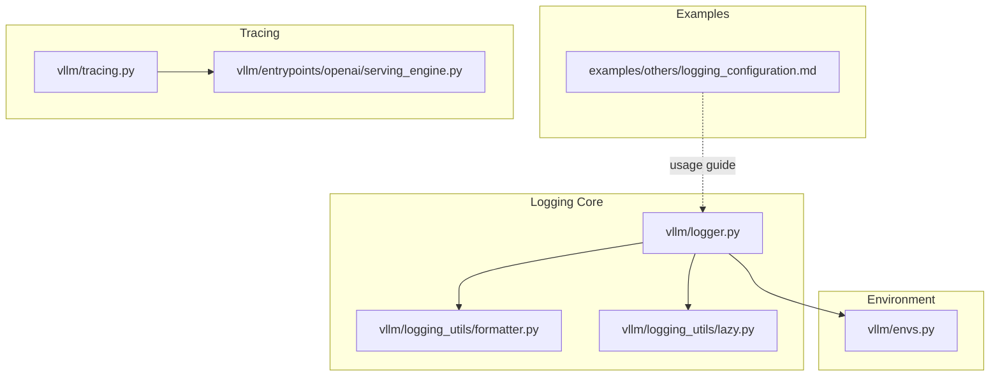
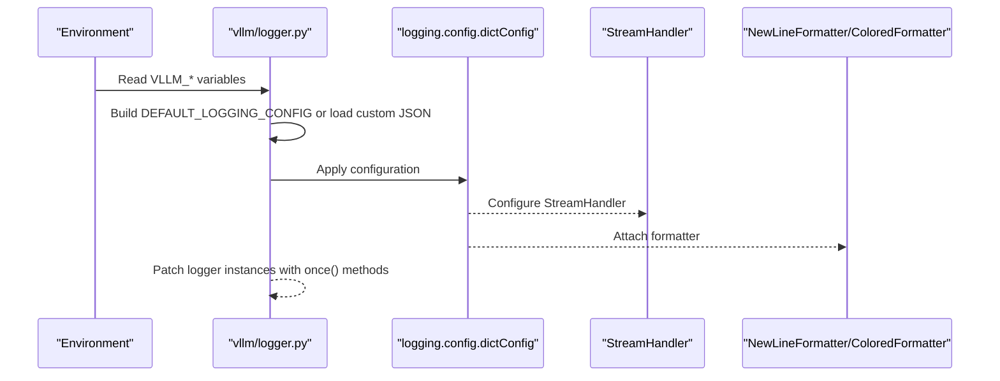
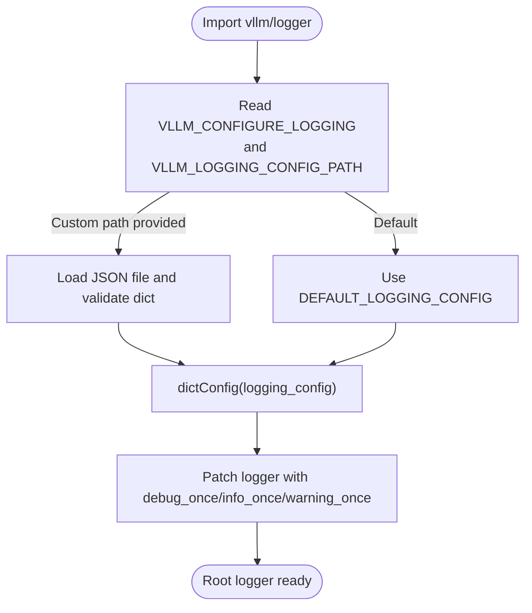
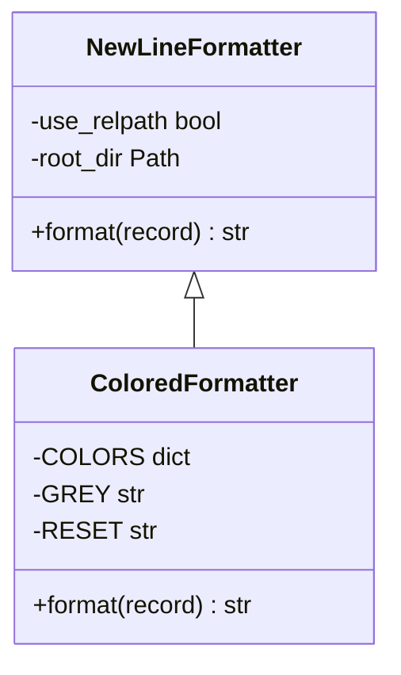
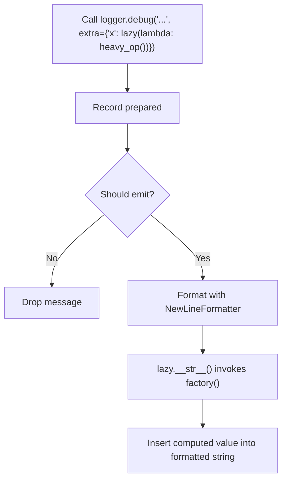
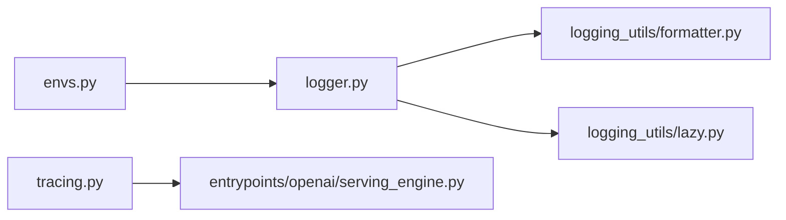

# Logging Configuration

<cite>
**Referenced Files in This Document**
- [logger.py](file://vllm/logger.py)
- [formatter.py](file://vllm/logging_utils/formatter.py)
- [lazy.py](file://vllm/logging_utils/lazy.py)
- [envs.py](file://vllm/envs.py)
- [logging_configuration.md](file://examples/others/logging_configuration.md)
- [tracing.py](file://vllm/tracing.py)
- [serving_engine.py](file://vllm/entrypoints/openai/serving_engine.py)
- [test_logger.py](file://tests/test_logger.py)
</cite>

## Table of Contents
1. [Introduction](#introduction)
2. [Project Structure](#project-structure)
3. [Core Components](#core-components)
4. [Architecture Overview](#architecture-overview)
5. [Detailed Component Analysis](#detailed-component-analysis)
6. [Dependency Analysis](#dependency-analysis)
7. [Performance Considerations](#performance-considerations)
8. [Troubleshooting Guide](#troubleshooting-guide)
9. [Conclusion](#conclusion)
10. [Appendices](#appendices)

## Introduction
This document explains vLLM’s logging configuration system comprehensively. It covers log levels, formatting, output destinations, environment-driven configuration, runtime initialization, structured logging, and integration with tracing and centralized logging systems. It also provides guidance on lazy evaluation, performance impact mitigation, and practical examples for custom formatters, filtering, and debugging workflows.

## Project Structure
The logging system is centered around a root logger configuration and a small set of utilities:
- Root logger configuration and initialization
- Formatters for aligned multi-line output and colored terminal output
- Lazy evaluation helpers to defer expensive formatting
- Environment variables controlling logging behavior
- Optional tracing integration for request correlation

**Diagram sources**
- [logger.py](file://vllm/logger.py#L1-L120)
- [formatter.py](file://vllm/logging_utils/formatter.py#L1-L128)
- [lazy.py](file://vllm/logging_utils/lazy.py#L1-L21)
- [envs.py](file://vllm/envs.py#L630-L670)
- [logging_configuration.md](file://examples/others/logging_configuration.md#L1-L163)
- [tracing.py](file://vllm/tracing.py#L1-L136)
- [serving_engine.py](file://vllm/entrypoints/openai/serving_engine.py#L1398-L1428)

**Section sources**
- [logger.py](file://vllm/logger.py#L1-L120)
- [formatter.py](file://vllm/logging_utils/formatter.py#L1-L128)
- [lazy.py](file://vllm/logging_utils/lazy.py#L1-L21)
- [envs.py](file://vllm/envs.py#L630-L670)
- [logging_configuration.md](file://examples/others/logging_configuration.md#L1-L163)
- [tracing.py](file://vllm/tracing.py#L1-L136)
- [serving_engine.py](file://vllm/entrypoints/openai/serving_engine.py#L1398-L1428)

## Core Components
- Root logger configuration and initialization:
  - Builds a default logging configuration dictionary when enabled by environment.
  - Applies environment-controlled level, stream, and colorized formatter.
  - Supports loading a custom configuration from a JSON file path.
  - Patches selected logger instances with convenience methods for deduplicated logging.
- Formatters:
  - NewLineFormatter: normalizes multi-line messages and shortens file paths for readability.
  - ColoredFormatter: injects ANSI color codes for terminal-friendly logs.
- Lazy evaluation:
  - lazy wrapper defers computation of expensive log arguments until formatting occurs.
- Environment variables:
  - Control logging enablement, level, stream, color, prefix, and function call tracing.
- Tracing integration:
  - Optional OpenTelemetry-based tracing with request correlation attributes and headers.

**Section sources**
- [logger.py](file://vllm/logger.py#L169-L203)
- [formatter.py](file://vllm/logging_utils/formatter.py#L1-L128)
- [lazy.py](file://vllm/logging_utils/lazy.py#L1-L21)
- [envs.py](file://vllm/envs.py#L630-L670)
- [tracing.py](file://vllm/tracing.py#L1-L136)

## Architecture Overview
The logging architecture initializes the root logger early and exposes convenience methods on child loggers. Users can rely on defaults or supply a custom dictConfig JSON file. Optional tracing integrates with OpenTelemetry for request correlation.

**Diagram sources**
- [logger.py](file://vllm/logger.py#L169-L203)
- [formatter.py](file://vllm/logging_utils/formatter.py#L1-L128)
- [envs.py](file://vllm/envs.py#L630-L670)

## Detailed Component Analysis

### Root Logger Initialization and Configuration
- Default configuration:
  - Uses a root logger named “vllm”.
  - StreamHandler writes to a configurable stream (stdout/stderr).
  - Level is controlled by an environment variable.
  - Two formatters: one plain and one colorized; colorization depends on environment and stream capability.
- Custom configuration:
  - If a JSON path is provided, the file is loaded and validated; it must be a dictionary.
  - Backward compatibility: legacy formatter class name is remapped to the current module path.
- Runtime toggles:
  - A convenience context manager exists to temporarily suppress logging.
  - A specialized debug/info/warning “once” method is patched onto loggers to drop repeated identical messages.

**Diagram sources**
- [logger.py](file://vllm/logger.py#L169-L203)

**Section sources**
- [logger.py](file://vllm/logger.py#L169-L203)
- [test_logger.py](file://tests/test_logger.py#L59-L95)
- [test_logger.py](file://tests/test_logger.py#L201-L226)

### Formatters: NewLineFormatter and ColoredFormatter
- NewLineFormatter:
  - Normalizes multi-line messages by prefixing continuation lines.
  - Optionally shortens file paths for readability in debug mode.
- ColoredFormatter:
  - Adds ANSI color codes for level names and static elements (timestamps/file info) when color is enabled.

**Diagram sources**
- [formatter.py](file://vllm/logging_utils/formatter.py#L1-L128)

**Section sources**
- [formatter.py](file://vllm/logging_utils/formatter.py#L1-L128)

### Lazy Evaluation for Expensive Log Arguments
- lazy wrapper:
  - Defers evaluation of a zero-argument callable until the formatted log string is produced.
  - Prevents unnecessary computation when log level filters out the message.

**Diagram sources**
- [lazy.py](file://vllm/logging_utils/lazy.py#L1-L21)
- [formatter.py](file://vllm/logging_utils/formatter.py#L1-L128)

**Section sources**
- [lazy.py](file://vllm/logging_utils/lazy.py#L1-L21)

### Environment Variables and Runtime Configuration
Key environment variables:
- VLLM_CONFIGURE_LOGGING: enable/disable vLLM’s logging configuration.
- VLLM_LOGGING_CONFIG_PATH: path to a JSON dictConfig file.
- VLLM_LOGGING_LEVEL: logging level applied to handlers/loggers.
- VLLM_LOGGING_STREAM: target stream for the handler (stdout/stderr).
- VLLM_LOGGING_COLOR: control colorized output (“auto”, “1”, “0”).
- NO_COLOR: standard override to disable ANSI color codes.
- VLLM_LOGGING_PREFIX: optional prefix for all log messages.
- VLLM_TRACE_FUNCTION: enable function call tracing for debugging.

Behavioral notes:
- If VLLM_CONFIGURE_LOGGING is false and VLLM_LOGGING_CONFIG_PATH is set, initialization raises an error.
- When INFO level is used, httpx logging is downgraded to avoid noise.
- Colorization is determined by environment and stream capabilities.

**Section sources**
- [envs.py](file://vllm/envs.py#L630-L670)
- [logger.py](file://vllm/logger.py#L169-L203)
- [logger.py](file://vllm/logger.py#L232-L236)

### Structured Logging and Centralized Systems
- The example documentation demonstrates using a JSON formatter compatible with centralized logging stacks.
- Custom dictConfig JSON can define any number of formatters, handlers, and loggers, enabling routing to files, HTTP endpoints, or exporters.

Practical guidance:
- Use a JSON formatter class in your custom configuration to emit machine-readable logs.
- Define separate handlers for different sinks (e.g., stdout for local, HTTP for central collectors).
- Keep the root logger configured and selectively propagate or silence specific child loggers.

**Section sources**
- [logging_configuration.md](file://examples/others/logging_configuration.md#L1-L163)

### Log Rotation, Storage, and Persistence
- vLLM does not include built-in log rotation or file handler configuration.
- Use your platform’s log rotation facilities (e.g., systemd, logrotate) or supply a file-based handler in your custom dictConfig JSON.
- For production deployments, route logs to standard streams or structured sinks and delegate rotation to infrastructure.

[No sources needed since this section provides general guidance]

### Debugging and Operational Techniques
- Deduplicated logging:
  - Use the patched “_once” methods to avoid repeated noisy messages.
- Function call tracing:
  - Enable function call tracing for diagnosing hangs or crashes; note it slows execution.
- Tracing integration:
  - Optional OpenTelemetry tracer can be initialized to export spans to OTLP endpoints.
  - Request correlation via trace headers is supported; missing or disabled tracing emits a warning.

**Section sources**
- [logger.py](file://vllm/logger.py#L74-L148)
- [logger.py](file://vllm/logger.py#L283-L304)
- [tracing.py](file://vllm/tracing.py#L1-L136)
- [serving_engine.py](file://vllm/entrypoints/openai/serving_engine.py#L1398-L1428)

## Dependency Analysis
- logger.py depends on:
  - envs.py for environment-driven configuration
  - logging.config.dictConfig for applying configuration
  - logging.Logger and logging.StreamHandler for runtime setup
  - logging_utils.formatter for formatters
- formatter.py depends on:
  - logging and environment variables for behavior
- tracing.py optionally depends on OpenTelemetry packages and integrates with request headers.

**Diagram sources**
- [logger.py](file://vllm/logger.py#L169-L203)
- [formatter.py](file://vllm/logging_utils/formatter.py#L1-L128)
- [lazy.py](file://vllm/logging_utils/lazy.py#L1-L21)
- [envs.py](file://vllm/envs.py#L630-L670)
- [tracing.py](file://vllm/tracing.py#L1-L136)
- [serving_engine.py](file://vllm/entrypoints/openai/serving_engine.py#L1398-L1428)

**Section sources**
- [logger.py](file://vllm/logger.py#L169-L203)
- [formatter.py](file://vllm/logging_utils/formatter.py#L1-L128)
- [lazy.py](file://vllm/logging_utils/lazy.py#L1-L21)
- [envs.py](file://vllm/envs.py#L630-L670)
- [tracing.py](file://vllm/tracing.py#L1-L136)
- [serving_engine.py](file://vllm/entrypoints/openai/serving_engine.py#L1398-L1428)

## Performance Considerations
- Prefer INFO/WARNING/ERROR for production to minimize overhead.
- Use the “_once” methods to suppress repetitive logs.
- Use lazy wrappers for expensive argument computations.
- Avoid enabling function call tracing in production; it significantly slows execution.
- Downgrade noisy third-party libraries (e.g., httpx) when INFO is used.

[No sources needed since this section provides general guidance]

## Troubleshooting Guide
Common scenarios and remedies:
- Custom config requires enabling logging:
  - If VLLM_CONFIGURE_LOGGING is false and a custom config path is set, initialization fails. Either enable logging or unset the path.
- Unexpected lack of logs:
  - Verify VLLM_CONFIGURE_LOGGING and VLLM_LOGGING_LEVEL.
  - Ensure the chosen stream matches expectations (stdout vs stderr).
- Terminal color issues:
  - Check VLLM_LOGGING_COLOR and NO_COLOR.
- Excessive noise from specific modules:
  - Provide a custom dictConfig that silences specific child loggers by setting propagate=false.
- Tracing-related warnings:
  - If trace headers are received but tracing is disabled, a warning is emitted. Initialize a tracer or disable propagation of trace headers at the ingress.

**Section sources**
- [logger.py](file://vllm/logger.py#L169-L203)
- [test_logger.py](file://tests/test_logger.py#L201-L226)
- [tracing.py](file://vllm/tracing.py#L129-L136)
- [serving_engine.py](file://vllm/entrypoints/openai/serving_engine.py#L1398-L1428)

## Conclusion
vLLM’s logging system provides a pragmatic balance between simplicity and flexibility. The default configuration is suitable for most environments, while the dictConfig mechanism and environment variables enable advanced setups for centralized logging and operational debugging. Use the provided utilities—formatters, lazy evaluation, and tracing—to build robust, maintainable logging practices tailored to your deployment.

## Appendices

### Practical Examples Index
- Custom root logger with JSON formatter and stdout sink
- Silencing a specific vLLM logger by overriding its configuration
- Disabling vLLM’s default logging configuration

Refer to the example guide for runnable configurations and environment variable usage.

**Section sources**
- [logging_configuration.md](file://examples/others/logging_configuration.md#L1-L163)