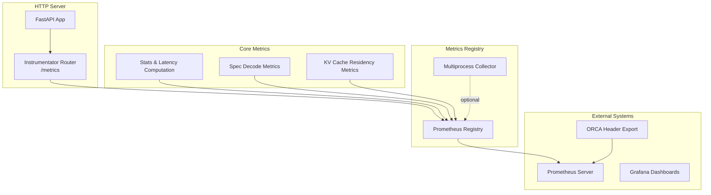
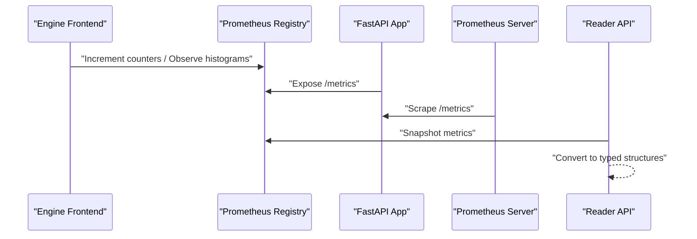
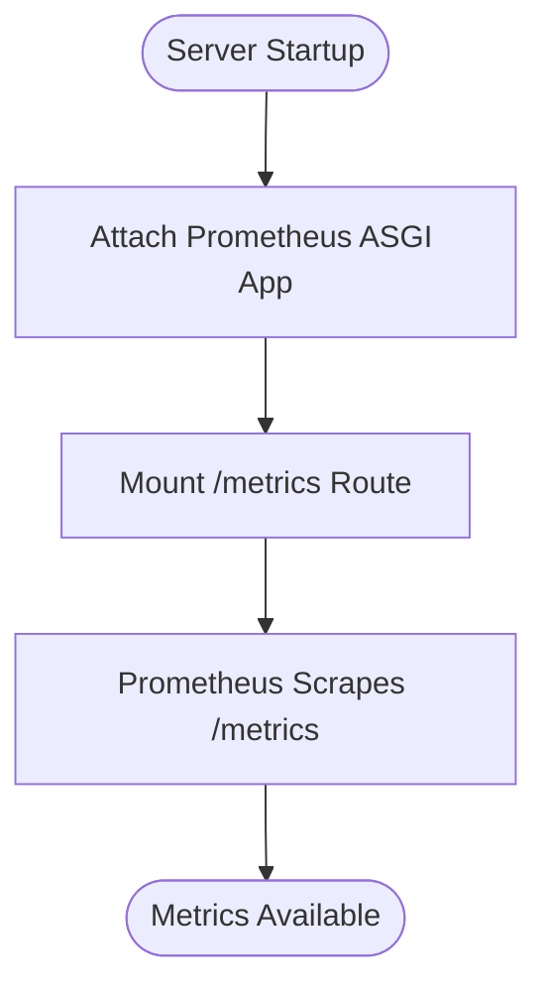
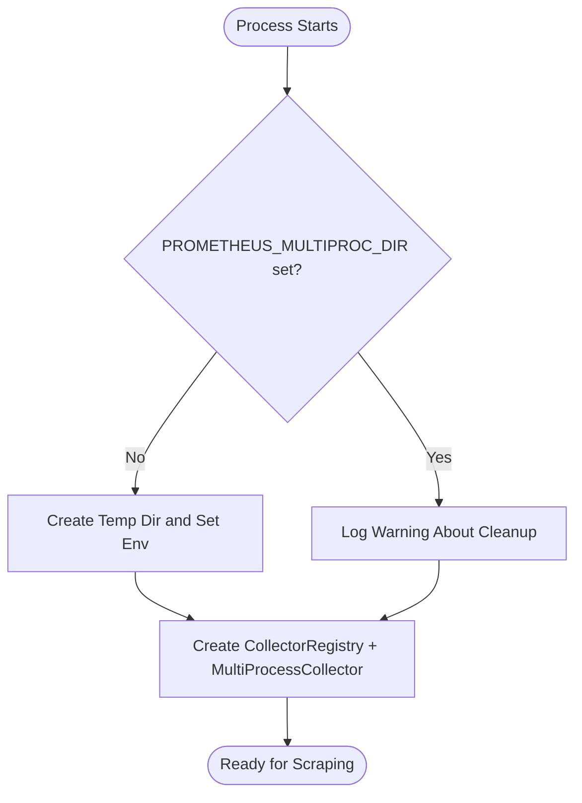
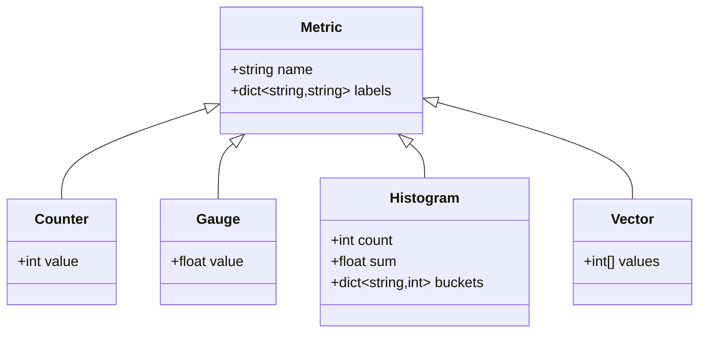
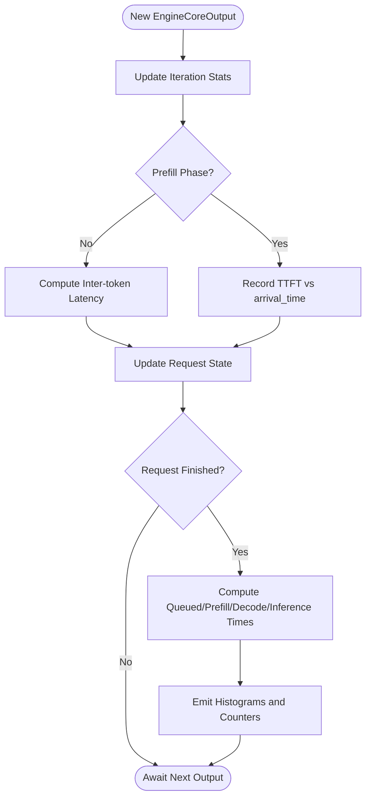
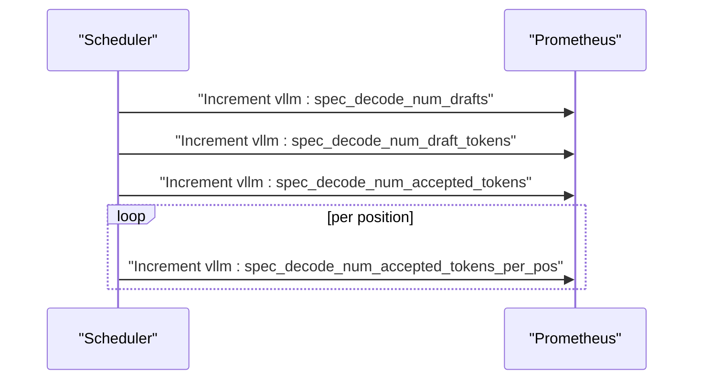
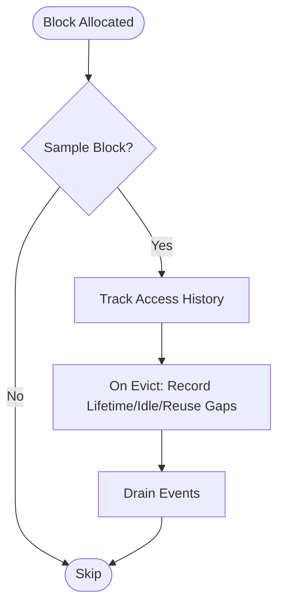
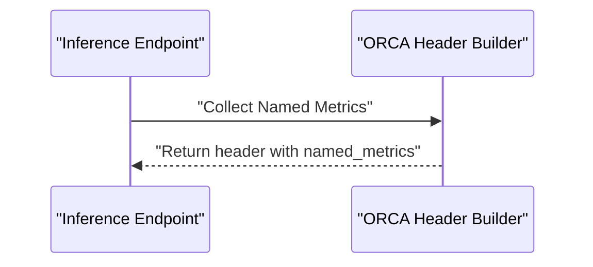
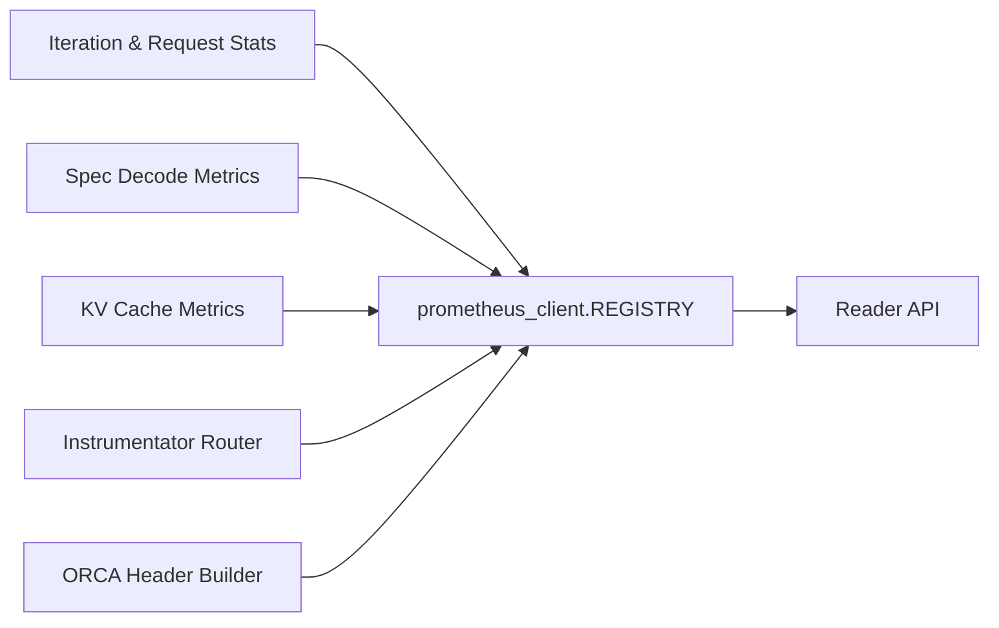

# Metrics Collection and Analysis

<cite>
**Referenced Files in This Document**
- [docs/design/metrics.md](file://docs/design/metrics.md)
- [docs/usage/metrics.md](file://docs/usage/metrics.md)
- [vllm/entrypoints/serve/instrumentator/metrics.py](file://vllm/entrypoints/serve/instrumentator/metrics.py)
- [vllm/v1/metrics/prometheus.py](file://vllm/v1/metrics/prometheus.py)
- [vllm/v1/metrics/reader.py](file://vllm/v1/metrics/reader.py)
- [vllm/v1/metrics/stats.py](file://vllm/v1/metrics/stats.py)
- [vllm/v1/metrics/perf.py](file://vllm/v1/metrics/perf.py)
- [vllm/v1/spec_decode/metrics.py](file://vllm/v1/spec_decode/metrics.py)
- [vllm/v1/core/kv_cache_metrics.py](file://vllm/v1/core/kv_cache_metrics.py)
- [vllm/entrypoints/openai/orca_metrics.py](file://vllm/entrypoints/openai/orca_metrics.py)
- [vllm/v1/metrics/ray_wrappers.py](file://vllm/v1/metrics/ray_wrappers.py)
- [tests/v1/metrics/test_metrics_reader.py](file://tests/v1/metrics/test_metrics_reader.py)
- [tests/v1/core/test_kv_cache_metrics.py](file://tests/v1/core/test_kv_cache_metrics.py)
- [tests/v1/core/test_kv_cache_utils.py](file://tests/v1/core/test_kv_cache_utils.py)
- [docs/mkdocs/hooks/generate_metrics.py](file://docs/mkdocs/hooks/generate_metrics.py)
</cite>

## Table of Contents
1. [Introduction](#introduction)
2. [Project Structure](#project-structure)
3. [Core Components](#core-components)
4. [Architecture Overview](#architecture-overview)
5. [Detailed Component Analysis](#detailed-component-analysis)
6. [Dependency Analysis](#dependency-analysis)
7. [Performance Considerations](#performance-considerations)
8. [Troubleshooting Guide](#troubleshooting-guide)
9. [Conclusion](#conclusion)
10. [Appendices](#appendices)

## Introduction
This document explains vLLM’s Prometheus-based metrics system for the V1 engine. It covers metric types (Counters, Gauges, Histograms, Vectors), naming conventions, label structures, and the metrics reader API for programmatic access to in-memory metrics. It documents built-in categories such as throughput, latency, memory usage, GPU utilization, and model-specific metrics. It also describes aggregation strategies, data retention considerations, performance impact, practical query patterns, filtering techniques, correlation analysis, custom metric registration, exporters, and integration with external monitoring systems. Finally, it provides interpretation guidelines, thresholds, and anomaly detection strategies.

## Project Structure
The metrics system spans several modules:
- Prometheus integration and routing
- Metrics publishing and multiprocess support
- Reader API for programmatic access
- Core statistics and latency/throughput computation
- Specialized metrics for speculative decoding and KV cache residency
- ORCA load metrics export for inference endpoints
- Ray/OpenTelemetry wrappers for alternate backends

**Diagram sources**
- [vllm/entrypoints/serve/instrumentator/metrics.py](file://vllm/entrypoints/serve/instrumentator/metrics.py#L1-L46)
- [vllm/v1/metrics/prometheus.py](file://vllm/v1/metrics/prometheus.py#L1-L83)
- [vllm/v1/metrics/stats.py](file://vllm/v1/metrics/stats.py#L233-L383)
- [vllm/v1/spec_decode/metrics.py](file://vllm/v1/spec_decode/metrics.py#L120-L226)
- [vllm/v1/core/kv_cache_metrics.py](file://vllm/v1/core/kv_cache_metrics.py#L46-L97)
- [vllm/entrypoints/openai/orca_metrics.py](file://vllm/entrypoints/openai/orca_metrics.py#L43-L71)

**Section sources**
- [vllm/entrypoints/serve/instrumentator/metrics.py](file://vllm/entrypoints/serve/instrumentator/metrics.py#L1-L46)
- [vllm/v1/metrics/prometheus.py](file://vllm/v1/metrics/prometheus.py#L1-L83)

## Core Components
- Prometheus client integration and router mounting for the /metrics endpoint
- Multiprocess-safe registry and collector setup
- Reader API to snapshot in-memory Prometheus metrics into typed structures
- Core statistics capturing latency, throughput, and request completion metadata
- Specialized metrics for speculative decoding and KV cache residency
- ORCA load metrics header generation for inference endpoints
- Ray/OpenTelemetry wrappers for alternate metric backends

Key responsibilities:
- Expose Prometheus-compatible metrics via FastAPI
- Aggregate per-iteration stats and compute latency intervals
- Provide a typed reader to inspect counters, gauges, histograms, and vectors
- Support optional multiprocess mode for distributed deployments

**Section sources**
- [vllm/entrypoints/serve/instrumentator/metrics.py](file://vllm/entrypoints/serve/instrumentator/metrics.py#L1-L46)
- [vllm/v1/metrics/prometheus.py](file://vllm/v1/metrics/prometheus.py#L1-L83)
- [vllm/v1/metrics/reader.py](file://vllm/v1/metrics/reader.py#L1-L154)
- [vllm/v1/metrics/stats.py](file://vllm/v1/metrics/stats.py#L233-L383)
- [vllm/v1/spec_decode/metrics.py](file://vllm/v1/spec_decode/metrics.py#L120-L226)
- [vllm/v1/core/kv_cache_metrics.py](file://vllm/v1/core/kv_cache_metrics.py#L46-L97)
- [vllm/entrypoints/openai/orca_metrics.py](file://vllm/entrypoints/openai/orca_metrics.py#L43-L71)

## Architecture Overview
The metrics pipeline:
- Engine frontend collects per-iteration stats and emits Prometheus metrics
- HTTP server mounts a Prometheus ASGI app and instruments API routes
- Prometheus scrapes /metrics and stores time-series data
- Reader API reads in-memory metrics for programmatic inspection
- Optional: Ray/OpenTelemetry wrappers for alternate backends

**Diagram sources**
- [vllm/v1/metrics/stats.py](file://vllm/v1/metrics/stats.py#L233-L383)
- [vllm/entrypoints/serve/instrumentator/metrics.py](file://vllm/entrypoints/serve/instrumentator/metrics.py#L1-L46)
- [vllm/v1/metrics/prometheus.py](file://vllm/v1/metrics/prometheus.py#L1-L83)
- [vllm/v1/metrics/reader.py](file://vllm/v1/metrics/reader.py#L70-L154)

## Detailed Component Analysis

### Prometheus Integration and Routing
- The server attaches a Prometheus ASGI app and instruments HTTP routes, excluding health and metrics endpoints themselves
- The /metrics route is mounted explicitly with proper content-type for Prometheus text format
- A dedicated registry is used to support multiprocess mode

**Diagram sources**
- [vllm/entrypoints/serve/instrumentator/metrics.py](file://vllm/entrypoints/serve/instrumentator/metrics.py#L1-L46)

**Section sources**
- [vllm/entrypoints/serve/instrumentator/metrics.py](file://vllm/entrypoints/serve/instrumentator/metrics.py#L1-L46)

### Multiprocess Prometheus Setup
- Creates or uses PROMETHEUS_MULTIPROC_DIR and registers a MultiProcessCollector
- Provides helpers to unregister and mark process dead on shutdown

**Diagram sources**
- [vllm/v1/metrics/prometheus.py](file://vllm/v1/metrics/prometheus.py#L1-L83)

**Section sources**
- [vllm/v1/metrics/prometheus.py](file://vllm/v1/metrics/prometheus.py#L1-L83)

### Metrics Reader API
- Reads Prometheus REGISTRY and converts samples into typed structures:
  - Counter: monotonically increasing integer
  - Gauge: floating-point value
  - Histogram: bucketed observations with count and sum
  - Vector: positional counters (e.g., accepted tokens per position)
- Handles special cases like per-engine labels and DP bucket aggregation
- Filters to vllm: prefixed metrics only

**Diagram sources**
- [vllm/v1/metrics/reader.py](file://vllm/v1/metrics/reader.py#L1-L154)

**Section sources**
- [vllm/v1/metrics/reader.py](file://vllm/v1/metrics/reader.py#L1-L154)
- [tests/v1/metrics/test_metrics_reader.py](file://tests/v1/metrics/test_metrics_reader.py#L1-L127)

### Core Statistics and Latency Computation
- Iteration-level stats capture prompt tokens, generation tokens, and per-request latency intervals
- Computes queue, prefill, decode, inference, and inter-token latencies
- Tracks finished requests with end-to-end latency and token counts
- Uses monotonic timestamps for intra-process interval calculations

**Diagram sources**
- [vllm/v1/metrics/stats.py](file://vllm/v1/metrics/stats.py#L233-L383)

**Section sources**
- [vllm/v1/metrics/stats.py](file://vllm/v1/metrics/stats.py#L233-L383)

### Speculative Decoding Metrics
- Exposes counters for drafts, draft tokens, accepted tokens, and per-position acceptance
- Provides PromQL-friendly expressions for acceptance rate and mean acceptance length
- Supports per-engine labeling for distributed deployments

**Diagram sources**
- [vllm/v1/spec_decode/metrics.py](file://vllm/v1/spec_decode/metrics.py#L120-L226)

**Section sources**
- [vllm/v1/spec_decode/metrics.py](file://vllm/v1/spec_decode/metrics.py#L120-L226)

### KV Cache Residency Metrics
- Samples KV blocks and records lifetime, idle time before eviction, and reuse gaps
- Emits histograms suitable for Prometheus bucketing
- Drains eviction events for downstream consumption

**Diagram sources**
- [vllm/v1/core/kv_cache_metrics.py](file://vllm/v1/core/kv_cache_metrics.py#L46-L97)

**Section sources**
- [vllm/v1/core/kv_cache_metrics.py](file://vllm/v1/core/kv_cache_metrics.py#L46-L97)
- [tests/v1/core/test_kv_cache_metrics.py](file://tests/v1/core/test_kv_cache_metrics.py#L42-L78)

### ORCA Load Metrics Header
- Builds endpoint header with named metrics for load reporting
- Supports TEXT and JSON formats

**Diagram sources**
- [vllm/entrypoints/openai/orca_metrics.py](file://vllm/entrypoints/openai/orca_metrics.py#L43-L71)
- [vllm/entrypoints/openai/orca_metrics.py](file://vllm/entrypoints/openai/orca_metrics.py#L108-L120)

**Section sources**
- [vllm/entrypoints/openai/orca_metrics.py](file://vllm/entrypoints/openai/orca_metrics.py#L43-L71)
- [vllm/entrypoints/openai/orca_metrics.py](file://vllm/entrypoints/openai/orca_metrics.py#L108-L120)

### Ray/OpenTelemetry Wrappers
- Wraps Ray metrics to mimic Prometheus API for compatibility
- Sanitizes metric names for OpenTelemetry/Ray constraints

**Section sources**
- [vllm/v1/metrics/ray_wrappers.py](file://vllm/v1/metrics/ray_wrappers.py#L41-L74)
- [vllm/v1/metrics/ray_wrappers.py](file://vllm/v1/metrics/ray_wrappers.py#L110-L157)

## Dependency Analysis
- Prometheus client and ASGI instrumentation are central
- Reader depends on prometheus_client REGISTRY and samples
- Stats module depends on engine outputs and monotonic timestamps
- Spec decode and KV cache modules depend on stats and scheduler outputs
- ORCA header depends on Prometheus metrics snapshot

**Diagram sources**
- [vllm/v1/metrics/reader.py](file://vllm/v1/metrics/reader.py#L70-L154)
- [vllm/v1/metrics/stats.py](file://vllm/v1/metrics/stats.py#L233-L383)
- [vllm/v1/spec_decode/metrics.py](file://vllm/v1/spec_decode/metrics.py#L120-L226)
- [vllm/v1/core/kv_cache_metrics.py](file://vllm/v1/core/kv_cache_metrics.py#L46-L97)
- [vllm/entrypoints/serve/instrumentator/metrics.py](file://vllm/entrypoints/serve/instrumentator/metrics.py#L1-L46)
- [vllm/entrypoints/openai/orca_metrics.py](file://vllm/entrypoints/openai/orca_metrics.py#L43-L71)

**Section sources**
- [vllm/v1/metrics/reader.py](file://vllm/v1/metrics/reader.py#L70-L154)
- [vllm/v1/metrics/stats.py](file://vllm/v1/metrics/stats.py#L233-L383)
- [vllm/v1/spec_decode/metrics.py](file://vllm/v1/spec_decode/metrics.py#L120-L226)
- [vllm/v1/core/kv_cache_metrics.py](file://vllm/v1/core/kv_cache_metrics.py#L46-L97)
- [vllm/entrypoints/serve/instrumentator/metrics.py](file://vllm/entrypoints/serve/instrumentator/metrics.py#L1-L46)
- [vllm/entrypoints/openai/orca_metrics.py](file://vllm/entrypoints/openai/orca_metrics.py#L43-L71)

## Performance Considerations
- Prefer Prometheus histograms for latency SLOs; choose buckets aligned to operational targets
- Use sampling for KV cache residency metrics to reduce overhead
- Multiprocess mode requires PROMETHEUS_MULTIPROC_DIR and careful cleanup between runs
- Logging publishers emit periodic summaries; adjust intervals to balance insight and overhead
- Disabling detailed traces reduces overhead when OpenTelemetry tracing is enabled

[No sources needed since this section provides general guidance]

## Troubleshooting Guide
Common issues and remedies:
- Missing metrics in multiprocess mode: ensure PROMETHEUS_MULTIPROC_DIR is set and cleared between runs
- Unexpected NaNs in logits: monitor corrupted request counters and investigate model outputs
- Histogram buckets misalignment: verify bucket boundaries match desired SLOs
- ORCA header missing: confirm Prometheus endpoint is scraped and named metrics are present

**Section sources**
- [vllm/v1/metrics/prometheus.py](file://vllm/v1/metrics/prometheus.py#L1-L83)
- [vllm/v1/metrics/stats.py](file://vllm/v1/metrics/stats.py#L331-L383)
- [vllm/entrypoints/openai/orca_metrics.py](file://vllm/entrypoints/openai/orca_metrics.py#L43-L71)

## Conclusion
vLLM’s Prometheus-based metrics system provides comprehensive observability for throughput, latency, memory, and model-specific behaviors. The Reader API enables programmatic inspection of in-memory metrics, while specialized modules support speculative decoding and KV cache residency. With careful bucket selection, multiprocess configuration, and strategic sampling, operators can achieve accurate, low-overhead monitoring suitable for production autoscaling and anomaly detection.

[No sources needed since this section summarizes without analyzing specific files]

## Appendices

### Metric Types, Naming, and Labels
- Metric types:
  - Counter: cumulative totals (e.g., tokens processed)
  - Gauge: instantaneous values (e.g., cache usage)
  - Histogram: latency and size distributions
  - Vector: positional counters (e.g., accepted tokens per position)
- Naming: vllm: prefix; units appended to metric names; _total suffix handled by Prometheus
- Labels: model_name, engine_index, position, and other operational dimensions

**Section sources**
- [docs/design/metrics.md](file://docs/design/metrics.md#L301-L377)
- [docs/design/metrics.md](file://docs/design/metrics.md#L608-L645)
- [vllm/v1/spec_decode/metrics.py](file://vllm/v1/spec_decode/metrics.py#L180-L197)
- [vllm/v1/metrics/reader.py](file://vllm/v1/metrics/reader.py#L1-L154)

### Built-in Categories and Examples
- Throughput: prompt_tokens_total, generation_tokens_total, iteration_tokens_total
- Latency: time_to_first_token_seconds, inter_token_latency_seconds, e2e_request_latency_seconds, request_prefill_time_seconds, request_decode_time_seconds
- Memory: kv_cache_usage_perc, cache_config_info
- GPU: utilization and occupancy metrics via NVML identifiers
- Model-specific: spec_decode_* metrics, lora_requests_info

**Section sources**
- [docs/design/metrics.md](file://docs/design/metrics.md#L20-L65)
- [docs/usage/metrics.md](file://docs/usage/metrics.md#L1-L53)
- [vllm/v1/metrics/stats.py](file://vllm/v1/metrics/stats.py#L233-L383)
- [vllm/v1/spec_decode/metrics.py](file://vllm/v1/spec_decode/metrics.py#L120-L226)
- [vllm/v1/core/kv_cache_metrics.py](file://vllm/v1/core/kv_cache_metrics.py#L46-L97)
- [vllm/third_party/pynvml.py](file://vllm/third_party/pynvml.py#L5571-L5582)

### Aggregation Strategies and Data Retention
- Use rate() and increase() over intervals for SLO calculations
- Sliding-window prefix cache hit rate computed over recent N requests
- Histogram quantiles derived from bucket distributions
- Retention governed by Prometheus scrape interval and storage retention settings

**Section sources**
- [docs/design/metrics.md](file://docs/design/metrics.md#L421-L432)
- [vllm/v1/metrics/stats.py](file://vllm/v1/metrics/stats.py#L35-L112)

### Practical Queries and Filtering
- Acceptance rate: rate(vllm:spec_decode_num_accepted_tokens_total[$interval]) / rate(vllm:spec_decode_num_draft_tokens_total[$interval])
- Mean acceptance length: 1 + (rate(vllm:spec_decode_num_accepted_tokens_total[$interval]) / rate(vllm:spec_decode_num_drafts[$interval]))
- Per-position acceptance rate: vllm:spec_decode_num_accepted_tokens_per_pos[$interval] / rate(vllm:spec_decode_num_drafts[$interval])
- Filter by model_name and engine_index labels for multi-tenant or multi-instance setups

**Section sources**
- [vllm/v1/spec_decode/metrics.py](file://vllm/v1/spec_decode/metrics.py#L120-L139)

### Correlation Analysis
- Compare e2e_request_latency_seconds with request_prefill_time_seconds and request_decode_time_seconds to identify prefill-bound vs decode-bound workloads
- Track kv_cache_usage_perc against request_success_total to assess cache pressure effects
- Monitor spec_decode_num_accepted_tokens_total vs request_generation_tokens to evaluate decoding efficiency

**Section sources**
- [docs/design/metrics.md](file://docs/design/metrics.md#L20-L65)
- [vllm/v1/metrics/stats.py](file://vllm/v1/metrics/stats.py#L233-L383)

### Custom Metric Registration and Exporters
- Register custom metrics using prometheus_client.Counter/Gauge/Histogram
- Use get_prometheus_registry() to ensure multiprocess compatibility
- Exporters: Prometheus HTTP endpoint (/metrics), ORCA headers, or integrate with external collectors

**Section sources**
- [vllm/v1/metrics/prometheus.py](file://vllm/v1/metrics/prometheus.py#L1-L83)
- [vllm/entrypoints/openai/orca_metrics.py](file://vllm/entrypoints/openai/orca_metrics.py#L43-L71)

### Integration with External Monitoring
- Prometheus scraping /metrics
- Grafana dashboards for latency, throughput, and cache metrics
- ORCA headers for endpoint load reporting

**Section sources**
- [docs/design/metrics.md](file://docs/design/metrics.md#L44-L65)
- [vllm/entrypoints/openai/orca_metrics.py](file://vllm/entrypoints/openai/orca_metrics.py#L43-L71)

### Interpretation Guidelines, Thresholds, and Anomalies
- Use histogram quantiles to define SLOs (e.g., p50/p95/p99 TTFT)
- Track monotonic counters for sustained throughput; drops indicate saturation or errors
- Investigate correlated increases in decode_time and kv_cache_usage_perc as potential cache thrashing
- Anomaly detection: compare current rates to historical baselines; alert on sustained deviations

**Section sources**
- [docs/design/metrics.md](file://docs/design/metrics.md#L301-L377)
- [vllm/v1/metrics/stats.py](file://vllm/v1/metrics/stats.py#L233-L383)

### Metric Generation Automation
- Metrics documentation is generated programmatically from Python metric definitions

**Section sources**
- [docs/mkdocs/hooks/generate_metrics.py](file://docs/mkdocs/hooks/generate_metrics.py#L41-L81)