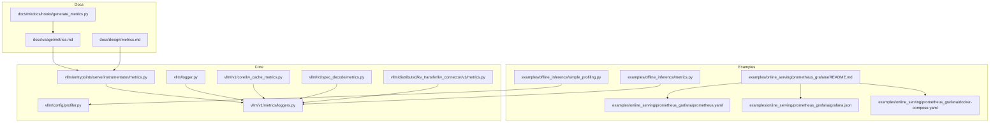
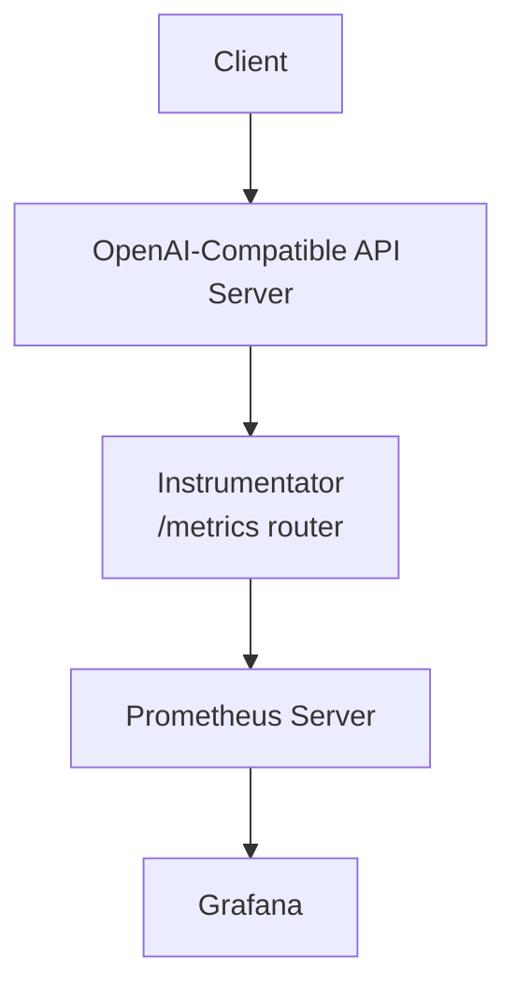
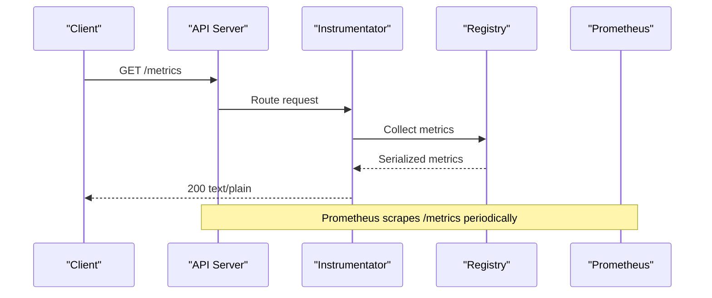
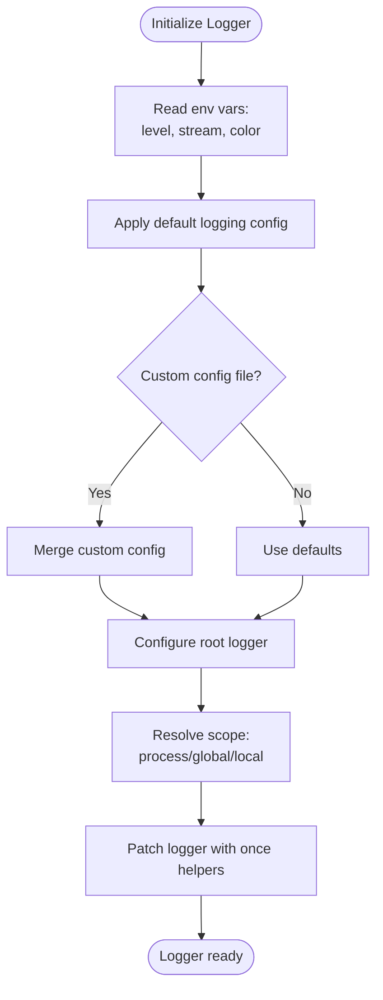
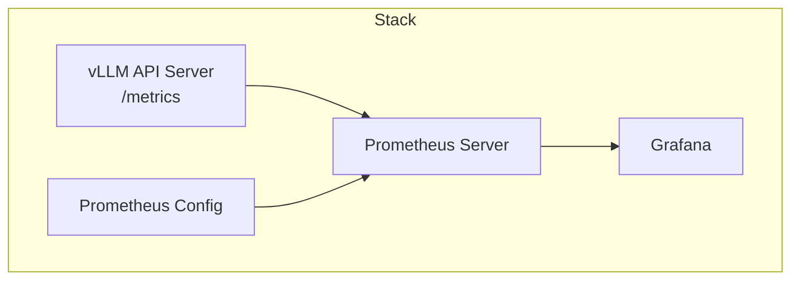
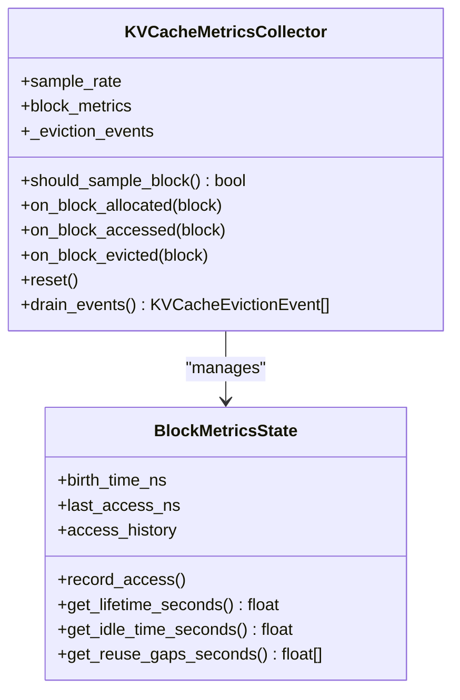
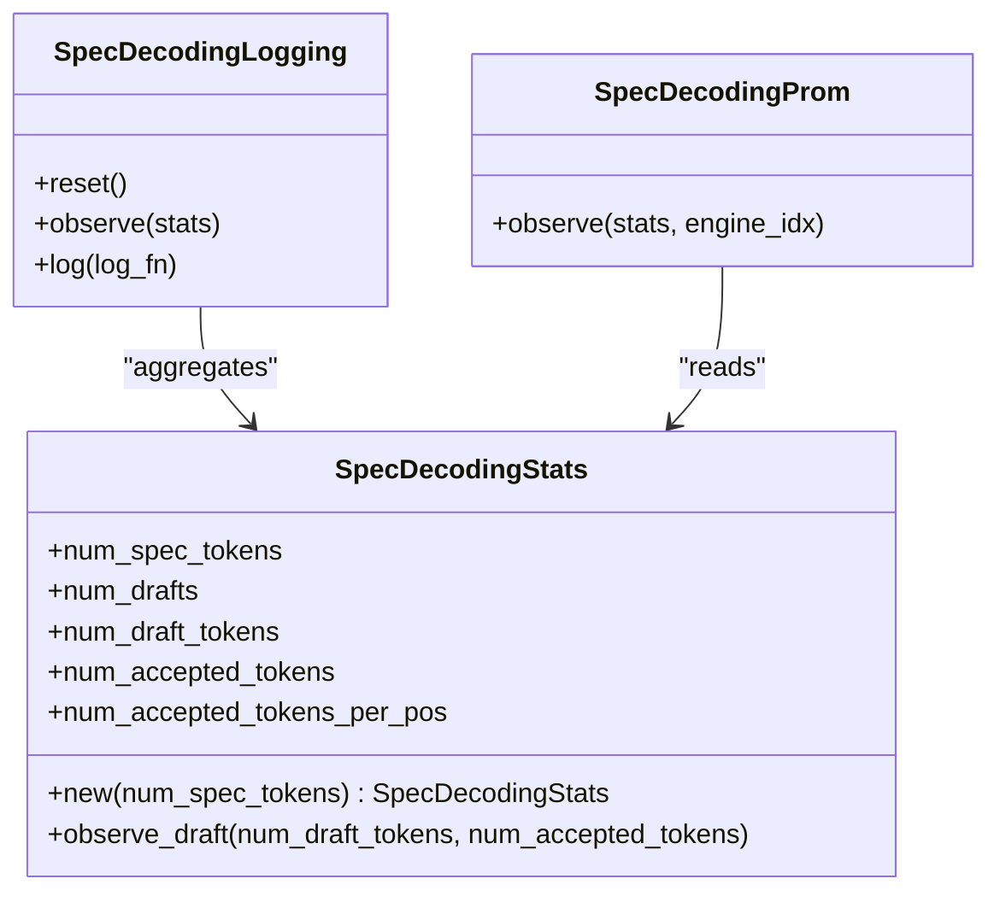
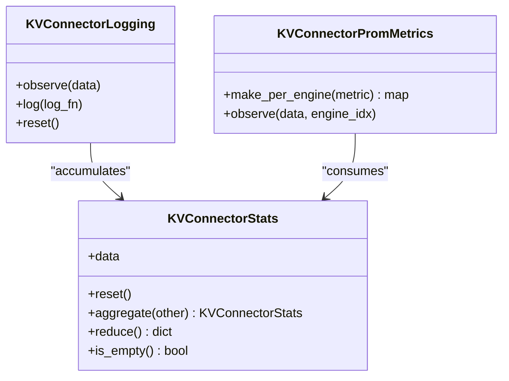
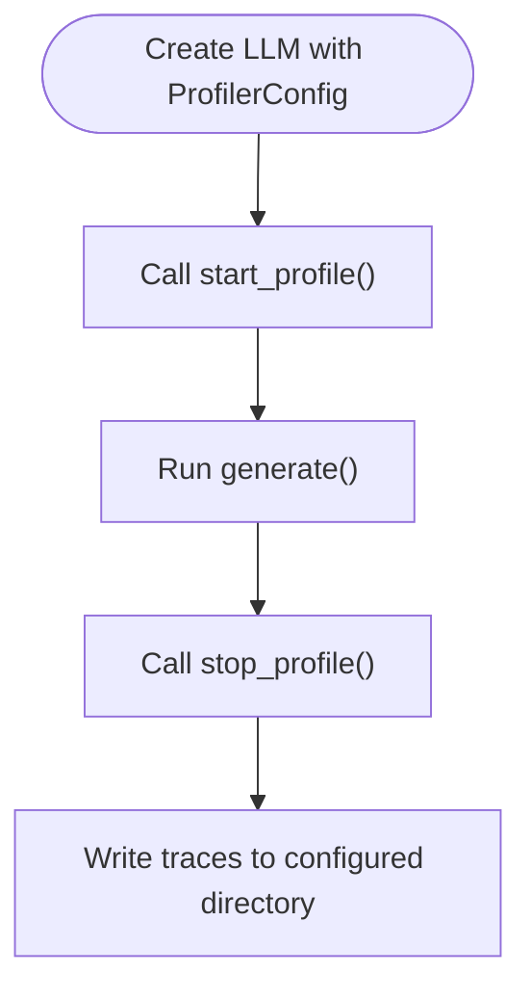
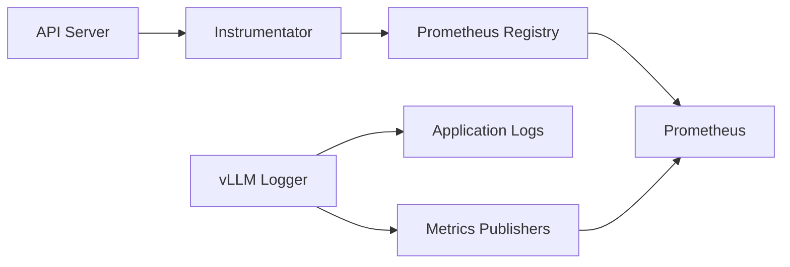

# Monitoring and Observability

<cite>
**Referenced Files in This Document**
- [metrics.md](file://docs/usage/metrics.md)
- [metrics_design.md](file://docs/design/metrics.md)
- [generate_metrics.py](file://docs/mkdocs/hooks/generate_metrics.py)
- [README.md](file://examples/online_serving/prometheus_grafana/README.md)
- [metrics.py](file://examples/online_serving/prometheus_grafana/prometheus.yaml)
- [grafana.json](file://examples/online_serving/prometheus_grafana/grafana.json)
- [docker-compose.yaml](file://examples/online_serving/prometheus_grafana/docker-compose.yaml)
- [metrics.py](file://vllm/entrypoints/serve/instrumentator/metrics.py)
- [logger.py](file://vllm/logger.py)
- [metrics.py](file://vllm/v1/spec_decode/metrics.py)
- [metrics.py](file://vllm/v1/core/kv_cache_metrics.py)
- [metrics.py](file://vllm/distributed/kv_transfer/kv_connector/v1/metrics.py)
- [metrics.py](file://examples/offline_inference/metrics.py)
- [simple_profiling.py](file://examples/offline_inference/simple_profiling.py)
- [profiler.py](file://vllm/config/profiler.py)
- [loggers.py](file://vllm/v1/metrics/loggers.py)
</cite>

## Table of Contents
1. [Introduction](#introduction)
2. [Project Structure](#project-structure)
3. [Core Components](#core-components)
4. [Architecture Overview](#architecture-overview)
5. [Detailed Component Analysis](#detailed-component-analysis)
6. [Dependency Analysis](#dependency-analysis)
7. [Performance Considerations](#performance-considerations)
8. [Troubleshooting Guide](#troubleshooting-guide)
9. [Conclusion](#conclusion)
10. [Appendices](#appendices)

## Introduction
This document explains vLLM’s monitoring and observability capabilities with a focus on metrics collection, logging, and profiling. It covers:
- The Prometheus-compatible metrics endpoint and metric types
- Logging configuration and scopes
- Prometheus and Grafana integration examples
- KV cache residency metrics and speculative decoding metrics
- Profiling tools and configuration
- Practical guidance for performance monitoring, alerting, and troubleshooting

## Project Structure
The observability surface spans user-facing documentation, example integrations, and internal metric/log infrastructure:
- Usage and design docs define the metrics taxonomy and publishing behavior
- Example stacks demonstrate Prometheus and Grafana integration
- Internal modules implement metric publishers, KV cache metrics, and profiling configuration

**Diagram sources**
- [metrics.md](file://docs/usage/metrics.md#L1-L53)
- [metrics_design.md](file://docs/design/metrics.md#L1-L120)
- [generate_metrics.py](file://docs/mkdocs/hooks/generate_metrics.py#L41-L122)
- [README.md](file://examples/online_serving/prometheus_grafana/README.md#L1-L58)
- [metrics.py](file://vllm/entrypoints/serve/instrumentator/metrics.py#L1-L46)
- [logger.py](file://vllm/logger.py#L1-L120)
- [metrics.py](file://vllm/v1/spec_decode/metrics.py#L1-L120)
- [metrics.py](file://vllm/v1/core/kv_cache_metrics.py#L1-L97)
- [metrics.py](file://vllm/distributed/kv_transfer/kv_connector/v1/metrics.py#L1-L120)
- [metrics.py](file://examples/offline_inference/metrics.py#L1-L51)
- [simple_profiling.py](file://examples/offline_inference/simple_profiling.py#L1-L53)
- [profiler.py](file://vllm/config/profiler.py#L1-L120)
- [loggers.py](file://vllm/v1/metrics/loggers.py#L1270-L1291)

**Section sources**
- [metrics.md](file://docs/usage/metrics.md#L1-L53)
- [metrics_design.md](file://docs/design/metrics.md#L1-L120)
- [README.md](file://examples/online_serving/prometheus_grafana/README.md#L1-L58)
- [metrics.py](file://vllm/entrypoints/serve/instrumentator/metrics.py#L1-L46)
- [logger.py](file://vllm/logger.py#L1-L120)
- [metrics.py](file://vllm/v1/spec_decode/metrics.py#L1-L120)
- [metrics.py](file://vllm/v1/core/kv_cache_metrics.py#L1-L97)
- [metrics.py](file://vllm/distributed/kv_transfer/kv_connector/v1/metrics.py#L1-L120)
- [metrics.py](file://examples/offline_inference/metrics.py#L1-L51)
- [simple_profiling.py](file://examples/offline_inference/simple_profiling.py#L1-L53)
- [profiler.py](file://vllm/config/profiler.py#L1-L120)
- [loggers.py](file://vllm/v1/metrics/loggers.py#L1270-L1291)

## Core Components
- Prometheus metrics endpoint: Exposed via the API server and instrumented by the ASGI instrumentation layer. The endpoint publishes counters, gauges, and histograms for server and request-level metrics.
- Logging subsystem: Provides configurable formatters, handlers, and scoped logging (process/global/local) with helpers for deduplicated one-time messages.
- KV cache residency metrics: Tracks lifetime, idle time, and reuse gaps for sampled cache blocks.
- Speculative decoding metrics: Aggregates and exposes draft/accepted token counts and per-position acceptance rates.
- KV connector metrics: Base abstractions for connector-specific metrics and Prometheus exposure.
- Profiling configuration: Supports PyTorch and CUDA profilers with tunable options and environment variable deprecation notices.
- Offline metrics reader: Demonstrates retrieving metrics programmatically from an LLM instance.

**Section sources**
- [metrics.md](file://docs/usage/metrics.md#L1-L53)
- [metrics_design.md](file://docs/design/metrics.md#L292-L353)
- [metrics.py](file://vllm/entrypoints/serve/instrumentator/metrics.py#L1-L46)
- [logger.py](file://vllm/logger.py#L1-L120)
- [metrics.py](file://vllm/v1/core/kv_cache_metrics.py#L1-L97)
- [metrics.py](file://vllm/v1/spec_decode/metrics.py#L1-L120)
- [metrics.py](file://vllm/distributed/kv_transfer/kv_connector/v1/metrics.py#L1-L120)
- [profiler.py](file://vllm/config/profiler.py#L1-L120)
- [metrics.py](file://examples/offline_inference/metrics.py#L1-L51)

## Architecture Overview
The observability pipeline integrates the API server, instrumentation, Prometheus, and optional Grafana.

**Diagram sources**
- [metrics.py](file://vllm/entrypoints/serve/instrumentator/metrics.py#L1-L46)
- [metrics.md](file://docs/usage/metrics.md#L1-L53)
- [README.md](file://examples/online_serving/prometheus_grafana/README.md#L1-L58)

## Detailed Component Analysis

### Prometheus Metrics Endpoint and Types
- The API server exposes a Prometheus-compatible endpoint that serves counters, gauges, and histograms. The design documents explain metric types and labeling, including model_name labels and the historical evolution toward OpenMetrics compatibility.
- The instrumentation attaches HTTP metrics and mounts the /metrics route with proper content type handling.

**Diagram sources**
- [metrics.py](file://vllm/entrypoints/serve/instrumentator/metrics.py#L1-L46)
- [metrics_design.md](file://docs/design/metrics.md#L292-L353)

**Section sources**
- [metrics.md](file://docs/usage/metrics.md#L1-L53)
- [metrics_design.md](file://docs/design/metrics.md#L292-L353)
- [metrics.py](file://vllm/entrypoints/serve/instrumentator/metrics.py#L1-L46)

### Logging Configuration and Scopes
- Logging is configured via environment-driven defaults and optional JSON config files. Formatters and handlers are set up, with colorized output detection and stream selection.
- Scoped logging supports process, local, and global ranks, enabling targeted logs in distributed setups.
- One-time logging helpers prevent repeated noise while preserving stack context.

**Diagram sources**
- [logger.py](file://vllm/logger.py#L1-L120)

**Section sources**
- [logger.py](file://vllm/logger.py#L1-L120)

### Prometheus and Grafana Integration
- The example stack launches Prometheus and Grafana via Docker Compose, demonstrates scraping the vLLM /metrics endpoint, and imports a Grafana dashboard JSON.
- The Prometheus configuration defines targets and scrape intervals; Grafana connects to Prometheus and imports a dashboard.

**Diagram sources**
- [README.md](file://examples/online_serving/prometheus_grafana/README.md#L1-L58)
- [metrics.py](file://examples/online_serving/prometheus_grafana/prometheus.yaml#L1-L200)
- [grafana.json](file://examples/online_serving/prometheus_grafana/grafana.json#L1-L200)
- [docker-compose.yaml](file://examples/online_serving/prometheus_grafana/docker-compose.yaml#L1-L200)

**Section sources**
- [README.md](file://examples/online_serving/prometheus_grafana/README.md#L1-L58)

### KV Cache Residency Metrics
- KV cache residency metrics track block lifetime, idle time before eviction, and reuse gaps for sampled blocks. These are derived from eviction events and exposed via Prometheus histograms.

**Diagram sources**
- [metrics.py](file://vllm/v1/core/kv_cache_metrics.py#L1-L97)

**Section sources**
- [metrics.py](file://vllm/v1/core/kv_cache_metrics.py#L1-L97)

### Speculative Decoding Metrics
- Aggregates per-iteration statistics for speculative decoding and exposes counters for drafts, draft tokens, accepted tokens, and per-position acceptance counts. Includes logging aggregation and Prometheus exposure.

**Diagram sources**
- [metrics.py](file://vllm/v1/spec_decode/metrics.py#L1-L226)

**Section sources**
- [metrics.py](file://vllm/v1/spec_decode/metrics.py#L1-L226)

### KV Connector Metrics Abstractions
- Provides base classes and helpers for connector-specific metrics, including accumulation, reduction, and Prometheus registration helpers. Enables per-engine labeling and observation.

**Diagram sources**
- [metrics.py](file://vllm/distributed/kv_transfer/kv_connector/v1/metrics.py#L1-L187)

**Section sources**
- [metrics.py](file://vllm/distributed/kv_transfer/kv_connector/v1/metrics.py#L1-L187)

### Profiling Tools and Configuration
- Profiling configuration supports PyTorch and CUDA profilers with options for directory, stack tracing, FLOPS, memory, gzip compression, and iteration delays/limits. Environment variables are deprecated in favor of explicit CLI arguments.
- Offline profiling example shows how to start/stop profiling around generation calls.

**Diagram sources**
- [profiler.py](file://vllm/config/profiler.py#L1-L200)
- [simple_profiling.py](file://examples/offline_inference/simple_profiling.py#L1-L53)

**Section sources**
- [profiler.py](file://vllm/config/profiler.py#L1-L200)
- [simple_profiling.py](file://examples/offline_inference/simple_profiling.py#L1-L53)

### Offline Metrics Reader
- Demonstrates retrieving metrics from an LLM instance and printing counters, gauges, vectors, and histograms.

**Section sources**
- [metrics.py](file://examples/offline_inference/metrics.py#L1-L51)

## Dependency Analysis
- The API server’s instrumentation depends on the Prometheus registry and the prometheus_fastapi_instrumentator to expose HTTP metrics and mount /metrics.
- The metrics publishing pipeline composes multiple stat loggers, including a default PrometheusStatLogger when none is explicitly provided.
- Logging relies on the standard logging module with vLLM-specific formatters and scoping logic.

**Diagram sources**
- [metrics.py](file://vllm/entrypoints/serve/instrumentator/metrics.py#L1-L46)
- [loggers.py](file://vllm/v1/metrics/loggers.py#L1270-L1291)
- [logger.py](file://vllm/logger.py#L1-L120)

**Section sources**
- [metrics.py](file://vllm/entrypoints/serve/instrumentator/metrics.py#L1-L46)
- [loggers.py](file://vllm/v1/metrics/loggers.py#L1270-L1291)
- [logger.py](file://vllm/logger.py#L1-L120)

## Performance Considerations
- Enabling metrics incurs overhead; choose appropriate buckets and sampling rates (e.g., KV cache residency sampling) to balance fidelity and cost.
- Prefer Prometheus histograms for latency SLOs and counters for totals; use labels judiciously to avoid cardinality explosions.
- For distributed deployments, be mindful of multiprocess mode caveats for built-in Python/process metrics and Info metrics in multiprocessing contexts.

[No sources needed since this section provides general guidance]

## Troubleshooting Guide
- Verify the /metrics endpoint is reachable and Prometheus can scrape it. Confirm the content type and labels are correct.
- Use scoped logging to isolate noisy messages and enable function call tracing for hangs or crashes when necessary.
- For profiling, ensure the profiler directory is writable and properly configured; adjust delay/limit settings to reduce overhead.

**Section sources**
- [metrics.md](file://docs/usage/metrics.md#L1-L53)
- [logger.py](file://vllm/logger.py#L240-L304)
- [profiler.py](file://vllm/config/profiler.py#L120-L200)

## Conclusion
vLLM provides a robust observability foundation centered on Prometheus-compatible metrics, flexible logging, and profiling tools. The example Prometheus and Grafana stack accelerates adoption, while internal metric collectors offer deep insights into KV cache residency and speculative decoding performance. By combining these capabilities with careful alerting and operational practices, teams can monitor, troubleshoot, and scale vLLM deployments effectively.

[No sources needed since this section summarizes without analyzing specific files]

## Appendices

### Practical Setup Examples
- Prometheus and Grafana: Follow the example README to launch Prometheus and Grafana, scrape the /metrics endpoint, and import the Grafana dashboard.
- Metrics endpoint: Query the /metrics endpoint to inspect current metrics and labels.

**Section sources**
- [README.md](file://examples/online_serving/prometheus_grafana/README.md#L1-L58)
- [metrics.md](file://docs/usage/metrics.md#L1-L53)

### Metric Interpretation and Alerting Strategies
- Latency SLOs: Track histograms for time-to-first-token and inter-token latency; define SLO targets and alert on quantiles crossing thresholds.
- Throughput and saturation: Monitor counters for prompt and generation tokens and correlate with running/waiting request gauges to detect saturation.
- KV cache efficiency: Watch residency histograms to identify stranded or pinned cache blocks indicating suboptimal workloads.
- Speculative decoding: Track acceptance rates and per-position acceptance to assess effectiveness and tune speculative parameters.

**Section sources**
- [metrics_design.md](file://docs/design/metrics.md#L1-L200)
- [metrics.py](file://vllm/v1/spec_decode/metrics.py#L120-L226)
- [metrics.py](file://vllm/v1/core/kv_cache_metrics.py#L1-L97)

### Operational Best Practices
- Keep metrics enabled in production for default SLOs; selectively enable detailed tracing only when investigating issues.
- Use labels consistently (e.g., model_name) and avoid high-cardinality label combinations.
- Periodically review metric deprecation notices and migration paths.

**Section sources**
- [metrics_design.md](file://docs/design/metrics.md#L434-L501)
- [metrics_design.md](file://docs/design/metrics.md#L608-L645)