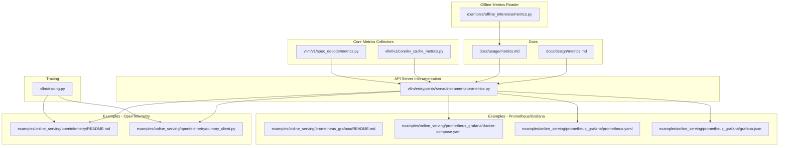
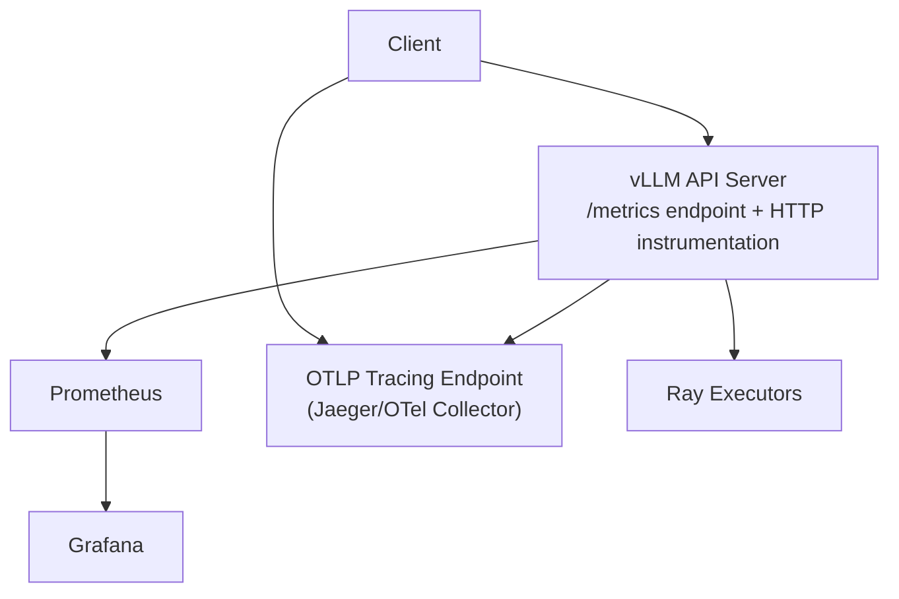
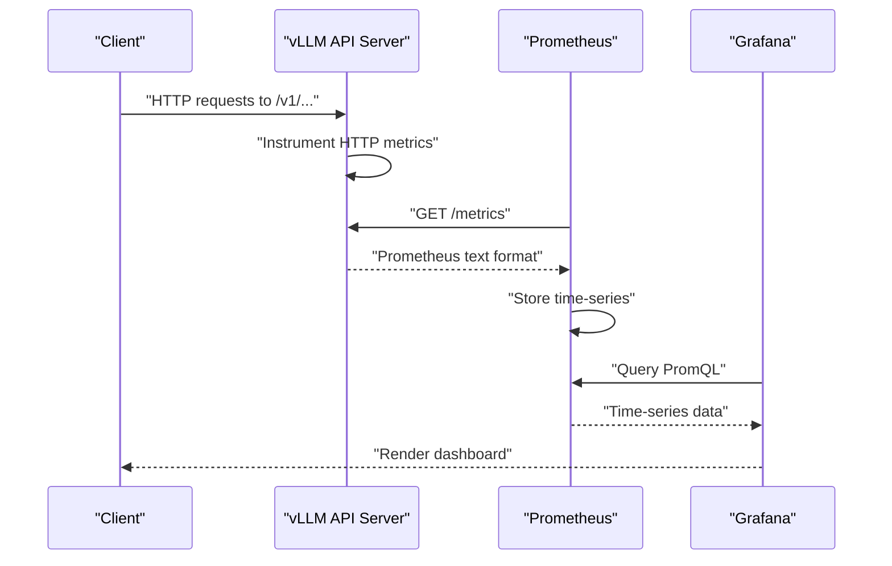
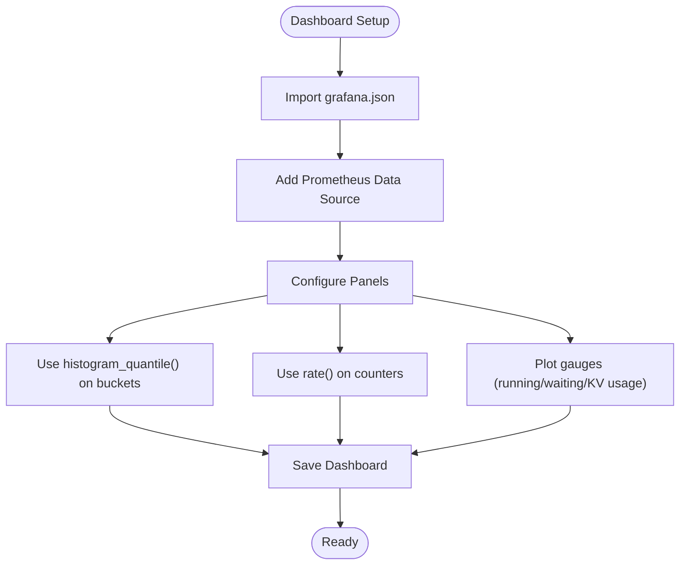
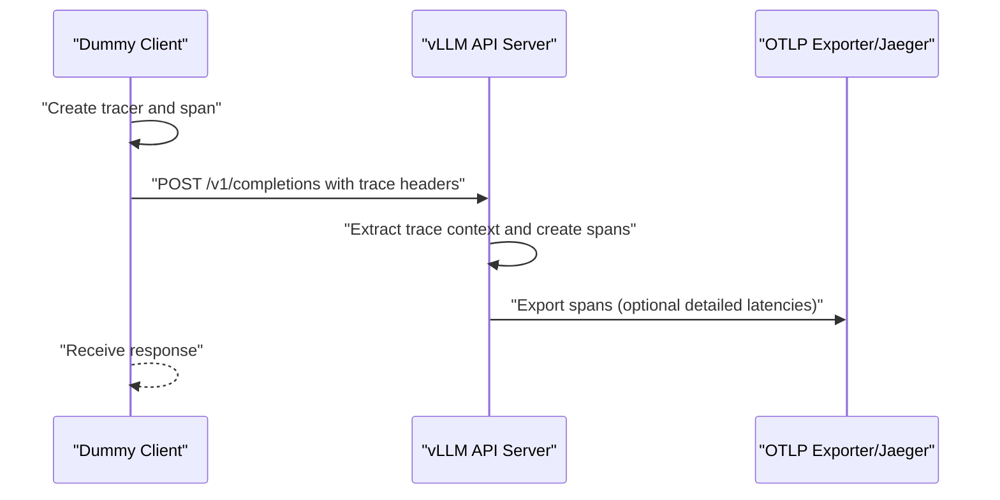
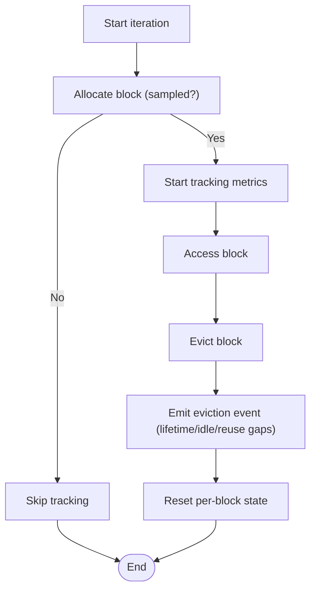
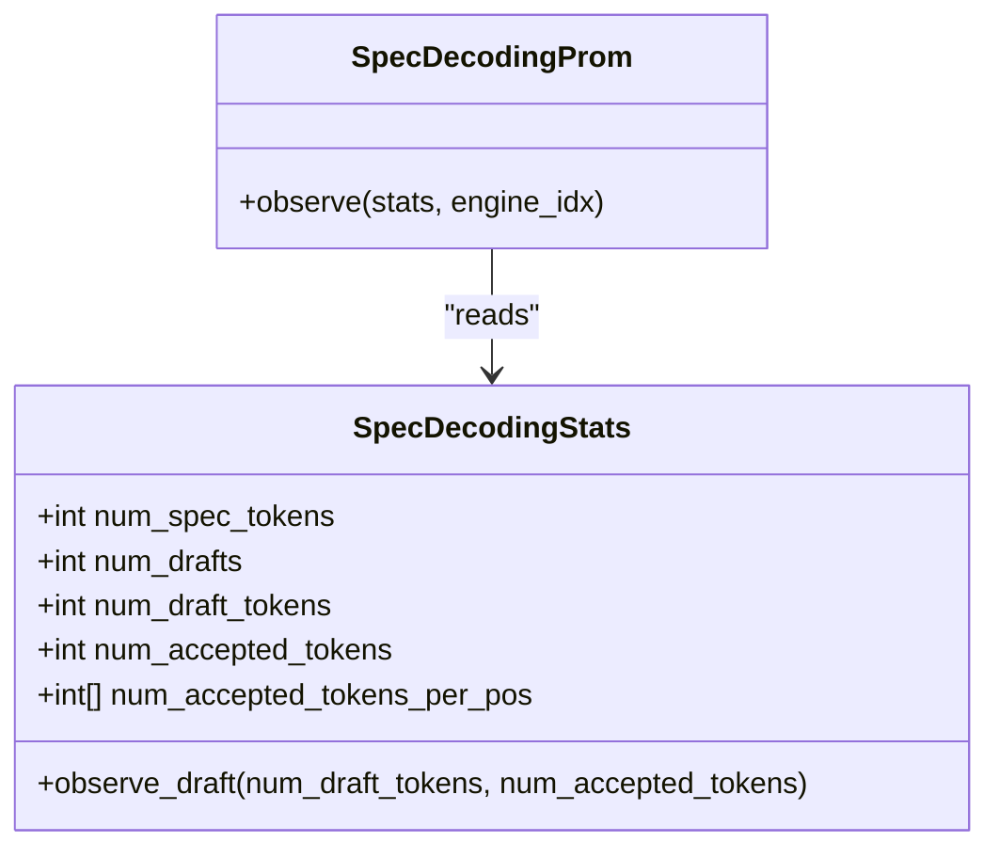
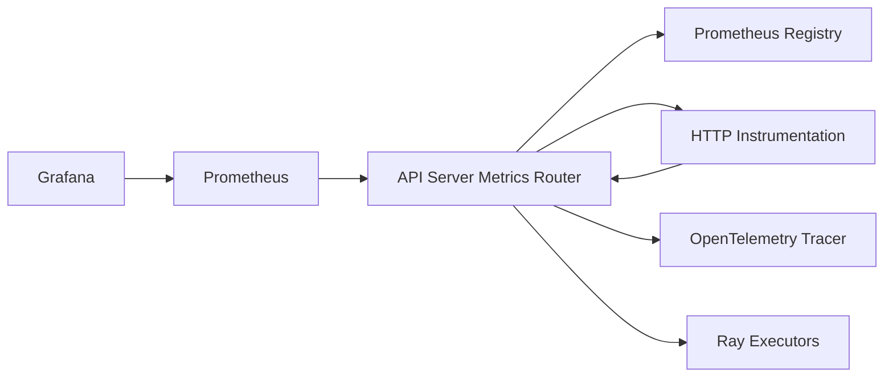

# Observability Tools and Dashboards

<cite>
**Referenced Files in This Document**
- [metrics.md](file://docs/design/metrics.md)
- [metrics.md](file://docs/usage/metrics.md)
- [metrics.py](file://vllm/entrypoints/serve/instrumentator/metrics.py)
- [kv_cache_metrics.py](file://vllm/v1/core/kv_cache_metrics.py)
- [metrics.py](file://vllm/v1/spec_decode/metrics.py)
- [tracing.py](file://vllm/tracing.py)
- [README.md](file://examples/online_serving/prometheus_grafana/README.md)
- [docker-compose.yaml](file://examples/online_serving/prometheus_grafana/docker-compose.yaml)
- [prometheus.yaml](file://examples/online_serving/prometheus_grafana/prometheus.yaml)
- [grafana.json](file://examples/online_serving/prometheus_grafana/grafana.json)
- [README.md](file://examples/online_serving/opentelemetry/README.md)
- [dummy_client.py](file://examples/online_serving/opentelemetry/dummy_client.py)
- [metrics.py](file://examples/offline_inference/metrics.py)
</cite>

## Table of Contents
1. [Introduction](#introduction)
2. [Project Structure](#project-structure)
3. [Core Components](#core-components)
4. [Architecture Overview](#architecture-overview)
5. [Detailed Component Analysis](#detailed-component-analysis)
6. [Dependency Analysis](#dependency-analysis)
7. [Performance Considerations](#performance-considerations)
8. [Troubleshooting Guide](#troubleshooting-guide)
9. [Conclusion](#conclusion)
10. [Appendices](#appendices)

## Introduction
This document explains how to integrate vLLM with observability stacks for production-grade monitoring and distributed tracing. It covers:
- Prometheus metrics exposition and scraping, including service discovery and metric labeling
- Grafana dashboard configuration and customization
- Ray-based observability integration and distributed tracing
- OpenTelemetry integration for distributed tracing and optional detailed latency metrics
- Practical examples for dashboard setup, alerting rule configuration, and operational workflows
- Cloud observability platform integration, custom metric exporters, and real-time dashboards
- Troubleshooting workflows using observability data, performance bottleneck identification, and capacity planning

## Project Structure
The observability-related materials are organized across:
- Design and usage documentation for metrics
- Prometheus and Grafana example stack with configuration and dashboard JSON
- OpenTelemetry example with a dummy client and setup guide
- Metrics instrumentation in the API server and core metrics collectors
- Offline metrics reader example for local runs

**Diagram sources**
- [metrics.md](file://docs/design/metrics.md#L1-L702)
- [metrics.md](file://docs/usage/metrics.md#L1-L53)
- [metrics.py](file://vllm/entrypoints/serve/instrumentator/metrics.py#L1-L46)
- [kv_cache_metrics.py](file://vllm/v1/core/kv_cache_metrics.py#L1-L97)
- [metrics.py](file://vllm/v1/spec_decode/metrics.py#L1-L226)
- [tracing.py](file://vllm/tracing.py#L1-L136)
- [README.md](file://examples/online_serving/prometheus_grafana/README.md#L1-L58)
- [docker-compose.yaml](file://examples/online_serving/prometheus_grafana/docker-compose.yaml#L1-L20)
- [prometheus.yaml](file://examples/online_serving/prometheus_grafana/prometheus.yaml#L1-L11)
- [grafana.json](file://examples/online_serving/prometheus_grafana/grafana.json#L1-L800)
- [README.md](file://examples/online_serving/opentelemetry/README.md#L1-L95)
- [dummy_client.py](file://examples/online_serving/opentelemetry/dummy_client.py#L1-L35)
- [metrics.py](file://examples/offline_inference/metrics.py#L1-L51)

**Section sources**
- [metrics.md](file://docs/design/metrics.md#L1-L702)
- [metrics.md](file://docs/usage/metrics.md#L1-L53)
- [metrics.py](file://vllm/entrypoints/serve/instrumentator/metrics.py#L1-L46)
- [kv_cache_metrics.py](file://vllm/v1/core/kv_cache_metrics.py#L1-L97)
- [metrics.py](file://vllm/v1/spec_decode/metrics.py#L1-L226)
- [tracing.py](file://vllm/tracing.py#L1-L136)
- [README.md](file://examples/online_serving/prometheus_grafana/README.md#L1-L58)
- [docker-compose.yaml](file://examples/online_serving/prometheus_grafana/docker-compose.yaml#L1-L20)
- [prometheus.yaml](file://examples/online_serving/prometheus_grafana/prometheus.yaml#L1-L11)
- [grafana.json](file://examples/online_serving/prometheus_grafana/grafana.json#L1-L800)
- [README.md](file://examples/online_serving/opentelemetry/README.md#L1-L95)
- [dummy_client.py](file://examples/online_serving/opentelemetry/dummy_client.py#L1-L35)
- [metrics.py](file://examples/offline_inference/metrics.py#L1-L51)

## Core Components
- Prometheus metrics exposition and HTTP endpoint routing
  - The API server mounts a Prometheus-compatible endpoint and instruments HTTP metrics while excluding health and metrics routes themselves.
  - The metrics endpoint returns the correct content type and is routed under /metrics.

- Metrics categories and exposure
  - Server-level gauges (e.g., number of running/waiting/swapped requests, KV cache usage)
  - Request-level histograms (e.g., end-to-end latency, time-to-first-token, inter-token latency, prefill/decode times)
  - Counters (e.g., prompt tokens, generation tokens, request success by finish reason)
  - Specialized collectors (e.g., KV cache residency, speculative decoding metrics)

- Grafana dashboard
  - Reference dashboard JSON demonstrates panels for latency quantiles, token throughput, scheduler state, and KV cache usage.
  - Panels use PromQL expressions to compute quantiles and averages from histograms and counters.

- OpenTelemetry tracing
  - Optional tracing with configurable OTLP exporter endpoint and protocols (grpc/http/protobuf).
  - Span attributes align with semantic conventions for GenAI spans.
  - Optional detailed latency metrics (model forward/execute) gated by a flag.

- Ray-based observability
  - Ray-based executors and wrappers exist for distributed tracing and metrics collection in distributed deployments.

**Section sources**
- [metrics.py](file://vllm/entrypoints/serve/instrumentator/metrics.py#L1-L46)
- [metrics.md](file://docs/design/metrics.md#L1-L702)
- [metrics.md](file://docs/usage/metrics.md#L1-L53)
- [grafana.json](file://examples/online_serving/prometheus_grafana/grafana.json#L1-L800)
- [tracing.py](file://vllm/tracing.py#L1-L136)

## Architecture Overview
The observability pipeline integrates the vLLM API server with Prometheus and Grafana, and optionally OpenTelemetry for distributed tracing.

**Diagram sources**
- [metrics.py](file://vllm/entrypoints/serve/instrumentator/metrics.py#L1-L46)
- [prometheus.yaml](file://examples/online_serving/prometheus_grafana/prometheus.yaml#L1-L11)
- [docker-compose.yaml](file://examples/online_serving/prometheus_grafana/docker-compose.yaml#L1-L20)
- [tracing.py](file://vllm/tracing.py#L1-L136)

## Detailed Component Analysis

### Prometheus Metrics Exposition and Scraping
- Endpoint and content type
  - The API server exposes a Prometheus-compatible endpoint and sets the correct content type for the metrics response.
  - HTTP metrics are instrumented automatically, excluding health and metrics routes.

- Scrape configuration
  - Example Prometheus configuration targets the API server’s metrics endpoint.
  - Adjust scrape interval and target host/port as needed.

- Metric categories and labels
  - Server-level gauges: number of running/waiting requests, KV cache usage percentage.
  - Request-level histograms: e2e latency, TTFT, inter-token latency, prefill/decode times.
  - Counters: prompt tokens, generation tokens, request success by finish reason.
  - Labels include model name and other runtime identifiers.

**Diagram sources**
- [metrics.py](file://vllm/entrypoints/serve/instrumentator/metrics.py#L1-L46)
- [prometheus.yaml](file://examples/online_serving/prometheus_grafana/prometheus.yaml#L1-L11)
- [grafana.json](file://examples/online_serving/prometheus_grafana/grafana.json#L1-L800)

**Section sources**
- [metrics.py](file://vllm/entrypoints/serve/instrumentator/metrics.py#L1-L46)
- [metrics.md](file://docs/design/metrics.md#L1-L702)
- [metrics.md](file://docs/usage/metrics.md#L1-L53)
- [prometheus.yaml](file://examples/online_serving/prometheus_grafana/prometheus.yaml#L1-L11)

### Grafana Dashboard Configuration and Customization
- Importing the dashboard
  - Use the provided dashboard JSON and select the Prometheus data source.
  - Panels include latency quantiles, token throughput, scheduler state, and KV cache usage.

- Panel expressions
  - Panels compute quantiles from histogram buckets and averages from sum/count.
  - Use variables (e.g., model_name) to filter metrics per deployment.

- Creating custom panels
  - Combine counters (e.g., prompt/throughput) with rate calculations.
  - Track server-level gauges (e.g., running/waiting requests) for saturation signals.

**Diagram sources**
- [README.md](file://examples/online_serving/prometheus_grafana/README.md#L1-L58)
- [grafana.json](file://examples/online_serving/prometheus_grafana/grafana.json#L1-L800)

**Section sources**
- [README.md](file://examples/online_serving/prometheus_grafana/README.md#L1-L58)
- [grafana.json](file://examples/online_serving/prometheus_grafana/grafana.json#L1-L800)

### Ray-Based Observability and Distributed Tracing
- Ray-based executors and wrappers
  - vLLM includes Ray-based distributed executors and wrappers that can participate in distributed tracing and metrics collection.
- Distributed tracing
  - Enable OpenTelemetry tracing to propagate trace context across Ray workers and services.
  - Use OTLP endpoints compatible with your telemetry backend.

**Section sources**
- [tracing.py](file://vllm/tracing.py#L1-L136)

### OpenTelemetry Integration for Distributed Tracing and Metrics
- Enabling tracing
  - Configure the OTLP traces endpoint and protocol (grpc or http/protobuf).
  - Set service name and export environment variables as shown in the example.

- Client-side propagation
  - The dummy client injects trace context into requests, enabling end-to-end trace correlation.

- Detailed latency metrics
  - Optional detailed latency metrics (model forward/execute) are gated by a flag and exported via OpenTelemetry.

**Diagram sources**
- [README.md](file://examples/online_serving/opentelemetry/README.md#L1-L95)
- [dummy_client.py](file://examples/online_serving/opentelemetry/dummy_client.py#L1-L35)
- [tracing.py](file://vllm/tracing.py#L1-L136)

**Section sources**
- [README.md](file://examples/online_serving/opentelemetry/README.md#L1-L95)
- [dummy_client.py](file://examples/online_serving/opentelemetry/dummy_client.py#L1-L35)
- [tracing.py](file://vllm/tracing.py#L1-L136)

### KV Cache Residency Metrics
- Sampling-based residency tracking
  - Tracks lifetime, idle time, and reuse gaps for sampled cache blocks.
  - Emits eviction events consumed by the frontend to populate Prometheus histograms.

**Diagram sources**
- [kv_cache_metrics.py](file://vllm/v1/core/kv_cache_metrics.py#L1-L97)

**Section sources**
- [kv_cache_metrics.py](file://vllm/v1/core/kv_cache_metrics.py#L1-L97)

### Speculative Decoding Metrics
- Aggregation and publishing
  - Aggregates per-iteration stats (drafts, draft tokens, accepted tokens) and publishes Prometheus counters.
  - Provides PromQL recipes for acceptance rate and per-position acceptance rates.

**Diagram sources**
- [metrics.py](file://vllm/v1/spec_decode/metrics.py#L1-L226)

**Section sources**
- [metrics.py](file://vllm/v1/spec_decode/metrics.py#L1-L226)

### Offline Metrics Reader
- Local metrics inspection
  - Demonstrates how to retrieve metrics from an LLM instance and print counters, gauges, vectors, and histograms.

**Section sources**
- [metrics.py](file://examples/offline_inference/metrics.py#L1-L51)

## Dependency Analysis
- API server instrumentation depends on Prometheus client libraries and the Prometheus FastAPI Instrumentator.
- Metrics exposition relies on a dedicated registry and ASGI app mounting.
- Grafana dashboard depends on Prometheus data source and panel expressions.
- OpenTelemetry tracing depends on OTLP exporter availability and environment configuration.
- Ray-based executors integrate with tracing and metrics collection.

**Diagram sources**
- [metrics.py](file://vllm/entrypoints/serve/instrumentator/metrics.py#L1-L46)
- [tracing.py](file://vllm/tracing.py#L1-L136)

**Section sources**
- [metrics.py](file://vllm/entrypoints/serve/instrumentator/metrics.py#L1-L46)
- [tracing.py](file://vllm/tracing.py#L1-L136)

## Performance Considerations
- Choose appropriate histogram buckets for latency metrics to balance fidelity and cardinality.
- Use rate() and histogram_quantile() to compute SLIs/SLOs efficiently in Grafana.
- Limit detailed tracing overhead by enabling only when needed.
- Monitor server-level gauges (running/waiting requests) to detect saturation and plan capacity accordingly.

[No sources needed since this section provides general guidance]

## Troubleshooting Guide
- Verifying metrics endpoint
  - Query the /metrics endpoint to confirm Prometheus-compatible output and correct content type.
- Checking Prometheus connectivity
  - Confirm Prometheus scrape configuration targets the API server and that the target is reachable.
- Validating Grafana data source
  - Ensure the Prometheus data source URL is correct and “Save & Test” passes.
- Tracing verification
  - Send a request with trace context and verify spans appear in the tracing backend.
  - Confirm OTLP endpoint and protocol settings match your collector.

**Section sources**
- [metrics.py](file://vllm/entrypoints/serve/instrumentator/metrics.py#L1-L46)
- [prometheus.yaml](file://examples/online_serving/prometheus_grafana/prometheus.yaml#L1-L11)
- [README.md](file://examples/online_serving/prometheus_grafana/README.md#L1-L58)
- [README.md](file://examples/online_serving/opentelemetry/README.md#L1-L95)

## Conclusion
vLLM provides a comprehensive observability foundation:
- Prometheus metrics for production monitoring with a ready-to-use Grafana dashboard
- OpenTelemetry tracing for distributed visibility
- Ray-based executors for scalable distributed deployments
- Clear pathways to integrate with cloud observability platforms and build custom dashboards and alerts

Adopt the example configurations to bootstrap monitoring, then evolve dashboards and alerting rules to match your SLOs and operational goals.

[No sources needed since this section summarizes without analyzing specific files]

## Appendices

### Practical Setup Recipes
- Prometheus and Grafana
  - Start the API server, Prometheus, and Grafana using the provided Docker Compose configuration.
  - Import the dashboard JSON and configure the Prometheus data source.
  - Validate with sample requests and the /metrics endpoint.

- OpenTelemetry
  - Install OTel packages, start a tracing backend (e.g., Jaeger), and configure environment variables.
  - Run vLLM with the OTLP endpoint and send requests with trace context from the dummy client.

- Capacity Planning
  - Track running/waiting requests and KV cache usage to infer saturation.
  - Use latency quantiles and token throughput to assess performance under load.

**Section sources**
- [README.md](file://examples/online_serving/prometheus_grafana/README.md#L1-L58)
- [docker-compose.yaml](file://examples/online_serving/prometheus_grafana/docker-compose.yaml#L1-L20)
- [prometheus.yaml](file://examples/online_serving/prometheus_grafana/prometheus.yaml#L1-L11)
- [README.md](file://examples/online_serving/opentelemetry/README.md#L1-L95)
- [dummy_client.py](file://examples/online_serving/opentelemetry/dummy_client.py#L1-L35)