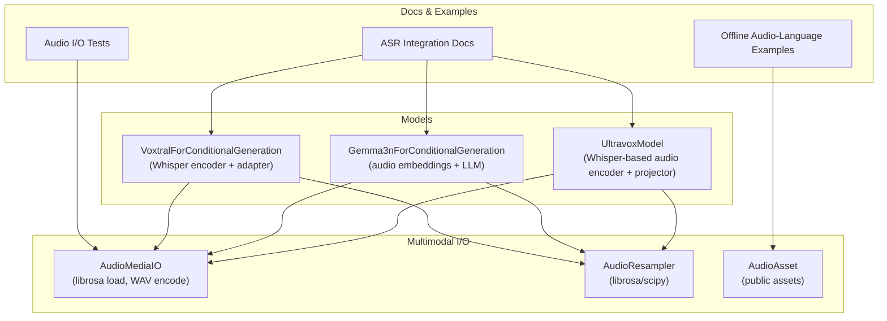
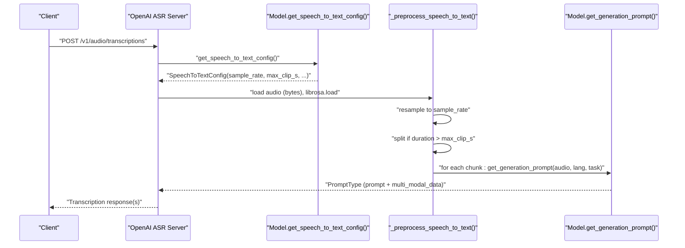
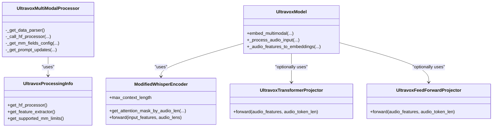
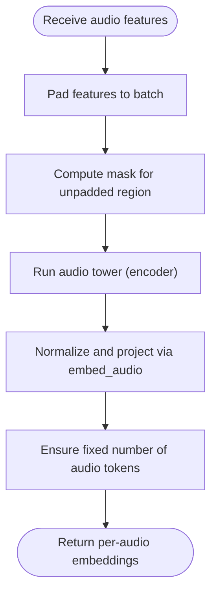
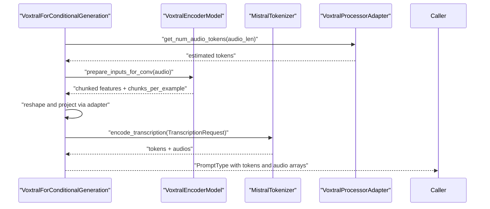
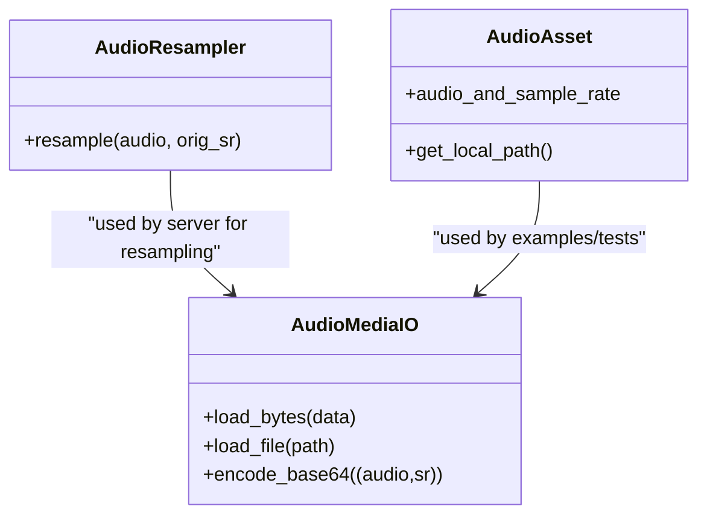
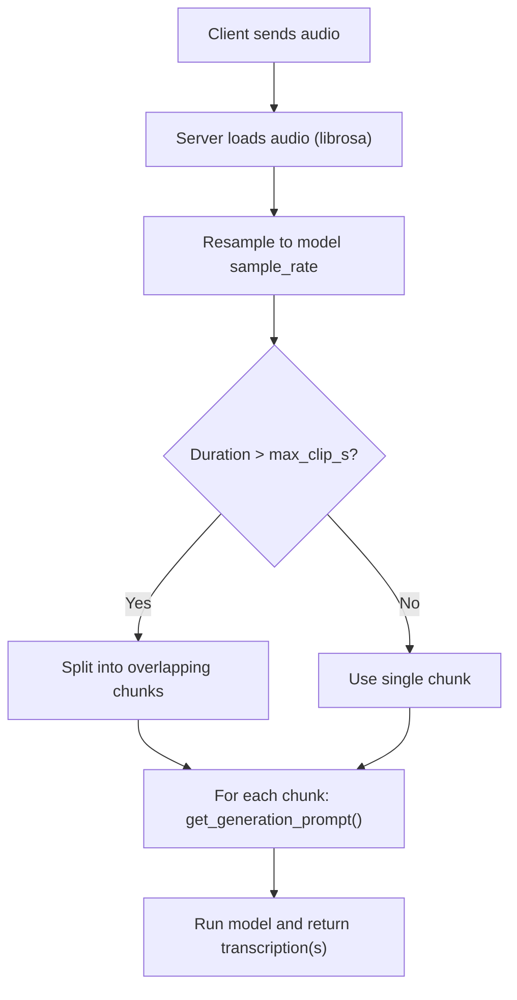
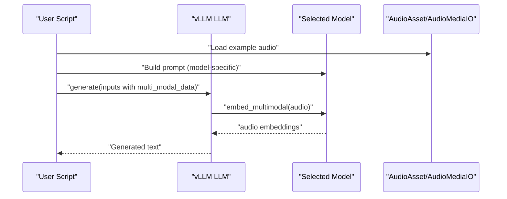
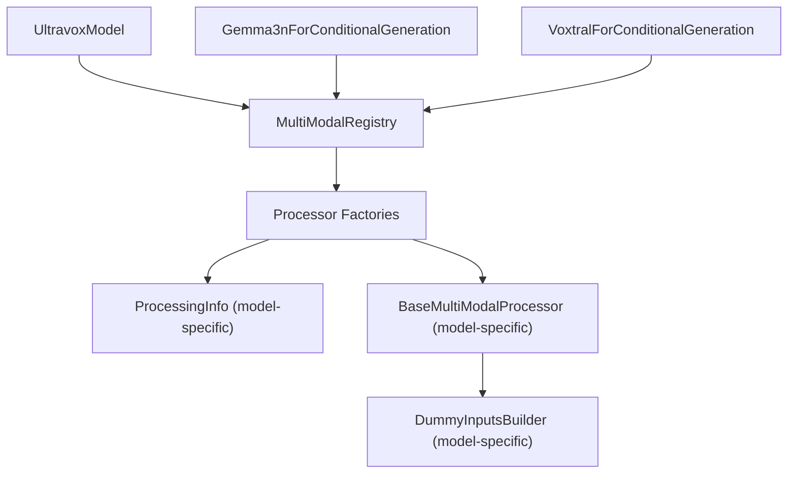

# Audio Processing

<cite>
**Referenced Files in This Document**
- [ultravox.py](file://vllm/model_executor/models/ultravox.py)
- [ultravox.py](file://vllm/transformers_utils/configs/ultravox.py)
- [audio.py](file://vllm/multimodal/audio.py)
- [audio.py](file://vllm/assets/audio.py)
- [gemma3n_mm.py](file://vllm/model_executor/models/gemma3n_mm.py)
- [voxtral.py](file://vllm/model_executor/models/voxtral.py)
- [transcription.md](file://docs/contributing/model/transcription.md)
- [audio_language.py](file://examples/offline_inference/audio_language.py)
- [test_audio.py](file://tests/multimodal/test_audio.py)
- [registry.py](file://vllm/multimodal/registry.py)
</cite>

## Table of Contents
1. [Introduction](#introduction)
2. [Project Structure](#project-structure)
3. [Core Components](#core-components)
4. [Architecture Overview](#architecture-overview)
5. [Detailed Component Analysis](#detailed-component-analysis)
6. [Dependency Analysis](#dependency-analysis)
7. [Performance Considerations](#performance-considerations)
8. [Troubleshooting Guide](#troubleshooting-guide)
9. [Conclusion](#conclusion)
10. [Appendices](#appendices)

## Introduction
This document explains audio processing capabilities in vLLM with a focus on audio model architectures (Ultravox and Granite Speech variants), audio preprocessing workflows, and speech-to-text (ASR) integration. It covers audio encoding, sampling rate handling, feature extraction, supported formats, duration limits, and memory management for audio inputs. Practical examples demonstrate audio-text generation, voice interaction scenarios, and custom audio model integration. Performance optimization strategies for audio processing, batching, and hardware-specific considerations are also included.

## Project Structure
Audio processing in vLLM spans several subsystems:
- Model executors for audio-capable architectures (Ultravox, Gemma3n, Voxtral)
- Multimodal I/O and resampling utilities
- Asset loading helpers for example audio clips
- Documentation for ASR integration and transcription workflows
- Example scripts for offline inference with audio-language models
- Tests validating audio I/O behavior

**Diagram sources**
- [ultravox.py](file://vllm/model_executor/models/ultravox.py#L508-L780)
- [gemma3n_mm.py](file://vllm/model_executor/models/gemma3n_mm.py#L458-L800)
- [voxtral.py](file://vllm/model_executor/models/voxtral.py#L331-L510)
- [audio.py](file://vllm/multimodal/audio.py#L90-L148)
- [audio.py](file://vllm/assets/audio.py#L25-L44)
- [transcription.md](file://docs/contributing/model/transcription.md#L192-L214)
- [audio_language.py](file://examples/offline_inference/audio_language.py#L311-L333)
- [test_audio.py](file://tests/multimodal/test_audio.py#L115-L139)

**Section sources**
- [ultravox.py](file://vllm/model_executor/models/ultravox.py#L508-L780)
- [gemma3n_mm.py](file://vllm/model_executor/models/gemma3n_mm.py#L458-L800)
- [voxtral.py](file://vllm/model_executor/models/voxtral.py#L331-L510)
- [audio.py](file://vllm/multimodal/audio.py#L90-L148)
- [audio.py](file://vllm/assets/audio.py#L25-L44)
- [transcription.md](file://docs/contributing/model/transcription.md#L192-L214)
- [audio_language.py](file://examples/offline_inference/audio_language.py#L311-L333)
- [test_audio.py](file://tests/multimodal/test_audio.py#L115-L139)

## Core Components
- Ultravox audio pipeline:
  - Uses a Whisper-based encoder with a stacking projector or feed-forward projector
  - Processes Mel-spectrogram features and maps them to language model hidden states
  - Handles chunked audio and flattening to token-length alignment
- Gemma3n audio pipeline:
  - Produces soft audio tokens and pads to a fixed number of tokens per audio
  - Embeds audio features into language model space via dedicated embedders
- Voxtral audio pipeline:
  - Uses a Whisper encoder with mel spectrogram computation and chunking
  - Adapts audio tokens to the Mistral-style tokenizer and supports transcription prompts
- Multimodal I/O:
  - AudioMediaIO loads audio via librosa and encodes to WAV base64
  - AudioResampler supports librosa and scipy resampling
  - AudioAsset provides public example audio clips

**Section sources**
- [ultravox.py](file://vllm/model_executor/models/ultravox.py#L508-L780)
- [gemma3n_mm.py](file://vllm/model_executor/models/gemma3n_mm.py#L458-L800)
- [voxtral.py](file://vllm/model_executor/models/voxtral.py#L331-L510)
- [audio.py](file://vllm/multimodal/audio.py#L90-L148)
- [audio.py](file://vllm/assets/audio.py#L25-L44)

## Architecture Overview
The audio processing architecture integrates model-specific processors with multimodal registries and shared I/O utilities. For ASR, the server constructs prompts using model-provided configuration and optionally splits long audio into chunks.

**Diagram sources**
- [transcription.md](file://docs/contributing/model/transcription.md#L192-L214)
- [gemma3n_mm.py](file://vllm/model_executor/models/gemma3n_mm.py#L759-L800)
- [voxtral.py](file://vllm/model_executor/models/voxtral.py#L453-L491)

**Section sources**
- [transcription.md](file://docs/contributing/model/transcription.md#L192-L214)
- [gemma3n_mm.py](file://vllm/model_executor/models/gemma3n_mm.py#L759-L800)
- [voxtral.py](file://vllm/model_executor/models/voxtral.py#L453-L491)

## Detailed Component Analysis

### Ultravox Audio Pipeline
Ultravox composes a Whisper encoder with a projector that converts audio features to language-model-aligned embeddings. It supports both raw Mel-spectrogram features and precomputed audio embeddings.

Key behaviors:
- Feature extraction via WhisperFeatureExtractor
- Optional stacking of frames to reduce sequence length
- Attention masking by audio length
- Chunk-aware flattening to align with token counts
- Placeholder replacement for audio tokens in prompts

**Diagram sources**
- [ultravox.py](file://vllm/model_executor/models/ultravox.py#L111-L138)
- [ultravox.py](file://vllm/model_executor/models/ultravox.py#L169-L270)
- [ultravox.py](file://vllm/model_executor/models/ultravox.py#L403-L506)
- [ultravox.py](file://vllm/model_executor/models/ultravox.py#L508-L780)

**Section sources**
- [ultravox.py](file://vllm/model_executor/models/ultravox.py#L111-L138)
- [ultravox.py](file://vllm/model_executor/models/ultravox.py#L169-L270)
- [ultravox.py](file://vllm/model_executor/models/ultravox.py#L403-L506)
- [ultravox.py](file://vllm/model_executor/models/ultravox.py#L508-L780)

### Gemma3n Audio Pipeline
Gemma3n produces soft audio tokens and embeds them into the language model space. It pads audio features to a fixed token budget per audio.

Key behaviors:
- Fixed number of audio soft tokens per audio item
- Padded audio features and masks
- Embedding projection into language model hidden size
- Placeholder replacement for audio tokens in prompts

**Diagram sources**
- [gemma3n_mm.py](file://vllm/model_executor/models/gemma3n_mm.py#L606-L643)

**Section sources**
- [gemma3n_mm.py](file://vllm/model_executor/models/gemma3n_mm.py#L606-L643)

### Voxtral Audio Pipeline
Voxtral computes Mel spectrograms, splits long inputs into chunks, and adapts audio tokens to the Mistral tokenizer. It supports transcription prompts and maps durations to token estimates.

Key behaviors:
- Mel spectrogram computation and chunking
- Audio token estimation based on sampling/frame rates
- Adapter to reshape and project audio embeddings
- Prompt construction for transcription/translation

**Diagram sources**
- [voxtral.py](file://vllm/model_executor/models/voxtral.py#L453-L491)
- [voxtral.py](file://vllm/model_executor/models/voxtral.py#L740-L800)

**Section sources**
- [voxtral.py](file://vllm/model_executor/models/voxtral.py#L453-L491)
- [voxtral.py](file://vllm/model_executor/models/voxtral.py#L740-L800)

### Multimodal Audio I/O and Resampling
Audio I/O utilities provide:
- Loading audio from bytes/files via librosa
- Encoding to WAV base64 for transport
- Resampling with librosa or scipy
- Public asset loading for example audio clips

**Diagram sources**
- [audio.py](file://vllm/multimodal/audio.py#L90-L148)
- [audio.py](file://vllm/assets/audio.py#L25-L44)

**Section sources**
- [audio.py](file://vllm/multimodal/audio.py#L90-L148)
- [audio.py](file://vllm/assets/audio.py#L25-L44)

### Speech-to-Text Integration
ASR integration relies on model classes implementing the transcription interface. The server:
- Loads audio and resamples to the model’s configured sample rate
- Optionally splits long audio into overlapping chunks
- Builds prompts per chunk and returns transcription results

**Diagram sources**
- [transcription.md](file://docs/contributing/model/transcription.md#L192-L214)
- [gemma3n_mm.py](file://vllm/model_executor/models/gemma3n_mm.py#L759-L800)
- [voxtral.py](file://vllm/model_executor/models/voxtral.py#L453-L491)

**Section sources**
- [transcription.md](file://docs/contributing/model/transcription.md#L192-L214)
- [gemma3n_mm.py](file://vllm/model_executor/models/gemma3n_mm.py#L759-L800)
- [voxtral.py](file://vllm/model_executor/models/voxtral.py#L453-L491)

### Practical Examples
- Offline audio-language inference with multiple models (Ultravox, Gemma3n, Voxtral, etc.)
- Demonstrates prompt construction, LoRA usage, and batching
- Shows how to pass audio arrays and manage multi-modal inputs

**Diagram sources**
- [audio_language.py](file://examples/offline_inference/audio_language.py#L311-L333)
- [audio.py](file://vllm/assets/audio.py#L25-L44)

**Section sources**
- [audio_language.py](file://examples/offline_inference/audio_language.py#L311-L333)
- [audio.py](file://vllm/assets/audio.py#L25-L44)

## Dependency Analysis
The multimodal registry drives processor selection and construction for each model. It ensures that models supporting multimodal inputs are dispatched appropriately and that dummy data can be generated for profiling.

**Diagram sources**
- [registry.py](file://vllm/multimodal/registry.py#L189-L222)
- [ultravox.py](file://vllm/model_executor/models/ultravox.py#L508-L513)
- [gemma3n_mm.py](file://vllm/model_executor/models/gemma3n_mm.py#L458-L463)
- [voxtral.py](file://vllm/model_executor/models/voxtral.py#L331-L331)

**Section sources**
- [registry.py](file://vllm/multimodal/registry.py#L189-L222)
- [ultravox.py](file://vllm/model_executor/models/ultravox.py#L508-L513)
- [gemma3n_mm.py](file://vllm/model_executor/models/gemma3n_mm.py#L458-L463)
- [voxtral.py](file://vllm/model_executor/models/voxtral.py#L331-L331)

## Performance Considerations
- Batching strategies:
  - Ultravox: processes audio features in batches up to a fixed internal limit to control memory during encoder passes
  - Gemma3n: pads audio features to a fixed token budget per audio to enable efficient batching
  - Voxtral: splits long inputs into chunks and reshapes embeddings to align with downsampling factors
- Memory management:
  - Use limit_mm_per_prompt to constrain audio inputs per prompt
  - Prefer soft audio tokens or precomputed embeddings to reduce runtime feature extraction overhead
  - Control max_model_len and chunk sizes to fit GPU memory budgets
- Hardware-specific optimizations:
  - Resampling with librosa is CPU-bound; offload audio I/O to separate workers when possible
  - For GPU-heavy workloads, pre-resample and pre-chunk audio to minimize per-request overhead
  - Use appropriate dtype and quantization settings where supported by the model

[No sources needed since this section provides general guidance]

## Troubleshooting Guide
Common issues and resolutions:
- Audio format support:
  - librosa supports many formats; ensure the input is readable by librosa
  - For transport, encode to WAV base64 using the provided utilities
- Resampling errors:
  - Verify the target sample rate matches the model’s expected sample rate
  - Use the provided resampler to switch between librosa and scipy
- Duration and chunking:
  - If audio exceeds max clip seconds, enable chunking or pre-split audio
  - For energy-aware splitting, configure minimum energy split windows as needed
- Validation:
  - Tests confirm librosa load behavior and WAV encoding correctness

**Section sources**
- [test_audio.py](file://tests/multimodal/test_audio.py#L115-L139)
- [transcription.md](file://docs/contributing/model/transcription.md#L192-L214)
- [audio.py](file://vllm/multimodal/audio.py#L90-L148)

## Conclusion
vLLM’s audio processing stack integrates model-specific pipelines (Ultravox, Gemma3n, Voxtral) with robust multimodal I/O and ASR workflows. By leveraging standardized preprocessing, chunking, and prompt construction, developers can implement audio-text generation and voice interaction scenarios efficiently. Proper batching, memory limits, and resampling ensure reliable performance across diverse hardware environments.

[No sources needed since this section summarizes without analyzing specific files]

## Appendices
- Supported audio formats:
  - Loaded via librosa; WAV base64 encoding is supported for transport
- Sampling rate handling:
  - Models expose get_speech_to_text_config with sample_rate; server resamples accordingly
- Duration limits:
  - Max clip seconds vary by model; server can split audio when exceeding thresholds
- Memory management tips:
  - Limit audio per prompt, pad to fixed token budgets, and pre-process long audio

[No sources needed since this section provides general guidance]