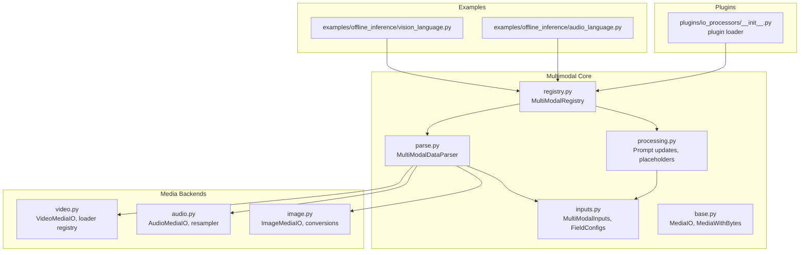
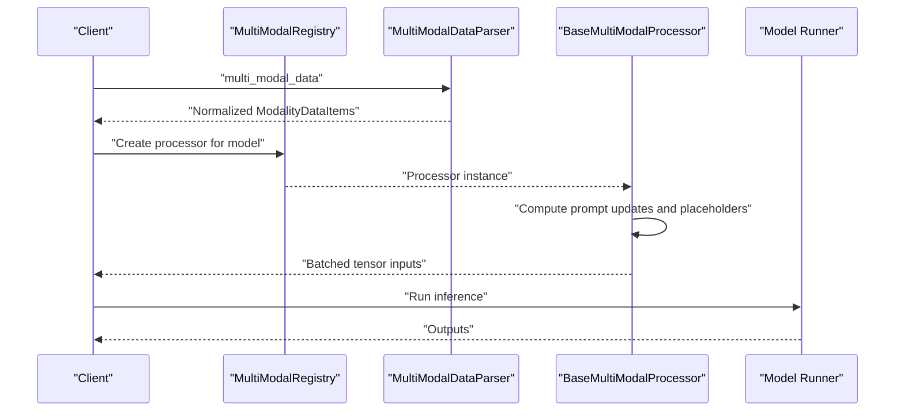
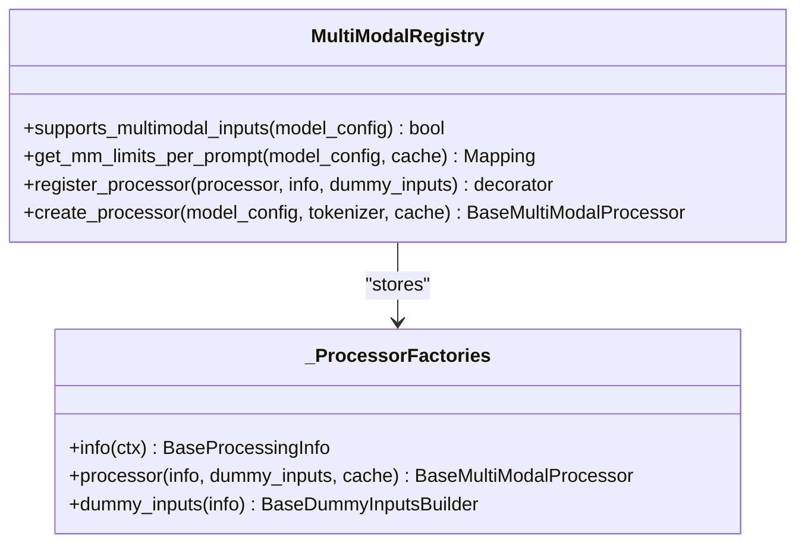
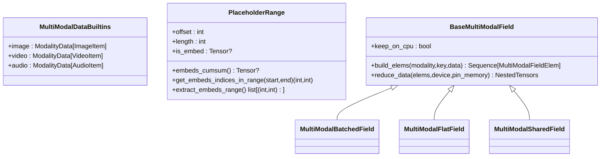
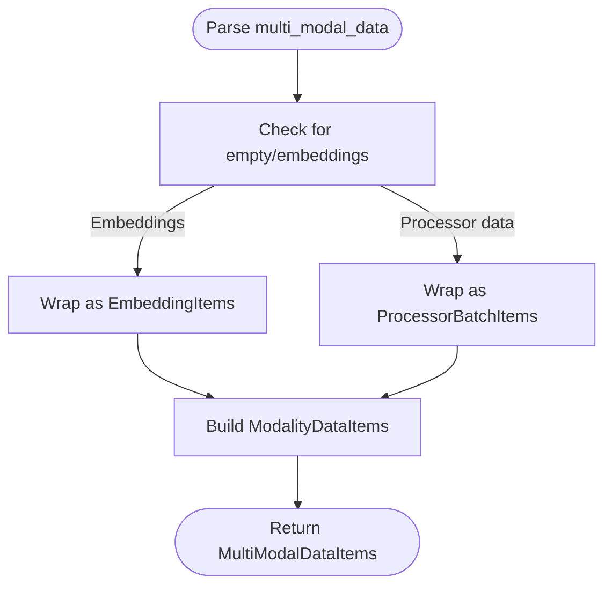
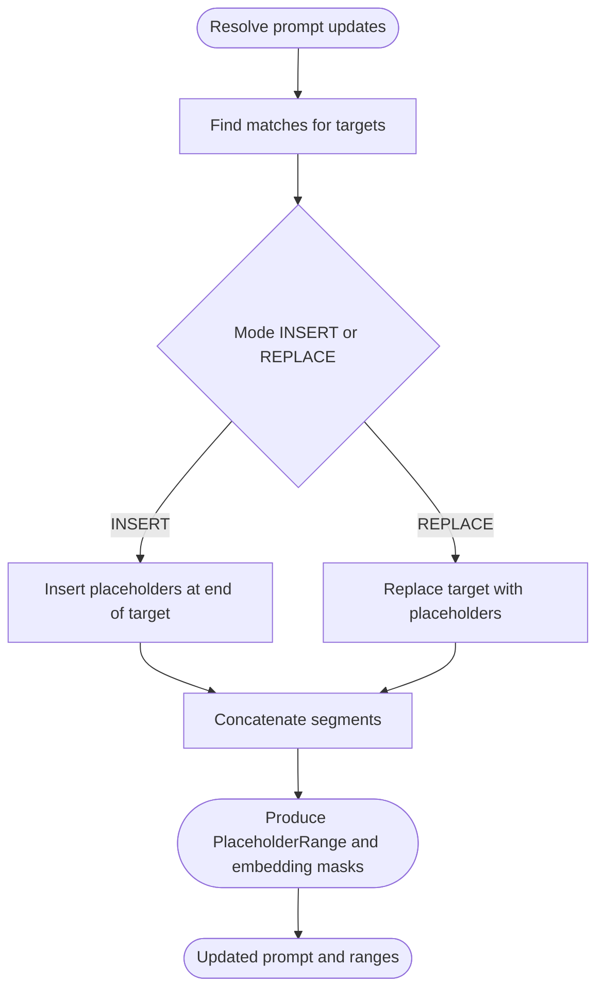
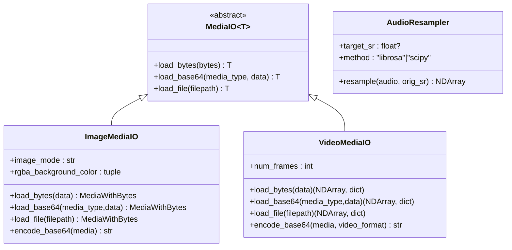
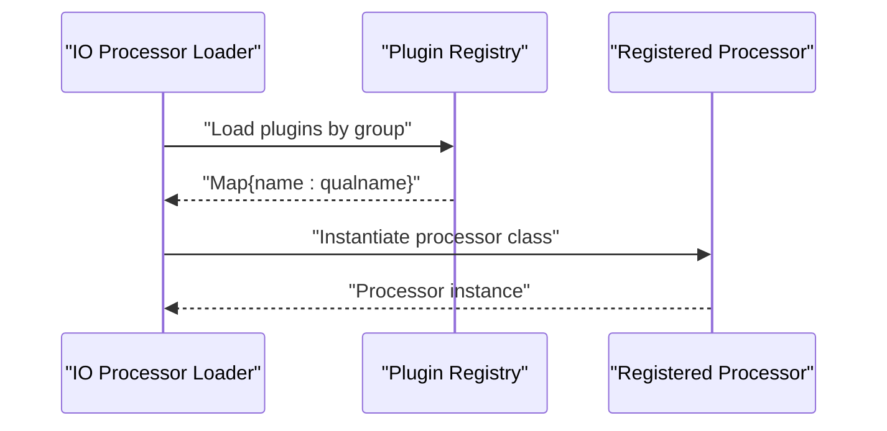
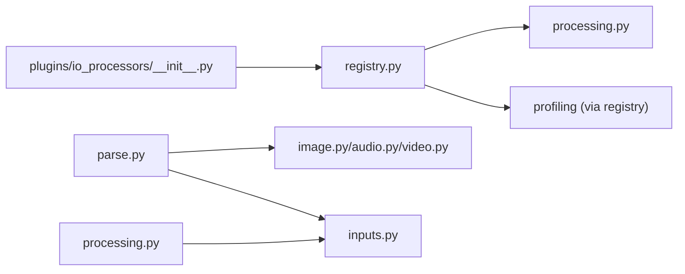

# Custom Modality Integration

<cite>
**Referenced Files in This Document**
- [multimodal/__init__.py](file://vllm/multimodal/__init__.py)
- [multimodal/registry.py](file://vllm/multimodal/registry.py)
- [multimodal/inputs.py](file://vllm/multimodal/inputs.py)
- [multimodal/processing.py](file://vllm/multimodal/processing.py)
- [multimodal/parse.py](file://vllm/multimodal/parse.py)
- [multimodal/base.py](file://vllm/multimodal/base.py)
- [multimodal/image.py](file://vllm/multimodal/image.py)
- [multimodal/audio.py](file://vllm/multimodal/audio.py)
- [multimodal/video.py](file://vllm/multimodal/video.py)
- [plugins/io_processors/__init__.py](file://vllm/plugins/io_processors/__init__.py)
- [vision_language.py](file://examples/offline_inference/vision_language.py)
- [audio_language.py](file://examples/offline_inference/audio_language.py)
- [test_process_multi_modal_uuids.py](file://tests/v1/engine/test_process_multi_modal_uuids.py)
</cite>

## Table of Contents
1. [Introduction](#introduction)
2. [Project Structure](#project-structure)
3. [Core Components](#core-components)
4. [Architecture Overview](#architecture-overview)
5. [Detailed Component Analysis](#detailed-component-analysis)
6. [Dependency Analysis](#dependency-analysis)
7. [Performance Considerations](#performance-considerations)
8. [Troubleshooting Guide](#troubleshooting-guide)
9. [Conclusion](#conclusion)
10. [Appendices](#appendices)

## Introduction
This document explains how to integrate custom modalities into vLLM’s multimodal processing pipeline. It covers the multimodal framework, input registration, the MultiModalInputs interface, preprocessing customization, modality-specific token placement strategies, the modality registry, custom processor development, and integration with existing multimodal models. Practical examples demonstrate creating custom modalities, building preprocessing workflows, and integrating with models. Extensibility patterns, performance optimization, and compatibility best practices are included.

## Project Structure
The multimodal subsystem is organized around:
- Registry and orchestration: defines how models claim and use processors
- Inputs and data models: typed containers for multi-modal data and field batching
- Parsing and normalization: transforms raw inputs into standardized items
- Processing and prompt updates: inserts placeholders and manages token placement
- Media I/O and utilities: loading, encoding, and transformations for images, audio, and video
- Plugins: IO processor plugin discovery and activation

**Diagram sources**
- [multimodal/registry.py](file://vllm/multimodal/registry.py#L91-L211)
- [multimodal/inputs.py](file://vllm/multimodal/inputs.py#L320-L800)
- [multimodal/parse.py](file://vllm/multimodal/parse.py#L358-L566)
- [multimodal/processing.py](file://vllm/multimodal/processing.py#L290-L800)
- [multimodal/base.py](file://vllm/multimodal/base.py#L1-L57)
- [multimodal/image.py](file://vllm/multimodal/image.py#L1-L143)
- [multimodal/audio.py](file://vllm/multimodal/audio.py#L1-L148)
- [multimodal/video.py](file://vllm/multimodal/video.py#L1-L341)
- [plugins/io_processors/__init__.py](file://vllm/plugins/io_processors/__init__.py#L36-L68)
- [vision_language.py](file://examples/offline_inference/vision_language.py#L1-L200)
- [audio_language.py](file://examples/offline_inference/audio_language.py#L1-L120)

**Section sources**
- [multimodal/__init__.py](file://vllm/multimodal/__init__.py#L1-L41)
- [multimodal/registry.py](file://vllm/multimodal/registry.py#L91-L211)
- [multimodal/inputs.py](file://vllm/multimodal/inputs.py#L1-L200)
- [multimodal/parse.py](file://vllm/multimodal/parse.py#L1-L120)
- [multimodal/processing.py](file://vllm/multimodal/processing.py#L1-L120)
- [multimodal/base.py](file://vllm/multimodal/base.py#L1-L57)
- [multimodal/image.py](file://vllm/multimodal/image.py#L1-L80)
- [multimodal/audio.py](file://vllm/multimodal/audio.py#L1-L80)
- [multimodal/video.py](file://vllm/multimodal/video.py#L1-L80)
- [plugins/io_processors/__init__.py](file://vllm/plugins/io_processors/__init__.py#L36-L68)
- [vision_language.py](file://examples/offline_inference/vision_language.py#L1-L120)
- [audio_language.py](file://examples/offline_inference/audio_language.py#L1-L120)

## Core Components
- MultiModalRegistry: Registers model-specific processors and exposes capabilities like per-prompt limits and dummy data generation for profiling.
- MultiModalInputs and field configs: Define how multi-modal data is represented and batched across requests.
- MultiModalDataParser: Normalizes raw inputs into standardized items (images, audio, video, embeddings).
- Processing utilities: Manage prompt placeholder insertion/replacement and token placement strategies.
- Media I/O: Encoders/decoders and loaders for images, audio, and videos; optional embedding passthrough.
- Plugin system: Loads IO processor plugins to activate model-specific processing.

Key responsibilities:
- Registry: binds model classes to processor factories and validates multimodal support.
- Inputs: Provides MultiModalDataBuiltins, MultiModalUUIDDict, PlaceholderRange, and field batching helpers.
- Parse: Converts user-provided multi_modal_data into ModalityDataItems and handles embeddings vs. processor-backed data.
- Processing: Implements PromptInsertion/PromptReplacement and resolves placeholder ranges for embedding assignment.
- Media I/O: Handles loading, conversion, resampling, and encoding/decoding for media types.

**Section sources**
- [multimodal/registry.py](file://vllm/multimodal/registry.py#L91-L211)
- [multimodal/inputs.py](file://vllm/multimodal/inputs.py#L110-L220)
- [multimodal/parse.py](file://vllm/multimodal/parse.py#L358-L566)
- [multimodal/processing.py](file://vllm/multimodal/processing.py#L290-L490)
- [multimodal/base.py](file://vllm/multimodal/base.py#L1-L57)
- [multimodal/image.py](file://vllm/multimodal/image.py#L1-L143)
- [multimodal/audio.py](file://vllm/multimodal/audio.py#L1-L148)
- [multimodal/video.py](file://vllm/multimodal/video.py#L1-L341)

## Architecture Overview
The multimodal pipeline integrates user inputs with model-specific processors through a registry-driven mechanism. The flow:
1. User supplies multi_modal_data and optional multi_modal_uuids.
2. Parser normalizes inputs into ModalityDataItems.
3. Registry creates a processor for the target model.
4. Processor computes prompt updates and placeholder ranges.
5. Inputs are batched and prepared for model execution.

**Diagram sources**
- [multimodal/registry.py](file://vllm/multimodal/registry.py#L252-L304)
- [multimodal/parse.py](file://vllm/multimodal/parse.py#L553-L566)
- [multimodal/processing.py](file://vllm/multimodal/processing.py#L748-L800)
- [multimodal/inputs.py](file://vllm/multimodal/inputs.py#L320-L520)

## Detailed Component Analysis

### MultiModalRegistry and Processor Registration
- Supports multimodal detection and per-prompt limits.
- Lazily constructs processors via registered factories.
- Exposes profiling helpers for decoder/encoder dummy data.

Implementation highlights:
- supports_multimodal_inputs checks model capability and configured limits.
- get_mm_limits_per_prompt queries processor limits for scheduling.
- register_processor decorates model classes to attach processor factories.

**Diagram sources**
- [multimodal/registry.py](file://vllm/multimodal/registry.py#L91-L211)
- [multimodal/registry.py](file://vllm/multimodal/registry.py#L223-L304)

**Section sources**
- [multimodal/registry.py](file://vllm/multimodal/registry.py#L91-L211)
- [multimodal/registry.py](file://vllm/multimodal/registry.py#L223-L304)

### MultiModalInputs and Field Batching
- MultiModalDataBuiltins defines built-in modalities (image, video, audio).
- MultiModalUUIDDict allows user-provided identifiers for caching.
- PlaceholderRange tracks placeholder offsets and embedding masks.
- Field configs define how to split/merge tensors across batches:
  - batched: index into first dimension
  - flat/flat_from_sizes: slice along a dimension
  - shared: replicate data across batch items

**Diagram sources**
- [multimodal/inputs.py](file://vllm/multimodal/inputs.py#L110-L220)
- [multimodal/inputs.py](file://vllm/multimodal/inputs.py#L320-L520)
- [multimodal/inputs.py](file://vllm/multimodal/inputs.py#L520-L800)

**Section sources**
- [multimodal/inputs.py](file://vllm/multimodal/inputs.py#L110-L220)
- [multimodal/inputs.py](file://vllm/multimodal/inputs.py#L320-L520)
- [multimodal/inputs.py](file://vllm/multimodal/inputs.py#L520-L800)

### Parsing Pipeline and Custom Modalities
- MultiModalDataParser converts raw inputs into ModalityDataItems:
  - Audio: resampling, embeddings, or processor-ready arrays
  - Image: PIL, arrays, tensors, or embeddings
  - Video: frames, metadata, or embeddings
- EmbeddingItems and DictEmbeddingItems support direct tensor passthrough for embeddings.
- MediaWithBytes preserves original bytes to prevent cache corruption.

**Diagram sources**
- [multimodal/parse.py](file://vllm/multimodal/parse.py#L358-L566)
- [multimodal/base.py](file://vllm/multimodal/base.py#L1-L57)

**Section sources**
- [multimodal/parse.py](file://vllm/multimodal/parse.py#L358-L566)
- [multimodal/base.py](file://vllm/multimodal/base.py#L1-L57)

### Prompt Updates and Token Placement Strategies
- PromptInsertion and PromptReplacement define how placeholders are inserted or replaced.
- PlaceholderFeaturesInfo and PlaceholderRange capture placeholder spans and embedding masks.
- ResolvedPromptUpdate iterates matches and applies updates respecting mode and overlap.

**Diagram sources**
- [multimodal/processing.py](file://vllm/multimodal/processing.py#L290-L490)
- [multimodal/processing.py](file://vllm/multimodal/processing.py#L693-L800)

**Section sources**
- [multimodal/processing.py](file://vllm/multimodal/processing.py#L290-L490)
- [multimodal/processing.py](file://vllm/multimodal/processing.py#L693-L800)

### Media I/O Utilities
- ImageMediaIO: loads from bytes/base64/file, converts modes, encodes to base64.
- AudioResampler: resamples audio using librosa or scipy.
- VideoMediaIO: loads frames via pluggable backends (e.g., OpenCV), supports dynamic sampling.

**Diagram sources**
- [multimodal/base.py](file://vllm/multimodal/base.py#L1-L57)
- [multimodal/image.py](file://vllm/multimodal/image.py#L1-L143)
- [multimodal/audio.py](file://vllm/multimodal/audio.py#L1-L148)
- [multimodal/video.py](file://vllm/multimodal/video.py#L1-L341)

**Section sources**
- [multimodal/image.py](file://vllm/multimodal/image.py#L1-L143)
- [multimodal/audio.py](file://vllm/multimodal/audio.py#L1-L148)
- [multimodal/video.py](file://vllm/multimodal/video.py#L1-L341)

### Plugin System for IO Processors
- The plugin loader discovers and activates IO processor plugins by model requirement.
- Validates presence and compatibility of required plugin.

**Diagram sources**
- [plugins/io_processors/__init__.py](file://vllm/plugins/io_processors/__init__.py#L36-L68)

**Section sources**
- [plugins/io_processors/__init__.py](file://vllm/plugins/io_processors/__init__.py#L36-L68)

### Practical Examples: Creating Custom Modalities
- Vision-language examples show how prompts and placeholders are constructed for images and videos.
- Audio-language examples demonstrate audio placeholders and multi-modal batching.

Patterns to follow:
- Define placeholders in prompts for your modality.
- Configure limit_mm_per_prompt to constrain inputs per prompt.
- Supply multi_modal_data with your modality keys and appropriate items.
- Optionally supply multi_modal_uuids for deterministic caching.

**Section sources**
- [vision_language.py](file://examples/offline_inference/vision_language.py#L1-L200)
- [audio_language.py](file://examples/offline_inference/audio_language.py#L1-L120)

## Dependency Analysis
The multimodal subsystem exhibits low coupling and high cohesion:
- Registry depends on processing info and dummy builders to construct processors.
- Parser depends on media I/O and inputs to normalize data.
- Processing depends on tokenizer-like interfaces and inputs to manage placeholders.
- Plugins decouple model-specific processors from core logic.

**Diagram sources**
- [multimodal/registry.py](file://vllm/multimodal/registry.py#L252-L304)
- [multimodal/parse.py](file://vllm/multimodal/parse.py#L358-L566)
- [multimodal/processing.py](file://vllm/multimodal/processing.py#L1-L120)
- [plugins/io_processors/__init__.py](file://vllm/plugins/io_processors/__init__.py#L36-L68)

**Section sources**
- [multimodal/registry.py](file://vllm/multimodal/registry.py#L252-L304)
- [multimodal/parse.py](file://vllm/multimodal/parse.py#L358-L566)
- [multimodal/processing.py](file://vllm/multimodal/processing.py#L1-L120)
- [plugins/io_processors/__init__.py](file://vllm/plugins/io_processors/__init__.py#L36-L68)

## Performance Considerations
- Prefer embedding passthrough for large or already-encoded modalities to avoid heavy preprocessing.
- Use flat_from_sizes batching to minimize concatenation overhead when item sizes vary.
- Keep keep_on_cpu fields only when necessary; moving tensors to accelerators reduces host-device transfers.
- Limit per-prompt counts to control memory footprint and reduce cache pressure.
- Leverage video/audio resampling and frame sampling to reduce compute and memory usage.

[No sources needed since this section provides general guidance]

## Troubleshooting Guide
Common issues and resolutions:
- Missing modality UUIDs: Ensure multi_modal_uuids includes entries for all provided modalities; otherwise, errors are raised during input processing.
- Unsupported modality: MultiModalDataParser raises errors for unknown modalities; confirm your keys match supported types.
- Video metadata requirements: Some parsers require metadata; ensure metadata is supplied when needed.
- IO processor plugin not found: The plugin loader enforces availability of the required plugin; install or configure the correct plugin.

**Section sources**
- [test_process_multi_modal_uuids.py](file://tests/v1/engine/test_process_multi_modal_uuids.py#L88-L159)
- [multimodal/parse.py](file://vllm/multimodal/parse.py#L526-L565)
- [plugins/io_processors/__init__.py](file://vllm/plugins/io_processors/__init__.py#L36-L68)

## Conclusion
vLLM’s multimodal framework provides a robust, extensible foundation for integrating custom modalities. By leveraging the registry, inputs, parsing, and processing utilities, developers can implement custom processors, define token placement strategies, and integrate seamlessly with existing models. Following the patterns and best practices outlined here ensures compatibility, performance, and maintainability within the vLLM ecosystem.

[No sources needed since this section summarizes without analyzing specific files]

## Appendices

### Extensibility Patterns for Custom Modalities
- Define a new modality key and supporting data types in MultiModalDataBuiltins.
- Implement a MediaIO subclass for loading/encoding your media type.
- Extend MultiModalDataParser to recognize and normalize your modality.
- Implement a processor that computes prompt updates and placeholder ranges.
- Register the processor with MultiModalRegistry for your model class.
- Provide dummy inputs builder and processing info for profiling.

**Section sources**
- [multimodal/inputs.py](file://vllm/multimodal/inputs.py#L110-L220)
- [multimodal/base.py](file://vllm/multimodal/base.py#L1-L57)
- [multimodal/parse.py](file://vllm/multimodal/parse.py#L358-L566)
- [multimodal/processing.py](file://vllm/multimodal/processing.py#L290-L490)
- [multimodal/registry.py](file://vllm/multimodal/registry.py#L190-L211)