# Multimodal Support

<cite>
**Referenced Files in This Document**
- [multimodal_inputs.md](file://docs/features/multimodal_inputs.md)
- [multimodal/__init__.py](file://vllm/multimodal/__init__.py)
- [multimodal/base.py](file://vllm/multimodal/base.py)
- [multimodal/inputs.py](file://vllm/multimodal/inputs.py)
- [multimodal/processing.py](file://vllm/multimodal/processing.py)
- [multimodal/registry.py](file://vllm/multimodal/registry.py)
- [multimodal/image.py](file://vllm/multimodal/image.py)
- [multimodal/audio.py](file://vllm/multimodal/audio.py)
- [multimodal/video.py](file://vllm/multimodal/video.py)
- [gemma3n_mm.py](file://vllm/model_executor/models/gemma3n_mm.py)
- [internvl.py](file://vllm/model_executor/models/internvl.py)
- [audioflamingo3.py](file://vllm/model_executor/models/audioflamingo3.py)
- [qwen3_omni_moe_thinker.py](file://vllm/model_executor/models/qwen3_omni_moe_thinker.py)
- [vision_language.py](file://examples/offline_inference/vision_language.py)
- [audio_language.py](file://examples/offline_inference/audio_language.py)
- [vision_language_multi_image.py](file://examples/offline_inference/vision_language_multi_image.py)
- [only_thinker.py](file://examples/offline_inference/qwen3_omni/only_thinker.py)
</cite>

## Table of Contents
1. [Introduction](#introduction)
2. [Project Structure](#project-structure)
3. [Core Components](#core-components)
4. [Architecture Overview](#architecture-overview)
5. [Detailed Component Analysis](#detailed-component-analysis)
6. [Dependency Analysis](#dependency-analysis)
7. [Performance Considerations](#performance-considerations)
8. [Troubleshooting Guide](#troubleshooting-guide)
9. [Conclusion](#conclusion)
10. [Appendices](#appendices)

## Introduction
This document explains vLLM’s multimodal capabilities across vision-language, audio-language, and video understanding. It covers the multimodal architecture, input processing pipelines, modality-specific optimizations, supported model families, preprocessing workflows, and integration patterns. It also details how multimodal inputs are handled, memory management for complex inputs, and performance optimization strategies, with practical examples for multimodal inference and integration with external processing systems.

## Project Structure
The multimodal subsystem is organized around a registry-driven processor pipeline, typed input abstractions, and modality-specific IO utilities. The high-level structure:
- Registry and dispatcher for model-specific multimodal processors
- Typed input containers and batching helpers
- Prompt update and placeholder insertion/replacement logic
- Modality IO: image, audio, video, and embedding loaders
- Model-side embedding composition for vision, audio, and video
- Examples for multimodal inference across vision-language, audio-language, and multi-image scenarios

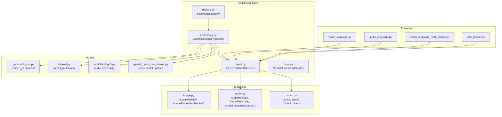

**Diagram sources**
- [multimodal/registry.py](file://vllm/multimodal/registry.py#L91-L171)
- [multimodal/processing.py](file://vllm/multimodal/processing.py#L1-L120)
- [multimodal/inputs.py](file://vllm/multimodal/inputs.py#L1-L120)
- [multimodal/base.py](file://vllm/multimodal/base.py#L1-L57)
- [multimodal/image.py](file://vllm/multimodal/image.py#L1-L143)
- [multimodal/audio.py](file://vllm/multimodal/audio.py#L1-L148)
- [multimodal/video.py](file://vllm/multimodal/video.py#L1-L120)
- [gemma3n_mm.py](file://vllm/model_executor/models/gemma3n_mm.py#L644-L664)
- [internvl.py](file://vllm/model_executor/models/internvl.py#L1331-L1364)
- [audioflamingo3.py](file://vllm/model_executor/models/audioflamingo3.py#L561-L592)
- [qwen3_omni_moe_thinker.py](file://vllm/model_executor/models/qwen3_omni_moe_thinker.py#L877-L960)
- [vision_language.py](file://examples/offline_inference/vision_language.py#L1-L120)
- [audio_language.py](file://examples/offline_inference/audio_language.py#L1-L120)
- [vision_language_multi_image.py](file://examples/offline_inference/vision_language_multi_image.py#L1-L120)
- [only_thinker.py](file://examples/offline_inference/qwen3_omni/only_thinker.py#L34-L87)

**Section sources**
- [multimodal/registry.py](file://vllm/multimodal/registry.py#L91-L171)
- [multimodal/processing.py](file://vllm/multimodal/processing.py#L1-L120)
- [multimodal/inputs.py](file://vllm/multimodal/inputs.py#L1-L120)
- [multimodal/image.py](file://vllm/multimodal/image.py#L1-L143)
- [multimodal/audio.py](file://vllm/multimodal/audio.py#L1-L148)
- [multimodal/video.py](file://vllm/multimodal/video.py#L1-L120)

## Core Components
- Registry and dispatcher: The registry inspects model configuration, determines supported modalities, and constructs a processor tailored to the model. It also exposes profiling helpers for encoder/decoder memory limits and maximum tokens per item.
- Typed inputs and batching: The inputs module defines multimodal data types, placeholder ranges, and field configs for batched/flat/shared data layouts. It supports embedding inputs and nested tensor comparisons for equality checks.
- Prompt updates: The processing module defines prompt insertion and replacement semantics, allowing models to inject placeholders for each modality item and control embedding assignment masks.
- Modality IO: Dedicated loaders for images (including RGBA-to-RGB conversion), audio (resampling and base64 encoding), and video (frame sampling and backend selection). Embedding loaders support dense tensors with integrity checks.
- Model-side embedding composition: Models implement multimodal embedding composition, iterating over parsed modalities and producing ordered embeddings for vision, audio, and video.

**Section sources**
- [multimodal/registry.py](file://vllm/multimodal/registry.py#L91-L171)
- [multimodal/inputs.py](file://vllm/multimodal/inputs.py#L1-L220)
- [multimodal/processing.py](file://vllm/multimodal/processing.py#L285-L490)
- [multimodal/image.py](file://vllm/multimodal/image.py#L1-L143)
- [multimodal/audio.py](file://vllm/multimodal/audio.py#L1-L148)
- [multimodal/video.py](file://vllm/multimodal/video.py#L1-L120)
- [gemma3n_mm.py](file://vllm/model_executor/models/gemma3n_mm.py#L644-L664)
- [internvl.py](file://vllm/model_executor/models/internvl.py#L1331-L1364)

## Architecture Overview
The multimodal pipeline begins with user-provided prompts and multi-modal data. The registry selects a processor for the target model, which parses inputs, applies prompt updates, and batches modality-specific tensors. The model composes multimodal embeddings and integrates them into the language model forward pass.

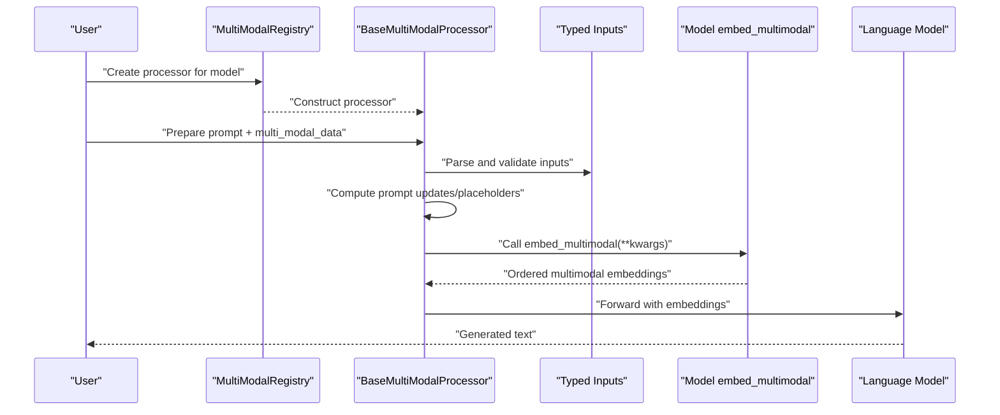

**Diagram sources**
- [multimodal/registry.py](file://vllm/multimodal/registry.py#L252-L271)
- [multimodal/processing.py](file://vllm/multimodal/processing.py#L748-L800)
- [multimodal/inputs.py](file://vllm/multimodal/inputs.py#L320-L420)
- [gemma3n_mm.py](file://vllm/model_executor/models/gemma3n_mm.py#L644-L664)
- [internvl.py](file://vllm/model_executor/models/internvl.py#L1331-L1364)

## Detailed Component Analysis

### Multimodal Registry and Processor Construction
- Determines whether a model supports multimodal inputs and enforces per-prompt limits.
- Builds a processor lazily using factories for processing info, dummy inputs builder, and the processor itself.
- Provides profiling helpers to estimate maximum tokens per item and encoder/decoder memory usage.

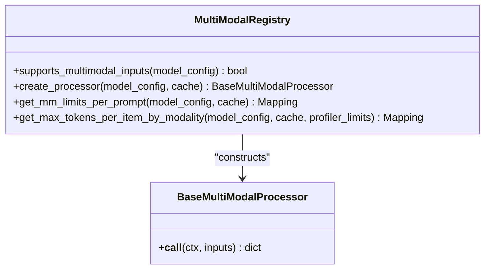

**Diagram sources**
- [multimodal/registry.py](file://vllm/multimodal/registry.py#L91-L171)
- [multimodal/registry.py](file://vllm/multimodal/registry.py#L252-L271)

**Section sources**
- [multimodal/registry.py](file://vllm/multimodal/registry.py#L91-L171)
- [multimodal/registry.py](file://vllm/multimodal/registry.py#L252-L271)

### Typed Inputs, Placeholders, and Batching
- Defines built-in modalities (image, video, audio) and embedding inputs.
- Encodes placeholder ranges and supports embedding assignment masks for selective embedding application.
- Provides field configurations for batched, flat, and shared data layouts to optimize tensor concatenation and stacking.

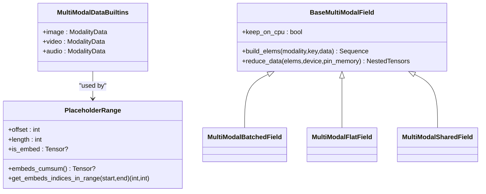

**Diagram sources**
- [multimodal/inputs.py](file://vllm/multimodal/inputs.py#L110-L220)
- [multimodal/inputs.py](file://vllm/multimodal/inputs.py#L320-L420)
- [multimodal/inputs.py](file://vllm/multimodal/inputs.py#L492-L800)

**Section sources**
- [multimodal/inputs.py](file://vllm/multimodal/inputs.py#L110-L220)
- [multimodal/inputs.py](file://vllm/multimodal/inputs.py#L320-L420)
- [multimodal/inputs.py](file://vllm/multimodal/inputs.py#L492-L800)

### Prompt Updates and Cross-Modal Positioning
- Supports inserting or replacing placeholders in prompts for each modality item.
- Enables selective embedding assignment via masks and computes embedding ranges within placeholder segments.
- Provides utilities to resolve targets and content for prompt updates.

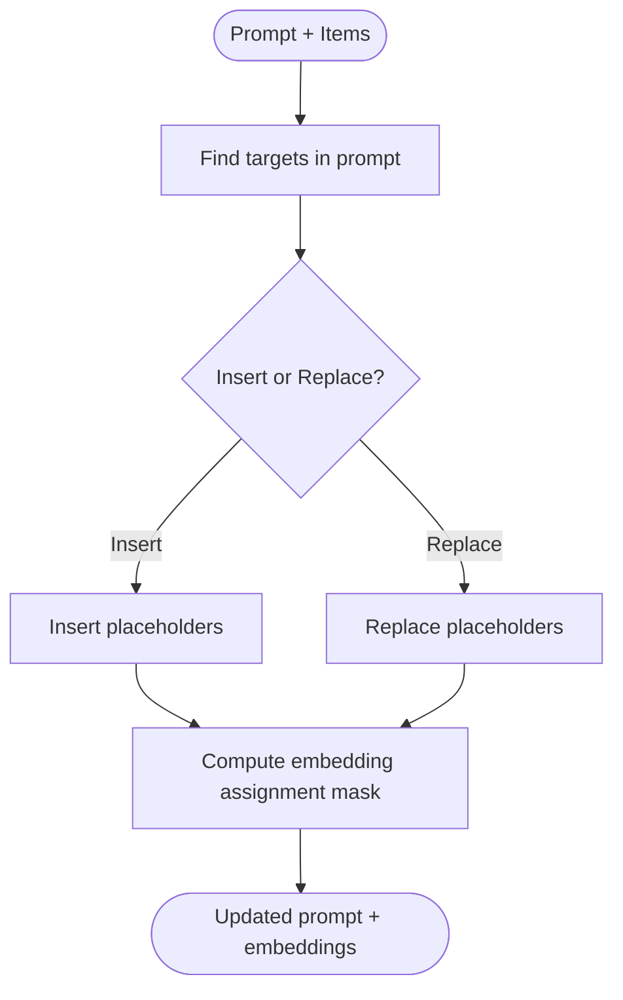

**Diagram sources**
- [multimodal/processing.py](file://vllm/multimodal/processing.py#L285-L490)
- [multimodal/processing.py](file://vllm/multimodal/processing.py#L748-L800)

**Section sources**
- [multimodal/processing.py](file://vllm/multimodal/processing.py#L285-L490)
- [multimodal/processing.py](file://vllm/multimodal/processing.py#L748-L800)

### Modality-Specific IO and Preprocessing
- Image: Loads from bytes/base64/file, converts RGBA to RGB with customizable background color, and supports embedding IO with integrity checks.
- Audio: Loads audio arrays and sampling rates, resamples via librosa or scipy, and supports embedding IO.
- Video: Loads frames via OpenCV backends, samples frames uniformly or dynamically, resizes, and attaches metadata for downstream processors.

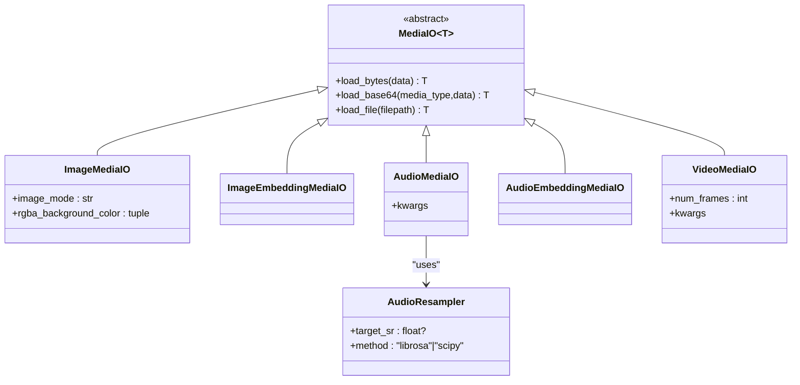

**Diagram sources**
- [multimodal/base.py](file://vllm/multimodal/base.py#L1-L57)
- [multimodal/image.py](file://vllm/multimodal/image.py#L1-L143)
- [multimodal/audio.py](file://vllm/multimodal/audio.py#L1-L148)
- [multimodal/video.py](file://vllm/multimodal/video.py#L1-L120)

**Section sources**
- [multimodal/image.py](file://vllm/multimodal/image.py#L1-L143)
- [multimodal/audio.py](file://vllm/multimodal/audio.py#L1-L148)
- [multimodal/video.py](file://vllm/multimodal/video.py#L1-L120)

### Model-Side Embedding Composition
- Vision-language models implement multimodal embedding composition by parsing validated inputs and iterating over modalities to produce ordered embeddings.
- Some models support both images and audio, or integrate audio into video understanding.

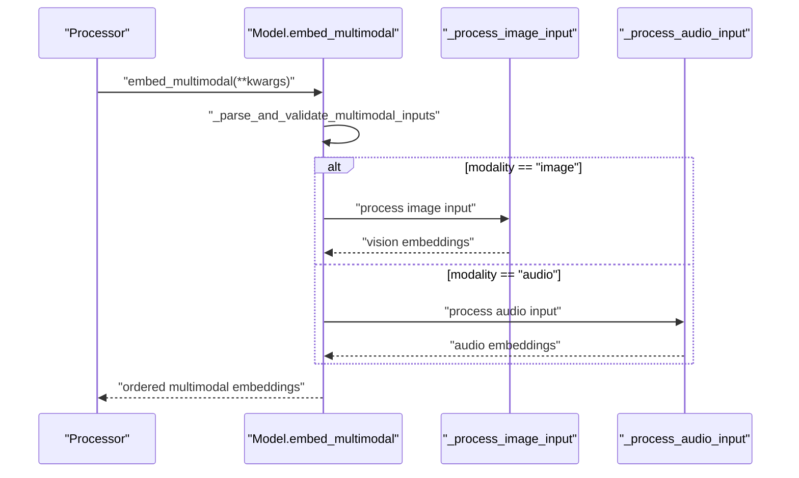

**Diagram sources**
- [gemma3n_mm.py](file://vllm/model_executor/models/gemma3n_mm.py#L644-L664)
- [internvl.py](file://vllm/model_executor/models/internvl.py#L1331-L1364)

**Section sources**
- [gemma3n_mm.py](file://vllm/model_executor/models/gemma3n_mm.py#L644-L664)
- [internvl.py](file://vllm/model_executor/models/internvl.py#L1331-L1364)

### Cross-Modal Attention and Audio-in-Video
- Some models derive audio tokens from video sequences and interleave audio/video tokens for unified attention.
- The model composes audio and vision embeddings and marks positions accordingly for attention masking and positional encoding.

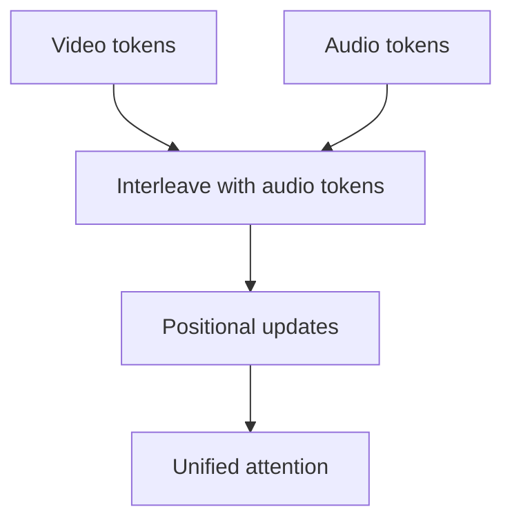

**Diagram sources**
- [qwen3_omni_moe_thinker.py](file://vllm/model_executor/models/qwen3_omni_moe_thinker.py#L877-L960)

**Section sources**
- [qwen3_omni_moe_thinker.py](file://vllm/model_executor/models/qwen3_omni_moe_thinker.py#L877-L960)

### Audio Processing Pipeline
- Audio inputs are provided as (array, sampling_rate) tuples or embeddings.
- Audio resampling uses librosa or scipy depending on configuration.
- AudioFlamingo3 demonstrates audio attention masking and projection into language model space.

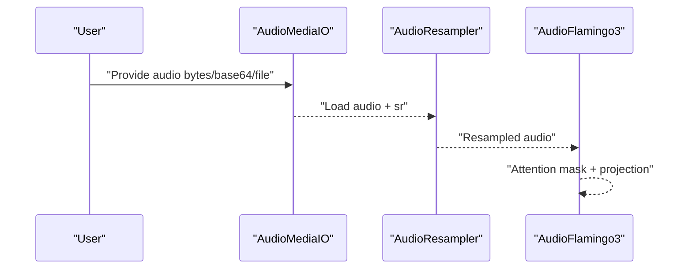

**Diagram sources**
- [audio.py](file://vllm/multimodal/audio.py#L1-L148)
- [audioflamingo3.py](file://vllm/model_executor/models/audioflamingo3.py#L561-L592)

**Section sources**
- [audio.py](file://vllm/multimodal/audio.py#L1-L148)
- [audioflamingo3.py](file://vllm/model_executor/models/audioflamingo3.py#L561-L592)

### Practical Examples and Integration Patterns
- Vision-language examples demonstrate multi-image inputs, chat templates, and model-specific prompt formats.
- Audio-language examples show audio transcription and multi-audio processing with LoRA and tokenizer templates.
- Multi-image examples illustrate applying chat templates and fetching images from URLs.

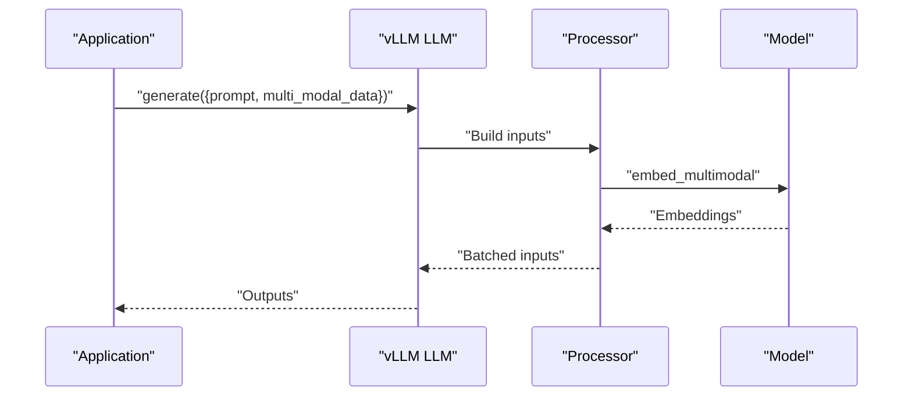

**Diagram sources**
- [vision_language.py](file://examples/offline_inference/vision_language.py#L1-L120)
- [audio_language.py](file://examples/offline_inference/audio_language.py#L1-L120)
- [vision_language_multi_image.py](file://examples/offline_inference/vision_language_multi_image.py#L1-L120)

**Section sources**
- [vision_language.py](file://examples/offline_inference/vision_language.py#L1-L120)
- [audio_language.py](file://examples/offline_inference/audio_language.py#L1-L120)
- [vision_language_multi_image.py](file://examples/offline_inference/vision_language_multi_image.py#L1-L120)
- [only_thinker.py](file://examples/offline_inference/qwen3_omni/only_thinker.py#L34-L87)

## Dependency Analysis
- Registry depends on model configuration and tokenizer to construct processors.
- Processor depends on typed inputs and prompt update logic.
- Modalities depend on MediaIO abstractions and environment settings (e.g., video loader backend).
- Models depend on multimodal embedding composition and tokenizer/token IDs for prompt construction.

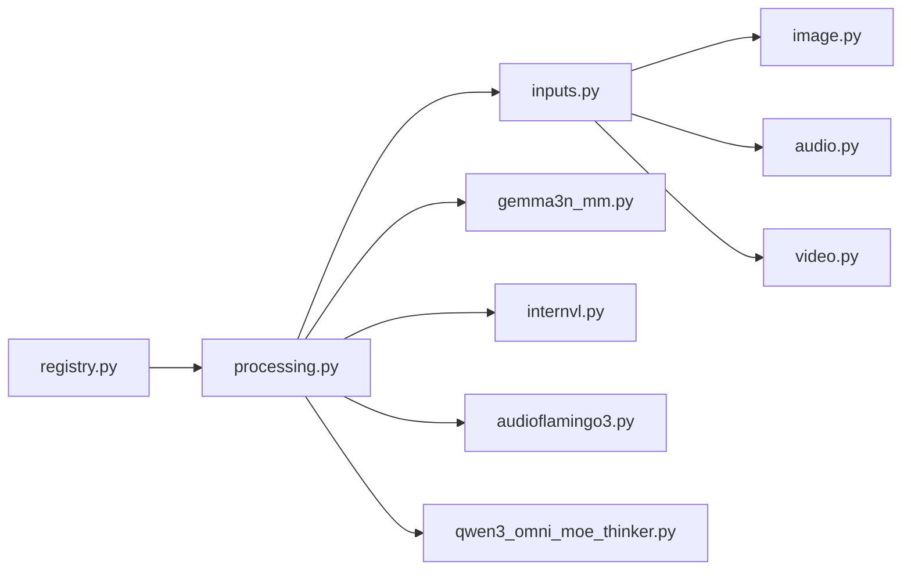

**Diagram sources**
- [multimodal/registry.py](file://vllm/multimodal/registry.py#L252-L271)
- [multimodal/processing.py](file://vllm/multimodal/processing.py#L748-L800)
- [multimodal/inputs.py](file://vllm/multimodal/inputs.py#L320-L420)
- [multimodal/image.py](file://vllm/multimodal/image.py#L1-L143)
- [multimodal/audio.py](file://vllm/multimodal/audio.py#L1-L148)
- [multimodal/video.py](file://vllm/multimodal/video.py#L1-L120)
- [gemma3n_mm.py](file://vllm/model_executor/models/gemma3n_mm.py#L644-L664)
- [internvl.py](file://vllm/model_executor/models/internvl.py#L1331-L1364)
- [audioflamingo3.py](file://vllm/model_executor/models/audioflamingo3.py#L561-L592)
- [qwen3_omni_moe_thinker.py](file://vllm/model_executor/models/qwen3_omni_moe_thinker.py#L877-L960)

**Section sources**
- [multimodal/registry.py](file://vllm/multimodal/registry.py#L252-L271)
- [multimodal/processing.py](file://vllm/multimodal/processing.py#L748-L800)
- [multimodal/inputs.py](file://vllm/multimodal/inputs.py#L320-L420)

## Performance Considerations
- Limit per-prompt counts for each modality to control memory footprint and token budget.
- Prefer embedding inputs when pre-computing encoders off-device to reduce repeated I/O and computation.
- Use batching helpers (batched/flat/shared fields) to minimize memory copies and improve throughput.
- For video, control frame sampling and backend selection to balance quality and speed.
- For audio, resample efficiently and avoid unnecessary conversions.
- Leverage profiling helpers to estimate encoder/decoder memory and adjust limits accordingly.

[No sources needed since this section provides general guidance]

## Troubleshooting Guide
- Image RGBA backgrounds: Set a custom background color via media IO kwargs to avoid unexpected transparency effects.
- Audio resampling errors: Ensure target sampling rate is configured; otherwise resampling is unsupported.
- Video loading warnings: Broken/unreadable frames are skipped; verify backend and file integrity.
- Embedding shapes: Incorrect embedding shapes can cause crashes; enable embedding inputs only for trusted environments.

**Section sources**
- [multimodal/image.py](file://vllm/multimodal/image.py#L26-L60)
- [multimodal/audio.py](file://vllm/multimodal/audio.py#L54-L88)
- [multimodal/video.py](file://vllm/multimodal/video.py#L67-L117)
- [multimodal/inputs.py](file://vllm/multimodal/inputs.py#L360-L420)

## Conclusion
vLLM’s multimodal stack provides a robust, extensible framework for vision-language, audio-language, and video understanding. Its registry-driven processors, typed inputs, and modality-specific IO utilities enable efficient preprocessing and embedding composition. With batching strategies, memory profiling, and practical examples, developers can integrate complex multi-modal workloads reliably and at scale.

[No sources needed since this section summarizes without analyzing specific files]

## Appendices

### Supported Modalities and Input Formats
- Built-in modalities: image, video, audio.
- Embedding inputs: tensors passed directly to the model for each modality.
- Placeholder ranges and embedding masks allow precise control over which positions receive multimodal embeddings.

**Section sources**
- [multimodal/inputs.py](file://vllm/multimodal/inputs.py#L110-L220)
- [multimodal/inputs.py](file://vllm/multimodal/inputs.py#L143-L220)

### Practical Example References
- Vision-language: [vision_language.py](file://examples/offline_inference/vision_language.py#L1-L120)
- Multi-image: [vision_language_multi_image.py](file://examples/offline_inference/vision_language_multi_image.py#L1-L120)
- Audio-language: [audio_language.py](file://examples/offline_inference/audio_language.py#L1-L120)
- Cross-modal (audio-in-video): [only_thinker.py](file://examples/offline_inference/qwen3_omni/only_thinker.py#L62-L87)

**Section sources**
- [vision_language.py](file://examples/offline_inference/vision_language.py#L1-L120)
- [vision_language_multi_image.py](file://examples/offline_inference/vision_language_multi_image.py#L1-L120)
- [audio_language.py](file://examples/offline_inference/audio_language.py#L1-L120)
- [only_thinker.py](file://examples/offline_inference/qwen3_omni/only_thinker.py#L62-L87)