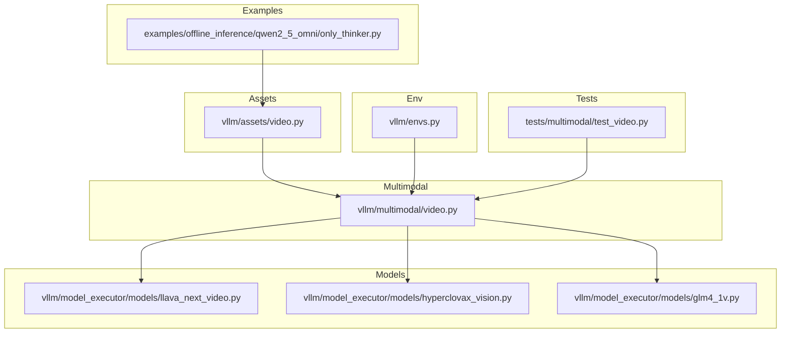
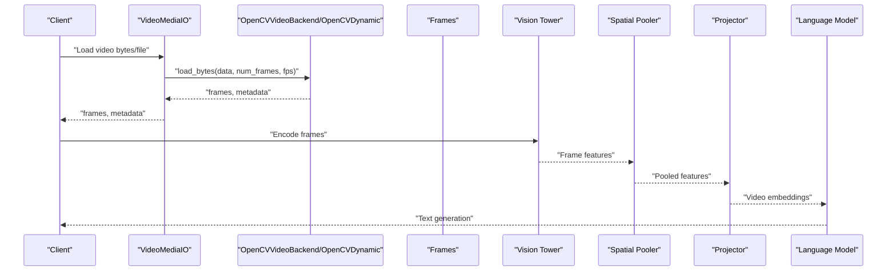
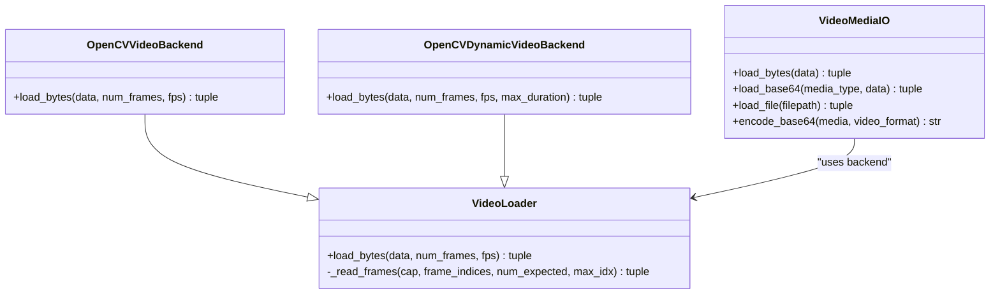
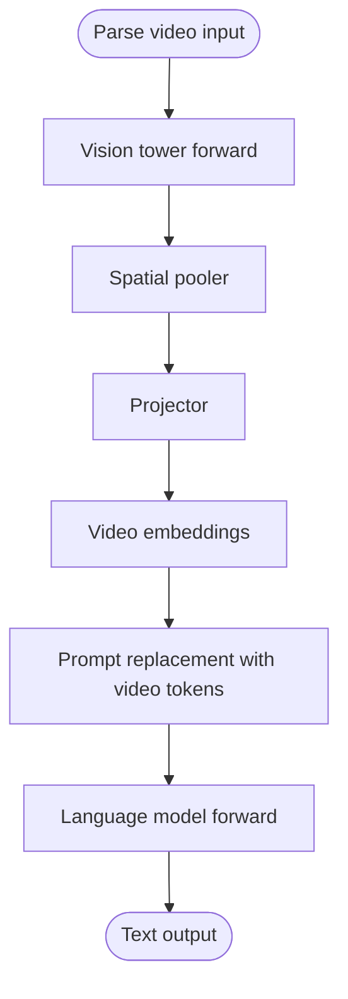
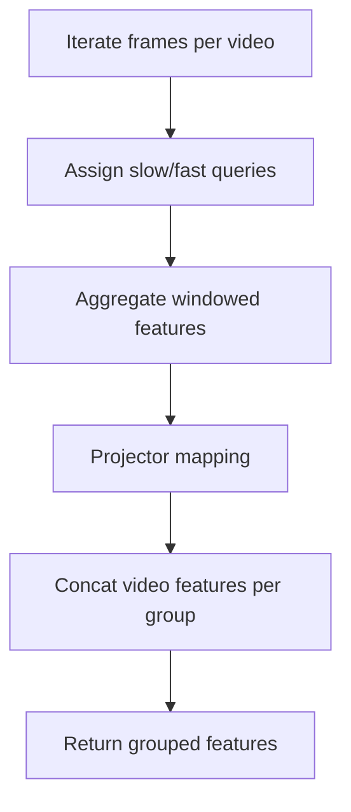
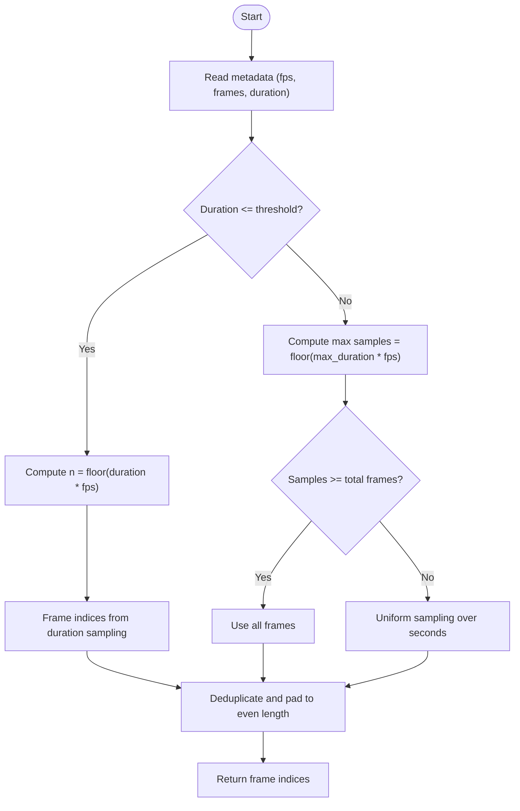
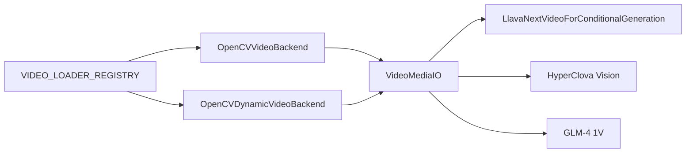

# Video Understanding

<cite>
**Referenced Files in This Document**
- [video.py](file://vllm/assets/video.py)
- [video.py](file://vllm/multimodal/video.py)
- [llava_next_video.py](file://vllm/model_executor/models/llava_next_video.py)
- [hyperclovax_vision.py](file://vllm/model_executor/models/hyperclovax_vision.py)
- [glm4_1v.py](file://vllm/model_executor/models/glm4_1v.py)
- [envs.py](file://vllm/envs.py)
- [test_video.py](file://tests/multimodal/test_video.py)
- [only_thinker.py](file://examples/offline_inference/qwen2_5_omni/only_thinker.py)
</cite>

## Table of Contents
1. [Introduction](#introduction)
2. [Project Structure](#project-structure)
3. [Core Components](#core-components)
4. [Architecture Overview](#architecture-overview)
5. [Detailed Component Analysis](#detailed-component-analysis)
6. [Dependency Analysis](#dependency-analysis)
7. [Performance Considerations](#performance-considerations)
8. [Troubleshooting Guide](#troubleshooting-guide)
9. [Conclusion](#conclusion)
10. [Appendices](#appendices)

## Introduction
This document explains video understanding capabilities in vLLM, focusing on how videos are ingested, processed, and understood by multimodal models. It covers video model architectures, frame extraction and sampling strategies, temporal modeling approaches, spatio-temporal feature processing, preprocessing pipelines, frame rate handling, motion analysis integration, supported formats, duration limitations, and memory optimization. Practical examples demonstrate video captioning, action recognition, and temporal question answering, along with performance considerations for GPU memory and optimization strategies across resolutions and frame rates.

## Project Structure
The video understanding stack spans several modules:
- Assets and utilities for video I/O and metadata
- Multimodal video loader and media I/O abstraction
- Model-specific processors and encoders for video understanding
- Environment configuration for video backends and timeouts
- Tests validating robustness and behavior
- Examples integrating video with audio-language models

**Diagram sources**
- [video.py](file://vllm/assets/video.py#L1-L150)
- [video.py](file://vllm/multimodal/video.py#L1-L341)
- [llava_next_video.py](file://vllm/model_executor/models/llava_next_video.py#L1-L466)
- [hyperclovax_vision.py](file://vllm/model_executor/models/hyperclovax_vision.py#L848-L904)
- [glm4_1v.py](file://vllm/model_executor/models/glm4_1v.py#L970-L1101)
- [envs.py](file://vllm/envs.py#L740-L790)
- [test_video.py](file://tests/multimodal/test_video.py#L1-L302)
- [only_thinker.py](file://examples/offline_inference/qwen2_5_omni/only_thinker.py#L1-L171)

**Section sources**
- [video.py](file://vllm/assets/video.py#L1-L150)
- [video.py](file://vllm/multimodal/video.py#L1-L341)
- [llava_next_video.py](file://vllm/model_executor/models/llava_next_video.py#L1-L466)
- [hyperclovax_vision.py](file://vllm/model_executor/models/hyperclovax_vision.py#L848-L904)
- [glm4_1v.py](file://vllm/model_executor/models/glm4_1v.py#L970-L1101)
- [envs.py](file://vllm/envs.py#L740-L790)
- [test_video.py](file://tests/multimodal/test_video.py#L1-L302)
- [only_thinker.py](file://examples/offline_inference/qwen2_5_omni/only_thinker.py#L1-L171)

## Core Components
- Video asset utilities: downloading example videos, converting to arrays/images, and extracting metadata (frame count, FPS, duration).
- Video loader and media I/O: pluggable backends (OpenCV), frame sampling, resizing, and encoding/decoding for base64-encoded video/jpeg.
- Model processors: LLaVA NeXT Video, HyperClova Vision, and GLM-4 1V integrate video frames into spatio-temporal embeddings and token placeholders.
- Environment configuration: backend selection, timeouts, and media connector settings.

Key responsibilities:
- Frame extraction and sampling: uniform temporal sampling and dynamic sampling based on duration and FPS thresholds.
- Temporal modeling: temporal patch sizes, frame index selection, and timestamp-aware grouping.
- Spatio-temporal feature processing: vision encoders, pooling, and projector mapping to text embedding space.
- Memory optimization: limiting frames per video, dynamic FPS selection, and backend-specific buffering.

**Section sources**
- [video.py](file://vllm/assets/video.py#L44-L106)
- [video.py](file://vllm/multimodal/video.py#L48-L117)
- [video.py](file://vllm/multimodal/video.py#L122-L196)
- [video.py](file://vllm/multimodal/video.py#L198-L268)
- [video.py](file://vllm/multimodal/video.py#L270-L341)
- [llava_next_video.py](file://vllm/model_executor/models/llava_next_video.py#L51-L120)
- [llava_next_video.py](file://vllm/model_executor/models/llava_next_video.py#L355-L429)
- [hyperclovax_vision.py](file://vllm/model_executor/models/hyperclovax_vision.py#L848-L904)
- [glm4_1v.py](file://vllm/model_executor/models/glm4_1v.py#L970-L1101)
- [envs.py](file://vllm/envs.py#L740-L790)

## Architecture Overview
The video pipeline integrates with multimodal model processors. The flow:
- Input video is decoded by a selected backend (OpenCV).
- Frames are sampled uniformly or dynamically based on duration/FPS constraints.
- Frames are resized and normalized, then passed to a vision encoder.
- Encoded features are pooled and projected into the language model’s embedding space.
- Tokens are inserted into prompts to represent video content.

**Diagram sources**
- [video.py](file://vllm/multimodal/video.py#L270-L341)
- [video.py](file://vllm/multimodal/video.py#L122-L196)
- [llava_next_video.py](file://vllm/model_executor/models/llava_next_video.py#L355-L429)

## Detailed Component Analysis

### Video Asset Utilities
- Provides helpers to read videos into NumPy arrays and PIL images, compute metadata (total frames, FPS, duration), and manage example assets.
- Ensures color space conversion to RGB for compatibility.

Practical use:
- Loading example videos for demos and tests.
- Generating metadata for downstream temporal sampling.

**Section sources**
- [video.py](file://vllm/assets/video.py#L44-L106)

### Video Loader and Media I/O
- Pluggable video loader registry supports multiple backends (e.g., OpenCV).
- Uniform sampling: linearly spaced frame indices.
- Dynamic sampling: adaptive frame selection constrained by duration and target FPS thresholds.
- Robustness: skips unreadable frames, logs warnings, and returns accurate metadata.
- Encoding/decoding: base64 video/jpeg encoding for multi-frame video inputs.

**Diagram sources**
- [video.py](file://vllm/multimodal/video.py#L58-L117)
- [video.py](file://vllm/multimodal/video.py#L122-L196)
- [video.py](file://vllm/multimodal/video.py#L198-L268)
- [video.py](file://vllm/multimodal/video.py#L270-L341)

**Section sources**
- [video.py](file://vllm/multimodal/video.py#L48-L117)
- [video.py](file://vllm/multimodal/video.py#L122-L196)
- [video.py](file://vllm/multimodal/video.py#L198-L268)
- [video.py](file://vllm/multimodal/video.py#L270-L341)

### LLaVA NeXT Video Processor
- Defines schema for pixel inputs (batch, frames, channels, height, width).
- Computes number of video tokens from spatial grid and number of frames.
- Builds dummy inputs for profiling and inserts placeholder tokens into prompts.
- Processes video pixels through a vision tower, spatial pooling, and a projector before language model forwarding.

**Diagram sources**
- [llava_next_video.py](file://vllm/model_executor/models/llava_next_video.py#L51-L120)
- [llava_next_video.py](file://vllm/model_executor/models/llava_next_video.py#L355-L429)

**Section sources**
- [llava_next_video.py](file://vllm/model_executor/models/llava_next_video.py#L51-L120)
- [llava_next_video.py](file://vllm/model_executor/models/llava_next_video.py#L355-L429)

### HyperClova Vision (SlowFast-style)
- Handles nested frame lists and groups features across frames.
- Uses separate “slow” and “fast” query abstractions per video segment.
- Aggregates features and projects them into the language model space.

**Diagram sources**
- [hyperclovax_vision.py](file://vllm/model_executor/models/hyperclovax_vision.py#L848-L904)

**Section sources**
- [hyperclovax_vision.py](file://vllm/model_executor/models/hyperclovax_vision.py#L848-L904)

### GLM-4 1V Temporal Sampling
- Implements dynamic FPS thresholds based on video duration.
- Selects frame indices either by duration-based sampling or uniform sampling depending on constraints.
- Produces timestamp-aligned indices and ensures even-length sequences.

**Diagram sources**
- [glm4_1v.py](file://vllm/model_executor/models/glm4_1v.py#L970-L1063)
- [glm4_1v.py](file://vllm/model_executor/models/glm4_1v.py#L1065-L1101)

**Section sources**
- [glm4_1v.py](file://vllm/model_executor/models/glm4_1v.py#L970-L1063)
- [glm4_1v.py](file://vllm/model_executor/models/glm4_1v.py#L1065-L1101)

### Environment Configuration
- Backend selection: VLLM_VIDEO_LOADER_BACKEND defaults to OpenCV; can be overridden per request.
- Timeouts: VLLM_VIDEO_FETCH_TIMEOUT controls fetch timeout for videos.
- Media connector: VLLM_MEDIA_CONNECTOR selects HTTP connector by default.

**Section sources**
- [envs.py](file://vllm/envs.py#L740-L790)

### Practical Examples
- Offline inference with Qwen2.5-Omni demonstrates mixed modalities (audio, image, video) and optional audio-in-video integration.
- Shows how to construct prompts with video placeholders and pass NumPy arrays as video inputs.

**Section sources**
- [only_thinker.py](file://examples/offline_inference/qwen2_5_omni/only_thinker.py#L1-L171)

## Dependency Analysis
- Backends and registries: VideoMediaIO selects a backend from VIDEO_LOADER_REGISTRY; OpenCVVideoBackend and OpenCVDynamicVideoBackend implement decoding and sampling.
- Model integration: LLaVA NeXT Video, HyperClova Vision, and GLM-4 1V consume frames and produce embeddings compatible with language models.
- Tests validate backend selection, frame skipping, and metadata consistency.

**Diagram sources**
- [video.py](file://vllm/multimodal/video.py#L119-L121)
- [video.py](file://vllm/multimodal/video.py#L122-L196)
- [video.py](file://vllm/multimodal/video.py#L198-L268)
- [llava_next_video.py](file://vllm/model_executor/models/llava_next_video.py#L296-L301)
- [hyperclovax_vision.py](file://vllm/model_executor/models/hyperclovax_vision.py#L848-L904)
- [glm4_1v.py](file://vllm/model_executor/models/glm4_1v.py#L970-L1101)

**Section sources**
- [video.py](file://vllm/multimodal/video.py#L119-L121)
- [video.py](file://vllm/multimodal/video.py#L122-L196)
- [video.py](file://vllm/multimodal/video.py#L198-L268)
- [llava_next_video.py](file://vllm/model_executor/models/llava_next_video.py#L296-L301)
- [hyperclovax_vision.py](file://vllm/model_executor/models/hyperclovax_vision.py#L848-L904)
- [glm4_1v.py](file://vllm/model_executor/models/glm4_1v.py#L970-L1101)

## Performance Considerations
- Frame sampling strategies:
  - Uniform sampling reduces computational load by selecting a fixed number of frames.
  - Dynamic sampling adapts to duration and FPS thresholds, bounding total frames.
- Spatial resizing:
  - Resizing frames reduces memory footprint; scaling factors can be tuned.
- Backend buffering:
  - OpenCV backend selection leverages buffered stream backends for efficient decoding.
- Memory optimization:
  - Limit frames per video via model-specific token budget calculations.
  - Prefer dynamic FPS to cap temporal resolution for long videos.
  - Use base64 video/jpeg encoding for multi-frame inputs to reduce overhead.

[No sources needed since this section provides general guidance]

## Troubleshooting Guide
Common issues and mitigations:
- Broken frames:
  - The loader gracefully skips unreadable frames and logs warnings; metadata reflects valid indices.
- Backend selection:
  - Override VLLM_VIDEO_LOADER_BACKEND per request using VideoMediaIO kwargs.
- Metadata mismatch:
  - Ensure num_frames and fps constraints align with video duration; dynamic backend computes indices accordingly.
- Unsupported formats:
  - Base64 video encoding currently supports JPEG; other formats are not implemented.

**Section sources**
- [video.py](file://vllm/multimodal/video.py#L73-L117)
- [test_video.py](file://tests/multimodal/test_video.py#L146-L181)
- [video.py](file://vllm/multimodal/video.py#L297-L341)

## Conclusion
vLLM’s video understanding pipeline combines robust video I/O, flexible sampling strategies, and model-specific temporal/spatio-embeddings. Uniform and dynamic sampling keep memory usage manageable, while pluggable backends and environment controls offer flexibility. The documented components and examples provide a foundation for building applications ranging from video captioning to temporal question answering and action recognition.

[No sources needed since this section summarizes without analyzing specific files]

## Appendices

### Supported Video Formats and Duration Limits
- Formats:
  - Decoding relies on OpenCV; common container codecs are supported via OpenCV backends.
  - Base64 video/jpeg encoding supported for multi-frame inputs.
- Duration and FPS:
  - Dynamic sampling caps frames by duration and target FPS thresholds.
  - Uniform sampling respects requested num_frames and fps constraints.

**Section sources**
- [video.py](file://vllm/multimodal/video.py#L122-L196)
- [video.py](file://vllm/multimodal/video.py#L198-L268)
- [glm4_1v.py](file://vllm/model_executor/models/glm4_1v.py#L970-L1063)

### Practical Examples Index
- Mixed modalities (audio, image, video) and audio-in-video:
  - See offline inference example for constructing prompts and passing video arrays.

**Section sources**
- [only_thinker.py](file://examples/offline_inference/qwen2_5_omni/only_thinker.py#L1-L171)