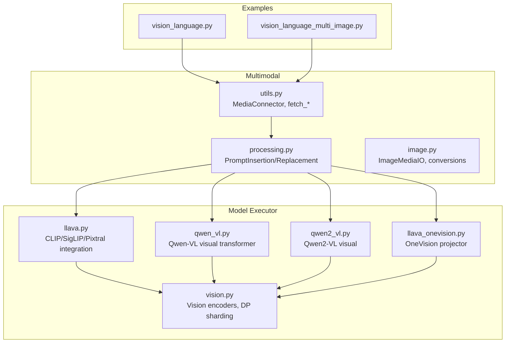
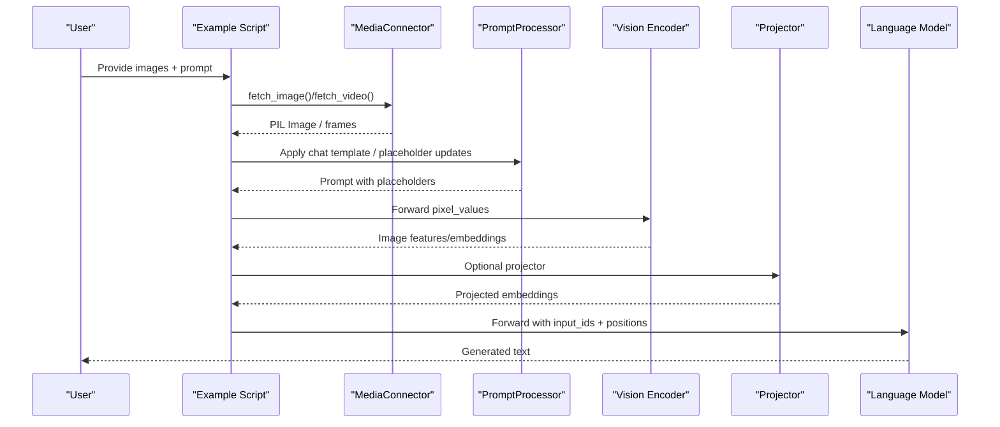
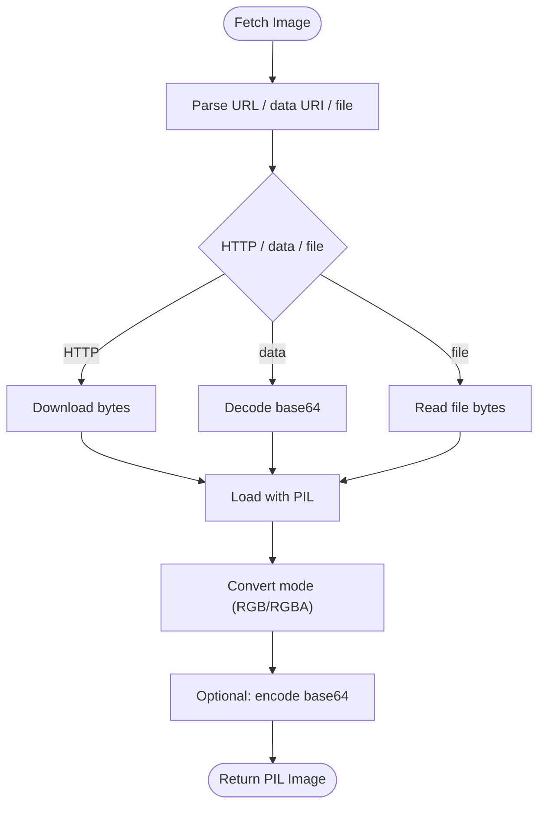
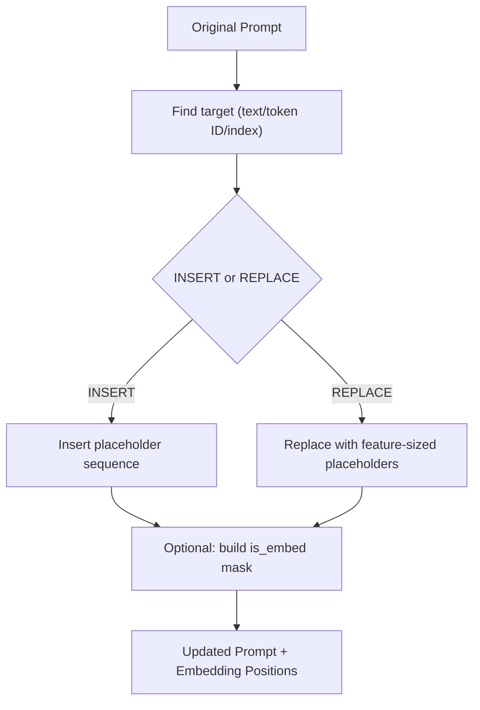
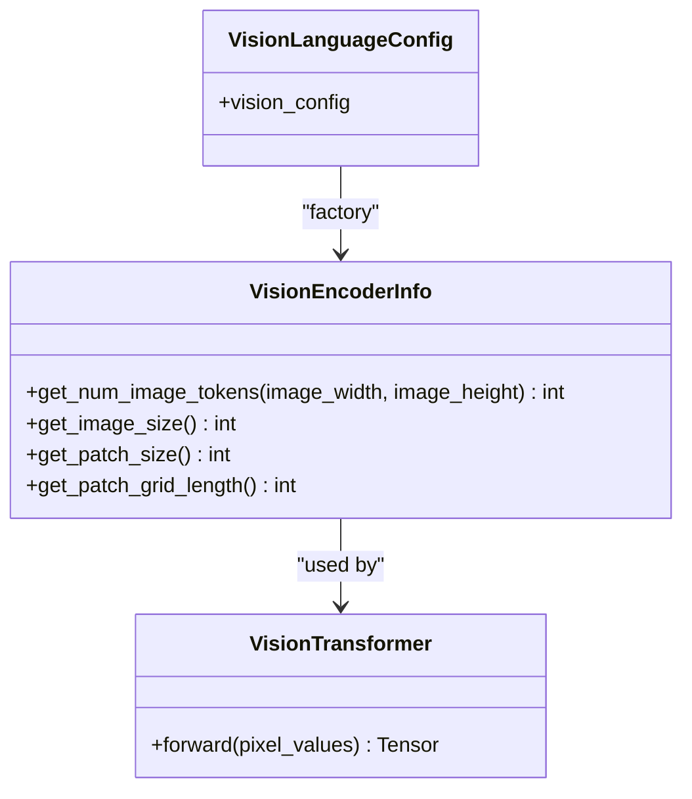
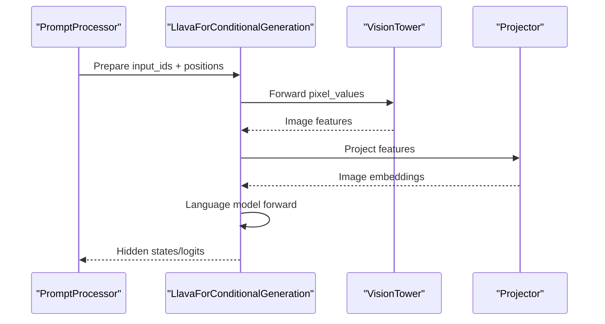
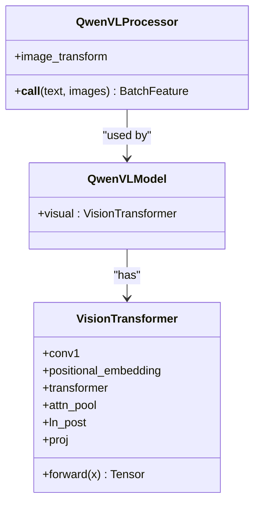
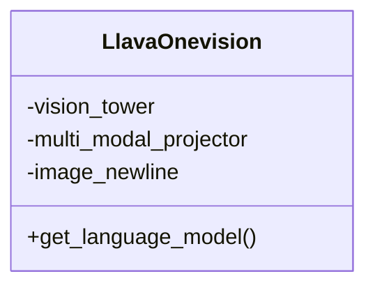
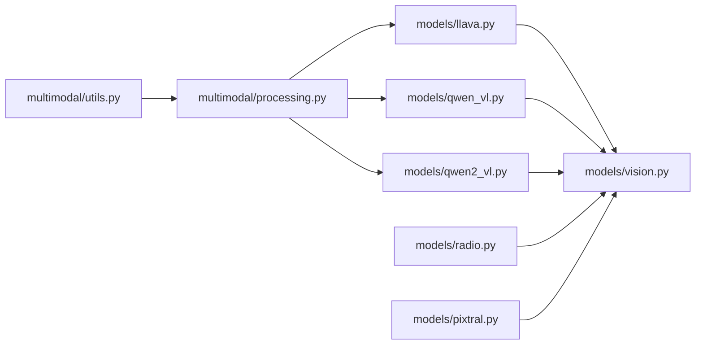

# Vision-Language Models

<cite>
**Referenced Files in This Document**
- [vision_language.py](file://examples/offline_inference/vision_language.py)
- [vision_language_multi_image.py](file://examples/offline_inference/vision_language_multi_image.py)
- [image.py](file://vllm/multimodal/image.py)
- [processing.py](file://vllm/multimodal/processing.py)
- [utils.py](file://vllm/multimodal/utils.py)
- [vision.py](file://vllm/model_executor/models/vision.py)
- [llava.py](file://vllm/model_executor/models/llava.py)
- [qwen_vl.py](file://vllm/model_executor/models/qwen_vl.py)
- [qwen2_vl.py](file://vllm/model_executor/models/qwen2_vl.py)
- [llava_onevision.py](file://vllm/model_executor/models/llava_onevision.py)
- [radio.py](file://vllm/model_executor/models/radio.py)
- [pixtral.py](file://vllm/model_executor/models/pixtral.py)
</cite>

## Table of Contents
1. [Introduction](#introduction)
2. [Project Structure](#project-structure)
3. [Core Components](#core-components)
4. [Architecture Overview](#architecture-overview)
5. [Detailed Component Analysis](#detailed-component-analysis)
6. [Dependency Analysis](#dependency-analysis)
7. [Performance Considerations](#performance-considerations)
8. [Troubleshooting Guide](#troubleshooting-guide)
9. [Conclusion](#conclusion)
10. [Appendices](#appendices)

## Introduction
This document explains how vLLM implements and optimizes vision-language models (VLMs). It covers multimodal input processing, image preprocessing pipelines, vision encoder integration, token placement strategies, supported formats and resolutions, memory optimization, and practical examples for single-image and multi-image generation. It also outlines performance considerations and batch processing strategies across different hardware backends.

## Project Structure
The vision-language stack spans several layers:
- Examples demonstrate end-to-end offline inference for single-image and multi-image scenarios across multiple architectures.
- Multimodal utilities provide media loading, decoding, and batching helpers.
- Model executors implement vision encoders, projection heads, and integration with language models.
- Processing utilities define how prompts are templated and how placeholders are inserted or replaced to accommodate image tokens.

**Diagram sources**
- [vision_language.py](file://examples/offline_inference/vision_language.py#L1-L200)
- [vision_language_multi_image.py](file://examples/offline_inference/vision_language_multi_image.py#L1-L200)
- [utils.py](file://vllm/multimodal/utils.py#L242-L355)
- [processing.py](file://vllm/multimodal/processing.py#L346-L490)
- [image.py](file://vllm/multimodal/image.py#L46-L118)
- [vision.py](file://vllm/model_executor/models/vision.py#L1-L120)
- [llava.py](file://vllm/model_executor/models/llava.py#L508-L737)
- [qwen_vl.py](file://vllm/model_executor/models/qwen_vl.py#L409-L520)
- [qwen2_vl.py](file://vllm/model_executor/models/qwen2_vl.py#L1274-L1312)
- [llava_onevision.py](file://vllm/model_executor/models/llava_onevision.py#L500-L528)

**Section sources**
- [vision_language.py](file://examples/offline_inference/vision_language.py#L1-L200)
- [vision_language_multi_image.py](file://examples/offline_inference/vision_language_multi_image.py#L1-L200)
- [utils.py](file://vllm/multimodal/utils.py#L242-L355)
- [processing.py](file://vllm/multimodal/processing.py#L346-L490)
- [image.py](file://vllm/multimodal/image.py#L46-L118)
- [vision.py](file://vllm/model_executor/models/vision.py#L1-L120)
- [llava.py](file://vllm/model_executor/models/llava.py#L508-L737)
- [qwen_vl.py](file://vllm/model_executor/models/qwen_vl.py#L409-L520)
- [qwen2_vl.py](file://vllm/model_executor/models/qwen2_vl.py#L1274-L1312)
- [llava_onevision.py](file://vllm/model_executor/models/llava_onevision.py#L500-L528)

## Core Components
- Image preprocessing and media I/O:
  - Decoding from HTTP/data URLs, base64, and files; conversion to RGB; optional background fill for RGBA.
  - Threaded fetching and async support for images and videos.
- Prompt processing:
  - Insert or replace placeholders in prompts to reserve token slots for image features.
  - Support for token IDs and text-based targets; selection masks for embedding assignment.
- Vision encoders and integration:
  - CLIP/SigLIP/Pixtral encoders with configurable feature selection strategies.
  - Projection heads and data-parallel sharded execution for large inputs.
  - Specialized models like Qwen-VL, Qwen2-VL, and LLaVA-OneVision.

**Section sources**
- [image.py](file://vllm/multimodal/image.py#L46-L118)
- [utils.py](file://vllm/multimodal/utils.py#L242-L355)
- [processing.py](file://vllm/multimodal/processing.py#L346-L490)
- [vision.py](file://vllm/model_executor/models/vision.py#L1-L120)
- [llava.py](file://vllm/model_executor/models/llava.py#L508-L737)
- [qwen_vl.py](file://vllm/model_executor/models/qwen_vl.py#L409-L520)
- [qwen2_vl.py](file://vllm/model_executor/models/qwen2_vl.py#L1274-L1312)
- [llava_onevision.py](file://vllm/model_executor/models/llava_onevision.py#L500-L528)

## Architecture Overview
The end-to-end pipeline:
- Input images are fetched and decoded via MediaConnector.
- Prompts are templated and updated with placeholders for image tokens.
- Vision encoders extract features; optional projector maps to language model hidden size.
- Language model consumes tokenized text plus image embeddings.

**Diagram sources**
- [vision_language.py](file://examples/offline_inference/vision_language.py#L1-L200)
- [vision_language_multi_image.py](file://examples/offline_inference/vision_language_multi_image.py#L1-L200)
- [utils.py](file://vllm/multimodal/utils.py#L242-L355)
- [processing.py](file://vllm/multimodal/processing.py#L346-L490)
- [llava.py](file://vllm/model_executor/models/llava.py#L508-L737)
- [qwen_vl.py](file://vllm/model_executor/models/qwen_vl.py#L409-L520)

## Detailed Component Analysis

### Image Preprocessing Pipeline
- Fetching:
  - HTTP, data URL, and local file support with validation and timeouts.
  - Async variants for non-blocking downloads.
- Decoding and conversion:
  - Base64 decoding, file read, and PIL parsing.
  - Mode conversion (e.g., RGBA to RGB) with configurable background color.
- Encoding:
  - Base64 encoding for images and embeddings.

**Diagram sources**
- [utils.py](file://vllm/multimodal/utils.py#L146-L211)
- [utils.py](file://vllm/multimodal/utils.py#L242-L355)
- [image.py](file://vllm/multimodal/image.py#L46-L118)

**Section sources**
- [utils.py](file://vllm/multimodal/utils.py#L146-L211)
- [utils.py](file://vllm/multimodal/utils.py#L242-L355)
- [image.py](file://vllm/multimodal/image.py#L46-L118)

### Token Placement Strategies
- Insertion vs Replacement:
  - Insert placeholders at a fixed index or after a prefix.
  - Replace existing placeholders with feature-sized sequences; optionally mark subsegments for embedding assignment.
- Target resolution:
  - Resolve targets by text or token IDs; support index-based anchors.
- Selection masks:
  - Assign embeddings only to selected positions (e.g., image tokens) to avoid overwriting non-image tokens.

**Diagram sources**
- [processing.py](file://vllm/multimodal/processing.py#L346-L490)
- [processing.py](file://vllm/multimodal/processing.py#L693-L758)

**Section sources**
- [processing.py](file://vllm/multimodal/processing.py#L346-L490)
- [processing.py](file://vllm/multimodal/processing.py#L693-L758)

### Vision Encoder Integration
- Supported encoders:
  - CLIP, SigLIP, and Pixtral encoders integrated via a unified interface.
  - Feature selection strategies (class token, default excluding class, full).
- Data-parallel sharded execution:
  - Vision embeddings are computed per chunk and all-gathered across tensor-parallel ranks.
  - Load-balancing by total patch count across ranks.
- RoPE-aware sharded execution:
  - Specialized routines for 2D/3D rope models (e.g., Qwen2.5-VL, Kimi-VL) with merging factors.

**Diagram sources**
- [vision.py](file://vllm/model_executor/models/vision.py#L1-L120)
- [vision.py](file://vllm/model_executor/models/vision.py#L220-L321)
- [vision.py](file://vllm/model_executor/models/vision.py#L322-L510)

**Section sources**
- [vision.py](file://vllm/model_executor/models/vision.py#L1-L120)
- [vision.py](file://vllm/model_executor/models/vision.py#L220-L321)
- [vision.py](file://vllm/model_executor/models/vision.py#L322-L510)

### LLaVA Family Integration
- Vision tower initialization:
  - Selects and initializes only required layers of CLIP/SigLIP/Pixtral encoders.
  - Supports feature selection strategy and projector mapping to language model hidden size.
- Image input processing:
  - Accepts pixel values or precomputed embeddings; projects features when needed.
- Forward pass:
  - Integrates with language model backbone; supports LoRA and PP-compatible interfaces.

**Diagram sources**
- [llava.py](file://vllm/model_executor/models/llava.py#L508-L737)
- [llava.py](file://vllm/model_executor/models/llava.py#L618-L668)

**Section sources**
- [llava.py](file://vllm/model_executor/models/llava.py#L508-L737)
- [llava.py](file://vllm/model_executor/models/llava.py#L618-L668)

### Qwen-VL and Qwen2-VL
- Qwen-VL:
  - Custom VisionTransformer with patch convolution, absolute positional embeddings, transformer blocks, and Resampler2 attention pooler.
  - Processor composes Resize+Normalize transforms and tokenizer tags for image boundaries.
- Qwen2-VL:
  - Uses Qwen2VisionTransformer and integrates with language model; supports data-parallel encoder mode.

**Diagram sources**
- [qwen_vl.py](file://vllm/model_executor/models/qwen_vl.py#L409-L520)
- [qwen_vl.py](file://vllm/model_executor/models/qwen_vl.py#L520-L620)
- [qwen2_vl.py](file://vllm/model_executor/models/qwen2_vl.py#L1274-L1312)

**Section sources**
- [qwen_vl.py](file://vllm/model_executor/models/qwen_vl.py#L409-L520)
- [qwen_vl.py](file://vllm/model_executor/models/qwen_vl.py#L520-L620)
- [qwen2_vl.py](file://vllm/model_executor/models/qwen2_vl.py#L1274-L1312)

### LLaVA-OneVision
- Initializes a specialized vision tower and projector; integrates with language model.
- Supports image newline parameterization and projector mapping.

**Diagram sources**
- [llava_onevision.py](file://vllm/model_executor/models/llava_onevision.py#L500-L528)

**Section sources**
- [llava_onevision.py](file://vllm/model_executor/models/llava_onevision.py#L500-L528)

### Practical Examples

#### Single-image Generation
- The example script demonstrates how to prepare prompts and engine arguments for various models, including Aria, BLIP-2, Fuyu, Gemma 3, GLM-4V variants, and more.
- It sets limits on multimodal inputs per prompt and configures model-specific processors and tokenization.

**Section sources**
- [vision_language.py](file://examples/offline_inference/vision_language.py#L1-L200)

#### Multi-image Generation
- The multi-image example shows how to construct prompts with multiple image placeholders, fetch images, and configure processors for models like Aria, Bee, Command-a-Vision, DeepSeek-VL2, Gemma 3, H2OVL, HunyuanOCR, HyperCLOVAX, Idefics3, InternS1, InternVL, Keye-VL, Kimi-VL, Llama-4, LLaVA, LLaVA Next, LLaVA OneVision, Mistral Small 3.1, NVLM-D, Ovis, and Ovis2.5.

**Section sources**
- [vision_language_multi_image.py](file://examples/offline_inference/vision_language_multi_image.py#L1-L200)

## Dependency Analysis
- Media I/O depends on HTTP connection and thread pools; image/video decoding uses PIL and NumPy.
- Prompt processing depends on tokenizer APIs and regex/text matching.
- Model integration depends on vision encoder factories and projector modules.
- Data-parallel sharding relies on tensor model parallel utilities and all-gather primitives.

**Diagram sources**
- [utils.py](file://vllm/multimodal/utils.py#L242-L355)
- [processing.py](file://vllm/multimodal/processing.py#L346-L490)
- [llava.py](file://vllm/model_executor/models/llava.py#L508-L737)
- [qwen_vl.py](file://vllm/model_executor/models/qwen_vl.py#L409-L520)
- [qwen2_vl.py](file://vllm/model_executor/models/qwen2_vl.py#L1274-L1312)
- [vision.py](file://vllm/model_executor/models/vision.py#L1-L120)
- [radio.py](file://vllm/model_executor/models/radio.py#L92-L333)
- [pixtral.py](file://vllm/model_executor/models/pixtral.py#L668-L789)

**Section sources**
- [utils.py](file://vllm/multimodal/utils.py#L242-L355)
- [processing.py](file://vllm/multimodal/processing.py#L346-L490)
- [llava.py](file://vllm/model_executor/models/llava.py#L508-L737)
- [qwen_vl.py](file://vllm/model_executor/models/qwen_vl.py#L409-L520)
- [qwen2_vl.py](file://vllm/model_executor/models/qwen2_vl.py#L1274-L1312)
- [vision.py](file://vllm/model_executor/models/vision.py#L1-L120)
- [radio.py](file://vllm/model_executor/models/radio.py#L92-L333)
- [pixtral.py](file://vllm/model_executor/models/pixtral.py#L668-L789)

## Performance Considerations
- Resolution and patch grids:
  - Feature counts depend on image size and patch size; use appropriate mm_processor_kwargs to control resizing and patching.
- Memory optimization:
  - Limit multimodal items per prompt to manage KV cache growth.
  - Use dtype choices (e.g., bfloat16/half) and enforce eager execution when needed for stability.
  - For large models, enable tensor parallelism and data-parallel sharded encoders to distribute compute.
- Batch processing:
  - Group images by size and assign to GPUs to balance load; use load-balancing utilities to minimize idle time.
- Attention backends:
  - Choose optimized attention backends for vision transformers based on head size and dtype.

[No sources needed since this section provides general guidance]

## Troubleshooting Guide
- Unsupported or invalid image URLs:
  - Ensure allowed domains are configured; verify local file path restrictions.
- Unidentified image errors:
  - The media connector raises a ValueError when decoding fails; inspect image bytes and formats.
- Prompt token mismatch:
  - Confirm placeholder counts match the number of image tokens computed by the encoder info.
- OOM during inference:
  - Reduce max_model_len, limit multimodal items per prompt, adjust dtype, or increase tensor parallel size.

**Section sources**
- [utils.py](file://vllm/multimodal/utils.py#L146-L211)
- [utils.py](file://vllm/multimodal/utils.py#L242-L355)

## Conclusion
vLLM’s vision-language stack provides a modular, extensible framework for multimodal inference. It supports diverse architectures, robust media I/O, flexible token placement strategies, and efficient execution via data-parallel sharding. The included examples and utilities enable practical single-image and multi-image generation across a wide range of models.

## Appendices
- Supported image formats and modes:
  - Decoding supports HTTP/data URLs and files; conversion to RGB with optional background color for RGBA inputs.
- Resolution handling:
  - Many models expose mm_processor_kwargs to control resizing and patching; use these to balance quality and memory footprint.
- Custom vision model integration:
  - Implement a vision encoder wrapper and register a processor to integrate new architectures; leverage projector and DP sharding utilities.

[No sources needed since this section provides general guidance]