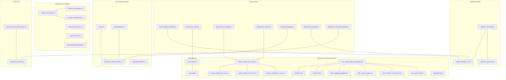
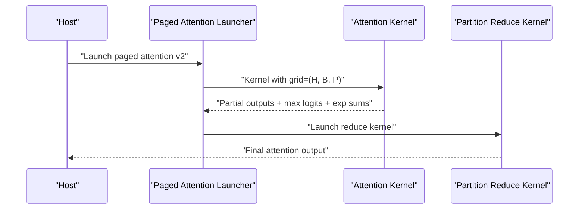
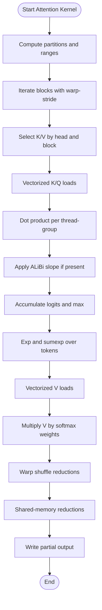
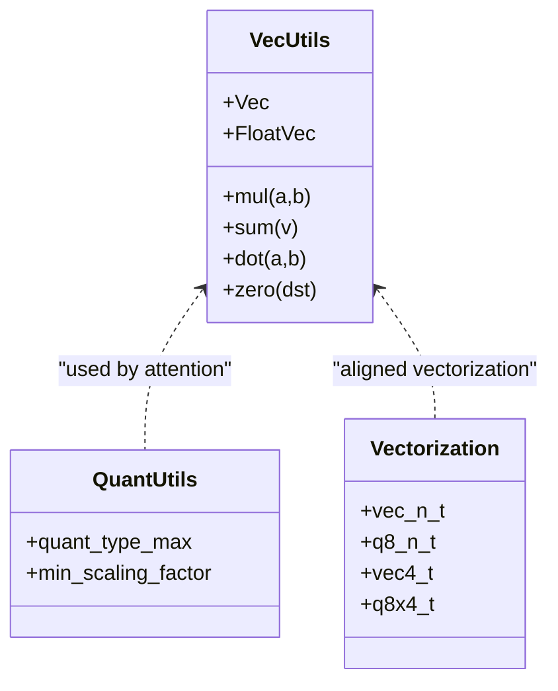
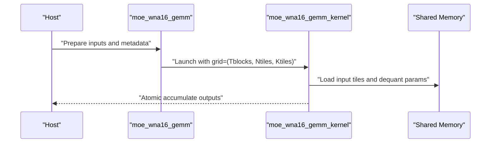
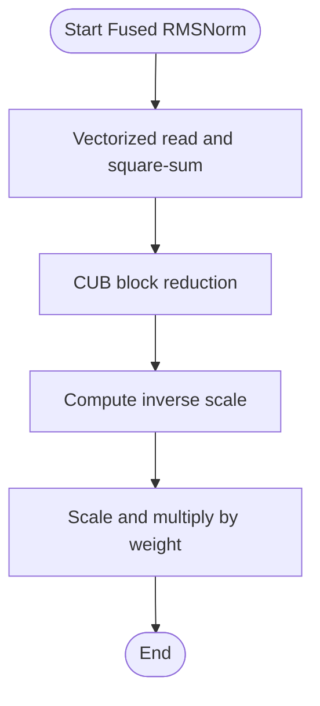
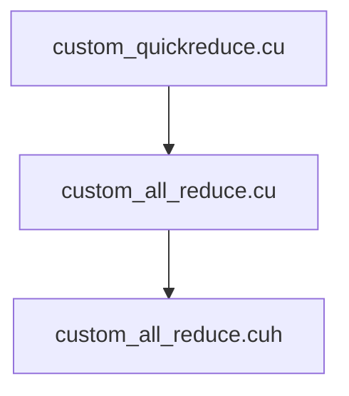
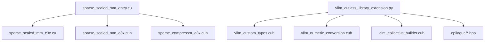
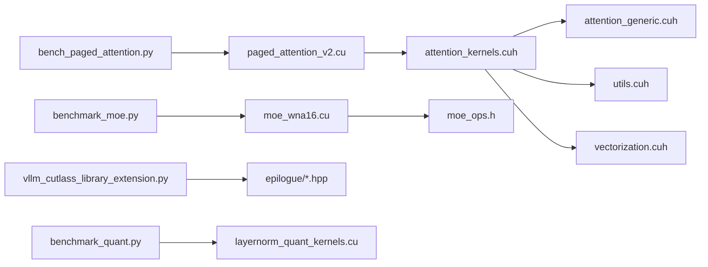

# CUDA Kernels and Custom Operations

<cite>
**Referenced Files in This Document**
- [attention_kernels.cuh](file://csrc/attention/attention_kernels.cuh)
- [attention_generic.cuh](file://csrc/attention/attention_generic.cuh)
- [paged_attention_v2.cu](file://csrc/attention/paged_attention_v2.cu)
- [layernorm_kernels.cu](file://csrc/layernorm_kernels.cu)
- [moe_wna16.cu](file://csrc/moe/moe_wna16.cu)
- [moe_ops.h](file://csrc/moe/moe_ops.h)
- [utils.cuh](file://csrc/quantization/utils.cuh)
- [vectorization.cuh](file://csrc/quantization/vectorization.cuh)
- [cuda_utils_kernels.cu](file://csrc/cuda_utils_kernels.cu)
- [custom_all_reduce.cu](file://csrc/custom_all_reduce.cu)
- [custom_all_reduce.cuh](file://csrc/custom_all_reduce.cuh)
- [custom_quickreduce.cu](file://csrc/custom_quickreduce.cu)
- [fused_qknorm_rope_kernel.cu](file://csrc/fused_qknorm_rope_kernel.cu)
- [layernorm_quant_kernels.cu](file://csrc/layernorm_quant_kernels.cu)
- [activation_kernels.cu](file://csrc/activation_kernels.cu)
- [pos_encoding_kernels.cu](file://csrc/pos_encoding_kernels.cu)
- [cache_kernels.cu](file://csrc/cache_kernels.cu)
- [sparse_scaled_mm_entry.cu](file://csrc/sparse/cutlass/sparse_scaled_mm_entry.cu)
- [sparse_scaled_mm_c3x.cu](file://csrc/sparse/cutlass/sparse_scaled_mm_c3x.cu)
- [sparse_scaled_mm_c3x.cuh](file://csrc/sparse/cutlass/sparse_scaled_mm_c3x.cuh)
- [sparse_compressor_c3x.cuh](file://csrc/sparse/cutlass/sparse_compressor_c3x.cuh)
- [vllm_cutlass_library_extension.py](file://csrc/cutlass_extensions/vllm_cutlass_library_extension.py)
- [common.cpp](file://csrc/cutlass_extensions/common.cpp)
- [common.hpp](file://csrc/cutlass_extensions/common.hpp)
- [vllm_collective_builder.cuh](file://csrc/cutlass_extensions/vllm_collective_builder.cuh)
- [vllm_custom_types.cuh](file://csrc/cutlass_extensions/vllm_custom_types.cuh)
- [vllm_numeric_conversion.cuh](file://csrc/cutlass_extensions/vllm_numeric_conversion.cuh)
- [vllm_type_utils.cuh](file://csrc/cutlass_extensions/vllm_type_utils.cuh)
- [epilogue/broadcast_load_epilogue_array_c3x.hpp](file://csrc/cutlass_extensions/epilogue/broadcast_load_epilogue_array_c3x.hpp)
- [epilogue/broadcast_load_epilogue_c2x.hpp](file://csrc/cutlass_extensions/epilogue/broadcast_load_epilogue_c2x.hpp)
- [epilogue/broadcast_load_epilogue_c3x.hpp](file://csrc/cutlass_extensions/epilogue/broadcast_load_epilogue_c3x.hpp)
- [epilogue/scaled_mm_epilogues_c2x.hpp](file://csrc/cutlass_extensions/epilogue/scaled_mm_epilogues_c2x.hpp)
- [epilogue/scaled_mm_epilogues_c3x.hpp](file://csrc/cutlass_extensions/epilogue/scaled_mm_epilogues_c3x.hpp)
- [bench_paged_attention.py](file://benchmarks/kernels/benchmark_paged_attention.py)
- [benchmark_moe.py](file://benchmarks/kernels/benchmark_moe.py)
- [benchmark_machete.py](file://benchmarks/kernels/benchmark_machete.py)
- [benchmark_marlin.py](file://benchmarks/kernels/benchmark_marlin.py)
- [benchmark_quant.py](file://benchmarks/kernels/benchmark_quant.py)
- [benchmark_shapes.py](file://benchmarks/kernels/benchmark_shapes.py)
- [layernorm_rms_benchmarks.py](file://benchmarks/fused_kernels/layernorm_rms_benchmarks.py)
- [README.md](file://benchmarks/README.md)
- [cli.md](file://docs/benchmarking/cli.md)
- [profiling.md](file://docs/contributing/profiling.md)
- [simple_profiling.py](file://examples/offline_inference/simple_profiling.py)
- [visualize_layerwise_profile.py](file://tools/profiler/visualize_layerwise_profile.py)
- [print_layerwise_table.py](file://tools/profiler/print_layerwise_table.py)
- [nsys_profile_tools](file://tools/profiler/nsys_profile_tools/)
</cite>

## Table of Contents
1. [Introduction](#introduction)
2. [Project Structure](#project-structure)
3. [Core Components](#core-components)
4. [Architecture Overview](#architecture-overview)
5. [Detailed Component Analysis](#detailed-component-analysis)
6. [Dependency Analysis](#dependency-analysis)
7. [Performance Considerations](#performance-considerations)
8. [Troubleshooting Guide](#troubleshooting-guide)
9. [Conclusion](#conclusion)
10. [Appendices](#appendices)

## Introduction
This document explains CUDA kernel optimization and custom operation development in vLLM. It focuses on kernel architecture, memory coalescing strategies, thread block optimization, and shared memory usage. It also covers custom kernel development workflows, performance profiling, hardware-specific optimizations, attention kernels, quantization kernels, and MoE specialized operations. Practical examples include kernel tuning, benchmarking methodologies, and performance regression testing, along with kernel fusion techniques and warp-level primitives usage.

## Project Structure
The CUDA-related kernels and custom operations live primarily under csrc/, with attention, quantization, MoE, and fused kernels organized by domain. Benchmarks and profiling tools are under benchmarks/ and tools/profiler/.

**Diagram sources**
- [attention_kernels.cuh](file://csrc/attention/attention_kernels.cuh#L1-L671)
- [paged_attention_v2.cu](file://csrc/attention/paged_attention_v2.cu#L1-L197)
- [attention_generic.cuh](file://csrc/attention/attention_generic.cuh#L1-L66)
- [utils.cuh](file://csrc/quantization/utils.cuh#L1-L59)
- [vectorization.cuh](file://csrc/quantization/vectorization.cuh#L1-L32)
- [layernorm_quant_kernels.cu](file://csrc/layernorm_quant_kernels.cu)
- [activation_kernels.cu](file://csrc/activation_kernels.cu)
- [moe_wna16.cu](file://csrc/moe/moe_wna16.cu#L1-L343)
- [moe_ops.h](file://csrc/moe/moe_ops.h#L1-L52)
- [fused_qknorm_rope_kernel.cu](file://csrc/fused_qknorm_rope_kernel.cu)
- [layernorm_kernels.cu](file://csrc/layernorm_kernels.cu#L1-L287)
- [custom_all_reduce.cu](file://csrc/custom_all_reduce.cu)
- [custom_all_reduce.cuh](file://csrc/custom_all_reduce.cuh)
- [custom_quickreduce.cu](file://csrc/custom_quickreduce.cu)
- [cuda_utils_kernels.cu](file://csrc/cuda_utils_kernels.cu)
- [cache_kernels.cu](file://csrc/cache_kernels.cu)
- [pos_encoding_kernels.cu](file://csrc/pos_encoding_kernels.cu)
- [sparse_scaled_mm_entry.cu](file://csrc/sparse/cutlass/sparse_scaled_mm_entry.cu)
- [sparse_scaled_mm_c3x.cu](file://csrc/sparse/cutlass/sparse_scaled_mm_c3x.cu)
- [sparse_scaled_mm_c3x.cuh](file://csrc/sparse/cutlass/sparse_scaled_mm_c3x.cuh)
- [sparse_compressor_c3x.cuh](file://csrc/sparse/cutlass/sparse_compressor_c3x.cuh)
- [vllm_cutlass_library_extension.py](file://csrc/cutlass_extensions/vllm_cutlass_library_extension.py)
- [common.cpp](file://csrc/cutlass_extensions/common.cpp)
- [common.hpp](file://csrc/cutlass_extensions/common.hpp)
- [vllm_collective_builder.cuh](file://csrc/cutlass_extensions/vllm_collective_builder.cuh)
- [vllm_custom_types.cuh](file://csrc/cutlass_extensions/vllm_custom_types.cuh)
- [vllm_numeric_conversion.cuh](file://csrc/cutlass_extensions/vllm_numeric_conversion.cuh)
- [vllm_type_utils.cuh](file://csrc/cutlass_extensions/vllm_type_utils.cuh)
- [epilogue/broadcast_load_epilogue_array_c3x.hpp](file://csrc/cutlass_extensions/epilogue/broadcast_load_epilogue_array_c3x.hpp)
- [epilogue/broadcast_load_epilogue_c2x.hpp](file://csrc/cutlass_extensions/epilogue/broadcast_load_epilogue_c2x.hpp)
- [epilogue/broadcast_load_epilogue_c3x.hpp](file://csrc/cutlass_extensions/epilogue/broadcast_load_epilogue_c3x.hpp)
- [epilogue/scaled_mm_epilogues_c2x.hpp](file://csrc/cutlass_extensions/epilogue/scaled_mm_epilogues_c2x.hpp)
- [epilogue/scaled_mm_epilogues_c3x.hpp](file://csrc/cutlass_extensions/epilogue/scaled_mm_epilogues_c3x.hpp)
- [bench_paged_attention.py](file://benchmarks/kernels/benchmark_paged_attention.py)
- [benchmark_moe.py](file://benchmarks/kernels/benchmark_moe.py)
- [benchmark_machete.py](file://benchmarks/kernels/benchmark_machete.py)
- [benchmark_marlin.py](file://benchmarks/kernels/benchmark_marlin.py)
- [benchmark_quant.py](file://benchmarks/kernels/benchmark_quant.py)
- [benchmark_shapes.py](file://benchmarks/kernels/benchmark_shapes.py)
- [layernorm_rms_benchmarks.py](file://benchmarks/fused_kernels/layernorm_rms_benchmarks.py)

**Section sources**
- [attention_kernels.cuh](file://csrc/attention/attention_kernels.cuh#L1-L671)
- [paged_attention_v2.cu](file://csrc/attention/paged_attention_v2.cu#L1-L197)
- [layernorm_kernels.cu](file://csrc/layernorm_kernels.cu#L1-L287)
- [moe_wna16.cu](file://csrc/moe/moe_wna16.cu#L1-L343)
- [moe_ops.h](file://csrc/moe/moe_ops.h#L1-L52)
- [utils.cuh](file://csrc/quantization/utils.cuh#L1-L59)
- [vectorization.cuh](file://csrc/quantization/vectorization.cuh#L1-L32)
- [custom_all_reduce.cu](file://csrc/custom_all_reduce.cu)
- [custom_all_reduce.cuh](file://csrc/custom_all_reduce.cuh)
- [custom_quickreduce.cu](file://csrc/custom_quickreduce.cu)
- [fused_qknorm_rope_kernel.cu](file://csrc/fused_qknorm_rope_kernel.cu)
- [layernorm_quant_kernels.cu](file://csrc/layernorm_quant_kernels.cu)
- [activation_kernels.cu](file://csrc/activation_kernels.cu)
- [pos_encoding_kernels.cu](file://csrc/pos_encoding_kernels.cu)
- [cache_kernels.cu](file://csrc/cache_kernels.cu)
- [sparse_scaled_mm_entry.cu](file://csrc/sparse/cutlass/sparse_scaled_mm_entry.cu)
- [sparse_scaled_mm_c3x.cu](file://csrc/sparse/cutlass/sparse_scaled_mm_c3x.cu)
- [sparse_scaled_mm_c3x.cuh](file://csrc/sparse/cutlass/sparse_scaled_mm_c3x.cuh)
- [sparse_compressor_c3x.cuh](file://csrc/sparse/cutlass/sparse_compressor_c3x.cuh)
- [vllm_cutlass_library_extension.py](file://csrc/cutlass_extensions/vllm_cutlass_library_extension.py)
- [common.cpp](file://csrc/cutlass_extensions/common.cpp)
- [common.hpp](file://csrc/cutlass_extensions/common.hpp)
- [vllm_collective_builder.cuh](file://csrc/cutlass_extensions/vllm_collective_builder.cuh)
- [vllm_custom_types.cuh](file://csrc/cutlass_extensions/vllm_custom_types.cuh)
- [vllm_numeric_conversion.cuh](file://csrc/cutlass_extensions/vllm_numeric_conversion.cuh)
- [vllm_type_utils.cuh](file://csrc/cutlass_extensions/vllm_type_utils.cuh)
- [epilogue/broadcast_load_epilogue_array_c3x.hpp](file://csrc/cutlass_extensions/epilogue/broadcast_load_epilogue_array_c3x.hpp)
- [epilogue/broadcast_load_epilogue_c2x.hpp](file://csrc/cutlass_extensions/epilogue/broadcast_load_epilogue_c2x.hpp)
- [epilogue/broadcast_load_epilogue_c3x.hpp](file://csrc/cutlass_extensions/epilogue/broadcast_load_epilogue_c3x.hpp)
- [epilogue/scaled_mm_epilogues_c2x.hpp](file://csrc/cutlass_extensions/epilogue/scaled_mm_epilogues_c2x.hpp)
- [epilogue/scaled_mm_epilogues_c3x.hpp](file://csrc/cutlass_extensions/epilogue/scaled_mm_epilogues_c3x.hpp)
- [bench_paged_attention.py](file://benchmarks/kernels/benchmark_paged_attention.py)
- [benchmark_moe.py](file://benchmarks/kernels/benchmark_moe.py)
- [benchmark_machete.py](file://benchmarks/kernels/benchmark_machete.py)
- [benchmark_marlin.py](file://benchmarks/kernels/benchmark_marlin.py)
- [benchmark_quant.py](file://benchmarks/kernels/benchmark_quant.py)
- [benchmark_shapes.py](file://benchmarks/kernels/benchmark_shapes.py)
- [layernorm_rms_benchmarks.py](file://benchmarks/fused_kernels/layernorm_rms_benchmarks.py)
- [README.md](file://benchmarks/README.md)
- [cli.md](file://docs/benchmarking/cli.md)
- [profiling.md](file://docs/contributing/profiling.md)
- [simple_profiling.py](file://examples/offline_inference/simple_profiling.py)
- [visualize_layerwise_profile.py](file://tools/profiler/visualize_layerwise_profile.py)
- [print_layerwise_table.py](file://tools/profiler/print_layerwise_table.py)

## Core Components
- Attention kernels: Paged attention v1/v2 with partitioning, softmax reduction, and KV-cache handling for FP8 and other dtypes. Includes blocksparse attention support and ALiBi slope handling.
- Quantization kernels: RMSNorm with quantized KV-cache reads, activation kernels, and vectorized quantization utilities.
- MoE kernels: WNA16 GEMM for grouped/expertized matmul with optional zero-point and top-k weight fusion.
- Fused operations: Fused QK norm + RoPE, fused RMSNorm variants, and fused activation kernels.
- Collectives and reductions: Custom all-reduce and quick-reduce utilities for efficient inter-GPU communication and reductions.
- Sparse/CUTLASS extensions: Sparse scaled matrix multiply and CUTLASS epilogue extensions for performance and numerics.
- Benchmarks and profiling: Comprehensive benchmark suites and profiling tools for kernel performance measurement and regression testing.

**Section sources**
- [attention_kernels.cuh](file://csrc/attention/attention_kernels.cuh#L1-L671)
- [paged_attention_v2.cu](file://csrc/attention/paged_attention_v2.cu#L1-L197)
- [layernorm_kernels.cu](file://csrc/layernorm_kernels.cu#L1-L287)
- [moe_wna16.cu](file://csrc/moe/moe_wna16.cu#L1-L343)
- [moe_ops.h](file://csrc/moe/moe_ops.h#L1-L52)
- [utils.cuh](file://csrc/quantization/utils.cuh#L1-L59)
- [vectorization.cuh](file://csrc/quantization/vectorization.cuh#L1-L32)
- [custom_all_reduce.cu](file://csrc/custom_all_reduce.cu)
- [custom_all_reduce.cuh](file://csrc/custom_all_reduce.cuh)
- [custom_quickreduce.cu](file://csrc/custom_quickreduce.cu)
- [fused_qknorm_rope_kernel.cu](file://csrc/fused_qknorm_rope_kernel.cu)
- [layernorm_quant_kernels.cu](file://csrc/layernorm_quant_kernels.cu)
- [activation_kernels.cu](file://csrc/activation_kernels.cu)
- [sparse_scaled_mm_entry.cu](file://csrc/sparse/cutlass/sparse_scaled_mm_entry.cu)
- [vllm_cutlass_library_extension.py](file://csrc/cutlass_extensions/vllm_cutlass_library_extension.py)

## Architecture Overview
The attention pipeline uses a two-phase design for long sequences: compute partial attention outputs per partition and then reduce across partitions. Quantized KV caches are accessed via vectorized loads and optional scaling conversions. MoE kernels align tokens to experts and perform grouped GEMMs with shared-memory tiling and warp-parallel reductions. Fused kernels combine multiple operations to reduce memory traffic and improve throughput.

**Diagram sources**
- [paged_attention_v2.cu](file://csrc/attention/paged_attention_v2.cu#L1-L197)
- [attention_kernels.cuh](file://csrc/attention/attention_kernels.cuh#L493-L666)

## Detailed Component Analysis

### Attention Kernel Pipeline
- Partitioned attention: The v2 kernel computes partial attention outputs per partition and stores max logits and exp sums. A separate reduce kernel aggregates across partitions using numerically stable re-normalization.
- Memory coalescing: Thread groups stride across head dimension with vectorized loads; keys/values are fetched in chunks aligned to vector widths. Shared memory logits reuse enables efficient softmax and weighted sum.
- Warp-level primitives: Uses shuffle-based reductions for intra-warp and inter-warp summation and max reduction.
- Blocksparse attention: Optional blocksparse logic skips remote/local blocks based on strides and sliding steps.

**Diagram sources**
- [attention_kernels.cuh](file://csrc/attention/attention_kernels.cuh#L81-L491)
- [paged_attention_v2.cu](file://csrc/attention/paged_attention_v2.cu#L1-L197)

**Section sources**
- [attention_kernels.cuh](file://csrc/attention/attention_kernels.cuh#L1-L671)
- [attention_generic.cuh](file://csrc/attention/attention_generic.cuh#L1-L66)
- [paged_attention_v2.cu](file://csrc/attention/paged_attention_v2.cu#L1-L197)

### Quantization Kernels and Utilities
- Quantized KV-cache access: Attention kernels conditionally scale FP8 KV-cache values using per-entry or per-group scales.
- Vectorization utilities: Provides vectorized containers and alignment helpers for efficient memory operations.
- Quantization constants: Defines adjusted maxima and minimum scaling factors for numerical stability.

**Diagram sources**
- [attention_generic.cuh](file://csrc/attention/attention_generic.cuh#L1-L66)
- [utils.cuh](file://csrc/quantization/utils.cuh#L1-L59)
- [vectorization.cuh](file://csrc/quantization/vectorization.cuh#L1-L32)

**Section sources**
- [utils.cuh](file://csrc/quantization/utils.cuh#L1-L59)
- [vectorization.cuh](file://csrc/quantization/vectorization.cuh#L1-L32)
- [attention_kernels.cuh](file://csrc/attention/attention_kernels.cuh#L1-L671)

### MoE Specialized Operations
- WNA16 GEMM: Performs grouped/expertized GEMM with optional zero-point and top-k weight fusion. Uses shared memory tiling and warp-parallel accumulation with atomic writes to output.
- Alignment and grouping: Exposes APIs to align token counts to block sizes and compute grouped top-k indices.

**Diagram sources**
- [moe_wna16.cu](file://csrc/moe/moe_wna16.cu#L1-L343)
- [moe_ops.h](file://csrc/moe/moe_ops.h#L1-L52)

**Section sources**
- [moe_wna16.cu](file://csrc/moe/moe_wna16.cu#L1-L343)
- [moe_ops.h](file://csrc/moe/moe_ops.h#L1-L52)

### Fused Operations and Layer Norm
- Fused QK norm + RoPE: Combines normalization and rotary embedding in a single kernel to reduce memory bandwidth.
- RMSNorm variants: Standard and fused-add RMSNorm with vectorized reads and CUB block reductions; automatically selects vector width and block size based on alignment and shape.

**Diagram sources**
- [layernorm_kernels.cu](file://csrc/layernorm_kernels.cu#L1-L287)
- [fused_qknorm_rope_kernel.cu](file://csrc/fused_qknorm_rope_kernel.cu)

**Section sources**
- [layernorm_kernels.cu](file://csrc/layernorm_kernels.cu#L1-L287)
- [fused_qknorm_rope_kernel.cu](file://csrc/fused_qknorm_rope_kernel.cu)

### Collectives and Reductions
- Custom all-reduce: Implements efficient all-reduce primitives for multi-GPU setups.
- Quick-reduce: Optimized reduction utilities for fast aggregation across threads.

**Diagram sources**
- [custom_all_reduce.cu](file://csrc/custom_all_reduce.cu)
- [custom_all_reduce.cuh](file://csrc/custom_all_reduce.cuh)
- [custom_quickreduce.cu](file://csrc/custom_quickreduce.cu)

**Section sources**
- [custom_all_reduce.cu](file://csrc/custom_all_reduce.cu)
- [custom_all_reduce.cuh](file://csrc/custom_all_reduce.cuh)
- [custom_quickreduce.cu](file://csrc/custom_quickreduce.cu)

### Sparse and CUTLASS Extensions
- Sparse scaled matrix multiply: Entry points and kernels for compressed sparse formats.
- CUTLASS extensions: Custom types, numeric conversion, collective builder, and epilogue templates to integrate with CUTLASS.

**Diagram sources**
- [sparse_scaled_mm_entry.cu](file://csrc/sparse/cutlass/sparse_scaled_mm_entry.cu)
- [sparse_scaled_mm_c3x.cu](file://csrc/sparse/cutlass/sparse_scaled_mm_c3x.cu)
- [sparse_scaled_mm_c3x.cuh](file://csrc/sparse/cutlass/sparse_scaled_mm_c3x.cuh)
- [sparse_compressor_c3x.cuh](file://csrc/sparse/cutlass/sparse_compressor_c3x.cuh)
- [vllm_cutlass_library_extension.py](file://csrc/cutlass_extensions/vllm_cutlass_library_extension.py)
- [vllm_custom_types.cuh](file://csrc/cutlass_extensions/vllm_custom_types.cuh)
- [vllm_numeric_conversion.cuh](file://csrc/cutlass_extensions/vllm_numeric_conversion.cuh)
- [vllm_collective_builder.cuh](file://csrc/cutlass_extensions/vllm_collective_builder.cuh)
- [epilogue/broadcast_load_epilogue_array_c3x.hpp](file://csrc/cutlass_extensions/epilogue/broadcast_load_epilogue_array_c3x.hpp)
- [epilogue/broadcast_load_epilogue_c2x.hpp](file://csrc/cutlass_extensions/epilogue/broadcast_load_epilogue_c2x.hpp)
- [epilogue/broadcast_load_epilogue_c3x.hpp](file://csrc/cutlass_extensions/epilogue/broadcast_load_epilogue_c3x.hpp)
- [epilogue/scaled_mm_epilogues_c2x.hpp](file://csrc/cutlass_extensions/epilogue/scaled_mm_epilogues_c2x.hpp)
- [epilogue/scaled_mm_epilogues_c3x.hpp](file://csrc/cutlass_extensions/epilogue/scaled_mm_epilogues_c3x.hpp)

**Section sources**
- [sparse_scaled_mm_entry.cu](file://csrc/sparse/cutlass/sparse_scaled_mm_entry.cu)
- [sparse_scaled_mm_c3x.cu](file://csrc/sparse/cutlass/sparse_scaled_mm_c3x.cu)
- [sparse_scaled_mm_c3x.cuh](file://csrc/sparse/cutlass/sparse_scaled_mm_c3x.cuh)
- [sparse_compressor_c3x.cuh](file://csrc/sparse/cutlass/sparse_compressor_c3x.cuh)
- [vllm_cutlass_library_extension.py](file://csrc/cutlass_extensions/vllm_cutlass_library_extension.py)
- [common.cpp](file://csrc/cutlass_extensions/common.cpp)
- [common.hpp](file://csrc/cutlass_extensions/common.hpp)
- [vllm_collective_builder.cuh](file://csrc/cutlass_extensions/vllm_collective_builder.cuh)
- [vllm_custom_types.cuh](file://csrc/cutlass_extensions/vllm_custom_types.cuh)
- [vllm_numeric_conversion.cuh](file://csrc/cutlass_extensions/vllm_numeric_conversion.cuh)
- [vllm_type_utils.cuh](file://csrc/cutlass_extensions/vllm_type_utils.cuh)
- [epilogue/broadcast_load_epilogue_array_c3x.hpp](file://csrc/cutlass_extensions/epilogue/broadcast_load_epilogue_array_c3x.hpp)
- [epilogue/broadcast_load_epilogue_c2x.hpp](file://csrc/cutlass_extensions/epilogue/broadcast_load_epilogue_c2x.hpp)
- [epilogue/broadcast_load_epilogue_c3x.hpp](file://csrc/cutlass_extensions/epilogue/broadcast_load_epilogue_c3x.hpp)
- [epilogue/scaled_mm_epilogues_c2x.hpp](file://csrc/cutlass_extensions/epilogue/scaled_mm_epilogues_c2x.hpp)
- [epilogue/scaled_mm_epilogues_c3x.hpp](file://csrc/cutlass_extensions/epilogue/scaled_mm_epilogues_c3x.hpp)

## Dependency Analysis
- Attention kernels depend on vectorization utilities and quantization helpers for dtype conversions and vectorized loads.
- MoE kernels depend on alignment APIs and grouped top-k computation.
- CUTLASS extensions provide reusable building blocks for epilogues and numeric conversions.
- Benchmarks depend on kernel launchers and shapes to drive performance measurements.

**Diagram sources**
- [attention_kernels.cuh](file://csrc/attention/attention_kernels.cuh#L1-L671)
- [attention_generic.cuh](file://csrc/attention/attention_generic.cuh#L1-L66)
- [utils.cuh](file://csrc/quantization/utils.cuh#L1-L59)
- [vectorization.cuh](file://csrc/quantization/vectorization.cuh#L1-L32)
- [paged_attention_v2.cu](file://csrc/attention/paged_attention_v2.cu#L1-L197)
- [moe_wna16.cu](file://csrc/moe/moe_wna16.cu#L1-L343)
- [moe_ops.h](file://csrc/moe/moe_ops.h#L1-L52)
- [vllm_cutlass_library_extension.py](file://csrc/cutlass_extensions/vllm_cutlass_library_extension.py)
- [epilogue/broadcast_load_epilogue_array_c3x.hpp](file://csrc/cutlass_extensions/epilogue/broadcast_load_epilogue_array_c3x.hpp)
- [epilogue/broadcast_load_epilogue_c2x.hpp](file://csrc/cutlass_extensions/epilogue/broadcast_load_epilogue_c2x.hpp)
- [epilogue/broadcast_load_epilogue_c3x.hpp](file://csrc/cutlass_extensions/epilogue/broadcast_load_epilogue_c3x.hpp)
- [epilogue/scaled_mm_epilogues_c2x.hpp](file://csrc/cutlass_extensions/epilogue/scaled_mm_epilogues_c2x.hpp)
- [epilogue/scaled_mm_epilogues_c3x.hpp](file://csrc/cutlass_extensions/epilogue/scaled_mm_epilogues_c3x.hpp)
- [bench_paged_attention.py](file://benchmarks/kernels/benchmark_paged_attention.py)
- [benchmark_moe.py](file://benchmarks/kernels/benchmark_moe.py)
- [benchmark_quant.py](file://benchmarks/kernels/benchmark_quant.py)
- [layernorm_quant_kernels.cu](file://csrc/layernorm_quant_kernels.cu)

**Section sources**
- [attention_kernels.cuh](file://csrc/attention/attention_kernels.cuh#L1-L671)
- [paged_attention_v2.cu](file://csrc/attention/paged_attention_v2.cu#L1-L197)
- [moe_wna16.cu](file://csrc/moe/moe_wna16.cu#L1-L343)
- [moe_ops.h](file://csrc/moe/moe_ops.h#L1-L52)
- [vllm_cutlass_library_extension.py](file://csrc/cutlass_extensions/vllm_cutlass_library_extension.py)

## Performance Considerations
- Memory coalescing
  - Use vectorized loads/stores aligned to 16-byte boundaries where possible.
  - Thread groups stride across head dimension to fetch consecutive vectors.
  - Reuse shared memory for logits and intermediate results to reduce global memory traffic.
- Thread block optimization
  - Choose block sizes proportional to hidden size and number of tokens; balance occupancy and register pressure.
  - Use warp-level shuffle reductions to minimize synchronization overhead.
- Shared memory optimization
  - Allocate shared memory dynamically based on head size and partition size.
  - Reuse shared memory regions carefully to avoid bank conflicts.
- Warp-level primitives
  - Use shuffle-based reductions for sums and max operations within warps.
- Quantization-aware kernels
  - Scale FP8 KV-cache values efficiently; avoid unnecessary conversions.
- Kernel fusion
  - Combine adjacent operations (e.g., QK norm + RoPE, RMSNorm + residual add) to reduce memory bandwidth.
- Hardware-specific optimizations
  - Prefer FP16/BF16 vector widths aligned to 128-bit for optimal memory throughput.
  - Use CUTLASS epilogues and numeric conversions for numerically stable and fast kernels.

[No sources needed since this section provides general guidance]

## Troubleshooting Guide
- Compilation errors for unsupported head sizes or block sizes
  - Ensure head sizes and block sizes are supported by the launcher switches.
- Misaligned pointers or strides causing fallback behavior
  - Verify tensor alignments and strides match vectorization requirements.
- Numerical instability in softmax or quantized values
  - Check minimum scaling factors and adjusted maxima for quant types.
- Incorrect partitioning or blocksparse logic
  - Validate partition size, block stride, and sliding step parameters.

**Section sources**
- [paged_attention_v2.cu](file://csrc/attention/paged_attention_v2.cu#L1-L197)
- [layernorm_kernels.cu](file://csrc/layernorm_kernels.cu#L1-L287)
- [utils.cuh](file://csrc/quantization/utils.cuh#L1-L59)

## Conclusion
vLLM’s CUDA kernels emphasize memory coalescing, vectorization, and warp-level primitives to achieve high throughput. Attention kernels leverage partitioning and stable softmax reductions, while quantization and MoE kernels target numerical stability and performance. Fused operations and CUTLASS extensions further optimize memory bandwidth and computation. Benchmarks and profiling tools enable iterative tuning and regression testing.

[No sources needed since this section summarizes without analyzing specific files]

## Appendices

### Benchmarking Methodologies
- Use dedicated benchmark scripts to measure latency/throughput across shapes and configurations.
- Employ CLI-driven benchmarks and sweep utilities for systematic parameter exploration.
- Visualize and print layer-wise profiles to identify hotspots.

**Section sources**
- [bench_paged_attention.py](file://benchmarks/kernels/benchmark_paged_attention.py)
- [benchmark_moe.py](file://benchmarks/kernels/benchmark_moe.py)
- [benchmark_machete.py](file://benchmarks/kernels/benchmark_machete.py)
- [benchmark_marlin.py](file://benchmarks/kernels/benchmark_marlin.py)
- [benchmark_quant.py](file://benchmarks/kernels/benchmark_quant.py)
- [benchmark_shapes.py](file://benchmarks/kernels/benchmark_shapes.py)
- [layernorm_rms_benchmarks.py](file://benchmarks/fused_kernels/layernorm_rms_benchmarks.py)
- [README.md](file://benchmarks/README.md)
- [cli.md](file://docs/benchmarking/cli.md)

### Profiling Tools
- Use Nsight Systems tools and Python profiling examples to capture kernel timelines and layer statistics.
- Visualize layer-wise profile outputs and export tables for performance analysis.

**Section sources**
- [profiling.md](file://docs/contributing/profiling.md)
- [simple_profiling.py](file://examples/offline_inference/simple_profiling.py)
- [visualize_layerwise_profile.py](file://tools/profiler/visualize_layerwise_profile.py)
- [print_layerwise_table.py](file://tools/profiler/print_layerwise_table.py)
- [nsys_profile_tools](file://tools/profiler/nsys_profile_tools/)