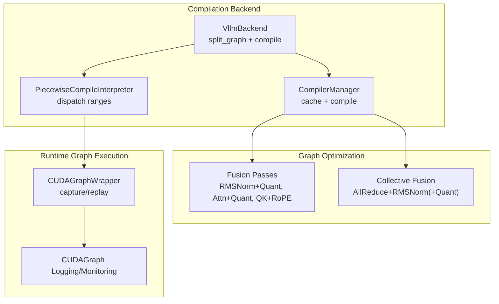
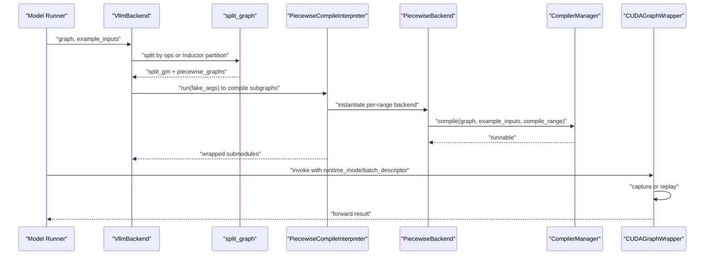
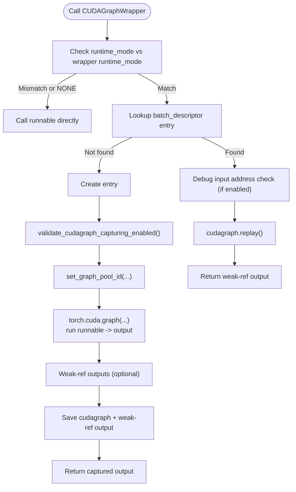
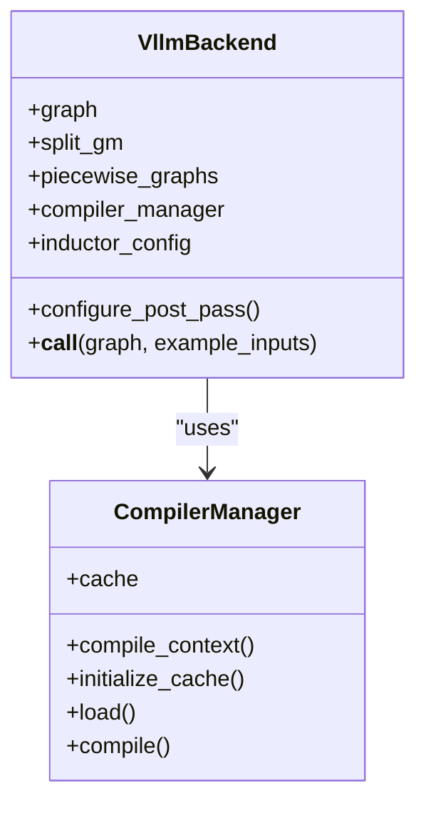
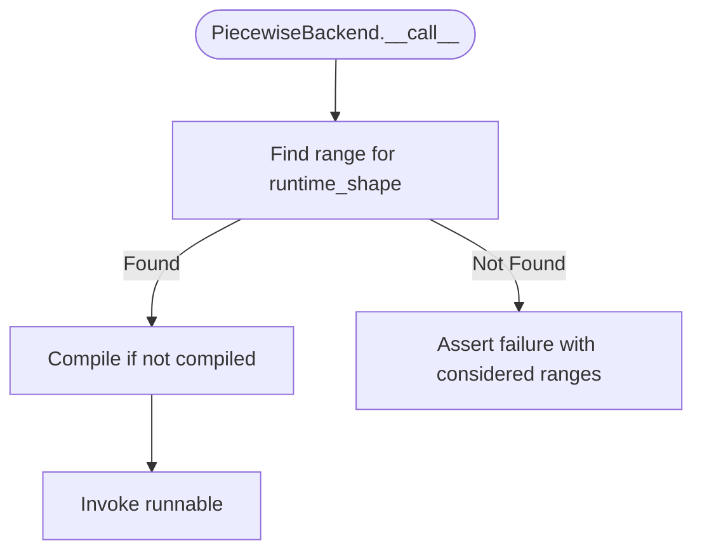
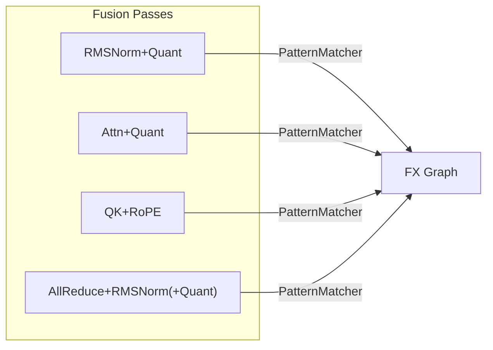
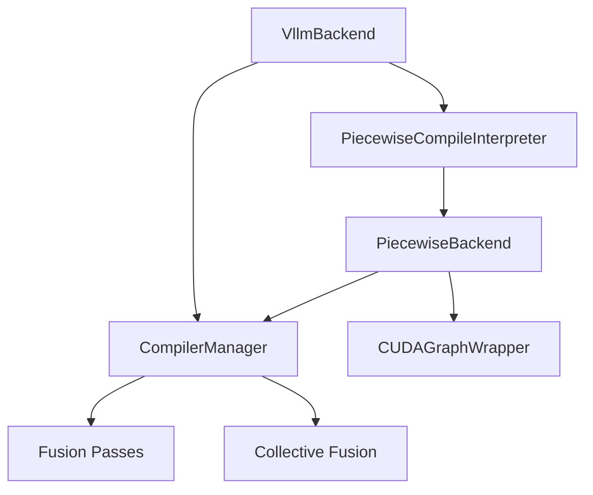

# Compilation and Graph Optimization

<cite>
**Referenced Files in This Document**
- [cuda_graph.py](file://vllm/compilation/cuda_graph.py)
- [backends.py](file://vllm/compilation/backends.py)
- [piecewise_backend.py](file://vllm/compilation/piecewise_backend.py)
- [compilation.py](file://vllm/config/compilation.py)
- [fusion.py](file://vllm/compilation/fusion.py)
- [fusion_attn.py](file://vllm/compilation/fusion_attn.py)
- [qk_norm_rope_fusion.py](file://vllm/compilation/qk_norm_rope_fusion.py)
- [collective_fusion.py](file://vllm/compilation/collective_fusion.py)
- [cuda_graphs.md](file://docs/design/cuda_graphs.md)
- [custom_all_reduce.py](file://vllm/distributed/device_communicators/custom_all_reduce.py)
</cite>

## Table of Contents
1. [Introduction](#introduction)
2. [Project Structure](#project-structure)
3. [Core Components](#core-components)
4. [Architecture Overview](#architecture-overview)
5. [Detailed Component Analysis](#detailed-component-analysis)
6. [Dependency Analysis](#dependency-analysis)
7. [Performance Considerations](#performance-considerations)
8. [Troubleshooting Guide](#troubleshooting-guide)
9. [Conclusion](#conclusion)
10. [Appendices](#appendices)

## Introduction
This document explains vLLM’s compilation strategies and graph optimization with a focus on CUDA graph capturing and replay, piecewise compilation, kernel fusion, and runtime mode selection. It covers how the system builds and manages CUDA graph pools, validates captures, and optimizes memory usage during execution. Practical guidance is included for configuration tuning, debugging, and understanding trade-offs among performance, memory overhead, and compilation coverage.

## Project Structure
The compilation and graph optimization subsystem centers around:
- Backend orchestration and caching
- Piecewise compilation and dispatch
- CUDA graph capture/replay wrappers
- Kernel fusion passes for quantization, attention, QK/RoPE, and collective fusion
- Configuration for compilation modes, cudagraph modes, and dynamic shapes

**Diagram sources**
- [backends.py](file://vllm/compilation/backends.py#L489-L800)
- [piecewise_backend.py](file://vllm/compilation/piecewise_backend.py#L1-L178)
- [cuda_graph.py](file://vllm/compilation/cuda_graph.py#L137-L303)
- [fusion.py](file://vllm/compilation/fusion.py#L477-L551)
- [fusion_attn.py](file://vllm/compilation/fusion_attn.py#L307-L360)
- [qk_norm_rope_fusion.py](file://vllm/compilation/qk_norm_rope_fusion.py#L181-L239)
- [collective_fusion.py](file://vllm/compilation/collective_fusion.py#L401-L452)

**Section sources**
- [backends.py](file://vllm/compilation/backends.py#L489-L800)
- [compilation.py](file://vllm/config/compilation.py#L465-L546)

## Core Components
- VllmBackend orchestrates FX graph splitting, post-grad passes, and invokes piecewise compilation interpreters.
- CompilerManager handles cache initialization, compile/load cycles, and artifact persistence.
- PiecewiseBackend manages compile ranges, dispatches by runtime shape, and compiles subgraphs with optional symbolic shapes.
- CUDAGraphWrapper encapsulates capture/replay logic, integrates with runtime mode selection, and manages graph pools and output weak references for memory efficiency.
- Fusion passes (RMSNorm+Quant, Attn+Quant, QK+RoPE, Collective fusion) reduce kernel launches and improve throughput.

**Section sources**
- [backends.py](file://vllm/compilation/backends.py#L489-L800)
- [piecewise_backend.py](file://vllm/compilation/piecewise_backend.py#L1-L178)
- [cuda_graph.py](file://vllm/compilation/cuda_graph.py#L137-L303)
- [fusion.py](file://vllm/compilation/fusion.py#L477-L551)
- [fusion_attn.py](file://vllm/compilation/fusion_attn.py#L307-L360)
- [qk_norm_rope_fusion.py](file://vllm/compilation/qk_norm_rope_fusion.py#L181-L239)
- [collective_fusion.py](file://vllm/compilation/collective_fusion.py#L401-L452)

## Architecture Overview
The system composes a vLLM-specific Inductor backend with:
- FX graph splitting and piecewise compilation
- Post-grad custom passes
- Pattern-matcher-based fusion passes
- Optional full or piecewise CUDA graph capture with nested wrapper design

**Diagram sources**
- [backends.py](file://vllm/compilation/backends.py#L698-L800)
- [piecewise_backend.py](file://vllm/compilation/piecewise_backend.py#L130-L178)
- [cuda_graph.py](file://vllm/compilation/cuda_graph.py#L205-L303)

**Section sources**
- [backends.py](file://vllm/compilation/backends.py#L698-L800)
- [cuda_graphs.md](file://docs/design/cuda_graphs.md#L128-L140)

## Detailed Component Analysis

### CUDA Graph Capturing and Replay
- Runtime mode selection: The wrapper inspects the forward context for runtime mode and batch descriptor, and only captures/replays when modes match. This enables nested wrappers for full and piecewise modes.
- Capture lifecycle: Validates capture timing, disables GC for subsequent piecewise graphs after the first, sets a global graph pool, and captures outputs into the pool. Outputs can be weak-referenced to reduce memory pressure.
- Replay safety: In debug mode, input address checks ensure deterministic replay.
- Graph pool management: Uses platform-provided graph pool handle and integrates with NCCL IPC registration for distributed capture correctness.

**Diagram sources**
- [cuda_graph.py](file://vllm/compilation/cuda_graph.py#L205-L303)
- [monitor.py](file://vllm/compilation/monitor.py#L45-L62)

**Section sources**
- [cuda_graph.py](file://vllm/compilation/cuda_graph.py#L137-L303)
- [monitor.py](file://vllm/compilation/monitor.py#L45-L62)
- [custom_all_reduce.py](file://vllm/distributed/device_communicators/custom_all_reduce.py#L199-L231)

### Graph Pool Management and Distributed Capture
- Global graph pool: The wrapper resolves a platform-specific graph pool and sets it before capture. This ensures reuse across captures and reduces overhead.
- Distributed synchronization: During capture, the communicator registers graph buffer IPC meta across ranks to ensure replay correctness in multi-GPU/multi-node environments.

**Section sources**
- [cuda_graph.py](file://vllm/compilation/cuda_graph.py#L177-L188)
- [custom_all_reduce.py](file://vllm/distributed/device_communicators/custom_all_reduce.py#L199-L231)

### Runtime Mode Selection and Nested Wrapper Design
- Modes: NONE, PIECEWISE, FULL, FULL_DECODE_ONLY, FULL_AND_PIECEWISE. The wrapper enforces strict mode matching to avoid mismatches.
- Nested design: Full-mode wrapper can wrap the entire model; piecewise-mode wrapper wraps individual subgraphs. This allows coexistence and compatibility between full and piecewise cudagraphs.

**Section sources**
- [compilation.py](file://vllm/config/compilation.py#L52-L96)
- [cuda_graphs.md](file://docs/design/cuda_graphs.md#L128-L140)

### Compilation Wrappers and Backend Orchestration
- VllmBackend:
  - Computes cache keys from environment, config, compiler, and traced code.
  - Initializes cache directories per rank and prefix.
  - Splits FX graph either via Dynamo FX or Inductor partition rules.
  - Runs piecewise interpreter to compile submodules with symbolic shapes.
  - Applies post-grad passes and optionally evaluates dynamic shape guards.
- CompilerManager:
  - Manages cache load/save, compile/load cycles, and artifact persistence.
  - Coordinates compile context and pass context for each compile range.

**Diagram sources**
- [backends.py](file://vllm/compilation/backends.py#L489-L800)

**Section sources**
- [backends.py](file://vllm/compilation/backends.py#L489-L800)

### Piecewise Compilation and Dispatch
- Range management: Defines compile ranges and compile sizes; supports encoder-specific adjustments.
- Dispatch by runtime shape: Finds the appropriate range entry for the incoming shape and compiles lazily on first use.
- Ending monitoring: On last graph completion and no pending ranges, persists the inductor graph hash and ends monitoring.

**Diagram sources**
- [piecewise_backend.py](file://vllm/compilation/piecewise_backend.py#L156-L178)

**Section sources**
- [piecewise_backend.py](file://vllm/compilation/piecewise_backend.py#L1-L178)
- [compilation.py](file://vllm/config/compilation.py#L433-L463)

### Kernel Fusion Strategies
- RMSNorm + Quant fusion: Replaces RMSNorm followed by static/dynamic/group quant with fused ops; supports fused-add variants.
- Attention + Quant fusion: Fuses post-attention quantization into attention op when supported by the attention implementation.
- QK + RoPE fusion: Replaces separate RMSNorm + RoPE on Q/K with a fused op, with multiple epsilon and Neox variants.
- Collective fusion: Fuses allreduce + RMSNorm (+Quant) into FlashInfer fused kernels; also fuses GEMM + ReduceScatter and AllGather + ScaledMM/CUTLASS.

**Diagram sources**
- [fusion.py](file://vllm/compilation/fusion.py#L477-L551)
- [fusion_attn.py](file://vllm/compilation/fusion_attn.py#L307-L360)
- [qk_norm_rope_fusion.py](file://vllm/compilation/qk_norm_rope_fusion.py#L181-L239)
- [collective_fusion.py](file://vllm/compilation/collective_fusion.py#L401-L452)

**Section sources**
- [fusion.py](file://vllm/compilation/fusion.py#L477-L551)
- [fusion_attn.py](file://vllm/compilation/fusion_attn.py#L307-L360)
- [qk_norm_rope_fusion.py](file://vllm/compilation/qk_norm_rope_fusion.py#L181-L239)
- [collective_fusion.py](file://vllm/compilation/collective_fusion.py#L401-L452)

### Graph Capture Validation and Memory Management
- Validation: Capture timing enforcement prevents illegal captures; input address checks in replay ensure deterministic replay in debug mode.
- Memory management: Weak-referencing outputs reduces peak memory; GC can be disabled during piecewise capture to speed up capture at the cost of temporary memory growth.

**Section sources**
- [monitor.py](file://vllm/compilation/monitor.py#L45-L62)
- [cuda_graph.py](file://vllm/compilation/cuda_graph.py#L244-L288)

## Dependency Analysis
- Coupling:
  - VllmBackend depends on CompilerManager for caching and compilation.
  - PiecewiseCompileInterpreter constructs PiecewiseBackend instances and wraps them with CUDAGraphWrapper when piecewise cudagraphs are enabled.
  - Fusion passes depend on pattern matcher infrastructure and platform-specific ops.
- Cohesion:
  - CUDA graph logic is cohesive within CUDAGraphWrapper and integrated with runtime mode selection.
  - Compilation orchestration is centralized in VllmBackend and CompilerManager.

**Diagram sources**
- [backends.py](file://vllm/compilation/backends.py#L489-L800)
- [piecewise_backend.py](file://vllm/compilation/piecewise_backend.py#L1-L178)
- [cuda_graph.py](file://vllm/compilation/cuda_graph.py#L137-L303)

**Section sources**
- [backends.py](file://vllm/compilation/backends.py#L489-L800)
- [piecewise_backend.py](file://vllm/compilation/piecewise_backend.py#L1-L178)
- [cuda_graph.py](file://vllm/compilation/cuda_graph.py#L137-L303)

## Performance Considerations
- Compilation trade-offs:
  - General shape compilation is often sufficient; targeted small-size compilations can further optimize hotspots.
  - Piecewise cudagraphs reduce fragmentation and improve throughput for heterogeneous shapes; full cudagraphs can be beneficial for small models or decode-only workloads.
- Memory overhead:
  - Graph pools reduce repeated allocations; weak-referencing outputs lowers peak memory.
  - Disabling GC during piecewise capture accelerates capture but increases temporary memory.
- Optimal graph sizing:
  - Use capture size patterns tailored to workload distributions; avoid capturing extremely large graphs to prevent long warmup times and OOM risks.

[No sources needed since this section provides general guidance]

## Troubleshooting Guide
- Illegal capture detection: If capture occurs at an inappropriate time, a runtime error is raised to prevent undefined behavior.
- Debugging replay mismatches: Enable debug logging to compare input tensor addresses at replay time; mismatches indicate incorrect buffer reuse or shape drift.
- Distributed capture correctness: Ensure graph buffer IPC registration completes across ranks; failures can cause replay errors in multi-GPU setups.

**Section sources**
- [monitor.py](file://vllm/compilation/monitor.py#L45-L62)
- [cuda_graph.py](file://vllm/compilation/cuda_graph.py#L290-L302)
- [custom_all_reduce.py](file://vllm/distributed/device_communicators/custom_all_reduce.py#L199-L231)

## Conclusion
vLLM’s compilation and graph optimization stack combines a flexible Inductor backend, precise piecewise compilation, and robust CUDA graph capture/replay with strong memory management. Fusion passes further reduce kernel launches and improve throughput. Proper configuration of cudagraph modes, compile ranges, and dynamic shapes yields significant performance gains with controlled memory overhead.

[No sources needed since this section summarizes without analyzing specific files]

## Appendices

### Practical Configuration Guidance
- CUDAGraph modes:
  - FULL_AND_PIECEWISE is recommended for most models; FULL_DECODE_ONLY can reduce memory for decode-heavy workloads.
- Compile ranges and sizes:
  - Define compile_ranges_split_points and compile_sizes to balance coverage and compilation cost.
- Dynamic shapes:
  - Choose dynamic shapes type (backed/unbacked/backed_size_oblivious) based on stability and accuracy needs; evaluate guards when debugging specialization.

**Section sources**
- [compilation.py](file://vllm/config/compilation.py#L433-L546)
- [compilation.py](file://vllm/config/compilation.py#L233-L290)