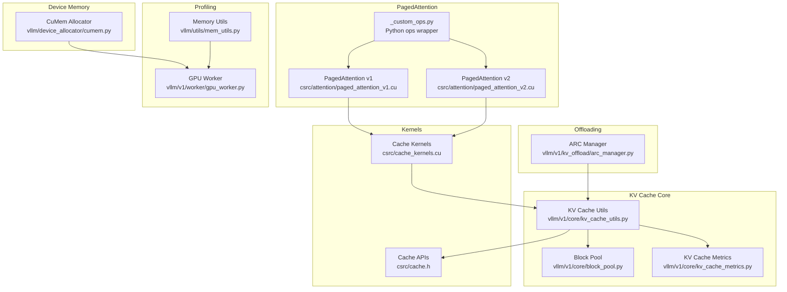
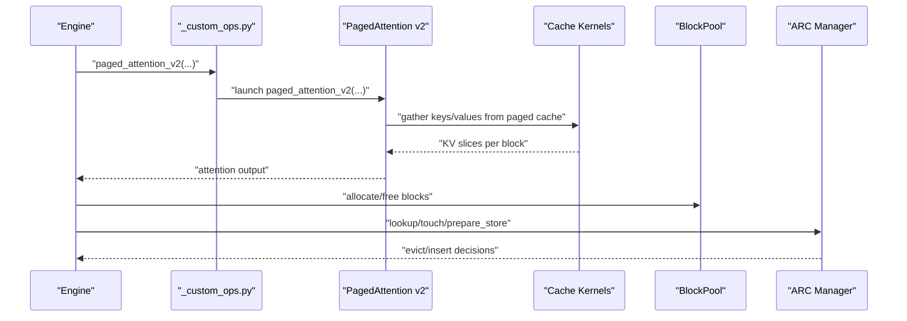
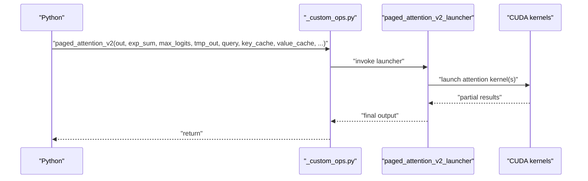
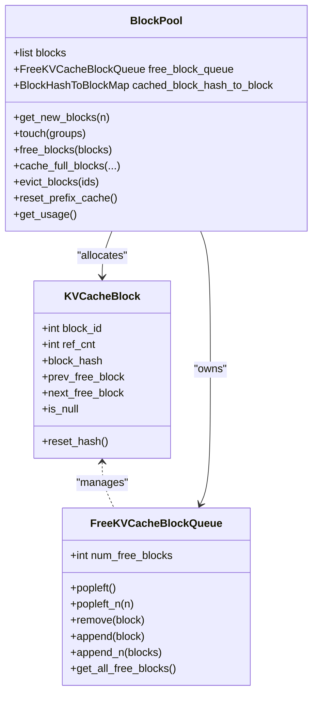
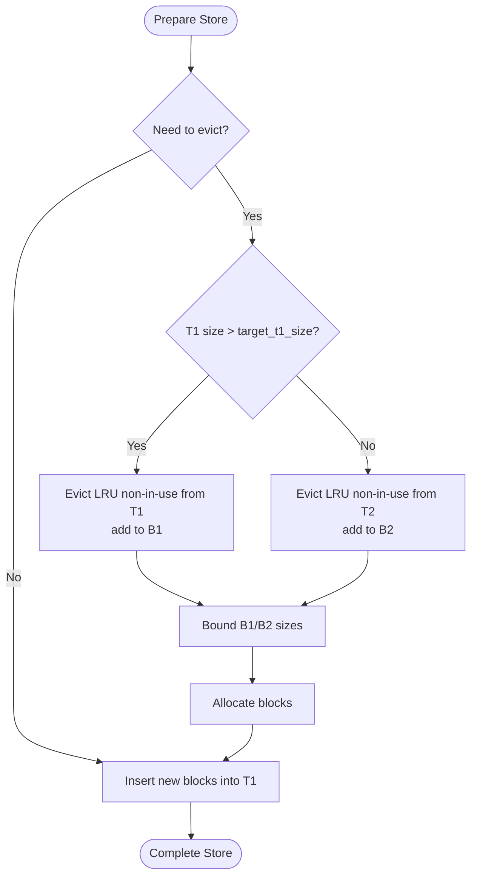
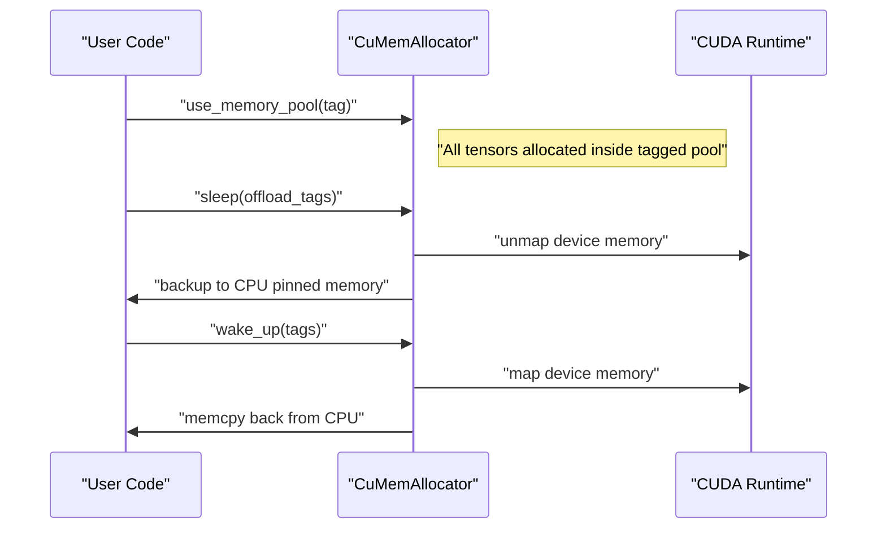
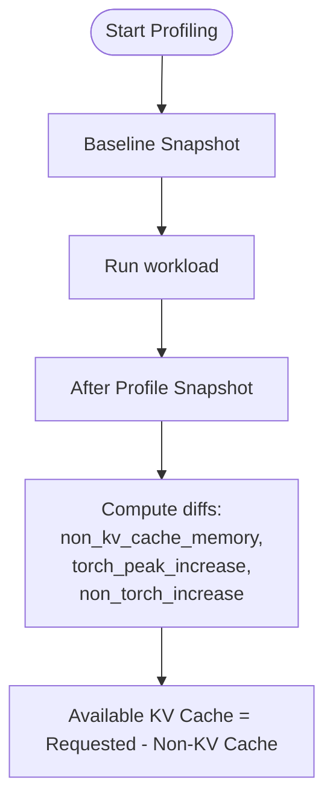
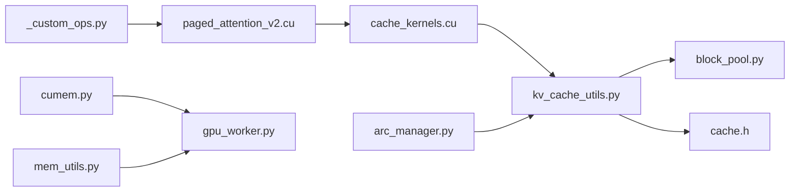

# Memory Management

<cite>
**Referenced Files in This Document**
- [README.md](file://README.md)
- [conserving_memory.md](file://docs/configuration/conserving_memory.md)
- [optimization.md](file://docs/configuration/optimization.md)
- [cache.h](file://csrc/cache.h)
- [cache_kernels.cu](file://csrc/cache_kernels.cu)
- [paged_attention_v1.cu](file://csrc/attention/paged_attention_v1.cu)
- [paged_attention_v2.cu](file://csrc/attention/paged_attention_v2.cu)
- [_custom_ops.py](file://vllm/_custom_ops.py)
- [kv_cache_utils.py](file://vllm/v1/core/kv_cache_utils.py)
- [block_pool.py](file://vllm/v1/core/block_pool.py)
- [arc_manager.py](file://vllm/v1/kv_offload/arc_manager.py)
- [kv_cache_metrics.py](file://vllm/v1/core/kv_cache_metrics.py)
- [cumem.py](file://vllm/device_allocator/cumem.py)
- [mem_utils.py](file://vllm/utils/mem_utils.py)
- [gpu_worker.py](file://vllm/v1/worker/gpu_worker.py)
- [test_attention.py](file://tests/kernels/attention/test_attention.py)
- [test_cpu_attn.py](file://tests/kernels/attention/test_cpu_attn.py)
- [test_cumem.py](file://tests/basic_correctness/test_cumem.py)
- [test_mem_utils.py](file://tests/utils_/test_mem_utils.py)
- [test_tree_attention.py](file://tests/v1/spec_decode/test_tree_attention.py)
</cite>

## Table of Contents
1. [Introduction](#introduction)
2. [Project Structure](#project-structure)
3. [Core Components](#core-components)
4. [Architecture Overview](#architecture-overview)
5. [Detailed Component Analysis](#detailed-component-analysis)
6. [Dependency Analysis](#dependency-analysis)
7. [Performance Considerations](#performance-considerations)
8. [Troubleshooting Guide](#troubleshooting-guide)
9. [Conclusion](#conclusion)
10. [Appendices](#appendices)

## Introduction
This document explains memory management optimization in vLLM with a focus on PagedAttention, KV cache management, and memory allocation patterns. It covers block pooling, memory compaction, cache eviction policies, and practical strategies for large-scale deployments. It also documents memory profiling tools, monitoring, and optimization techniques to prevent memory bottlenecks and fragmentation.

## Project Structure
Key memory management areas in the repository:
- PagedAttention CUDA kernels and Python bindings
- KV cache storage, hashing, and block pooling
- Offloading manager with ARC eviction policy
- Device memory allocator with sleep/wake semantics
- Memory profiling utilities and worker-side memory accounting
- Configuration guidance for memory conservation

**Diagram sources**
- [paged_attention_v1.cu](file://csrc/attention/paged_attention_v1.cu#L43-L67)
- [paged_attention_v2.cu](file://csrc/attention/paged_attention_v2.cu#L43-L67)
- [_custom_ops.py](file://vllm/_custom_ops.py#L73-L120)
- [kv_cache_utils.py](file://vllm/v1/core/kv_cache_utils.py#L107-L154)
- [block_pool.py](file://vllm/v1/core/block_pool.py#L128-L181)
- [kv_cache_metrics.py](file://vllm/v1/core/kv_cache_metrics.py#L46-L97)
- [arc_manager.py](file://vllm/v1/kv_offload/arc_manager.py#L16-L65)
- [cumem.py](file://vllm/device_allocator/cumem.py#L113-L200)
- [cache.h](file://csrc/cache.h#L9-L27)
- [cache_kernels.cu](file://csrc/cache_kernels.cu#L210-L284)
- [mem_utils.py](file://vllm/utils/mem_utils.py#L127-L161)
- [gpu_worker.py](file://vllm/v1/worker/gpu_worker.py#L330-L347)

**Section sources**
- [README.md](file://README.md#L70-L82)
- [conserving_memory.md](file://docs/configuration/conserving_memory.md#L37-L110)

## Core Components
- PagedAttention v1/v2: CUDA kernels implementing attention over paged KV caches, with partitioning and scaling support.
- KV cache utilities: block metadata, hashing, block queues, and memory sizing helpers.
- Block pool: manages free blocks, prefix caching, and eviction.
- ARC offloading manager: adaptive replacement cache with ghost lists and target tuning.
- Device memory allocator: pluggable allocator with sleep/wake to offload/reclaim memory.
- Profiling and monitoring: memory snapshots, profiling results, and worker-side memory accounting.

**Section sources**
- [paged_attention_v1.cu](file://csrc/attention/paged_attention_v1.cu#L43-L67)
- [paged_attention_v2.cu](file://csrc/attention/paged_attention_v2.cu#L43-L67)
- [kv_cache_utils.py](file://vllm/v1/core/kv_cache_utils.py#L107-L154)
- [block_pool.py](file://vllm/v1/core/block_pool.py#L128-L181)
- [arc_manager.py](file://vllm/v1/kv_offload/arc_manager.py#L16-L65)
- [cumem.py](file://vllm/device_allocator/cumem.py#L113-L200)
- [mem_utils.py](file://vllm/utils/mem_utils.py#L127-L161)
- [gpu_worker.py](file://vllm/v1/worker/gpu_worker.py#L330-L347)

## Architecture Overview
The memory architecture integrates attention computation with paged KV caches, block pooling, and offloading. PagedAttention reads from key/value caches indexed by block tables and sequence lengths. KV cache utilities manage block hashing and allocation ordering. ARC manages eviction and promotes frequently accessed blocks. The device allocator enables memory sleep/wake to reclaim GPU memory.

**Diagram sources**
- [_custom_ops.py](file://vllm/_custom_ops.py#L73-L120)
- [paged_attention_v2.cu](file://csrc/attention/paged_attention_v2.cu#L43-L67)
- [cache_kernels.cu](file://csrc/cache_kernels.cu#L210-L284)
- [block_pool.py](file://vllm/v1/core/block_pool.py#L294-L324)
- [arc_manager.py](file://vllm/v1/kv_offload/arc_manager.py#L66-L120)

## Detailed Component Analysis

### PagedAttention Implementation
- v1 and v2 share a similar signature with query, key/value caches, block tables, and sequence lengths. v2 introduces partitioning and temporary buffers for numerical stability.
- The launcher computes strides and dimensions, and routes to the appropriate kernel launchers.
- Python wrapper exposes parameters including KV cache dtype, scales, and block size.

**Diagram sources**
- [_custom_ops.py](file://vllm/_custom_ops.py#L73-L120)
- [paged_attention_v2.cu](file://csrc/attention/paged_attention_v2.cu#L43-L67)

**Section sources**
- [paged_attention_v1.cu](file://csrc/attention/paged_attention_v1.cu#L42-L66)
- [paged_attention_v2.cu](file://csrc/attention/paged_attention_v2.cu#L43-L67)
- [_custom_ops.py](file://vllm/_custom_ops.py#L73-L120)

### KV Cache Management Strategies
- Block metadata and free list: doubly-linked free queue supports O(1) removal/appending for eviction ordering.
- Hashing and prefix caching: block-level hashes enable cache hits across requests; cached blocks are tracked and can be evicted when allocating new blocks.
- Memory sizing: utilities compute maximum memory usage and estimate feasible model length given available memory.

**Diagram sources**
- [kv_cache_utils.py](file://vllm/v1/core/kv_cache_utils.py#L107-L154)
- [kv_cache_utils.py](file://vllm/v1/core/kv_cache_utils.py#L156-L365)
- [block_pool.py](file://vllm/v1/core/block_pool.py#L128-L181)
- [block_pool.py](file://vllm/v1/core/block_pool.py#L294-L324)
- [block_pool.py](file://vllm/v1/core/block_pool.py#L366-L399)

**Section sources**
- [kv_cache_utils.py](file://vllm/v1/core/kv_cache_utils.py#L107-L154)
- [kv_cache_utils.py](file://vllm/v1/core/kv_cache_utils.py#L156-L365)
- [block_pool.py](file://vllm/v1/core/block_pool.py#L128-L181)
- [block_pool.py](file://vllm/v1/core/block_pool.py#L294-L324)
- [block_pool.py](file://vllm/v1/core/block_pool.py#L366-L399)

### Memory Compaction and Cache Eviction Policies
- ARC (Adaptive Replacement Cache): maintains T1/T2 sets and ghost lists B1/B2; adaptive target controls recency vs. frequency trade-off; eviction chooses oldest non-in-use block respecting targets.
- Touch operations promote blocks and tune target based on ghost list hits.
- BlockPool eviction ensures cached blocks are removed and metadata reset when allocating.

**Diagram sources**
- [arc_manager.py](file://vllm/v1/kv_offload/arc_manager.py#L122-L203)
- [arc_manager.py](file://vllm/v1/kv_offload/arc_manager.py#L66-L120)
- [block_pool.py](file://vllm/v1/core/block_pool.py#L326-L365)

**Section sources**
- [arc_manager.py](file://vllm/v1/kv_offload/arc_manager.py#L16-L65)
- [arc_manager.py](file://vllm/v1/kv_offload/arc_manager.py#L122-L203)
- [block_pool.py](file://vllm/v1/core/block_pool.py#L326-L365)

### Memory Allocation Patterns and Device Allocator
- CuMemAllocator provides a pluggable CUDA allocator with tagging and sleep/wake semantics. Sleep offloads tagged allocations to CPU and discards others; wake restores them.
- The allocator tracks allocation handles and CPU backups, and logs reclaimed memory statistics.

**Diagram sources**
- [cumem.py](file://vllm/device_allocator/cumem.py#L113-L200)
- [cumem.py](file://vllm/device_allocator/cumem.py#L201-L275)

**Section sources**
- [cumem.py](file://vllm/device_allocator/cumem.py#L113-L200)
- [cumem.py](file://vllm/device_allocator/cumem.py#L201-L275)
- [test_cumem.py](file://tests/basic_correctness/test_cumem.py#L43-L87)

### Memory Profiling Tools and Monitoring
- Memory profiling captures snapshots before/after profiling, separates Torch-managed vs. non-Torch usage, and measures peak increases.
- Worker-side memory accounting subtracts non-KV cache memory from total requested memory to derive available KV cache budget.

**Diagram sources**
- [mem_utils.py](file://vllm/utils/mem_utils.py#L127-L161)
- [gpu_worker.py](file://vllm/v1/worker/gpu_worker.py#L330-L347)

**Section sources**
- [mem_utils.py](file://vllm/utils/mem_utils.py#L127-L161)
- [gpu_worker.py](file://vllm/v1/worker/gpu_worker.py#L330-L347)
- [test_mem_utils.py](file://tests/utils_/test_mem_utils.py#L1-L63)

### Practical Examples and Tuning
- PagedAttention usage and block-size assumptions are validated in tests; v2 uses partitioning and temporary buffers.
- CPU attention reference demonstrates block-table indexing and block-size-aware gathering.
- Spec decode tests illustrate block table construction and block allocation.

**Section sources**
- [test_attention.py](file://tests/kernels/attention/test_attention.py#L87-L109)
- [test_attention.py](file://tests/kernels/attention/test_attention.py#L245-L280)
- [test_cpu_attn.py](file://tests/kernels/attention/test_cpu_attn.py#L90-L130)
- [test_tree_attention.py](file://tests/v1/spec_decode/test_tree_attention.py#L199-L230)

## Dependency Analysis
- PagedAttention depends on cache kernels for block copy and reshape-and-cache operations.
- KV cache utilities depend on block metadata and hash structures; BlockPool orchestrates allocation and eviction.
- ARC manager coordinates with backend storage and maintains adaptive targets.
- Device allocator integrates with CUDA runtime for memory mapping/unmapping.

**Diagram sources**
- [_custom_ops.py](file://vllm/_custom_ops.py#L73-L120)
- [paged_attention_v2.cu](file://csrc/attention/paged_attention_v2.cu#L43-L67)
- [cache_kernels.cu](file://csrc/cache_kernels.cu#L210-L284)
- [kv_cache_utils.py](file://vllm/v1/core/kv_cache_utils.py#L107-L154)
- [block_pool.py](file://vllm/v1/core/block_pool.py#L128-L181)
- [arc_manager.py](file://vllm/v1/kv_offload/arc_manager.py#L16-L65)
- [cumem.py](file://vllm/device_allocator/cumem.py#L113-L200)
- [mem_utils.py](file://vllm/utils/mem_utils.py#L127-L161)
- [gpu_worker.py](file://vllm/v1/worker/gpu_worker.py#L330-L347)

**Section sources**
- [cache.h](file://csrc/cache.h#L9-L27)
- [cache_kernels.cu](file://csrc/cache_kernels.cu#L210-L284)
- [kv_cache_utils.py](file://vllm/v1/core/kv_cache_utils.py#L107-L154)
- [block_pool.py](file://vllm/v1/core/block_pool.py#L128-L181)
- [arc_manager.py](file://vllm/v1/kv_offload/arc_manager.py#L16-L65)
- [cumem.py](file://vllm/device_allocator/cumem.py#L113-L200)
- [mem_utils.py](file://vllm/utils/mem_utils.py#L127-L161)
- [gpu_worker.py](file://vllm/v1/worker/gpu_worker.py#L330-L347)

## Performance Considerations
- PagedAttention v2 uses partitioning and temporary buffers to improve numerical stability and throughput; ensure block size divides sequence length cleanly to avoid partial partitions.
- Block pooling and ARC eviction minimize cache misses and reduce reallocations; tune block size to balance alignment and occupancy.
- Device allocator sleep/wake reduces peak memory spikes during heavy workloads; tag allocations to selectively offload.
- Memory profiling helps identify non-Torch overhead and peak activation memory to guide capacity planning.

[No sources needed since this section provides general guidance]

## Troubleshooting Guide
- Memory profiling anomalies: ensure no other process modifies GPU memory during profiling; verify snapshot differences and available KV cache budget.
- Fragmentation prevention: prefer aligned block sizes and consistent KV cache dtypes; use ARC to evict infrequent blocks and keep hot blocks in T2.
- Offloading correctness: confirm that sleep/wake restores tensors properly and that CPU backups are released to avoid leaks.

**Section sources**
- [gpu_worker.py](file://vllm/v1/worker/gpu_worker.py#L330-L347)
- [test_mem_utils.py](file://tests/utils_/test_mem_utils.py#L1-L63)
- [cumem.py](file://vllm/device_allocator/cumem.py#L201-L275)

## Conclusion
vLLM’s memory management combines paged attention, block pooling, adaptive eviction, and a device allocator with sleep/wake to achieve efficient memory utilization. Proper configuration of block sizes, cache policies, and profiling practices enables large-scale deployments with minimal fragmentation and bottlenecks.

[No sources needed since this section summarizes without analyzing specific files]

## Appendices
- Configuration tips for memory conservation and multi-modal limits are documented in the repository’s configuration guides.

**Section sources**
- [conserving_memory.md](file://docs/configuration/conserving_memory.md#L37-L110)
- [optimization.md](file://docs/configuration/optimization.md#L225-L250)