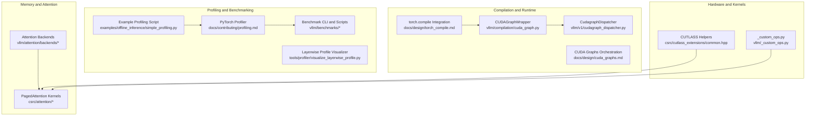
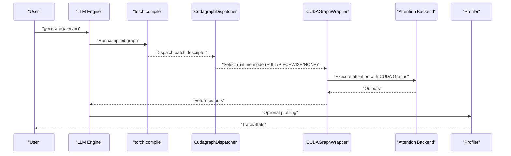
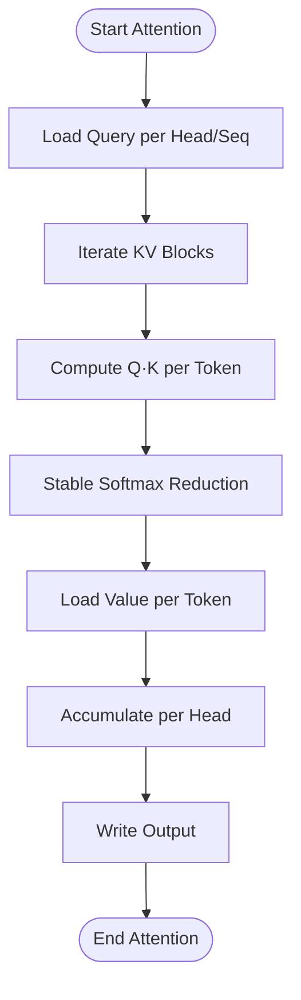
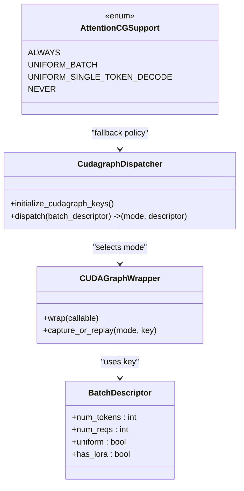
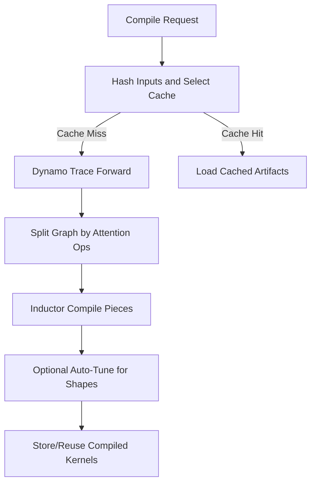
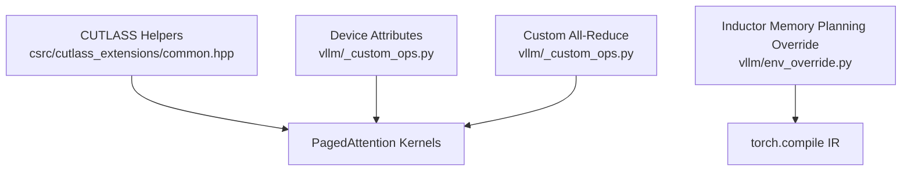
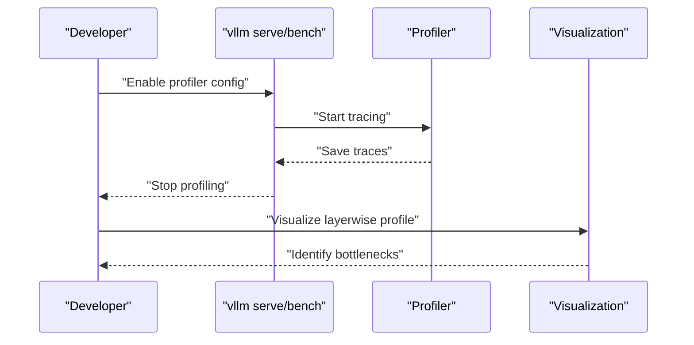
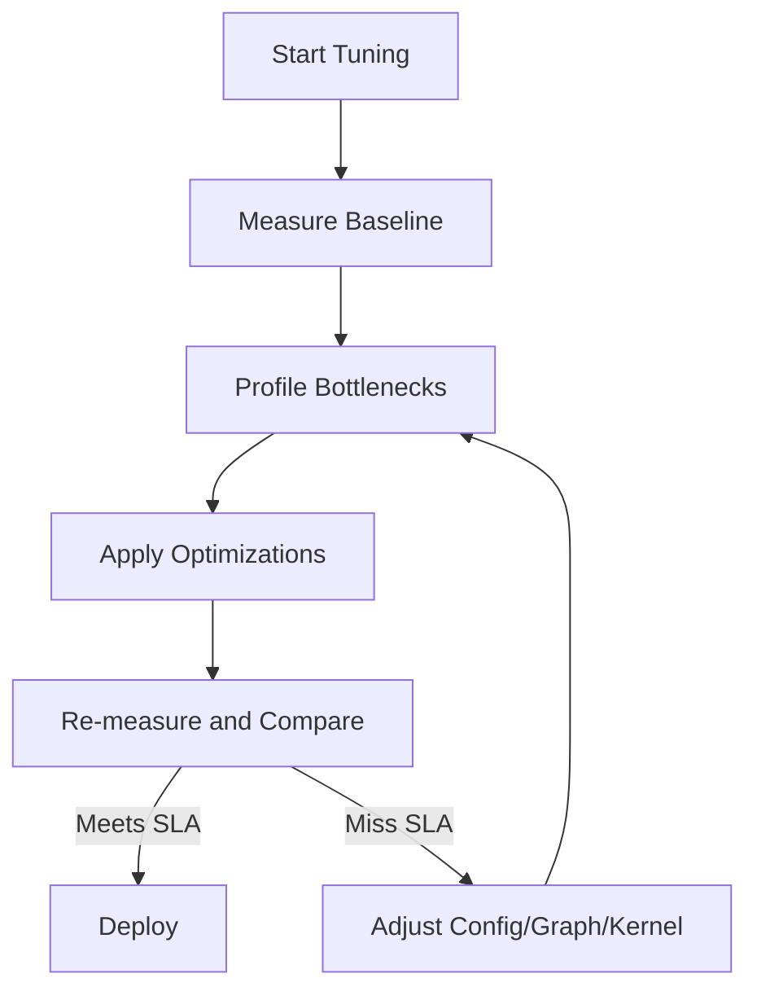
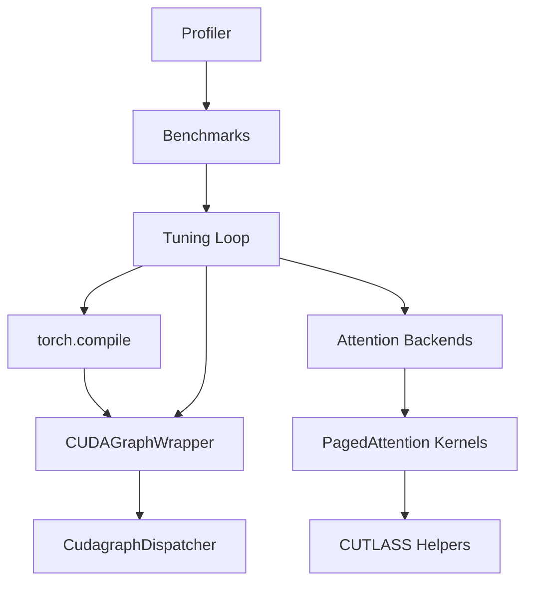

# Performance Optimization

<cite>
**Referenced Files in This Document**
- [cuda_graphs.md](file://docs/design/cuda_graphs.md)
- [torch_compile.md](file://docs/design/torch_compile.md)
- [paged_attention.md](file://docs/design/paged_attention.md)
- [optimization.md](file://docs/configuration/optimization.md)
- [profiling.md](file://docs/contributing/profiling.md)
- [simple_profiling.py](file://examples/offline_inference/simple_profiling.py)
- [benchmark_paged_attention.py](file://benchmarks/kernels/benchmark_paged_attention.py)
- [utils.py](file://benchmarks/kernels/utils.py)
- [latency.py](file://vllm/benchmarks/latency.py)
- [startup.py](file://vllm/benchmarks/startup.py)
- [serve.py](file://vllm/benchmarks/serve.py)
- [common.hpp](file://csrc/cutlass_extensions/common.hpp)
- [_custom_ops.py](file://vllm/_custom_ops.py)
- [env_override.py](file://vllm/env_override.py)
- [test_attention.py](file://tests/kernels/attention/test_attention.py)
- [visualize_layerwise_profile.py](file://tools/profiler/visualize_layerwise_profile.py)
- [auto_tune.sh](file://benchmarks/auto_tune/auto_tune.sh)
- [plot.py](file://vllm/benchmarks/sweep/plot.py)
- [bench_per_token_quant_fp8.py](file://benchmarks/kernels/bench_per_token_quant_fp8.py)
- [README.md](file://benchmarks/README.md)
- [README.md](file://docs/benchmarking/README.md)
</cite>

## Table of Contents
1. [Introduction](#introduction)
2. [Project Structure](#project-structure)
3. [Core Components](#core-components)
4. [Architecture Overview](#architecture-overview)
5. [Detailed Component Analysis](#detailed-component-analysis)
6. [Dependency Analysis](#dependency-analysis)
7. [Performance Considerations](#performance-considerations)
8. [Troubleshooting Guide](#troubleshooting-guide)
9. [Conclusion](#conclusion)
10. [Appendices](#appendices)

## Introduction
This document presents a comprehensive guide to performance optimization in vLLM, focusing on advanced techniques for maximizing throughput and minimizing latency. It explains memory management with PagedAttention, CUDA kernel optimization, and compilation strategies. It also documents profiling tools, performance monitoring, and bottleneck identification, along with CUDA graph optimization, custom kernel development, and hardware-specific optimizations. Practical examples demonstrate performance tuning, custom kernel development, and optimization best practices, including trade-offs and scaling considerations.

## Project Structure
The performance optimization surface spans several subsystems:
- Memory management and attention: PagedAttention kernels and attention backends
- Compilation and runtime graphs: torch.compile integration and CUDA Graphs orchestration
- Profiling and benchmarking: built-in profilers, benchmark suites, and visualization tools
- Hardware and kernel libraries: CUTLASS helpers and device attribute utilities

**Diagram sources**
- [cuda_graphs.md](file://docs/design/cuda_graphs.md#L1-L237)
- [torch_compile.md](file://docs/design/torch_compile.md#L1-L262)
- [paged_attention.md](file://docs/design/paged_attention.md#L1-L513)
- [profiling.md](file://docs/contributing/profiling.md#L1-L229)
- [simple_profiling.py](file://examples/offline_inference/simple_profiling.py#L1-L53)
- [common.hpp](file://csrc/cutlass_extensions/common.hpp#L1-L42)
- [_custom_ops.py](file://vllm/_custom_ops.py#L2453-L2505)

**Section sources**
- [cuda_graphs.md](file://docs/design/cuda_graphs.md#L1-L237)
- [torch_compile.md](file://docs/design/torch_compile.md#L1-L262)
- [paged_attention.md](file://docs/design/paged_attention.md#L1-L513)
- [profiling.md](file://docs/contributing/profiling.md#L1-L229)
- [simple_profiling.py](file://examples/offline_inference/simple_profiling.py#L1-L53)
- [README.md](file://benchmarks/README.md#L1-L21)
- [README.md](file://docs/benchmarking/README.md#L1-L8)

## Core Components
- PagedAttention: Efficient KV-cache paging with optimized memory access patterns and partitioned attention kernels.
- CUDA Graphs: Flexible capture modes (piecewise/full/full-decode-only/full-and-piecewise) orchestrated by a dispatcher and wrapper.
- torch.compile: Default-enabled compilation with dynamic shapes control, caching, and graph partitioning strategies.
- Profiling and Monitoring: PyTorch profiler, Nsight Systems, and benchmarking utilities for latency/throughput/startup.
- Custom Kernels and Hardware Helpers: CUTLASS utilities, device attribute queries, and custom ops for all-reduce and graph buffer management.

**Section sources**
- [paged_attention.md](file://docs/design/paged_attention.md#L1-L513)
- [cuda_graphs.md](file://docs/design/cuda_graphs.md#L1-L237)
- [torch_compile.md](file://docs/design/torch_compile.md#L1-L262)
- [profiling.md](file://docs/contributing/profiling.md#L1-L229)

## Architecture Overview
The performance architecture integrates attention kernels, compilation, and CUDA Graphs orchestration, with profiling and benchmarking supporting iterative tuning.

**Diagram sources**
- [cuda_graphs.md](file://docs/design/cuda_graphs.md#L90-L170)
- [torch_compile.md](file://docs/design/torch_compile.md#L240-L262)

## Detailed Component Analysis

### Memory Management with PagedAttention
PagedAttention organizes KV-cache into fixed-size blocks and uses partitioned attention kernels to maximize memory bandwidth and reduce fragmentation. The kernel design emphasizes:
- Coalesced global-to-shared memory transfers
- Warp-level reductions for softmax stability and throughput
- Partition-aware attention to handle variable-length sequences efficiently

Key implementation references:
- PagedAttention kernel invocation and parameters
- Test coverage for v1/v2 ROCm variants
- Benchmark harness for PagedAttention

**Diagram sources**
- [paged_attention.md](file://docs/design/paged_attention.md#L230-L420)
- [benchmark_paged_attention.py](file://benchmarks/kernels/benchmark_paged_attention.py#L113-L154)
- [test_attention.py](file://tests/kernels/attention/test_attention.py#L196-L280)

**Section sources**
- [paged_attention.md](file://docs/design/paged_attention.md#L1-L513)
- [benchmark_paged_attention.py](file://benchmarks/kernels/benchmark_paged_attention.py#L113-L154)
- [test_attention.py](file://tests/kernels/attention/test_attention.py#L196-L280)

### CUDA Graph Optimization
vLLM’s CUDA Graphs system separates capture logic from compilation and dispatches runtime modes based on batch composition:
- Modes: NONE, PIECEWISE, FULL, FULL_DECODE_ONLY, FULL_AND_PIECEWISE
- Dispatcher selects mode and batch descriptor; wrapper captures/replays graphs
- Attention backend compatibility determines feasibility (ALWAYS, UNIFORM_BATCH, UNIFORM_SINGLE_TOKEN_DECODE, NEVER)

**Diagram sources**
- [cuda_graphs.md](file://docs/design/cuda_graphs.md#L90-L170)

**Section sources**
- [cuda_graphs.md](file://docs/design/cuda_graphs.md#L1-L237)

### torch.compile Integration and Compilation Strategies
- Default enabled with cache directory hashing across configs, compiler settings, and model forward functions
- Dynamic shapes configurable: BACKED, UNBACKED, BACKED_SIZE_OBLIVIOUS
- Graph partitioning and piecewise compilation; full graph capture when attention supports CUDA Graphs
- Auto-tuning for specific shapes can improve kernel performance at the cost of longer warm-up

**Diagram sources**
- [torch_compile.md](file://docs/design/torch_compile.md#L10-L120)
- [torch_compile.md](file://docs/design/torch_compile.md#L168-L218)
- [torch_compile.md](file://docs/design/torch_compile.md#L240-L262)

**Section sources**
- [torch_compile.md](file://docs/design/torch_compile.md#L1-L262)

### Custom Kernel Development and Hardware-Specific Optimizations
- CUTLASS helpers encapsulate error checks and SM-version gating to reduce binary size and enable SM90+ kernels conditionally
- Device attribute queries and custom all-reduce ops expose low-level controls for memory and communication tuning
- Environment overrides refine memory planning for inductor-generated code

**Diagram sources**
- [common.hpp](file://csrc/cutlass_extensions/common.hpp#L1-L42)
- [_custom_ops.py](file://vllm/_custom_ops.py#L2453-L2505)
- [env_override.py](file://vllm/env_override.py#L34-L76)

**Section sources**
- [common.hpp](file://csrc/cutlass_extensions/common.hpp#L1-L42)
- [_custom_ops.py](file://vllm/_custom_ops.py#L2453-L2505)
- [env_override.py](file://vllm/env_override.py#L34-L76)

### Profiling Tools, Performance Monitoring, and Bottleneck Identification
- PyTorch Profiler: enable via CLI/server with configurable options (shapes, memory, stack, FLOPs)
- Nsight Systems: advanced GPU profiling with CUDA graph tracing and fork-before-exec
- Layerwise visualization: parse and plot layer-level profiles for bottleneck localization
- Benchmarking: latency/throughput/startup benchmarks and parameter sweeps for SLA-driven tuning

**Diagram sources**
- [profiling.md](file://docs/contributing/profiling.md#L1-L120)
- [visualize_layerwise_profile.py](file://tools/profiler/visualize_layerwise_profile.py#L428-L465)

**Section sources**
- [profiling.md](file://docs/contributing/profiling.md#L1-L229)
- [simple_profiling.py](file://examples/offline_inference/simple_profiling.py#L1-L53)
- [visualize_layerwise_profile.py](file://tools/profiler/visualize_layerwise_profile.py#L428-L465)

### Performance Measurement, Optimization Trade-offs, and Scaling Considerations
- Throughput vs. latency: tuning max_num_batched_tokens balances ITL/TTFT and overall throughput
- Preemption and recomputation: impacts latency; mitigate by adjusting memory utilization and parallelism
- Parallelism strategies: tensor/pipeline/expert/data parallelism trade-offs for memory and communication overhead
- Startup time: cold/warm startup benchmarks and compilation time considerations
- SLA-driven tuning: parameter sweeps to meet latency targets (e2el, ttft, tpot)

**Diagram sources**
- [optimization.md](file://docs/configuration/optimization.md#L1-L289)
- [latency.py](file://vllm/benchmarks/latency.py#L152-L172)
- [startup.py](file://vllm/benchmarks/startup.py#L272-L298)
- [auto_tune.sh](file://benchmarks/auto_tune/auto_tune.sh#L193-L240)

**Section sources**
- [optimization.md](file://docs/configuration/optimization.md#L1-L289)
- [latency.py](file://vllm/benchmarks/latency.py#L152-L172)
- [startup.py](file://vllm/benchmarks/startup.py#L272-L298)
- [auto_tune.sh](file://benchmarks/auto_tune/auto_tune.sh#L193-L240)

## Dependency Analysis
The performance stack exhibits orthogonal layers with clear separation of concerns:
- Attention backends depend on PagedAttention kernels and CUTLASS helpers
- Compilation and CUDA Graphs orchestration are independent but coordinate via batch descriptors
- Profiling and benchmarking feed back into tuning decisions

**Diagram sources**
- [cuda_graphs.md](file://docs/design/cuda_graphs.md#L90-L170)
- [torch_compile.md](file://docs/design/torch_compile.md#L240-L262)
- [paged_attention.md](file://docs/design/paged_attention.md#L1-L513)
- [common.hpp](file://csrc/cutlass_extensions/common.hpp#L1-L42)

**Section sources**
- [cuda_graphs.md](file://docs/design/cuda_graphs.md#L1-L237)
- [torch_compile.md](file://docs/design/torch_compile.md#L1-L262)
- [paged_attention.md](file://docs/design/paged_attention.md#L1-L513)
- [common.hpp](file://csrc/cutlass_extensions/common.hpp#L1-L42)

## Performance Considerations
- Memory footprint: prefer larger KV cache utilization to reduce preemption; leverage chunked prefill to balance compute-bound and memory-bound work
- Parallelism: TP/PP/EP/DP trade-offs; batch-level DP for multi-modal encoders can improve throughput
- Compilation: cache reuse, dynamic shapes mode selection, and graph partitioning for piecewise vs. full capture
- CUDA Graphs: select appropriate mode per backend capability; use piecewise for flexibility and full for decode-heavy workloads
- Profiling: use PyTorch and Nsight for kernel-level insights; visualize layerwise profiles for targeted improvements

[No sources needed since this section provides general guidance]

## Troubleshooting Guide
- Profiling slowdown: avoid enabling profiling for production; follow guidance to stop profiler gracefully and manage RPC timeouts
- Memory issues: reduce max_num_seqs/max_num_batched_tokens or increase gpu_memory_utilization; consider pipeline parallelism
- Latency regressions: use parameter sweeps and SLA search to identify feasible configurations; visualize profiles to locate hotspots
- Benchmarking pitfalls: ensure adequate warmup and avoid excessive trace sizes; leverage benchmark CLI and dashboard for regression tracking

**Section sources**
- [profiling.md](file://docs/contributing/profiling.md#L1-L120)
- [optimization.md](file://docs/configuration/optimization.md#L1-L289)
- [serve.py](file://vllm/benchmarks/serve.py#L923-L962)
- [README.md](file://docs/benchmarking/README.md#L1-L8)

## Conclusion
vLLM’s performance architecture combines efficient memory management (PagedAttention), flexible compilation (torch.compile), and robust CUDA Graphs orchestration. Profiling and benchmarking tools enable iterative tuning toward SLA targets. By understanding trade-offs among parallelism, compilation, and graph capture, and by leveraging hardware-specific optimizations, users can maximize throughput and minimize latency across diverse workloads.

[No sources needed since this section summarizes without analyzing specific files]

## Appendices

### Practical Examples and Best Practices
- Enable PyTorch profiling for targeted kernel analysis and export traces for visualization
- Use benchmark suites to measure latency/throughput/startup and automate parameter sweeps
- Apply chunked prefill and tune max_num_batched_tokens for balanced ITL/TTFT/throughput
- Select CUDA Graphs mode based on attention backend capabilities and workload composition
- Develop custom kernels with CUTLASS helpers and device attribute checks; register ops with meta-functions for dynamic shapes

**Section sources**
- [profiling.md](file://docs/contributing/profiling.md#L1-L120)
- [README.md](file://benchmarks/README.md#L1-L21)
- [optimization.md](file://docs/configuration/optimization.md#L1-L289)
- [cuda_graphs.md](file://docs/design/cuda_graphs.md#L1-L237)
- [common.hpp](file://csrc/cutlass_extensions/common.hpp#L1-L42)