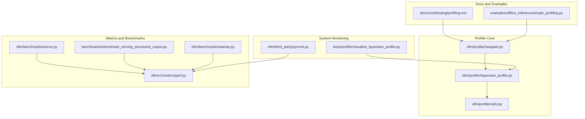
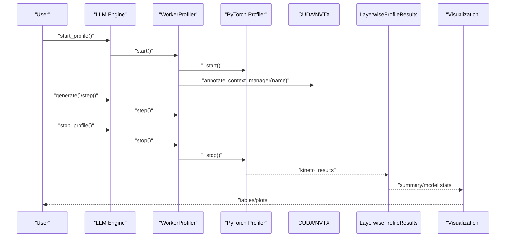
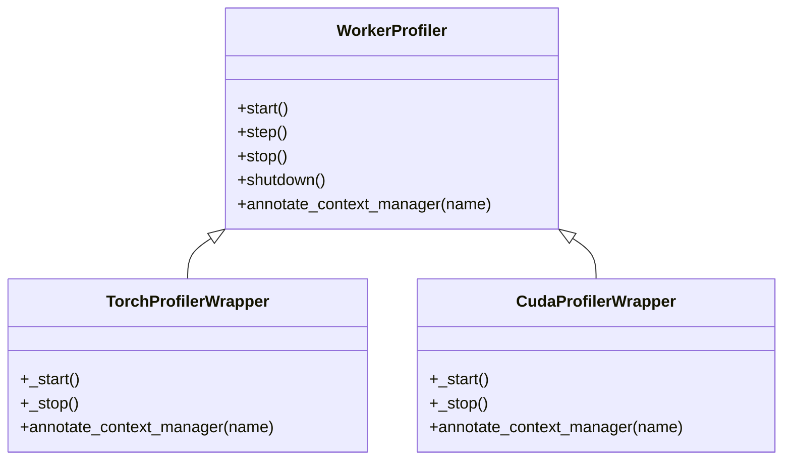
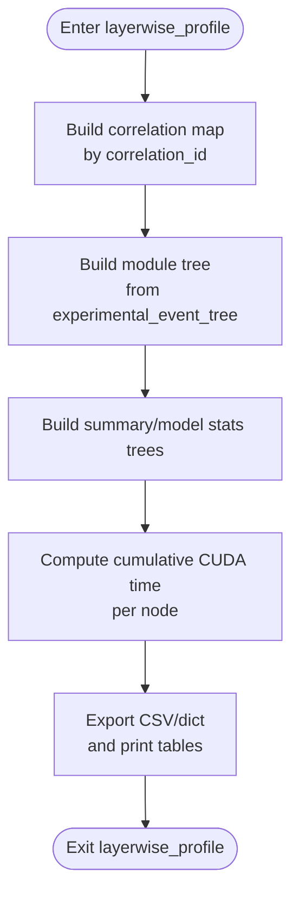
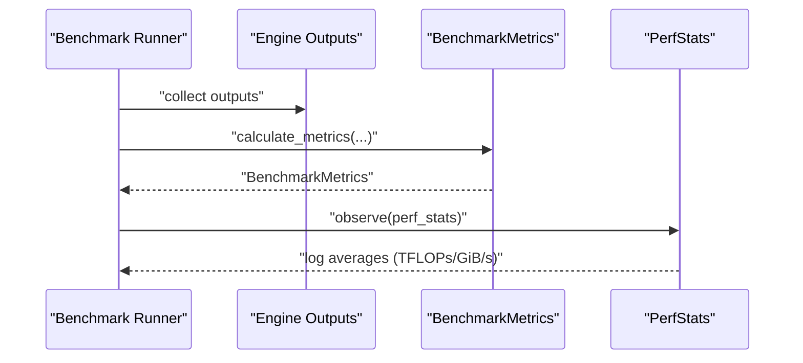
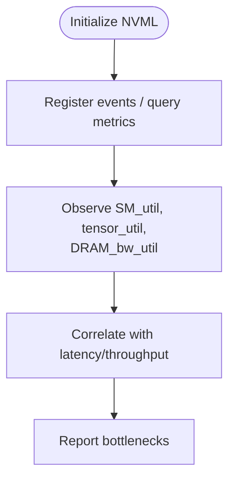
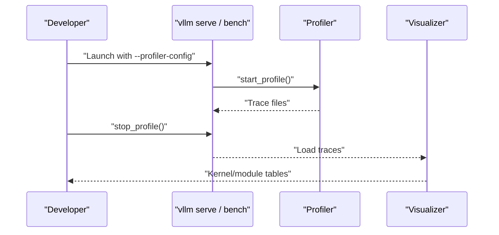
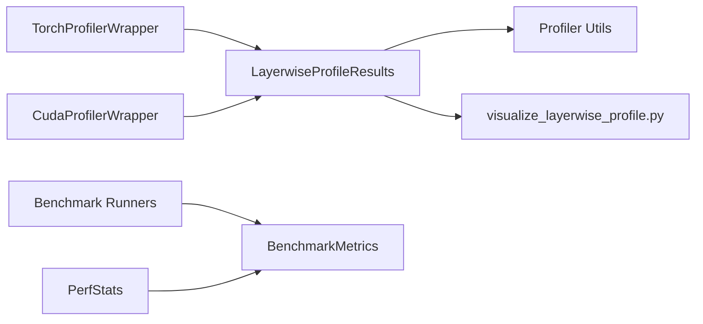

# Profiling and Performance Monitoring

<cite>
**Referenced Files in This Document**
- [profiling.md](file://docs/contributing/profiling.md)
- [simple_profiling.py](file://examples/offline_inference/simple_profiling.py)
- [layerwise_profile.py](file://vllm/profiler/layerwise_profile.py)
- [utils.py](file://vllm/profiler/utils.py)
- [wrapper.py](file://vllm/profiler/wrapper.py)
- [perf.py](file://vllm/v1/metrics/perf.py)
- [metrics.md](file://docs/design/metrics.md)
- [serve.py](file://vllm/benchmarks/serve.py)
- [benchmark_serving_structured_output.py](file://benchmarks/benchmark_serving_structured_output.py)
- [startup.py](file://vllm/benchmarks/startup.py)
- [pynvml.py](file://vllm/third_party/pynvml.py)
- [profiler/visualize_layerwise_profile.py](file://tools/profiler/visualize_layerwise_profile.py)
</cite>

## Table of Contents
1. [Introduction](#introduction)
2. [Project Structure](#project-structure)
3. [Core Components](#core-components)
4. [Architecture Overview](#architecture-overview)
5. [Detailed Component Analysis](#detailed-component-analysis)
6. [Dependency Analysis](#dependency-analysis)
7. [Performance Considerations](#performance-considerations)
8. [Troubleshooting Guide](#troubleshooting-guide)
9. [Conclusion](#conclusion)
10. [Appendices](#appendices)

## Introduction
This document explains how to profile and monitor performance in vLLM. It covers built-in profiling tools, layer-wise profiling, CUDA/NVTX event tracking, system resource monitoring, and performance benchmarking. It also describes how to interpret metrics, detect regressions, validate optimizations, and integrate profiling workflows into development and CI.

## Project Structure
The profiling and performance monitoring capabilities span several areas:
- Documentation and examples for profiling workflows
- Layer-wise profiling utilities and wrappers around PyTorch and CUDA profilers
- Metrics and benchmarking modules for latency, throughput, and startup time
- Tools for visualizing layer-wise profiles and interpreting results

**Diagram sources**
- [profiling.md](file://docs/contributing/profiling.md#L1-L229)
- [simple_profiling.py](file://examples/offline_inference/simple_profiling.py#L1-L53)
- [layerwise_profile.py](file://vllm/profiler/layerwise_profile.py#L1-L393)
- [utils.py](file://vllm/profiler/utils.py#L1-L152)
- [wrapper.py](file://vllm/profiler/wrapper.py#L1-L242)
- [perf.py](file://vllm/v1/metrics/perf.py#L1-L800)
- [serve.py](file://vllm/benchmarks/serve.py#L315-L1527)
- [benchmark_serving_structured_output.py](file://benchmarks/benchmark_serving_structured_output.py#L381-L644)
- [startup.py](file://vllm/benchmarks/startup.py#L272-L298)
- [pynvml.py](file://vllm/third_party/pynvml.py#L5571-L5582)
- [visualize_layerwise_profile.py](file://tools/profiler/visualize_layerwise_profile.py#L428-L465)

**Section sources**
- [profiling.md](file://docs/contributing/profiling.md#L1-L229)
- [layerwise_profile.py](file://vllm/profiler/layerwise_profile.py#L1-L393)
- [wrapper.py](file://vllm/profiler/wrapper.py#L1-L242)
- [perf.py](file://vllm/v1/metrics/perf.py#L1-L800)
- [serve.py](file://vllm/benchmarks/serve.py#L315-L1527)
- [benchmark_serving_structured_output.py](file://benchmarks/benchmark_serving_structured_output.py#L381-L644)
- [startup.py](file://vllm/benchmarks/startup.py#L272-L298)
- [pynvml.py](file://vllm/third_party/pynvml.py#L5571-L5582)
- [visualize_layerwise_profile.py](file://tools/profiler/visualize_layerwise_profile.py#L428-L465)

## Core Components
- PyTorch Profiler integration for CPU/CUDA tracing and module-aware layer profiling
- CUDA/NVTX range annotations for kernel-level visibility
- Layer-wise profiling results builder that correlates Kineto events with module names and computes cumulative CUDA time
- Utilities for printing hierarchical tables and extracting stack traces
- WorkerProfiler lifecycle controls with delayed start and max iteration limits
- Metrics and benchmarking for latency, throughput, and startup time
- System resource monitoring via NVML for GPU utilization and bandwidth metrics

**Section sources**
- [wrapper.py](file://vllm/profiler/wrapper.py#L1-L242)
- [layerwise_profile.py](file://vllm/profiler/layerwise_profile.py#L1-L393)
- [utils.py](file://vllm/profiler/utils.py#L1-L152)
- [perf.py](file://vllm/v1/metrics/perf.py#L1-L800)
- [serve.py](file://vllm/benchmarks/serve.py#L315-L1527)
- [pynvml.py](file://vllm/third_party/pynvml.py#L5571-L5582)

## Architecture Overview
The profiling pipeline integrates user-driven profiling sessions with worker-level instrumentation and system-level telemetry.

**Diagram sources**
- [wrapper.py](file://vllm/profiler/wrapper.py#L1-L242)
- [layerwise_profile.py](file://vllm/profiler/layerwise_profile.py#L365-L393)
- [visualize_layerwise_profile.py](file://tools/profiler/visualize_layerwise_profile.py#L428-L465)

## Detailed Component Analysis

### PyTorch and CUDA Profiler Wrappers
- WorkerProfiler orchestrates delayed profiling start and enforced stop after a configurable number of iterations.
- TorchProfilerWrapper enables CPU/CUDA/XPU profiling, shape/mem/FLOPs recording, stack traces, and TensorBoard trace handler.
- CudaProfilerWrapper integrates CUDA/NVTX ranges for kernel-level annotation.

**Diagram sources**
- [wrapper.py](file://vllm/profiler/wrapper.py#L1-L242)

**Section sources**
- [wrapper.py](file://vllm/profiler/wrapper.py#L1-L242)

### Layer-wise Profiling and Results
- layerwise_profile extends PyTorch’s profile context and builds a module-aware tree from Kineto events.
- LayerwiseProfileResults computes cumulative CUDA time per module, constructs summary and model-level stats, and exports CSV or dictionaries.
- Utils provide helpers for event traversal, stack trace extraction, and pretty-printing.

**Diagram sources**
- [layerwise_profile.py](file://vllm/profiler/layerwise_profile.py#L170-L393)
- [utils.py](file://vllm/profiler/utils.py#L1-L152)

**Section sources**
- [layerwise_profile.py](file://vllm/profiler/layerwise_profile.py#L1-L393)
- [utils.py](file://vllm/profiler/utils.py#L1-L152)

### Performance Metrics Collection and Benchmarking
- Latency/throughput metrics are computed from request outputs and durations, including TTFT, ITL, TPOT, and end-to-end latency.
- Startup time benchmarks report cold/warm averages and percentiles.
- Performance metrics module estimates FLOPs, read/write bytes, and derived TFLOPs/GiB/s rates.

**Diagram sources**
- [serve.py](file://vllm/benchmarks/serve.py#L315-L846)
- [benchmark_serving_structured_output.py](file://benchmarks/benchmark_serving_structured_output.py#L381-L644)
- [startup.py](file://vllm/benchmarks/startup.py#L272-L298)
- [perf.py](file://vllm/v1/metrics/perf.py#L1177-L1213)

**Section sources**
- [serve.py](file://vllm/benchmarks/serve.py#L315-L846)
- [benchmark_serving_structured_output.py](file://benchmarks/benchmark_serving_structured_output.py#L381-L644)
- [startup.py](file://vllm/benchmarks/startup.py#L272-L298)
- [perf.py](file://vllm/v1/metrics/perf.py#L1177-L1213)

### System Resource Monitoring
- NVML constants define GPU metrics such as SM utilization, tensor operation utilization, and DRAM bandwidth utilization.
- These can be used to correlate GPU occupancy and memory bandwidth with performance metrics.

**Diagram sources**
- [pynvml.py](file://vllm/third_party/pynvml.py#L5571-L5582)

**Section sources**
- [pynvml.py](file://vllm/third_party/pynvml.py#L5571-L5582)

### Practical Profiling Workflows
- Enable PyTorch profiling via server arguments or programmatic LLM initialization, then start/stop profiling around workload.
- Use Nsight Systems for deeper CUDA/kernel-level insights and dynamic capture ranges.
- Visualize layer-wise profiles with provided tools to inspect module-level contributions.

**Diagram sources**
- [profiling.md](file://docs/contributing/profiling.md#L1-L229)
- [simple_profiling.py](file://examples/offline_inference/simple_profiling.py#L1-L53)
- [visualize_layerwise_profile.py](file://tools/profiler/visualize_layerwise_profile.py#L428-L465)

**Section sources**
- [profiling.md](file://docs/contributing/profiling.md#L1-L229)
- [simple_profiling.py](file://examples/offline_inference/simple_profiling.py#L1-L53)
- [visualize_layerwise_profile.py](file://tools/profiler/visualize_layerwise_profile.py#L428-L465)

## Dependency Analysis
- Profiler wrappers depend on PyTorch’s profiler and CUDA/NVTX APIs.
- Layer-wise profiling depends on Kineto event trees and module annotations.
- Metrics computation depends on benchmark runners and performance stats accumulators.
- Visualization depends on layer-wise profiling outputs.

**Diagram sources**
- [wrapper.py](file://vllm/profiler/wrapper.py#L1-L242)
- [layerwise_profile.py](file://vllm/profiler/layerwise_profile.py#L1-L393)
- [utils.py](file://vllm/profiler/utils.py#L1-L152)
- [serve.py](file://vllm/benchmarks/serve.py#L315-L846)
- [perf.py](file://vllm/v1/metrics/perf.py#L1177-L1213)
- [visualize_layerwise_profile.py](file://tools/profiler/visualize_layerwise_profile.py#L428-L465)

**Section sources**
- [wrapper.py](file://vllm/profiler/wrapper.py#L1-L242)
- [layerwise_profile.py](file://vllm/profiler/layerwise_profile.py#L1-L393)
- [utils.py](file://vllm/profiler/utils.py#L1-L152)
- [serve.py](file://vllm/benchmarks/serve.py#L315-L846)
- [perf.py](file://vllm/v1/metrics/perf.py#L1177-L1213)
- [visualize_layerwise_profile.py](file://tools/profiler/visualize_layerwise_profile.py#L428-L465)

## Performance Considerations
- Profiling introduces overhead; use short profiling windows and targeted regions.
- Prefer module-aware profiling to isolate kernel hotspots.
- Use Nsight Systems for CUDA-level bottlenecks and register/shared memory analysis.
- Monitor GPU utilization and DRAM bandwidth to detect compute vs memory-bound regimes.
- Use percentile-based metrics to capture tail latency and variability.

[No sources needed since this section provides general guidance]

## Troubleshooting Guide
- Long flush times when stopping the profiler: increase RPC timeout before starting the server.
- Excessive trace file sizes: reduce profiling window or disable memory/stack recording.
- Garbage collection overhead: use GC debugging environment variables to inspect GC cost.
- Continuous profiling: leverage CI-driven profiling runs to track regressions across models.

**Section sources**
- [profiling.md](file://docs/contributing/profiling.md#L1-L229)

## Conclusion
vLLM provides a comprehensive suite for performance profiling and monitoring: PyTorch and CUDA profilers, layer-wise analysis, system-level GPU metrics, and robust benchmarking. By combining these tools, developers can identify bottlenecks, validate optimizations, and maintain performance over time.

[No sources needed since this section summarizes without analyzing specific files]

## Appendices

### Appendix A: Profiling Configuration and Commands
- PyTorch profiling via server arguments and programmatic start/stop.
- Nsight Systems capture with dynamic ranges and CUDA graph tracing.
- Example offline profiling script demonstrates enabling and controlling profiling.

**Section sources**
- [profiling.md](file://docs/contributing/profiling.md#L1-L229)
- [simple_profiling.py](file://examples/offline_inference/simple_profiling.py#L1-L53)

### Appendix B: Metrics Reference
- Request-level histograms (TTFT, ITL, TPOT, E2E) and server-level gauges (KV cache usage, running requests).
- Prometheus-compatible metrics and logging publishers.

**Section sources**
- [metrics.md](file://docs/design/metrics.md#L1-L350)
- [serve.py](file://vllm/benchmarks/serve.py#L826-L857)