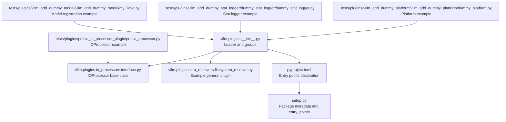
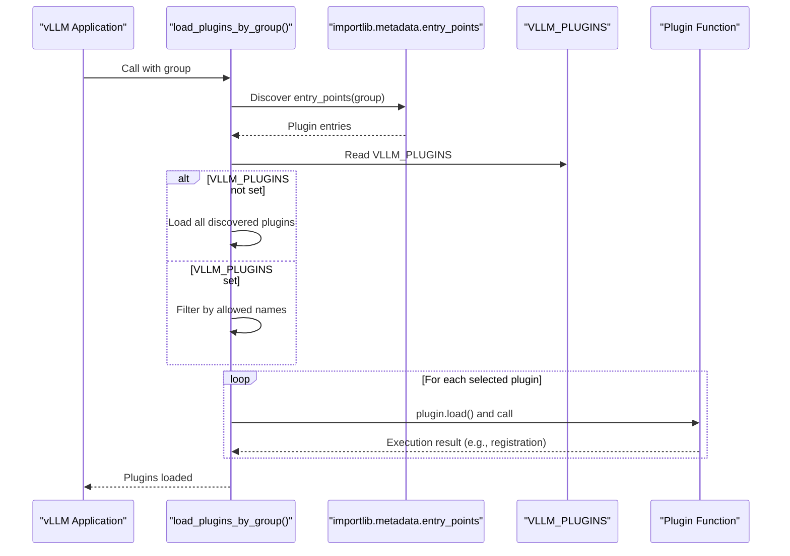
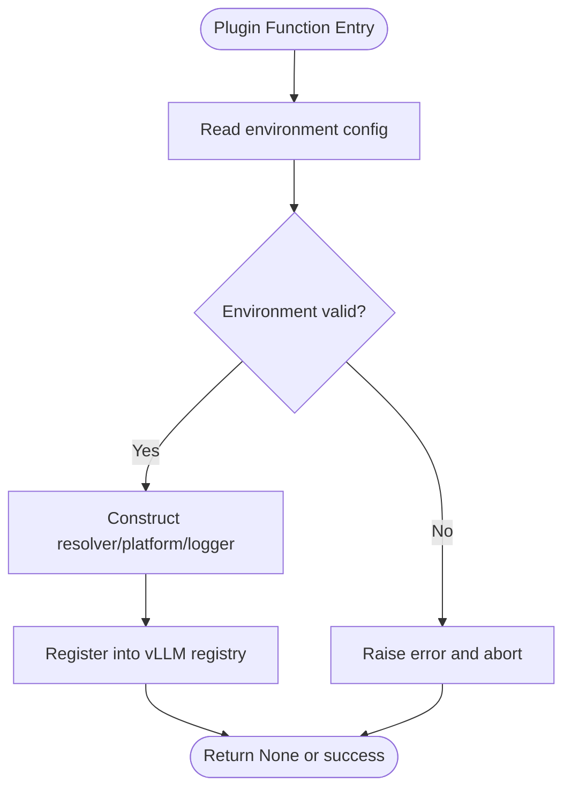
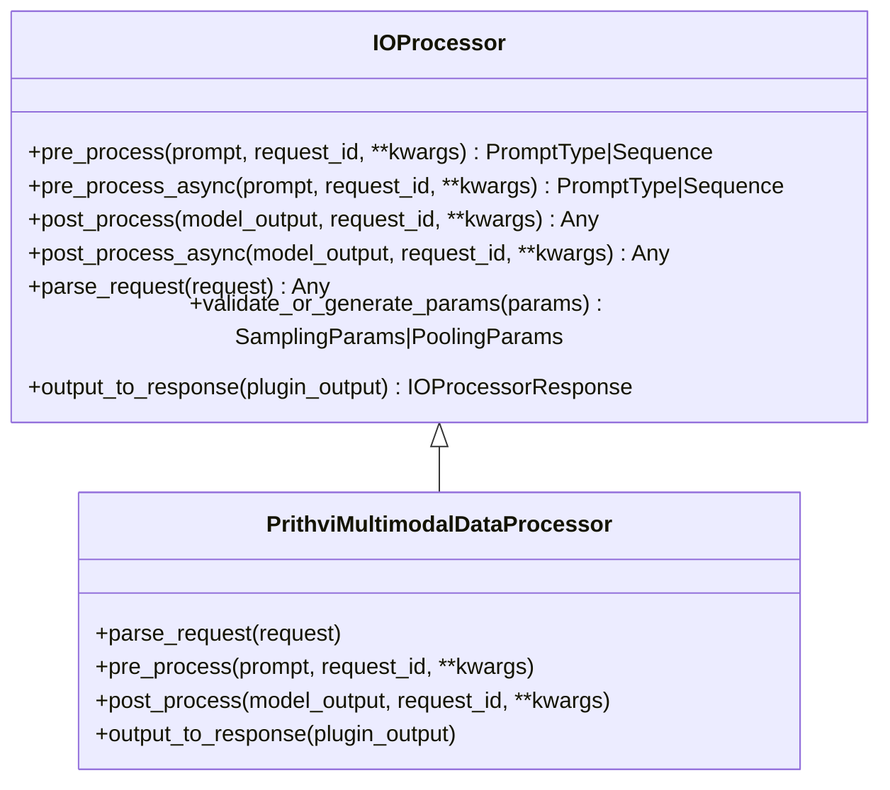
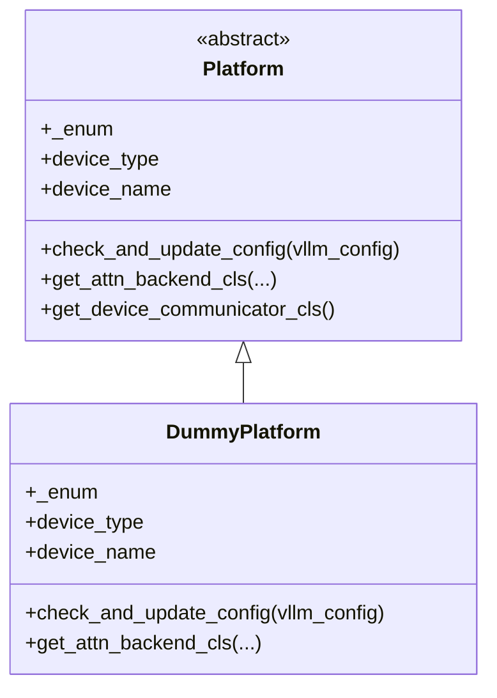
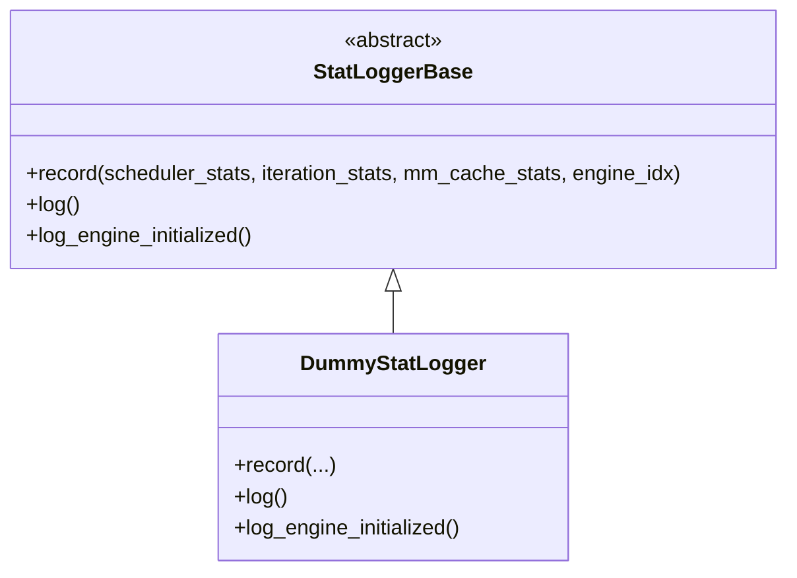
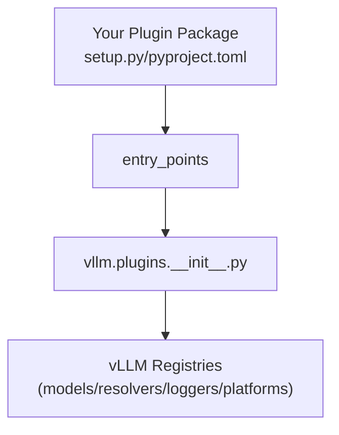

# Creating Custom Plugins

<cite>
**Referenced Files in This Document**
- [plugin_system.md](file://docs/design/plugin_system.md)
- [__init__.py](file://vllm/plugins/__init__.py)
- [interface.py](file://vllm/plugins/io_processors/interface.py)
- [filesystem_resolver.py](file://vllm/plugins/lora_resolvers/filesystem_resolver.py)
- [pyproject.toml](file://pyproject.toml)
- [setup.py](file://setup.py)
- [prithvi_processor.py](file://tests/plugins/prithvi_io_processor_plugin/prithvi_io_processor/prithvi_processor.py)
- [prithvi_setup.py](file://tests/plugins/prithvi_io_processor_plugin/setup.py)
- [dummy_platform.py](file://tests/plugins/vllm_add_dummy_platform/vllm_add_dummy_platform/dummy_platform.py)
- [dummy_stat_logger.py](file://tests/plugins/vllm_add_dummy_stat_logger/dummy_stat_logger/dummy_stat_logger.py)
- [my_llava.py](file://tests/plugins/vllm_add_dummy_model/vllm_add_dummy_model/my_llava.py)
</cite>

## Table of Contents
1. [Introduction](#introduction)
2. [Project Structure](#project-structure)
3. [Core Components](#core-components)
4. [Architecture Overview](#architecture-overview)
5. [Detailed Component Analysis](#detailed-component-analysis)
6. [Dependency Analysis](#dependency-analysis)
7. [Performance Considerations](#performance-considerations)
8. [Troubleshooting Guide](#troubleshooting-guide)
9. [Conclusion](#conclusion)
10. [Appendices](#appendices)

## Introduction
This document explains how to develop custom plugins for vLLM. It covers the plugin discovery mechanism, registration process, environment-based filtering, and the APIs for different plugin types. Practical examples demonstrate how to implement general plugins, IO processor plugins, platform plugins, and stat logger plugins. It also provides guidance on packaging, distribution, installation, testing, debugging, and common pitfalls.

## Project Structure
vLLM’s plugin system is centered around Python entry_points and a small loader that discovers and executes plugins per group. The loader supports multiple plugin groups, each with distinct lifecycles and intended use cases.

**Diagram sources**
- [__init__.py](file://vllm/plugins/__init__.py#L1-L82)
- [interface.py](file://vllm/plugins/io_processors/interface.py#L1-L78)
- [filesystem_resolver.py](file://vllm/plugins/lora_resolvers/filesystem_resolver.py#L1-L53)
- [pyproject.toml](file://pyproject.toml#L44-L46)
- [setup.py](file://setup.py#L791-L800)
- [prithvi_processor.py](file://tests/plugins/prithvi_io_processor_plugin/prithvi_io_processor/prithvi_processor.py#L1-L412)
- [dummy_platform.py](file://tests/plugins/vllm_add_dummy_platform/vllm_add_dummy_platform/dummy_platform.py#L1-L36)
- [dummy_stat_logger.py](file://tests/plugins/vllm_add_dummy_stat_logger/dummy_stat_logger/dummy_stat_logger.py#L1-L30)
- [my_llava.py](file://tests/plugins/vllm_add_dummy_model/vllm_add_dummy_model/my_llava.py#L1-L29)

**Section sources**
- [__init__.py](file://vllm/plugins/__init__.py#L1-L82)
- [pyproject.toml](file://pyproject.toml#L44-L46)

## Core Components
- Plugin groups and loader
  - Groups: general, IO processor, platform, stat logger.
  - Loader discovers entry_points by group, filters by environment variable, and executes plugin functions.
- IO processor interface
  - Defines pre_process, post_process, parse_request, validate_or_generate_params, and output_to_response.
- Example general plugin
  - Registers a LoRA resolver via a function entry point.
- Example platform plugin
  - Provides a platform class with required properties and methods.
- Example stat logger plugin
  - Implements a minimal stat logger subclass.
- Example model registration plugin
  - Registers a custom model via the model registry.

Key responsibilities:
- General plugins: register models or resolvers.
- IO processor plugins: transform prompts and outputs for pooling.
- Platform plugins: integrate a new platform and backends.
- Stat logger plugins: provide custom metrics logging.

**Section sources**
- [__init__.py](file://vllm/plugins/__init__.py#L1-L82)
- [interface.py](file://vllm/plugins/io_processors/interface.py#L1-L78)
- [filesystem_resolver.py](file://vllm/plugins/lora_resolvers/filesystem_resolver.py#L1-L53)
- [dummy_platform.py](file://tests/plugins/vllm_add_dummy_platform/vllm_add_dummy_platform/dummy_platform.py#L1-L36)
- [dummy_stat_logger.py](file://tests/plugins/vllm_add_dummy_stat_logger/dummy_stat_logger/dummy_stat_logger.py#L1-L30)
- [my_llava.py](file://tests/plugins/vllm_add_dummy_model/vllm_add_dummy_model/my_llava.py#L1-L29)

## Architecture Overview
The plugin system relies on Python’s entry_points and vLLM’s loader. Discovery and execution flow:

**Diagram sources**
- [__init__.py](file://vllm/plugins/__init__.py#L28-L82)
- [pyproject.toml](file://pyproject.toml#L44-L46)

## Detailed Component Analysis

### Plugin Registration and Filtering
- Entry points groups
  - vllm.general_plugins: general-purpose plugins (e.g., model or resolver registration).
  - vllm.io_processor_plugins: IO processors for pooling requests.
  - vllm.platform_plugins: platform providers.
  - vllm.stat_logger_plugins: stat loggers.
- Environment filtering
  - VLLM_PLUGINS controls which plugins to load by name; if unset, all are loaded.
- Loader behavior
  - Logs discovered plugins and exceptions during loading.
  - Executes plugin functions once per process; functions must be re-entrant.

Practical steps:
- Define entry_points in your package metadata (setup.py or pyproject.toml).
- Implement a function that performs registrations.
- Set VLLM_PLUGINS to restrict loading to specific plugin names.

**Section sources**
- [__init__.py](file://vllm/plugins/__init__.py#L1-L82)
- [pyproject.toml](file://pyproject.toml#L44-L46)

### General Plugins: Model and Resolver Registration
- Purpose: Register custom models or resolvers.
- Example: Filesystem LoRA resolver registers itself into the resolver registry.
- Typical pattern:
  - Read configuration from environment.
  - Validate prerequisites.
  - Register into vLLM registries.

**Diagram sources**
- [filesystem_resolver.py](file://vllm/plugins/lora_resolvers/filesystem_resolver.py#L1-L53)

**Section sources**
- [filesystem_resolver.py](file://vllm/plugins/lora_resolvers/filesystem_resolver.py#L1-L53)
- [my_llava.py](file://tests/plugins/vllm_add_dummy_model/vllm_add_dummy_model/my_llava.py#L1-L29)

### IO Processor Plugins: Prompt and Output Transformation
- Purpose: Transform prompts and outputs for pooling models.
- Base contract: IOProcessor defines pre_process, post_process, parse_request, validate_or_generate_params, output_to_response.
- Example: A processor that parses imagery requests, splits into spatial tiles, and reconstructs GeoTIFF outputs.

**Diagram sources**
- [interface.py](file://vllm/plugins/io_processors/interface.py#L1-L78)
- [prithvi_processor.py](file://tests/plugins/prithvi_io_processor_plugin/prithvi_io_processor/prithvi_processor.py#L1-L412)

**Section sources**
- [interface.py](file://vllm/plugins/io_processors/interface.py#L1-L78)
- [prithvi_processor.py](file://tests/plugins/prithvi_io_processor_plugin/prithvi_io_processor/prithvi_processor.py#L1-L412)

### Platform Plugins: Integrating a New Platform
- Purpose: Introduce a new platform with attention backend, worker, and optional custom ops.
- Required elements:
  - Platform class inheriting from the platform interface.
  - Implementation of properties and methods (e.g., device enums, backend selection).
  - Worker class implementing required inference lifecycle methods.
  - Optional: attention backend, device communicator, and custom ops.
- Example: A dummy platform demonstrating minimal required members.

**Diagram sources**
- [dummy_platform.py](file://tests/plugins/vllm_add_dummy_platform/vllm_add_dummy_platform/dummy_platform.py#L1-L36)

**Section sources**
- [dummy_platform.py](file://tests/plugins/vllm_add_dummy_platform/vllm_add_dummy_platform/dummy_platform.py#L1-L36)

### Stat Logger Plugins: Metrics Logging
- Purpose: Provide a custom stat logger for asynchronous serving metrics.
- Contract: Implement the minimal interface expected by the stat logger manager.
- Example: A dummy stat logger that records events and logs them.

**Diagram sources**
- [dummy_stat_logger.py](file://tests/plugins/vllm_add_dummy_stat_logger/dummy_stat_logger/dummy_stat_logger.py#L1-L30)

**Section sources**
- [dummy_stat_logger.py](file://tests/plugins/vllm_add_dummy_stat_logger/dummy_stat_logger/dummy_stat_logger.py#L1-L30)

## Dependency Analysis
- Discovery and execution
  - The loader uses importlib.metadata to discover entry_points by group.
  - It respects VLLM_PLUGINS to filter plugin names.
- Packaging and distribution
  - Declare entry_points in setup.py or pyproject.toml.
  - Install your plugin package alongside vLLM to make entry_points available.
- Runtime coupling
  - Plugins must import and register into vLLM registries at load time.
  - Ensure compatibility with the targeted vLLM version.

**Diagram sources**
- [__init__.py](file://vllm/plugins/__init__.py#L28-L82)
- [pyproject.toml](file://pyproject.toml#L44-L46)
- [setup.py](file://setup.py#L791-L800)

**Section sources**
- [__init__.py](file://vllm/plugins/__init__.py#L1-L82)
- [pyproject.toml](file://pyproject.toml#L44-L46)
- [setup.py](file://setup.py#L791-L800)

## Performance Considerations
- Keep plugin functions lightweight and re-entrant to avoid repeated initialization overhead.
- Avoid heavy I/O in plugin functions; defer to lazy initialization inside model execution paths.
- For IO processor plugins, minimize transformations and leverage batching where possible.
- For platform plugins, ensure backend selection and device configuration are efficient and deterministic.

## Troubleshooting Guide
Common issues and resolutions:
- No plugins loaded
  - Ensure your package is installed and entry_points are declared.
  - Verify VLLM_PLUGINS is not restricting to a non-existent name.
- Plugin loading errors
  - The loader logs exceptions during plugin loading; fix import-time issues in your plugin function.
- Environment misconfiguration
  - Some plugins require environment variables (e.g., cache directories); validate them before registering.
- Compatibility problems
  - Interfaces may evolve; consult the plugin system documentation and update your plugin accordingly.

**Section sources**
- [__init__.py](file://vllm/plugins/__init__.py#L28-L82)
- [filesystem_resolver.py](file://vllm/plugins/lora_resolvers/filesystem_resolver.py#L1-L53)

## Conclusion
vLLM’s plugin system provides a robust, extensible mechanism to integrate custom models, resolvers, IO processors, platforms, and stat loggers. By adhering to the documented entry_points groups, implementing the required interfaces, and following packaging and environment best practices, you can develop portable and maintainable plugins that enhance vLLM without modifying its core code.

## Appendices

### Step-by-Step: Develop a General Plugin (Model or Resolver)
- Create a package with a plugin function that:
  - Reads environment variables.
  - Validates prerequisites.
  - Registers into vLLM registries.
- Declare entry_points in setup.py or pyproject.toml under the general group.
- Install your package and run vLLM; optionally set VLLM_PLUGINS to restrict loading.

References:
- [pyproject.toml](file://pyproject.toml#L44-L46)
- [filesystem_resolver.py](file://vllm/plugins/lora_resolvers/filesystem_resolver.py#L1-L53)
- [my_llava.py](file://tests/plugins/vllm_add_dummy_model/vllm_add_dummy_model/my_llava.py#L1-L29)

### Step-by-Step: Develop an IO Processor Plugin
- Implement a class inheriting from the IOProcessor base.
- Implement parse_request, pre_process, post_process, and output_to_response.
- Declare entry_points under the IO processor group.
- Test with pooling requests and verify prompt transformation and response formatting.

References:
- [interface.py](file://vllm/plugins/io_processors/interface.py#L1-L78)
- [prithvi_processor.py](file://tests/plugins/prithvi_io_processor_plugin/prithvi_io_processor/prithvi_processor.py#L1-L412)
- [prithvi_setup.py](file://tests/plugins/prithvi_io_processor_plugin/setup.py#L1-L16)

### Step-by-Step: Develop a Platform Plugin
- Implement a platform class with required properties and methods.
- Provide worker, attention backend, and optional custom ops.
- Declare entry_points under the platform group.
- Validate device configuration and backend selection.

References:
- [dummy_platform.py](file://tests/plugins/vllm_add_dummy_platform/vllm_add_dummy_platform/dummy_platform.py#L1-L36)

### Step-by-Step: Develop a Stat Logger Plugin
- Implement a class inheriting from the stat logger base.
- Implement record, log, and log_engine_initialized.
- Declare entry_points under the stat logger group.

References:
- [dummy_stat_logger.py](file://tests/plugins/vllm_add_dummy_stat_logger/dummy_stat_logger/dummy_stat_logger.py#L1-L30)

### Packaging, Distribution, and Installation
- Packaging
  - Include entry_points in setup.py or pyproject.toml.
- Distribution
  - Publish to your preferred package index; ensure dependencies align with vLLM’s supported versions.
- Installation
  - Install your plugin package alongside vLLM; entry_points become discoverable at runtime.

References:
- [pyproject.toml](file://pyproject.toml#L44-L46)
- [setup.py](file://setup.py#L791-L800)

### Environment Variables and Filtering
- VLLM_PLUGINS
  - Comma-separated list of plugin names to load; if unset, all plugins in the group are loaded.
- Other environment-driven configurations
  - Example: VLLM_LORA_RESOLVER_CACHE_DIR for the filesystem resolver.

References:
- [__init__.py](file://vllm/plugins/__init__.py#L28-L82)
- [filesystem_resolver.py](file://vllm/plugins/lora_resolvers/filesystem_resolver.py#L1-L53)