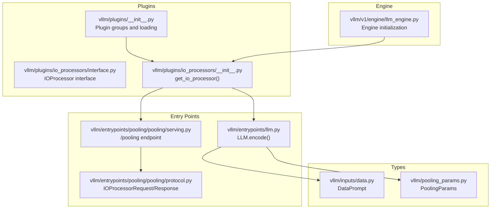
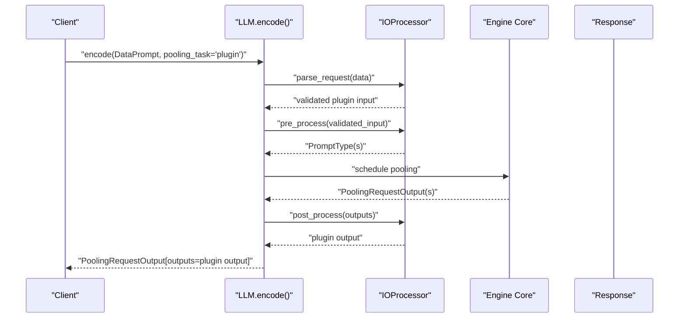
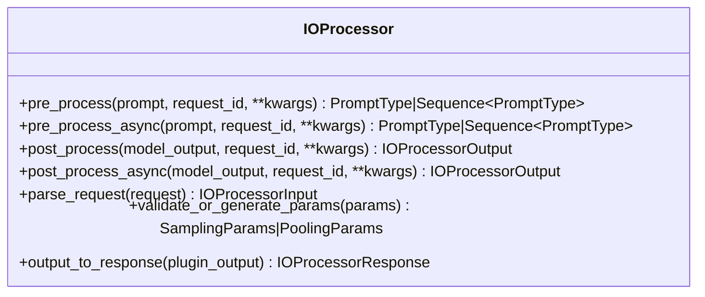
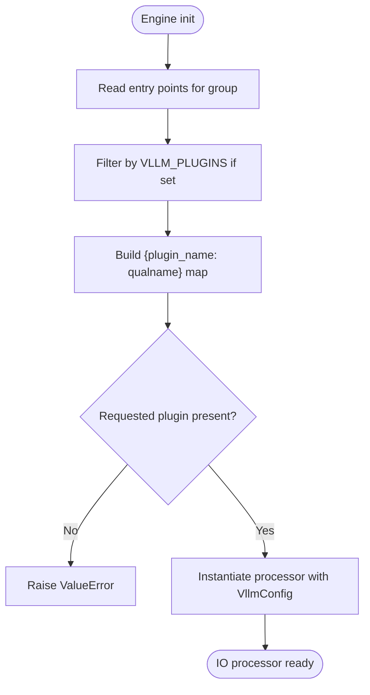
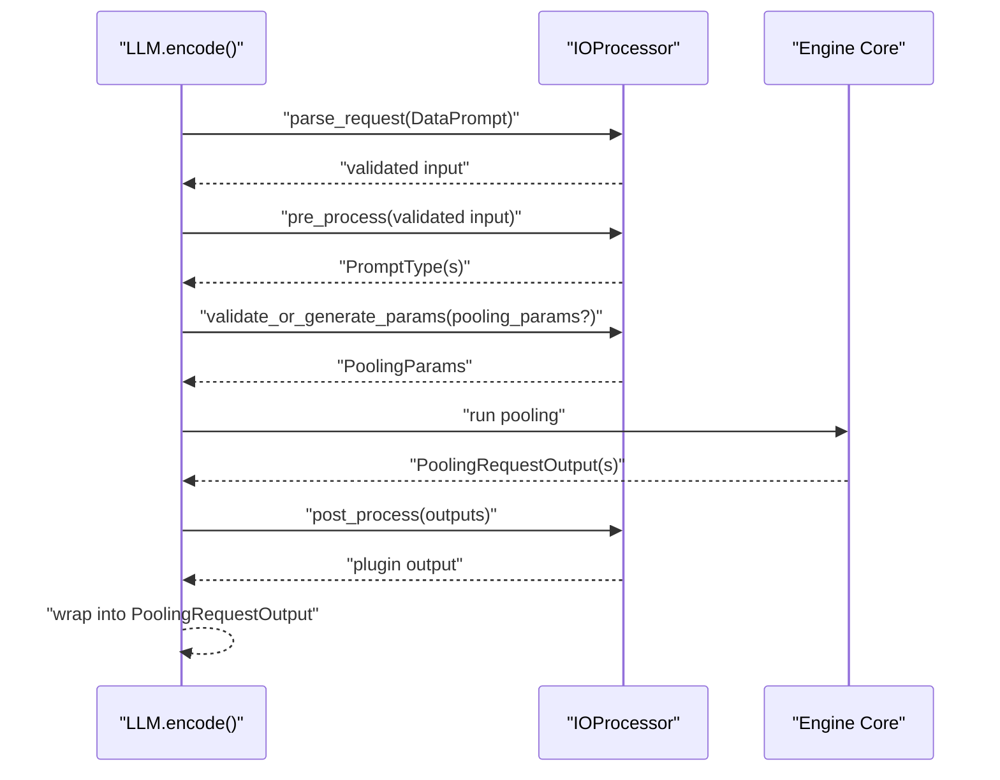
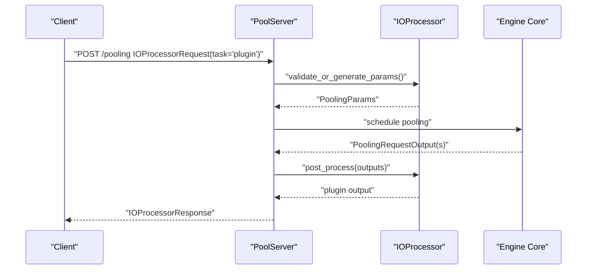
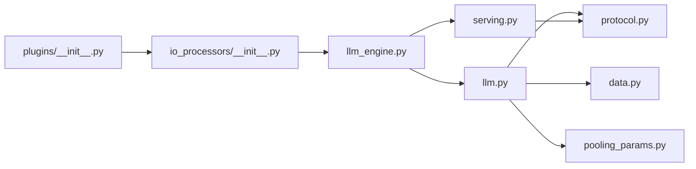

# IO Processor Plugins

<cite>
**Referenced Files in This Document**
- [interface.py](file://vllm/plugins/io_processors/interface.py)
- [io_processors/__init__.py](file://vllm/plugins/io_processors/__init__.py)
- [plugins/__init__.py](file://vllm/plugins/__init__.py)
- [protocol.py](file://vllm/entrypoints/pooling/pooling/protocol.py)
- [serving.py](file://vllm/entrypoints/pooling/pooling/serving.py)
- [llm.py](file://vllm/entrypoints/llm.py)
- [llm_engine.py](file://vllm/v1/engine/llm_engine.py)
- [data.py](file://vllm/inputs/data.py)
- [pooling_params.py](file://vllm/pooling_params.py)
- [io_processor_plugins.md](file://docs/design/io_processor_plugins.md)
- [test_io_processor_plugins.py](file://tests/plugins_tests/test_io_processor_plugins.py)
- [prithvi_geospatial_mae_io_processor.py](file://examples/pooling/plugin/prithvi_geospatial_mae_io_processor.py)
</cite>

## Table of Contents
1. [Introduction](#introduction)
2. [Project Structure](#project-structure)
3. [Core Components](#core-components)
4. [Architecture Overview](#architecture-overview)
5. [Detailed Component Analysis](#detailed-component-analysis)
6. [Dependency Analysis](#dependency-analysis)
7. [Performance Considerations](#performance-considerations)
8. [Troubleshooting Guide](#troubleshooting-guide)
9. [Conclusion](#conclusion)
10. [Appendices](#appendices)

## Introduction
This document explains the IO processor plugin system for pooling models in vLLM. It covers the plugin architecture, registration and discovery mechanism, and how plugins integrate into the model execution pipeline for both offline and online (HTTP) inference. It documents the IOProcessor interface, method responsibilities, and data transformation workflows. It also provides guidance for developing custom pre- and post-processing plugins for specialized data formats, custom encoders, and domain-specific transformations, along with configuration, performance considerations, and integration tips.

## Project Structure
The IO processor plugin system spans several modules:
- Plugin interface and loader live under vllm/plugins/io_processors
- General plugin loading utilities live under vllm/plugins
- Pooling-specific request/response protocols live under vllm/entrypoints/pooling/pooling
- Integration points in the LLM entrypoint and engine live under vllm/entrypoints and vllm/v1/engine
- Example and tests demonstrate usage and validation

**Diagram sources**
- [plugins/__init__.py](file://vllm/plugins/__init__.py#L1-L82)
- [io_processors/interface.py](file://vllm/plugins/io_processors/interface.py#L1-L47)
- [io_processors/__init__.py](file://vllm/plugins/io_processors/__init__.py#L1-L68)
- [llm.py](file://vllm/entrypoints/llm.py#L948-L1097)
- [serving.py](file://vllm/entrypoints/pooling/pooling/serving.py#L164-L194)
- [protocol.py](file://vllm/entrypoints/pooling/pooling/protocol.py#L74-L124)
- [llm_engine.py](file://vllm/v1/engine/llm_engine.py#L90-L102)
- [data.py](file://vllm/inputs/data.py#L108-L118)
- [pooling_params.py](file://vllm/pooling_params.py#L212-L230)

**Section sources**
- [plugins/__init__.py](file://vllm/plugins/__init__.py#L1-L82)
- [io_processors/interface.py](file://vllm/plugins/io_processors/interface.py#L1-L47)
- [io_processors/__init__.py](file://vllm/plugins/io_processors/__init__.py#L1-L68)
- [llm.py](file://vllm/entrypoints/llm.py#L948-L1097)
- [serving.py](file://vllm/entrypoints/pooling/pooling/serving.py#L164-L194)
- [protocol.py](file://vllm/entrypoints/pooling/pooling/protocol.py#L74-L124)
- [llm_engine.py](file://vllm/v1/engine/llm_engine.py#L90-L102)
- [data.py](file://vllm/inputs/data.py#L108-L118)
- [pooling_params.py](file://vllm/pooling_params.py#L212-L230)

## Core Components
- IOProcessor interface: Defines the contract for pre-process, post-process, request parsing, parameter validation, and response conversion.
- Plugin loader: Discovers and instantiates IO processor plugins from the designated plugin group.
- Entry points: LLM.encode() and the /pooling endpoint route pooling requests through the IO processor when applicable.
- Protocols: IOProcessorRequest and IOProcessorResponse define the shape of plugin-driven requests and responses.
- Data types: DataPrompt is the generic input container used by IO processors.
- Engine integration: The engine initializes the IO processor during startup.

Key responsibilities:
- pre_process/pre_process_async: Convert plugin input into model-ready prompts
- post_process/post_process_async: Transform model outputs into plugin outputs
- parse_request: Validate and normalize user input into plugin-specific format
- validate_or_generate_params: Validate or construct pooling parameters for plugin usage
- output_to_response: Convert plugin output to API response for online serving

**Section sources**
- [io_processors/interface.py](file://vllm/plugins/io_processors/interface.py#L1-L47)
- [io_processors/__init__.py](file://vllm/plugins/io_processors/__init__.py#L1-L68)
- [llm.py](file://vllm/entrypoints/llm.py#L948-L1097)
- [serving.py](file://vllm/entrypoints/pooling/pooling/serving.py#L164-L194)
- [protocol.py](file://vllm/entrypoints/pooling/pooling/protocol.py#L74-L124)
- [data.py](file://vllm/inputs/data.py#L108-L118)
- [llm_engine.py](file://vllm/v1/engine/llm_engine.py#L90-L102)

## Architecture Overview
The IO processor plugin architecture integrates with the pooling pipeline as follows:
- At engine initialization, the IO processor is resolved from the plugin group and stored in the engine.
- During offline inference, LLM.encode() detects a plugin-driven request (DataPrompt) and invokes the IO processor’s lifecycle methods.
- During online inference, the /pooling endpoint recognizes plugin tasks and routes accordingly.
- The plugin controls the shape of both input prompts and output responses.

**Diagram sources**
- [llm.py](file://vllm/entrypoints/llm.py#L948-L1097)
- [io_processors/interface.py](file://vllm/plugins/io_processors/interface.py#L1-L47)
- [llm_engine.py](file://vllm/v1/engine/llm_engine.py#L90-L102)

**Section sources**
- [llm.py](file://vllm/entrypoints/llm.py#L948-L1097)
- [io_processors/interface.py](file://vllm/plugins/io_processors/interface.py#L1-L47)
- [llm_engine.py](file://vllm/v1/engine/llm_engine.py#L90-L102)

## Detailed Component Analysis

### IOProcessor Interface
The IOProcessor defines the plugin contract:
- pre_process/pre_process_async: Accept plugin input and produce one or more model prompts
- post_process/post_process_async: Accept model outputs and produce plugin output
- parse_request: Parse and validate raw request payload into plugin input
- validate_or_generate_params: Validate or generate PoolingParams for plugin usage
- output_to_response: Convert plugin output to API response for online serving

**Diagram sources**
- [io_processors/interface.py](file://vllm/plugins/io_processors/interface.py#L1-L47)

**Section sources**
- [io_processors/interface.py](file://vllm/plugins/io_processors/interface.py#L1-L47)

### Plugin Registration and Discovery
Plugins are discovered via Python entry points under a dedicated group. The loader:
- Reads entry points for the IO processor group
- Applies VLLM_PLUGINS filtering if set
- Loads callable factories that return the fully qualified class name of the processor
- Instantiates the selected processor with the engine’s VllmConfig

**Diagram sources**
- [plugins/__init__.py](file://vllm/plugins/__init__.py#L28-L66)
- [io_processors/__init__.py](file://vllm/plugins/io_processors/__init__.py#L1-L68)

**Section sources**
- [plugins/__init__.py](file://vllm/plugins/__init__.py#L1-L82)
- [io_processors/__init__.py](file://vllm/plugins/io_processors/__init__.py#L1-L68)

### Offline Inference Integration (LLM.encode)
LLM.encode() integrates IO processors for plugin tasks:
- Detects DataPrompt input and ensures an IO processor is available
- Calls parse_request() to validate and normalize input
- Calls pre_process() to generate model prompts
- Validates and/or generates PoolingParams via the processor
- Schedules the pooling run and collects PoolingRequestOutput
- Calls post_process() to transform outputs and wraps into a single PoolingRequestOutput

**Diagram sources**
- [llm.py](file://vllm/entrypoints/llm.py#L948-L1097)
- [io_processors/interface.py](file://vllm/plugins/io_processors/interface.py#L1-L47)

**Section sources**
- [llm.py](file://vllm/entrypoints/llm.py#L948-L1097)

### Online Inference Integration (/pooling endpoint)
The /pooling endpoint supports plugin tasks:
- Recognizes IOProcessorRequest with task set to “plugin”
- Uses the IO processor to validate parameters and route the request
- Converts plugin output to IOProcessorResponse for the API

**Diagram sources**
- [serving.py](file://vllm/entrypoints/pooling/pooling/serving.py#L164-L194)
- [protocol.py](file://vllm/entrypoints/pooling/pooling/protocol.py#L74-L124)
- [io_processors/interface.py](file://vllm/plugins/io_processors/interface.py#L1-L47)

**Section sources**
- [serving.py](file://vllm/entrypoints/pooling/pooling/serving.py#L164-L194)
- [protocol.py](file://vllm/entrypoints/pooling/pooling/protocol.py#L74-L124)

### Data Types and Parameters
- DataPrompt: The generic input container used by IO processors
- PoolingParams: Validation ensures output_kind is FINAL_ONLY for pooling

**Section sources**
- [data.py](file://vllm/inputs/data.py#L108-L118)
- [pooling_params.py](file://vllm/pooling_params.py#L212-L230)

### Example Implementation and Tests
- Example offline usage demonstrates configuring an IO processor plugin and invoking encode with a plugin task
- Tests validate both online and offline plugin flows, ensuring proper request/response shapes and decoding correctness

**Section sources**
- [prithvi_geospatial_mae_io_processor.py](file://examples/pooling/plugin/prithvi_geospatial_mae_io_processor.py#L1-L59)
- [test_io_processor_plugins.py](file://tests/plugins_tests/test_io_processor_plugins.py#L1-L120)

## Dependency Analysis
The IO processor system exhibits clear separation of concerns:
- Engine initialization depends on plugin discovery and resolution
- LLM entrypoint depends on IO processor for plugin tasks
- Serving endpoint depends on IO processor for plugin tasks
- Protocol definitions decouple request/response shapes from model internals

**Diagram sources**
- [plugins/__init__.py](file://vllm/plugins/__init__.py#L1-L82)
- [io_processors/__init__.py](file://vllm/plugins/io_processors/__init__.py#L1-L68)
- [llm_engine.py](file://vllm/v1/engine/llm_engine.py#L90-L102)
- [llm.py](file://vllm/entrypoints/llm.py#L948-L1097)
- [serving.py](file://vllm/entrypoints/pooling/pooling/serving.py#L164-L194)
- [protocol.py](file://vllm/entrypoints/pooling/pooling/protocol.py#L74-L124)
- [data.py](file://vllm/inputs/data.py#L108-L118)
- [pooling_params.py](file://vllm/pooling_params.py#L212-L230)

**Section sources**
- [plugins/__init__.py](file://vllm/plugins/__init__.py#L1-L82)
- [io_processors/__init__.py](file://vllm/plugins/io_processors/__init__.py#L1-L68)
- [llm_engine.py](file://vllm/v1/engine/llm_engine.py#L90-L102)
- [llm.py](file://vllm/entrypoints/llm.py#L948-L1097)
- [serving.py](file://vllm/entrypoints/pooling/pooling/serving.py#L164-L194)
- [protocol.py](file://vllm/entrypoints/pooling/pooling/protocol.py#L74-L124)
- [data.py](file://vllm/inputs/data.py#L108-L118)
- [pooling_params.py](file://vllm/pooling_params.py#L212-L230)

## Performance Considerations
- Batch efficiently: Group related plugin requests to maximize throughput while respecting memory limits
- Minimize preprocessing overhead: Perform lightweight parsing and minimal transformations in pre_process; defer heavy work to model or post_process only when necessary
- Streaming vs. batching: post_process_async reorders outputs by id; prefer streaming when order is not guaranteed to reduce latency
- Memory footprint: Limit concurrency (e.g., max_num_seqs) to prevent out-of-memory conditions during heavy preprocessing or postprocessing
- Parameter validation cost: Keep validate_or_generate_params fast; cache defaults when appropriate

[No sources needed since this section provides general guidance]

## Troubleshooting Guide
Common issues and resolutions:
- Missing plugin: If no IO processor is installed but a plugin is required, a ValueError is raised. Ensure the plugin is installed and discoverable via entry points.
- Wrong plugin name: If the requested plugin is not available in the discovered set, a ValueError is raised. Verify the plugin name matches the entry point name.
- Incorrect request shape: For plugin tasks, ensure the request conforms to IOProcessorRequest and includes the plugin-specific data fields expected by parse_request.
- Unsupported task: The engine validates that pooling_task is supported by the model; ensure the task aligns with the model’s supported tasks.
- Online serving response: Confirm that output_to_response produces a valid IOProcessorResponse and that the endpoint returns the expected fields.

**Section sources**
- [io_processors/__init__.py](file://vllm/plugins/io_processors/__init__.py#L1-L68)
- [llm.py](file://vllm/entrypoints/llm.py#L948-L1097)
- [serving.py](file://vllm/entrypoints/pooling/pooling/serving.py#L164-L194)
- [protocol.py](file://vllm/entrypoints/pooling/pooling/protocol.py#L74-L124)
- [test_io_processor_plugins.py](file://tests/plugins_tests/test_io_processor_plugins.py#L1-L120)

## Conclusion
The IO processor plugin system enables flexible, domain-specific pre- and post-processing for pooling models. By adhering to the IOProcessor interface and leveraging the provided integration points, developers can implement custom encoders, handle specialized input formats, and deliver tailored outputs. Proper configuration, careful parameter validation, and mindful performance practices ensure robust and efficient deployments in both offline and online scenarios.

[No sources needed since this section summarizes without analyzing specific files]

## Appendices

### Configuration Options
- EngineArgs: Set io_processor_plugin to specify the plugin by name
- Model HF config: Add io_processor_plugin to the model config (config.json)
- Priority: The model-specific plugin selection takes precedence over the model config when both are provided

**Section sources**
- [io_processor_plugins.md](file://docs/design/io_processor_plugins.md#L84-L92)
- [io_processors/__init__.py](file://vllm/plugins/io_processors/__init__.py#L14-L35)

### Example References
- Offline example showing plugin usage with encode and plugin task
- Tests validating both online and offline plugin flows

**Section sources**
- [prithvi_geospatial_mae_io_processor.py](file://examples/pooling/plugin/prithvi_geospatial_mae_io_processor.py#L1-L59)
- [test_io_processor_plugins.py](file://tests/plugins_tests/test_io_processor_plugins.py#L1-L120)