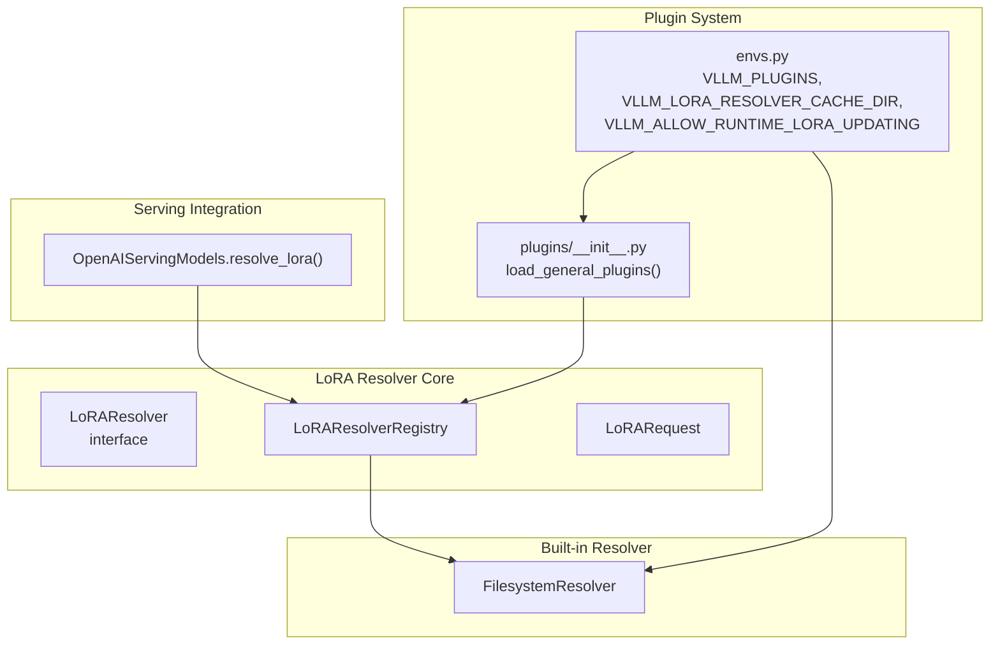
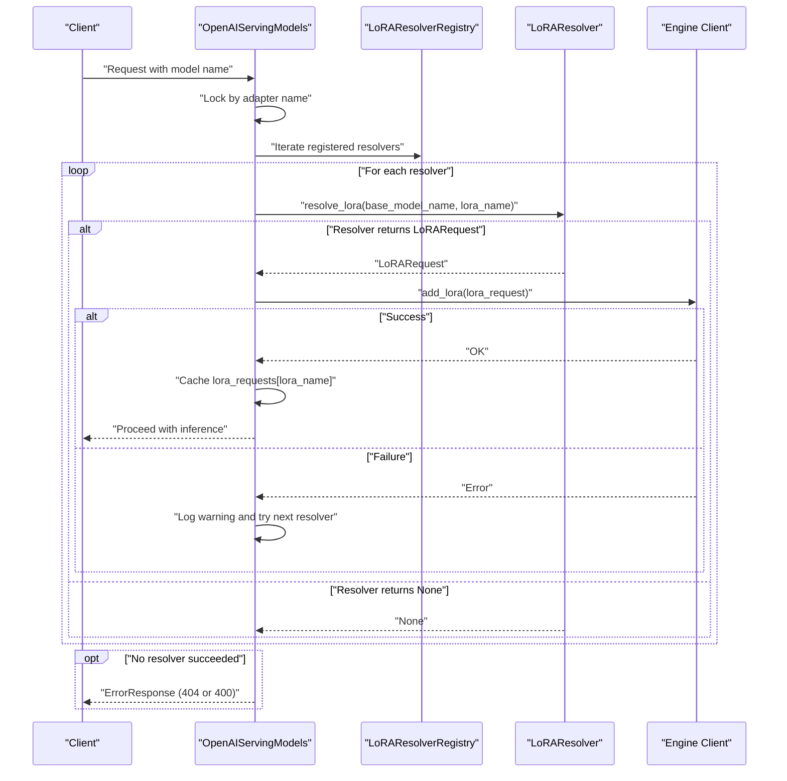
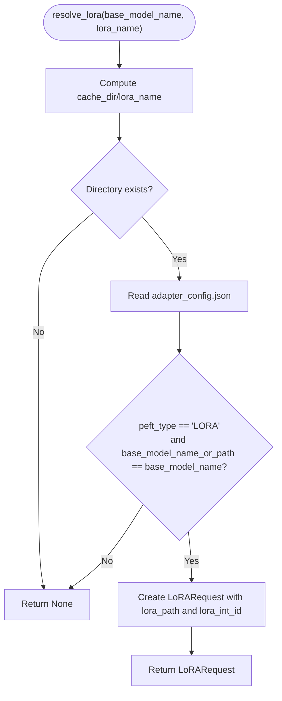
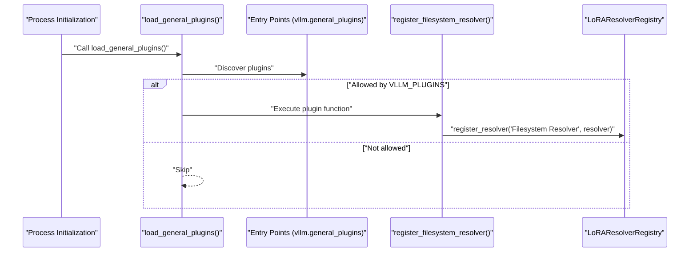
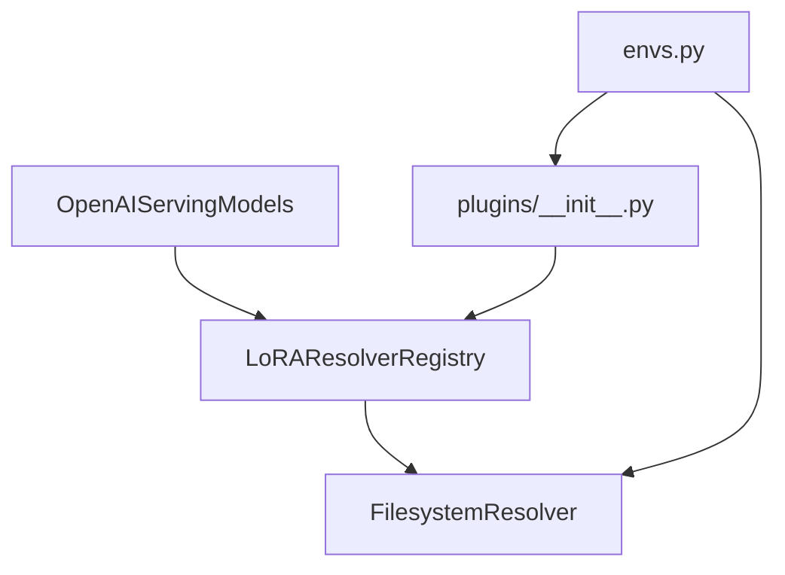

# LoRA Resolver Plugins

<cite>
**Referenced Files in This Document**
- [resolver.py](file://vllm/lora/resolver.py)
- [request.py](file://vllm/lora/request.py)
- [filesystem_resolver.py](file://vllm/plugins/lora_resolvers/filesystem_resolver.py)
- [serving_models.py](file://vllm/entrypoints/openai/serving_models.py)
- [envs.py](file://vllm/envs.py)
- [plugins/__init__.py](file://vllm/plugins/__init__.py)
- [lora_resolver_plugins.md](file://docs/design/lora_resolver_plugins.md)
- [test_resolver.py](file://tests/lora/test_resolver.py)
- [test_filesystem_resolver.py](file://tests/plugins/lora_resolvers/test_filesystem_resolver.py)
- [test_lora_resolvers.py](file://tests/entrypoints/openai/test_lora_resolvers.py)
</cite>

## Table of Contents
1. [Introduction](#introduction)
2. [Project Structure](#project-structure)
3. [Core Components](#core-components)
4. [Architecture Overview](#architecture-overview)
5. [Detailed Component Analysis](#detailed-component-analysis)
6. [Dependency Analysis](#dependency-analysis)
7. [Performance Considerations](#performance-considerations)
8. [Troubleshooting Guide](#troubleshooting-guide)
9. [Conclusion](#conclusion)
10. [Appendices](#appendices)

## Introduction
This document explains the LoRA resolver plugins in vLLM’s plugin system. It covers the resolver architecture, plugin registration, integration with the LoRA adapter management system, resolver interface requirements, adapter resolution algorithms, and storage integration patterns. It also provides guidance for developing custom resolvers for cloud storage providers, custom file systems, and enterprise adapter repositories, along with configuration, caching strategies, and performance optimization techniques.

## Project Structure
The LoRA resolver system consists of:
- A generic resolver interface and registry
- A request model representing adapter metadata
- A built-in filesystem resolver
- Serving integration that resolves and loads adapters on demand
- Environment variables controlling plugin loading and resolver behavior
- Plugin loading via entry points

**Diagram sources**
- [resolver.py](file://vllm/lora/resolver.py#L14-L41)
- [resolver.py](file://vllm/lora/resolver.py#L43-L88)
- [request.py](file://vllm/lora/request.py#L9-L31)
- [filesystem_resolver.py](file://vllm/plugins/lora_resolvers/filesystem_resolver.py#L11-L38)
- [serving_models.py](file://vllm/entrypoints/openai/serving_models.py#L60-L71)
- [plugins/__init__.py](file://vllm/plugins/__init__.py#L28-L81)
- [envs.py](file://vllm/envs.py#L89-L91)
- [envs.py](file://vllm/envs.py#L109-L110)
- [envs.py](file://vllm/envs.py#L90-L90)

**Section sources**
- [resolver.py](file://vllm/lora/resolver.py#L14-L41)
- [resolver.py](file://vllm/lora/resolver.py#L43-L88)
- [request.py](file://vllm/lora/request.py#L9-L31)
- [filesystem_resolver.py](file://vllm/plugins/lora_resolvers/filesystem_resolver.py#L11-L38)
- [serving_models.py](file://vllm/entrypoints/openai/serving_models.py#L60-L71)
- [plugins/__init__.py](file://vllm/plugins/__init__.py#L28-L81)
- [envs.py](file://vllm/envs.py#L89-L91)
- [envs.py](file://vllm/envs.py#L109-L110)
- [envs.py](file://vllm/envs.py#L90-L90)

## Core Components
- LoRAResolver: Abstract interface defining the asynchronous resolve_lora method that locates and returns a LoRA adapter as a LoRARequest.
- LoRAResolverRegistry: Registry that stores resolver instances by name, supports registration, lookup, and duplicate handling.
- LoRARequest: Data structure carrying adapter identity, path, and optional base model name and tensorizer configuration.
- FilesystemResolver: Built-in resolver that discovers adapters in a configured cache directory, validates adapter_config.json, and returns a LoRARequest when conditions match.
- OpenAIServingModels: Integrates with the registry to resolve adapters on demand, ensuring atomicity per adapter name and coordinating with the engine client to add adapters.

Key responsibilities:
- Resolver interface: Define a uniform contract for discovering adapters from arbitrary storage backends.
- Registry: Centralize resolver lifecycle and retrieval.
- Request model: Normalize adapter metadata for downstream consumption.
- Serving integration: Gate dynamic loading behind a feature flag, coordinate concurrency, and propagate errors.

**Section sources**
- [resolver.py](file://vllm/lora/resolver.py#L14-L41)
- [resolver.py](file://vllm/lora/resolver.py#L43-L88)
- [request.py](file://vllm/lora/request.py#L9-L31)
- [filesystem_resolver.py](file://vllm/plugins/lora_resolvers/filesystem_resolver.py#L11-L38)
- [serving_models.py](file://vllm/entrypoints/openai/serving_models.py#L232-L277)

## Architecture Overview
The resolver architecture is layered:
- Plugin discovery and loading: Plugins are discovered via entry points and loaded when the general plugin group is initialized.
- Resolver registration: Resolvers populate the registry (either built-in or custom).
- Adapter resolution: On receiving a request for a named adapter, the serving layer iterates resolvers until one returns a valid LoRARequest.
- Engine integration: The serving layer adds the adapter to the engine and caches it for reuse.

**Diagram sources**
- [serving_models.py](file://vllm/entrypoints/openai/serving_models.py#L232-L277)
- [resolver.py](file://vllm/lora/resolver.py#L14-L41)
- [resolver.py](file://vllm/lora/resolver.py#L43-L88)

**Section sources**
- [serving_models.py](file://vllm/entrypoints/openai/serving_models.py#L232-L277)
- [resolver.py](file://vllm/lora/resolver.py#L14-L41)
- [resolver.py](file://vllm/lora/resolver.py#L43-L88)

## Detailed Component Analysis

### Resolver Interface and Registry
- LoRAResolver defines an abstract async resolve_lora method that takes base_model_name and lora_name and returns a LoRARequest or None.
- LoRAResolverRegistry provides:
  - register_resolver(name, resolver): Registers a resolver, with overwrite warning.
  - get_resolver(name): Retrieves a resolver by name, raising KeyError if missing.
  - get_supported_resolvers(): Lists registered resolver names.

Implementation patterns:
- Thread-safety: The registry is a dataclass with a dict; concurrent access should be coordinated at higher levels (e.g., during plugin load).
- Overwrite semantics: Duplicate names overwrite the previous resolver instance with a warning.

**Section sources**
- [resolver.py](file://vllm/lora/resolver.py#L14-L41)
- [resolver.py](file://vllm/lora/resolver.py#L43-L88)

### LoRARequest Model
- Fields include lora_name, lora_int_id, lora_path, optional lora_local_path (deprecated), long_lora_max_len, base_model_name, and tensorizer_config_dict.
- Validation:
  - lora_int_id must be positive.
  - lora_path must be non-empty; deprecated lora_local_path is normalized to lora_path if present.
- Equality and hashing are based on lora_name, enabling deduplication and lookup by name.

**Section sources**
- [request.py](file://vllm/lora/request.py#L9-L31)
- [request.py](file://vllm/lora/request.py#L46-L96)

### FilesystemResolver
- Purpose: Discover adapters stored locally under a configured cache directory.
- Algorithm:
  - Build path from cache_dir and lora_name.
  - Check existence of the adapter directory.
  - Validate presence of adapter_config.json.
  - Validate peft_type equals "LORA" and base_model_name_or_path matches the current base model.
  - If valid, construct and return a LoRARequest with lora_path pointing to the adapter directory and a deterministic lora_int_id derived from the lora_name.
- Registration:
  - register_filesystem_resolver reads VLLM_LORA_RESOLVER_CACHE_DIR from environment and registers a FilesystemResolver under a fixed name if the directory is valid.

**Diagram sources**
- [filesystem_resolver.py](file://vllm/plugins/lora_resolvers/filesystem_resolver.py#L11-L38)

**Section sources**
- [filesystem_resolver.py](file://vllm/plugins/lora_resolvers/filesystem_resolver.py#L11-L38)
- [filesystem_resolver.py](file://vllm/plugins/lora_resolvers/filesystem_resolver.py#L39-L52)

### Serving Integration and Dynamic Loading
- OpenAIServingModels integrates with the resolver registry:
  - Populates self.lora_resolvers from LoRAResolverRegistry.
  - Uses a per-lora_name lock to ensure atomic resolution and loading.
  - If the adapter is not cached, it iterates resolvers until one returns a LoRARequest.
  - On success, calls engine_client.add_lora and caches the LoRARequest.
  - On failure, logs warnings and continues trying other resolvers; if none succeed, returns an error response.

Feature flags and gating:
- VLLM_ALLOW_RUNTIME_LORA_UPDATING controls whether dynamic adapter loading is permitted.

**Section sources**
- [serving_models.py](file://vllm/entrypoints/openai/serving_models.py#L60-L71)
- [serving_models.py](file://vllm/entrypoints/openai/serving_models.py#L232-L277)
- [envs.py](file://vllm/envs.py#L109-L110)

### Plugin Loading and Registration
- Plugins are loaded via entry points from the vllm.general_plugins group.
- load_general_plugins:
  - Reads VLLM_PLUGINS (comma-separated names or None for all).
  - Loads plugin functions and executes them to register components.
- FilesystemResolver’s registration function checks VLLM_LORA_RESOLVER_CACHE_DIR and registers the resolver if the directory is valid.

**Diagram sources**
- [plugins/__init__.py](file://vllm/plugins/__init__.py#L28-L81)
- [filesystem_resolver.py](file://vllm/plugins/lora_resolvers/filesystem_resolver.py#L39-L52)
- [resolver.py](file://vllm/lora/resolver.py#L43-L88)

**Section sources**
- [plugins/__init__.py](file://vllm/plugins/__init__.py#L28-L81)
- [filesystem_resolver.py](file://vllm/plugins/lora_resolvers/filesystem_resolver.py#L39-L52)

### Resolver Interface Requirements
- Implement async resolve_lora(base_model_name: str, lora_name: str) -> LoRARequest | None.
- Return a LoRARequest with:
  - lora_name: adapter identifier
  - lora_int_id: unique positive integer
  - lora_path: absolute or cache-resolved path to adapter directory or weights
- Return None if the adapter cannot be resolved.

Validation expectations:
- The serving layer will call engine_client.add_lora with the returned LoRARequest; failures propagate as error responses.

**Section sources**
- [resolver.py](file://vllm/lora/resolver.py#L14-L41)
- [request.py](file://vllm/lora/request.py#L9-L31)
- [serving_models.py](file://vllm/entrypoints/openai/serving_models.py#L232-L277)

### Adapter Resolution Algorithms
- FilesystemResolver algorithm is deterministic and file-system-centric:
  - Directory existence check
  - JSON parsing of adapter_config.json
  - Type and base model validation
  - Construct LoRARequest on success
- Custom resolvers can implement:
  - Remote storage backends (cloud/object stores)
  - Enterprise repositories (e.g., internal artifact registries)
  - Credential management (e.g., token-based auth, IAM roles)
  - Caching strategies (e.g., local disk cache, CDN-backed fetch)

Integration points:
- Use LoRAResolverRegistry.register_resolver to add custom resolvers alongside built-ins.
- Respect base_model_name matching to prevent cross-model contamination.

**Section sources**
- [filesystem_resolver.py](file://vllm/plugins/lora_resolvers/filesystem_resolver.py#L11-L38)
- [resolver.py](file://vllm/lora/resolver.py#L43-L88)

### Storage Integration Patterns
- Local filesystem: FilesystemResolver manages a cache directory and validates adapter metadata.
- Remote storage: Implement a custom resolver that:
  - Authenticates and retrieves adapter artifacts
  - Validates adapter_config.json and base model compatibility
  - Returns a LoRARequest with a path suitable for engine loading
- Enterprise repositories: Implement a resolver that queries internal APIs, applies policies, and returns validated LoRARequest instances.

**Section sources**
- [filesystem_resolver.py](file://vllm/plugins/lora_resolvers/filesystem_resolver.py#L11-L38)
- [lora_resolver_plugins.md](file://docs/design/lora_resolver_plugins.md#L1-L176)

### Plugin Development Examples
- Custom resolver class:
  - Subclass LoRAResolver and implement resolve_lora.
  - Register via LoRAResolverRegistry.register_resolver.
- Cloud storage provider:
  - Implement resolve_lora to download artifacts from S3/GCS/Azure Blob, validate metadata, and return a LoRARequest.
- Custom file system:
  - Implement resolve_lora to traverse specialized mounts or network shares.
- Enterprise adapter repository:
  - Implement resolve_lora to authenticate against an internal registry, apply access control, and return a LoRARequest.

Configuration:
- Use VLLM_PLUGINS to select which resolvers to load.
- Use VLLM_LORA_RESOLVER_CACHE_DIR for the filesystem resolver.
- Enable dynamic loading via VLLM_ALLOW_RUNTIME_LORA_UPDATING.

**Section sources**
- [lora_resolver_plugins.md](file://docs/design/lora_resolver_plugins.md#L1-L176)
- [resolver.py](file://vllm/lora/resolver.py#L43-L88)

## Dependency Analysis
- Registry dependency chain:
  - OpenAIServingModels depends on LoRAResolverRegistry to enumerate and invoke resolvers.
  - FilesystemResolver depends on environment variables and file system I/O.
  - Plugin loader depends on entry points and environment variable filtering.
- Coupling and cohesion:
  - Resolver interface decouples storage backends from serving logic.
  - Registry centralizes resolver lifecycle, improving cohesion.
- External dependencies:
  - Entry points mechanism for plugin discovery.
  - Environment variables for configuration.

**Diagram sources**
- [serving_models.py](file://vllm/entrypoints/openai/serving_models.py#L60-L71)
- [resolver.py](file://vllm/lora/resolver.py#L43-L88)
- [filesystem_resolver.py](file://vllm/plugins/lora_resolvers/filesystem_resolver.py#L39-L52)
- [plugins/__init__.py](file://vllm/plugins/__init__.py#L28-L81)
- [envs.py](file://vllm/envs.py#L89-L91)
- [envs.py](file://vllm/envs.py#L109-L110)
- [envs.py](file://vllm/envs.py#L90-L90)

**Section sources**
- [serving_models.py](file://vllm/entrypoints/openai/serving_models.py#L60-L71)
- [resolver.py](file://vllm/lora/resolver.py#L43-L88)
- [filesystem_resolver.py](file://vllm/plugins/lora_resolvers/filesystem_resolver.py#L39-L52)
- [plugins/__init__.py](file://vllm/plugins/__init__.py#L28-L81)
- [envs.py](file://vllm/envs.py#L89-L91)
- [envs.py](file://vllm/envs.py#L109-L110)
- [envs.py](file://vllm/envs.py#L90-L90)

## Performance Considerations
- Concurrency control:
  - Per-lora_name locks prevent redundant resolution and loading.
- Resolver ordering:
  - Place the most likely or fastest resolvers earlier in the registry to minimize attempts.
- Caching:
  - FilesystemResolver relies on local disk; ensure fast I/O and sufficient space.
  - Consider pre-warming popular adapters to reduce cold-start latency.
- Network backends:
  - For remote resolvers, implement local caching and connection pooling.
  - Use streaming downloads and checksum verification to improve reliability.
- Error handling:
  - Fail fast on invalid configurations; log warnings and continue with other resolvers.

[No sources needed since this section provides general guidance]

## Troubleshooting Guide
Common issues and resolutions:
- Missing or invalid cache directory:
  - Ensure VLLM_LORA_RESOLVER_CACHE_DIR points to a valid directory; otherwise registration fails.
- Adapter not found:
  - Verify adapter directory name matches the requested model name.
  - Confirm adapter_config.json exists and is valid.
- Invalid adapter configuration:
  - Ensure peft_type equals "LORA" and base_model_name_or_path matches the base model.
- Dynamic loading disabled:
  - Set VLLM_ALLOW_RUNTIME_LORA_UPDATING to enable runtime adapter updates.
- Resolver not invoked:
  - Confirm VLLM_PLUGINS includes the resolver name and that the plugin is installed and importable.

Behavior verified by tests:
- Resolver registration and retrieval
- Filesystem resolver behavior for present, missing, and non-LORA adapters
- Serving integration behavior for successful resolution, not found, and add-lora failures

**Section sources**
- [filesystem_resolver.py](file://vllm/plugins/lora_resolvers/filesystem_resolver.py#L39-L52)
- [test_resolver.py](file://tests/lora/test_resolver.py#L1-L75)
- [test_filesystem_resolver.py](file://tests/plugins/lora_resolvers/test_filesystem_resolver.py#L1-L66)
- [test_lora_resolvers.py](file://tests/entrypoints/openai/test_lora_resolvers.py#L136-L231)

## Conclusion
The LoRA resolver plugin system in vLLM provides a flexible, extensible mechanism for dynamic adapter loading. The abstract resolver interface and centralized registry enable pluggable storage backends, while serving integration ensures safe, atomic, and efficient resolution. With proper configuration, caching, and custom resolver development, teams can integrate diverse adapter sources, including cloud storage and enterprise repositories, into production deployments.

[No sources needed since this section summarizes without analyzing specific files]

## Appendices

### Resolver Interface Reference
- Method signature: resolve_lora(base_model_name: str, lora_name: str) -> LoRARequest | None
- Expected behavior:
  - Locate adapter artifacts
  - Validate metadata and base model compatibility
  - Return a populated LoRARequest or None

**Section sources**
- [resolver.py](file://vllm/lora/resolver.py#L14-L41)

### Configuration Reference
- VLLM_PLUGINS: Comma-separated list of plugin names to load; None means load all.
- VLLM_LORA_RESOLVER_CACHE_DIR: Directory path for FilesystemResolver.
- VLLM_ALLOW_RUNTIME_LORA_UPDATING: Enables dynamic adapter loading.

**Section sources**
- [envs.py](file://vllm/envs.py#L89-L91)
- [envs.py](file://vllm/envs.py#L109-L110)
- [envs.py](file://vllm/envs.py#L90-L90)
- [lora_resolver_plugins.md](file://docs/design/lora_resolver_plugins.md#L1-L176)