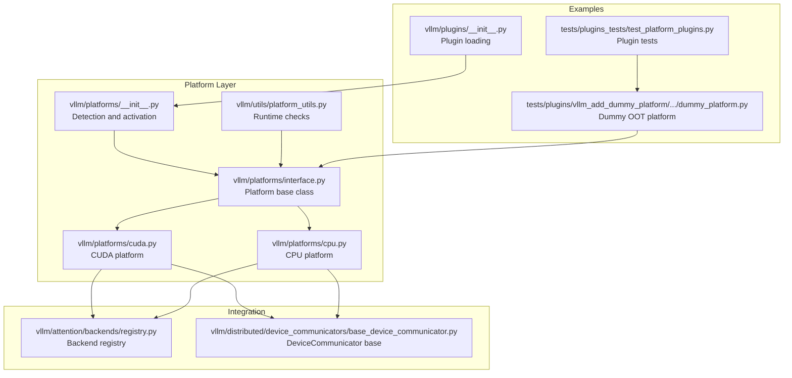
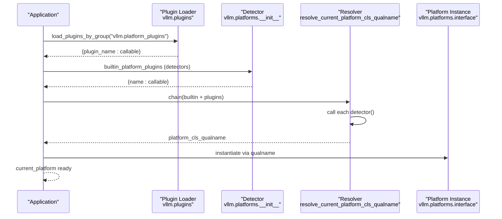
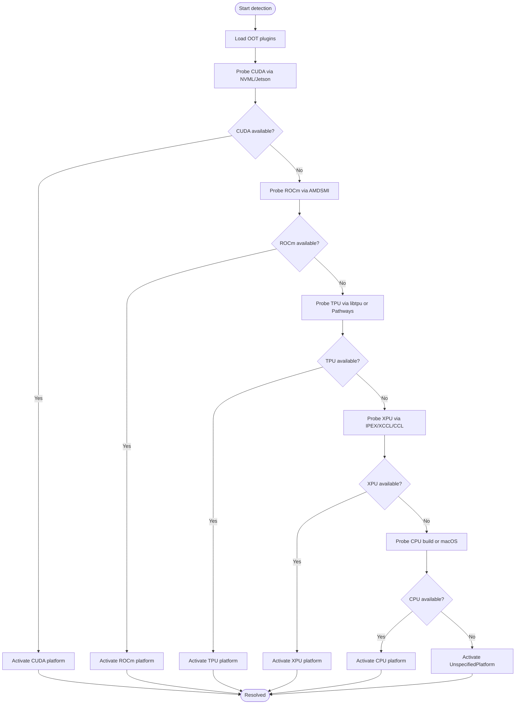
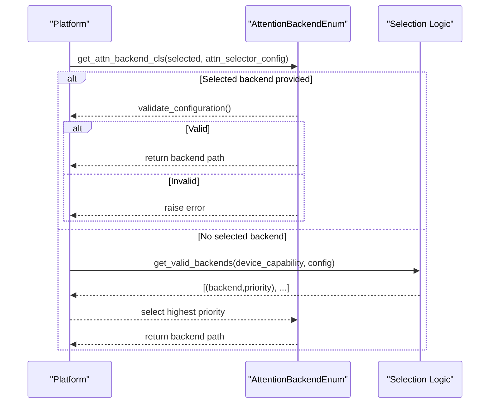
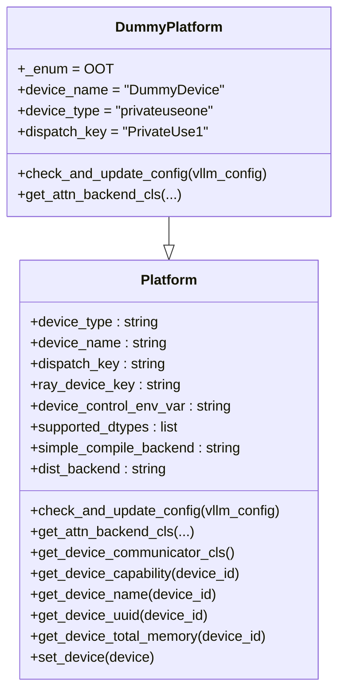
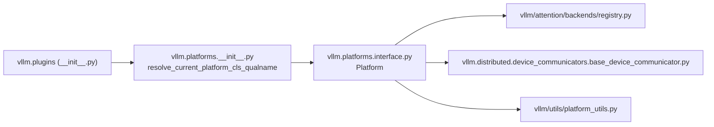

# Platform Plugins

<cite>
**Referenced Files in This Document**
- [interface.py](file://vllm/platforms/interface.py)
- [__init__.py](file://vllm/platforms/__init__.py)
- [cuda.py](file://vllm/platforms/cuda.py)
- [cpu.py](file://vllm/platforms/cpu.py)
- [platform_utils.py](file://vllm/utils/platform_utils.py)
- [registry.py](file://vllm/attention/backends/registry.py)
- [base_device_communicator.py](file://vllm/distributed/device_communicators/base_device_communicator.py)
- [dummy_platform.py](file://tests/plugins/vllm_add_dummy_platform/vllm_add_dummy_platform/dummy_platform.py)
- [test_platform_plugins.py](file://tests/plugins_tests/test_platform_plugins.py)
- [__init__.py](file://vllm/plugins/__init__.py)
</cite>

## Table of Contents
1. [Introduction](#introduction)
2. [Project Structure](#project-structure)
3. [Core Components](#core-components)
4. [Architecture Overview](#architecture-overview)
5. [Detailed Component Analysis](#detailed-component-analysis)
6. [Dependency Analysis](#dependency-analysis)
7. [Performance Considerations](#performance-considerations)
8. [Troubleshooting Guide](#troubleshooting-guide)
9. [Conclusion](#conclusion)
10. [Appendices](#appendices)

## Introduction
This document explains vLLM’s platform plugin system: how platform plugins are discovered and activated, how they integrate with the hardware abstraction layer, and how to implement custom platform plugins for new hardware backends. It covers the Platform interface requirements, device enumeration and capability reporting, configuration updates, attention backend integration, and device communicator classes. It also provides guidance on testing platform plugins and ensuring compatibility across deployment scenarios.

## Project Structure
The platform plugin system spans several modules:
- Platform interface and built-in platform implementations
- Platform detection and activation logic
- Utilities for runtime environment checks
- Attention backend registry and selection
- Device communicator base class
- Example out-of-tree (OOT) platform plugin and tests

**Diagram sources**
- [interface.py](file://vllm/platforms/interface.py#L100-L692)
- [cuda.py](file://vllm/platforms/cuda.py#L96-L619)
- [cpu.py](file://vllm/platforms/cpu.py#L70-L422)
- [__init__.py](file://vllm/platforms/__init__.py#L182-L278)
- [platform_utils.py](file://vllm/utils/platform_utils.py#L1-L60)
- [registry.py](file://vllm/attention/backends/registry.py#L1-L255)
- [base_device_communicator.py](file://vllm/distributed/device_communicators/base_device_communicator.py#L1-L200)
- [dummy_platform.py](file://tests/plugins/vllm_add_dummy_platform/vllm_add_dummy_platform/dummy_platform.py#L1-L36)
- [test_platform_plugins.py](file://tests/plugins_tests/test_platform_plugins.py#L1-L48)
- [__init__.py](file://vllm/plugins/__init__.py#L1-L82)

**Section sources**
- [interface.py](file://vllm/platforms/interface.py#L100-L692)
- [__init__.py](file://vllm/platforms/__init__.py#L182-L278)
- [cuda.py](file://vllm/platforms/cuda.py#L96-L619)
- [cpu.py](file://vllm/platforms/cpu.py#L70-L422)
- [platform_utils.py](file://vllm/utils/platform_utils.py#L1-L60)
- [registry.py](file://vllm/attention/backends/registry.py#L1-L255)
- [base_device_communicator.py](file://vllm/distributed/device_communicators/base_device_communicator.py#L1-L200)
- [dummy_platform.py](file://tests/plugins/vllm_add_dummy_platform/vllm_add_dummy_platform/dummy_platform.py#L1-L36)
- [test_platform_plugins.py](file://tests/plugins_tests/test_platform_plugins.py#L1-L48)
- [__init__.py](file://vllm/plugins/__init__.py#L1-L82)

## Core Components
- Platform base class defines the contract for device capabilities, dtype support, attention backend selection, device communicators, and environment behaviors.
- Built-in platform implementations (CUDA, ROCm, TPU, XPU, CPU) specialize the base class for each hardware family.
- Platform detection resolves the current platform by probing environment and libraries, supporting both built-in and out-of-tree plugins.
- Attention backend registry enables platform-specific selection and override of attention implementations.
- Device communicator base class provides a common interface for distributed communication primitives per device type.

Key responsibilities:
- Device enumeration and capability reporting: device_name, device_uuid, device_total_memory, device_capability families.
- Configuration updates: platform-specific tuning of block sizes, dtype support, worker class, and distributed backends.
- Attention backend integration: platform selects among available backends based on capability and configuration.
- Device communicator integration: platform specifies the communicator class for distributed ops.

**Section sources**
- [interface.py](file://vllm/platforms/interface.py#L100-L692)
- [cuda.py](file://vllm/platforms/cuda.py#L96-L619)
- [cpu.py](file://vllm/platforms/cpu.py#L70-L422)
- [registry.py](file://vllm/attention/backends/registry.py#L1-L255)
- [base_device_communicator.py](file://vllm/distributed/device_communicators/base_device_communicator.py#L1-L200)

## Architecture Overview
The platform plugin architecture consists of:
- A discovery mechanism that loads entry points from the “vllm.platform_plugins” group.
- A resolver that evaluates built-in detectors and plugin detectors to choose a single platform.
- A lazy-initialized current_platform singleton used throughout vLLM to gate device-specific behavior.

**Diagram sources**
- [__init__.py](file://vllm/plugins/__init__.py#L1-L82)
- [__init__.py](file://vllm/platforms/__init__.py#L182-L278)
- [interface.py](file://vllm/platforms/interface.py#L100-L200)

## Detailed Component Analysis

### Platform Interface Requirements
The Platform base class defines the contract for all platform plugins:
- Device identity and environment: device_type, device_name, dispatch_key, ray_device_key, device_control_env_var.
- Supported dtypes and compilation backends.
- Distributed backend and device communicators.
- Device capability queries: get_device_capability, has_device_capability, is_device_capability, is_device_capability_family.
- Attention backend selection helpers and vision attention backend selection.
- Memory and pin-memory availability checks.
- Quantization and dtype support flags.
- Static graph and compilation wrappers.
- Distributed process group initialization hook.
- Environment variable and weight loader synchronization helpers.

Implementation guidance:
- Enumerate devices and report accurate capabilities; use has/is family helpers for compatibility checks.
- Override attention backend selection to reflect platform-specific constraints and preferences.
- Provide a device communicator class path for distributed ops.
- Update configuration in check_and_update_config to align worker class, block sizes, and dtype support.

**Section sources**
- [interface.py](file://vllm/platforms/interface.py#L100-L692)

### Built-in Platforms and Detection
- CUDA platform: selects worker class, sets block sizes, validates attention backends, and enforces dtype support based on compute capability. Provides NVML and non-NVML variants.
- CPU platform: adjusts KV cache sizing, disables incompatible features, sets worker class, and configures environment variables for threading and memory.
- Detection logic: probes environment and libraries to decide which platform to activate, ensuring only one platform is active at a time.

**Diagram sources**
- [__init__.py](file://vllm/platforms/__init__.py#L182-L278)
- [cuda.py](file://vllm/platforms/cuda.py#L59-L108)
- [cpu.py](file://vllm/platforms/cpu.py#L158-L179)

**Section sources**
- [cuda.py](file://vllm/platforms/cuda.py#L96-L619)
- [cpu.py](file://vllm/platforms/cpu.py#L70-L422)
- [__init__.py](file://vllm/platforms/__init__.py#L182-L278)

### Attention Backend Integration
Platforms integrate with the attention backend registry by:
- Returning a backend class path from get_attn_backend_cls.
- Validating configuration and selecting among prioritized backends based on device capability and configuration flags.
- Providing vision attention backend selection for ViT models.

**Diagram sources**
- [interface.py](file://vllm/platforms/interface.py#L226-L270)
- [cuda.py](file://vllm/platforms/cuda.py#L289-L359)
- [registry.py](file://vllm/attention/backends/registry.py#L1-L255)

**Section sources**
- [interface.py](file://vllm/platforms/interface.py#L226-L270)
- [cuda.py](file://vllm/platforms/cuda.py#L289-L359)
- [registry.py](file://vllm/attention/backends/registry.py#L1-L255)

### Device Communicator Classes
Each platform specifies a device communicator class path via get_device_communicator_cls. The base communicator class defines the interface for all-reduce, all-gather, and other collective operations.

Implementation notes:
- Return a fully qualified class path to a subclass of the base device communicator.
- Ensure the communicator integrates with the platform’s distributed backend (e.g., NCCL for CUDA, gloo for CPU, XCCL/CCL for XPU).

**Section sources**
- [interface.py](file://vllm/platforms/interface.py#L510-L515)
- [cuda.py](file://vllm/platforms/cuda.py#L396-L404)
- [cpu.py](file://vllm/platforms/cpu.py#L404-L410)
- [base_device_communicator.py](file://vllm/distributed/device_communicators/base_device_communicator.py#L1-L200)

### Worker Class Implementation Requirements
Out-of-tree platforms must set the worker class in check_and_update_config so vLLM knows which worker implementation to use. The worker must implement the required lifecycle methods for device initialization, cache setup, model loading, KV cache spec generation, memory profiling, and execution.

Guidance:
- Set parallel_config.worker_cls to a fully qualified worker class path.
- Implement required worker methods for device setup, cache allocation, model loading, and inference execution.
- Optionally implement advanced features (sleep/wakeup, graph mode, speculative decoding, LoRA, data parallelism) as needed.

**Section sources**
- [cuda.py](file://vllm/platforms/cuda.py#L150-L179)
- [cpu.py](file://vllm/platforms/cpu.py#L178-L233)
- [docs/design/plugin_system.md](file://docs/design/plugin_system.md#L62-L144)

### Implementing a Custom Platform Plugin (Example)
The dummy platform demonstrates a minimal OOT platform:
- Inherits from Platform.
- Sets platform enum to OOT, device_name, device_type, and dispatch_key.
- Overrides check_and_update_config to adjust compilation settings.
- Overrides get_attn_backend_cls to return a custom attention backend path.

Testing:
- The test suite simulates loading the plugin and verifies current_platform reflects the dummy platform and that custom ops are applied.

**Diagram sources**
- [interface.py](file://vllm/platforms/interface.py#L100-L200)
- [dummy_platform.py](file://tests/plugins/vllm_add_dummy_platform/vllm_add_dummy_platform/dummy_platform.py#L1-L36)

**Section sources**
- [dummy_platform.py](file://tests/plugins/vllm_add_dummy_platform/vllm_add_dummy_platform/dummy_platform.py#L1-L36)
- [test_platform_plugins.py](file://tests/plugins_tests/test_platform_plugins.py#L1-L48)
- [docs/design/plugin_system.md](file://docs/design/plugin_system.md#L62-L144)

### Runtime Environment Checks
Utilities provide runtime checks for platform readiness:
- CUDA/XPU initialization checks.
- Compute unit count retrieval.
- Device property inspection without initializing CUDA.
- Pin memory and unified virtual addressing (UVA) availability based on current platform.

**Section sources**
- [platform_utils.py](file://vllm/utils/platform_utils.py#L1-L60)

## Dependency Analysis
The platform system depends on:
- Plugin loading infrastructure to discover OOT platform plugins.
- Attention backend registry for backend resolution.
- Torch distributed backends for device communicators.
- Environment variables and device control mechanisms.

**Diagram sources**
- [__init__.py](file://vllm/plugins/__init__.py#L1-L82)
- [__init__.py](file://vllm/platforms/__init__.py#L182-L278)
- [interface.py](file://vllm/platforms/interface.py#L100-L200)
- [registry.py](file://vllm/attention/backends/registry.py#L1-L255)
- [base_device_communicator.py](file://vllm/distributed/device_communicators/base_device_communicator.py#L1-L200)
- [platform_utils.py](file://vllm/utils/platform_utils.py#L1-L60)

**Section sources**
- [__init__.py](file://vllm/plugins/__init__.py#L1-L82)
- [__init__.py](file://vllm/platforms/__init__.py#L182-L278)
- [interface.py](file://vllm/platforms/interface.py#L100-L200)
- [registry.py](file://vllm/attention/backends/registry.py#L1-L255)
- [base_device_communicator.py](file://vllm/distributed/device_communicators/base_device_communicator.py#L1-L200)
- [platform_utils.py](file://vllm/utils/platform_utils.py#L1-L60)

## Performance Considerations
- Choose attention backends aligned with device capability and model configuration to maximize throughput.
- Tune block sizes and KV cache settings according to platform-specific recommendations.
- Prefer platform-specific communicators and distributed backends (e.g., NCCL for CUDA) for efficient multi-GPU/allreduce operations.
- Use static graph modes and compilation strategies supported by the platform when applicable.

[No sources needed since this section provides general guidance]

## Troubleshooting Guide
Common issues and resolutions:
- Multiple platform plugins active: The resolver enforces a single platform. Ensure only one plugin is enabled via environment variables or entry points.
- Incorrect worker class: Verify check_and_update_config sets parallel_config.worker_cls to a valid worker implementation.
- Unsupported dtype or capability: Use platform-provided helpers to check device capability and dtype support before model execution.
- Communication backend mismatch: Confirm the platform’s dist_backend and device communicator class match the environment and cluster configuration.

**Section sources**
- [__init__.py](file://vllm/platforms/__init__.py#L210-L231)
- [cuda.py](file://vllm/platforms/cuda.py#L150-L179)
- [interface.py](file://vllm/platforms/interface.py#L272-L341)
- [test_platform_plugins.py](file://tests/plugins_tests/test_platform_plugins.py#L1-L48)

## Conclusion
vLLM’s platform plugin system cleanly separates hardware-specific concerns from the core engine. By implementing the Platform interface, integrating attention backends, and providing a device communicator, developers can add support for new hardware backends while leveraging built-in detection, configuration updates, and distributed communication primitives.

[No sources needed since this section summarizes without analyzing specific files]

## Appendices

### Platform Registration and Discovery Checklist
- Define an entry point in setup.py under the “vllm.platform_plugins” group that returns the platform class’s fully qualified name.
- Implement a platform class inheriting from Platform with required properties and methods.
- Provide attention backend and device communicator class paths.
- Implement check_and_update_config to set worker class and tune platform-specific configurations.
- Add tests to verify platform activation and custom op registration.

**Section sources**
- [docs/design/plugin_system.md](file://docs/design/plugin_system.md#L62-L144)
- [__init__.py](file://vllm/plugins/__init__.py#L1-L82)
- [dummy_platform.py](file://tests/plugins/vllm_add_dummy_platform/vllm_add_dummy_platform/dummy_platform.py#L1-L36)
- [test_platform_plugins.py](file://tests/plugins_tests/test_platform_plugins.py#L1-L48)