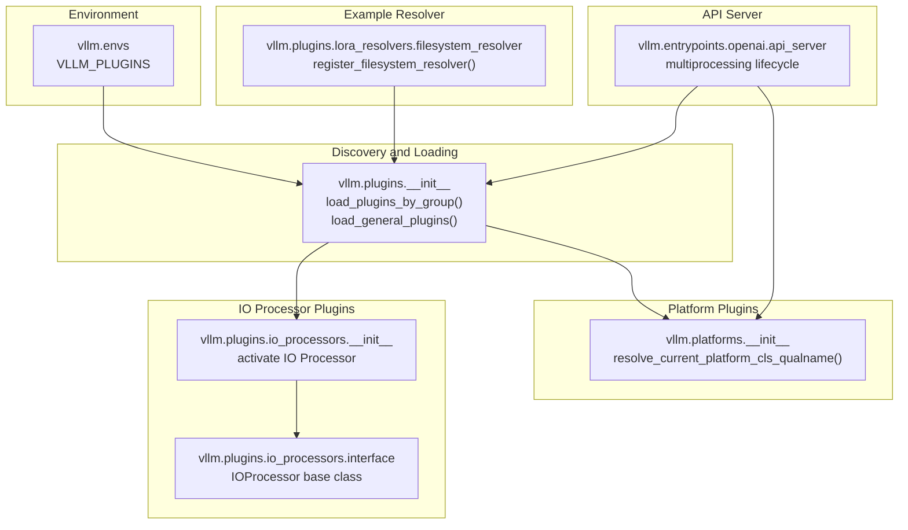
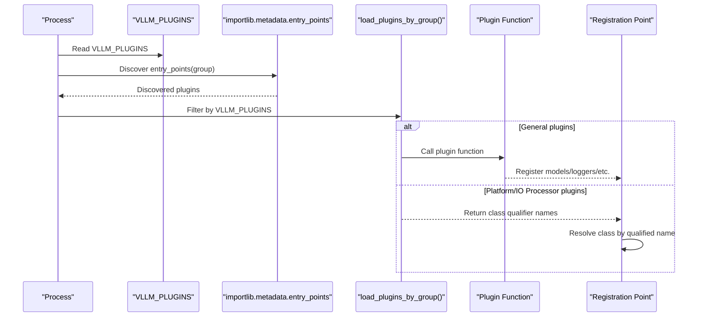
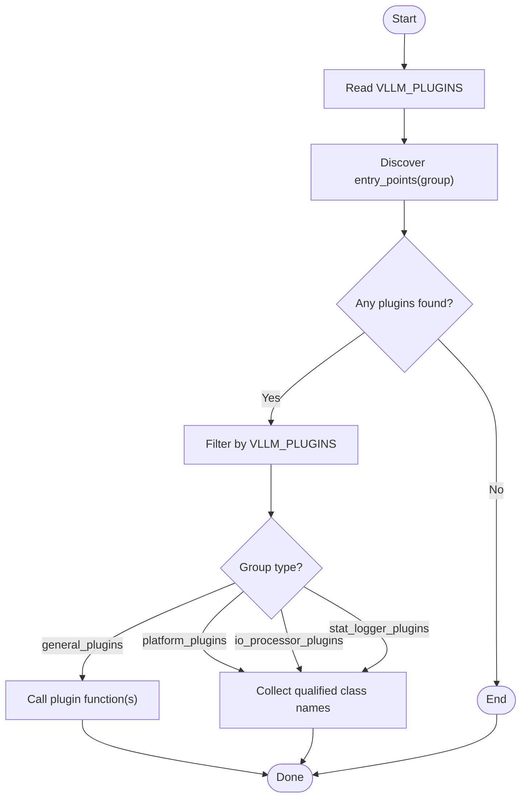
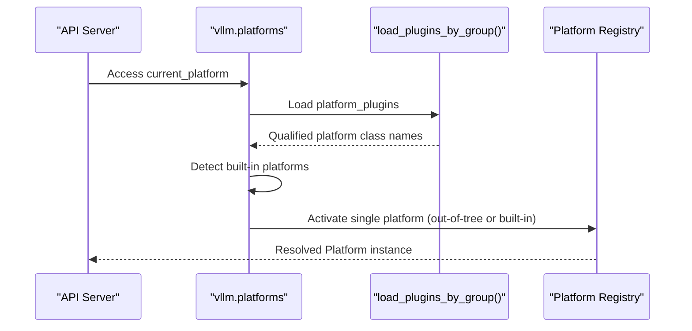
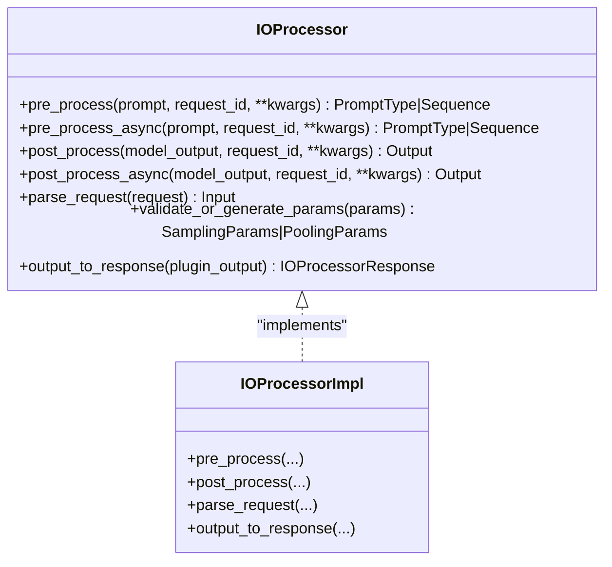
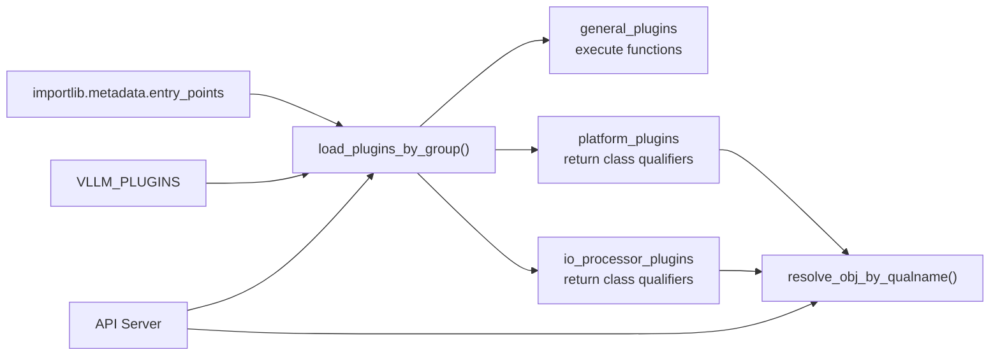

# Plugin Architecture Overview

<cite>
**Referenced Files in This Document**
- [plugin_system.md](file://docs/design/plugin_system.md)
- [plugins/__init__.py](file://vllm/plugins/__init__.py)
- [platforms/__init__.py](file://vllm/platforms/__init__.py)
- [io_processors/__init__.py](file://vllm/plugins/io_processors/__init__.py)
- [io_processors/interface.py](file://vllm/plugins/io_processors/interface.py)
- [envs.py](file://vllm/envs.py)
- [filesystem_resolver.py](file://vllm/plugins/lora_resolvers/filesystem_resolver.py)
- [api_server.py](file://vllm/entrypoints/openai/api_server.py)
</cite>

## Table of Contents
1. [Introduction](#introduction)
2. [Project Structure](#project-structure)
3. [Core Components](#core-components)
4. [Architecture Overview](#architecture-overview)
5. [Detailed Component Analysis](#detailed-component-analysis)
6. [Dependency Analysis](#dependency-analysis)
7. [Performance Considerations](#performance-considerations)
8. [Troubleshooting Guide](#troubleshooting-guide)
9. [Conclusion](#conclusion)

## Introduction
This document explains vLLM’s plugin architecture fundamentals and design principles. It covers how plugins are discovered using Python’s entry_points mechanism, how the load_plugins_by_group function orchestrates plugin loading, and how plugins integrate across multiple processes in distributed inference. It also documents the plugin lifecycle, registration process, execution model, and the roles of the four plugin groups: general_plugins, platform_plugins, io_processor_plugins, and stat_logger_plugins. Finally, it addresses plugin isolation, dependency management, and version compatibility considerations.

## Project Structure
The plugin system spans several modules:
- Discovery and loading: vllm.plugins
- Platform selection and activation: vllm.platforms
- IO processor selection and activation: vllm.plugins.io_processors
- Environment configuration: vllm.envs
- Example plugin resolver: vllm.plugins.lora_resolvers.filesystem_resolver
- API server lifecycle and multiprocess orchestration: vllm.entrypoints.openai.api_server

**Diagram sources**
- [plugins/__init__.py](file://vllm/plugins/__init__.py#L1-L82)
- [platforms/__init__.py](file://vllm/platforms/__init__.py#L182-L231)
- [io_processors/__init__.py](file://vllm/plugins/io_processors/__init__.py#L36-L68)
- [io_processors/interface.py](file://vllm/plugins/io_processors/interface.py#L1-L78)
- [envs.py](file://vllm/envs.py#L80-L90)
- [filesystem_resolver.py](file://vllm/plugins/lora_resolvers/filesystem_resolver.py#L39-L53)
- [api_server.py](file://vllm/entrypoints/openai/api_server.py#L144-L231)

**Section sources**
- [plugin_system.md](file://docs/design/plugin_system.md#L1-L157)
- [plugins/__init__.py](file://vllm/plugins/__init__.py#L1-L82)
- [platforms/__init__.py](file://vllm/platforms/__init__.py#L182-L231)
- [io_processors/__init__.py](file://vllm/plugins/io_processors/__init__.py#L36-L68)
- [io_processors/interface.py](file://vllm/plugins/io_processors/interface.py#L1-L78)
- [envs.py](file://vllm/envs.py#L80-L90)
- [filesystem_resolver.py](file://vllm/plugins/lora_resolvers/filesystem_resolver.py#L39-L53)
- [api_server.py](file://vllm/entrypoints/openai/api_server.py#L144-L231)

## Core Components
- Plugin discovery and loading
  - Uses Python’s importlib.metadata entry_points to enumerate plugins per group.
  - Filters by VLLM_PLUGINS environment variable when provided.
  - Executes plugin functions (for general_plugins) or resolves class names (for platform and IO processor plugins).
- Plugin groups and responsibilities
  - general_plugins: Register custom models and features.
  - platform_plugins: Register out-of-tree platforms; resolved at platform selection time.
  - io_processor_plugins: Register pre-/post-processing classes for pooling tasks.
  - stat_logger_plugins: Register custom statistics loggers (process0 only in async mode).
- Multiprocess integration
  - API server sets multiprocessing start method and preloads modules to ensure plugins are available in worker processes.
  - Platform resolution is lazy and guarded to ensure plugins are loaded before use.

**Section sources**
- [plugin_system.md](file://docs/design/plugin_system.md#L1-L157)
- [plugins/__init__.py](file://vllm/plugins/__init__.py#L1-L82)
- [platforms/__init__.py](file://vllm/platforms/__init__.py#L182-L231)
- [io_processors/__init__.py](file://vllm/plugins/io_processors/__init__.py#L36-L68)
- [envs.py](file://vllm/envs.py#L80-L90)
- [api_server.py](file://vllm/entrypoints/openai/api_server.py#L144-L231)

## Architecture Overview
The plugin architecture integrates discovery, filtering, loading, and activation across processes. The diagram below shows how entry_points are discovered, filtered by environment, and executed or resolved into concrete classes.

**Diagram sources**
- [plugins/__init__.py](file://vllm/plugins/__init__.py#L28-L82)
- [envs.py](file://vllm/envs.py#L80-L90)

**Section sources**
- [plugins/__init__.py](file://vllm/plugins/__init__.py#L28-L82)
- [envs.py](file://vllm/envs.py#L80-L90)

## Detailed Component Analysis

### Plugin Discovery and Loading Mechanism
- Discovery
  - load_plugins_by_group enumerates entry_points for a given group and logs available plugins.
  - If VLLM_PLUGINS is unset, all plugins in the group are considered; if set, only named plugins are loaded.
- Execution model
  - general_plugins: Functions are loaded and invoked immediately.
  - platform_plugins and io_processor_plugins: Functions return qualified class names; the caller resolves them later.
- Isolation and safety
  - Each process independently discovers and loads plugins.
  - Plugins must be re-entrant to tolerate repeated loads across processes.

**Diagram sources**
- [plugins/__init__.py](file://vllm/plugins/__init__.py#L28-L82)
- [envs.py](file://vllm/envs.py#L80-L90)

**Section sources**
- [plugins/__init__.py](file://vllm/plugins/__init__.py#L28-L82)
- [envs.py](file://vllm/envs.py#L80-L90)

### Platform Plugins Lifecycle and Activation
- Discovery and selection
  - Platform plugins are loaded via load_plugins_by_group and combined with built-in platform detectors.
  - Only one platform can be active; conflicts raise errors.
- Lazy initialization
  - current_platform is lazily resolved; plugins are loaded before the first access to ensure availability.
- Out-of-tree platform support
  - Platform plugins return a fully qualified class name; the platform class inherits from the core Platform interface.

**Diagram sources**
- [platforms/__init__.py](file://vllm/platforms/__init__.py#L182-L231)
- [plugins/__init__.py](file://vllm/plugins/__init__.py#L28-L82)

**Section sources**
- [platforms/__init__.py](file://vllm/platforms/__init__.py#L182-L231)
- [plugins/__init__.py](file://vllm/plugins/__init__.py#L28-L82)

### IO Processor Plugins Lifecycle and Activation
- Discovery and selection
  - IO Processor plugins are loaded via load_plugins_by_group; each returns a qualified IOProcessor class name.
  - The system validates that the requested model’s IO Processor is available and activates it.
- Interface contract
  - IOProcessor defines pre_process, post_process, parse_request, validate_or_generate_params, and output_to_response.
- Asynchronous processing
  - Async variants are provided; post_process_async handles unordered outputs by sorting by request id.

**Diagram sources**
- [io_processors/interface.py](file://vllm/plugins/io_processors/interface.py#L1-L78)

**Section sources**
- [io_processors/__init__.py](file://vllm/plugins/io_processors/__init__.py#L36-L68)
- [io_processors/interface.py](file://vllm/plugins/io_processors/interface.py#L1-L78)

### Stat Logger Plugins and General Plugins
- Stat logger plugins
  - Registered via stat_logger_plugins group; loaded in process0 only during async serving.
- General plugins
  - Loaded in all processes; functions typically register models or extend registries.

**Section sources**
- [plugin_system.md](file://docs/design/plugin_system.md#L48-L60)
- [plugins/__init__.py](file://vllm/plugins/__init__.py#L12-L23)

### Example Resolver Plugin: FilesystemResolver
- Demonstrates a plugin that registers a LoRA resolver into the LoRAResolverRegistry.
- Requires a valid cache directory via VLLM_LORA_RESOLVER_CACHE_DIR.

**Section sources**
- [filesystem_resolver.py](file://vllm/plugins/lora_resolvers/filesystem_resolver.py#L39-L53)
- [envs.py](file://vllm/envs.py#L80-L90)

### Multiprocess Integration in Distributed Inference
- API server manages multiprocessing:
  - Sets start method and preloads heavy modules to ensure plugins are available in worker processes.
  - Builds engine clients and manages lifecycle across processes.

**Section sources**
- [api_server.py](file://vllm/entrypoints/openai/api_server.py#L144-L231)

## Dependency Analysis
The plugin system depends on:
- importlib.metadata for entry_points discovery
- Environment variables for filtering and configuration
- Lazy initialization for platform resolution
- Qualified name resolution for class-based plugins

**Diagram sources**
- [plugins/__init__.py](file://vllm/plugins/__init__.py#L28-L82)
- [envs.py](file://vllm/envs.py#L80-L90)
- [platforms/__init__.py](file://vllm/platforms/__init__.py#L182-L231)
- [io_processors/__init__.py](file://vllm/plugins/io_processors/__init__.py#L36-L68)
- [api_server.py](file://vllm/entrypoints/openai/api_server.py#L144-L231)

**Section sources**
- [plugins/__init__.py](file://vllm/plugins/__init__.py#L28-L82)
- [envs.py](file://vllm/envs.py#L80-L90)
- [platforms/__init__.py](file://vllm/platforms/__init__.py#L182-L231)
- [io_processors/__init__.py](file://vllm/plugins/io_processors/__init__.py#L36-L68)
- [api_server.py](file://vllm/entrypoints/openai/api_server.py#L144-L231)

## Performance Considerations
- Minimize heavy work in plugin functions; defer expensive initialization to first use.
- Keep plugins re-entrant to avoid redundant initialization across processes.
- Prefer lazy resolution for platform and IO processor plugins to reduce cold-start overhead.

## Troubleshooting Guide
- No plugins loaded
  - Ensure the plugin package exposes entry_points under the correct group and that the package is installed.
  - Verify VLLM_PLUGINS environment variable if restricting plugin names.
- Platform conflict
  - Only one platform can be active; ensure only one platform plugin is returning a class name.
- IO Processor mismatch
  - The requested model requires a specific IO Processor; confirm the plugin is installed and returns a valid class name.
- Multiprocess visibility
  - Confirm the API server preloads modules and that worker processes are started with the appropriate method.

**Section sources**
- [plugins/__init__.py](file://vllm/plugins/__init__.py#L28-L82)
- [platforms/__init__.py](file://vllm/platforms/__init__.py#L182-L231)
- [io_processors/__init__.py](file://vllm/plugins/io_processors/__init__.py#L36-L68)
- [envs.py](file://vllm/envs.py#L80-L90)
- [api_server.py](file://vllm/entrypoints/openai/api_server.py#L144-L231)

## Conclusion
vLLM’s plugin system leverages Python’s entry_points to discover and load plugins across processes. The load_plugins_by_group function centralizes discovery, filtering, and execution, while specialized groups serve distinct purposes: general_plugins for model and feature registration, platform_plugins for platform selection, io_processor_plugins for pooling IO processing, and stat_logger_plugins for statistics logging. The system emphasizes re-entrancy, lazy initialization, and qualified-name resolution to ensure robust operation in distributed environments. Developers should adhere to the documented guidelines, manage dependencies carefully, and validate version compatibility to maintain reliable plugin behavior.