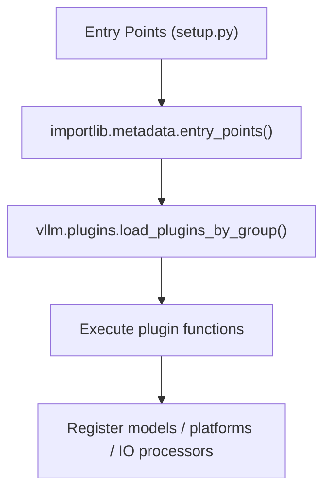
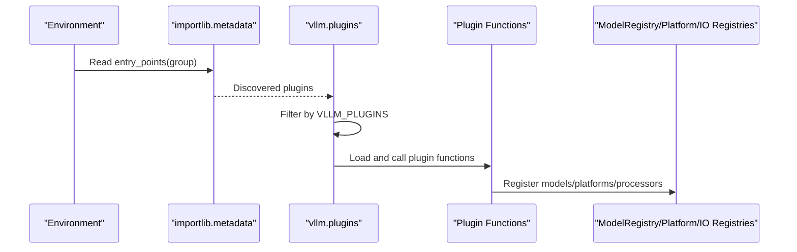
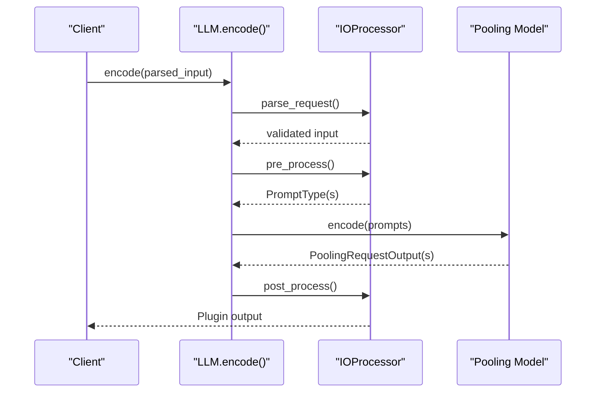
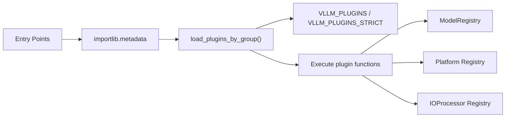

# Plugin Examples and Best Practices

<cite>
**Referenced Files in This Document**
- [plugin_system.md](file://docs/design/plugin_system.md)
- [io_processor_plugins.md](file://docs/design/io_processor_plugins.md)
- [plugins/__init__.py](file://vllm/plugins/__init__.py)
- [prithvi_geospatial_mae_client.py](file://examples/pooling/plugin/prithvi_geospatial_mae_client.py)
- [prithvi_geospatial_mae_io_processor.py](file://examples/pooling/plugin/prithvi_geospatial_mae_io_processor.py)
- [setup.py (vllm_add_dummy_model)](file://tests/plugins/vllm_add_dummy_model/setup.py)
- [setup.py (vllm_add_dummy_platform)](file://tests/plugins/vllm_add_dummy_platform/setup.py)
- [setup.py (prithvi_io_processor_plugin)](file://tests/plugins/prithvi_io_processor_plugin/setup.py)
- [__init__.py (vllm_add_dummy_model)](file://tests/plugins/vllm_add_dummy_model/vllm_add_dummy_model/__init__.py)
- [dummy_platform.py](file://tests/plugins/vllm_add_dummy_platform/vllm_add_dummy_platform/dummy_platform.py)
- [__init__.py (prithvi_io_processor_plugin)](file://tests/plugins/prithvi_io_processor_plugin/prithvi_io_processor/__init__.py)
- [test_io_processor_plugins.py](file://tests/plugins_tests/test_io_processor_plugins.py)
- [test_platform_plugins.py](file://tests/plugins_tests/test_platform_plugins.py)
</cite>

## Table of Contents
1. [Introduction](#introduction)
2. [Project Structure](#project-structure)
3. [Core Components](#core-components)
4. [Architecture Overview](#architecture-overview)
5. [Detailed Component Analysis](#detailed-component-analysis)
6. [Dependency Analysis](#dependency-analysis)
7. [Performance Considerations](#performance-considerations)
8. [Troubleshooting Guide](#troubleshooting-guide)
9. [Conclusion](#conclusion)
10. [Appendices](#appendices)

## Introduction
This document provides comprehensive guidance for developing and maintaining plugins in vLLM. It covers general plugins, platform plugins, and IO processor plugins with practical examples, best practices for architecture and performance, testing strategies, debugging techniques, and operational guidelines. It also includes templates and boilerplate patterns for common plugin scenarios.

## Project Structure
The plugin ecosystem in vLLM is organized around Python entry points and runtime discovery. Plugins are loaded per-process via the vllm.plugins module, which reads entry points from the environment and executes registered functions. Example plugins and tests demonstrate how to register models, platforms, and IO processors.

**Diagram sources**
- [plugins/__init__.py](file://vllm/plugins/__init__.py#L28-L82)
- [plugin_system.md](file://docs/design/plugin_system.md#L1-L60)

**Section sources**
- [plugin_system.md](file://docs/design/plugin_system.md#L1-L60)
- [plugins/__init__.py](file://vllm/plugins/__init__.py#L12-L23)

## Core Components
- Plugin discovery and loading:
  - vLLM discovers plugins via standard Python entry points and filters by the VLLM_PLUGINS environment variable when provided.
  - General plugins are loaded in all processes; IO processor and stat logger plugins are loaded in process 0 only.
- Plugin types:
  - General plugins: Register custom models via ModelRegistry.
  - Platform plugins: Register custom platforms and related worker/backends.
  - IO Processor plugins: Pre/post-process prompts/outputs for pooling models.
- Environment controls:
  - VLLM_PLUGINS: Comma-separated list of plugin names to load.
  - VLLM_PLUGINS_STRICT: Fail fast if any named plugin fails to load.

**Section sources**
- [plugin_system.md](file://docs/design/plugin_system.md#L1-L60)
- [plugins/__init__.py](file://vllm/plugins/__init__.py#L28-L82)

## Architecture Overview
The plugin lifecycle spans discovery, filtering, loading, and execution. Platform plugins influence runtime configuration and worker selection, while IO processor plugins intercept encode flows for pooling models.

**Diagram sources**
- [plugins/__init__.py](file://vllm/plugins/__init__.py#L28-L82)
- [plugin_system.md](file://docs/design/plugin_system.md#L1-L60)

## Detailed Component Analysis

### General Plugins: Registering Custom Models
Purpose:
- Extend vLLM with out-of-tree models by registering them into ModelRegistry.

Key patterns:
- Define an entry point under the general plugins group.
- In the plugin function, call ModelRegistry.register_model with either a class or a lazy dotted path.

Example reference:
- A minimal general plugin registers multiple models and supports both eager and lazy registration.

Best practices:
- Keep the plugin function re-entrant and idempotent.
- Validate model availability before registering.
- Use lazy registration strings to defer imports until needed.

**Section sources**
- [plugin_system.md](file://docs/design/plugin_system.md#L40-L56)
- [setup.py (vllm_add_dummy_model)](file://tests/plugins/vllm_add_dummy_model/setup.py#L1-L14)
- [__init__.py (vllm_add_dummy_model)](file://tests/plugins/vllm_add_dummy_model/vllm_add_dummy_model/__init__.py#L1-L23)

### Platform Plugins: Extending Runtime Platforms
Purpose:
- Add a new platform with associated worker, attention backend, and optional custom ops.

Key patterns:
- Define an entry point under the platform plugins group returning a fully qualified platform class name.
- Implement a Platform subclass with required properties and methods.
- Implement a Worker subclass inheriting from the vLLM worker base.
- Optionally implement attention backends and device communicators.

Example reference:
- A dummy platform demonstrates device metadata, config updates, and attention backend resolution.

Best practices:
- Ensure device_type/device_name align with PyTorch device naming.
- Set worker class in check_and_update_config so vLLM can instantiate the worker.
- Implement only required methods for minimal support; extend incrementally.

**Section sources**
- [plugin_system.md](file://docs/design/plugin_system.md#L60-L157)
- [setup.py (vllm_add_dummy_platform)](file://tests/plugins/vllm_add_dummy_platform/setup.py#L1-L19)
- [dummy_platform.py](file://tests/plugins/vllm_add_dummy_platform/vllm_add_dummy_platform/dummy_platform.py#L1-L36)

### IO Processor Plugins: Pre/Post-Processing for Pooling
Purpose:
- Transform user inputs into model prompts and transform model outputs into plugin outputs for pooling models.

Key patterns:
- Implement the IOProcessor interface with pre_process/post_process and parse_request.
- Expose a registration function returning the fully qualified IOProcessor class.
- Configure via EngineArgs or model config; EngineArgs override model config.

Example reference:
- The Prithvi geospatial plugin demonstrates multimodal input handling and TIFF output generation in offline and online modes.

**Diagram sources**
- [io_processor_plugins.md](file://docs/design/io_processor_plugins.md#L1-L92)
- [prithvi_geospatial_mae_client.py](file://examples/pooling/plugin/prithvi_geospatial_mae_client.py#L1-L57)
- [prithvi_geospatial_mae_io_processor.py](file://examples/pooling/plugin/prithvi_geospatial_mae_io_processor.py#L1-L59)

**Section sources**
- [io_processor_plugins.md](file://docs/design/io_processor_plugins.md#L1-L92)
- [setup.py (prithvi_io_processor_plugin)](file://tests/plugins/prithvi_io_processor_plugin/setup.py#L1-L16)
- [__init__.py (prithvi_io_processor_plugin)](file://tests/plugins/prithvi_io_processor_plugin/prithvi_io_processor/__init__.py#L1-L7)

### Testing Strategies for Plugins
- Unit-style tests:
  - Verify plugin registration functions return expected values.
  - Validate that entry points resolve and load without exceptions.
- Integration tests:
  - Confirm that models/platforms appear in registries after plugin load.
  - For IO processors, validate encode flows produce expected outputs.

Example references:
- Tests for platform and IO processor plugins validate plugin loading and registration behavior.

**Section sources**
- [test_platform_plugins.py](file://tests/plugins_tests/test_platform_plugins.py)
- [test_io_processor_plugins.py](file://tests/plugins_tests/test_io_processor_plugins.py)

## Dependency Analysis
Plugin discovery relies on Python’s entry_points mechanism and environment variables. The loader filters discovered plugins and executes them once per process. Platform plugins influence runtime configuration and worker selection, while IO processor plugins are scoped to process 0.

**Diagram sources**
- [plugins/__init__.py](file://vllm/plugins/__init__.py#L28-L82)
- [plugin_system.md](file://docs/design/plugin_system.md#L1-L60)

**Section sources**
- [plugins/__init__.py](file://vllm/plugins/__init__.py#L28-L82)
- [plugin_system.md](file://docs/design/plugin_system.md#L1-L60)

## Performance Considerations
- Keep plugin functions lightweight and re-entrant to avoid repeated overhead.
- Prefer lazy registration strings to delay heavy imports.
- For platform plugins, minimize expensive checks in check_and_update_config.
- For IO processors, keep pre/post-processing efficient and avoid unnecessary allocations.
- Use VLLM_PLUGINS to limit loaded plugins in constrained environments.

[No sources needed since this section provides general guidance]

## Troubleshooting Guide
Common issues and resolutions:
- Plugin not loading:
  - Verify entry point group and name match documented groups.
  - Ensure the package is installed in the environment where vLLM runs.
  - Check VLLM_PLUGINS filter and VLLM_PLUGINS_STRICT behavior.
- Model not recognized:
  - Confirm ModelRegistry contains the expected model after plugin load.
  - Validate lazy registration strings are correct.
- Platform mismatch:
  - Ensure Platform.check_and_update_config sets the worker class and attention backend.
  - Confirm device_type/device_name match the intended device.
- IO processor not applied:
  - Confirm EngineArgs or model config specifies the plugin.
  - Validate parse_request and pre_process return expected prompt types.

**Section sources**
- [plugin_system.md](file://docs/design/plugin_system.md#L1-L60)
- [plugins/__init__.py](file://vllm/plugins/__init__.py#L28-L82)

## Conclusion
Plugins enable powerful extensibility in vLLM without modifying core code. By following the documented patterns for general, platform, and IO processor plugins, you can safely integrate custom models, platforms, and preprocessing logic. Use the provided examples and tests as templates, adhere to best practices for performance and reliability, and leverage environment controls for safe deployment.

[No sources needed since this section summarizes without analyzing specific files]

## Appendices

### Templates and Boilerplate Patterns

- General plugin template outline:
  - Define an entry point under the general plugins group.
  - In the plugin function, guard against duplicates and register models via ModelRegistry (both eager and lazy forms).
  - Keep the function re-entrant and free of side effects.

- Platform plugin template outline:
  - Define an entry point under the platform plugins group returning a platform class name.
  - Implement a Platform subclass with required properties and methods, including check_and_update_config and get_attn_backend_cls.
  - Implement a Worker subclass inheriting from the vLLM worker base with minimal required methods.

- IO Processor plugin template outline:
  - Implement the IOProcessor interface with parse_request, pre_process/post_process, and output_to_response.
  - Provide a registration function returning the fully qualified IOProcessor class.
  - Configure via EngineArgs or model config; note precedence rules.

**Section sources**
- [plugin_system.md](file://docs/design/plugin_system.md#L40-L157)
- [io_processor_plugins.md](file://docs/design/io_processor_plugins.md#L1-L92)
- [setup.py (vllm_add_dummy_model)](file://tests/plugins/vllm_add_dummy_model/setup.py#L1-L14)
- [setup.py (vllm_add_dummy_platform)](file://tests/plugins/vllm_add_dummy_platform/setup.py#L1-L19)
- [setup.py (prithvi_io_processor_plugin)](file://tests/plugins/prithvi_io_processor_plugin/setup.py#L1-L16)

### Example References
- Offline IO processor example:
  - Demonstrates configuring an IO processor plugin and invoking encode for multimodal output.

- Online IO processor example:
  - Demonstrates serving mode with an IO processor plugin and posting to the pooling endpoint.

**Section sources**
- [prithvi_geospatial_mae_io_processor.py](file://examples/pooling/plugin/prithvi_geospatial_mae_io_processor.py#L1-L59)
- [prithvi_geospatial_mae_client.py](file://examples/pooling/plugin/prithvi_geospatial_mae_client.py#L1-L57)