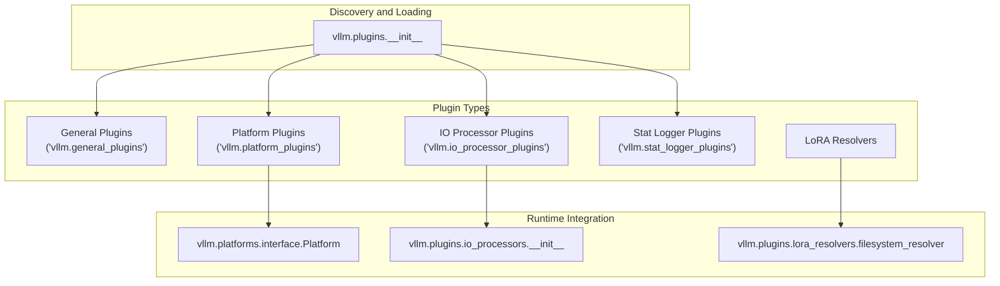
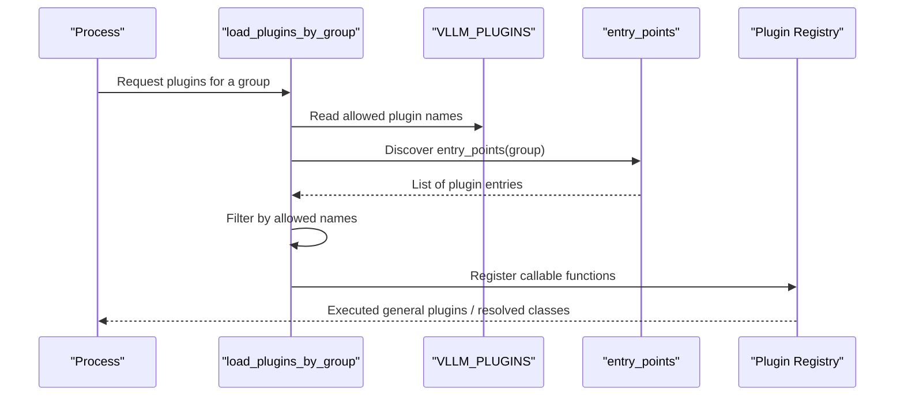
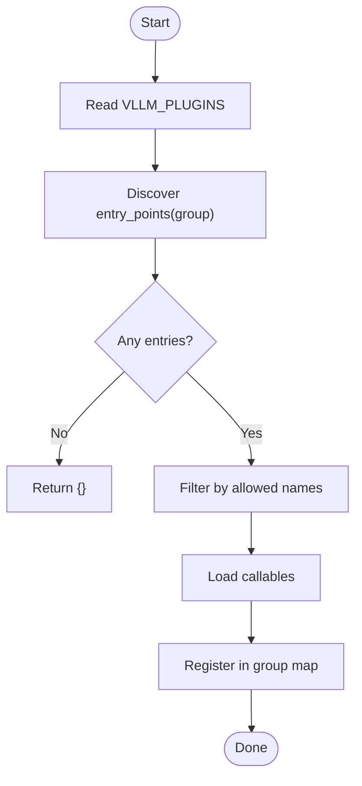
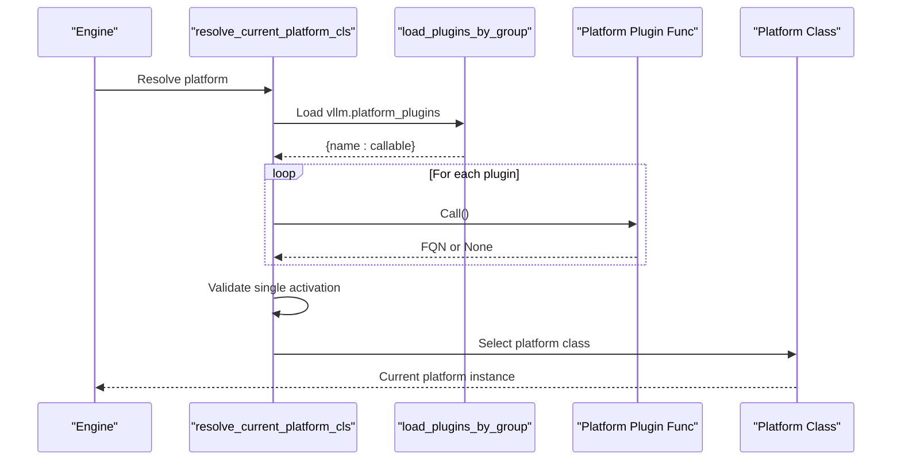
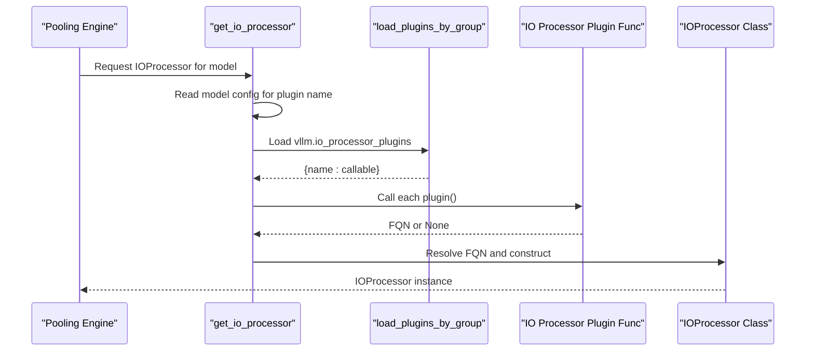
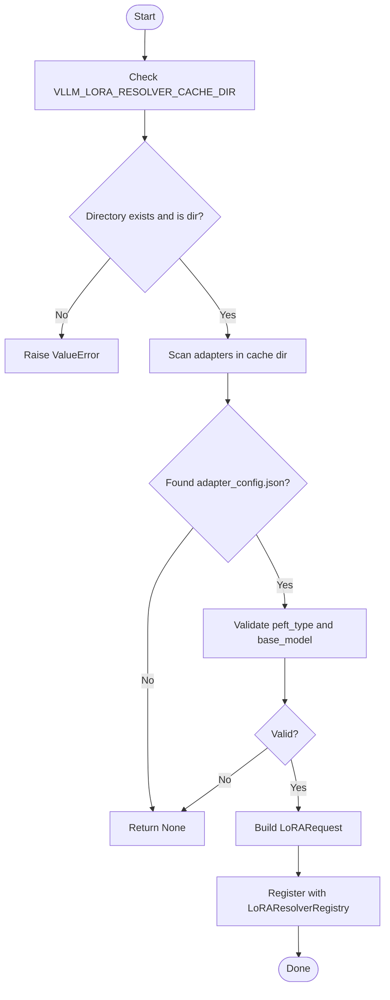
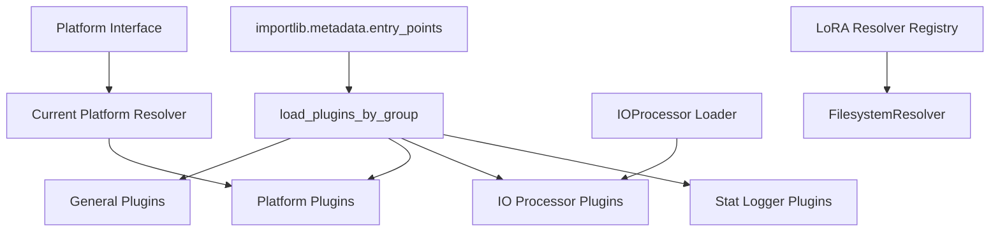

# Plugin System

<cite>
**Referenced Files in This Document**
- [plugin_system.md](file://docs/design/plugin_system.md)
- [__init__.py](file://vllm/plugins/__init__.py)
- [interface.py](file://vllm/plugins/io_processors/interface.py)
- [__init__.py](file://vllm/plugins/io_processors/__init__.py)
- [filesystem_resolver.py](file://vllm/plugins/lora_resolvers/filesystem_resolver.py)
- [interface.py](file://vllm/platforms/interface.py)
- [__init__.py](file://vllm/platforms/__init__.py)
- [setup.py](file://tests/plugins/vllm_add_dummy_platform/setup.py)
- [setup.py](file://tests/plugins/vllm_add_dummy_model/setup.py)
- [setup.py](file://tests/plugins/vllm_add_dummy_stat_logger/setup.py)
- [setup.py](file://tests/plugins/prithvi_io_processor_plugin/setup.py)
- [test_platform_plugins.py](file://tests/plugins_tests/test_platform_plugins.py)
- [test_io_processor_plugins.py](file://tests/plugins_tests/test_io_processor_plugins.py)
- [test_stats_logger_plugins.py](file://tests/plugins_tests/test_stats_logger_plugins.py)
- [registry.py](file://vllm/utils/registry.py)
</cite>

## Table of Contents
1. [Introduction](#introduction)
2. [Project Structure](#project-structure)
3. [Core Components](#core-components)
4. [Architecture Overview](#architecture-overview)
5. [Detailed Component Analysis](#detailed-component-analysis)
6. [Dependency Analysis](#dependency-analysis)
7. [Performance Considerations](#performance-considerations)
8. [Troubleshooting Guide](#troubleshooting-guide)
9. [Conclusion](#conclusion)
10. [Appendices](#appendices)

## Introduction
This document explains vLLM’s plugin system: how plugins are discovered, loaded, and integrated across the system. It covers the plugin architecture overview, discovery mechanisms, and extension points. It documents the main plugin categories (general, platform, IO processor, stat logger) and introduces LoRA resolvers as a specialized resolver extension. It also provides development guidelines, API contracts, configuration and deployment strategies, and practical examples drawn from the repository’s tests and documentation.

## Project Structure
The plugin system spans several modules:
- Discovery and loading: vllm.plugins
- IO processor plugins: vllm.plugins.io_processors
- LoRA resolvers: vllm.plugins.lora_resolvers
- Platform abstraction: vllm.platforms
- Tests and examples: tests/plugins and tests/plugins_tests
- Documentation: docs/design/plugin_system.md

**Diagram sources**
- [__init__.py](file://vllm/plugins/__init__.py#L12-L23)
- [__init__.py](file://vllm/plugins/io_processors/__init__.py#L1-L20)
- [interface.py](file://vllm/platforms/interface.py#L100-L120)
- [filesystem_resolver.py](file://vllm/plugins/lora_resolvers/filesystem_resolver.py#L1-L20)

**Section sources**
- [plugin_system.md](file://docs/design/plugin_system.md#L1-L55)
- [__init__.py](file://vllm/plugins/__init__.py#L12-L23)

## Core Components
- Plugin discovery and loading
  - Uses Python entry_points under specific groups.
  - Supports filtering via VLLM_PLUGINS environment variable.
  - General plugins are executed once per process; platform and IO processor plugins are resolved by name or via model config.
- IO Processor plugins
  - Provide pre/post-processing for pooling models and return a fully qualified class name.
  - Loaded by name from model config or constructor override.
- Platform plugins
  - Return a platform class fully qualified name; only one platform plugin is allowed.
  - Used to select the current platform and worker implementation.
- LoRA resolvers
  - Extend LoRA resolution beyond built-in mechanisms; example registers a filesystem-based resolver.

**Section sources**
- [plugin_system.md](file://docs/design/plugin_system.md#L9-L55)
- [__init__.py](file://vllm/plugins/__init__.py#L28-L66)
- [__init__.py](file://vllm/plugins/io_processors/__init__.py#L14-L68)
- [interface.py](file://vllm/platforms/interface.py#L100-L120)
- [filesystem_resolver.py](file://vllm/plugins/lora_resolvers/filesystem_resolver.py#L39-L53)

## Architecture Overview
The plugin system is centered around entry_points and a small runtime loader. Processes load plugins according to group membership and environment configuration. Platform selection resolves a single platform class; IO processor selection resolves a specific processor by name; LoRA resolvers are registered into a resolver registry.

**Diagram sources**
- [__init__.py](file://vllm/plugins/__init__.py#L28-L66)
- [plugin_system.md](file://docs/design/plugin_system.md#L9-L45)

## Detailed Component Analysis

### Plugin Discovery and Loading
- Groups and behavior
  - Default group: vllm.general_plugins (executed automatically)
  - IO processor group: vllm.io_processor_plugins (loaded in process0)
  - Platform group: vllm.platform_plugins (loaded when current platform is resolved)
  - Stat logger group: vllm.stat_logger_plugins (loaded in process0 in async serve)
- Filtering
  - VLLM_PLUGINS controls which plugins to load by name.
- Execution
  - General plugins are executed once per process; other plugin types are resolved by name.

**Diagram sources**
- [__init__.py](file://vllm/plugins/__init__.py#L28-L66)

**Section sources**
- [__init__.py](file://vllm/plugins/__init__.py#L12-L23)
- [__init__.py](file://vllm/plugins/__init__.py#L28-L66)
- [plugin_system.md](file://docs/design/plugin_system.md#L9-L45)

### Platform Plugins
- Purpose
  - Register custom platforms and workers for out-of-tree hardware.
- Selection logic
  - Only one platform plugin is allowed; duplicates raise an error.
  - Falls back to unspecified platform if none detected.
- Required contract
  - Return a platform class fully qualified name from the plugin function.
  - Platform class must implement required properties and methods (e.g., device_type, check_and_update_config, get_attn_backend_cls, get_device_communicator_cls).

**Diagram sources**
- [__init__.py](file://vllm/platforms/__init__.py#L191-L231)
- [__init__.py](file://vllm/plugins/__init__.py#L28-L66)
- [plugin_system.md](file://docs/design/plugin_system.md#L50-L57)

**Section sources**
- [__init__.py](file://vllm/platforms/__init__.py#L191-L231)
- [plugin_system.md](file://docs/design/plugin_system.md#L50-L57)
- [interface.py](file://vllm/platforms/interface.py#L100-L120)

### IO Processor Plugins
- Purpose
  - Provide pre-/post-processing for pooling models’ prompts and outputs.
- Resolution
  - Name can be specified via model config or passed to the loader.
  - Only one IO processor is selected by name; missing or mismatched names cause errors.
- Contract
  - Return a fully qualified IOProcessor class name from the plugin function.
  - IOProcessor defines pre_process, post_process, parse_request, validate_or_generate_params, and output_to_response.

**Diagram sources**
- [__init__.py](file://vllm/plugins/io_processors/__init__.py#L14-L68)
- [__init__.py](file://vllm/plugins/__init__.py#L28-L66)
- [interface.py](file://vllm/plugins/io_processors/interface.py#L19-L78)

**Section sources**
- [__init__.py](file://vllm/plugins/io_processors/__init__.py#L14-L68)
- [interface.py](file://vllm/plugins/io_processors/interface.py#L19-L78)

### LoRA Resolvers
- Purpose
  - Extend LoRA adapter resolution beyond built-ins (e.g., filesystem-based lookup).
- Registration
  - Resolver is registered into a resolver registry after validating cache directory.
- Example
  - FilesystemResolver checks for adapter_config.json and base_model compatibility, then emits a LoRARequest.

**Diagram sources**
- [filesystem_resolver.py](file://vllm/plugins/lora_resolvers/filesystem_resolver.py#L1-L53)

**Section sources**
- [filesystem_resolver.py](file://vllm/plugins/lora_resolvers/filesystem_resolver.py#L1-L53)

### General Plugins
- Purpose
  - Register custom models and other general-purpose extensions.
- Mechanism
  - Functions are executed once per process; must be re-entrant.

**Section sources**
- [plugin_system.md](file://docs/design/plugin_system.md#L46-L49)
- [__init__.py](file://vllm/plugins/__init__.py#L68-L82)

### Stat Logger Plugins
- Purpose
  - Register custom stat loggers for async serving scenarios.
- Mechanism
  - Entry point should be a class subclassing the base stat logger.

**Section sources**
- [plugin_system.md](file://docs/design/plugin_system.md#L52-L55)

## Dependency Analysis
- Coupling
  - Discovery depends on importlib.metadata and setuptools entry_points.
  - Platform selection couples to the platform interface and worker base classes.
  - IO processor selection couples to the IOProcessor interface and model config.
  - LoRA resolver registration couples to the resolver registry.
- Cohesion
  - Each plugin group encapsulates a distinct responsibility and lifecycle.
- External dependencies
  - setuptools for entry_points.
  - Environment variables for filtering and configuration.

**Diagram sources**
- [__init__.py](file://vllm/plugins/__init__.py#L28-L66)
- [__init__.py](file://vllm/platforms/__init__.py#L191-L231)
- [__init__.py](file://vllm/plugins/io_processors/__init__.py#L14-L68)
- [filesystem_resolver.py](file://vllm/plugins/lora_resolvers/filesystem_resolver.py#L39-L53)

**Section sources**
- [__init__.py](file://vllm/plugins/__init__.py#L28-L66)
- [__init__.py](file://vllm/platforms/__init__.py#L191-L231)
- [__init__.py](file://vllm/plugins/io_processors/__init__.py#L14-L68)
- [filesystem_resolver.py](file://vllm/plugins/lora_resolvers/filesystem_resolver.py#L39-L53)

## Performance Considerations
- Minimize heavy work in plugin entry points; keep them re-entrant and lightweight.
- Prefer lazy instantiation of processors and resolvers.
- Avoid blocking operations in platform detection; return early when not supported.
- Use environment variables to limit plugin surface area in constrained environments.

[No sources needed since this section provides general guidance]

## Troubleshooting Guide
- No plugins discovered
  - Ensure the correct entry_points group is used and packages are installed.
- Only one platform plugin allowed
  - Remove duplicates; only one platform plugin can be active.
- IO processor not found
  - Confirm the model config specifies the correct plugin name and that the plugin returns a valid class name.
- LoRA resolver not functioning
  - Verify VLLM_LORA_RESOLVER_CACHE_DIR points to a valid directory and adapter_config.json is present and correct.

**Section sources**
- [__init__.py](file://vllm/platforms/__init__.py#L210-L218)
- [__init__.py](file://vllm/plugins/io_processors/__init__.py#L53-L68)
- [filesystem_resolver.py](file://vllm/plugins/lora_resolvers/filesystem_resolver.py#L42-L49)

## Conclusion
vLLM’s plugin system leverages standard Python entry_points to enable modular extension across general features, platform backends, IO processing, and LoRA resolution. The design emphasizes explicit contracts, controlled discovery via environment variables, and clear selection semantics (single platform, named IO processor). Following the documented guidelines ensures portable, maintainable plugins.

[No sources needed since this section summarizes without analyzing specific files]

## Appendices

### Plugin Development Guidelines
- Re-entrancy
  - Plugin entry points must be safe to call multiple times.
- Platform plugins
  - Implement required properties and methods; return a fully qualified platform class name.
- IO Processor plugins
  - Implement the IOProcessor interface and return a fully qualified class name.
- LoRA resolvers
  - Validate inputs and register with the resolver registry.

**Section sources**
- [plugin_system.md](file://docs/design/plugin_system.md#L56-L57)
- [plugin_system.md](file://docs/design/plugin_system.md#L60-L144)
- [interface.py](file://vllm/plugins/io_processors/interface.py#L19-L78)
- [filesystem_resolver.py](file://vllm/plugins/lora_resolvers/filesystem_resolver.py#L39-L53)

### API Contracts
- Platform plugins
  - Function returns a platform class fully qualified name or None.
- IO Processor plugins
  - Function returns an IOProcessor class fully qualified name or None.
- General plugins
  - Function performs registration and returns None.
- Stat logger plugins
  - Entry point is a class inheriting from the base stat logger.

**Section sources**
- [plugin_system.md](file://docs/design/plugin_system.md#L46-L55)
- [__init__.py](file://vllm/plugins/__init__.py#L28-L66)

### Integration Patterns
- Environment-driven selection
  - Use VLLM_PLUGINS to restrict loaded plugins.
- Model-configured IO processors
  - Specify io_processor_plugin in model config for pooling models.
- Resolver registration
  - Register resolvers at import-time or plugin load-time.

**Section sources**
- [__init__.py](file://vllm/plugins/__init__.py#L31-L51)
- [__init__.py](file://vllm/plugins/io_processors/__init__.py#L22-L31)
- [filesystem_resolver.py](file://vllm/plugins/lora_resolvers/filesystem_resolver.py#L39-L53)

### Practical Examples
- Platform plugin example
  - Entry points defined for platform and general plugins.
- Model plugin example
  - Registers a custom model via general plugin.
- Stat logger plugin example
  - Registers a custom stat logger class.
- IO processor plugin example
  - Registers a processor function returning a fully qualified class name.

**Section sources**
- [setup.py](file://tests/plugins/vllm_add_dummy_platform/setup.py#L1-L19)
- [setup.py](file://tests/plugins/vllm_add_dummy_model/setup.py#L1-L14)
- [setup.py](file://tests/plugins/vllm_add_dummy_stat_logger/setup.py#L1-L16)
- [setup.py](file://tests/plugins/prithvi_io_processor_plugin/setup.py#L1-L16)

### Testing and Validation
- Platform plugin tests
  - Validate platform selection and activation.
- IO processor plugin tests
  - Validate processor resolution and error conditions.
- Stat logger plugin tests
  - Validate stat logger registration and usage.

**Section sources**
- [test_platform_plugins.py](file://tests/plugins_tests/test_platform_plugins.py)
- [test_io_processor_plugins.py](file://tests/plugins_tests/test_io_processor_plugins.py)
- [test_stats_logger_plugins.py](file://tests/plugins_tests/test_stats_logger_plugins.py)

### Extension Manager Utility
- A generic registry pattern is available for managing pluggable extension classes by name.

**Section sources**
- [registry.py](file://vllm/utils/registry.py#L1-L51)